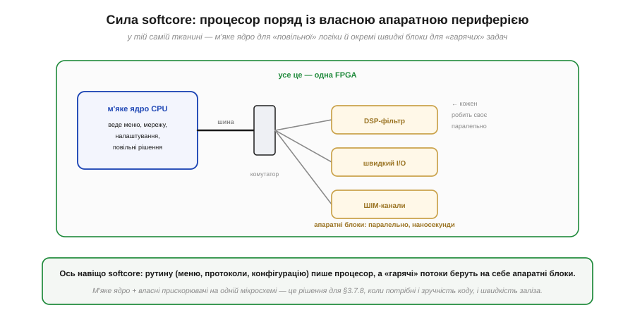
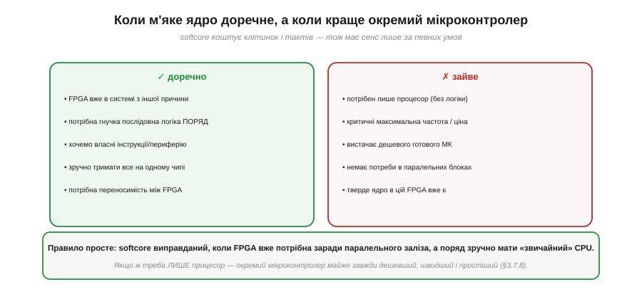

# М'яке ядро: процесор усередині FPGA (softcore)

Зазвичай [FPGA протиставляють процесорові](book:electronics/fpga-vs-mcu): паралельне залізо проти послідовних інструкцій. Та є несподіваний поворот — можна покласти **процесор усередину FPGA**, зібравши його з тих самих LUT і тригерів, що й решту схеми. Звучить як суперечність, але насправді це природний наслідок головної властивості програмованої логіки: якщо FPGA вміє стати **будь-якою** цифровою схемою, то вміє стати й процесором, бо [процесор — теж цифрова схема](book:programming/what-is-processor). Такий процесор зветься **м'яким ядром** (*soft core*, softcore). Розгляньмо, що це таке і, головне, **коли** воно має сенс — почавши з того, чим м'яке ядро відрізняється від звичного.

### Тверде ядро проти м'якого

Процесор усередині чипа з FPGA буває двох ґатунків, і їх важливо не плутати. **Тверде ядро** (*hard core*) — це готовий процесор, випалений у кремнії поряд із тканиною. **М'яке ядро** — процесор, **зібраний** із програмованих клітинок самої тканини.

*Рис. **Тверде ядро**: справжній CPU, випалений у кремнії поруч із тканиною FPGA, — швидкий і компактний, але **фіксований** (його не зміниш). **М'яке ядро**: той самий процесор, але «намальований» у тканині з [LUT і тригерів](book:electronics/inside-fpga), — повільніший і більший, зате **гнучкий**, переписуваний і додається тоді, коли потрібен.*

Різниця між ними — це знайомий компроміс «спеціалізоване проти універсального», тільки всередині одного чипа. **Тверде ядро** — як [спеціальні блоки BRAM і DSP](book:electronics/inside-fpga): зроблене в кремнії заздалегідь, тож працює на повній швидкості й займає мало місця, але його **не переробиш** — який є, такий є. **М'яке ядро** будується з універсальної тканини, як і будь-яка ваша логіка, тож воно повільніше (бо складене з LUT, а не виточене в кремнії) і з'їдає клітинки, зате його можна **налаштувати під себе**, перенести на інший чип і додати рівно тоді, коли треба, не змінюючи мікросхему. Саме гнучкість м'якого ядра й робить його цікавим — особливо у поєднанні з рештою тканини.

### Сила softcore: процесор поряд із власним залізом

Найцінніше в м'якому ядрі розкривається, коли воно працює **не саме**, а в парі зі спеціалізованими апаратними блоками в тій самій тканині. Тоді кожна частина робить те, що їй найкраще вдається.

*Рис. В одній FPGA: **м'яке ядро** веде «повільну» рутину (меню, мережу, налаштування, неспішні рішення), а поряд — окремі **апаратні блоки** (DSP-фільтр, швидкий ввід-вивід, ШІМ-канали), що беруть на себе «гарячі» потоки. Процесор і прискорювачі спілкуються шиною; кожен прискорювач працює паралельно й реагує за наносекунди.*

Ось де гібрид показує справжню силу й знімає уявну суперечність. Є відома [дилема FPGA проти мікроконтролера](book:electronics/fpga-vs-mcu): FPGA незрівнянна в паралельному залізі, але складна послідовна логіка — меню, протоколи, конфігурація — лягає на неї громіздко. М'яке ядро розв'язує цю дилему **всередині однієї мікросхеми**: рутину пише **процесор** (зручно, звичним кодом, як на будь-якому МК), а «гарячі» паралельні потоки беруть на себе [**апаратні блоки** поряд](book:electronics/programmable-logic) (швидко, з наносекундною затримкою). Виходить найкраще з обох світів: гнучкість програмування там, де вона доречна, і паралельна швидкість заліза там, де потрібна вона. Понад те, до м'якого ядра можна **долучати власну периферію** прямо в тканині — навіть додавати **свої інструкції**, яких немає в жодному готовому процесорі. Та попри всю принадність, м'яке ядро доречне не завжди — і чесно окреслити межі важливо.

### Коли це має сенс, а коли ні

М'яке ядро — спокуслива ідея, тож варто тверезо назвати, **коли** воно виправдане, а коли краще взяти окремий мікроконтролер. Адже softcore не безкоштовний: він з'їдає клітинки й працює повільніше за «справжній» процесор того ж класу.

*Рис. **Доречно**: FPGA вже в системі з іншої причини; потрібна гнучка послідовна логіка поряд зі швидким залізом; хочеться власних інструкцій чи периферії; зручно тримати все на одному чипі; потрібна переносимість між FPGA. **Зайве**: потрібен лише процесор без логіки; критичні максимальна частота чи ціна; вистачає дешевого готового МК; немає паралельних блоків; у цій FPGA вже є тверде ядро.*

Правило, що випливає з цього зіставлення, просте й чесне. М'яке ядро виправдане тоді, коли FPGA **вже потрібна** заради паралельного заліза, а поряд зручно мати «звичайний» процесор для рутини — тоді softcore економить окрему мікросхему й тримає все в одному чипі, ще й дає гнучкість власних інструкцій і переносимість. Натомість якщо вам потрібен **лише** процесор — без паралельної логіки, без наносекундних блоків, — [окремий мікроконтролер майже завжди буде **дешевшим, швидшим і простішим**](book:electronics/fpga-vs-mcu): не платіть тканиною FPGA за те, що готовий МК робить краще й за копійки. М'яке ядро — не заміна мікроконтролеру, а **доповнення** до FPGA там, де процесорна зручність потрібна поруч із паралельним залізом. У цьому й увесь сенс: воно живе не замість одного зі світів, а на містку між ними.

> 🔧 **Навіщо це.** Практична користь — **не сприймати softcore як безкоштовний обід і не плутати його роль**. По-перше, м'яке ядро — це варіант лише тоді, коли **FPGA вже у вашому проєкті** з паралельних причин; тягнути FPGA **заради** softcore майже завжди [гірше за окремий МК](book:electronics/fpga-vs-mcu) — дорожче, повільніше, складніше. По-друге, його справжня цінність — у **гібриді**: процесор веде рутину (меню, протоколи, конфігурацію), а апаратні блоки поряд тягнуть паралельні потоки; розподіляйте роботу за цим принципом. По-третє, пам'ятайте про **ціну в ресурсах**: softcore з'їдає [LUT, тригери й BRAM](book:electronics/inside-fpga), які могли б піти на корисну логіку, тож беріть найпростіше ядро, що покриває потребу. Розумно вжите м'яке ядро дає рідкісне поєднання — гнучкість коду й швидкість заліза на одному кристалі; невдало вжите — лише марнує ресурси.
