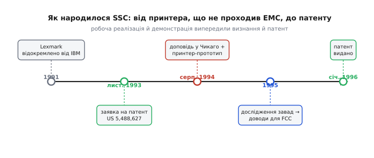

# 📜 Принтер, що не проходив EMC: як у Lexmark народилося SSC

Найкращі інженерні винаходи майже завжди починаються не з натхнення, а з роздратування — з конкретної залізяки на столі, яка вперто не хоче працювати так, як мусить. Історія модуляції тактового спектру не виняток. Вона починається з лазерного принтера, який був готовий до продажу, коштував мільйони в розробці — і не міг отримати дозвіл виходити на ринок, бо світив у ефір одну-єдину зайву спицю радіозавад. Розберімо, як із цієї дрібної, майже принизливої проблеми народився метод, що сьогодні тихо працює всередині майже кожного комп'ютера, монітора й контролера пам'яті на планеті.

## Компанія, якої ще вчора не було

Спершу — хто взагалі це зробив, бо тут легко наплутати. Метод SSC винайшли не в IBM і не в жодній із великих напівпровідникових фірм, як часом пишуть навскіс. Його винайшли в **Lexmark International** — компанії, яка на момент винаходу існувала всього кілька років.

Історія Lexmark сама по собі повчальна. **27 березня 1991 року** інвестиційна фірма Clayton & Dubilier завершила викуп із важелем (англ. *leveraged buyout* — купівля компанії переважно за позичені гроші) підрозділу IBM Information Products — того, що виробляв принтери, друкарські машинки й клавіатури. Так із частини IBM постала окрема компанія зі штаб-квартирою в **Лексингтоні, штат Кентуккі** (звідси й «Lex-» у назві). Разом із заводом у Кентуккі новій фірмі дісталися десятиліття інженерної школи IBM у лазерному й струменевому друці — і, що важливо для нашої історії, ціла команда інженерів з електромагнітної сумісності, які цю школу успадкували.

Тому коли в джерелах трапляється «інженери зі спін-офу IBM» — це точно. Але клеїти сам винахід ярликом «IBM» було б неправильно: до серпня 1994-го Lexmark уже три роки була самостійною компанією, і метод розробили її люди, під її ім'ям, і патент дістався саме їй. Розрізняти корпоративне коріння й авторство тут не педантизм, а точність: коріння — IBM, автор — Lexmark.

> 🔧 **Навіщо це.** Ця родовідна пояснює одну дрібну загадку, на яку натрапляєш у старих джерелах: коли головний інженер FCC уперше публічно засумнівався в законності методу (про це — далі), він за звичкою звернувся «до IBM» з вимогою довести, що технологія працює. Формально помилка — компанія вже звалася Lexmark; по суті — данина тому, що в очах галузі це все ще була «та сама принтерна школа IBM». Історія технології часто тягне за собою старі імена ще довго після того, як таблички на дверях помінялися.

## Чому саме лазерний принтер приперло до стіни

Тепер — сама проблема, і чому вона вистрелила саме в принтері, а не деінде. Щоб зрозуміти мотивацію винахідників, треба відчути ту конкретну безвихідь, у якій вони опинилися.

Будь-який цифровий пристрій перед продажем мусить пройти випробування на **електромагнітну сумісність** (EMC): його садять в екрановану камеру й міряють, скільки радіозавад він випромінює на кожній частоті. Норматив задає стелю — криву, яку показ не має перетинати. Проблема цифрової техніки в тому, що її тактовий сигнал — це, по суті, прямокутна хвиля, а прямокутна хвиля за Фур'є розкладається на гребінець гострих гармонік на кратних частотах. Кожна гармоніка — тонка, висока спектральна спиця, і доріжки та кабелі охоче випромінюють її, як антени. Часто рівно одна така спиця вилазить на кілька децибел над дозволену межу — і все, сертифіката немає.

Лазерний принтер початку 90-х був для цієї біди майже ідеальною жертвою, і аж кілька причин збіглися водночас. По-перше, він великий і повний довгих провідників: шлейфи до механізму подавання паперу, до лазерного блока, до термофіксатора, метрові джгути живлення — усе це чудові антени саме на тих частотах, де живуть тактові гармоніки. По-друге, всередині вже стояв не один такт: контролер форматування сторінки, обробник растру, керування двигунами — кілька тактових доменів, кожен зі своїм гребінцем спиць. По-третє — і це головне — принтер продають масово й у житло, тож на нього поширюються суворіші **побутові** норми випромінювання (у США — клас B за правилами FCC, помітно жорсткіший за «промисловий» клас A). Стеля низька, антен багато, тактів кілька — ідеальний рецепт для того, щоб на випробуванні вилізла зрадлива спиця.

І ось інженер стоїть перед цією спицею. Класичні способи її прибрати впираються в стіну кожен по-своєму. Заекранувати весь принтер металом — дорого, важко, гріється, та й отвори для паперу нікуди не діти. Поставити фільтри й фери на кожен джгут — допомагає, але це десятки додаткових деталей, кожна коштує грошей на мільйонному тиражі, і все одно не завжди тягне спицю під межу. Уповільнити фронти такту, щоб приглушити дальні гармоніки, — псує роботу самої цифри. А головне: спиця стоїть **на гармоніці такту**, а такт викинути не можна — на ньому тримається весь пристрій. Енергію нема ні як прибрати, ні куди подіти.

Саме в цьому глухому куті й народжується зухвала думка, з якої все починається: якщо енергію не прибрати — а що, коли її **розмазати**? Лишити ту саму сумарну потужність, але не тримати її в одній тонкій лінії, а розтягнути по смужці частот — так, щоб у жодній точці вона вже не діставала межі. [Сам механізм, чому розмазане дає нижчий показ на приладі](book:electronics/spread-spectrum-clocking), — окрема й тонка фізика; тут нас цікавить не вона, а те, як команда Lexmark дійшла до цієї думки й довела її до робочої залізяки.

## Ідея, реалізація, система, патент — розкладемо чесно

Тут варто зупинитися й чесно розкласти, що саме винайшли в Lexmark, — бо винаходи майже ніколи не бувають одномоментним «осяянням однієї людини», і SSC не виняток. Розрізнити треба чотири різні речі: ідею, теорію, робочу реалізацію й систему з патентом. Кожна з них має свого власника, і плутати їх — означає творити міф.

**Ідея розмазати спектр** узагалі не нова й не належить Lexmark. Розширення спектру (spread spectrum) як принцип — розтягнути енергію сигналу по широкій смузі — знали в радіотехніці ще з середини XX століття, зокрема в засекреченому зв'язку й радіолокації. Частотна модуляція, за якою «повзе» несуча, — теж давня класика. Тож базова інтуїція «розмаж енергію по частоті, і пік упаде» витала в повітрі й спиралася на десятиліття попередньої радіотехніки. Претендувати на неї як на власний винахід ніхто в Lexmark і не думав.

**Що справді зробила команда Lexmark — це перенесла цю ідею в геть інше застосування й довела до робочого залізного втілення саме для придушення завад від тактового сигналу.** Одна річ — знати, що модульована несуча розмазується у смузі. Зовсім інша — усвідомити, що той самий трюк можна прикласти до тактового генератора цифрової схеми, щоб збити його гармоніки під нормативну стелю, порахувати потрібні розмахи й швидкості гойдання, спроєктувати схему, яка це робить, і — головне — **показати на приладі, що воно дійсно працює на реальному пристрої**. Ідея коштує мало; робоча реалізація, яку можна поставити у виріб і провести крізь сертифікацію, коштує всього. Саме цей крок — від «розмазувати спектр узагалі» до «розмазувати такт цифрової машини заради EMC» — і є справжнім внеском Lexmark.

**Систему** вони теж побудували: не розрахунок на папері, а модуль генерації тактового сигналу, вбудований у працездатний принтер. А вже конкретну **форму** модуляції, яка дає найкращий результат, — запатентували. Отже статус чіткий: *ідея розмазування* — спадок радіотехніки; *застосування до такту, робоча реалізація й демонстрація* — Lexmark, серпень 1994; *конкретний профіль модуляції* — патент Lexmark. Це і є акуратна, неміфічна атрибуція.

## Серпень 1994, Чикаго: доповідь із принтером на столі

Тепер — кульмінація, і вона гарна саме тим, що це не абстрактна доповідь, а демонстрація живої залізяки.

Із **22 по 26 серпня 1994 року** в Чикаго проходив **IEEE International Symposium on Electromagnetic Compatibility** — щорічний головний форум галузі електромагнітної сумісності. Троє інженерів Lexmark — **Кіт Гардін (Keith B. Hardin), Джон Фесслер (John T. Fessler) і Дональд Буш (Donald R. Bush)** — подали туди доповідь із назвою, що не залишала сумнівів у суті: **«Spread Spectrum Clock Generation for the Reduction of Radiated Emissions»** — «Генерація тактового сигналу з розширеним спектром задля зниження випромінюваних завад». У збірнику симпозіуму вона займає сторінки 227–231.

Але папером справа не обмежилася. Команда **вбудувала свій генератор просто в прототип принтера й показала його в дії просто на симпозіумі** — вмикаєш SSC, і проблемна спиця на екрані вимірювача осідає нижче межі в тебе на очах. Джерела тих років згадують, що демонстрація «наробила чималого галасу серед учасників»: одна річ — теоретична доповідь про те, що «мало б спрацювати», зовсім інша — жива машина, на якій воно спрацьовує тут і зараз. Саме ця робоча реалізація й відрізняє SSC від сотень паперових ідей, що так і лишилися паперовими.

Доповідь оцінили: вона стала **другою в змаганні за найкращу доповідь симпозіуму** (runner-up best paper). Не перше місце — але для методу, який тоді ще багато кому здавався майже шахрайством зі статистикою, це було вагоме визнання від фахового товариства.

*Робоча реалізація й публічна демонстрація (серпень 1994) стоять у центрі історії — між тихою патентною заявкою, поданою ще до симпозіуму, і виданим патентом та визнанням регулятора, що прийшли пізніше.*

Тут варто підмітити дрібницю, що добре характеризує, як робляться винаходи в компаніях. Заявку на патент подали **раніше** за публічну доповідь — **29 листопада 1993 року** (заявка № 08/160,077). Спершу тихо закріпили право, і лише потім вийшли на люди з гучною демонстрацією. Порядок майже завжди саме такий: юристи попереду, слава позаду.

## Від трикутника до «поцілунка»: чому форма важить

Найцікавіша інженерна деталь усієї історії — не сама ідея розмазати спектр, а те, **яким саме законом** вести частоту туди-сюди. Тут команда пройшла невеликий, але показовий шлях уточнень, і він добре ілюструє, як «працює» перетворюється на «працює якнайкраще».

Найочевидніший спосіб гойдати частоту — за **синусоїдою**: плавно, гладко, без зламів. Але з'ясувалося, що синус для цієї задачі поганий: біля країв розмаху, де синусоїда повертає, частота затримується надто надовго, і на краях розмазаного горба виростають надмірні підняття — а норматив міряє саме найвищу точку, тож ці краї псують увесь виграш.

Наступне наближення — **трикутник**: частота повзе вгору з рівною швидкістю, доходить до краю, рівно повзе вниз. Це вже набагато краще: рівномірна швидкість проходу дає майже пласку полицю розмазаної енергії. Але «майже»: на самих краях, де частота на мить **зупиняється**, щоб розвернутися, вона все одно проводить там трохи більше часу — і на пласкій полиці лишаються два невеликі підняті «вуха» по краях.

І ось тут — родзинка. Команда зметикувала, що горб можна вирівняти до ідеалу, якщо вести частоту **не з рівною швидкістю**: проходити середину діапазону швидше, а краї — повільніше, точно настільки, щоб зайвий час на краях компенсував ті самі «вуха» до пласкої полиці. Такий опукло-вгнутий профіль за формою нагадав інженерам обрис відомої американської шоколадної цукерки-крапельки Hershey's Kiss — і назва «профіль **Hershey-Kiss**» (англ. *Hershey Kiss* — «поцілунок Hershey», за краплеподібною цукеркою) до нього так і прилипла. Математично в патенті цей профіль записаний елегантно: як лінійна комбінація звичайної трикутної хвилі та її **куба** — куб додає саме ту опуклість, що притискає краї. Саме ця форма дає найрівніше плато розмазаної енергії, а отже — найнижчий пік при заданому розмаху.

Отут і криється відповідь на природне запитання «а що ж, власне, патентували?». Патентували не ідею розмазувати спектр — вона, як ми з'ясували, стара. Патентували **конкретну схему генерації разом із цією фірмовою формою модуляції** — тим самим «Hershey-Kiss»-профілем із його кубічною складовою, який оптимізує пласкість спектра. Патент **US 5,488,627** «Spread spectrum clock generator and associated method» видали **30 січня 1996 року**; серед винахідників у ньому — уже **чотири** імені: до Гардіна, Фесслера й Буша додався **Джеймс Бут (James J. Booth)**. (Троє авторів доповіді й четверо авторів патенту — річ звична: доповідь і патент оформляють різні кола людей, і той, хто долучився до інженерної реалізації, цілком заслужено опинився серед патентовласників, хоч на сцені в Чикаго не стояв.)

> 🔧 **Навіщо це.** Історія «синус → трикутник → Hershey-Kiss» — це готовий приклад інженерної культури, який варто тримати в голові й поза SSC. «Працює» майже ніколи не дорівнює «працює оптимально». Перше робоче рішення (тут — синус, потім трикутник) дає більшість виграшу; останні кілька децибел вимагають розуміння, **чому** саме воно недотягує (де частота затримується — там росте пік), і точної форми, що це компенсує. Коли наступного разу твоє рішення «в принципі працює, але трохи не дотягує до норми» — питай не «як зробити зовсім інакше», а «де саме воно марнує запас і якою малою поправкою це вирівняти».

## Суперечка з FCC: а це взагалі законно?

Не всі в залі зраділи. І заперечення, яке пролунало відразу, було не дріб'язковим причіпкою, а глибоким і чесним питанням, від якого залежала доля всього методу.

Одразу після доповіді підвівся **Арт Волл (Art Wall)** — головний інженер FCC, американського регулятора зв'язку, що й пише норми на випромінювання. Його сумнів бив у самісіньку суть. Він, по суті, сказав: стривайте. Норматив існує не заради красивого числа на приладі, а щоб пристрій **реально не заважав** телевізорам і радіо в сусідніх квартирах. Ваш метод не зменшує випромінену енергію — ви самі кажете, що вона та сама, лише розмазана. Ви просто робите так, що **вимірювач показує менше**, бо його вузьке вікно ловить лише частку розмазаного горба. То ви поліпшуєте реальну сумісність — чи просто хитро обманюєте прилад? Доведіть, що телевізору від вашого розмазаного такту справді легше, а не тільки цифрі на екрані вимірювача.

Це було абсолютно слушне питання, і в ньому — уся філософська гострота SSC. Адже формально Волл мав рацію: сумарної енергії завад справді не поменшало. Уся суть методу тримається на неочевидному факті, що **шкідливість завади для реального приймача теж залежить від того, наскільки вузько зібрана її енергія**, — розмазаний по широкій смузі сигнал заважає вузькосмуговому радіоприймачеві менше, ніж та сама енергія, зібрана в тонку лінію, бо в смугу приймача потрапляє лише її частка. Тобто нижчий показ приладу — не обман, а чесне відображення того, що приймачеві дійсно легше. Але це треба було **довести**, а не проголосити.

І команда Lexmark пішла й довела. У **1995 році** вони опублікували окреме дослідження потенціалу завад від методу — роботу «A study of the interference potential of spread spectrum clock generation techniques», — де на числах і вимірах показали, як розмазаний такт впливає на реальні приймачі. З цими доказами Гардін, Фесслер і Буш повернулися до FCC — і цього разу переконали регулятора. Метод визнали правочинним. А далі сталося те, що й мало статися з добрим, доведеним і запатентованим рішенням: Lexmark почала **ліцензувати патент виробникам мікросхем**, і SSC поступово розповзлося з нішевого трюку для принтерів у стандартну галочку тактових генераторів по всій індустрії.

> 🔧 **Навіщо це.** Заперечення Волла — це урок, ширший за SSC: перш ніж радіти, що «показник упав», спитай, **що саме** цей показник міряє й чи збіглося падіння з реальним поліпшенням. Тут збіглося — розмазування дійсно легше для приймачів, і це вдалося довести. Але буває й навпаки: іноді хитра зміна методики вимірювання «покращує» число, нічого не міняючи в суті, — і тоді це вже підгонка під норматив, а не інженерія. Різницю між чесним виграшем і обманом приладу вирішує не сам показник, а те, чи стало **фізично** краще тому, заради кого норматив писали.

## Що з цієї історії лишається в голові

Зберімо докупи. SSC народилося не з абстрактної теорії, а з дуже приземленої біди: наприкінці 80-х — на початку 90-х лазерні принтери — великі, повні довгих джгутів-антен, із кількома тактами й під суворою побутовою нормою — раз у раз не проходили EMC через зрадливі спиці тактових гармонік, і прибрати ту енергію не було ні як, ні куди. У щойно відокремленій від IBM компанії **Lexmark** (Лексингтон, Кентуккі) троє інженерів — **Кіт Гардін, Джон Фесслер і Дональд Буш** — узяли давню радіотехнічну ідею розширення спектру й уперше приклали її до тактового генератора цифрової машини: не прибрати енергію, а **розмазати** її повільним гойданням частоти, щоб гармоніки осіли нижче нормативної стелі.

Ключове тут — що вони не просто це придумали, а **побудували й показали**: у серпні 1994-го в Чикаго на IEEE-симпозіумі вони продемонстрували метод на живому прототипі принтера (доповідь стала другою за найкращу; заявку на патент подали ще в листопаді 1993-го). Форму модуляції довели від грубого синуса через трикутник до фірмового опуклого профілю «**Hershey-Kiss**» — трикутник плюс його куб, — що дає найпласкіший спектр і найнижчий пік; саме цю схему з профілем і закріпив патент **US 5,488,627** (виданий у січні 1996-го, з четвертим співавтором **Джеймсом Бутом**). Головний інженер FCC **Арт Волл** одразу й слушно засумнівався — чи це реальне поліпшення, чи лише обман вимірювача; команда відповіла окремим дослідженням завад 1995 року, переконала регулятора, і метод із нішевого принтерного трюку перетворився на ліцензований галузевий стандарт. Статус усього викладеного — **усталений**: підтверджений і збірником симпозіуму, і текстом патенту, і історією самої Lexmark.
