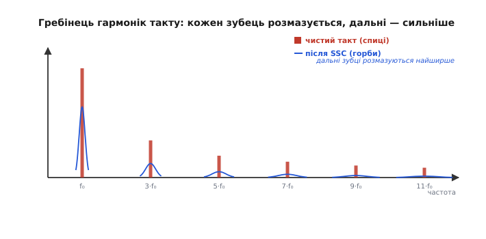
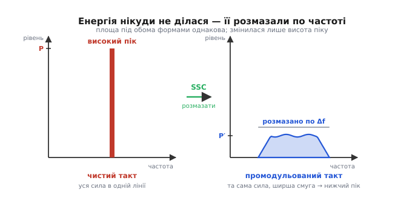
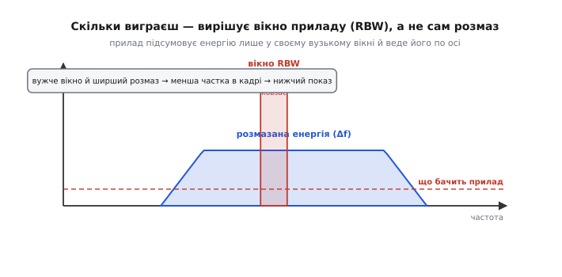
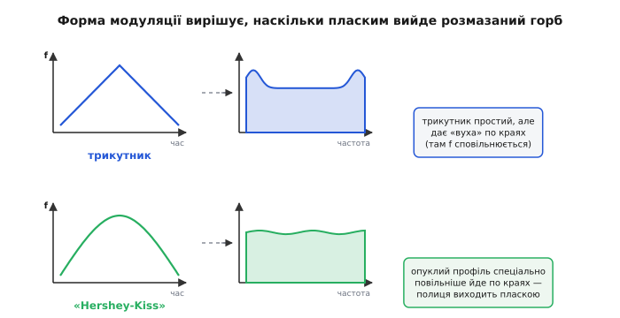

# Модуляція тактового спектру (SSC)

Уяви таку сцену. Пристрій готовий, працює бездоганно — та перед продажем його треба провести крізь випробування на електромагнітну сумісність: посадити в екрановану кімнату, увімкнути й поміряти, скільки радіозавад він випромінює на кожній частоті. І ось на екрані вимірювача виростає одна гостра спиця, що на кілька децибел перелазить дозволену межу. Решта спектру чиста — заважає рівно **один** пік. Схема правильна, розведення охайне, а сертифікат не дають через цю єдину голку.

Перша думка — прибрати ту енергію. Але прибрати нема як: пік стоїть на гармоніці тактового сигналу, а такт пристрою потрібен. Тоді народжується інша, майже зухвала думка: якщо енергію не прибрати — може, її **розмазати**? Лишити ту саму сумарну потужність, але не тримати її в одній тонкій лінії, а розтягти по смузі частот так, щоб у жодній точці вона вже не діставала межі. Саме це й робить **модуляція тактового спектру** (англ. *spread-spectrum clocking*, SSC — «розширення спектру такту»): вона не зменшує завад, вона **знижує їхній пік**, розсипаючи ту саму силу тонким шаром.

Звучить як гра зі статистикою, і почасти так і є. Але за цим стоїть точна фізика й точна причина, чому це взагалі спрацьовує з нормативом. Розберімо по порядку: **звідки** в цифровій схемі беруться гострі спиці, **як** їх розмазують, **чому** розмазане дає нижчий показ на приладі (це найтонше місце) і **яку ціну** за це платять.

### Звідки гострі спиці: такт — це гребінець гармонік

Спершу зрозуміймо ворога. Чому взагалі рівний, корисний тактовий сигнал стає джерелом вузьких піків у радіоспектрі?

Тактовий сигнал — це майже [прямокутна хвиля](topic:electronics/clock-signal) (меандр): рівний період, різкі перепади між «0» і «1». А будь-яка періодична хвиля, за Фур'є, складається зі суми чистих синусоїд — основної частоти й **гармонік**, кратних їй. Меандр із частотою f₀ несе енергію на f₀, 3·f₀, 5·f₀, 7·f₀ і далі: цілий **гребінець** тонких спектральних ліній, що тягнеться високо вгору по частоті. Що різкіші фронти сигналу, то повільніше спадають дальні гармоніки — саме [крутизна перепаду](topic:electronics/slew-rate-gpio) визначає, як високо простягнеться цей гребінець. Тактова лінія на платі, її доріжки, кабелі-шлейфи працюють антенами, і кожен зубець гребінця випромінюється як вузька радіолінія.

Ось чому завади від цифри — це не суцільний шум, а **частокіл гострих спиць** на кратних частотах. І кожна така спиця — уся енергія відповідної гармоніки, зібрана в одну нескінченно тонку лінію. Саме тонкість робить її небезпечною: вузька лінія має великий **пік**, хоча повна енергія в ній може бути й невеликою.


*Меандр породжує гребінець гармонік на f₀, 3·f₀, 5·f₀… — тонкі спиці (гарячі). SSC перетворює кожну спицю на пологий горб (холодний): що вища гармоніка, то ширший її розмаз, бо той самий відсоток відхилення дає більший абсолютний обшир на високій частоті.*

> 🔧 **Навіщо це.** Коли на випробуванні бачиш низку рівномірно розставлених піків із кроком, що збігається з тактовою частотою, — це майже напевно гармоніки такту, а не окрема несправність. Крок між спицями одразу підказує винуватця: розстав курсори, поміряй відстань — вона дорівнює f₀ (для меандру видно непарні кратні). SSC цілиться саме в цей частокіл: розмазати треба не «шум узагалі», а конкретні тактові гармоніки.

### Головний трюк: повільно розгойдати частоту такту

Тепер — сама ідея, і вона напрочуд проста. Замість того щоб тримати такт на строго сталій частоті f₀, її **повільно й безперервно** гойдають туди-сюди навколо f₀: трохи вгору, трохи вниз, знову вгору — за плавним законом із дуже низькою частотою розгойдування (типово близько 30 кГц, тобто десятки тисяч гойдань за секунду). Розмах гойдання малий — частки відсотка від f₀. Це і є **частотна модуляція** такту: несуча — сам такт, а модулює її повільна хвиля-профіль.

Що з цього виходить у спектрі? Поки частота стоїть на місці, уся енергія гармоніки б'є в одну лінію. Щойно частота почала повзати в діапазоні шириною Δf, та сама енергія вже не встигає збиратися в одну точку — вона **розподіляється** по всій смузі Δf, якою блукає гармоніка. Замість тонкої високої спиці постає широкий низький **горб**. І тут ключове: **повна потужність зберігається**. Модуляція не спалює й не створює енергії — вона лише перерозподіляє наявну по частоті. Площа під горбом дорівнює площі колишньої спиці; змінилася тільки **висота**.


*Ліворуч уся сила гармоніки зібрана в одну лінію заввишки P. Праворуч та сама сила розмазана по смузі Δf — горб заввишки P′, набагато нижчий. Площа (повна потужність) однакова: SSC знижує пік, а не сумарну енергію.*

Отут і криється чесна відповідь на природне заперечення. Скептик слушно скаже: якщо енергія та сама, то й завад стільки ж — де ж виграш? І він **має рацію** щодо сумарної енергії. Виграш не в тому, що завад стало менше. Виграш у тому, що **норматив міряє пік**, а не повну енергію. Щоб зрозуміти, чому нижчий горб дає нижчий показ на приладі, треба заглянути в те, **як саме** влаштований вимірювач завад. Це найтонше місце всієї теми.

### Чому розмазане дає нижчий показ: секрет у вікні приладу

Вимірювач завад (EMI-приймач) не бачить одразу весь спектр. Усередині він має вузьке **вікно** — смугу пропускання, крізь яку зазирає на одну частоту за раз. Це вікно повільно ковзає по осі частот, і в кожній точці прилад підсумовує лише ту енергію, що потрапила **в межі вікна**. Ширину вікна задає стандарт випробувань і зветься вона **роздільною смугою** (англ. *resolution bandwidth*, RBW). За нормами CISPR у діапазоні 30–1000 МГц роздільна смуга приймача — 120 кГц: прилад в один момент «зважує» лише ті 120 кГц спектру, що потрапили у віконце.

Тепер складімо це з розмазуванням — і все стає на місця. Поки вся енергія гармоніки зібрана в тонку лінію, вона **цілком** уміщається в 120-кілогерцове вікно: прилад ловить її повністю й показує повний пік. А коли SSC розтягнув ту саму енергію на смугу, ширшу за вікно приймача, у віконце в кожен момент влучає **лише частина** горба — рівно та частка, що дорівнює відношенню ширини вікна до ширини розмазу. Решта енергії лежить поза межами вікна й у цей показ **не входить**. Прилад чесно показує те, що бачить, — а бачить він частку. Показ падає.


*Прилад підсумовує енергію лише у вузькому вікні RBW і веде його по осі. Коли розмаз ширший за вікно, у кадр потрапляє тільки частка горба — тому показ нижчий за повну спицю. Вужче вікно й ширший розмаз → менша частка → нижчий показ.*

Звідси випливає точна, майже арифметична оцінка виграшу. Наскільки впаде пік, залежить від того, у скільки разів розмаз **ширший** за вікно приладу: розтягнув енергію вдесятеро ширше за RBW — у вікно влучить приблизно десята частина, і пік просяде приблизно на 10 дБ. Формула-скелет:

```
падіння піку (дБ) ≈ 10 · lg( Δf_розмазу / RBW_приладу )
```

Це наближення (реальний профіль горба не ідеально плаский, тож числа плавають), але воно ловить суть **і** одразу дає два важливі висновки. По-перше, виграш зростає з розмахом розмазу: ширше гойдаєш частоту — нижчий пік. По-друге — і це часто дивує — той самий відсоток розмаху дає **більший** абсолютний обшир на високій гармоніці, ніж на низькій (0.5 % від 800 МГц — це 4 МГц, а від 100 МГц — лише 0.5 МГц). Тому дальні, високочастотні гармоніки SSC глушить сильніше за ближні — а саме вони зазвичай і є найпроблемніші на випробуванні. На практиці типовий SSC знижує піки радіозавад на 8–15 дБ, і цих кількох децибел рівно вистачає, щоб перелізти межу назад під неї.

> 🔧 **Навіщо це.** Ця залежність від RBW пояснює позірний парадокс: увімкнув SSC — на **сертифікаційному** приймачі (RBW 120 кГц) пік упав на 10 дБ, а на дешевому аналізаторі з ширшим вікном виграш ледь помітний. Прилад із широким вікном сам «збирає назад» розмазану енергію. Тому міряти ефект SSC треба саме **тим** приладом і з **тією** роздільною смугою, що застосує лабораторія сертифікації, — інакше висновок про «-3 дБ» чи «-12 дБ» буде хибний. І навпаки: якщо норматив дозволяє вужчу RBW, той самий SSC дасть більший виграш «задарма».

### Униз чи навколо: два способи гойдати

Гойдати частоту можна двома способами, і вибір між ними — не косметика, а інженерне рішення з наслідками.

Перший — **центрований розмаз** (*center spread*): частота гуляє симетрично навколо f₀, наполовину вгору, наполовину вниз. Розмаз найкомпактніший при заданому розмаху, але **середня частота лишається f₀** — а це означає, що інколи такт іде **швидше** за номінал. Для схеми, яку розігнали під саму стелю, це небезпечно: під час верхньої півхвилі модуляції період коротшає, і найповільніший логічний шлях може не встигнути.

Другий — **розмаз униз** (*down spread*): частота гуляє **лише нижче** f₀, від f₀ до f₀−Δf, ніколи не перевищуючи номінал. Такт від SSC стає в середньому **трохи повільнішим** (на пів-розмаху), зате **ніколи** не швидшим за паспортну частоту. Саме тому down spread — стандарт для інтерфейсів, де верхня межа частоти жорстка: SATA, PCI Express, HDMI, USB. Плата за безпеку — крихітна втрата середньої пропускної здатності (типовий розмаз униз 0.5 % відбирає близько чверті відсотка швидкості), але для таких шин це прийнятна ціна за гарантію, що жоден такт не вилізе за дозволене.

```
центрований:  f гуляє  f₀ ± Δf/2   — середня = f₀,  та інколи ШВИДШЕ (ризик таймінгу)
униз:         f гуляє  f₀ … f₀−Δf   — середня ≈ f₀−Δf/2, НІКОЛИ не швидше (безпечно)
```

### Форма гойдання: чому «поцілунок» кращий за трикутник

Лишається питання, яким саме **законом** вести частоту від краю до краю. І тут ховається несподівано тонка деталь.

Найпростіший закон — **трикутник**: частота рівномірно повзе вгору, доходить до краю, рівномірно повзе вниз. Легко зробити, і горб виходить майже пласким. Але «майже»: на самих краях діапазону, де частота на мить **зупиняється**, щоб розвернутися, вона проводить там трошки більше часу — і на краях горба виростають два невеликі «вуха», два підняті кінці. А норматив міряє **найвищу** точку — тож ці вуха трохи псують виграш.

Розв'язок — підібрати профіль так, щоб частота проходила діапазон **не рівномірно**: швидше посередині й повільніше там, де інакше вибухнули б вуха, компенсуючи їх точно до пласкої полиці. Такий опукло-вгнутий профіль інженери Lexmark, що й винайшли [сам метод SSC](topic:electronics/spread-spectrum-clocking/hist-lexmark-1994.md), назвали профілем «**Hershey-Kiss**» — за формою, схожою на обрис відомої шоколадної цукерки-крапельки. Він дає найрівніше плато розмазаної енергії, а отже — найнижчий пік при заданому розмаху. Це той випадок, коли акуратна форма модуляції варта кількох зайвих децибел виграшу.


*Трикутний профіль простий, але залишає «вуха» на краях горба — там частота сповільнюється й затримується. Опуклий профіль «Hershey-Kiss» спеціально проходить краї повільніше, вирівнюючи горб у пласку полицю з найнижчим піком.*

### Де це живе: модуляція всередині ФАПЧ

Як фізично змусити частоту гойдатися? Такт високої частоти майже завжди народжує [петля фазового автопідстроювання](topic:electronics/prescaler) (ФАПЧ): вона множить частоту кварцового резонатора на потрібний коефіцієнт. І щоб додати SSC, не треба нічого будувати з нуля — досить **повільно ворушити цей коефіцієнт множення** за законом профілю. Петля слухняно веде вихідну частоту слідом за коефіцієнтом, гойдаючи її в потрібному діапазоні. Профіль зазвичай зберігають маленькою таблицею-пам'яттю, яку неквапом зачитує лічильник; вихід таблиці й підкручує подільник петлі. Уся модуляція коштує кількох вентилів і крихітного ПЗП — тому SSC давно стало типовою галочкою в тактових генераторах і всередині мікросхем.

**Приклад (порахувати виграш і безпечний розмах).** Хай маємо тактовий генератор 100 МГц; проблемна гармоніка — п'ята, на 500 МГц, і на випробуванні вона на 6 дБ вища за межу. Приймач CISPR має RBW = 120 кГц. Ставимо down spread на 0.5 %. Порахуймо, чи вистачить.

:::tabs
```c
#include <stdio.h>
#include <math.h>

int main(void) {
    double f0        = 100e6;    // такт, Гц
    int    harmonic  = 5;        // проблемна гармоніка
    double spread    = 0.005;    // 0.5 %  розмаз униз
    double rbw       = 120e3;    // вікно приймача CISPR, Гц

    double f_harm  = harmonic * f0;          // 500 МГц — де стоїть спиця
    double df      = spread * f_harm;        // абсолютний обшир розмазу на цій гармоніці
    double gain_dB = 10.0 * log10(df / rbw); // наближене падіння піку

    printf("гармоніка : %.0f МГц\n", f_harm / 1e6);
    printf("розмаз Δf  : %.2f МГц (%.1f %% від гармоніки)\n", df / 1e6, spread * 100);
    printf("вікно RBW  : %.0f кГц\n", rbw / 1e3);
    printf("падіння піку ~ %.1f дБ\n", gain_dB);

    double margin_before = -6.0;             // було: на 6 дБ ВИЩЕ межі
    double margin_after  = margin_before + gain_dB;
    printf("запас до межі: %.1f дБ → %.1f дБ  %s\n",
           margin_before, margin_after,
           margin_after > 0 ? "(проходить)" : "(усе ще завалено)");
    return 0;
}
```
```python
import math

f0       = 100e6    # такт, Гц
harmonic = 5        # проблемна гармоніка
spread   = 0.005    # 0.5 %  розмаз униз
rbw      = 120e3    # вікно приймача CISPR, Гц

f_harm  = harmonic * f0            # 500 МГц — де стоїть спиця
df      = spread * f_harm          # абсолютний обшир розмазу на цій гармоніці
gain_dB = 10.0 * math.log10(df / rbw)  # наближене падіння піку

print(f"гармоніка : {f_harm / 1e6:.0f} МГц")
print(f"розмаз Δf  : {df / 1e6:.2f} МГц ({spread * 100:.1f} % від гармоніки)")
print(f"вікно RBW  : {rbw / 1e3:.0f} кГц")
print(f"падіння піку ~ {gain_dB:.1f} дБ")

margin_before = -6.0               # було: на 6 дБ ВИЩЕ межі
margin_after  = margin_before + gain_dB
verdict = "(проходить)" if margin_after > 0 else "(усе ще завалено)"
print(f"запас до межі: {margin_before:.1f} дБ → {margin_after:.1f} дБ  {verdict}")
```
```go
package main

import (
	"fmt"
	"math"
)

func main() {
	f0 := 100e6      // такт, Гц
	harmonic := 5    // проблемна гармоніка
	spread := 0.005  // 0.5 %  розмаз униз
	rbw := 120e3     // вікно приймача CISPR, Гц

	fHarm := float64(harmonic) * f0     // 500 МГц — де стоїть спиця
	df := spread * fHarm                // абсолютний обшир розмазу на цій гармоніці
	gainDB := 10.0 * math.Log10(df/rbw) // наближене падіння піку

	fmt.Printf("гармоніка : %.0f МГц\n", fHarm/1e6)
	fmt.Printf("розмаз Δf  : %.2f МГц (%.1f %% від гармоніки)\n", df/1e6, spread*100)
	fmt.Printf("вікно RBW  : %.0f кГц\n", rbw/1e3)
	fmt.Printf("падіння піку ~ %.1f дБ\n", gainDB)

	marginBefore := -6.0 // було: на 6 дБ ВИЩЕ межі
	marginAfter := marginBefore + gainDB
	verdict := "(усе ще завалено)"
	if marginAfter > 0 {
		verdict = "(проходить)"
	}
	fmt.Printf("запас до межі: %.1f дБ → %.1f дБ  %s\n",
		marginBefore, marginAfter, verdict)
}
```
:::

```
гармоніка : 500 МГц
розмаз Δf  : 2.50 МГц (0.5 % від гармоніки)
вікно RBW  : 120 кГц
падіння піку ~ 13.2 дБ
запас до межі: -6.0 дБ → 7.2 дБ  (проходить)
```

Розмаз 2.5 МГц — це приблизно у 21 раз ширше за 120-кілогерцове вікно, звідки й ≈13 дБ падіння. Було на 6 дБ вище межі — стало на 7 нижче: пристрій проходить, і навіть із запасом. Видно й раніший висновок у дії: на п'ятій гармоніці абсолютний обшир (2.5 МГц) великий, тож і виграш добрий; на першій гармоніці (100 МГц) той самий 0.5 % дав би лише 0.5 МГц розмазу й помітно менше децибел.

### Ціна: розмазаний такт — це навмисний джиттер

Тепер найважливіше застереження, без якого SSC легко застосувати там, де не можна. Бо задарма нічого не буває, і плата тут цілком конкретна.

Промодульований такт — це такт, чия частота **навмисно** плаває. А такт, чий період раз у раз то довшає, то коротшає, — це за визначенням такт із [джиттером](topic:electronics/jitter-phase-noise) (тремтінням фронтів): ми свідомо додали модуляцію фази туди, де інакше боролися б за її сталість. Наслідки треба тримати в голові.

**Тане запас за таймінгом.** Коли частота гуляє вгору (у центрованому розмазі) чи просто плаває, миттєвий період стає то коротшим, то довшим за номінал. Найповільніший логічний шлях мусить встигати навіть у найкоротшому періоді — тобто SSC **з'їдає** частину запасу за швидкодією. Тому розмах SSC не роблять більшим, ніж треба для сертифіката: кожен зайвий відсоток розмазу — це зайвий відкушений таймінг.

**Розповзається діаграма ока.** У швидкому послідовному зв'язку якість сигналу оцінюють [діаграмою ока](topic:electronics/eye-diagram): наскільки широко «відчинене» вікно, у якому приймач надійно розрізняє біт. Плаваючий такт джерела трохи розмиває положення фронтів — «око» звужується по горизонталі. Тому стандарти на кшталт PCI Express і USB прямо прописують **допустимий профіль SSC** (розмах, частоту, форму): приймач зобов'язаний вміти стежити за таким повільним блуканням своєю петлею відновлення такту, але лише в жорстко обумежених межах. Вийдеш за них — приймач не встежить, і око зачиниться.

**Не можна нести SSC-такт через асинхронну межу абияк.** Якщо промодульований такт живить один бік, а сталий — інший, [перетин між тактовими доменами](topic:electronics/clock-domain-crossing) стає ще примхливішим: різниця частот тепер не постійна, а сама гуляє в часі. Синхронізатори мусять це витримувати, і закладати їх треба з запасом.

**Модуляція сидить у чутливій смузі.** Частоту гойдання (~30 кГц) обирають вище звукового діапазону не випадково — щоб її пролізання в аналогові кола не давало чутного тону. Але в дуже чутливому аудіо- чи вимірювальному тракті навіть цей ультразвуковий залишок модуляції може підмішуватися в сигнал. Тому там, де важить гранична чистота аналогового тракту, SSC на спільному такті часом свідомо **вимикають** — виграш у радіозавадах не вартий підмісу в корисний сигнал.

> 🔧 **Навіщо це.** Практичне правило: SSC — інструмент для **сертифіката з радіозавад**, а не безкоштовне добро на кожен такт. Умикай його на тактах, що йдуть до довгих доріжок, роз'ємів і кабелів (це головні антени), і тримай напоготові думку про таймінг. Не веди SSC-такт на прецизійний АЦП, на опорну частоту вимірювання чи туди, де крок за кроком рахується точний інтервал, — там плаваючий період усе зіпсує. І завжди звіряйся зі стандартом інтерфейсу: для PCIe/USB/SATA профіль SSC не на твій розсуд, а прописаний — вийдеш за нього, зламаєш зв'язок.

### Що з цього лишається в голові

Коротка суть, зібрана докупи. Цифровий такт випромінює **гребінець гострих гармонік**, і на випробуванні небезпечна саме тонкість спиць — вузька лінія має великий пік. SSC не прибирає цю енергію (прибрати нема як), а **розмазує** її: повільно гойдає частоту такту в межах частки відсотка, і кожна спиця осідає в широкий низький горб тієї самої площі. Виграш видно на приладі, бо вимірювач завад міряє енергію лише у своєму вузькому **вікні** (RBW): коли розмаз ширший за вікно, у кадр влучає лише частка горба — і пік падає приблизно на 10·lg(розмаз/RBW) децибел. Ведуть частоту або **вниз** (безпечно для таймінгу, стандарт для швидких шин), або **навколо** номіналу; форму гойдання доводять до профілю «**Hershey-Kiss**» задля найрівнішого плато. А плата — це навмисний **джиттер**: тане запас за таймінгом, звужується діаграма ока, ускладнюються асинхронні межі, тож SSC ставлять точково, під конкретний сертифікат, і ніколи — на такти, де важить прецизійна сталість періоду.
