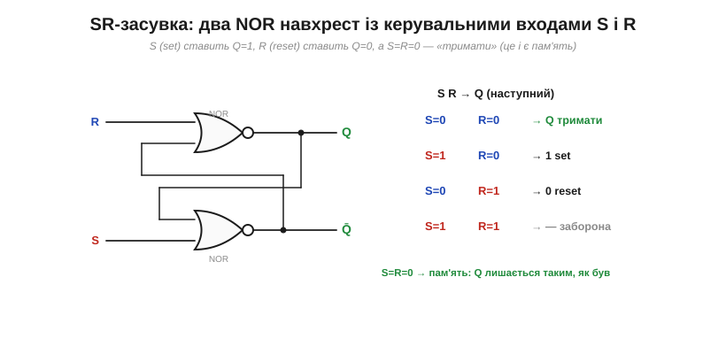
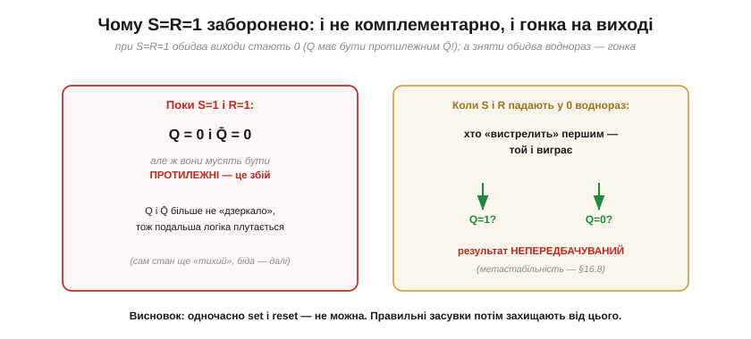
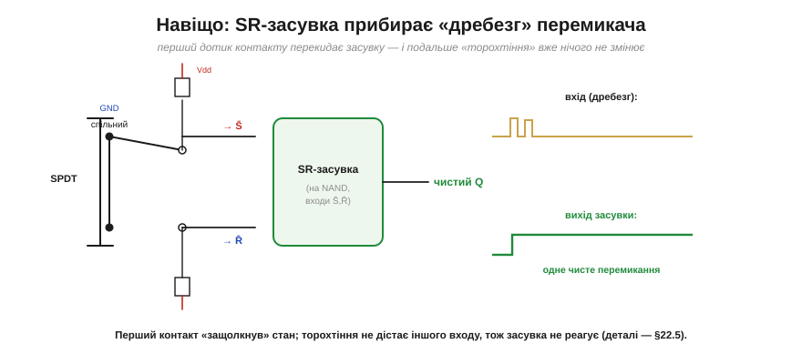

# Засувка (latch): SR-засувка

[Бістабільна комірка](book:electronics/state-memory) — два перехресно-зв'язані елементи, що тримають один біт, — сама собою «глуха»: тримати тримає, а **поставити** її в потрібний стан нічим. Виправмо це — додамо комірці **входи керування**, якими можна навмисно встановити 0 чи 1. Результат — **SR-засувка** (*SR latch*), найпростіша керована комірка пам'яті й прямий нащадок схеми Екклза–Джордана. Літери в назві кажуть усе: **S** — *set* (встановити в 1), **R** — *reset* (скинути в 0).

### SR-засувка з двох NOR

Найпоширеніший спосіб її зробити — два вентилі **NOR**, з'єднані навхрест (та сама парна [петля пам'яті](book:electronics/state-memory), тільки тепер у кожного NOR є вільний вхід для керування).


*Рис. Два NOR навхрест: вихід кожного заведено на вхід іншого (петля пам'яті), а вільні входи — це S і R. У NOR одиниця на **будь-якому** вході дає на виході 0. Тому **S=1** притискає Q̄ до 0, що через петлю штовхає Q у 1 (**set**); **R=1** дзеркально дає Q=0 (**reset**); а коли **S=R=0**, обидва NOR працюють як прості інвертори в петлі — і засувка просто **тримає** те, що було (це і є пам'ять). Таблиця праворуч підсумовує всі випадки.*

Зверніть увагу на головний рядок таблиці — **S=R=0, «тримати»**. Це не «нічого не відбувається», а саме **збереження**: прибравши обидва керувальні сигнали, ми лишаємо засувку наодинці з її петлею, і вона утримує біт. Set і reset — це коли ми **пишемо**; hold — коли засувка **пам'ятає**.

### Чотири випадки: тримати / set / reset / заборона

Розгляньмо всі чотири комбінації входів по черзі — це і є повний «характер» засувки.


*Рис. **00 — тримати**: Q лишається попереднім (пам'ять). **10 — set**: Q→1. **01 — reset**: Q→0. **11 — заборона**: обидва виходи стають 0, тобто Q і Q̄ більше не протилежні — недопустимий стан. Три перші режими корисні; четвертого уникають.*

**Приклад (простежити засувку).** Подамо на SR-засувку послідовність входів і простежмо Q (починаємо з невідомого стану).

```
R=1, S=0   →  reset:    Q = 0
S=0, R=0   →  тримати:  Q = 0   (зберегли)
S=1, R=0   →  set:      Q = 1
S=0, R=0   →  тримати:  Q = 1   (зберегли, хоч S уже зник!)
R=1, S=0   →  reset:    Q = 0
```

Зверніть увагу на рядки «тримати»: між записами Q **не змінюється сам**, хоч на входах уже нічого немає. Оце утримання й робить засувку **пам'яттю**, а не просто логікою.

### Заборонений стан S=R=1

Окремо — про четвертий випадок, бо він підступний. Подати **S=1 і R=1 одночасно** — означає водночас наказати «постав 1» і «постав 0». Засувка не може догодити обом і робить дивне: обидва виходи стають 0.


*Рис. Поки S=R=1, обидва виходи Q=Q̄=0 — а вони ж мусять бути **протилежними**, тож наступна логіка, що очікує «Q і його інверсію», плутається. Та головна біда — коли S і R **падають у 0 воднораз**: засувка мусить «вистрелити» в один зі станів, і який саме переможе — залежить від мікроскопічних відмінностей у швидкості двох гілок. Результат **непередбачуваний** (а інколи засувка взагалі «зависає» посередині — це [метастабільність](book:electronics/metastability-timing)).*

Тому правило просте: **одночасно set і reset не подають**. У «причесаних» засувках і [тактованих тригерах](book:electronics/d-flip-flop) цю ситуацію або апаратно унеможливлюють, або домовляються про пріоритет одного входу. Поки ж запам'ятайте: S=R=1 — заборонена комбінація.

### Часова діаграма

Усю поведінку найкраще зчитати з **часової діаграми** — як короткі імпульси S і R керують виходом Q.


*Рис. Короткий імпульс **S** підіймає Q у 1 — і коли S зникає, Q **лишається** 1 (утримання). Згодом короткий імпульс **R** скидає Q у 0 — і той знову тримається. Між імпульсами вихід незмінний: засувка зберігає останній наказ. Саме ця «пам'ять про останній імпульс» і є збережений біт.*

Зауважте принципову рису: засувка реагує на входи **миттєво й будь-коли** — щойно S чи R змінилися, відразу змінюється й вихід. Вона **рівнева** (*level-sensitive*), або «прозора»: немає жодного «розкладу», коли можна писати, а коли ні. Це і зручно, і небезпечно — і саме з цього виростає потреба в [тактуванні](book:electronics/d-flip-flop), яке дозволяє писати лише в дозволені моменти.

### Активно-низька засувка й придушення дребезгу

Ту саму засувку можна зробити з **NAND** замість NOR — і тоді входи стають **активно-низькими** (їх позначають з рискою: S̄, R̄), тобто спрацьовують **нулем**, а не одиницею (через [бульбашку-інверсію](book:electronics/basic-gates) на виході NAND). Через це й таблиця в неї **дзеркальна** до NOR-версії, і це легко переплутати: режим «**тримати**» — це S̄=R̄=**1** (обидва входи високі, бездіяльні); set — S̄=0; reset — R̄=0; а **заборонена** комбінація — S̄=R̄=**0** (а не S=R=1, як у NOR-засувці). Тобто все саме навпаки за рівнями, бо входи активні нулем. NAND-засувка з активно-низькими входами — найпоширеніша на практиці, зокрема в класичному застосуванні: **придушенні дребезгу** механічного перемикача.


*Рис. Механічний контакт, замикаючись, не дає чистого переходу — він кілька мілісекунд **торохтить** ([дребезг](book:electronics/contact-debounce), *bounce*), і наївна схема прочитала б десяток «натискань» замість одного. Та якщо завести перемикач (типу SPDT) на SR-засувку, **перший** же дотик контакту защепне її в потрібний стан — а подальше торохтіння вже не дістає **іншого** входу, тож засувка незворушно тримає чистий рівень. На виході — одне-єдине чисте перемикання.*

Це чудовий приклад того, **навіщо** засувка взагалі потрібна: вона перетворює брудну, тремтливу реальність механічного контакту на чистий цифровий рівень — бо вміє **зафіксувати** перший достовірний стан і відкинути решту шуму.

> 🔧 **Навіщо це.** SR-засувка — найпростіша «комірка», у яку можна **записати** біт і яка його **триматиме**. Три речі винесіть на практику. Перша: «тримати» (S=R=0) — це і є режим пам'яті; решта — це запис. Друга: **S=R=1 не подавайте** — це заборонена комбінація з непередбачуваним наслідком; реальні елементи від неї захищають. Третя: засувка **прозора** — реагує на входи будь-коли, тож якщо входи «брудні» чи змінюються в невдалий момент, вихід теж смикається. Саме ця прозорість непридатна там, де сотні комірок мусять оновлюватися **узгоджено**: там біт пишуть не «коли заманеться», а [за командою такту](book:electronics/d-flip-flop).
