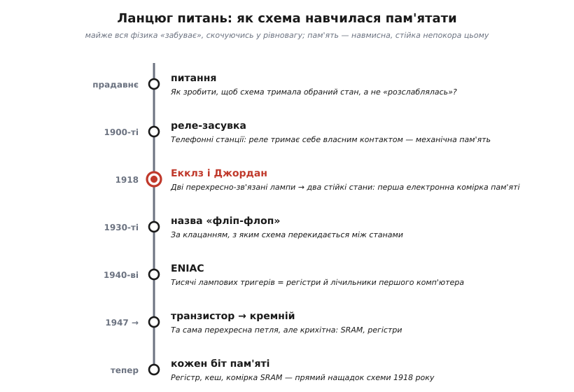
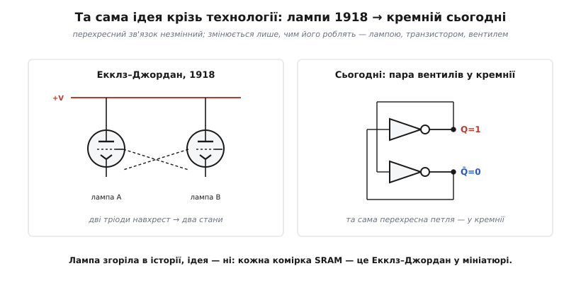
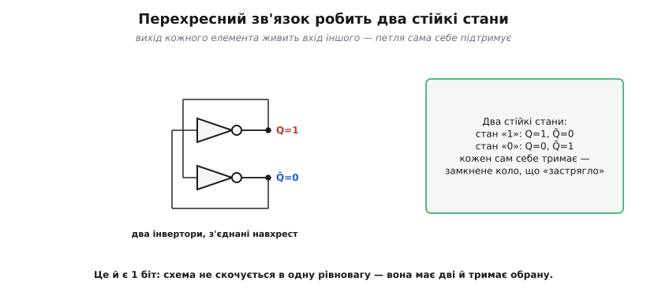
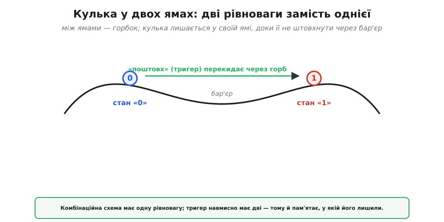

# 📜 Як схема навчилася пам'ятати: тригер Екклза–Джордана

> Ця історія веде **ланцюгом питань** до найдивнішої здатності, якої бракувало комбінаційній логіці, — **пам'яті**. [Вентилі, з яких будують логічні функції](book:electronics/gates-to-functions), чудово **рахують**, та миттєво **забувають** — їхній вихід залежить лише від входів зараз. Як змусити схему **тримати** обраний стан? Відповідь знайшли 1918 року двоє британців, перехрестивши дротами дві радіолампи, — і ця крихітна схема стала **атомом** усієї цифрової пам'яті, від регістра процесора до кожного біта SRAM у вашому чипі. А корінням вона сягає тієї самої ідеї **додатного зворотного зв'язку**, що живить [тригер Шмітта](book:electronics/threshold-schmitt), який «пам'ятає один біт».

Уявіть, що ви — інженер 1910-х. У вас є лампи, що підсилюють сигнал, і логіка, що його перетворює. Та все це **проточне**: сигнал увійшов, перетворився, вийшов — і по ньому. Жодна з ваших схем не вміє сказати «я **запам'ятала**, що тут була одиниця». А без цього неможливі ні лічильник, ні машина, що виконує програму крок за кроком. Пройдімо шлях, яким схема навчилася непокори фізиці — навчилася **не забувати**.

*Кожен щабель — крок до пам'яті в залізі. Червоний вузол — 1918 рік, коли Екклз і Джордан зробили першу електронну «комірку», що тримає свій стан. Усе, що нижче по лінії, — лічильники ENIAC, регістри, SRAM — прямі нащадки цієї схеми.*

---

## Дивна вимога: щоб схема не «забувала»

Спершу варто оцінити, наскільки **протиприродна** сама вимога пам'яті. Майже все у фізиці прагне **рівноваги** й «забуває» минуле: кулька скочується на дно ямки й там лишається; гаряче охолоне до кімнатного; заряд на ізольованому тілі поволі стікає. Системи **розслабляються** в один-єдиний стан спокою — і саме тому не пам'ятають, що з ними робили раніше. Звичайна комбінаційна схема — теж така: подаси входи, вона «скотиться» у відповідний вихід, і жодного сліду попереднього не лишиться.

А пам'ять вимагає рівно протилежного: щоб система мала **не одну** рівновагу, а **дві** (чи більше), і **залишалася** в тій, у яку її поставили, — скільки завгодно довго, аж доки ми самі не накажемо змінитися. Це не «забути й розслабитися», а «**втримати** обране». Як збудувати таке з елементів, що самі по собі тяжіють до спокою?

Підказку дає одне слово — **зворотний зв'язок**. Якщо вихід схеми завернути назад на її ж вхід так, щоб він **підкріплював** сам себе, схема почне «триматися» за свій стан власними руками. Цю ідею — пам'ять через самопідтримку — людство намацало ще до електроніки.

---

## Механічна пам'ять: реле, що тримає себе

Перші «комірки пам'яті» були **механічні** й жили на телефонних станціях. Там працювали тисячі **реле** (електромагнітних перемикачів), і інженери здавна знали хитрий прийом: реле можна змусити **тримати себе самому**. Якщо ввімкнене реле власним контактом замикає коло, що живить його ж котушку, то, спрацювавши один раз, воно **лишається** ввімкненим — навіть коли початковий сигнал зник. Щоб «забути», його треба окремо **скинути** (розірвати самопідтримку).

Це і є пам'ять у чистому вигляді: реле «пам'ятає», що його колись увімкнули, бо тримає себе у ввімкненому стані петлею зворотного зв'язку. Телефонні станції на таких самопідтримних реле «запам'ятовували», які лінії зайняті, які з'єднання встановлені, — це була справжня, хай і повільна, цокотлива пам'ять.

> 🔧 **Навіщо це.** Тут — зародок усього розділу. Запам'ятати один біт — означає збудувати схему з **двома** стійкими станами, що **тримає** обраний завдяки зворотному зв'язку, доки її не «перемкнуть». Механічне реле робило це повільно (мілісекунди, з клацанням і зносом контактів). Усе, чого бракувало, — зробити те саме **електронно**, без рухомих частин, у тисячі разів швидше. Саме цей крок і зробили Екклз із Джорданом.

---

## 1918: дві лампи навхрест

Тепер головний герой. **Вільям Генрі Екклз** (*William Henry Eccles*, 1875–1966) — відомий британський радіоінженер — і його молодший колега **Френк Вілфред Джордан** (*Frank Wilfred Jordan*, 1881–1941) 1918 року (публікація — 1919-го) описали схему, яку назвали **«тригерним реле»** (*trigger relay*). Тільки реле в ній були вже не механічні, а **електронні** — дві **термоелектронні лампи** (тріоди), щойно винайдені й ще геть нові.

*Зліва — оригінал: дві тріоди, з'єднані **навхрест** — анод (вихід) кожної лампи керує сіткою (входом) іншої. Справа — те саме сьогодні: пара перехресно-зв'язаних вентилів (чи транзисторів) у кремнії. Технологія змінилася до невпізнання — лампа, транзистор, вентиль, — а **ідея** перехресної петлі лишилася тією самою. Кожна комірка SRAM у вашому чипі — це Екклз–Джордан у мініатюрі.*

Суть була в **перехресному з'єднанні**. Вихід першої лампи заводили на вхід другої, а вихід другої — назад на вхід першої. Виходило замкнене коло, у якому лампи «домовлялися» між собою: якщо перша **відкрита** (проводить), вона змушує другу **закритися**, а закрита друга, своєю чергою, **підтримує** першу відкритою. Виходить узгоджена, **самопідтримна** конфігурація — рівно як самопідтримне реле, тільки електронне й блискавично швидке.

І — найголовніше — таких узгоджених конфігурацій виявилося **дві**: «перша відкрита, друга закрита» і дзеркальна «перша закрита, друга відкрита». Схема могла спокійно сидіти в **будь-якій** із них скільки завгодно довго. Народилася перша **бістабільна** (двостійка) електронна схема — перша **комірка пам'яті** в історії техніки.

---

## Чому стани саме два: бістабільність

Зупинімося на цьому «два стани», бо в ньому вся суть. Чому перехресний зв'язок дає саме **дві** стійкі конфігурації, а не одну (як у звичайної схеми) чи десять?

*Два інвертори, з'єднані навхрест (сучасна мова тієї самої ідеї). Назвімо їхні виходи Q і Q̄. Якщо Q=1, перший інвертор змушує Q̄=0; а Q̄=0, поданий назад, змушує Q=1 — коло «застрягло» в узгодженому стані. Так само стійкий і дзеркальний стан Q=0, Q̄=1. Третього не дано: будь-яка інша комбінація «суперечить сама собі» й миттю зісковзує в один із цих двох. Це і є **1 біт пам'яті**.*

Інтуїцію найкраще дає образ **кульки у двох ямах**.

*Звичайна (комбінаційна) схема — це кулька в **одній** ямі: куди не штовхни, вона скотиться на те саме дно. Тригер — це кулька у **двох** ямах, розділених горбком. Вона спокійно лежить у тій ямі, де її лишили («0» чи «1»), і не перейде в іншу сама. Щоб перекинути її через горб, потрібен **навмисний поштовх** — керувальний сигнал set/reset. Прибрали поштовх — кулька знову лежить, де лягла. Оце «лежить, де лягла» і є пам'ять.*

Ось чому два, а не одне: перехресний зв'язок навмисно створює **дві** долини рівноваги замість однієї. І ось чому не десять: між двома лампами існує рівно дві несуперечливі конфігурації. Той самий механізм працює й у тригері Шмітта: там **додатний зворотний зв'язок** дає «пам'ять одного біта» — вихід залежить від того, звідки прийшли. Це не випадковий збіг: додатна петля, що сама себе підкріплює, перетворює схему на двостійку — а двостійкість і є пам'ять.

---

## Звідки назва «flip-flop»

Самі Екклз і Джордан звали своє дітище сухо — «тригерне реле» (*trigger relay*), бо короткий **тригерний** (*trigger* — спусковий) імпульс перекидав його з одного стану в інший. Звична ж нам назва **«фліп-флоп»** (*flip-flop*) прийшла пізніше й була **звуконаслідувальною**: вона передає те різке «клац-клац» перемикання, з яким схема **перекидається** між двома станами — туди (*flip*) і назад (*flop*). В українській традиції цей елемент так і звуть — **тригер** (від англійського *trigger*), і саме цю назву ми вживатимемо в розділі.

Назва влучна, бо схоплює головну поведінку: тригер **сидить** у своєму стані, аж поки короткий сигнал не **перекине** його в інший — після чого він знову сидить, тепер уже в новому. Не плавний перехід, а різкий **стрибок** — знову завдяки додатному зв'язку, що не терпить положення «посередині».

---

## Від однієї комірки до пам'яті машин

Одна бістабільна схема — це один біт. Та щойно інженери навчилися робити **надійний** електронний біт, усе інше стало питанням кількості. Постав поряд вісім тригерів — матимеш **регістр** на байт. З'єднай їх ланцюжком хитро — матимеш **лічильник**. Зроби велику решітку таких комірок — матимеш **пам'ять** (RAM). Усі ці будівлі ростуть з однієї схеми 1918 року.

Коли в 1940-х будували перші електронні комп'ютери, їхня пам'ять і лічильники складалися саме з **лампових тригерів**. Знаменитий **ENIAC** (1945) мав близько вісімнадцяти тисяч ламп — і чималу їх частину з'їдали саме тригери в його лічильниках і регістрах. Машина «пам'ятала» числа, тримаючи стани сотень перехресно-зв'язаних ламп — прямих нащадків схеми Екклза–Джордана.

А далі ідея пережила свій носій. Лампи поступилися **транзисторам** (1947), транзистори зібралися в **інтегральні схеми**, та перехресна петля лишилася незмінною: сучасна комірка статичної пам'яті (**SRAM**) — це два перехресно-зв'язані CMOS-інвертори (плюс два ключі доступу), тобто **рівно** та сама **бістабільна комірка-засувка** з двох навхрест з'єднаних інверторів (а **не** тактований D-тригер — у клітинці SRAM немає ні такту, ні фронту, лише самопідтримна петля), лише завбільшки з кілька мікронів. Мільярди таких комірок у кеші вашого процесора — це мільярди крихітних Екклзів-Джорданів, кожен тримає свій біт.

> 🔧 **Навіщо це.** Коли ви читаєте про «регістри», «кеш», «SRAM», «лічильник» — пам'ятайте, що в основі кожного лежить **той самий** бістабільний осередок: пара елементів, з'єднаних навхрест, із двома стійкими станами. Розібравши **один** тригер — від простої [SR-засувки](book:electronics/sr-latch) до тактованого [D-тригера](book:electronics/d-flip-flop) — ви розумієте будівельний блок **усієї** швидкої пам'яті комп'ютера. І ще практичне: статична пам'ять (на бістабільних комірках) **тримає** біт, доки є живлення, але «забуває» все, щойно живлення зникло, — бо петля самопідтримки розривається. Звідси й поділ на «енергозалежну» й «постійну» пам'ять.

---

## Люди: Екклз і Джордан

Кілька слів про авторів, бо старший із них — постать значно більша, ніж «співавтор тригера». **Вільям Екклз** був одним із піонерів **радіо**: він працював із самим Марконі, а 1912 року побудував **першу теорію** того, як високий іонізований шар атмосфери **відбиває** радіохвилі назад до землі, пояснивши, чому радіо «огинає» земну кулю й доходить за горизонт. Сам **провідний шар** ще 1902-го незалежно передбачили **Артур Кеннеллі та Олівер Гевісайд**; Екклз розвинув теорію поширення хвиль крізь нього (і саме він запропонував назву «шар Гевісайда»). Той шар — частина **іоносфери**, тієї самої, що відбиває короткі хвилі й дає радіо обігнути земну кулю. Екклзові ж приписують і впорядкування **назв ламп** за числом електродів: *діод*, *тріод* і далі — система, якою ми користуємося досі.

**Френк Джордан** лишився у тіні слави старшого колеги, та його ім'я навіки стоїть поруч у назві схеми — **тригер Екклза–Джордана**. Удвох вони, самі того до кінця не усвідомлюючи, заклали наріжний камінь цифрової пам'яті: за пів століття до мікросхем дали світові спосіб **електронно запам'ятати один біт**.

---

## Куди привів цей ланцюг

Озирнімося. Питання «як змусити схему пам'ятати?» вело від самопідтримних телефонних реле — через дві перехрещені лампи 1918-го — до кожної комірки SRAM у сучасному чипі. І відповідь усюди та сама: **бістабільність через зворотний зв'язок**. Схема, що, всупереч фізичній звичці «розслаблятися в одну рівновагу», навмисно має **дві** й **тримає** ту, у яку її поставили.

Найвпертіший слід цієї історії — не конкретна лампа чи транзистор, а **сам принцип**: щоб пам'ятати, треба замкнути вихід на вхід так, аби стан **підкріплював сам себе**. Той самий принцип, що дає гістерезис у тригері Шмітта, тут дає пам'ять; той самий, що в телефонному реле тримав з'єднання, у кремнії тримає біт. Тримайте це в голові: усі засувки, тригери, регістри й лічильники цифрової техніки — це **варіації** на одну тему 1918 року: перехресна петля, що не хоче забувати.

А маючи цю інтуїцію, можна запитати строго: **як саме збудувати [схему, що пам'ятає стан](book:electronics/state-memory), і чому комбінаційна логіка цього не вміє?**
