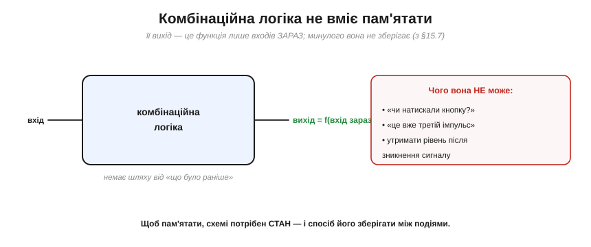
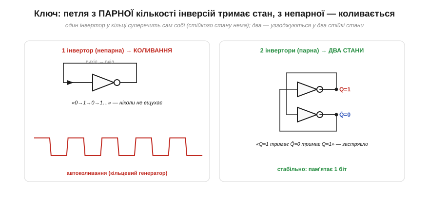

# Пам'ять стану: схема, що «пам'ятає»

Щоб схема **пам'ятала**, її вихід треба завернути назад на вхід, аби стан **підкріплював сам себе**. Перетворимо цю інтуїцію на строгий інженерний принцип. Щоб збудувати елемент пам'яті, треба чітко зрозуміти **дві** речі: **чому** комбінаційна логіка пам'ятати не здатна — і **який саме** трюк цю здатність дає. Виявиться, що все вирішує одна тонка деталь — **парність** кількості інверсій у петлі.

### Чому комбінаційна логіка не пам'ятає

Спочатку — чітко про межу. Комбінаційна схема, хоч би яка складна, обчислює **функцію входів зараз**: подали входи — вона за свій час затримки видала вихід, і жодного сліду того, що було **раніше**, у ній не лишається.

*Рис. Вихід комбінаційної схеми — це f(вхід зараз). У ній фізично немає шляху від «що було раніше» до виходу, тож вона не відповість на питання «чи натискали кнопку?», «це вже третій імпульс?» і не втримає рівень після зникнення сигналу. Щоб уміти таке, схемі потрібен **стан** — щось, що зберігається між подіями.*

Ключове слово — **стан** (*state*). Пам'ятати означає мати внутрішню змінну, яка переживає зміну входів і несе в собі «згусток минулого». Комбінаційна логіка такої змінної не має — і взяти її нізвідки, **якщо** не замкнути схему саму на себе.

### Розв'язок: зворотний зв'язок і стан

Трюк — **зворотний зв'язок** (*feedback*): частину виходу заводять назад на вхід. Тоді поточний вихід **впливає** на наступний, і схема дістає «пам'ять» про себе. Це перетворює комбінаційну логіку на **послідовнісну** (*sequential*) — таку, де результат залежить і від входів, і від накопиченого стану.

*Рис. Кістяк **усіх** схем із пам'яттю. Комбінаційна логіка отримує і зовнішні **входи**, і поточний **стан** (із петлі зворотного зв'язку), а видає і **виходи**, і **наступний стан**, який зберігається в пам'яті й повертається на вхід. Формально: вихід = f(входи, стан), наступний стан = g(входи, стан). Уся послідовнісна техніка — від тригера до процесора — це варіації цієї схеми.*

Ця картинка — **архітектура** всього цифрового світу з пам'яттю. Та вона лишає відкритим головне питання: а **що** саме зберігає стан у тій зеленій коробці «пам'ять»? З чого зробити елемент, що тримає біт? Відповідь ховається в самому зворотному зв'язку — треба лише замкнути його **правильно**.

### Парна чи непарна: коли петля тримає, а коли коливається

Ось найтонша й найкрасивіша деталь усього розділу. Замкнути вихід на вхід — мало; **важливо, скільки інверсій** сигнал зустріне в петлі. І тут парність вирішує все.

*Рис. Зліва — **один** інвертор, чий вихід заведено на власний вхід. Це **суперечність**: якщо на вході 0, вихід стає 1, але ж він і є вхід, тож вхід стає 1, вихід — 0, і так без кінця. Схема ніколи не вщухає — стійкого стану немає. Це принцип **кільцевого генератора** (*ring oscillator*); на практиці його роблять непарним ланцюгом із **3 і більше** інверторів (саме затримка по кільцю задає частоту), а один-єдиний інвертор у петлі — це радше вироджений випадок, що в реальному залізі «осідає» біля порога. Справа — **два** інвертори в петлі. Тепер усе **узгоджується**: Q=1 змушує Q̄=0, а Q̄=0 змушує Q=1 — несуперечливо й стійко. Таких узгоджених станів два, і схема спокійно тримає будь-який. Парна кількість інверсій → **пам'ять**; непарна → **генератор**.*

Осягніть цей вододіл — він глибокий. **Непарна** петля (три, п'ять, сім інверторів) не має жодного стійкого стану: хоч куди постав, сигнал «суперечить сам собі» й безперервно перекидається — виходить **генератор коливань** (до речі, корисна річ: так роблять найпростіші [тактові генератори](book:electronics/clock-signal)). На практиці беруть **3 і більше** стадій: один інвертор у петлі чистих коливань не дає — він радше «зависає» біля порога й поводиться як підсилювач, тож робочі кільцеві генератори — це непарний ланцюг від трьох інверторів. А **парна** петля (два інвертори, чотири) має **два** стійкі стани, що не суперечать самі собі, — і саме вона стає **коміркою пам'яті**. Уся різниця між «схемою, що дзвенить» і «схемою, що пам'ятає», — у парності.

Два перехресно-зв'язані інвертори (парна петля) — це і є класична схема Екклза–Джордана, лише сучасною мовою. Вона тримає **один біт**: два комплементарні виходи Q і Q̄, два стійкі стани (Q=1,Q̄=0 і Q=0,Q̄=1). Це **атом** усієї цифрової пам'яті.

### Бістабільна комірка тримає біт у часі

Що означає «тримає» — найкраще видно **в часі**. Поки схему ніхто не чіпає, її вихід лежить незмінно; лише навмисний поштовх перекидає його в інший стан, де він знову лежить.

*Рис. Вихід Q бістабільної комірки в часі. Між поштовхами він **не змінюється сам** — лежить на 0 чи на 1, скільки завгодно довго. Короткий керувальний сигнал (умовні «set» і «reset») перекидає його — і навіть коли той сигнал давно зник, Q **тримає** нове значення. Оце «лежить, де поклали, і само не зрушить» і є збережений біт.*

Зверніть увагу: значення тримається **навіть після зникнення поштовху**. Саме це відрізняє пам'ять від звичайної логіки: вихід [комбінаційної схеми](book:electronics/gates-to-functions) «забув» би вхід тієї ж миті, а бістабільна комірка його **утримує**. Це і є та схема, що пам'ятає.

### Тонкість: ця пам'ять енергозалежна

Лишилася важлива засторога. Уся самопідтримка петлі тримається на тому, що крізь неї **тече струм** і елементи активно «штовхають» один одного. Прибери живлення — і петля розривається, штовхати нема чим, біт **зникає**.

*Рис. Поки є живлення, петля підкріплює себе й Q тримається. Зникло живлення — петля мертва, і значення забуто. Тому пам'ять на тригерах (регістри, кеш, **SRAM**) називають **енергозалежною** (*volatile*): вона миттєва й швидка, але губить усе без струму. Постійне зберігання, що переживає вимкнення ([Flash](book:programming/flash-vs-ram)), влаштоване зовсім інакше.*

Це не вада, а природа такої пам'яті: вона **найшвидша**, бо тримається активною петлею, та саме тому й **енергозалежна**. Поділ на «швидку, але забудькувату» (на тригерах) і «повільнішу, зате постійну» пам'ять проходить через увесь устрій цифрової техніки — аж до [карти пам'яті мікроконтролера](book:programming/memory-map).

> 🔧 **Навіщо це.** Три думки, які варто винести. Перша: **пам'ять = зворотний зв'язок**. Щоразу, побачивши в схемі петлю, що вертає вихід на вхід, підозрюйте «тут зберігається стан» — і навпаки, будь-яке «запам'ятати» в залізі неодмінно ховає таку петлю. Друга: **парність інверсій** вирішує, пам'ять це чи генератор, — парна петля тримає, непарна дзвенить (обидва корисні: одне для пам'яті, друге для тактів). Третя, суто практична: пам'ять на тригерах **енергозалежна** — регістри й SRAM миттєво забувають усе, щойно зникає живлення, тож важливі дані треба встигати скидати в постійну пам'ять. Цю різницю «забуде / не забуде» ви враховуватимете в кожному пристрої.

---

Отже, бістабільна комірка з двох перехресно-зв'язаних інверторів — це атом усієї цифрової пам'яті: парна петля зворотного зв'язку тримає **один біт** (Q/Q̄) у часі, доки його не перекинуть, і губить його, щойно зникає живлення. Але ця комірка поки що «глуха»: у неї немає входів, якими можна **навмисно** поставити 0 чи 1 — вона тримає той стан, у який випадково «осіла» при ввімкненні. Щоб додати їй такі керувальні входи й дістати першу справжню керовану пам'ять, два інвертори замінюють парою логічних вентилів — так народжується [SR-засувка](book:electronics/sr-latch).

---
