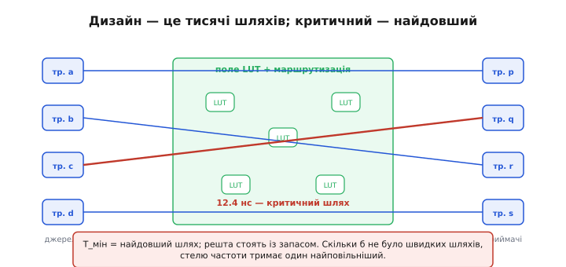
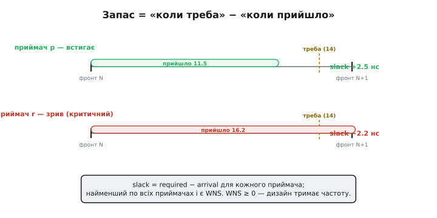
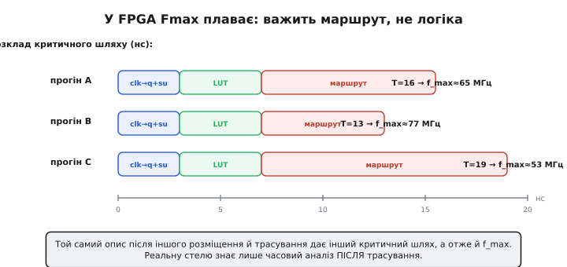

# Статичний часовий аналіз (STA)

<preknowlist>
- [Метастабільність: setup і hold](book:electronics/metastability-timing) — тригер зривається, якщо вхід міняється надто близько до фронту; звідси беруться вимоги setup (перед фронтом) і hold (після нього).
- [Тактовий сигнал](book:electronics/clock-signal) — спільний фронт, за яким синхронні тригери одночасно захоплюють нові значення.
- [Усередині FPGA](book:electronics/inside-fpga) — сигнал між двома клітинками біжить не суцільним дротом, а ланцюжком програмованих перемикачів із власною затримкою.
</preknowlist>

Синхронний дизайн на десятки тисяч тригерів має одну незручну властивість: між кожною парою тригерів, з'єднаних логікою, лежить свій шлях зі своєю затримкою, і таких шляхів у реальному кристалі — від кількох десятків до мільйонів. Щоб схема надійно працювала на заданій частоті, спізнитися не сміє **жоден** із них. Як це довести? Найпряміший спосіб — симуляція — проганяє дизайн на конкретних наборах входів і бачить лише ті комбінації, що їй згодували; а комбінацій астрономічно багато, і саме та, що «вмикає» найдовший шлях, може ні разу не трапитися на тестах. Потрібен інший спосіб: перевірити **всі** шляхи одразу, взагалі не проганяючи жодного вектора. Цей спосіб і зветься статичний часовий аналіз (англ. *static timing analysis*, STA; *static* — той, що обходиться без прогону в часі).

### Шлях, критичний шлях і запас

Назвімо речі. **Шлях** (англ. *path*) у синхронному дизайні — це дорога сигналу від виходу одного тригера крізь комбінаційну логіку до входу наступного, обидва тактовані [спільним фронтом](book:electronics/clock-signal). **Критичний шлях** (англ. *critical path*; *critical* — вирішальний, від грец. *kritikós* — той, що вирішує) — це той єдиний із них, чия повна затримка **найбільша**. Саме він, а не середній чи типовий шлях, диктує найкоротший припустимий період: такт спільний для всіх, тож сповільнитися доводиться до того, хто пасе задніх.

Щоб зважити кожен шлях окремо, STA рахує для кожного приймача дві величини. **Час приходу** (англ. *arrival time*) — коли дані реально застигають на вході приймача: фронт плюс «clk→q + логіка + маршрут». **Час, до якого треба** (англ. *required time*) — крайній момент, коли вони ще встигають: наступний фронт мінус setup. Їхня різниця і є запас (англ. *slack* — провис, вільний кінець мотузки):

```
slack  =  required − arrival
       =  (T − t_setup)  −  (t_clk→q + t_logic + t_route)
```

Запас додатний — дані застигли завчасно, усе чисто; запас від'ємний — приймач захопить недолічене значення (та сама [помилка захоплення на нестабільному вході](book:electronics/metastability-timing)). Дизайн «тримає» задану частоту тоді й лише тоді, коли **жоден** шлях не має від'ємного запасу.

### Чому аналіз «статичний»

Варто помітити, з якого кінця рахують ці дві величини, — бо саме це й робить аналіз статичним. Час приходу йде **вперед**, від джерела: затримки складаються одна за одною вздовж шляху, аж поки дані доходять до приймача. Час, до якого треба, навпаки, відштовхується від **кінця** — від дедлайну приймача — і поширюється назад, до входу. Аналізаторові не потрібні жодні вхідні вектори чи прогін у часі: він просто складає паспортні затримки клітинок і дротів уздовж кожного шляху й порівнює два числа. Тому STA бачить **усі** шляхи за один раз і жодного не пропустить — на відміну від симуляції, що перевіряє лише згодовані їй комбінації.

За цю повноту доводиться платити. STA не знає, чи взагалі можлива така комбінація сигналів, за якої критичний шлях «увімкнеться»; він чесно рахує найгірший випадок, хай навіть недосяжний. Через це аналіз іноді лякається шляху, яким сигнал у житті не пробіжить, — і такі шляхи розробник згодом позначає інструментові як хибні (*false paths*), щоб той їх не рахував. Але типова помилка тут безпечного боку: STA радше перестрахується, ніж пропустить справжнє порушення.

### Інтуїція: біжить натовп, дзвоник — за останнім

Уявімо забіг, де по сигналу стартує одразу багато бігунів, а фінішний дзвоник можна вдарити лише тоді, коли прибіжить **останній**. Швидкі добігли давно й стоять із запасом часу — але дзвоника це не наближає. Так само й тут: хоч би скільки шляхів були миттєвими, період такту впирається в **один** найповільніший. Прискорити дизайн — означає знайти й укоротити саме його; коли його вкоротили, критичним стає вже **наступний** за довжиною, і так далі.


*Мінімальний період дорівнює найдовшому (червоному, 12.4 нс) шляху; решта стоять із запасом, і скільки б не додати швидких шляхів, стелю тримає один найповільніший.*

### Апарат: від запасу до f_max, WNS і TNS

Найкоротший припустимий період настає, коли запас на критичному шляху доведено рівно до нуля. Тоді з означення `slack = (T − t_setup) − arrival = 0` випливає межа частоти, прочитана через найдовший шлях:

```
T_мін  =  t_clk→q  +  t_logic(критичн.)  +  t_route(критичн.)  +  t_setup
f_max  =  1 / T_мін
```

Аналізатор не обмежується одним числом. Він рахує запас для **кожного** приймача й називає найгірший із них. Найменший запас по всьому дизайну звуть **WNS** (англ. *Worst Negative Slack*, найгірший від'ємний запас), а суму всіх від'ємних запасів — **TNS** (*Total Negative Slack*, сумарний від'ємний запас). Критерій придатності простий: **WNS ≥ 0** — дизайн укладається в задану частоту; WNS < 0 — є хоч один шлях, що не встигає, і його видно поіменно.

Два числа кажуть різне, і разом вони підказують, що робити. WNS — це **глибина** найгіршої ями: наскільки не вистачило одному, найповільнішому перегону. TNS — це **сукупна** заборгованість. WNS близький до нуля, а TNS величезний — отже, ям багато, хай і неглибоких, і річ радше в загальній перевантаженості (забагато логіки на такт, тісне розміщення), ніж в одному злощасному шляху. WNS глибокий, а TNS майже дорівнює йому — провал точковий, досить полагодити той один перегін. Тому дивляться на обидва: WNS каже, **чи** тримає дизайн частоту, а пара WNS і TNS — **чому** не тримає і куди прикласти зусилля.


*Дані мусять застигнути до моменту «треба» (required); зверху приймач устигає (запас +2.5 нс), знизу критичний приходить після дедлайну (−2.2 нс), і найменший запас по всіх приймачах і є WNS.*

**Приклад (читаємо звіт аналізатора).** Нехай період заданий T = 16 нс (тобто ціль — 62.5 МГц), setup = 2 нс, а на критичному шляху clk→q = 1.5 нс, логіка = 3.5 нс, маршрут = 9.2 нс.

```
required = 16 − 2                  = 14.0 нс
arrival  = 1.5 + 3.5 + 9.2         = 14.2 нс
slack    = 14.0 − 14.2             = −0.2 нс   →  WNS < 0: НЕ тримає
```

Дизайн «не закрився» на 62.5 МГц усього на 0.2 нс — і саме маршрут (9.2 нс) з'їв левову частку бюджету.

### Дві перевірки на кожному шляху: setup і hold

Досі йшлося про те, що сигнал може **спізнитися** — не встигнути за setup до наступного фронту. Але STA перевіряє кожен шлях і з протилежного боку. **Hold-перевірка** (англ. *hold* — утримувати) питає інше: чи не прибули нові дані **надто рано** — раніше, ніж тригер надійно замкнув попереднє значення того самого фронту? Тут інша арифметика: hold-запас рахують не проти наступного періоду, а в межах **одного** фронту, як різницю між **найкоротшою** затримкою шляху й вимогою hold приймача:

```
hold-запас  =  t_clk→q + t_logic(min) + t_route(min)  −  t_hold
```

Тому STA веде на кожен шлях два запаси: **setup-запас** (проти надто повільного шляху — залежить від періоду) і **hold-запас** (проти надто швидкого — від періоду **не** залежить). Дизайн придатний тоді, коли невід'ємні **обидва**. У цій двоїстості схована важлива підказка, яку аналіз якраз і виносить назовні: подовжити період лікує лише setup; hold він не зрушить ані на пікосекунду, бо T у його формулі просто немає.

### Куди входить перекіс і невизначеність такту

У двох попередніх формулах фронт мовчки вважали спільним для обох тригерів. Насправді тактовий сигнал доходить до джерела й приймача трохи різними моментами — це [перекіс такту](book:electronics/clock-skew) — і сам фронт злегка тремтить від такту до такту (джиттер). STA складає обидва в одну поправку — **невизначеність такту** (*clock uncertainty*) — і віднімає її від запасу з обачного боку: у setup-перевірці дедлайн приймача підсувають ближче, у hold-перевірці — навпаки. Через це реальний запас завжди трохи менший за «чистий» розрахунок, і критичним може стати шлях, який без невизначеності таким не був би.

### Чому в FPGA стеля «плаває»: важить маршрут, а не логіка

У готовому чипі затримка кожного вентиля фіксована. У FPGA ж сигнал між двома LUT іде не дротом, а [ланцюжком програмованих перемикачів маршруту](book:electronics/inside-fpga), і саме цей `t_route` зазвичай **переважує** затримку самих LUT. Тому той самий [опис схеми](book:electronics/hdl) після **іншого** [розміщення й трасування](root:embedded/fpga-flow) лягає на кристал інакше: критичним стає інший шлях, а отже — інша f_max. Стеля частоти тут не властивість RTL-коду, а результат геометрії, яку щоразу заново розкладає інструмент.


*Незмінні clk→q, setup і затримка LUT, а маршрут гуляє від прогону до прогону (6 → 8.5 → 12 нс), тягнучи за собою f_max; реальну стелю знає лише часовий аналіз після трасування.*

> 🔧 **Навіщо це.** Коли інструмент пише «WNS = −0.2 нс на шляху reg_a → reg_b», він показує **поіменно** той єдиний перегін, що тримає всю частоту, і навіть розкладає його затримку по клітинках і дротах. Лікують його точково: коротшою логікою на цьому шляху, додатковим тригером посередині ([конвеєр](book:programming/pipeline)), щоб розрізати довгий шлях навпіл, або підказкою інструментові покласти ці клітинки ближче — щоб укоротити саме маршрут. Решту дизайну, де запас і так додатний, чіпати марно: звіт STA — це карта, що каже, куди прикласти зусилля, а куди ні.

### Що з цього виходить

STA — це техніка, що обертає питання «чи встигне схема?» на просте додавання чисел уздовж кожного шляху й порівняння з дедлайном. Час приходу — уперед, від джерела; час, до якого треба, — назад, від приймача; їхня різниця — запас; а найгірший запас по тисячах шляхів каже, тримає дизайн частоту чи ні, тоді як пара найгіршого й сумарного показує, де саме тріщина. Ось чому «максимальна частота», якою міряють FPGA і яку зважують проти мікроконтролера, обираючи між ними, — це не цифра з паспорта чипа, а вихід аналізу **після** трасування: її задає найдовший шлях, головну вагу в ньому несе маршрут, а маршрут щоразу лягає по-новому. Два прогони того самого коду тому й дають різну стелю: частоту визначає не сам опис, а те, як інструмент цього разу розклав його по кристалу.
