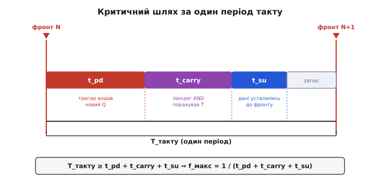
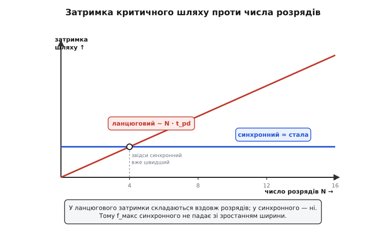

# 🧮 Стеля частоти: чому синхронний лічильник виграє на швидкості

У статті вже прозвучало обіцяне: синхронний лічильник не просто чистіший за ланцюговий — він **швидший**, і його гранична частота **не залежить** від числа розрядів. Записали ми це однією формулою:

```
f_макс = 1 / (t_тригера + t_переносу + t_setup)
```

Але формула, впала з неба, нічого не варта. Інженерові треба знати не *що* написано, а *звідки* воно береться — щоб бачити, за яку саме ланку смикнути, коли лічильник не тягне потрібну частоту, і чому додавання ще восьми розрядів ланцюговий лічильник валить, а синхронний — ні. Тож виведімо цю стелю з першопричин, крок за кроком, і подивімося, де в ній сховане головне слово «немає N».

Апарат тут навдивовижу скромний — жодних інтегралів, жодних рядів. Уся математика стелі частоти — це **додавання відрізків часу вздовж одного шляху** й ділення одиниці на суму. Проте за цією скромністю стоїть точна фізична картина, і саме її треба зрозуміти до кісток.

## Період такту — це дедлайн, а не годинник

Почнімо з того, що взагалі означає «частота такту» для тактованої схеми. Спокуса — думати про такт як про метроном, що просто відбиває ритм. Насправді для схеми важливіший інший бік: період такту — це **дедлайн**. Між двома сусідніми фронтами схема має встигнути зробити всю роботу, потрібну, щоб наступний фронт застав правильні дані. Не встигла — фронт клацне по недорахованому значенню, і тригер запам'ятає **сміття**.

Розкладімо, що саме мусить статися між фронтом N і фронтом N+1 у синхронному лічильнику. Ланцюжок подій завжди той самий:

Спершу приходить фронт N. Кожен тригер, якому цього такту випало перемкнутися, перекидається — і на його виході Q з'являється **нове** значення. Але не миттєво: вихід реагує на такт із затримкою — **затримкою поширення тригера** (англ. *propagation delay*, t_pd). Це фізичний час, за який внутрішні транзистори тригера перемкнуться й дотягнуть вихід до нового рівня.

Далі нове Q розтікається в **логіку переносу** — той самий ланцюг вентилів AND, що обчислює умову «усі нижчі біти = 1» для кожного старшого розряду. Вентилі теж не безкоштовні: сигнал іде крізь них зі своєю затримкою — назвімо її t_переносу (t_carry). На виході цієї логіки з'являється готовий сигнал T для кожного тригера: перевертатись йому наступного фронту чи ні.

І, нарешті, цей сигнал T мусить **встигнути влягтися** на вході тригера **до** того, як прийде фронт N+1. Тригер — не миттєвий фотоапарат; щоб він надійно зафіксував вхід, той вхід має бути стабільним уже за деякий час **перед** фронтом. Цей проміжок називають **часом підготовки** (англ. *setup time*, t_setup): вікно перед фронтом, протягом якого дані на вході чіпати не можна, інакше тригер може «завагатися» й піти в непевний стан. Це та сама вимога, з якої виростає весь [таймінг синхронних схем](book:electronics/metastability-timing): порушив setup — ризикуєш метастабільністю.

> 🔧 **Навіщо це.** Трьома словами «дедлайн, а не годинник» пояснюється, чому розгін частоти має межу взагалі. Ви не можете тактувати схему швидше, ніж вона встигає долічити, — так само, як не можна давати кухареві нову замову, поки він не дійшов до плити з попередньою. Уся боротьба за частоту — це боротьба за скорочення того, що мусить уміститися між двома фронтами.

## Складаємо відрізки: критичний шлях

Тепер найважливіше спостереження. Ці три події трапляються **одна за одною**, послідовно: спершу тригер видає Q, **тоді** логіка рахує T, **тоді** T усідається до фронту. Одне не може початися, поки не скінчилося попереднє — сигнал фізично мусить пройти цю дорогу від виходу тригера, крізь логіку, до входу наступного тригера. А коли відрізки часу йдуть послідовно, вони **складаються**.

Ця дорога — від виходу одного тригера, крізь комбінаційну логіку, до входу тригера, який має її результат зафіксувати, — має власну назву: **критичний шлях** (англ. *critical path*, вирішальний шлях). «Критичний» — бо саме він вирішує, як швидко можна тактувати всю схему: період такту мусить бути не коротшим за час проходу цим шляхом.


*Між фронтом N і фронтом N+1 послідовно вкладаються три відрізки: t_pd (тригер видав нове Q) → t_carry (ланцюг AND порахував T) → t_setup (дані усталились до фронту). Вони йдуть один за одним, тож **складаються**; сума не має перевищити період такту. Що лишилося до фронту — запас. Звідси й уся формула: період ≥ сума трьох, отже частота ≤ одиниця поділена на цю суму.*

Запишімо це як нерівність. Період такту T_такту має вмістити всю суму:

```
T_такту ≥ t_pd + t_carry + t_setup
```

Знак «≥» тут не випадковий — він і є фізична суть. Період **можна** зробити довшим за критичний шлях (тоді буде запас, лічильник працюватиме спокійно); а **коротшим** — не можна, інакше сигнал не встигне пройти дорогу до фронту. Найкоротший **дозволений** період — рівно тоді, коли нерівність стає рівністю:

```
T_такту(мін) = t_pd + t_carry + t_setup
```

А частота — це просто величина, обернена до періоду: скільки таких періодів уміститься в секунду. Що коротший найкоротший дозволений період, то вища гранична частота:

```
             1                        1
f_макс = ──────────── = ──────────────────────────────
          T_такту(мін)     t_pd + t_carry + t_setup
```

Ось і вся стеля частоти. Три відрізки склали в суму, одиницю поділили на суму — готово. Жодної вищої математики; уся вона — у розумінні, що відрізки складаються **тому, що йдуть послідовно вздовж одного шляху**.

## Де сховане головне: у формулі немає N

Тепер — заради чого все затівалося. Придивімося до знаменника:

```
t_pd + t_carry + t_setup
```

Скільки тут згадок про **число розрядів** лічильника — 4, 8, 32? **Жодної.** t_pd — це затримка **одного** тригера. t_setup — вимога **одного** тригера. А t_carry — затримка логіки переносу, і от вона єдина заслуговує на пильний погляд, бо здається, що вона *мала б* залежати від ширини.

Розберімося чому — і чому насправді ні. Уся хитрість — у слові «одночасно». Фронт такту приходить до **всіх** тригерів в один момент; отже, всі виходи Q усталюються теж приблизно в один момент — за t_pd після фронту. А тепер ключове: логіка переносу для кожного розряду дивиться на ці **вже готові** Q **паралельно**. Вентиль AND, що рахує T для біта Q3, бере Q0·Q1·Q2 — і всі три вже стоять на своїх дротах. Йому не треба чекати, поки «докотиться» якийсь сигнал від молодшого краю: усе, що йому потрібне, з'явилося одночасно з виходами інших тригерів.

Тому t_carry — це затримка **однієї** логічної операції, а не естафети вздовж розрядів. Обчислення переносу для всіх розрядів іде **пліч-о-пліч**, а не одне за одним. Скільки б розрядів не додати, кожен рахує свій T зі своїх (уже готових) входів у той самий час, що й сусіди.

Ось чому у формулі немає N. І це не математичний фокус, а прямий наслідок фізики спільного такту: **фронт приходить до всіх разом → усі Q готові разом → перенос усі рахують разом**. Ланцюжок причин не має жодної ланки, що росла б із шириною.


*Критичний шлях **синхронного** лічильника (синя горизонталь) не залежить від числа розрядів — сума t_pd + t_carry + t_setup стала. Критичний шлях **ланцюгового** (червона пряма) росте пропорційно N: щоб старший біт устиг, треба дочекатися естафети з усіх нижчих. Уже від кількох розрядів синхронний нижчий — тобто швидший, — і що ширший лічильник, то більший розрив.*

## Що було в ланцюговому — і чому там N є

Аби відчути перевагу, треба побачити, від чого синхронний лічильник **утік**. Повернімося до ланцюгового (асинхронного) — де кожен тригер тактується виходом сусіда.

Там дорога до старшого біта — не паралельна, а послідовна естафета. Щоб перемкнувся Q3, спершу має спрацювати Q0 (за t_pd після спільного фронту); **його** перемикання тактує Q1 — той спрацює ще за t_pd; вихід Q1 тактує Q2 — плюс t_pd; і лише Q2 нарешті тактує Q3 — ще t_pd. Затримки не рахуються паралельно; вони **вишиковуються в чергу**:

```
ланцюговий:  критичний шлях ≈ N · t_pd     (естафета вздовж усіх N розрядів)
синхронний:  критичний шлях  =  t_pd + t_carry + t_setup   (без N)
```

Ось вона, різниця, гола й очевидна. У ланцюговому **число розрядів стоїть множником** біля затримки: 4 розряди — чотири затримки поспіль, 8 розрядів — вісім, 32 — тридцять дві. Що ширший лічильник, то довша естафета, то нижча стеля частоти. Стеля ланцюгового **падає обернено до ширини**:

```
f_макс(ланцюговий) ≈ 1 / (N · t_pd)
```

А стеля синхронного — стала, бо в його знаменнику N немає. Тому на вузькому лічильнику (2–3 біти) різниця майже непомітна, а на широкому — прірва: 32-розрядний ланцюговий лічильник тягнув би естафету з тридцяти двох затримок, тоді як 32-розрядний синхронний тактується так само швидко, як 4-розрядний. Саме це показує розходження двох ліній на рисунку вище: синя лежить, червона дереться вгору.

> 🔧 **Навіщо це.** Оце «N біля затримки» — практичний присуд ланцюговому лічильнику. Він годиться, поки розрядів мало й частота низька (подільник для блимання світлодіодом). Та щойно треба **широко і швидко** — лічильник адреси, таймер на десятки мегагерц, дільник із чистим виходом — його стеля вже впала нижче потрібної, і вибору немає: тільки синхронний, чия стеля з шириною не рухається.

## Порахуймо на числах

Абстрактні формули оживають, коли в них підставити реальні наносекунди. Візьмімо типові для класичної логіки значення: затримка тригера t_pd = 10 нс, час підготовки t_setup = 5 нс, а логіка переносу — простий вентиль AND із затримкою t_carry = 7 нс. Порахуймо стелю синхронного 4-розрядного лічильника.

**Умова: синхронний 4-розрядний лічильник; t_pd = 10 нс, t_carry = 7 нс, t_setup = 5 нс. Знайти f_макс.**

```
критичний шлях = t_pd + t_carry + t_setup
               = 10 нс + 7 нс + 5 нс
               = 22 нс

f_макс = 1 / 22 нс
       = 1 / (22 × 10⁻⁹ с)
       ≈ 45 454 545 Гц
       ≈ 45.5 МГц
```

Тепер найцікавіше — **розширмо лічильник до 32 розрядів** і подивімося, що станеться зі стелею. У синхронному нічого не додається до критичного шляху: фронт так само приходить до всіх, перенос так само рахується паралельно.

```
синхронний, 32 розряди:
критичний шлях = 10 нс + 7 нс + 5 нс = 22 нс   (те саме!)
f_макс ≈ 45.5 МГц                              (не змінилось)
```

А тепер той самий 32-розрядний лічильник, але **ланцюговий** — де затримки шикуються в чергу:

```
ланцюговий, 32 розряди:
критичний шлях ≈ N · t_pd = 32 × 10 нс = 320 нс
f_макс ≈ 1 / 320 нс ≈ 3.1 МГц
```

Порахуймо, у скільки разів синхронний тут швидший:

```
45.5 МГц / 3.1 МГц ≈ 14.5 раза
```

Ось ціна вибору в конкретних мегагерцах. На чотирьох розрядах обидва десь поруч; на тридцяти двох синхронний випереджає ланцюговий у півтора десятка разів — і що ширше, то більше. Число 22 нс у синхронного не зрушило, а 320 нс у ланцюгового — прямий наслідок множника N.

Ось як та сама відмінність виглядає в коді — якщо порахувати стелю обох лічильників однією функцією прошивки:

**Умова: обчислити f_макс синхронного й ланцюгового лічильника на N розрядів за заданими затримками (у наносекундах).**

:::tabs
```c
#include <stdint.h>

// Стеля частоти в мегагерцах. Затримки — у наносекундах.
// Синхронний: критичний шлях НЕ залежить від n (перенос паралельний).
double fmax_sync_MHz(double t_pd, double t_carry, double t_setup) {
    double path_ns = t_pd + t_carry + t_setup;   // n тут не бере участі
    return 1000.0 / path_ns;                      // 1/нс = ГГц → ×1000 = МГц
}

// Ланцюговий: затримки складаються вздовж усіх n розрядів (естафета).
double fmax_ripple_MHz(double t_pd, uint32_t n) {
    double path_ns = (double)n * t_pd;            // ось воно, N біля затримки
    return 1000.0 / path_ns;
}
```
```python
# Стеля частоти в мегагерцах. Затримки — у наносекундах.
# Синхронний: критичний шлях НЕ залежить від n (перенос паралельний).
def fmax_sync_mhz(t_pd, t_carry, t_setup):
    path_ns = t_pd + t_carry + t_setup   # n тут не бере участі
    return 1000.0 / path_ns              # 1/нс = ГГц → ×1000 = МГц


# Ланцюговий: затримки складаються вздовж усіх n розрядів (естафета).
def fmax_ripple_mhz(t_pd, n):
    path_ns = n * t_pd                   # ось воно, N біля затримки
    return 1000.0 / path_ns
```
```go
// Стеля частоти в мегагерцах. Затримки — у наносекундах.
// Синхронний: критичний шлях НЕ залежить від n (перенос паралельний).
func FmaxSyncMHz(tPd, tCarry, tSetup float64) float64 {
	pathNs := tPd + tCarry + tSetup // n тут не бере участі
	return 1000.0 / pathNs          // 1/нс = ГГц → ×1000 = МГц
}

// Ланцюговий: затримки складаються вздовж усіх n розрядів (естафета).
func FmaxRippleMHz(tPd float64, n uint32) float64 {
	pathNs := float64(n) * tPd // ось воно, N біля затримки
	return 1000.0 / pathNs
}
```
:::

Зверніть увагу, як точно код відбиває математику. У `fmax_sync_MHz` параметра `n` **немає взагалі** — критичний шлях від нього не залежить, тож і формула його не питає. У `fmax_ripple_MHz` натомість `n` стоїть множником при `t_pd` — рівно тим множником, що валить стелю зі зростанням ширини. Коефіцієнт `1000.0` — це переведення одиниць: одиниця, поділена на наносекунди, дає гігагерци (10⁹ Гц), а помножена на 1000 — мегагерци. Викличте обидві функції з n=32 — і одна поверне ті самі 45.5, а друга — 3.1, у повній згоді з ручним рахунком вище.

## Один нюанс: коли сам перенос стає довгим

Формула вище чесна, поки t_carry — це затримка **одного** вентиля. Але придивімося до логіки переносу уважніше. Якщо будувати її найпростіше — ланцюжком, де AND для біта Q3 бере не всі нижчі Q напряму, а перевикористовує вже готовий вихід AND від біта Q2, — то ці вентилі теж вишикуються в естафету. Тоді t_carry сам почне рости з шириною, і N прокрадеться назад у знаменник — уже через логіку переносу, а не через такт.

Це та сама хвороба, тільки поменшала: не тригери шикуються в чергу, а вентилі AND. І лік їй той самий, що й у [суматора](book:electronics/combinational-circuits), де перенос точнісінько так само може повзти розрядами. Лік зветься **прискорений перенос** (англ. *carry look-ahead*, «зазирнути вперед»): замість естафети умову «усі нижчі = 1» для кожного розряду обчислюють **окремою** логікою, що дивиться просто на потрібні Q, не чекаючи сусіднього вентиля. Тоді t_carry знову стає затримкою фіксованої глибини (не однієї сходинки, а кількох, але **не пропорційної** N), і стеля частоти майже перестає залежати від ширини навіть на широких лічильниках.

Ідею прискореного переносу дали Арнольд Вайнбергер і Джон Сміт у праці «A Logic for High-Speed Addition» (Національне бюро стандартів США, циркуляр 591, 1958) — це усталений, добре задокументований результат; ще раніший різновид зазирання вперед приписують механічній машині Z1 Конрада Цузе кінця 1930-х, а патент на двійковий прискорений перенос подав Джералд Розенбергер (IBM) 1957 року. Готові мікросхеми синхронних лічильників саме тому й мають на борту прискорений перенос — щоб каскадувати їх без утрати швидкості; ця апаратна деталь розібрана в [мікросхемах синхронних лічильників](book:electronics/synchronous-counter/comp-sync-counter-ics.md).

Практичний висновок простий. У «чесній» формулі

```
f_макс = 1 / (t_pd + t_carry + t_setup)
```

перший і третій доданки — фізичні сталі тригера, з ними нічого не вдієш. А середній, t_carry, — **єдина ручка, яку інженер справді крутить**: наївний ланцюг AND робить його пропорційним ширині, прискорений перенос — майже сталим. Уся інженерія «зробити лічильник ще швидшим» зводиться до боротьби за короткий перенос.

## Що винести

Стеля частоти синхронного лічильника — це не магія й не таблична константа, а проста арифметика критичного шляху. Між двома фронтами такту послідовно вкладаються три відрізки: тригер видає нове значення (t_pd), логіка переносу рахує, кому перемикатися (t_carry), і цей сигнал усідається на входах до наступного фронту (t_setup). Бо вони йдуть **один за одним** вздовж одного шляху — вони **складаються**; період такту не може бути коротшим за їхню суму, а частота — вища за одиницю, поділену на цю суму.

Головне слово всієї вставки — «немає N». У знаменнику стелі число розрядів **не з'являється**, бо спільний такт приходить до всіх тригерів разом, усі виходи готові разом, і перенос усі розряди рахують **паралельно**, а не естафетою. Тому синхронний лічильник тримає ту саму частоту й на 4, і на 32 розрядах. Ланцюговий натомість несе N **множником** у критичному шляху (N·t_pd) — його стеля падає обернено до ширини, і на широкому лічильнику він програє синхронному в рази. Єдина пастка синхронного — довгий ланцюг переносу на великій ширині; її прибирає прискорений перенос, після чого N зникає із знаменника вже остаточно. Ось чому, коли треба лічити **широко і швидко**, вибору немає — тільки синхронний.
