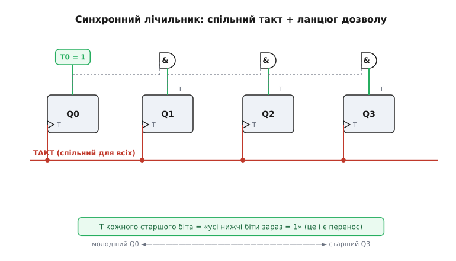
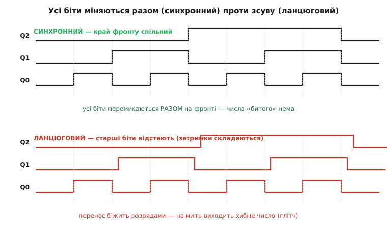
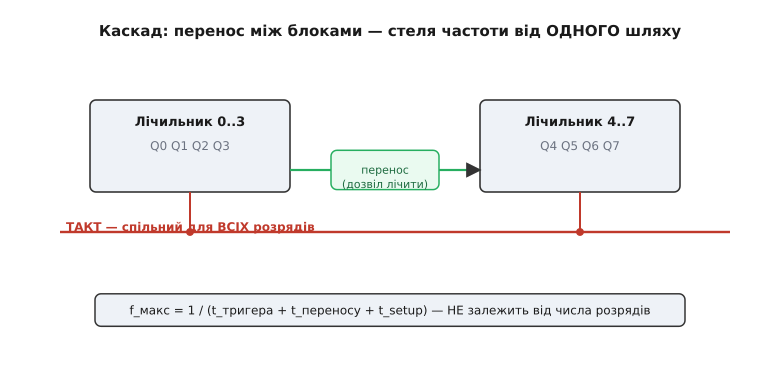

# Синхронний лічильник

[Лічильник](topic:electronics/counters) можна скласти найдешевшим способом — ланцюжком, де кожен тригер тактується виходом сусіда: молодший «б'є» наступного, той — наступного, і так до старшого розряду. Працює, але має приховану ваду: зміна біжить розрядами **по черзі**, з затримкою на кожному кроці, і на коротку мить лічильник показує **хибне** число. Для блимання світлодіодом це байдуже. А для адреси пам'яті, лічильника команд процесора чи будь-чого, що читають **інші** тактовані схеми, — катастрофа. **Синхронний лічильник** (гр. *sýn* — разом, *chrónos* — час; «той, що в один час») розв'язує це радикально: усі його тригери перемикаються **одночасно**, від **спільного** такту. Жоден біт не відстає — число завжди ціле. Ціна — трохи логіки, що наперед вирішує, кому з тригерів цього такту перевернутися.

Щоб побачити, чому ця логіка взагалі потрібна й звідки вона береться, треба спершу зрозуміти, що саме «ламається» в найпростішому лічильнику.

### Хвороба ланцюгового рахунку: перенос біжить розрядами

Уявімо звичайний двійковий лічильник, де кожен тригер ділить частоту попереднього навпіл. Молодший біт Q0 перемикається щотакту, Q1 — раз на два такти, Q2 — раз на чотири. Поки рахунок іде 000 → 001 → 010, усе тихо. Та настає мить переходу 0111 → 1000 — і тут видно проблему. Щоб старший біт перевернувся, спершу має перемкнутися Q0, **його** перемикання тактує Q1, той перекине Q2, і лише Q2 нарешті перекине Q3. Кожен крок коштує **затримки поширення** тригера — часу, за який вихід реагує на свій такт (англ. *propagation delay*, скажімо 10 нс на корпус).

Тож перехід 0111 → 1000 не миттєвий. За ці кілька десятків наносекунд лічильник встигає показати цілу низку **проміжних, неправильних** чисел:

```
0111 → 0110 → 0100 → 0000 → 1000
(старт)  Q0↓    Q1↓    Q2↓    Q3↑   (кожна стрілка — ще одна затримка тригера)
```

На дроті старшого розряду по дорозі від 7 до 8 встигають промайнути 6, 4, 0 — числа, яких у рахунку **немає**. Це короткий хибний імпульс — **глітч** (англ. *glitch*, збій). Сам лічильник за мить «осідає» на правильному 1000, тож якщо просто читати його раз на такт оком — нічого не помітиш. Але якщо ці виходи заводять у **дешифратор адреси** або в інший тактований блок, той зловить хибне 0000 чи 0100 і зреагує на адресу, якої ви не задавали.

Корінь біди — у тому, що тригери тактуються **не разом**. Кожен чекає, поки спрацює сусід; затримки **складаються** вздовж розрядів. Звідси й назва такого лічильника — **ланцюговий** (англ. *ripple*, брижі: зміна «брижами» біжить від молодшого біта до старшого; його ще звуть асинхронним). І звідси ж — ідея ліку: а що, як тактувати **всі** тригери **одним** сигналом, щоб ніхто нікого не чекав?

> 🔧 **Навіщо це.** Глітч ланцюгового лічильника — не вигадка з підручника, а перша річ, об яку спотикаються на практиці. Поставте ланцюговий лічильник адресувати ПЗП — і на кожному «складному» переході (коли перевертається багато бітів) процесор на мить смикне хибну адресу, прочитає сміття, можливо, спрацює не той вихід дешифратора. Саме тому будь-яку шину, лічильник стану чи адресу, яку читають **інші** синхронні схеми, будують **синхронною**: щоб число ніколи не «розривалося» в часі.

### Спільний такт: усі перемикаються в одну мить

Перша й головна ознака синхронного лічильника — **один такт на всіх**. Тактові входи всіх тригерів з'єднані з тим самим джерелом; ніхто не тактується виходом сусіда. Це прямо випливає з того, навіщо взагалі придумали [тактовий сигнал](topic:electronics/clock-signal) — щоб уся машина оновлювалася **узгоджено, в один домовлений момент**, а не «коли кому заманеться».

Та одразу постає питання. Якщо всі тригери дивляться на **той самий** фронт такту — як зробити, щоб вони перемикалися **по-різному**? Адже молодший біт має перевертатися щотакту, Q1 — раз на два, Q2 — раз на чотири. У ланцюговому лічильнику цю «різну швидкість» давала сама схема з'єднань (кожен ділив попередній навпіл). А коли такт спільний, ділити нема як — усі тригери «б'ються» одночасно.

Відповідь і є серцем синхронного дизайну: спільний такт **визначає лише МИТЬ**, коли всім можна перемкнутися; а **ЧИ** перемикатися кожному конкретному тригерові — вирішує окрема **логіка дозволу** на його вході. Один сигнал каже «зараз!», інша схема каже «тобі — так, а тобі — ні». Розведімо ці дві ролі — і весь лічильник стане прозорим.

### Логіка дозволу: коли якому біту перевертатися

Цеглинка тут — тригер, що вміє за командою або **перевернутися**, або **лишитися**. Найзручніше думати про нього як про T-тригер (англ. *toggle*, перемикати): є вхід T (від *toggle*); якщо T=1 у мить фронту — тригер перекидається в протилежний стан, якщо T=0 — тримає старе значення. Зробити такий із [D-тригера](topic:electronics/d-flip-flop) просто: завести на вхід D вираз «Q, якщо не перемикаємось; Q̄, якщо перемикаємось», тобто D = Q ⊕ T (виключне АБО). Коли T=1, D=Q̄ — наступного фронту Q перевернеться; коли T=0, D=Q — Q лишиться. Уся хитрість тепер — правильно **порахувати T** для кожного розряду.

Подивімося на двійковий рахунок очима окремого біта. Питання просте: **коли** біт міняє своє значення? Молодший Q0 міняється **щотакту** — 0,1,0,1… Біт Q1 міняється тоді, коли Q0 переповнюється з 1 у 0, тобто **коли Q0=1**. Біт Q2 міняється, коли переповнюються **обидва** нижчі, тобто **коли Q0=1 і Q1=1**. Закономірність очевидна:

```
T0 = 1                         молодший — перемикається завжди
T1 = Q0                        Q1 перевернеться, коли Q0 = 1
T2 = Q0 · Q1                   Q2 — коли всі нижчі = 1
T3 = Q0 · Q1 · Q2              Q3 — коли всі нижчі = 1
Tn = Q0 · Q1 · … · Q(n−1)     загальне правило
```

Ось і вся логіка дозволу: **біт перевертається саме тоді, коли всі молодші за нього біти зараз дорівнюють одиниці.** Це й зрозуміло — старший розряд двійкового числа змінюється рівно тоді, коли «накопичений» нижній край дійшов до межі й от-от переповниться. Реалізується це ланцюжком вентилів **AND**: T кожного старшого біта — це логічне «І» всіх нижчих виходів Q.


*Усі тригери тактуються **спільною** червоною лінією знизу — фронт приходить до всіх одночасно. Зверху — логіка дозволу: молодший Q0 має T0=1 (перемикається щотакту), а T кожного старшого біта дає вентиль **AND**, що перевіряє «усі нижчі біти зараз = 1». Спільний такт каже «коли», ланцюг AND каже «кому» — і всі дозволені біти перевертаються **в одну мить**.*

Цей ланцюг AND, що несе вгору розрядами сигнал «усі нижчі заповнені», має власну назву — **перенос** (англ. *carry*). Він — точний двійник [переносу в суматорі](topic:electronics/combinational-circuits): там перенос біжить від молодшого розряду до старшого, кажучи «тут переповнилось, додай вище»; тут — рівно те саме, лише в лічильнику. Глибша спорідненість проста: **лічити на одиницю — це і є додавати одиницю**, тож логіка лічильника й логіка суматора — близькі родичі.

Тепер видно фокус повністю. Спільний такт відмірює моменти. У кожен момент кожен тригер дивиться на **свій** T (готовий **заздалегідь**, ще до фронту, бо виходи Q усталилися минулого такту) і або перевертається, або ні. Жоден біт не чекає на сусіда — усі рішення вже пораховані наперед, а сам фронт лише «спускає курок» одночасно для всіх. Тому й результат завжди цілий: на фронті число стрибає з 7 одразу в 8, без проміжних 6, 4, 0.

### Чому це лікує глітч: усі біти разом

Порівняймо два лічильники на одній часовій діаграмі — і різниця стане очевидною.


*Угорі — **синхронний**: усі переходи строго на лінії спільного фронту, усі біти міняються разом, проміжного «битого» числа не виникає. Унизу — **ланцюговий**: Q1 відстає від ідеального фронту на одну затримку тригера, Q2 — на дві (затримки складаються вздовж розрядів), і на переходах виходить короткий хибний код — глітч. Той самий рахунок, та сама послідовність чисел — але в синхронному вони ніколи не «розриваються» в часі.*

Уся різниця — в одному. У ланцюговому затримки тригерів **складаються** одна за одною, тож старший біт перемикається помітно пізніше за молодший — і поки він «доганяє», на виході стоїть число-привид. У синхронному всі тригери ловлять свій фронт **одночасно**, тож усі біти, що мають перемкнутися, перемикаються в один і той самий момент. Перехід стає **атомарним**: був 7 — став 8, без жодного проміжного стану на виходах. Саме цього й треба, коли число читає інша синхронна логіка: вона побачить лише старе або нове, ніколи — хибне проміжне.

### Стеля частоти: за що платимо й що виграємо

Здавалося б, синхронний лічильник мав би бути повільнішим — адже з'явилася зайва логіка переносу, якої в ланцюговому не було. Та насправді він **швидший**, і ось чому. Швидкість будь-якої тактованої схеми визначає її **найдовший шлях** від виходу одного тригера до входу іншого — критичний шлях (англ. *critical path*). Усе, що має статися за один період такту, мусить **встигнути** пройти цим шляхом; інакше тригер не «побачить» правильне значення в мить наступного фронту. Це обмеження — серце [таймінгу синхронних схем](topic:electronics/metastability-timing): період такту мусить бути не коротший за критичний шлях.

У **ланцюговому** лічильнику найдовший шлях — це вся естафета затримок від молодшого тригера до старшого: щоб старший біт устиг, треба дочекатися, поки спрацюють **усі** нижчі по черзі. На N розрядів це N затримок поспіль — і що ширший лічильник, то повільніше він може тактуватися.

У **синхронному** все інакше. Найдовший шлях — це: затримка одного тригера (поки Q усталиться) + затримка логіки переносу (ланцюг AND) + час підготовки даних на вході наступного тригера (англ. *setup time*). Запишемо стелю частоти:

```
f_макс = 1 / (t_тригера + t_переносу + t_setup)
```

Ключове — у цій формулі **немає N**. Скільки б розрядів не було, фронт приходить до всіх одночасно, а перенос рахується **паралельно**, не естафетою. Тому синхронний лічильник тримає високу частоту й на 8, і на 32 розрядах, тоді як ланцюговий гальмує тим сильніше, що він ширший. Як саме виводиться ця формула й чому синхронний дизайн перемагає на швидкості, докладніше — у [виведенні стелі частоти](topic:electronics/synchronous-counter/math-max-frequency.md).

Один нюанс псує ідеальну картину. Якщо перенос робити простим ланцюгом AND, де старший вентиль чекає на вихід молодшого, то на дуже широкому лічильнику цей ланцюг сам стає довгим — і знову вантажить критичний шлях. Лік той самий, що й у суматорі: **прискорений перенос** (англ. *carry look-ahead*), коли «усі нижчі = 1» обчислюють для кожного розряду окремою логікою, не чекаючи сусідів. Готові мікросхеми синхронних лічильників саме так і влаштовані — мають вбудований прискорений перенос, щоб каскадувати їх без втрати швидкості (про це — далі, у згадці про корпуси).


*Широкий лічильник складають із вужчих блоків, з'єднаних **переносом**: старший блок дозволено лічити лише тоді, коли молодший переповнився. Такт лишається **спільним** для всіх розрядів — тому всі біти й тут міняються разом. Стеля частоти задається одним критичним шляхом і **не залежить** від загального числа розрядів — це й є головна перевага синхронного дизайну.*

> 🔧 **Навіщо це.** Винесіть із цього розділу одну думку для практики: синхронний лічильник не просто «чистіший», він і **швидший**, бо його гранична частота не падає зі зростанням розрядності. Коли вам треба лічити швидко й широко (таймер-лічильник на десятки мегагерц, лічильник адреси, дільник із чистим виходом), беруть **синхронний**. А коли в довіднику пишуть про лічильник «synchronous, with look-ahead carry» — це обіцянка саме цього: усі біти разом, висока частота, легке каскадування.

### Дозвіл, завантаження, напрям: керований лічильник

Сам принцип спільного такту й логіки переносу одразу дає змогу додати корисні **керувальні** входи — і саме за них синхронні лічильники так люблять у залізі.

**Дозвіл рахунку** (англ. *count enable*). Часто лічильник має лічити не щотакту, а лише коли дозволено. Додаємо спільний сигнал **EN** і подаємо його в **кожну** умову переносу: T0 = EN, T1 = EN · Q0, T2 = EN · Q0 · Q1 і так далі. Коли EN=0 — жоден біт не перевертається, лічильник **завмирає** на місці; коли EN=1 — лічить, як завжди. Завважте: завмирання теж відбувається **синхронно** — рахунок зупиняється рівно на фронті, а не «десь посередині».

**Синхронне завантаження** (англ. *parallel load*). Іноді треба не лічити з нуля, а почати з **заданого** числа — наприклад, щоб лічильник відмірював інтервал «вниз від N». Для цього перед кожним тригером ставлять перемикач (мультиплексор): за сигналом **LOAD** на вхід D іде не «наступне число рахунку», а біт із зовнішньої шини. На найближчому фронті лічильник **завантажує** це число одним стрибком — теж синхронно, чисто, без глітча.

**Реверс** (англ. *up/down*). Лічильник можна змусити рахувати не лише вгору, а й **вниз**. Уся різниця — в умові переносу: при лічбі вгору старший біт перевертається, коли всі нижчі = **1** (переповнення), а при лічбі вниз — коли всі нижчі = **0** (позичання, англ. *borrow*). Сигнал напряму просто перемикає логіку переносу між цими двома умовами.

Ось як ці керувальні входи виглядають у прошивці, коли той самий синхронний лічильник живе змінною. Логіка дозволу/завантаження/напряму перекладається майже дослівно:

**Умова: один крок синхронного лічильника, керованого сигналами EN, LOAD, UP (4 біти, рахунок за модулем 16).**

:::tabs
```cpp
#include <cstdint>

// Один «фронт такту» синхронного лічильника: усі рішення — одночасно.
// load_val — число для завантаження; en/load/up — керувальні входи.
uint8_t sync_count_step(uint8_t q, uint8_t load_val,
                        bool en, bool load, bool up) {
    if (load)                 // завантаження має пріоритет — чистий стрибок
        return load_val & 0x0F;
    if (!en)                  // дозволу нема — лічильник завмирає синхронно
        return q;
    if (up)                   // рахунок угору за модулем 16
        return (q + 1) & 0x0F;
    else                      // рахунок униз за модулем 16
        return (q - 1) & 0x0F;
}
```
```python
# Один «фронт такту» синхронного лічильника: усі рішення — одночасно.
# load_val — число для завантаження; en/load/up — керувальні входи.
def sync_count_step(q, load_val, en, load, up):
    if load:                  # завантаження має пріоритет — чистий стрибок
        return load_val & 0x0F
    if not en:                # дозволу нема — лічильник завмирає синхронно
        return q
    if up:                    # рахунок угору за модулем 16
        return (q + 1) & 0x0F
    else:                     # рахунок униз за модулем 16
        return (q - 1) & 0x0F
```
:::

Зверніть увагу, як точно код відбиває залізо. `load` має пріоритет над лічбою — це той самий мультиплексор, що перебиває «наступне число» зовнішнім. `!en` повертає `q` без змін — синхронне завмирання. `& 0x0F` — це межа за модулем 16, рівно як апаратний лічильник «перекочується» 1111 → 0000. А головне: функція обчислює **весь** наступний стан **за один виклик**, як справжній синхронний лічильник обчислює всі біти за один фронт, — жоден біт не «доганяє» інший. Маска `& 0x0F` тут не дрібниця: без неї `q + 1` виліз би за чотири біти, і «лічильник» поводився б не за модулем 16.

> 🔧 **Навіщо це.** Саме ці керувальні входи роблять синхронний лічильник робочим конем апаратних блоків. Дозвіл (EN) — щоб лічити подіями, а не сліпо щотакту. Завантаження (LOAD) — щоб задати початок інтервалу й відмірювати «вниз до нуля» (так працює перезавантажуваний таймер). Реверс — для лічби в обидва боки (позиція, кроки енкодера). У мікроконтролері апаратний таймер — це і є синхронний лічильник з усіма цими входами: ви задаєте напрям, межу й коли йому лічити, а він робить решту без участі процесора.

### Чому саме синхронний — і де його впізнати

Зведімо те, заради чого все це будувалося. Ланцюговий лічильник простий і дешевий, та його перенос біжить розрядами із затримкою — на переходах виходить хибне число, а гранична частота падає зі зростанням розрядності. Синхронний лічильник прибирає обидві біди однією ідеєю: **спільний такт** задає мить, а **логіка переносу** (ланцюг AND «усі нижчі = 1») наперед вирішує, кому перемикатися. Усі біти міняються **разом** — число завжди ціле; критичний шлях **не залежить** від числа розрядів — частота лишається високою. За це платять трохи зайвою логікою, та виграш — чистота й швидкість.

Упізнати синхронний лічильник легко за трьома прикметами: усі тригери ходять від **одного** такту; між ними сидить **логіка переносу** (а не з'єднання «вихід одного → такт іншого»); виходи перемикаються строго **на фронті, усі разом**. У довіднику ознака — слово «synchronous» і згадка про «look-ahead carry». Типові готові корпуси цього класу (4-розрядні синхронні лічильники з паралельним завантаженням і прискореним переносом) розібрано окремо — у [мікросхемах синхронних лічильників](topic:electronics/synchronous-counter/comp-sync-counter-ics.md).

І найголовніше для розуміння: синхронний лічильник — це не «складніша версія» простого, а **інша філософія**. Простий лічильник довіряє з'єднанням робити час за нього (кожен тактує сусіда); синхронний **відбирає час у єдиного диригента-такту** й лишає схемі тільки рішення «перевернутись чи ні». Це той самий принцип, на якому стоїть **вся** серйозна цифрова техніка: одна тактова лінія диригує, комбінаційна логіка готує наступний стан, тригери клацають разом по фронту. Лічильник, регістр, [скінченний автомат](topic:electronics/finite-state-machines), цілий процесор — усі вони, по суті, синхронні машини того самого роду; синхронний лічильник — найчистіший приклад цієї дисципліни.

> 🔧 **Навіщо це.** Три речі винесіть про синхронний лічильник. Перше: **усі тригери — від одного такту**, а хто перемикається, вирішує логіка переносу «усі нижчі = 1»; тому всі біти міняються **разом** і хибного проміжного числа не буває. Друге: він **швидший** за ланцюговий, бо критичний шлях не росте з розрядністю, — беріть його скрізь, де треба лічити швидко, широко й чисто. Третє: керувальні входи (дозвіл, завантаження, реверс) роблять його основою апаратних таймерів — і коли ви налаштовуєте таймер мікроконтролера на «лічити вниз від N і перезавантажитись», за лаштунками працює синхронний лічильник саме з цими входами.

---

**Коротко про головне.** **Синхронний лічильник** — це лічильник, у якому всі тригери тактуються **спільним** сигналом і перемикаються **одночасно**. Він розв'язує дві біди ланцюгового (асинхронного) лічильника, де кожен тригер тактує наступного: там перенос біжить розрядами із затримкою, тож на переходах виникає **хибне проміжне число** (глітч), а гранична частота падає зі зростанням розрядності. Ідея ліку: спільний такт визначає **мить** перемикання, а окрема **логіка дозволу** визначає, **кому** перемикатися. Ця логіка — ланцюг вентилів **AND**, що дає кожному старшому біту умову «перевернутись, коли всі нижчі біти = 1» (T0=1, T1=Q0, T2=Q0·Q1, …); це і є **перенос**, точний двійник переносу в суматорі. Бо всі рішення пораховані **наперед**, а фронт лише одночасно «спускає курок», усі біти міняються разом — число завжди ціле. Критичний шлях синхронного лічильника (t_тригера + t_переносу + t_setup) **не залежить** від числа розрядів, тому він і чистіший, і **швидший**; на широкі лічильники застосовують **прискорений перенос**. Спільний такт легко вбирає керувальні входи — **дозвіл** рахунку, синхронне **завантаження** числа, **реверс** напряму — через що синхронний лічильник став основою апаратних таймерів. Це найчистіший приклад загальної дисципліни синхронної логіки: один такт диригує, логіка готує наступний стан, тригери клацають разом.
