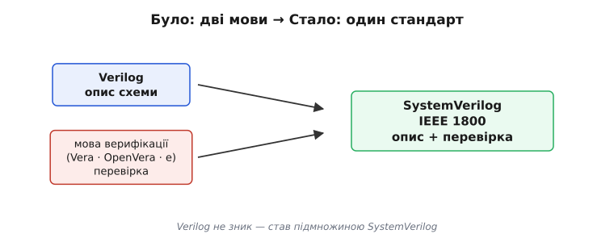

# SystemVerilog: сучасний стандарт HDL

Коли інженер сьогодні сідає описувати цифрову схему для FPGA чи мікросхеми, він майже напевно пише не «чистим» Verilog і не VHDL, а **SystemVerilog** (англ. *system* — «система» + *Verilog*). Це не окрема нова мова, а те, чим Verilog офіційно **став**: розширення, що доросло до самостійного стандарту й увібрало старий Verilog у себе. Розібратися варто не в переліку нових слів, а в одному простому питанні: **чого бракувало**, і чому індустрія погодилася переучуватися на нове. Відповідь ділиться навпіл — половина стосується **опису заліза** (де Verilog був незручний і небезпечний), половина — **перевірки** цього заліза (де його взагалі бракувало). SystemVerilog закрив обидві половини одним стандартом.

Щоб усе, що далі, лягало на місце, треба тримати в голові головний злам будь-якої [мови опису апаратури](topic:electronics/hdl): її код **не виконується, а синтезується** — описує схему, що існує вся й водночас, а не послідовність кроків у часі. SystemVerilog нічого в цьому не змінює; він лишається мовою **опису заліза**. Він лише робить цей опис **безпечнішим, виразнішим і придатним ще й для перевірки**. Почнімо з того, звідки він узявся, бо історія тут прямо пояснює його дволикість.

### Чому один стандарт замість двох мов

Наприкінці 1990-х у цифровому світі співіснували дві звички. **Verilog** (гібрид від англ. *verify* + *logic*, «перевіряти логіку») чудово **описував** схему, але як мова **перевірки** був бідний: складний тест доводилося дописувати мовами-надбудовами. Паралельно жили спеціальні **мови верифікації** — Vera, `e`, OpenVera, — потужні для тестів, але окремі від опису. Проєкт таким чином говорив двома різними мовами: однією креслив залізо, іншою його ганяв. Це коштувало сил і плодило помилки на стику.

Розв'язок народився в маленькому стартапі: компанія Co-Design Automation створила мову **Superlog** — Verilog, дорощений сучасними типами й засобами моделювання. У 2002 році Superlog передали галузевому консорціуму [Accellera](topic:electronics/systemverilog/hist-systemverilog.md), і на його основі почав рости відкритий стандарт. До нього доклали **OpenVera** (частину для верифікації подарувала Synopsys) — так під одним дахом опинилися і опис, і перевірка. У 2005-му це стало стандартом **IEEE 1800**, а в 2009-му відбулося головне: старий стандарт Verilog (IEEE 1364) **влили** в IEEE 1800 — відтоді Verilog офіційно є **частиною** SystemVerilog, окремого стандарту Verilog більше немає.


*Раніше проєкт вів два потоки різними мовами: Verilog **описував** схему, окрема мова (Vera, OpenVera, `e`) її **перевіряла**. SystemVerilog звів обидва під один стандарт IEEE 1800: тепер і креслення заліза, і тести на нього пишуть однією мовою. Verilog при цьому нікуди не зник — він став підмножиною SystemVerilog.*

Ось чому SystemVerilog **дволикий** від народження, і це не еклектика, а сенс: одна його половина — це **синтезовний** опис заліза (те, що перетвориться на вентилі й тригери), друга — засоби **перевірки** (те, що лишається в симуляторі й у кремній не потрапляє). Плутати ці половини — типова помилка новачка, тож далі щоразу відзначатимемо, по який бік межі ми стоїмо. Почнімо з боку опису — і з найкориснішого, що SystemVerilog дав саме інженеру-схемотехніку.

### Тип `logic`: кінець плутанини `wire` і `reg`

Найбільший щоденний подарунок SystemVerilog людині, що описує залізо, — новий тип сигналу `logic`. Щоб оцінити його, треба знати, яка пастка чигала на кожного в старому Verilog. Там сигнал мусив бути одного з двох типів, і вибір диктувався **не тим, чим сигнал є фізично, а тим, у якій конструкції його випадково присвоїли**:

- `wire` — «дріт», якщо сигнал приводить `assign` (комбінаційно);
- `reg` — «регістр», якщо сигнал присвоюють усередині блоку `always`.

Пастка — у слові `reg`. Воно **звучить** як «регістр» (тригер, пам'ять), і новачок природно думає: `reg` — це залізна комірка пам'яті. Насправді ж `reg` не означав ані регістра, ані пам'яті — це був просто «сигнал, якому присвоюють у процедурному блоці», і він міг стати як тригером (якщо блок під такт), так і чистою комбінаційною логікою (якщо без такту). Назва брехала. Через це люди роками плуталися: ставили `wire` там, де компілятор чекав `reg`, отримували незрозумілі помилки, чи навпаки бачили `reg` і хибно уявляли пам'ять, якої немає.

SystemVerilog розрубує вузол одним типом. Пиши `logic` — і не думай, `wire` це чи `reg`; інструмент сам розбереться за **контекстом**: приведений `assign`'ом — стане дротом, присвоєний під фронтом такту — стане тригером. Ти більше не мусиш заздалегідь оголошувати «природу» сигналу, яку однаково визначає те, **як** ти його описав.

**Умова.** Той самий сигнал `y` — раз комбінаційний, раз реєстровий. У старому Verilog його тип щоразу інший; у SystemVerilog — завжди `logic`.

```systemverilog
// SystemVerilog — усюди logic, тип один:
logic y1, y2;
assign y1 = a & b;                    // logic → тут стане ДРОТОМ (комбінаційно)
always_ff @(posedge clk) y2 <= d;     // logic → тут стане ТРИГЕРОМ (по такту)

// Старий Verilog змушував розрізняти на рівні типу:
wire y1;  assign y1 = a & b;          // мусив бути wire
reg  y2;  always @(posedge clk) y2 <= d;   // мусив бути reg — хоч це не «пам'ять» сама по собі
```

Висновок простий: `logic` прибирає фальшивий вибір, що ніколи не ніс сенсу. Природа сигналу — тригер чи дріт — випливає з того, **де і як** ти його присвоїв (це вирішує сам синтезатор), а не з ярлика в оголошенні. Через це `logic` став типом за замовчуванням у сучасному коді: майже все, що раніше було `wire` чи `reg`, тепер просто `logic`. (Один залишок старого світу тримається: якщо на **один** сигнал реально гонить кілька джерел — справжня шина з кількома драйверами, — потрібен саме `wire`, бо `logic` дозволяє лише одного драйвера. Такі шини рідкісні, тож у 99% коду це не турбує.)

> 🔧 **Навіщо це.** `logic` економить не рядки, а нервові клітини й помилки. У реальному проєкті ви щодня оголошуєте десятки сигналів, і в старому Verilog кожен потребував рішення «wire чи reg?» — рішення, що часто виявлялося хибним і давало помилку компіляції або, гірше, хибну ментальну модель («тут пам'ять», хоча її нема). З `logic` ви пишете природу заліза **самою логікою опису**, а не додатковим ярликом, і компілятор ловить справжні помилки (кілька драйверів на один сигнал) замість вигаданих. Правило-скорочення для щоденної роботи: **скрізь `logic`**, а `wire` діставайте лише коли свідомо будуєте шину з кількома драйверами.

### `always_ff`, `always_comb`, `always_latch`: намір, який перевіряє машина

Другий великий крок SystemVerilog для схемотехніка — три спеціалізовані блоки замість одного розпливчастого `always`. Щоб зрозуміти навіщо, згадаймо давню біду. У Verilog був єдиний `always`, і **яке залізо** з нього вийде, залежало від того, як його написали. Помилитися було легко, а найкоаварніша помилка — **ненавмисна засувка** (англ. *latch*, «клямка»). Опишеш комбінаційну логіку недбало — забудеш вказати вихід у якійсь гілці `if` — і синтезатор, чесно виконуючи Verilog, вирішить: «якщо в цьому випадку значення не задано, отже, його треба **запам'ятати**». Так з нізвідки народжується небажаний елемент пам'яті, який тихо псує таймінг і поведінку схеми. І Verilog **не міг попередити**, бо не знав вашого наміру: може, ви ту засувку й хотіли.

SystemVerilog дає змогу **оголосити намір**, і тоді машина сама перевірить, чи опис йому відповідає. Замість голого `always` пишуть один із трьох:

- `always_comb` — «я описую **комбінаційну** логіку без пам'яті»;
- `always_ff` — «я описую **тригери** (англ. *flip-flop*), пам'ять по фронту такту»;
- `always_latch` — «я справді хочу **засувку**» (рідко, але свідомо).


*Три спеціалізовані блоки кажуть інструменту, яке залізо ви задумали: `always_comb` — комбінаційна мережа без пам'яті, `always_ff` — [банк тригерів](book:electronics/d-flip-flop) по [фронту такту](book:electronics/edge-vs-level), `always_latch` — прозора засувка. Інструмент звіряє опис із наміром і **свариться**, якщо вони розходяться, — наприклад, коли в `always_comb` випадково народжується пам'ять.*

Виграш тут не косметичний, а захисний. Оголосивши `always_comb`, ви кажете інструменту: «тут пам'яті бути **не повинно**». І якщо через забутий `else` у вашому описі непомітно з'явиться засувка, інструмент **зупиниться з помилкою** замість того, щоб мовчки її синтезувати. Намір із голови перекочував у код, і машина стала здатна ловити невідповідність. Це ж стосується й `always_ff`: він каже «тут — і тільки тут — тригери по такту», і будь-яка спроба описати всередині нього комбінаційну логіку без такту буде піймана. Опис перестав бути двозначним.

> 🔧 **Навіщо це.** Ненавмисна засувка — один із найпідступніших дефектів у FPGA-практиці: схема синтезується, симуляція часто навіть проходить, а на платі логіка поводиться загадково, бо в комбінаційному колі осіла паразитна пам'ять, що тримає старе значення. У чистому Verilog її ловили очима на код-рев'ю або по звіту синтезу — тобто пізно й ненадійно. `always_comb` перетворює цю пастку на **помилку компіляції тут і зараз**: не описав вихід у всіх гілках — інструмент не дасть зібрати. Тому в сучасному синтезовному коді голий `always` майже не вживають: `always_comb` для логіки, `always_ff` для регістрів — і клас помилок «звідки тут засувка?» просто зникає.

### Типи, що описують задум: `enum`, `struct`, `typedef`

Досі ми лагодили старі болячки Verilog. Тепер — про те, чим SystemVerilog зробив опис **виразнішим**, ближчим до задуму інженера. У чистому Verilog усе, по суті, було голими бітами: шина `[2:0]` — це просто три дроти, і що вони означають (стан автомата? код команди? колір?), лишалося у голові автора та в коментарях. SystemVerilog дав змогу **називати** сенс.

**Перелік `enum`** (від англ. *enumeration*, «перелічення») дає станам і кодам людські імена замість голих чисел. Класичний приклад — [скінченний автомат](topic:electronics/finite-state-machines): замість того щоб пам'ятати, що `2'b00` — це «спокій», а `2'b10` — «передача», ви пишете імена, а компілятор сам роздає їм біти:

```systemverilog
typedef enum logic [1:0] { IDLE, START, SEND, STOP } state_t;
state_t state;                        // сигнал типу «стан автомата»

always_ff @(posedge clk)
    case (state)
        IDLE:  if (go) state <= START;   // читається як думка, не як біти
        START:            state <= SEND;
        SEND:  if (done) state <= STOP;
        STOP:             state <= IDLE;
    endcase
```

Виграш подвійний. По-перше, код **читається як задум**: `state <= START` замість `state <= 2'b01` — і наступний, хто це відкриє (часто ви за півроку), одразу бачить сенс. По-друге, `enum` **захищає**: ви не присвоїте станові випадкове число, яке не є жодним із перелічених станів, — компілятор це піймає. Названі стани й у звітах інструментів показуються іменами, тож і зневадження стає людяним.

**Структура `struct`** (від англ. *structure*, «будова») склеює кілька сигналів в один іменований пакет — так, як `struct` у C склеює поля. Замість того щоб тягати окремо `valid`, `addr`, `data` й боятися переплутати їх місцями, ви описуєте один пакет і звертаєтесь до полів за іменами:

```systemverilog
typedef struct packed {               // packed = щільно, як одна широка шина бітів
    logic        valid;
    logic [7:0]  addr;
    logic [31:0] data;
} bus_req_t;

bus_req_t req;
assign req.valid = 1'b1;              // до поля — за іменем, не за номером біта
assign req.addr  = 8'h20;
```

Слово `packed` тут важливе й суто «залізне»: воно каже пакувати поля **щільно**, як одну суцільну шину бітів (`valid` угорі, далі `addr`, далі `data`), — а отже, така структура **синтезовна**, її можна гнати дротами й регістрами як звичайну широку шину. Ключове слово `typedef` (від англ. *type definition*, «означення типу»), що склеює все це, дає вашому типові ім'я — `bus_req_t`, `state_t` — і ви користуєтеся ним будь-де, як вбудованим. Опис перестає бути розсипом безіменних бітів і стає описом **понять**: «запит на шину», «стан автомата».

> 🔧 **Навіщо це.** Іменовані типи прямо ріжуть найдорожчі помилки — ті, що компілятор старого Verilog пропускав. Переплутати місцями два поля однакової ширини, присвоїти автоматові неіснуючий стан, зібрати шину з бітів у неправильному порядку — усе це в голих бітах трапляється легко й ловиться пізно, на платі. З `enum` і `struct packed` компілятор бачить **сенс**, а не лише ширину, і б'є по руках одразу. Плюс код лишається читним для наступної людини — а в залізі, де один невірний біт коштує перепрошивки, читність опису це не розкіш, а захист.

### Інтерфейс: один пучок проводів замість десятка портів

Ще одна річ, що з'являється в реальних проєктах, — шини, які тягнуться крізь багато модулів. Уяви шину, де десяток сигналів (адреса, дані, дозвіл, готовність, запис/читання…) з'єднують кілька блоків. У чистому Verilog кожен із цих сигналів доводилося вручну **перелічувати в кожному порту кожного модуля**, крізь який вона проходить, — і варто десь помилитися в одному дроті чи забути додати новий, як з'являється тиха помилка з'єднання. SystemVerilog дав **інтерфейс** (англ. *interface*, «поверхня стику») — спосіб зібрати весь пучок проводів в один іменований об'єкт і передавати його між модулями цілком.

```systemverilog
interface bus_if;                     // увесь пучок описано ОДИН раз
    logic        req, ack;
    logic [7:0]  addr;
    logic [31:0] data;
endinterface

module master(bus_if b);              // модуль бере шину цілим об'єктом...
    assign b.req  = 1'b1;             // ...і чіпає її сигнали за іменами
    assign b.addr = 8'h04;
endmodule
```

Замість десятка окремих портів у кожному модулі — один параметр `bus_if b`, а всередині звертаєшся `b.addr`, `b.req` за іменами. Додав до шини новий сигнал — правиш його в **одному** місці (в описі `interface`), а не в кожному модулі окремо; і з'єднання не роз'їдеться, бо всі беруть той самий пучок. Це важливо саме для великих систем, де шини — SPI, AXI, власні — тягнуться крізь усю ієрархію.

Тут, одначе, час чесно провести межу. Інтерфейс — потужний, але його **синтезовна** частина скромніша, ніж повний набір можливостей: у самому кремнії він розгортається в ті самі дроти, тож частина зручностей інтерфейсу (методи, складна логіка всередині) призначена радше для **перевірки**, ніж для синтезу заліза. Це підводить нас до другої половини SystemVerilog — тієї, що в кремній не потрапляє зовсім.

### Друга половина: перевірка, що не стає залізом

Дотепер ми говорили про **опис** — про те, що синтезатор перетворить на вентилі й тригери. Але половина сенсу SystemVerilog — інша: **перевірка** опису до того, як він поїде в кремній. І тут криється найважливіша межа всієї мови, яку треба провести жирно.

**Синтезовна підмножина** SystemVerilog (типи `logic`/`bit`, `always_comb`/`always_ff`, `enum`, `struct packed`, інтерфейси-як-дроти) стає **залізом**. Але велика частина мови — засоби для **тестів** — навмисне в залізо **не** перетворюється; вона живе лише в симуляторі й служить одному: **ганяти** описану схему тисячами сценаріїв, щоб зловити помилку в моделі до того, як її наробили в металі. Сюди належать динамічні масиви й черги (зручні для збереження очікуваних результатів), класи й об'єкти (щоб будувати складні тести, як у звичайному програмуванні), генерація випадкових входів, і — головне — **твердження** (англ. *assertions*, «висловлення-запевнення»): формальні правила штибу «сигнал `ack` мусить прийти протягом трьох тактів після `req`», які симулятор перевіряє автоматично й кричить, щойно правило порушено.


*SystemVerilog має дві половини, розділені **межею синтезу**. Ліворуч — синтезовна підмножина (`logic`, `always_ff`, `enum`, `struct packed`): вона проходить крізь [синтезатор](book:electronics/hdl) і стає реальною схемою в FPGA. Праворуч — засоби перевірки (класи, динамічні масиви, твердження, генерація випадкових входів): вони живуть лише в симуляторі, ганяють опис тестами й у кремній **не потрапляють**. Пишучи код, треба завжди знати, по який бік межі ти стоїш.*

Ця межа — практично найважливіша річ, яку треба тримати в голові, працюючи із SystemVerilog. Спробуєш описати залізо динамічним масивом чи класом — синтезатор просто не зрозуміє, бо цьому немає відповідника у вентилях. І навпаки: у **тестбенчі** (англ. *testbench*, «випробувальний стенд» — код, що подає на схему входи й перевіряє виходи, сам у чіп не заливаючись) можна вживати всю потугу мови, бо він не стане залізом, а лишиться в симуляторі. Саме ця друга половина й була головним, чого бракувало старому Verilog, і саме заради неї злили верифікаційні мови в один стандарт.

**Умова.** Найпростіший тестбенч на світлодіодну «мигалку»: подати такт, покрутити схему, побачити її поведінку. Тут `initial`, `#` (затримка симуляції) та `$display` — усе це **не залізо**, а керування симулятором.

```systemverilog
module tb;
    logic clk = 0, led;
    blink dut(.clk(clk), .led(led));    // dut = device under test, схема-піддослідний

    always #5 clk = ~clk;               // #5 — «зачекати 5 одиниць» У СИМУЛЯТОРІ, не в залізі
    initial begin                       // initial — блок, що біжить раз на старті симуляції
        $display("починаю тест");       // $display — друк у консоль симулятора
        #100000  $finish;               // покрутити 100000 одиниць часу й спинити симуляцію
    end
endmodule
```

Прочитати це треба саме крізь межу синтезу. `always #5 clk = ~clk;` описує **не** генератор у залізі — це вказівка **симулятору** перемикати `clk` кожні 5 умовних одиниць часу, щоб було чим тактувати піддослідну схему. `initial`, `#100000`, `$display`, `$finish` — усе це керує **симуляцією**, а не будує вентилі; такий код у чіп не заливають. Піддослідна ж схема (`blink dut`) — це реальний синтезовний опис, який тестбенч ганяє. Ось наочна дволикість SystemVerilog в одному файлі: реальне залізо (`dut`) і код, що його випробовує, але сам залізом не стає.

> 🔧 **Навіщо це.** У FPGA-розробці помилку майже завжди дешевше зловити в симуляторі, ніж на платі: перезалити прошивку — хвилини, а знайти, чому «плата поводиться дивно», без видимості всередину — години. Тестбенч і твердження SystemVerilog дають цю видимість: ви ганяєте опис сотнями сценаріїв, друкуєте й перевіряєте виходи, а правила-`assertions` самі кричать, щойно схема порушила очікування. Тому серйозний проєкт має тестбенча ще до першого заливання в чип — і саме тому верифікаційну половину влили в стандарт: щоб описувати схему й перевіряти її **однією** мовою, не тримаючи в голові дві.

### Де SystemVerilog зустрічає оброблення сигналів

Досі приклади були про керування й шини. Але велика частина того, для чого беруть FPGA, — **цифрове оброблення сигналів**: узяти [дискретизований сигнал](topic:electronics/sampling-quantization) — потік чисел від [АЦП](topic:electronics/adc) — і алгоритмом його перетворити (відфільтрувати, підсилити, знайти в ньому щось). І тут теж проступає, чому SystemVerilog зручніший за голий Verilog саме для схемотехніка-обробника сигналів.

Ключова особливість такого заліза: воно рахує **арифметику над числами** — множить, додає, накопичує відліки, — і робить це паралельно, потоком, кожного такту. У чистому Verilog усі ці числа були б голими бітовими шинами `[15:0]`, і за їхнім сенсом (де тут ціле, де дробове, скільки бітів після коми) довелося б стежити самому. SystemVerilog дає це описати **осмислено**: `struct packed` пакує комплексний відлік (дійсна й уявна частина) в один іменований тип; `enum` називає режими фільтра чи стани конвеєра; `logic signed [15:0]` явно каже, що шина несе **знакове** число (для сигналу, який гойдається туди-сюди коло нуля, це критично). А тестбенч другої половини мови подає на такий тракт відомий сигнал і звіряє вихід із очікуваним — саме так перевіряють, що фільтр справді фільтрує.

**Умова.** Крихітний фрагмент тракту оброблення: накопичувач, що на кожному такті додає новий знаковий відлік від АЦП до суми (перший крок ковзного усереднення — найпростішого фільтра).

```systemverilog
logic signed [15:0] sample;           // знаковий відлік з АЦП (гойдається коло нуля)
logic signed [23:0] acc;              // ширший накопичувач — щоб сума не переповнилась

always_ff @(posedge clk) begin
    if (rst) acc <= '0;               // '0 — «усі біти в нуль», зручний запис SystemVerilog
    else     acc <= acc + sample;     // щотакту додаємо новий відлік до суми
end
```

Прочитаймо це як **залізо** оброблення сигналів. `always_ff` каже: тут регістр-накопичувач `acc`, що клацає щотакту. `logic signed` каже: числа **знакові**, тож і додавання, і порівняння інструмент зробить правильно для чисел, що бувають від'ємні (без `signed` шина зі старшим бітом 1 означала б велике додатне число, і сигнал коло нуля порахувався б хибно). Ширший `acc` (24 біти проти 16 у відліку) — свідомий запас, щоб сума багатьох відліків не **переповнилася**. Кожен рядок — про фізичне залізо суматора й регістра, а `signed` і ширини роблять його опис числово чесним. Це і є типова робота SystemVerilog у [цифровому обробленні сигналів](topic:electronics/why-digital): описати арифметичний тракт над потоком відліків — осмислено, зі знаковістю й іменами, — а тоді перевірити його тестбенчем.

### `bit` проти `logic`: два стани й чотири

Наостанок — одна відмінність типів, що спершу дивує, а тоді стає в пригоді саме на межі опису й перевірки. У SystemVerilog є два скалярні типи для «числа з бітів»: `logic` і `bit`. Різниця — у тому, **скільки станів** може мати один розряд.

`logic` — **чотиристановий**: крім звичних `0` і `1`, його біт може бути ще `x` (невідомо) і `z` (від'єднано, високий опір). Ці два зайві стани — не примха, а модель реального заліза: `z` описує вимкнений вихід [на спільній шині](topic:electronics/open-drain) (коли драйвер «відпустив» лінію), а `x` у симуляції означає «значення не визначене» — і це безцінно для лову помилок: якщо в симуляції по дротах пішли `x`, ви **бачите**, що якийсь сигнал не проініціалізований чи конфліктує, замість оманливого нуля.

`bit` — **двостановий**: лише `0` або `1`, без `x` і `z`. Він простіший і в симуляції швидший (менше станів рахувати), тому його зручно брати там, де чотири стани не потрібні: у лічильниках, індексах, змінних **тестбенча**, де сигнал завжди має чітке значення. Платня за швидкість — втрата видимості `x`: неініціалізований `bit` мовчки буде `0`, і ви не помітите, що забули його задати.

Правило вибору випливає само: для **опису заліза**, що зустрічається з реальними шинами й де важливо бачити `x`/`z`, беруть `logic`; для **лічби й тестів**, де хочеться швидкості й чотири стани зайві, — `bit`. Це знову та сама наскрізна дволикість SystemVerilog: тип `logic` дивиться в бік фізики й діагностики, тип `bit` — у бік чистих чисел і швидкої симуляції.

> 🔧 **Навіщо це.** Стан `x` у симуляції — ваш безкоштовний детектор недбалості: він підсвічує неініціалізовані регістри й конфлікти драйверів яскраво-червоним, тоді як двостановий `bit` тихо підмінив би їх нулем і сховав помилку до плати. Тому синтезовний опис ведуть на `logic` — щоб симулятор показував правду про залізо. А `bit` дістають свідомо там, де швидкість симуляції цінніша за діагностику й сигнал гарантовано визначений, — здебільшого у внутрішній кухні тестбенча. Знати, коли який брати, — частина того самого вміння завжди пам'ятати, по який бік межі синтезу ти зараз стоїш.

SystemVerilog, отже, не варто бачити як «Verilog із купою нових ключових слів». Він — про дві речі, що виросли з реальної потреби. Перша: зробити **опис заліза безпечнішим і виразнішим** — `logic` замість фальшивого вибору `wire`/`reg`, `always_comb`/`always_ff` замість двозначного `always`, `enum`/`struct`/`typedef` замість голих бітів. Друга: додати **повноцінну перевірку** — тестбенчі, класи, твердження — і звести опис із перевіркою під один стандарт, щоб не говорити з залізом двома мовами. А над усім цим — одна наскрізна межа: синтезовне (стане кремнієм) проти верифікаційного (лишиться в симуляторі). Хто носить цю межу в голові, той володіє SystemVerilog; решта — лише синтаксис, який неважко долити на ходу.
