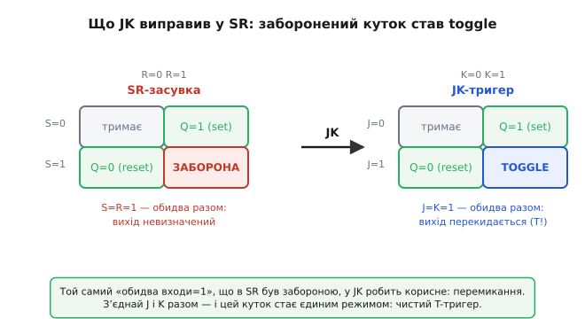
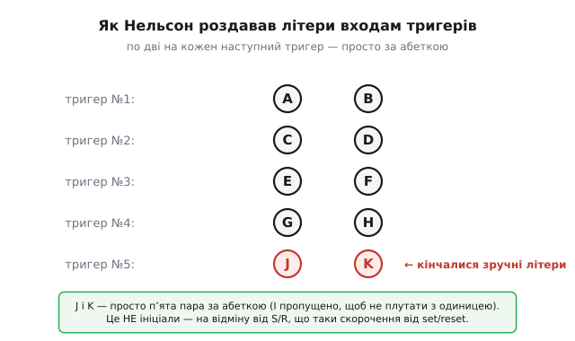

# 📜 Звідки в JK-тригері букви J і K

Спитай будь-кого, хто вчив цифрову схемотехніку, що означають літери в назвах тригерів, — і половину відповідей він видасть упевнено. **D** — від *data*, «дані». **T** — від *toggle*, «перемикати». **SR** — від *set/reset*, «встановити/скинути». Логічно, послідовно, легко запам'ятати. А тоді доходить черга до **JK** — і впевненість зникає. J — це… що? K — від чого?

Найпопулярніша відповідь звучить так гарно, що її переказують у підручниках, на форумах і у відео: мовляв, JK-тригер названо на честь **Джека Кілбі** (Jack Kilby) — того самого інженера, який винайшов інтегральну мікросхему. J.K. — його ініціали. Красива легенда: батько мікрочипа лишив підпис у назві одного з найважливіших цифрових вузлів. Одна біда — це неправда. І розібратися, чому неправда й що там насправді, — куди цікавіше за саму легенду, бо за буквами J і K ховається дрібна, майже комічна інженерна причина: людині просто **закінчилися зручні літери абетки**.

Ця вставка — про те, як народилася назва. Сам JK-тригер тут згадується лише настільки, наскільки треба, щоб зрозуміти історію; його поведінка й те, як із нього виходить T-тригер при J=K=1, докладно розібрані в темі-власниці — а нас цікавить питання «чому саме ці дві букви».

## Спершу — що взагалі за звір цей JK

Щоб історія літер мала сенс, треба на хвилину згадати, **навіщо** знадобився ще один тригер, коли вже був простий SR.

[SR-засувка](topic:electronics/sr-latch) — найдавніша й найпростіша комірка пам'яті: два входи, **S** (set, встановити вихід у 1) і **R** (reset, скинути в 0). Подав імпульс на S — вихід став і лишається 1; подав на R — став і лишається 0. Пам'ять на два стани, все чудово. Крім одного кутка: а що, коли подати **одиницю на S і на R одночасно**? Схема каже виходу «стань 1» і «стань 0» тим самим махом. Це суперечлива команда, і залізо на неї реагує погано — вихід стає невизначеним, а коли обидва сигнали знімають одночасно, засувка може «впасти» в будь-який зі станів непередбачувано. Цей куток так і звуть **забороненим станом**: у справжніх схемах у нього намагаються ніколи не заходити.

> 🔧 **Навіщо це.** Заборонений стан — не абстрактна причепа. У реальній логіці, де десятки засувок керуються спільними сигналами, рано чи пізно комбінація S=R=1 виникне випадково — через збіг фронтів, гонки сигналів, перешкоду. І тоді схема застрягне в невизначеності. Саме тому інженерам 1950-х дуже хотілося тригер **без** такого кутка — щоб будь-яка комбінація входів давала осмислений результат.

JK-тригер і є ця полагоджена версія. Він має два входи — назвемо їх поки просто **J** і **K** — які поводяться майже як S і R: J встановлює, K скидає. Але той самий небезпечний куток, де **обидва входи = 1**, тут не заборонено, а **навпаки — навантажено найкориснішою дією**: тригер **перекидає** вихід у протилежний бік. Було 0 — стало 1; було 1 — стало 0. Замість «невизначено» — чіткий, передбачуваний **toggle**.


*Ліворуч — SR-засувка: три осмислені клітинки (тримати, встановити, скинути) й один **заборонений** куток, де S=R=1. Праворуч — JK-тригер: ті самі три клітинки, але четвертий куток J=K=1 замість заборони робить **toggle** — перекидає вихід. Саме цей полагоджений куток і робить JK універсальним: з нього, з'єднавши J і K разом, дістають чистий T-тригер.*

Ось звідки прямий місток до T-тригера: якщо взяти JK і **з'єднати входи J і K в один провід**, подавши на них спільний сигнал T, то єдиний доступний «обидва разом»-режим (при T=1) — це якраз toggle. JK перетворюється на T. Тому в багатьох підручниках T-тригер уводять саме як «JK із замкненими входами».

Тепер, коли ясно, що J і K — це просто імена двох входів (функціональні близнюки S і R), лишається головне питання цієї історії: **чому їх назвали саме J і K, а не, скажімо, P і Q чи X і Y?**

## Легенда про Джека Кілбі — і чому вона не тримається

Спокуса пов'язати JK з Джеком Кілбі величезна, і зрозуміло чому. Кілбі — постать легендарна: влітку 1958 року, щойно найнятий у **Texas Instruments** і ще не маючи права на відпустку, він за кілька тижнів самотою в порожній лабораторії зібрав перший у світі працездатний зразок **інтегральної мікросхеми** — усі компоненти в одному шматочку напівпровідника. 12 вересня 1958-го він показав керівництву осцилограф, під'єднаний до крихітної германієвої пластинки, клацнув вимикачем — і на екрані побігла синусоїда. За цей винахід Кілбі 2000 року отримав Нобелівську премію з фізики. Ім'я, гідне того, щоб бути в назві.

От тільки простежмо **дати**, і легенда розсипається за секунди.

```
1953  — у патентній заявці вже вжито назви «j-input» і «k-input»
1958  — Кілбі щойно прийшов у TI й будує перший чип
```

Букви J і K з'явилися в документі **1953 року** — за **п'ять років** до того, як Кілбі зробив бодай щось помітне в електроніці. У 1953-му він ще навіть не працював у Texas Instruments (прийшов туди 1958-го). Назва входів існувала раніше, ніж Кілбі вийшов на сцену. Причина й наслідок міняються місцями: щоб JK назвали на честь Кілбі, Кілбі мав би прославитися **до** 1953 року — а він прославився після 1958-го. Хронологія просто не сходиться.

Є й друга нестиковка, географічна. Назву JK ввели не в Texas Instruments, а в зовсім іншій компанії — **Hughes Aircraft** у Каліфорнії. Кілбі там ніколи не працював. Дві різні фірми, різні люди, різні роки. Спільного — рівно нічого, окрім того, що ініціали «Jack Kilby» випадково збіглися з двома буквами.

> 🔧 **Навіщо це.** Ця легенда — навчальний приклад того, як народжуються псевдоісторичні «факти». Хтось колись помітив збіг «J.K. = Jack Kilby», це звучало правдоподібно й гарно, і далі воно поповзло від переказу до переказу. А коли новачок гуглить «що означає JK у JK-тригері», перше, що видає пошук, — Джек Кілбі: відома людина, відповідні ініціали, готова відповідь. Правдива ж причина ніде на поверхні не лежить, тож міф самопідтримується. Урок простий: **перевіряй дати**. Гарна історія, у якій наслідок передує причині, — майже завжди міф.

Іноді трапляється й друга версія легенди — що J і K це ініціали такого собі **Джона Кардаша** (John Kardash), який нібито в 1950-х підписував цими буквами відповідні виводи на своїх кресленнях. Ця версія теж не тримається, і показово, **чому**: у власному патенті Кардаша від 1965 року вузол згадано як **уже усталений** — «один із типів бістабільних схем, що часто використовується, відомий як „J-K flip-flop“». Тобто сам Кардаш пише про JK-тригер як про **готову, чужу, загальновідому** назву, а не як про власний винахід чи власний підпис. Якби букви були його ініціалами, він навряд чи описував би їх як стороннє загальне поняття.

Отже, обидві «іменні» версії відпадають. Хто ж тоді?

## Елдред Нельсон і драбина літер

Справжній автор назви — інженер **Елдред Нельсон** (Eldred C. Nelson), який на початку 1950-х працював у Hughes Aircraft над швидкодійними цифровими системами. Саме він у **патентній заявці, поданій 8 вересня 1953 року** (патент США № 2 850 566 «High-speed printing system», виданий аж 2 вересня 1958-го, права — Hughes Aircraft), уперше письмово вжив позначення **j-input** і **k-input** для входів тригера. У тексті патенту прямо сказано:

> «Кожен тригер, або бістабільний мультивібратор, має два вхідні термінали, надалі названі **j-входом** і **k-входом** відповідно, та два вихідні термінали для комплементарних двозначних сигналів, надалі названих **Q** і **Q̄** відповідно.»

Це, до речі, той самий документ, звідки в цифрову техніку прийшло й позначення виходів **Q** та **Q̄** — так що Нельсон лишив у нашій нотації навіть більший слід, ніж самі букви JK.

Але **чому** саме j і k? Тут починається найкумедніша частина, і знаємо ми її завдяки щасливому випадку — листу, який один інженер написав до фахового журналу через п'ятнадцять років по тому.

## Лист до EDN, що зберіг правду

1968 року в американському електронному журналі **EDN** зайшла суперечка про походження назви — така сама, яка й досі не вщухає в інтернеті. І тоді до редакції написав інженер **П. Л. Ліндлі** (P. L. Lindley), який на той час працював у Лабораторії реактивного руху (JPL). Лист датовано **13 червня 1968 року**, надруковано в серпневому випуску. Ліндлі мав право говорити з перших вуст: у 1950-х він сам працював у Hughes Aircraft **під керівництвом Елдреда Нельсона** й почув історію букв безпосередньо від нього.

А історія така. Проєктуючи велику логічну систему, Нельсон роздавав входам тригерів імена **по порядку абетки, парами** — по дві букви на кожен наступний тригер:


*Система Нельсона: входам кожного наступного тригера він давав чергову пару літер за абеткою. П'ятому тригерові дісталася пара **J, K** — просто тому, що абетка йшла своєю чергою, а зручні букви добігали кінця. Жодних ініціалів: на відміну від S/R (справжнього скорочення від set/reset), J і K нічого не позначають — це порядкові мітки.*

```
тригер №1:  A , B
тригер №2:  C , D
тригер №3:  E , F
тригер №4:  G , H
тригер №5:  J , K   ← сюди дійшла черга
```

І коли черга дійшла до чергової пари, Нельсон, за словами Ліндлі, зрозумів, що при розмірах його системи літер **скоро забракне**, — тож зупинився на J і K як на «приємних, безневинних буквах» (*nice, innocuous letters*), які нічого зайвого не означають і ні з чим не плутаються. Ото й уся розгадка. Ніякого Кілбі, ніякого Кардаша, ніякого прихованого сенсу — просто **п'ята пара** в абетковому лічбі входів.

Уважний читач помітить дрібницю: чому після H одразу **J**, а не **I**? Тут теж є практична логіка, типова для інженерів. Букву **I** здавна уникають у позначеннях, бо вона надто схожа на цифру **1** (одиницю) та на малу **l** — на кресленні чи в машинописі їх легко сплутати. Тож абетковий ряд «перестрибує» через I: …G, H, **J**, K. Дрібниця — але саме через неї п'ятій парі дісталося J, а не I; якби не ця обережність, ми б, можливо, вивчали «IK-тригер».

## Чому S/R — це скорочення, а J/K — ні

Тут криється тонкість, через яку легенда взагалі стала можливою. Ми **звикли**, що літери в назвах тригерів — це скорочення: D від data, T від toggle, S/R від set/reset. І цілком природно **за інерцією** очікуємо, що J і K теж мусять від чогось походити. Мозок сам добудовує: «якщо це букви, то це чиїсь ініціали». А насправді тут дві **різні природи** позначень, і плутати їх не можна.

**S і R — семантичні**: вони обрані **тому, що означають дію**. S нагадує про *set*, R про *reset*; забудеш поведінку входу — сама буква підкаже. Це мнемоніка, вбудована в назву.

**J і K — порядкові**: вони обрані **саме тому, що нічого не означають**. Нельсону були потрібні дві нейтральні мітки для входів, без жодного натяку на функцію, — і абетковий лічильник видав чергову пару. Це не мнемоніка, а просто **номер у списку**, записаний буквами замість цифр.

Різниця тонка, але вона все пояснює. Легенда про Кілбі спокушає саме тому, що ми підсвідомо тягнемо J і K у семантичний табір, де живуть S/R і D, — а вони насправді з іншого табору, де ім'я є чистою етикеткою. Зрозумівши цю різницю, більше ніколи не сплутаєш і не купишся на «ініціали».

## Що з цієї історії лишається

Розкладімо по поличках, з якою певністю ми це знаємо — бо історія техніки повна гарних вигадок, і чесно розрізняти доведене від переказаного важливо.

**Усталений факт (документ + свідок).** Букви j-input і k-input запровадив Елдред Нельсон у Hughes Aircraft; вони чорним по білому стоять у його патенті США № 2 850 566, поданому 8 вересня 1953 року. Тут сумніву нема — це первинне джерело, самий патент.

**Усталено за вторинним свідченням.** Мотив вибору — «дійшла черга до п'ятої пари, а зручні літери кінчалися» — відомий зі свідчення П. Л. Ліндлі, який чув це від самого Нельсона й переказав у листі до EDN 1968 року. Це не первинний документ (сам Нельсон причину в патенті не пояснював), а надійний переказ від безпосереднього колеги; історики техніки приймають його як усталену версію.

**Поширений міф.** Що JK — це ініціали Джека Кілбі. Спростовується хронологією (букви — 1953, слава Кілбі — після 1958) і географією (Hughes Aircraft, а не Texas Instruments). Гарна історія, але неправда.

**Другорядний міф.** Що J і K — ініціали Джона Кардаша. Спростовується його ж патентом 1965 року, де JK-тригер згадано як **уже усталену чужу** назву.

Мораль виходить майже несподівана. Ми звикли, що за технічними позначеннями стоїть глибокий сенс, — і будуємо навколо них легенди про великих людей. А іноді за буквою ховається просто **інженер із довгим списком входів, якому забракло зручних літер абетки**. J і K — не пам'ятник генієві, а слід звичайнісінької робочої буденності 1953 року. І в цьому, як на мене, історія навіть чесніша й людяніша за красиву легенду.

---

**Коротко.** Літери **J** і **K** у назві JK-тригера — **не ініціали** (ні Джека Кілбі, ні Джона Кардаша: перше спростовує хронологія — букви з'явилися 1953-го, за п'ять років до слави Кілбі, ще й в іншій фірмі; друге — патент Кардаша 1965 р., де назву згадано як уже усталену). Насправді їх запровадив інженер **Елдред Нельсон** у Hughes Aircraft, вживши «j-input»/«k-input» у патенті США № 2 850 566 (заявка 8.09.1953). За свідченням колеги П. Л. Ліндлі (лист до EDN, 1968), Нельсон роздавав входам тригерів літери **парами за абеткою** (A·B, C·D, E·F, G·H, **J·K**; I пропущено через схожість на 1), і J·K — просто **п'ята пара**, обрана як «приємні безневинні букви», бо зручні літери добігали кінця. На відміну від S/R (скорочення set/reset), J і K нічого не позначають — це порядкові мітки. Той самий куток «обидва входи = 1», що в SR був **забороненим**, у JK робить **toggle**, і саме тому, з'єднавши J та K, з JK дістають чистий T-тригер.
