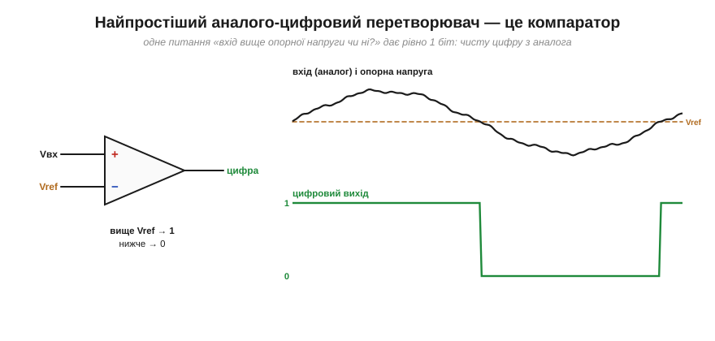
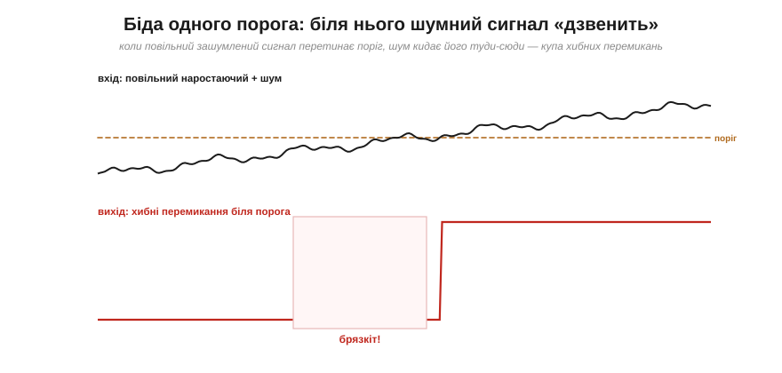
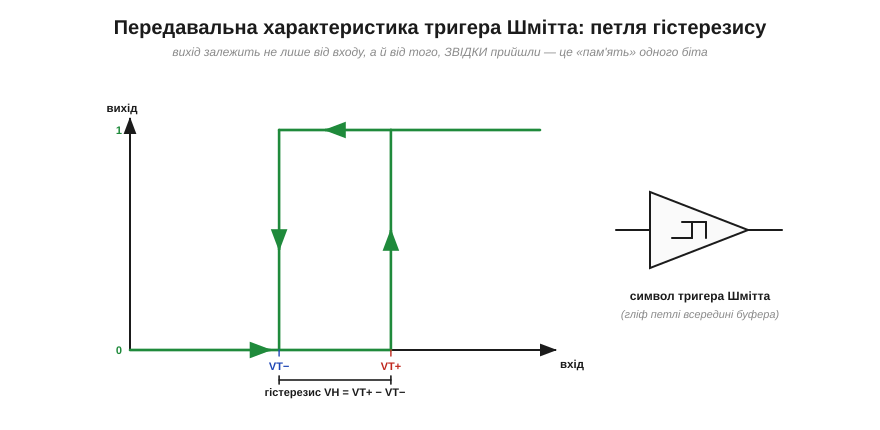
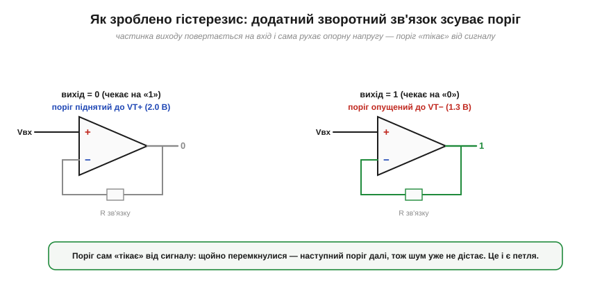
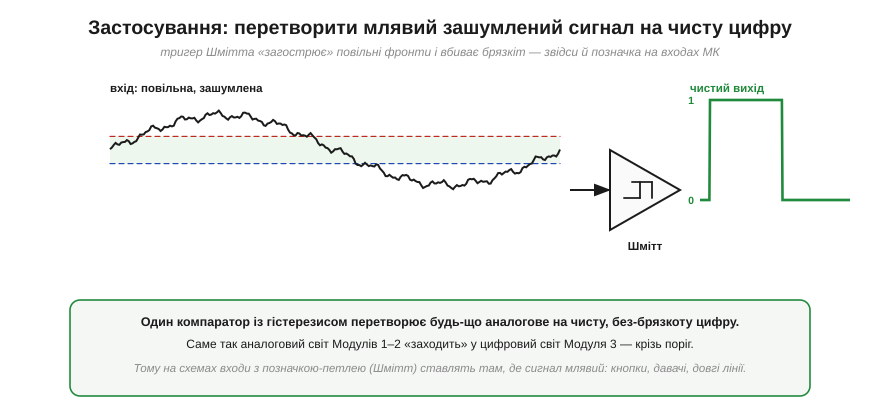

# Перетворення аналог→цифра на порозі (компаратор/Шмітт)

<preknowlist>
- [Логічні рівні як діапазони](book:electronics/logic-levels-as-ranges) — «0» і «1» цифрової логіки це діапазони напруг із «забороненою зоною» між ними.
- [Компаратор](book:electronics/comparator) — вузол, що порівнює сигнал з опорною напругою й дає на виході «високо» чи «низько».
- [Запас завадостійкості](book:electronics/noise-margin) — навіщо між рішенням і сигналом лишають зазор проти шуму.
- [Фронт і час наростання](book:electronics/edges-rise-time) — чому повільний фронт довго «висить» у забороненій зоні між рівнями.
</preknowlist>

Цифрова логіка працює з чистими «0» і «1», ніби вони беруться нізвідки. Та світ — аналоговий: давачі, кнопки, антени дають **плавну** напругу. Десь має бути **межа**, на якій аналог стає цифрою. Ця межа — **поріг**, а пристрій, що на ній стоїть, — це [компаратор](book:electronics/comparator), а в кращому варіанті — [тригер Шмітта](book:electronics/schmitt-trigger). Саме тут, крізь поріг, усе, що зібрано в аналозі, **заходить** у цифровий світ. І, як з'ясується наприкінці, той самий механізм відкриває двері до пам'яті.

### Найпростіший аналого-цифровий перетворювач — це одне рішення

Коли кажуть «оцифрувати сигнал», зазвичай уявляють складний [АЦП](book:electronics/adc), що видає багатобітне число. Та найпростіший перетворювач аналога в цифру дає лише **один біт** — і це просто відповідь на запитання «**сигнал вище опорної напруги чи ні?**». А пристрій, що ставить це запитання, — звичайний [компаратор](book:electronics/comparator): два входи, і вихід стрибає у «високо» чи «низько» залежно від того, котрий вхід більший.


*Подаємо аналоговий сигнал на один вхід компаратора, опорну напругу Vref — на інший. Вихід стає «1» щоразу, коли сигнал піднімається вище Vref, і «0», коли опускається нижче. Це і є народження цифри: безмежна аналогова шкала стиснулася до одного біта — «вище / нижче». Вхід кожного логічного елемента **поводиться** як такий пороговий вирішувач: його вхідний каскад (КМОН-пара) перемикається біля свого порога — не окремий компаратор, але результат той самий: напруга на лінії стає чітким 0 чи 1.*

Ось чому про цифровий приймач кажуть, що він питає лише «[вище порога чи ні](book:electronics/logic-levels-as-ranges)» — бо вхід **поводиться як пороговий вирішувач**: його вхідний каскад (КМОН-інвертор-буфер) перемикається біля свого порога. У звичайній КМОН-логіці це не окремий компаратор, а сама вхідна пара транзисторів зі своїм порогом — але поводиться вона так само: рішення «вище/нижче порога». А там, де треба завадостійкий поріг із гістерезисом, на вхід ставлять справжній [тригер Шмітта](book:electronics/schmitt-trigger).

### Біда одного порога: брязкіт

Та з одним порогом є халепа — її витоки в [забороненій зоні](book:electronics/logic-levels-as-ranges) між рівнями та в [млявому фронті](book:electronics/edges-rise-time). Якщо сигнал повільний і **зашумлений**, то поблизу порога шум кидає його то трохи вище, то трохи нижче межі — і компаратор слухняно перемикається **багато разів** замість одного. Замість чистого переходу 0→1 на виході виникає **брязкіт** (*chatter*) — пачка хибних імпульсів.


*Повільний сигнал перетинає єдиний поріг — і саме в цю мить шум багато разів перекидає його через межу. Вихід вибухає чергою хибних перемикань (підсвічена зона «брязкоту»). Для логіки далі це катастрофа: один натиск кнопки обернеться на десяток, один перехід давача — на серію фантомних подій.*

Корінь біди той самий, що й усього розділу: біля єдиної межі **немає запасу**. Сигнал увесь час «впритул» до рішення, тож найменший шум змінює відповідь. Потрібен той самий механізм, що рятував нас від шуму всюди, — **запас**, тільки тепер вбудований у саме рішення.

### Ліки — гістерезис: два пороги замість одного

Розв'язок винайдено давно й він елегантний: замість одного порога зробити **два**. Вихід перемикається в «1» лише коли сигнал піднявся вище **верхнього** порога VT+, а назад у «0» — лише коли опустився нижче **нижнього** порога VT−. Між ними вихід **тримає** свій останній стан, незворушно ігноруючи шум. Цей розрив між порогами зветься **гістерезис** (*hysteresis*), а компаратор із ним — [тригер Шмітта](book:electronics/schmitt-trigger) (*Schmitt trigger*).


*Той самий зашумлений сигнал — але тепер пороги два, а між ними «мертва смуга» (зелена). Вихід стає «1», лише коли сигнал упевнено пробив VT+, і лишається «1», доки той не впаде аж нижче VT−. Шум, що гойдається в межах смуги, **не дістає** до протилежного порога — тож жодного хибного перемикання: один сигнал, одне чисте перемикання.*

Ідея проста до геніальності: **щойно ми ухвалили рішення, ми робимо протилежне рішення «дорожчим»**. Перемкнулися в «1»? Тепер, щоб повернутися в «0», сигнал має впасти не просто нижче колишнього порога, а суттєво нижче — аж за VT−. Доки шум менший за ширину смуги, він безсилий. Це той самий [запас завадостійкості](book:electronics/noise-margin), але вбудований прямо в акт перетворення.

### Передавальна характеристика: петля з пам'яттю

Найкрасивіше видно суть гістерезису на **передавальній характеристиці** — графіку «вихід від входу».


*Вихід залежить не лише від того, який вхід **зараз**, а й від того, **звідки** ми прийшли. Піднімаючи вхід від нуля, вихід тримає «0» аж до VT+, тоді стрибає в «1». Опускаючи назад, вихід тримає «1» аж до VT−, тоді падає в «0». Виходить **петля**: на тому самому вході (всередині смуги) вихід може бути і 0, і 1 — залежно від історії. Праворуч — умовний символ тригера Шмітта: гліф цієї петлі всередині буфера.*

А тепер зверніть увагу на щось глибоке. Усередині смуги один і той самий вхід дає **два можливі** виходи — і який саме, вирішує **минуле**. Це означає, що тригер Шмітта **пам'ятає** свій стан: він зберігає один біт інформації. Думка тут засаднича: схема, що «пам'ятає» завдяки тому, що її вихід впливає сам на себе, — це вже не просто перетворювач. Це зародок **пам'яті**; із тієї самої ідеї зворотного зв'язку виростають [засувки й тригери](book:electronics/sr-latch), з яких збудовано всю цифрову пам'ять.

**Приклад (гістерезис проти шуму).** Сигнал давача має розмах шуму близько 0.6 В (від піка до піка). Які пороги вибрати, щоб не було хибних перемикань?

```
треба:  смуга VH  >  розмах шуму  ≈ 0.6 В
вибір:  VT+ = 2.0 В,  VT− = 1.2 В
VH = VT+ − VT− = 0.8 В  >  0.6 В   →  шум смугу не «перестрибне»
```

Смуга 0.8 В ширша за 0.6 В шуму, тож, перемкнувшись на одному порозі, сигнал зі своїм шумом просто не дістане до іншого — брязкоту не буде. Що брудніший сигнал, то ширший гістерезис потрібен (платою є те, що поріг перемикання стає менш точним — знову компроміс).

### Як зроблено: додатний зворотний зв'язок

Звідки беруться «два пороги»? З **додатного зворотного зв'язку** (*positive feedback*) — того самого механізму, що творить [тригер Шмітта](book:electronics/schmitt-trigger). Частинку вихідного сигналу повертають назад на вхід компаратора так, щоб вона **зсувала опорну напругу** в бік, що зміцнює поточний стан.


*Поки вихід «0», зворотний зв'язок тримає поріг **піднятим** до VT+ — щоб перемкнутися в «1», сигнал має постаратися. Щойно вихід став «1», зв'язок **опускає** поріг до VT− — тепер уже важко повернутися в «0». Поріг наче «тікає» від сигналу в бік щойно ухваленого рішення. Ось чому пороги два: їх по черзі рухає сам вихід.*

Це пряма протилежність [від'ємному зворотному зв'язку](book:electronics/negative-feedback), що робить підсилювач сумирним і точним. Тут зв'язок **додатний** — він не заспокоює, а навпаки, «підштовхує» рішення до краю, роблячи перемикання різким і незворотним (доки сигнал не дійде до протилежного порога). Та сама додатна петля, що в підсилювачі була б катастрофою (самозбудження), тут — корисний інструмент, що дарує і чистий фронт, і пам'ять.

### Навіщо: загострити млявий сигнал

Зберімо все докупи — навіщо тригер Шмітта потрібен на практиці. Він робить дві речі, яких компаратор з одним порогом не вміє: **вбиває брязкіт** і **загострює млявий фронт**. У цьому й проблема [повільного фронту](book:electronics/edges-rise-time): він довго стирчить у забороненій зоні. Подайте його на тригер Шмітта — і на виході отримаєте **різкий, чистий** перехід, хоч вхід повз як завгодно повільно.


*Зліва — повільна, зашумлена синусоїда (типовий «брудний» сигнал реального світу). Праворуч — після тригера Шмітта — бездоганний меандр без жодного брязкоту. Один компаратор із гістерезисом «загострює» будь-що аналогове до чистої цифри. Саме тому на схемах входи з позначкою-петлею (Шмітт) ставлять там, де сигнал млявий чи брудний: кнопки, давачі, довгі лінії, генератори.*

> 🔧 **Навіщо це.** Це поняття ви зустрічатимете постійно — і в залізі, і в даташитах. Багато цифрових входів (логічні буфери, чимало входів мікроконтролерів) мають **гістерезис — «Schmitt-trigger inputs»**: виробник навмисно вбудував два пороги, щоб пін надійно читав навіть млявий чи зашумлений сигнал. А коли такий вхід треба мати окремою деталлю, найдешевше рішення — готова мікросхема [74HC14: шість інверторів Шмітта в одному корпусі](book:electronics/threshold-schmitt/api-74hc14.md), яку ставлять на плату, щоб вичистити сигнал без жодного рядка коду. Чи має гістерезис **конкретний** пін **конкретного** чипа — звіряйте за його даташитом (для ESP32, наприклад, у DC-характеристиках задано пороги VIH ≈ 0.75·VDD і VIL ≈ 0.25·VDD). У боротьбі з [брязкотом механічної кнопки](book:electronics/contact-debounce) тригер Шмітта — одне з апаратних рішень. Генератор тактового сигналу, давач із плавним виходом — знову він; причому той самий інвертор Шмітта з одним резистором і конденсатором **сам стає** [генератором прямокутних імпульсів](book:electronics/threshold-schmitt/proj-74hc14-oscillator.md) — без кварцу й мікроконтролера. Правило просте: **сигнал млявий або брудний — постав поріг із гістерезисом**, і цифра далі буде чистою.
