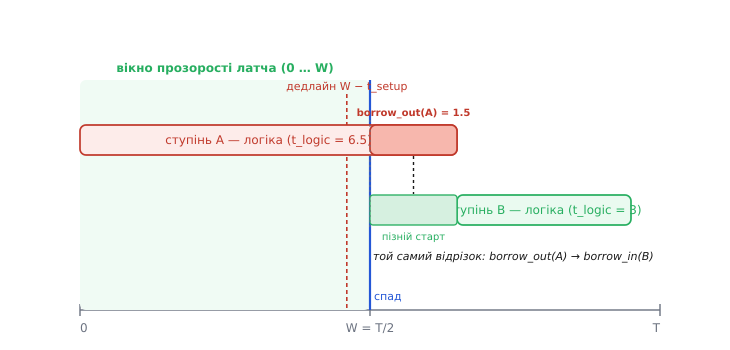

# 🧮 Бюджет позики часу: звідки береться стеля T/2

Позичання часу легко відчути на пальцях: прозорий латч ловить дані не в мить, а протягом вікна, тож повільний ступінь дораховує «внапозичку» в час сусіда. Але «трохи», «десь до спаду», «приблизно пів такту» — це ще не інженерія. Реальний аналізатор таймінгу мусить сказати **точне число**: скільки саме наносекунд ця конкретна межа віддала попередникові, скільки в неї лишилося, і чи не зламається від цього наступний ступінь. Усе це виводиться з **однієї нерівності** — умови, що дані встигли зайти в латч, поки він ще прозорий. Розкрутімо її від самого початку й подивімося, як із неї сам собою випадає і стеля T/2, і правило «що позичив один — відняв у наступного», і нижня межа, яку ставлять hold-час та проміжок неперекриття.

## Що взагалі означає «встигнути» на прозорому латчі

Спершу домовимося про величини й точку відліку. Візьмемо один такт із періодом **T** і будемо міряти час від його початку — фронту, що відчиняє латч на межі ступеня. Латч прозорий, доки такт високий; у симетричній двофазній схемі це триває рівно **пів періоду**, від 0 до T/2. У момент T/2 такт спадає, латч зачиняється й **замикає** те значення, що стоїть на вході, — це і є захоплення.

Введемо позначення (усі — у наносекундах, усі невід'ємні):

```
T          — період такту
W = T/2    — тривалість прозорості латча (ширина вікна, «pulse width»)
t_cq       — затримка латча «вхід→вихід», коли він прозорий (clock-to-Q)
t_logic    — затримка комбінаційної логіки ступеня (найдовший шлях)
t_setup    — за скільки до спаду дані мусять устоятися, щоб латч їх певно замкнув
t_arrive   — момент, коли дані реально доходять до входу цього латча
```

Тепер найголовніше — **умова коректного захоплення**. Латч замкне правильне значення тоді й лише тоді, коли дані прийшли на його вхід і **встоялися** не пізніше, ніж за t_setup до спаду. Спад стається в момент W. Отже:

```
t_arrive ≤ W − t_setup
```

Ось і вся першооснова. Права частина — це **найпізніша мить**, коли ще можна встигнути; назвімо її **дедлайном захоплення** цього латча. Прозорий латч зсунув дедлайн зі жорсткого «фронт» (мить 0) аж на «майже кінець вікна» (мить W − t_setup). Уся арифметика позики — це просто розкриття лівої частини: із чого складається t_arrive і як у ньому з'являється доданок, що прийшов від сусіда.

> 🔧 **Навіщо це.** Ця нерівність — не абстракція: рівно її обраховує статичний аналізатор таймінгу (STA) для кожної пари латчів у латч-конвеєрі. Якщо права мінус ліва частина додатна — є **запас** (slack), схема триматиметься. Якщо від'ємна — межа «перепозичила», і треба або сповільнити такт, або скоротити логіку. Тому вміти розписати t_arrive руками означає вміти читати звіт таймінгу свого чипа.

## Звідки в t_arrive береться позика

Розгляньмо два сусідні ступені підряд: латч-межа L₁ → логіка A → латч-межа L₂ → логіка B → латч-межа L₃. Простежмо, коли дані доходять до **L₂** — це визначить, скільки часу дістанеться ступеню B.

Якби L₁ замкнувся точно на своєму дедлайні (сам ступінь A відпрацював упритул), дані вийшли б із L₁ на його спаді. Але L₁, як прозорий латч, теж міг **пропустити** запізнілі дані наскрізь: коли значення на вході A з'явилося пізно, воно протекло крізь відчинений L₁ далі. Скільки саме часу A «залазить» за свій номінальний дедлайн у бік L₂ — це і є **позика на вході** ступеня, borrow_in. Тоді дані доходять до L₂ так:

```
t_arrive(L₂) = borrow_in(A) + t_cq + t_logic(A)
```

де borrow_in(A) — скільки ступінь A забрав із вікна попередньої межі (0, якщо не позичав нічого), t_cq — прохід крізь прозорий L₁, t_logic(A) — власне обчислення A. Підставимо це в умову захоплення для L₂ (дедлайн = W − t_setup) і подивімося, що вийде:

```
borrow_in(A) + t_cq + t_logic(A) ≤ W − t_setup
```

А тепер — ключовий крок. Величина, на яку **ліва частина не дотягує до дедлайну**, — це і є час, який ступінь A **не використав** і лишив у спадок наступному. Але дзеркально: наскільки A **переступив** свій власний номінал (W), настільки він **позичив** із вікна L₂ — тобто borrow_out(A). Розпишемо цей вихідний борг явно. Ступінь «на нулі боргу» замикався б у момент W. Реальний момент захоплення — t_arrive(L₂). Різниця понад W і є позика, яку A взяв **уперед**, у B:

```
borrow_out(A) = t_arrive(L₂) − W        (якщо t_arrive > W; інакше 0)
             = borrow_in(A) + t_cq + t_logic(A) − W
```

Ось звідки береться те, що в статті названо словами «що позичив один ступінь — те відняв у наступного». Момент, коли L₂ реально замкнувся (t_arrive), стає **новою точкою старту** для ступеня B. B починає рахувати не з номінальної межі W, а з t_arrive(L₂) = W + borrow_out(A). Пізніший старт з'їдає в B рівно borrow_out(A) наносекунд його власного бюджету. Позика не зникла й не народилася з повітря — вона **перетекла** через межу: borrow_out одного ступеня стає borrow_in наступного.

```
borrow_in(B) = borrow_out(A)
```

Це і є **передавання запасу** (slack passing) — воно відбувається саме собою, без жодної додаткової схеми чи підправляння такту. Ланцюжок латчів автоматично перекладає невитрачений час уперед, ступінь за ступенем, аж доки десь не впреться в дедлайн.

## Чому стеля позики — рівно пів такту

Тепер видно, звідки береться «≈ T/2», і чому це не кругле «десь половина», а точна межа. Позичити — означає відсунути момент захоплення t_arrive пізніше. Але латч зачиняється в момент W = T/2; після цього він уже нічого не пропустить, хоч скільки дані спізнюйся. Отже, найпізніший фізично можливий момент захоплення — це **сам спад**, за вирахуванням t_setup. Максимум, на який ступінь може переступити свій номінал, дорівнює всій ширині вікна мінус запас на устоювання:

```
borrow_max = W − t_setup = T/2 − t_setup
```

Ідеалізовано, коли t_setup ≈ 0, стеля — рівно **T/2**: пів такту. Ось точний зміст фрази «позичити можна лише стільки, скільки триває прозорість». Прозорість триває W = T/2, і це фізична стеля; реальна стеля трохи нижча — на бібліотечний t_setup латча, який завжди «відкушує» краєчок вікна.

> 🔧 **Навіщо це.** Саме тому в STA-звіті поряд із кожною позикою стоїть межа, і інструмент піднімає прапорець, коли borrow наближається до W − t_setup. Перевищити цю межу неможливо фізично — латч просто замкне старе значення й схема помилиться. Знаючи формулу, ти одразу бачиш: щоб дати ступеням більше простору для позики, треба або збільшити ширину вікна (не завжди можна — це змінює скважність), або взяти латчі з меншим t_setup.


*Один такт по горизонталі. Латч-межа прозора у **вікні** 0…W (W=T/2); справжній дедлайн — трохи раніше за спад, на **W − t_setup** (устоювання відкушує краєчок). Ступінь **A** (червоний) дораховує пізно й **залазить** за свій номінал W — цей виступ і є **borrow_out(A)**. Той самий відрізок стає **пізнім стартом** ступеня **B** (зелений): borrow_in(B) = borrow_out(A). Позика не додалась — вона **перетекла** через межу. Стеля виступу — вся ширина вікна за вирахуванням t_setup.*

## Ланцюжок ступенів: чому важлива лише сума

Візьмімо тепер не два, а цілу низку ступенів і складімо їхні нерівності одну за одною. Для кожної межі Lₖ:

```
borrow_in(k) + t_cq + t_logic(k) ≤ W − t_setup
borrow_out(k) = borrow_in(k) + t_cq + t_logic(k) − W
borrow_in(k+1) = borrow_out(k)
```

Підставмо друге в третє й розкрутімо рекурсію. Позика, що доходить до входу n-го ступеня, — це накопичена сума «перевитрат» усіх попередніх ступенів над їхнім номіналом W:

```
borrow_in(n) = Σ (t_cq + t_logic(k) − W)   по k = 1 … n−1
            = Σ (t_cq + t_logic(k)) − (n−1)·W
```

Прочитаймо це. Позика на вході n-го ступеня зростає рівно настільки, наскільки **сумарна** робота перших (n−1) ступенів перевищує суму їхніх номінальних вікон (n−1)·W. Якщо ступені загалом «вкладаються в середнє» — сума мала або від'ємна, позики майже нема. Якщо перші кілька ступенів систематично перевантажені — борг накопичується й тисне на дальші межі. Виходить, конвеєр поводиться так, ніби для нього важить не піковий ступінь окремо, а **сумарна затримка** ланцюжка проти сумарного бюджету — саме те, що в статті названо «нерівності усереднюються самі собою».

Але накопичена позика не може рости нескінченно: на **кожній** межі вона мусить лишатися в межах вікна, borrow_in(k) ≤ W − t_setup. Досить одній частковій сумі переступити цю стелю — і схема ламається саме на тій межі, хоч би далі ступені й були швидкі. Тому передавання запасу рятує тільки доти, доки **жодна проміжна** межа не перепозичила; це строгіша умова, ніж проста «сума ≤ бюджет по всьому ланцюжку».

## Числова прикладка: як позика перетікає

Візьмімо конкретику зі статті й доведемо її до чисел. Такт **T = 10 нс**, отже вікно прозорості **W = T/2 = 5 нс**. Щоб не топити суть у дрібницях, спершу приймемо ідеальний латч: t_cq ≈ 0 і t_setup ≈ 0 (додамо їх у другій прикладці). Два ступені:

**Умова: T = 10 нс, W = 5 нс; ступінь A має t_logic = 6.5 нс, ступінь B має t_logic = 3 нс. Чи тримається конвеєр і скільки A позичає в B?**

```
Ступінь A (borrow_in(A) = 0, ніхто йому не позичав):
  t_arrive(L₂) = 0 + 0 + 6.5        = 6.5 нс
  дедлайн L₂   = W − t_setup = 5 − 0 = 5.0 нс
  6.5 > 5.0  → сам по собі A НЕ вклався б у своє вікно

  але латч прозорий, дані течуть далі; позика вперед:
  borrow_out(A) = t_arrive − W = 6.5 − 5 = 1.5 нс
  перевірка стелі: 1.5 ≤ W − t_setup = 5  → так, у межах вікна ✓

Ступінь B (borrow_in(B) = borrow_out(A) = 1.5 нс):
  t_arrive(L₃) = borrow_in(B) + t_cq + t_logic(B)
             = 1.5 + 0 + 3     = 4.5 нс
  дедлайн L₃   = W − t_setup    = 5.0 нс
  4.5 ≤ 5.0  → вклався, ще й із запасом ✓

  залишковий slack на межі L₃: 5.0 − 4.5 = 0.5 нс
```

Розчитаймо результат. Сам ступінь A потребує 6.5 нс — на 1.5 нс більше за своє вікно (5 нс), і на **тригерній** межі це був би прямий збій: 6.5 > 5, дані не встигли до фронту. Але прозорий латч дав A позичити ці 1.5 нс наперед. Ступінь B стартував пізно (у момент 5 + 1.5 = 6.5 нс замість 5 нс), проте йому треба лише 3 нс, тож він добіг до своєї межі за 6.5 + 3 = 9.5 нс — рівно на 0.5 нс раніше за кінець такту 10 нс. Конвеєр тримається на такті 10 нс, хоча найдовший ступінь (6.5 нс) сам перевищує пів такту. Сумарно два ступені з'їли 6.5 + 3 = 9.5 нс з наявних 10 нс: позика лише **перерозподілила** час, вона не створила його.

А тепер спитаймо межу: наскільки коротким може бути такт, поки конвеєр іще живий? Обмежує його найгірша межа. Спробуймо стиснути T. Ступінь A позичає borrow_out(A) = t_logic(A) − W = 6.5 − T/2; ця позика лягає в B, і на межі L₃ маємо t_logic(A) − T/2 + t_logic(B) ≤ T/2, тобто t_logic(A) + t_logic(B) ≤ T. Звідси T ≥ 6.5 + 3 = **9.5 нс** — саме сумарна затримка двох ступенів. Але є й локальна умова на кожній межі окремо: t_logic(A) ≤ W = T/2, інакше A перепозичить одразу на L₂. Це дає T ≥ 2·6.5 = **13 нс**?! Ні — тут криється тонкість, яку варто розв'язати явно.

## Пастка: локальна межа проти сумарної

Наївне «t_logic(A) ≤ T/2» сказало б, що ступінь **взагалі не може** бути довшим за пів такту. Це неправда, і саме тут позика показує свою силу. Розділімо два різні дедлайни:

- **Дедлайн захоплення** на L₂: t_arrive(L₂) ≤ W. Він обмежує **момент, коли дані доходять до L₂**, а не саму по собі довжину логіки A. Якщо A довгий, але почав **вчасно** (borrow_in(A)=0), його t_arrive = t_logic(A), і умова t_logic(A) ≤ W справді була б жорсткою — **якби ми вимагали, щоб L₂ замкнувся на цьому такті**.

Ось де хованка. У латч-конвеєрі захоплення на L₂ **не мусить** статися в межах вікна цього ж такту, якщо межа L₂ тактується **тією самою фазою**, що й L₁: тоді позика лишається «всередині циклу», і фактичний дедлайн для пари A→B — не W, а кінець **повного** такту T (спад наступної фази, що замикає L₃). Локальне «≤ W» — це вимога лише тоді, коли L₂ **перемикає фазу** (двофазна межа master/slave): позика через протифазну межу **не передається**, бо латч уже зачинений, коли дані надходять.

Тому строге правило таке: **позика вільно тече крізь латчі однієї фази** (borrow накопичується, стеля — по всьому шляху до наступної фазової межі), але **обнуляється на межі зміни фази** (там дані мусять устигнути до W − t_setup «намертво», без переносу). У нашій двоступеневій моделі, якщо L₂ — це проміжний латч тієї ж фази, обмежує лише сума: T ≥ t_logic(A) + t_logic(B) = 9.5 нс. Якщо ж L₂ фазу міняє, то A справді замкнений на W, і тоді потрібне T ≥ 2·max(6.5, 3) = 13 нс. Різниця в цілих 3.5 нс — і вона вся у відповіді на питання «однакова фаза чи ні».

> 🔧 **Навіщо це.** Ось чому статтю не можна писати самим «≤ T/2»: стеля T/2 — це межа на **одну** прозорість, справедлива для позики через фазову межу. Усередині ланцюжка однофазних латчів позика **накопичується** й реальна межа — сумарна затримка проти повного такту. Плутанина цих двох меж — типова помилка початківця в аналізі латч-конвеєрів; інструмент їх розрізняє автоматично за тим, якою фазою тактовано кожен латч.

## Друга прикладка: реальні t_cq і t_setup, і де щезає запас

Ідеальний латч зручний для інтуїції, але в кремнії t_cq і t_setup не нульові, і вони помітно з'їдають вікно. Повторімо перший приклад із реальними числами, щоб побачити, як швидко тане стеля.

**Умова: T = 10 нс, W = 5 нс; латч має t_cq = 0.2 нс, t_setup = 0.3 нс. Ступінь A: t_logic = 6.5 нс, ступінь B: t_logic = 3 нс. Знайти позику й залишковий slack.**

```
Ефективна стеля позики на одній межі:
  borrow_max = W − t_setup = 5 − 0.3 = 4.7 нс   (не рівно T/2!)

Ступінь A (borrow_in = 0):
  t_arrive(L₂) = 0 + t_cq + t_logic(A) = 0.2 + 6.5 = 6.7 нс
  borrow_out(A) = t_arrive − W = 6.7 − 5           = 1.7 нс
  перевірка:  1.7 ≤ borrow_max 4.7                  → у межах ✓

Ступінь B (borrow_in(B) = 1.7 нс):
  t_arrive(L₃) = borrow_in + t_cq + t_logic(B)
             = 1.7 + 0.2 + 3                        = 4.9 нс
  дедлайн L₃   = W − t_setup = 5 − 0.3              = 4.7 нс
  4.9 > 4.7   → НЕ вклався! slack = 4.7 − 4.9 = −0.2 нс  ✗
```

Ось повчальний поворот. У «чистій» моделі конвеєр тримався із запасом 0.5 нс, а варто врахувати реальні t_cq і t_setq — і той самий такт 10 нс уже **не тягне**: не вистачає 0.2 нс. Винні дрібні, на перший погляд, доданки: два проходи t_cq (0.2 + 0.2 = 0.4 нс) і два укуси t_setup, що знизили стелю з 5.0 до 4.7 нс. Разом вони з'їли ті 0.5 нс запасу й ще 0.2 нс понад. Щоб урятувати схему, треба або підняти такт до T ≥ t_cq·2 + t_logic(A) + t_logic(B) + t_setup = 0.4 + 6.5 + 3 + 0.3 = **10.2 нс**, або знайти латч зі швидшим t_cq/t_setup, або трохи скоротити логіку A чи B. Мораль проста: **бібліотечні затримки латча — не похибка округлення**; у щільно спакованому конвеєрі вони вирішують, тримається такт чи ні.

## Нижня межа позики: hold-час і проміжок неперекриття

Досі ми дивилися лише на **верхню** межу — щоб дані не спізнилися. Але прозорість, що дає позичати, має й другий бік: дані можуть прийти **надто рано** й зіпсувати те, що латч ще не встиг певно замкнути. Це вже інша нерівність — на **найкоротший** (найшвидший) шлях, і саме вона ставить позиці **нижню** межу.

Hold-час (t_hold) — це скільки дані мусять **ще потриматися незмінними** після моменту захоплення, щоб латч устиг їх надійно засвоїти. Загроза така: поки латч L₂ ще прозорий (або щойно на межі зачинення), нове значення з наступного ступеня може «прострелити» крізь відчинений L₁ і **найкоротшу** логіку та досягти L₂ **раніше**, ніж старе значення встигло втриматися свій t_hold. Умова безпеки — дзеркальна до setup, тільки на **мінімальну** затримку:

```
t_cq(min) + t_logic(min) ≥ t_hold + (зсув відчинення сусіднього латча)
```

Ось де в гру входить **проміжок неперекриття** (non-overlap) між φ1 і φ2. Якби фази стикалися впритул (щойно одна впала — друга піднялась), між двома сусідніми латчами був би момент, коли **обидва** прозорі одночасно, і найшвидші дані прострелили б наскрізь два ступені за один такт — груба hold-катастрофа. Проміжок неперекриття t_nov, де обидві фази = 0, гарантує: перший латч уже **надійно зачинений**, перш ніж відчиниться другий. Це ослаблює вимогу до мінімальної логіки на величину t_nov:

```
t_cq(min) + t_logic(min) + t_nov ≥ t_hold
```

Прочитаймо зв'язок із позикою. Позика **вгору** (щоб устигнути) хоче, аби логіка була **коротшою** — тоді запізнення менші й borrow_out менший. Але hold-умова вимагає, аби найкоротший шлях був **достатньо довгим** — інакше швидкі дані прострелять. Ці дві сили тиснуть у різні боки: скорочуючи логіку заради позики й швидкості, легко впертися в hold на короткому шляху. Проміжок неперекриття — це якраз той буфер, що розводить дедлайни двох латчів у часі й дає hold-умові простір; платять за нього тим, що t_nov **вирізається** з корисного такту (ефективне вікно прозорості стає W − t_nov, а не рівно T/2).

Важливий нюанс, що часто дивує: **позика впливає лише на setup-бік**, бо вона **сповільнює** прибуття даних (робить t_arrive пізнішим), а це для setup корисно (більше часу), для hold — байдуже. Hold-перевірка бере **найшвидші** дані, а позика найшвидших не стосується — вона про запізнілі. Тому в STA borrow фігурує у формулі setup-slack і **не з'являється** у hold-slack. Нижню межу позиці ставить не сама позика, а необхідність тримати hold: якщо заради borrow ти вкоротив короткий шлях, hold може зламатися — і його рятує вже неперекриття, а не позика.

```
Підсумок двох меж на одну фазову засувку:
  setup (не спізнись):   t_arrive ≤ W − t_setup   → стеля позики W − t_setup ≈ T/2
  hold  (не прострель):  t_logic(min) + t_cq(min) + t_nov ≥ t_hold
```

## Що з цього виносити в число

Уся математика позики стоїть на одному рядку — **t_arrive ≤ W − t_setup** — і трьох висновках, що з нього випливають самі собою.

Перший: **стеля** позики на одну прозорість — це ширина вікна за вирахуванням setup, тобто **W − t_setup ≈ T/2**. Це фізична межа: латч зачиняється в момент W, і пізніше нічого не пропустить. Хочеш більше простору — або ширше вікно, або менший t_setup.

Другий: позика **перетікає, а не додається**. borrow_out одного ступеня стає borrow_in наступного (передавання запасу), і по ланцюжку однофазних латчів накопичується сумарна перевитрата Σ(t_logic − W). Реальна межа конвеєра — не піковий ступінь, а **сумарна** затримка проти повного такту, доки жодна проміжна межа не перепозичила. Але на межі **зміни фази** позика обнуляється — там дані мусять устигнути до W − t_setup без переносу.

Третій: **нижню** межу ставлять hold-час і проміжок неперекриття. Позика сама на hold не впливає (вона про запізнілих, а hold — про найшвидших), але свобода прозорого латча загострює hold на коротких шляхах, і рятує його t_nov — ціною відкушеного краєчка такту. У числах це означає: рахуючи бюджет реального конвеєра, не забувай ні t_cq, ні t_setup, ні t_nov — дрібні на вигляд, вони вирішують, тримається такт чи впаде на 0.2 нс, як у другій прикладці.
