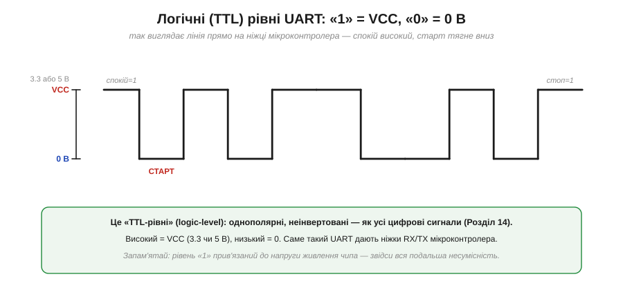
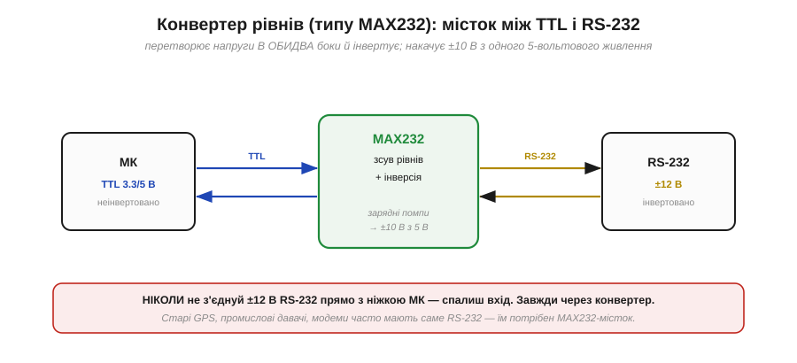
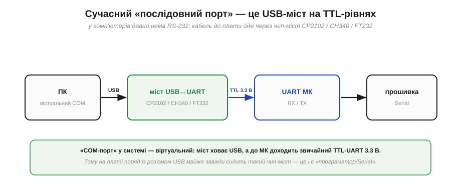
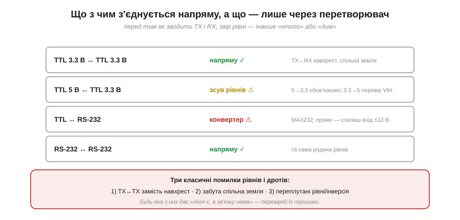

# Рівні сигналу: TTL vs RS-232

Зручно думати про «1» і «0» як про чисті логічні стани. Та по дроту біжить не логіка, а **напруга**, і тут постає питання, яке щороку коштує новачкам спалених входів: **якою саме напругою** позначають мітку й пропуск? Відповідь не одна. Та сама послідовна лінія може жити у щонайменше трьох несумісних «діалектах» рівнів — і знати їх відмінності так само важливо, як розуміти кадр. Бо кадр у двох пристроїв може збігатися ідеально, а от якщо в одного «1» — це +3.3 В, а в іншого −12 В, вони не лише не порозуміються, а ще й можуть пошкодити одне одного.

### TTL-рівні: «1» прив'язана до живлення

Найпростіший і найпоширеніший у світі мікроконтролерів діалект — **логічні**, або **TTL-рівні** (*TTL / logic-level*). Це звичайний цифровий сигнал, такий самий, як [рівні на будь-якій цифровій ніжці](book:electronics/logic-levels-as-ranges): однополярний і **неінвертований**. Мітка «1» — це напруга живлення VCC, пропуск «0» — нуль (земля).


*Рис. UART прямо на ніжці мікроконтролера: лінія у спокої тримається на VCC («1»), а старт-біт тягне її до 0 В. Високий рівень — це або 3.3 В, або 5 В залежно від живлення чипа. Саме звідси, з прив'язки «1» до напруги живлення, виростає вся подальша несумісність.*

Ключове, що варто закарбувати: у TTL рівень «1» — це **напруга живлення конкретного чипа**. А чипи живляться по-різному: класичні 5 В у старих платах і 3.3 В у більшості сучасних (зокрема ESP32). Звідси й перша пастка.

### 3.3 В проти 5 В: де ховається небезпека

Здавалося б, 3.3 і 5 В близькі — невже не з'єднати напряму? Іноді можна, іноді — ні, і плутанина тут небезпечна.


*Рис. Ліворуч: 5-вольтовий вихід у 3.3-вольтовий вхід — **перенапруга**: на ніжці з'являється 5 В, тоді як її максимум близько 3.6 В, і вхід можна пошкодити. Праворуч: 3.3-вольтовий вихід у 5-вольтовий вхід — часто **працює** (для 5 В TTL поріг VIH ≈ 2.0 В, і 3.3 В його впевнено перекриває), але для деяких 5 В CMOS-входів із порогом VIH ≈ 3.5 В цього вже **замало**.*

Розберімо обидва напрямки. **5 В → 3.3 В** небезпечний: вихід виставляє повні 5 В, а 3.3-вольтовий вхід зазвичай не терпить більше за ≈VCC + 0.3 В (тобто ≈3.6 В). Зайві вольти течуть через захисні діоди входу й помалу (а то й одразу) вбивають ніжку. Тут **обов'язковий** [зсув рівнів](book:electronics/level-shifting) — щонайпростіше резистивним дільником, краще — спеціальним буфером. **3.3 В → 5 В** м'якший: 5-вольтовий вхід найчастіше вважає 3.3 В надійною «1», бо його поріг спрацювання нижчий. Але це не гарантія — у CMOS-входу поріг може бути високим, і тоді 3.3 В не дотягнуть.

> 🔧 **Навіщо це.** Перш ніж з'єднати TX однієї плати з RX іншої, **звір напруги живлення**. Якщо одна на 5 В, а друга на 3.3 В, не кидай дроти навмання: 5→3.3 проганяй через зсув рівнів, а для 3.3→5 зазирни в даташит приймача, чи 3.3 В вистачає для його VIH. Найдорожча помилка — подати 5 В на 3.3-вольтовий вхід «бо начебто близько»: ніжка цього може не пробачити.

### RS-232: біполярно й інвертовано

А тепер — зовсім інший діалект, успадкований від старих комп'ютерних портів: **RS-232**. Це не «трохи інша напруга», а принципово інший світ, несумісний із TTL одразу за трьома ознаками.


*Рис. Угорі — звичний TTL (спокій високий, 3.3 В). Унизу — той самий байт у RS-232: логіку **інвертовано** (мітка «1» — це від'ємна напруга), сигнал **біполярний** (гойдається в обидва боки від нуля), а розмах — аж **±12 В**. Лінія у спокої тут лежить унизу, на −12 В.*

По-перше, **інверсія**: у RS-232 мітка «1» — це **від'ємна** напруга (−5…−15 В на виході драйвера, типово −12 В), а пропуск «0» — **додатна** (+5…+15 В, типово +12 В). По-друге, **біполярність**: сигнал гойдається в обидва боки від нуля, а не від 0 до VCC. По-третє, **величина**: ±12 В замість скромних 0…3.3 В. Лінія у спокої лежить на −12 В (бо спокій — це мітка «1»). Через усі три відмінності RS-232 і TTL **не можна** з'єднувати напряму: мало того що вони зрозуміють біти навпаки, так ще й ±12 В миттєво спалять 3.3-вольтову ніжку.

### Навіщо такий розмах: завадостійкість

Чому ж старий стандарт обрав такі великі й незручні напруги? Заради **завадостійкості** на довгих кабелях. Великий розмах і широка «мертва зона» між рівнями означають величезний запас: навіть якщо кабель просадить сигнал на кілька вольтів, а зверху наведеться шум, приймач усе одно впевнено відрізнить «1» від «0».


*Рис. RS-232 (ліворуч): передавач видає ±(5…15) В, а приймач уважає «1» все, що нижче −3 В, і «0» — усе, що вище +3 В. Між ними широка невизначена зона ±3 В, але до неї ще багато вольтів запасу. TTL 3.3 В (праворуч): пороги VIH ≈ 2.0 і VIL ≈ 0.8 В, тож запас — лічені сотні мілівольтів.*

**Приклад (порівняймо запас).** Прикиньмо «відстань до помилки» в обох діалектах:

```
RS-232: передавач «1» ≈ −12 В, поріг приймача −3 В
        запас ≈ |−12 − (−3)| = 9 В шуму можна стерпіти

TTL 3.3: вихід «0» ≈ 0.4 В, поріг VIL ≈ 0.8 В
        запас ≈ 0.8 − 0.4 = 0.4 В — у двадцять із гаком разів менший
```

Ось чому RS-232 десятиліттями возив дані надійними метрами кабелю, а TTL призначений для коротких доріжок на платі: його крихітний запас не переживе ні довгого дроту, ні сильної завади.

### Місток між світами: конвертер рівнів

Якщо TTL і RS-232 несумісні, а зв'язати їх треба, між ними ставлять **конвертер рівнів**. Класика жанру — мікросхема **MAX232**: вона перетворює рівні в обидва боки й заодно інвертує логіку.


*Рис. MAX232 стоїть між TTL-боком (МК, 3.3/5 В, неінвертовано) і RS-232-боком (±12 В, інвертовано) і перекладає сигнали в обидва напрямки. Найхитріше — він сам **накачує** потрібні ±10 В з єдиного 5-вольтового живлення за допомогою вбудованих зарядних помп на кількох конденсаторах.*

Найдотепніше в MAX232 — те, що для від'ємної й підвищеної напруги йому **не потрібне** окреме живлення: він робить ±10 В із звичайних 5 В за допомогою **зарядних помп** (*charge pumps*) — схем, що перекидають заряд між конденсаторами, нарощуючи напругу. Тому для роботи йому досить кількох зовнішніх конденсаторів і однієї шини 5 В.

> 🔧 **Навіщо це.** **Ніколи** не з'єднуй ±12 В RS-232 напряму з ніжкою мікроконтролера — це гарантований спалений вхід. Якщо тобі трапився пристрій із «справжнім» RS-232 (старі GPS-приймачі, промислові давачі, модеми, лабораторні прилади), став між ним і МК конвертер на кшталт MAX232. І навпаки: побачивши на платі MAX232 з гронами конденсаторів навколо, ти одразу знаєш — тут є справжній RS-232-порт, а не TTL.

### Сучасна реальність: USB-to-serial

Та де сьогодні взяти той RS-232? У сучасних комп'ютерів його давно немає — натомість усе йде через **USB**. Коли ти під'єднуєш плату кабелем до комп'ютера й відкриваєш «COM-порт», насправді працює **міст USB↔UART** — окрема мікросхема, що з одного боку розмовляє по USB, а з іншого видає звичайний TTL-UART.


*Рис. Ланцюг сучасного «послідовного порту»: ПК бачить віртуальний COM-порт, кабель несе USB, чип-міст (CP2102, CH340 чи FT232) перетворює USB на TTL-UART 3.3 В, і вже він іде на ніжки RX/TX мікроконтролера. «COM-порт» у системі — віртуальний, а до МК доходить звичайний логічний рівень.*

Саме тому на платах поряд із роз'ємом USB майже завжди сидить така мікросхема-міст — її ти й бачиш як «програматор» чи «Serial». Імена CP2102, CH340, FT232 — це різні виробники таких мостів; усі вони роблять одне: ховають USB і віддають мікроконтролеру простий TTL-UART, найчастіше на 3.3 В.

> 🔧 **Навіщо це.** Коли «Serial» працює через USB-кабель — між комп'ютером і МК стоїть чип-міст, і на боці мікроконтролера це звичайний 3.3 В TTL, а не RS-232. Тому для зв'язку двох плат між собою RS-232-конвертер зазвичай **не потрібен** — обидві говорять TTL, і їх з'єднують напряму (звіривши лише 3.3/5 В). А якщо драйвер моста (CP210x, CH340) не став сам — це найперша причина, чому «плата не з'являється як COM-порт».

### Що з чим з'єднується: матриця й типові помилки

Зведімо все в просте правило «що з чим можна напряму».


*Рис. TTL↔TTL однакової напруги — напряму (навхрест, зі спільною землею). TTL 5↔3.3 — через зсув рівнів. TTL↔RS-232 — лише через конвертер (інакше спалиш вхід). RS-232↔RS-232 — напряму. А внизу — три класичні помилки дротів і рівнів, які дають «лінія є, а зв'язку нема».*

Три найчастіші причини, чому щойно зібрана лінія мовчить, варто перевіряти **першими**: переплутані **TX↔TX** замість [з'єднання навхрест](book:communications/async-serial), забута **спільна земля** і **неузгоджені рівні** чи інверсія. Жодна з них не видна оком — лінія начебто з'єднана, — але будь-яка вбиває зв'язок.

> 🔧 **Навіщо це.** Це твій чек-лист налагодження «німої» лінії: (1) TX і RX навхрест? (2) земля спільна? (3) рівні збігаються (обидва TTL тієї самої напруги, або стоїть конвертер)? (4) [baud](book:communications/baud-rate) і [формат кадру](book:communications/uart-frame) однакові? Пройдешся цими чотирма пунктами — і впіймаєш чи не всі типові біди фізичного рівня UART.

Фізичний бік лінії на цьому вичерпано: і рівні, і їхню несумісність, і як їх мостити. Лишається питання з боку **програми**: байти прибувають у свій час, незалежно від того, чи готовий процесор їх забрати саме зараз. Що буде, якщо новий байт прийшов, а попередній ще не прочитано? Тут на сцену виходять **буфери** й [керування потоком](book:communications/flow-control).

---
