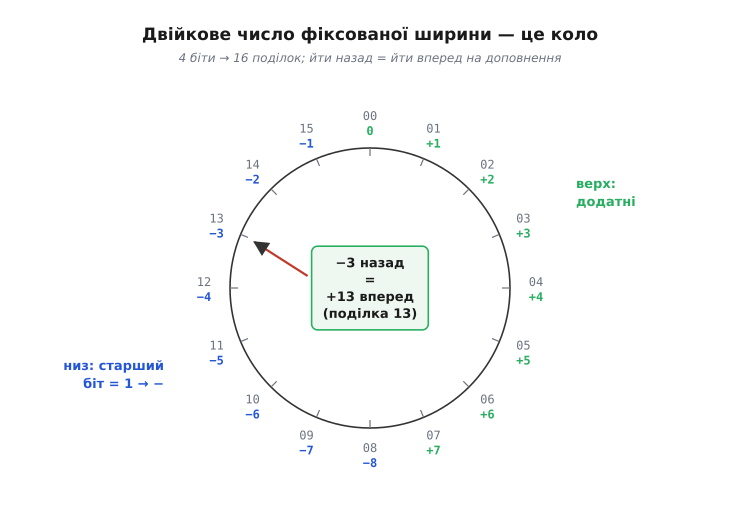
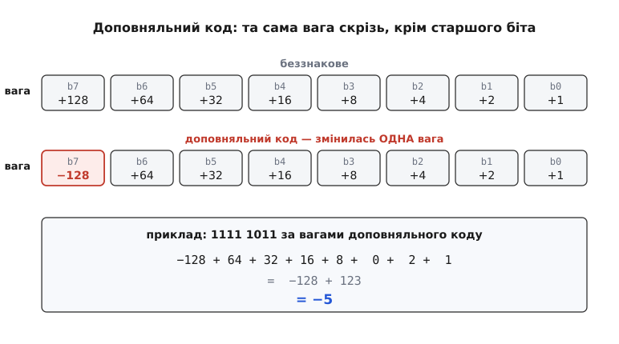

# Доповняльний код

Комп'ютер уміє тільки одне — додавати біти. Суматор складає розряди, перенос біжить угору, на виходах з'являється сума. А тепер спитаймо просту річ: як цій машині, що вміє лише **додавати нулі та одиниці**, показати число −5? Мінуса на дротах немає. Є тільки напруга «є» або «немає» — одиниця або нуль. Знак треба якось **закодувати самими бітами**, і так, щоб від цього не розсипалась арифметика.

Найпряміша ідея — виділити один біт під знак, як ми пишемо мінус перед числом. Старший біт: 0 — плюс, 1 — мінус, решта бітів — величина. Це **прямий код** (англ. *sign-magnitude*). Він читається легко, але з ним арифметика стає болем. По-перше, з'являються **два нулі**: `0000` це +0, а `1000` це −0 — одне й те саме число двома різними наборами бітів, і схема мусить це якось узгоджувати. По-друге, і це головне, — щоб додати два числа, залізо мусить **спершу глянути на знаки**, вирішити, додавати чи віднімати величини, порівняти, хто більший, і поставити правильний знак результату. Простий суматор так не вміє: йому потрібна ціла окрема машинерія розбору випадків. Знак закодували чесно, а рахувати стало важче.

Доповняльний код (англ. *two's complement*) розв'язує цю задачу протилежним ходом. Він **не** намагається зробити біти зрозумілими для людини. Він робить так, щоб той самий суматор, що додає додатні числа, **автоматично правильно рахував і з від'ємними** — без єдиного зайвого вентиля, без розбору знаків, без другого нуля. Знак стає не окремою прикрасою, а природним наслідком того, як біти обгортаються по колу. Саме тому доповняльний код — не одна з можливих схем, а **та єдина**, якою користуються всі процесори від System/360 до найновішого ARM.

### Годинник як ключ до від'ємних чисел

Щоб зрозуміти доповняльний код по-справжньому, забудьмо на хвилину про біти й подивімось на **годинник зі стрілкою**. Циферблат має 12 поділок. Стрілка на 12 (тобто на 0). Що станеться, якщо перевести її на 3 години **назад**? Вона стане на 9. А якщо перевести на 3 години **вперед від 12**, обійшовши коло аж дванадцять разів — байдуже: 12 годин уперед повертають її туди ж, звідки почала.

Ось у чому суть: **на циферблаті «−3 години» і «+9 годин» — це те саме положення стрілки**. Відняти 3 = додати 9, бо після 12 усе обгортається назад до нуля. Годинник не має від'ємних чисел взагалі, а проте чудово вміє «віднімати» — просто йдучи вперед на доповнення.

> 🔧 **Навіщо це.** Ця обгортка — не абстракція, вона фізично живе в кожному лічильнику мікроконтролера. 8-бітний таймер, дорахувавши до 255, наступним тактом стає 0, а не 256 — рівно як стрілка після 12. Тому різницю двох відліків таймера `(uint8_t)(now - start)` можна брати наївним відніманням, і воно дасть **правильний** інтервал, навіть якщо таймер устиг переповнитися між ними: обгортка сама все виправляє. Це щоденний робочий трюк, і працює він тільки завдяки тому, що двійкова арифметика — теж «годинник».

Двійкове число фіксованої ширини — це той самий годинник, лише з іншою кількістю поділок. Вісім бітів дають 2⁸ = 256 положень: від `0000 0000` до `1111 1111`, а далі — знов у нуль. Це коло з 256 поділок. І та сама магія працює: **відняти якесь число — це те саме, що додати його доповнення до 256**.

Порахуймо. Хочемо −5 у восьми бітах. За логікою годинника, −5 має бути тим самим положенням, що й «256 − 5 = 251». А 251 у двійковому — це `1111 1011`. Ось і все: **−5 кодується як 251**. Дивовижа в тому, що якщо тепер узяти будь-яке число й **додати** до нього `1111 1011` звичайним суматором, результат обгорнеться рівно так, ніби ми відняли 5:

```
   7 − 5  рахуємо як  7 + 251
       0000 0111        (7)
     + 1111 1011        (251, тобто −5)
     -----------
    1 0000 0010        → 9-й біт випадає за 8 розрядів
       0000 0010        (2) ✓
```

Дев'ятий біт «випав» за межі слова — це і є та сама «дванадцята година», після якої стрілка обгорнулась. Викидаємо його, і на восьми бітах лишається `0000 0010` = 2, тобто чесна відповідь 7 − 5. Суматор не знав і не мусив знати, що ми віднімаємо. Він тупо додав два додатні числа 7 і 251. А обгортка на 256 зробила решту.


*Двійкове число фіксованої ширини — це коло. Верхня дуга — додатні числа, нижня — від'ємні; межа проходить по старшому біту. Відняти число означає обійти коло у зворотний бік, а це те саме, що додати його доповнення й дозволити старшому переносу «випасти». Тут коло на 16 (4 біти), щоб усі поділки було видно; для 8 бітів воно просто густіше.*

### Рецепт: інвертувати всі біти й додати одиницю

Рахувати «256 мінус число» щоразу — незручно. На щастя, є механічний рецепт, який дає той самий результат **без жодного віднімання**: щоб отримати від'ємне число, **інвертуй усі його біти й додай одиницю**.

Чому саме так — видно з простого спостереження. Візьмімо число й **інвертуємо кожен його біт** (це називають одиничним доповненням, англ. *one's complement*). Що дає інверсія? Кожен біт `1` стає `0` і навпаки. А отже, число разом зі своєю інверсією завжди дають усі одиниці:

```
   0000 0101        (5)
 + 1111 1010        (~5, усі біти інвертовані)
   -----------
   1111 1111        = 255 = 256 − 1
```

Число плюс його інверсія = 255. Тобто `~N = 255 − N`. Але нам для доповняльного коду потрібне не 255 − N, а **256 − N**. Різниця рівно в одиниці — тому й додаємо +1:

```
−N = 256 − N = (255 − N) + 1 = (~N) + 1
```

Ось звідки береться правило «інвертувати й додати одиницю». Воно не магічне — це просто спосіб порахувати 256 − N, не віднімаючи, а через інверсію, яку залізо робить одним шаром вентилів «НЕ».

**Закодуймо −5 у 8 бітах за рецептом.**

```
5    =  0000 0101
~5   =  1111 1010        (інвертували всі біти)
+1   =  1111 1011        (додали одиницю)  →  це −5, тобто 251
```

Збіглося з тим, що дав годинник: −5 = `1111 1011`. І рецепт **симетричний** — та сама дія повертає назад. Застосуймо «інвертувати й +1» до `1111 1011`:

```
1111 1011            (−5)
~   = 0000 0100
+1  = 0000 0101      = 5  ✓
```

Взяти протилежне число — це та сама операція в обидва боки. У прошивці її й пишуть буквально одним виразом. Зверни увагу: `~x + 1` — це рівно те, що робить унарний мінус `-x`, тому обидва рядки нижче дають однаковий результат:

```cpp
int8_t x = 5;
int8_t neg1 = ~x + 1;   // рецепт «інверсія + 1»
int8_t neg2 = -x;       // те саме; компілятор кладе ~x + 1
// neg1 == neg2 == -5, у бітах 1111 1011
```

### Чому це не коштує заліза

Тепер зберімо головну думку, заради якої все й затівалось. У доповняльному коді **віднімання — це додавання**, а тому окремого віднімача в процесорі немає взагалі. `A − B` машина рахує як `A + (~B) + 1`, і кожен шматок цього виразу вже є в звичайному суматорі:

- `~B` — це один шар вентилів «виключне або»: пропусти кожен біт B крізь XOR із керувальною лінією `sub`. За `sub = 0` біти проходять незмінно (додавання), за `sub = 1` — усі інвертуються, і виходить `~B`;
- `+1` — це та сама лінія `sub`, заведена у **перенос-вхід наймолодшого розряду**. За `sub = 1` вона додає бракітну одиницю.

Одна керувальна лінія перемикає суматор між додаванням і відніманням — і все. Саме через це доповняльний код виграв: він робить арифметику зі знаком **безкоштовною** для заліза. Як цей трюк «віднімання задарма» реалізовано в арифметико-логічному пристрої разом із прапорцями результату, розібрано в темі [арифметико-логічного пристрою](topic:electronics/arithmetic-logic-unit) — там та сама ідея показана на боці схеми.

> 🔧 **Навіщо це.** Через цю тотожність немає жодної окремої «команди віднімання зі знаком» на рівні заліза — і додатні, і від'ємні цілі рахує **один** набір вентилів. Для прошивки це означає, що знакова й беззнакова арифметика виконуються **однаково швидко** й тими самими інструкціями `ADD`/`SUB`; різниця тільки в тому, які **прапорці** й **умови переходу** ти потім читаєш. Розуміння цього рятує, коли доводиться рахувати такти в критичному циклі: заміна `int` на `unsigned` не пришвидшить додавання — біти рухаються ті самі.

### Старший біт має вагу — від'ємну

Є ще один спосіб дивитись на доповняльний код, часто найзручніший на практиці. У звичайному беззнаковому числі кожен біт має вагу — степінь двійки: 1, 2, 4, 8, … Наприклад, `1111 1011` беззнаково — це 128 + 64 + 32 + 16 + 8 + 2 + 1 = 251. Так от, доповняльний код відрізняється **однією-єдиною зміною**: вага **старшого** біта стає **від'ємною**.

Для восьми бітів ваги розрядів такі:

```
біт:   b7    b6   b5   b4   b3   b2   b1   b0
вага: −128  +64  +32  +16   +8   +4   +2   +1
```

Старший біт тепер важить не +128, а **−128**. Решта — як були. Перечитаймо `1111 1011` уже за цими вагами:

```
1111 1011  =  −128 + 64 + 32 + 16 + 8 + 0 + 2 + 1
           =  −128 + 123
           =  −5  ✓
```

Знову −5 — але тепер ми його **прочитали** прямо з бітів, нічого не інвертуючи. Цей погляд одразу пояснює кілька важливих речей. По-перше, чому старший біт зручно звати **знаковим**: якщо він `1`, у сумі присутній доданок −128, і перебити його рештою бітів (їх максимум +127) неможливо — число гарантовано від'ємне. Якщо старший біт `0`, доданка −128 немає, число невід'ємне. Тобто старший біт **сам** каже знак — не тому, що ми так домовились, а тому, що він єдиний важить від'ємно.


*Доповняльний код відрізняється від беззнакового рівно однією вагою: старший розряд важить −128 замість +128. Решта бітів ті самі. Тому старший біт і працює знаком: тільки він додає від'ємний внесок, який решта перебити не може.*

По-друге, звідси видно **діапазон**. Найменше число — коли ввімкнено тільки старший біт: `1000 0000` = −128. Найбільше — коли ввімкнено все, крім старшого: `0111 1111` = +127. Отже, вісім бітів у доповняльному коді кодують числа від **−128 до +127**. Загалом для *n* бітів діапазон — від −2ⁿ⁻¹ до 2ⁿ⁻¹ − 1.

### Дивна асиметрія: −128 є, а +128 немає

У цьому діапазоні захована особливість, об яку регулярно спотикаються. Від'ємних чисел на **одне більше**, ніж додатних: є −128, але немає +128; найдальше додатне — лише +127. Це не помилка й не недогляд, а прямий наслідок того, що нуль займає одну з «додатних» комбінацій.

Порахуймо комбінації. Вісім бітів дають 256 наборів. Один із них, `0000 0000`, — це нуль. Лишається 255 ненульових. Порівну на плюс і мінус їх **не поділити** — 255 непарне. Доповняльний код віддає зайву комбінацію від'ємним: 128 від'ємних (−1 … −128) і 127 додатних (+1 … +127), плюс єдиний нуль. Саме тому це **один** нуль — не два, як у прямому коді: та зайва комбінація, що в прямому коді була б «−0», тут стала повноцінним −128.

Практичний наслідок цієї асиметрії гострий: **−128 не має протилежного**. Спробуймо взяти `-(-128)` за нашим-таки рецептом «інверсія + 1»:

```
−128 =  1000 0000
~    =  0111 1111
+1   =  1000 0000      → знову −128 (!)
```

Протилежне до −128 мало б бути +128, але +128 у восьми бітах не існує — і рецепт, чесно обгорнувшись, повертає **те саме** −128. Тобто `-(-128) == -128`. Те саме буде з `INT_MIN` у будь-якій ширині.

> 🔧 **Навіщо це.** Це джерело реального, підступного бага. Функція взяття модуля `abs()` на найменшому від'ємному числі **повертає його ж, від'ємним**: `abs(INT_MIN)` дає `INT_MIN`, а не додатне число. Мовою C це навіть неозначена поведінка — стандарт визнає, що результат не вміщається. Тому надійний код, який рахує модуль чи ділить на знакових типах, окремо перевіряє межу `INT_MIN`, а не сподівається, що «модуль завжди додатний». Знаючи, звідки береться асиметрія, ти передбачаєш цей край наперед, а не ловиш його багом у полі.

### Розширення знаку: коли 8 бітів переїжджають у 16

Ще одна щоденна операція — перекласти число з вужчого типу в ширший: `int8_t` у `int16_t`, байт у слово. Для додатних усе просто: дописав зліва нулі — і готово, `0000 0101` стало `0000 0000 0000 0101`, обидва це 5. А з від'ємними наївне дописування нулів **усе ламає**. Візьмімо −5 = `1111 1011` і долиймо зліва нулі до 16 бітів: `0000 0000 1111 1011`. Прочитаймо за вагами — старший біт тепер нуль, число вийшло додатне, і дорівнює воно 251. Було −5, стало +251. Катастрофа.

Причина зрозуміла з ваги старшого біта. У 8 бітах «мінус» ніс розряд ваги −128. У 16 бітах роль знаку переходить до **нового** старшого біта (вага −32768), а старий 8-бітний знаковий розряд стає звичайним додатним розрядом ваги +128. Дописавши нулі, ми лишили число без від'ємного внеску взагалі.

Правильно — дописувати зліва **копії старшого біта**, а не нулі. Це й зветься **розширенням знаку** (англ. *sign extension*): додатне (старший біт 0) доповнюємо нулями, від'ємне (старший біт 1) — одиницями.

```
−5  у  8 бітах:  1111 1011
−5  у 16 бітах:  1111 1111 1111 1011      (доповнили ОДИНИЦЯМИ)
```

Перевірити легко тим самим рецептом: візьмімо 16-бітне `1111 1111 1111 1011` і застосуймо «інверсія + 1» — інверсія дає `0000 0000 0000 0100`, плюс одиниця = `0000 0000 0000 0101` = 5. Отже, вихідне число — це рівно −5, тільки вже в 16 бітах. Знак збережено, значення теж.

У прошивці розширення знаку робить **сам компілятор**, коли ти присвоюєш вужчий знаковий тип ширшому — але тільки якщо тип **знаковий**. Ось де ховається пастка:

```cpp
int8_t  s = -5;          // 1111 1011
int16_t a = s;           // компілятор РОЗШИРЮЄ знак → -5 ✓

uint8_t u = 0xFB;        // ті самі біти 1111 1011, але тип беззнаковий
int16_t b = u;           // доповнюється НУЛЯМИ → +251 ✗ (не те, якщо ти чекав −5)
```

Ті самі вісім бітів `1111 1011` перетворюються по-різному **залежно від типу**: знаковий розширює знак і дає −5, беззнаковий доповнює нулями й дає +251. Апаратно за це часто відповідають **дві різні команди** завантаження — «load signed byte» і «load unsigned byte»; компілятор обирає потрібну за оголошеним типом. Тому оголошення `int8_t` проти `uint8_t` — не косметика: воно вирішує, яка машинна команда виконається й яке число ти отримаєш.

### Читаємо байт зі знаком у прошивці

Зберімо все в одну робочу задачу, яку постійно вирішують на мікроконтролерах. Давач (скажімо, акселерометр чи термометр) віддає по шині один байт — **знакове** число в доповняльному коді, −128…+127. Ти прочитав його у звичайну змінну й хочеш коректне значення зі знаком. Якщо покласти байт у беззнакову змінну, від'ємні свідчення обернуться на великі додатні (той-таки −5 стане 251). Правильно — **сказати компілятору, що байт знаковий**, і дати апаратному розширенню знаку відпрацювати:

```cpp
// Регістр давача повертає знаковий байт у доповняльному коді.
// raw — те, що прийшло по шині (напр., 0xFB для −5).
int16_t read_signed(uint8_t raw) {
    return (int8_t)raw;   // трактуємо біти як знаковий байт;
                          // (int16_t) далі розширює знак сам
}
// read_signed(0xFB) → -5      (1111 1011 як знакове)
// read_signed(0x7F) → +127    (найбільше додатне)
// read_signed(0x80) → -128    (найменше від'ємне)
```

Ключ — приведення `(int8_t)`: воно каже «ці вісім бітів — знакове число», і далі вся арифметика йде правильно, бо мова й залізо однаково розуміють доповняльний код. Якби давач віддавав 12-бітне знакове число (типова роздільність АЦП), додався б один крок — **дописати знак вручну** з 12-го біта до 16-го, бо апаратне розширення працює на межах байта/слова, а не на довільному 12-му розряді. Але суть та сама: знайти, де в числі знаковий біт, і продовжити його вгору.

---

Доповняльний код — це спосіб закодувати знак самими бітами так, щоб звичайний суматор рахував із від'ємними числами **правильно й задарма**. Він виходить із того, що число фіксованої ширини поводиться як годинник: додати «256 − N» — те саме, що відняти N, бо старший перенос обгортається й випадає. Механічний рецепт узяти протилежне — **інвертувати всі біти й додати одиницю** (`−N = ~N + 1`), а на рівні заліза це один шар вентилів XOR плюс одиниця в перенос-вхід, тому [віднімання не коштує окремого віднімача](topic:electronics/arithmetic-logic-unit). Найзручніший погляд: усе як у беззнаковому числі, лише **старший біт важить −128** замість +128 — звідси і його роль знаку, і діапазон −128…+127, і асиметрія, через яку `-(-128)` дає −128, а `abs(INT_MIN)` — не додатне. Перекладаючи число у ширший тип, дописуй зліва **копії знакового біта** (розширення знаку), а не нулі, і пам'ятай, що вибір між `int8_t` і `uint8_t` вирішує, яка машинна команда й яке число тобі дістануться. Ці самі біти живлять і [прапорці результату](topic:electronics/alu-flags): один і той самий `ADD` годує світ додатних і від'ємних, а програма читає той прапорець, що відповідає її тлумаченню. Як людство дійшло до цього коду — від нецифрового доповнення в механічних лічильниках Паскаля до двійкової пропозиції фон Неймана в проєкті EDVAC — розказано в [історії доповняльного коду](topic:electronics/twos-complement-hardware/hist-complement-method.md).
