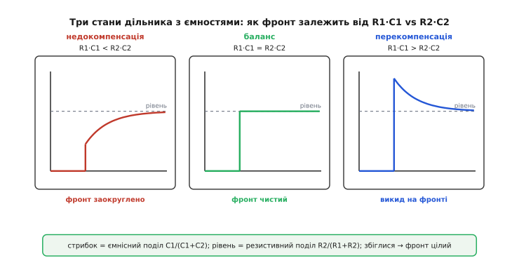

# 🧮 Математика компенсованого дільника

Простий резистивний дільник має одну незручну звичку: постійну напругу він ділить одним способом, а швидкий фронт — іншим. І поки ці два поділи різні, будь-який стрибок сигналу виходить із дільника спотвореним. Компенсований дільник — це трюк, який змушує обидва поділи збігтися. Уся його суть тримається на одному крихітному рівнянні:

```
R1 · C1 = R2 · C2
```

Ця вставка виводить це рівняння з першопричин — не «ось формула, запам'ятайте», а **чому** поділ на постійному струмі керується опорами, поділ на високій частоті керується ємностями, і за якої саме умови вони стають тотожні. А коли умова порушена — розберемо, звідки береться викид на фронті (перекомпенсація) і звідки заокруглений, завалений фронт (недокомпенсація). Той самий апарат керує тримером у щупі осцилографа ×10, тож наприкінці стане ясно, що саме крутить рука, підстроюючи щуп по каліброваному меандру.

## Два різні дільники в одному

Почнімо з того, що ми взагалі маємо. Верхнє плече — резистор R1, паралельно якому увімкнено конденсатор C1. Нижнє плече — резистор R2, паралельно якому сидить конденсатор C2. У реальному стику C2 — це не деталь, яку ми ставимо: це **паразитна ємність** самого вузла (ємність доріжки, входу приймача, монтажу). А C1 ми додаємо свідомо, над верхнім резистором. Виходить дільник, у якого в кожному плечі резистор і конденсатор працюють пліч-о-пліч.

Щоб зрозуміти його поведінку, треба згадати найпростіший факт про конденсатор: **його опір змінному струму залежить від частоти**. Формально це реактивний опір (лат. *reactantia* — протидія)

```
Xc = 1 / (ω·C)        ω = 2·π·f
```

і з нього видно дві крайнощі, між якими живе вся інтуїція компенсації.

На **нульовій частоті** (постійний струм, ω = 0) реактивний опір Xc прямує до нескінченності. Конденсатор — розрив, порожнеча; струм крізь нього не тече. Тобто на постійному струмі C1 і C2 наче зникають, і лишається чистий резистивний дільник. Поділ керують **тільки резистори**:

```
Vвих / Vвх  =  R2 / (R1 + R2)         (постійний струм, ω → 0)
```

На **дуже високій частоті** (гострий фронт — це і є суміш дуже високих частот) усе навпаки: Xc прямує до нуля. Конденсатор стає майже коротким замиканням, майже дротом. Тепер струм воліє текти крізь ємності, а не крізь резистори — бо ємнісний шлях має незрівнянно менший опір. Резистори наче зникають, і лишається чистий **ємнісний** дільник. А ємнісний дільник ділить не так, як резистивний.

Ось тут ключовий і неочевидний момент: **ємнісний дільник ділить за іншою формулою, ніж резистивний**. Для двох послідовних конденсаторів частка на нижньому виходить

```
Vвих / Vвх  =  C1 / (C1 + C2)         (висока частота, ω → ∞)
```

Чому C1 у чисельнику, а не C2, — хоч у резистивному внизу стоїть R2? Бо реактивний опір **обернено** пропорційний ємності: Xc = 1/(ωC). Більший конденсатор — менший опір. Верхнє плече (де C1) поводиться як резистор величиною 1/(ωC1), нижнє — як 1/(ωC2). Підставмо ці «опори» у звичну формулу дільника R2/(R1+R2), де тепер «R1» = 1/(ωC1), «R2» = 1/(ωC2):

```
Vвих / Vвх  =  (1/ωC2) / (1/ωC1 + 1/ωC2)
```

ω скорочується скрізь. Домножимо чисельник і знаменник на ω·C1·C2, щоб позбутися дробів у дробі:

```
чисельник:   (1/ωC2)·ωC1C2 = C1
знаменник:   (1/ωC1)·ωC1C2 + (1/ωC2)·ωC1C2 = C2 + C1
```

```
Vвих / Vвх  =  C1 / (C1 + C2)
```

Ось звідки перестановка. У резистивному дільнику вихід тим вищий, чим **більший** нижній резистор R2 (він «утримує» напругу). У ємнісному — навпаки: вихід тим вищий, чим **більший верхній** конденсатор C1, бо великий C1 — це малий опір верхнього плеча, тобто мало падіння вгорі. Одна й та сама топологія, дві дзеркальні формули поділу. Саме ця дзеркальність і породжує спотворення фронту — і саме її ми зараз приборкаємо.

> 🔧 **Навіщо це.** Дільник, у кожному плечі якого є і резистор, і ємність, — це насправді **два дільники в одному корпусі**: резистивний, що працює на повільних сигналах, і ємнісний, що перехоплює кермо на швидких. Якщо ви цього не бачите, дільник поводиться незрозуміло: на мультиметрі (постійка) показує одне, на осцилографі (фронт) — інше. Побачивши обидва дільники окремо, ви одразу знаєте, де який керує, і можете зробити так, щоб вони не сперечалися.

## Умова, за якої два дільники стають одним

Тепер поставмо руба питання, заради якого все затівалося. Постійну напругу дільник ділить із коефіцієнтом R2/(R1+R2). Високочастотний фронт — із коефіцієнтом C1/(C1+C2). Що буде, якщо ці два коефіцієнти **різні**?

Уявімо, що на вхід прийшла ідеальна сходинка: миттєвий стрибок з 0 на Vвх, який далі тримається сталим. Розкладімо реакцію на дві частини за часом.

**Найперша мить** після стрибка — це найшвидша, найвисокочастотна подія, яку тільки можна уявити. Тут кермує ємнісний дільник: вихід миттєво скакне на C1/(C1+C2)·Vвх. Конденсатори — як дроти для різкого краю, вони передають стрибок за своєю ємнісною часткою.

**За довгий час** (коли все усталилося, струми в ємностях згасли) кермує резистивний дільник: вихід осяде на R2/(R1+R2)·Vвх. Конденсатори зарядилися, струм крізь них припинився, лишилися самі резистори.

Тепер найважливіше. Між цими двома значеннями — миттєвим ємнісним стрибком і кінцевим резистивним рівнем — вихід переходить по експоненті, зі сталою часу, яку ми порахуємо трохи згодом. І тут можливі рівно три випадки:

- ємнісний стрибок **нижчий** за кінцевий рівень → вихід стрибне мало, а тоді **доповзе вгору** до кінцевого: це заокруглений, лінивий фронт;
- ємнісний стрибок **вищий** за кінцевий рівень → вихід перескочить ціль, а тоді **сповзе вниз**: це викид;
- ємнісний стрибок **рівно дорівнює** кінцевому рівню → вихід стрибне точно туди, де й лишиться, **нема куди повзти**: фронт відтворений ідеально, без спотворення.

Третій випадок — і є компенсація. Умова тривіальна на вигляд: прирівняти дві частки.

```
C1 / (C1 + C2)  =  R2 / (R1 + R2)
```

Розкрутімо це до звичної форми. Перемножимо навхрест:

```
C1 · (R1 + R2)  =  R2 · (C1 + C2)
C1·R1 + C1·R2   =  R2·C1 + R2·C2
```

Доданок C1·R2 стоїть з обох боків — викреслюємо його. Лишається

```
C1 · R1  =  R2 · C2
```

тобто

```
R1 · C1  =  R2 · C2
```

Ось воно. Умова компенсації — це рівність **сталих часу двох плечей**. Стала часу верхнього плеча τ₁ = R1·C1, нижнього τ₂ = R2·C2; коли вони рівні, ємнісна частка автоматично дорівнює резистивній, і дільник ділить **однаково на будь-якій частоті** — від постійного струму до найгострішого фронту. Один коефіцієнт поділу на всі швидкості. Саме тому компенсований дільник не спотворює форму сигналу, хоч які великі резистори в ньому стоять: велике R гальмує фронт лише тоді, коли ємнісний і резистивний поділи розходяться; вирівняли поділи — і величина R перестала впливати на форму.


*Реакція виходу на вхідну сходинку за трьох співвідношень сталих часу. Недокомпенсація (R1·C1 < R2·C2): ємнісний стрибок замалий, вихід ліниво доповзає до рівня — заокруглений фронт. Баланс (R1·C1 = R2·C2): миттєвий стрибок влучає точно в кінцевий рівень, повзти нема куди — фронт відтворено чисто. Перекомпенсація (R1·C1 > R2·C2): стрибок перелітає ціль, вихід сповзає назад — гострий викид. Крутячи C1, ми рухаємося між цими трьома картинами.*

> 🔧 **Навіщо це.** Умова R1·C1 = R2·C2 не вимагає знати ані частоту сигналу, ані значення ємностей окремо — лише щоб **добуток по кожному плечу був однаковий**. Це надзвичайно зручно на практиці: не треба ловити конкретну частоту чи вимірювати паразитну C2 з точністю. Досить підібрати C1 так, щоб R1·C1 зрівнялося з R2·C2, — і компенсація тримається на всьому діапазоні частот заразом. Тому щуп осцилографа підстроюють один раз по будь-якому меандру, а не окремо під кожен сигнал.

## Звідки береться спотворення: погляд через частоту

Ми вивели умову з часової картини — «куди стрибне і куди доповзе». Є другий погляд, частотний, який пояснює те саме глибше й показує, **чому** розбаланс псує саме фронти, а не постійну складову. Пройдімо його, бо він розкриває механізм до кінця.

Коефіцієнт передачі дільника залежить від частоти. На нулі він дорівнює R2/(R1+R2), на нескінченності — C1/(C1+C2). Питання: як він поводиться **між** цими крайнощами? Повний вираз коефіцієнта передачі через частоту (для тих, хто знайомий із комплексним записом, ω тут — колова частота) виглядає так:

```
                  R2 · (1 + jω·R1·C1)
H(ω) =  ───────────────────────────────────────
          R1 + R2 + jω·R1·R2·(C1 + C2)
```

Не лякаймося запису — розберемо його по кутах, і він стане прозорим.

Чисельник обертається на нуль (на «нуль» передавальної функції, звідси й термін) на частоті, де 1 + jω·R1·C1 занулюється, тобто де ω·R1·C1 = 1. Це частота ωz = 1/(R1·C1) — обернена сталій часу **верхнього** плеча. Знаменник дає «полюс» (місце, де він занулюється) на ωp = (R1+R2)/(R1·R2·(C1+C2)); трохи перетворивши, це 1/(R1∥R2 · (C1+C2)).

А тепер суть частотного погляду. Полюс завжди «завалює» відгук донизу з частотою, нуль — «підіймає» вгору. Якщо нуль і полюс стоять на **різних** частотах, між ними є ділянка, де відгук або лізе вгору (нуль спрацював раніше), або провалюється (полюс раніше) — і саме на цій ділянці, у смузі частот фронту, форма сигналу перекручується. Але якщо нуль і полюс збігаються — на одній частоті, — вони **гасять одне одного** (полюс-нульова компенсація), і коефіцієнт передачі стає **сталим на всіх частотах**, рівним своєму низькочастотному значенню. Плаский відгук — це неспотворений фронт.

Прирівняймо частоти нуля й полюса:

```
1 / (R1·C1)  =  (R1 + R2) / (R1·R2·(C1 + C2))
```

Перемножимо навхрест і спростимо:

```
R1·R2·(C1 + C2)  =  R1·C1·(R1 + R2)
R2·(C1 + C2)     =  C1·(R1 + R2)          (поділили на R1)
R2·C1 + R2·C2    =  C1·R1 + C1·R2
R2·C2            =  C1·R1                  (викреслили R2·C1)
```

```
R1·C1  =  R2·C2
```

Та сама умова, здобута з іншого боку. Це не збіг: часова картина («стрибок влучив у рівень») і частотна («нуль погасив полюс») — два ракурси однієї фізики. Коли сталі часу плечей рівні, дільник передає **всі частоти однаково**, тому й будь-яка форма — сходинка, меандр, гострий край — проходить непокрученою. Розбаланс зсуває нуль відносно полюса, між ними зяє смуга з нерівним підсиленням, і всякий сигнал, чий спектр туди попадає (а фронт попадає завжди — він широкосмуговий), виходить викривленим.

> 🔧 **Навіщо це.** Частотний погляд пояснює, чому компенсація лікує саме **фронти й переходи**, а рівень постійної складової лишає недоторканим. Постійна складова — це ω = 0, там і нуль, і полюс іще «не спрацювали», відгук завжди дорівнює R2/(R1+R2) незалежно від компенсації. Псується лише те, що має високочастотний вміст, — краї імпульсів. Тому недокомпенсований щуп правильно показує середній рівень сигналу, але бреше про його форму: заокруглює гострі краї. Це діагностична ознака: рівень правильний, фронти «м'які» — недокомпенсація.

## Скільки триває перехід: стала часу самого дільника

Ми двічі згадали, що між стрибком і кінцевим рівнем вихід повзе «зі сталою часу». Порахуймо її — вона визначає, наскільки повільним чи гострим вийде спотворений фронт, і збігається з полюсом, який ми щойно знайшли.

Коли вихідний вузол «дивиться» назад у дільник, він бачить обидва резистори паралельно (R1 веде до джерела, R2 — до землі; для перехідного процесу обидва — просто шляхи розряду), а обидва конденсатори — теж паралельно (C1 і C2 з погляду вузла обидва причеплені до нього). Отже, ефективний опір, що заряджає/розряджає вузол, — це R1∥R2, а ефективна ємність — C1 + C2. Стала часу перехідного процесу:

```
τ = (R1 ∥ R2) · (C1 + C2)

R1 ∥ R2 = R1·R2 / (R1 + R2)
```

Це і є 1/ωp — обернена частоті полюса, як і має бути: полюс у частотній картині — то й є швидкість спаду перехідного процесу в часовій. Зверніть увагу, що ця τ **не залежить** від того, збалансований дільник чи ні: вона однакова для недо-, пере- й точної компенсації. Розбаланс керує не тривалістю переходу, а його **напрямком** — угору (доповзання) чи вниз (сповзання після викиду). Коли ж дільник збалансовано, амплітуда цього переходу стає нульовою: повзти нема куди, τ множиться на нуль, фронт миттєвий (наскільки дозволяє вхідний фронт).

Ось чому компенсація така цінна для великих опорів. Без C1 стала часу була б τ = (R1∥R2)·C2 — і при великих R це повільно, фронт розмазаний (це і є [RC-стеля частоти](book:electronics/voltage-divider-digital), головний ворог швидкого дільника). Додавши C1 і збалансувавши, ми не **пришвидшуємо** RC-ланку — ми робимо так, що її повільність **перестає впливати на форму**: скільки б вузол не «повз», йому нема куди повзти, бо стартова й фінальна точки збіглися. Повільна RC-ланка нікуди не поділася, але сигнал її більше не помічає.

## Worked-приклад: підбір C1 під задані R1, R2, C2

Складімо все в конкретне число — власне те, що робить інженер біля плати.

**Умова.** Маємо дільник із великими плечима (щоб не вантажити слабке джерело): R1 = 9 кОм у верхньому плечі, R2 = 1 кОм у нижньому. Паразитна ємність вузла (доріжка + вхід приймача) виміряна/оцінена як C2 = 12 пФ. Треба знайти ємність C1, яку поставити паралельно R1, щоб дільник передавав фронт без спотворення. Заодно перевіримо, що поділ на постійному струмі й на високій частоті справді збігається, і оцінимо сталу часу переходу.

Виводимо C1 прямо з умови балансу R1·C1 = R2·C2:

```c
// Компенсований дільник: підбір C1 під задані R1, R2, C2
const float R1 = 9000.0f;      // верхнє плече, Ом
const float R2 = 1000.0f;      // нижнє плече, Ом
const float C2 = 12e-12f;      // паразитна ємність вузла (лінія + вхід), Ф

// Умова балансу:  R1*C1 = R2*C2  ->  C1 = R2*C2 / R1
float C1 = R2 * C2 / R1;                    // = 1000*12e-12/9000
// C1 = 1.333e-12 Ф = 1.33 пФ
```

Виходить C1 ≈ 1.33 пФ. Зверніть увагу на співвідношення: R1 у дев'ять разів більший за R2, тож C1 має бути у дев'ять разів **меншим** за C2 (12 пФ / 9 ≈ 1.33 пФ) — бо в добутку R·C зростання опору мусить компенсуватися падінням ємності. Тепер переконаймося, що обидва поділи справді зійшлися:

```c
// Поділ на постійному струмі (керують резистори):
float kDC = R2 / (R1 + R2);                 // = 1000/10000 = 0.100

// Поділ на високій частоті (керують ємності):
float kHF = C1 / (C1 + C2);                 // = 1.333e-12 / 13.333e-12 = 0.100

// kDC == kHF == 0.100  ->  поділ однаковий на всіх частотах, фронт чистий ✓
```

Обидва коефіцієнти дорівнюють 0.100 — рівно 1/10, як і належить дільнику 9 кОм / 1 кОм. Це не випадковість, а прямий наслідок балансу: щойно R1·C1 = R2·C2, частки C1/(C1+C2) і R2/(R1+R2) **зобов'язані** збігтися (ми ж із їхньої рівності й вивели умову). Постійна складова й вершина фронту сідають на ту саму висоту — сигнал масштабується цілим, без викривлення краю.

Насамкінець — стала часу переходу, щоб знати, наскільки RC-ланка була б повільною **без** компенсації, і як компенсація її знешкоджує:

```c
// Стала часу перехідного процесу (не залежить від балансу):
float Rpar = R1 * R2 / (R1 + R2);           // = 9000*1000/10000 = 900 Ом
float tau  = Rpar * (C1 + C2);              // = 900 * 13.333e-12 = 12 нс

// Без C1 фронт повз би цією tau і різав високу частоту.
// З підібраним C1 повзти нема куди (стрибок = рівень) -> форма фронту ціла.
```

Стала часу — 12 нс. Без компенсації дільник із такими плечима завалював би фронти швидше кількадесят мегагерц; з підібраним C1 = 1.33 пФ форма проходить чисто попри ту саму τ. Ми взяли великі, «економні» плечі — і не заплатили за них розмазаним сигналом.

Одне практичне зауваження до числа: 1.33 пФ — ємність крихітна, менша за ємність звичайної доріжки чи виводу. На практиці її або реалізують підстроювальним конденсатором (тримером) на кілька пікофарад, або взагалі використовують паразитну ємність монтажу як частину C1. Саме тому в точних дільниках і щупах ставлять **регульований** C1: підігнати таку дрібну ємність наперед годі, її доводять до балансу вже в зборі, спостерігаючи фронт.

## Де це працює в темі: щуп осцилографа ×10 і не тільки

Тепер усе сходиться в тому прикладі, з якого росте практична цінність компенсації, — **щупі осцилографа ×10**. Усередині нього — рівно наш дільник: верхнє плече R1 = 9 МОм (у самому щупі), нижнє плече R2 = 1 МОм (вхідний опір осцилографа). Разом вони ділять сигнал 10:1, тому такий щуп і зветься ×10: він послаблює вимірюваний сигнал удесятеро, зате не вантажить схему низьким опором (10 МОм замість 1 МОм навантаження). Це усталений, добре задокументований факт із будь-якого підручника з осцилографії; жодного спірного авторства тут нема — конструкція компенсованого атенюатора відома з першої половини XX століття й є стандартом галузі.

Але 9 МОм на 1 МОм — це саме **великі плечі**, ті, що страшенно чутливі до RC-стелі. Паразитна ємність кабелю та входу осцилографа (десятки пікофарад) при мегаомних опорах дала б жахливо повільну RC-ланку — щуп різав би геть усі фронти, ставав би непридатним для швидких сигналів. Рятує саме компенсація: у щупі R1 = 9 МОм зашунтовано підстроювальним конденсатором C1, а C2 — це сумарна ємність кабелю й входу осцилографа. Умова R1·C1 = R2·C2 робить поділ 10:1 однаковим на постійному струмі й на найгострішому фронті.

Те, що роблять, «підстроюючи щуп» по каліброваному прямокутному сигналі (кожен осцилограф має вихід еталонного меандру саме для цього), — це буквально **рука виставляє C1 так, щоб R1·C1 зрівнялося з R2·C2**. На екрані це видно як три стани з нашої фігури:

- край меандру **заокруглений**, «з'їдений» — R1·C1 < R2·C2, недокомпенсація: доверніть тример, збільшуючи C1;
- край **з викидом**, гострий «ріжок» угорі — R1·C1 > R2·C2, перекомпенсація: відверніть, зменшуючи C1;
- край **прямий**, кути чіткі — R1·C1 = R2·C2, влучили; щуп готовий.

Отже, «підстроювання щупа» — не магія й не ритуал, а візуальний пошук рівності двох сталих часу: ви крутите C1, доки ємнісний поділ не збіжиться з резистивним, і меандр із заокругленого чи вискнутого стає прямокутним.

Той самий апарат керує будь-яким **компенсованим атенюатором** — подільниками в точних вимірювальних входах, вхідних дільниках вольтметрів, атенюаторах генераторів. Скрізь, де треба поділити сигнал великими опорами (щоб не вантажити джерело) й **не** розмазати при цьому фронт, ставлять конденсатор над верхнім плечем і балансують сталі часу. А в скромному стику 5-вольтового давача з 3.3-вольтовим входом до компенсації вдаються рідко — простіше взяти малі плечі, де RC-стеля й так висока. Але знати механізм варто: він показує, що велике R саме собою не вирок для швидкодії — вирок лише **незбалансоване** велике R, а баланс сталих часу знімає цей штраф однією крихітною ємністю.
