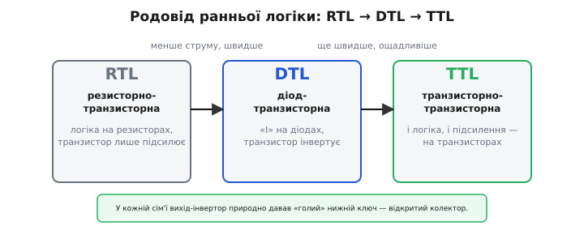
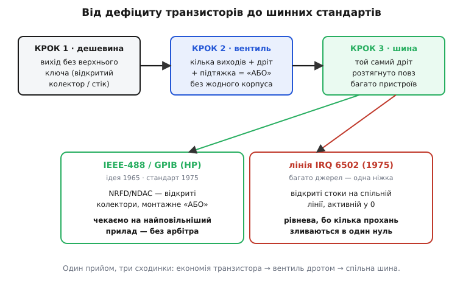

# 📜 Як «недороблений» вихід став найдешевшим вентилем: історія відкритого колектора

Найдивніше у відкритому колекторі те, що він виглядає як **недоробка**. Вихід, який уміє тільки тягнути вниз, а вгору не жене нічого й лишає дріт висіти, — на перший погляд це вихід зі зламаною половиною. Але саме ця «зламана половина» виявилася трюком, за який інженери 1960-х схопилися обома руками: він задарма робив те, за що інакше треба було платити зайвим корпусом мікросхеми, зайвою затримкою і зайвим місцем на платі. Щоб зрозуміти, чому напівфабрикат переміг повноцінний вихід, треба повернутися в час, коли кожен транзистор на кристалі був на вагу золота, а логічний вентиль коштував відчутних грошей.

Це історія в кілька окремих кроків, які легко злити в один, а даремно. Спершу — **як узагалі влаштовувалися ранні логічні сім'ї** й чому серед них природно визрів вихід без верхнього ключа. Потім — **чому монтажне з'єднання дротом** було не хитрощами задля елегантності, а найдешевшим інженерним рішенням своєї доби. Далі — як той самий трюк переріс із дрібної економії на платі у **спосіб будувати спільні шини**, і дві класичні його реалізації: паралельна приладова шина **IEEE-488** від Hewlett-Packard і лінія переривання **IRQ** мікропроцесора **6502**. На кожному кроці питатимемо не «що сталося», а «**чому** саме так, і чому саме тоді».

## Час, коли транзистор коштував грошей

Щоб відчути логіку тієї доби, треба спершу викинути з голови сучасну звичку, ніби транзистори безплатні. Сьогодні в одному чипі їх мільярди, і зайвий ключ на виході нікого не турбує. А на межі 1950–60-х усе було навпаки: кожен транзистор — окремий дорогий прилад, і навіть коли їх почали складати по кілька на одному кристалі, кількість елементів у мікросхемі рахували поштучно. Дешевша схема — це буквально схема з **меншим числом транзисторів**. Ця арифметика й диктувала, як виглядав логічний вентиль.

Перші інтегральні логічні сім'ї будувалися сходинками, і кожна наступна економила транзистори чи піднімала швидкість. **Резисторно-транзисторна логіка** (англ. *resistor-transistor logic, RTL*) робила логіку на резисторах, а транзистор лишала тільки підсилювати — просто, але повільно й вибагливо до перешкод. За нею прийшла **діод-транзисторна логіка** (англ. *diode-transistor logic, DTL*): вхідну логічну функцію «І» тут виконує гроно діодів, а транзистор іде наприкінці — інвертує й підсилює результат. Діоди дешеві, тож DTL на якийсь час стала робочою конячкою цифрової техніки. І аж потім з'явилася **транзисторно-транзисторна логіка** (англ. *transistor-transistor logic, TTL*), де і логіку, і підсилення роблять транзистори (звідси подвійне «транзисторно» в назві) — швидша й ощадливіша за DTL, вона й стала стандартом на десятиліття.


*Родовід ранньої логіки. Кожна наступна сім'я — швидша й ощадливіша, але спільне в них одне: вихідний каскад-інвертор завершується транзистором на землю, і варто не ставити над ним верхнього ключа — маєш готовий відкритий колектор.*

> 🔧 **Навіщо це.** Тримайте в голові цю арифметику дефіциту — з неї виросте весь сенс відкритого колектора. У добу, коли кожен транзистор на виду й коштує грошей, будь-яка схема, що **прибирає** зайві транзистори, автоматично виграє — навіть якщо натомість вимагає одного дешевого резистора зовні. Відкритий колектор — це рівно такий обмін: викидаємо дорогий верхній ключ на кристалі, а натомість чіпляємо копійчану підтяжку на платі. У ту епоху це була очевидна вигода.

Важлива й чесна ремарка про авторство, бо тут легко приписати все одній фірмі. TTL популяризувала й перетворила на світовий стандарт **Texas Instruments**, але першою робочу TTL-сім'ю зробила не вона. Ще **1963 року** фірма **Sylvania** під керівництвом інженера **Тома Лонго** (англ. *Tom Longo*) випустила сім'ю **SUHL** (*Sylvania Universal High-Level Logic*), яку застосовували навіть у системах керування ракети «Фенікс». Texas Instruments, за свідченням істориків техніки, по суті відтворила схемотехніку Sylvania у своєму процесі — і виграла ринок кращим виробництвом і нижчою ціною, а не первістю ідеї. Це усталений факт: винахід був колективний, первість схеми — за Sylvania, а перемога на ринку — за TI. Класичний випадок, коли «хто зробив перший» і «хто переміг» — двоє різних людей.

## Знамените число 7400 і два «зіпсовані» брати

Коли **1964 року** Texas Instruments випустила серію **SN5400** (спершу — військове виконання в керамічному корпусі), а **1966-го** — дешеву цивільну **SN7400** у пластику, сталося те, що рідко коли стається в техніці: набір мікросхем став **стандартом де-факто** для всієї галузі. Пластикова 7400-серія за пару років захопила більшу частину ринку логіки, і десятки виробників почали робити сумісні чипи з тими самими номерами. Ці дати добре задокументовані.

І от усередині цієї серії, поряд зі звичайними вентилями, жили мікросхеми з тим самим набором логіки, але з **відкритим колектором** на виході — рівно ті «зіпсовані» вентилі без верхнього ключа. Найпоказовіша пара — **7401** і **7403**: обидві містять по чотири незалежні елементи «І-НЕ» (2 входи кожен) саме **з відкритим колектором**. Різниця між ними — лише в розкладці ніжок (розташуванні виходів на корпусі), логіка й тип виходу однакові. Тобто фірма свідомо тримала в каталозі поруч дві версії того самого вентиля з відкритим колектором — попит на такий вихід був реальний і масовий.

Навіщо взагалі випускати вентиль зі «зламаним» виходом як окремий товар? Бо саме цей вихід умів дві речі, яких **не вмів** звичайний двотактний. По-перше, кілька таких виходів можна було безкарно з'єднати одним дротом і дістати логічну функцію задарма — про це зараз. По-друге, відкритий колектор міг тягнути свій вихід до **чужої** напруги живлення: підтяжку чіпляли не обов'язково до тих самих 5 вольтів, а хоч до 12 чи 24 — і виходом на 5-вольтовій логіці ти вмикав навантаження на вищій напрузі, чи стикував логіку з різними рівнями. Двотактний вихід так не вмів у принципі: його верхній ключ жорстко прив'язаний до **свого** живлення. Ці дві здатності й тримали відкрито-колекторні вентилі в кожному каталозі десятиліттями.

## Дріт замість вентиля: чому монтажна логіка була неминучою

Тепер — серцевина всієї історії, те, заради чого її варто розповідати. Уяви інженера 1968 року за кресленням плати. Йому треба, щоб сигнал «тривога» спалахнув, якщо активний **хоч один** із восьми давачів. Логічно це чисте «АБО» на вісім входів. Як він це зробить?

Найпряміший шлях — поставити мікросхему-вентиль «АБО». Але вентилі тієї доби були на 2, ну на 4 входи; на вісім входів довелося б скласти дерево з кількох корпусів. Кожен корпус — це гроші, місце на платі, ще одна деталь, яку треба запаяти й яка може відмовити, і додаткова затримка сигналу, поки він проходить крізь зайві каскади. А тепер порівняй із другим шляхом: узяти вісім виходів **з відкритим колектором** (їх однаково вже мають ті давачі чи логіка перед ними), звести їх **одним дротом** і накинути на дріт **один** резистор-підтяжку. Усе. Вісім джерел, одна логічна функція «АБО», **жодного вентиля** — тільки шматок дроту й копійчаний резистор.

Різниця в ціні й складності разюча, і в ту епоху вибір був очевидний. Логіку дає не кристал, а **спосіб з'єднання** — звідси й назва цього прийому, **монтажна логіка** (англ. *wired logic*, «логіка проводом»). А оскільки для активно-низьких сигналів той спільний дріт рахує саме «АБО» — «активно, якщо активний хоч один», — прийом здобув ім'я **монтажне «АБО»** (англ. *wired-OR*).

> 🔧 **Навіщо це.** Ось чому монтажна логіка не була хитромудрістю задля краси — вона була **найдешевшим інженерним рішенням своєї доби**. У світі, де вентиль коштує грошей і місця, а дріт із резистором — майже нічого, гріх не замінити вентиль дротом там, де вихід і так відкрито-колекторний. Це не трюк заради елегантності, а прямий наслідок економіки: бери те, що вже є (відкриті колектори), з'єднуй проводом — і логічна функція виходить безплатно. Сучасні інженери досі роблять так само на лінії I²C, на спільному перериванні, на лінії скиду — з тієї самої причини, що й у 1968-му.

Але тут же ховалися й граблі, які теж дісталися в спадок. Дріт-вентиль повільний угору: вниз його сильно тягне транзистор, а вгору піднімає лише кволий резистор через ємність дроту, тож фронт наростання пологий. І що більше джерел та довший дріт — то ця плата за дешевину відчутніша. Тому монтажна логіка природно тяжіла до сигналів, де швидкість не критична: тривоги, статуси «зайнято/готово», спільні переривання — усе, що змінюється рідше за такт процесора. Саме там вона й розквітла.

## Від дрібної економії до спільної шини

І тут історія робить наступний, найважливіший поворот. Той самий прийом, що народився як дрібна економія на одній платі, виявився ключем до значно більшої задачі — **як багатьом пристроям чемно ділити один спільний провід**.

Логіка переходу пряма. Раз кілька відкритих колекторів безпечно живуть на одному дроті й жоден не б'ється з іншими — то цей дріт можна **розтягнути** й пустити повз багато пристроїв, зробивши з нього **спільну шину**. Правило «нуль перемагає, одиницю тримає підтяжка» гарантує, що ніхто нікого не спалить: кожен або тягне лінію вниз, коли має що сказати, або відпускає її й мовчить. Це рівно те, що потрібно для **арбітражу** — впорядкованого доступу багатьох до спільного ресурсу без бійки. Дешевий трюк із платою 1968 року виріс у фундамент цілих шинних стандартів. Розгляньмо два, що стали класикою: один — про передавання даних між приладами, другий — про переривання в процесорі.


*Уся нитка на одній картинці. Спершу відкритий колектор економить транзистор; тоді кілька таких виходів на дроті дають логічне «АБО» без вентиля; тоді той самий дріт розтягують у шину. І з цієї третьої сходинки виростають обидві класики — приладова шина IEEE-488, де активно-низькі лінії рукостискання чекають на найповільніший прилад без арбітра, і лінія IRQ 6502, де багато відкрито-стокових джерел зливаються в один спільний нуль на одній ніжці.*

## IEEE-488: приладова шина на активно-низьких дротах

Перша реалізація народилася не в комп'ютерній індустрії, а серед вимірювальних приладів. У **1965 році** фірма **Hewlett-Packard** (заснована **Біллом Г'юлеттом** і **Дейвом Паккардом** у каліфорнійському гаражі — це та сама HP) розробила власну шину, щоб з'єднувати свої **програмовані вимірювальні прилади** — вольтметри, генератори, аналізатори — між собою й з керуючим комп'ютером. Назвали її **HP-IB** (*Hewlett-Packard Interface Bus*, «інтерфейсна шина Hewlett-Packard»). Ідея була проста й приваблива: замість того, щоб кожен прилад тягнув свій набір проводів, усі висять на **одній** спільній паралельній шині, а керуючий пристрій по черзі каже, хто зараз «говорить», а хто «слухає».

Публічно систему детально описали в **жовтні 1972 року** — у журналі HP Journal вийшли дві статті про неї (усталений факт; це радше момент оприлюднення, ніж винаходу). А далі шину підхопили стандартизатори: **1974 року** проєкт документа від HP пішов на голосування в міжнародну комісію IEC, і **1975-го** інститут IEEE опублікував стандарт **IEEE 488-1975** — «Цифровий інтерфейс для програмованого вимірювального обладнання». Відтоді ту саму шину під різними іменами — HP-IB, GPIB (*General Purpose Interface Bus*, «універсальна інтерфейсна шина»), IEEE-488 — знали всі, хто працював із приладами. Розрізняймо кроки чесно: **ідея й перша реалізація** — за HP (1965), **публічний опис** — 1972, **міжнародний стандарт** — 1975. Троє різних віх, і плутати їх не варто.

Найцікавіше для нас — **як** ця шина погоджує роботу приладів різної швидкості, і тут відкритий колектор із монтажним «АБО» грає головну роль. Передавання одного байта по шині керує **трипровідне рукостискання** (англ. *three-wire handshake*) на трьох керуючих лініях:

```
DAV  (Data Valid)      — «дані на шині дійсні»    ← жене джерело (той, хто говорить)
NRFD (Not Ready For Data) — «я ще не готовий»      ← тягнуть приймачі (ті, хто слухає)
NDAC (Not Data Accepted)  — «я ще не прийняв»       ← тягнуть приймачі
```

Дві з цих ліній — **NRFD** і **NDAC** — активно-низькі й зроблені саме на **відкритих колекторах**, зведених у монтажне «АБО» (його ж, під іншим кутом, звуть монтажним «І»). І ось де краса. На лінії NRFD висять **усі** приймачі одразу. Поки бодай **один** із них не готовий — він тримає лінію внизу, і джерело фізично бачить «ще не всі готові». Лінія підніметься (скаже «всі готові») лише тоді, коли **кожен останній** приймач її відпустить. Так само NDAC: вона в 0, доки **хоч один** приймач іще не забрав байт, і піднімається, лише коли **всі** його прийняли.

Наслідок виходить сам собою, задарма з правила «нуль перемагає»: **швидкість шини задає найповільніший прилад**. Швидкий приймач давно готовий і відпустив свою частину лінії — але поки повільний тримає її внизу, джерело чекає. Ніхто не втратить байт через те, що сусід квапиться. І все це — без жодного центрального лічильника чи опитування: просто багато відкритих колекторів на спільному дроті, і фізика монтажного «АБО» сама синхронізує різношвидкісний натовп приладів. (Тим самим відкрито-колекторним способом зроблена й лінія **SRQ** — *Service Request*, якою будь-який прилад просить у керуючого уваги: класичне спільне «переривання», тільки між приладами.)

> 🔧 **Навіщо це.** Ось урок, який переживе будь-яку конкретну шину: коли багато різношвидкісних учасників мусять іти в ногу, активно-низький монтажний дріт синхронізує їх **без арбітра**. Не треба ні головного лічильника, ні опитування «хто готовий» — сама лінія, яку кожен може притримати внизу, а піднімають лише всі разом, і є механізмом «чекаємо на останнього». Той самий принцип ти щодня бачиш у притримуванні такту на I²C, коли повільний ведений тримає лінію SCL унизу, поки не впорається. Це не випадковий збіг — це той-таки трюк 1968 року, вирослий у протокол.

## Лінія IRQ шестидесятп'ятого: багато джерел — одна ніжка

Друга класична реалізація прийшла з протилежного боку — зсередини мікропроцесора. На середину 1970-х з'явилися дешеві 8-бітні процесори, і серед них — знаменитий **6502** фірми **MOS Technology** (1975): той самий, що стояв у Apple II, Commodore, Atari й багатьох іграшках і комп'ютерах доби. У такого процесора ніжок для переривань — лічені (по суті, одна лінія `IRQ` на всі маскувані переривання), а джерел подій навколо нього — купа: таймери, порти вводу-виводу, контролери. Тягнути від кожного окремий провід до окремої ніжки — ніжок катма.

Розв'язок узяли той самий — монтажне «АБО». Лінію `IRQ` шестидесятп'ятого зробили **активно-низькою** й **чутливою до рівня** (англ. *level-sensitive*): процесор реагує не на *перехід*, а на сам факт, що лінія **зараз** унизу. А периферійні мікросхеми тієї сім'ї (порти, таймери — скажімо, славнозвісний адаптер **6522 VIA**) мають вихід переривання типу **відкритий стік** (англ. *open drain* — той самий відкритий колектор, тільки на польовому транзисторі). Усі ці відкриті стоки зводять **одним дротом** із підтяжкою на **одну** ніжку `IRQ` процесора. Первісні джерела кажуть це майже дослівно: більшість мікросхем вводу-виводу 65-ї сім'ї мають відкрито-стокові виходи `IRQ`, призначені з'єднуватися між собою й із входом `IRQ` процесора; будь-яка з них може притягти лінію вниз, а вгору лінію піднімає **лише** підтяжка. Це чисте монтажне «АБО»: щойно **хоч один** пристрій просить уваги — процесор бачить 0 і зривається в обробник.

І тут вилазить тонка, але глибока причина, **чому** таку спільну лінію роблять саме за рівнем, а не за фронтом. Первісні документи 6502 пояснюють її прямо: рівнева чутливість — це «спосіб для процесора знати, що є **ще одне** переривання, яке потребує обслуги». Уяви два джерела просять майже водночас. Була б лінія фронтовою (реакція на *мить* переходу 1→0) — процесор спіймав би перший спад, а другий **пропустив би назавжди**: переходу більше не буде, лінія й так уже внизу, її тримає другий пристрій. За **рівнем** нічого не губиться: поки лінія в 0, привід нікуди не подівся; обслужив і зняв прохання перший — а лінію все ще тримає другий, тож щойно процесор дозволить переривання знову, він одразу зайде в обробник іще раз і добере другого. Рівнева чутливість — не примха, а **прямий наслідок** того, що на монтажному «АБО» кілька джерел зливаються в один спільний нуль, і фронтом їх розрізнити неможливо.

> 🔧 **Навіщо це.** Ось чому монтажне «АБО» й рівневе переривання — нерозлучна пара, і це живе досі, від 6502 до сучасних мікроконтролерів. Щойно ти вішаєш кілька джерел на одну активно-низьку лінію переривання, ти **зобов'язаний** робити її за рівнем і писати обробник так, ніби джерел одразу кілька: опитати всіх, хто міг просити, і чистити кожне, доки лінія не звільниться. Забудеш це — і під навантаженням переривання почнуть «губитися», бо два одночасні прохання злипнуться в один нуль, а ти обробиш лише одне. Цей закон вкарбований у фізику спільного дроту, а не в конкретний процесор.

## Що з цієї історії винести

Озирнімося на весь шлях. Почали ми з парадокса: вихід, який уміє тільки тягнути вниз, виглядає як **недоробка** — а виявився одним із найкорисніших винаходів цифрової електроніки. Розгадка — в економіці своєї доби. У світі, де кожен транзистор коштує грошей і місця, викинути з виходу дорогий верхній ключ, а натомість накинути на дріт копійчаний резистор — очевидна вигода. Тому відкритий колектор природно визрів у логічних сім'ях від DTL до TTL, а Texas Instruments свідомо тримала в 7400-серії окремі відкрито-колекторні вентилі на кшталт 7401 і 7403 — попит на такий вихід був масовий.

Але головне, що варто винести, — це **сходинки, якими дрібний трюк виріс у фундамент**. Спершу відкритий колектор дав змогу зробити **логічний вентиль без вентиля** — самим лише дротом і підтяжкою, найдешевшим способом рахувати «АБО» на платі 1968 року. Потім цей самий дріт **розтягнули** у спільну шину, де правило «нуль перемагає, одиницю тримає підтяжка» само собою дає безпечний доступ багатьох до одного проводу. І з цього виросли дві класики: приладова шина **IEEE-488** від Hewlett-Packard (ідея 1965, стандарт 1975), де активно-низькі відкрито-колекторні лінії рукостискання синхронізують різношвидкісні прилади **без арбітра** — «чекаємо на найповільнішого»; і лінія переривання **IRQ** мікропроцесора **6502**, де десяток відкрито-стокових джерел висять на одній ніжці, а рівнева чутливість — прямий наслідок того, що кілька прохань зливаються в один спільний нуль.

Наскрізна нитка одна: **пасивний рівень, який тримає підтяжка, і активний рівень, який будь-хто може нав'язати, не сперечаючись із сусідами.** Народжена з дефіциту транзисторів у 1960-х, ця ідея пережила свою добу й досі живе в кожному I²C, у кожній спільній лінії скиду, у кожному спільному перериванні. Хто зрозумів її історію, той бачить у відкритому колекторі не «зламану половину виходу», а найдешевший спосіб змусити багатьох чемно ділити один провід — і саме тому цей «недороблений» вихід досі скрізь.
