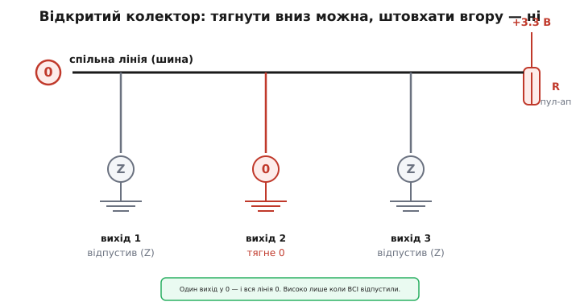
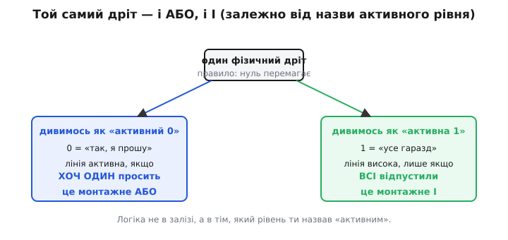
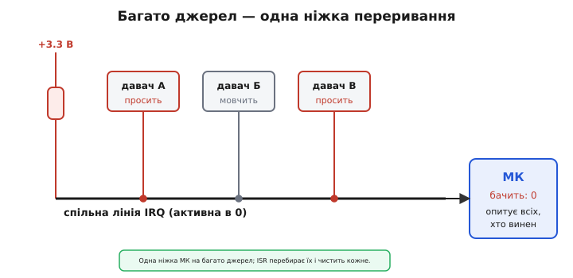

# Монтажне «АБО» і переривання

Уяви кімнату, де десяток людей тримають одну спільну мотузку, натягнуту до стелі пружиною. Ніхто не може *підняти* мотузку вище стелі — пружина й так тримає її вгорі. Але будь-хто, смикнувши, *опускає* її вниз. І поки хоч одна рука тягне — мотузка внизу. Вгорі вона лише тоді, коли **всі** відпустили.

Це не гра. Це точна картина одного з найкорисніших трюків цифрової електроніки — коли багато мікросхем чесно ділять **один провід**, і жодна нікому не заважає. Звідси виростає і спосіб зробити логічний вентиль без вентиля, самим лише дротом, і спосіб під'єднати десяток давачів до **однієї** ніжки переривання процесора. Розберімо, чому так, і де тут ховаються граблі.

## Чому звичайний вихід ділити не можна

Типовий цифровий вихід — **двотактний** (англ. *push-pull*, «штовхай-тягни»). Усередині два ключі: верхній з'єднує вихід із живленням (штовхає в 1), нижній — із землею (тягне в 0). У кожен момент замкнений рівно один. Вихід сам, активно, *жене* потрібний рівень — тому він швидкий і сильний.

> 🔧 **Навіщо це.** Двотактний вихід чудовий, поки він на дроті сам. Саме ним GPIO мікроконтролера кліпає світлодіодом, тактує зсувний регістр, керує затвором транзистора — там, де один хазяїн однієї лінії.

А тепер спробуй з'єднати два таких виходи одним дротом. Один каже «1» (верхній ключ замкнений на живлення), другий каже «0» (нижній ключ замкнений на землю). Виходить пряма доріжка **від живлення до землі крізь два відкриті транзистори**. Це не логіка — це коротке замикання. Тече десятки-сотні міліампер, кристали гріються, рівень на дроті стає якимось середнім «ні те ні се», а з часом один із виходів вигорає. Два двотактні хазяїни на одному дроті — це бійка (англ. *bus contention*, «суперечка за шину»), і в ній програють обидва.

[Двотактний вихід](book:electronics/push-pull-output) — стандартний активний вихід із верхнім і нижнім ключем; тягне обидва рівні сам, тому сильний і швидкий, але на спільному дроті два таких виходи створюють наскрізний струм від живлення до землі. Саме цю проблему й розв'язує відкритий колектор.

## Прибрати верхній ключ

Розв'язок простий до зухвалості: **викиньмо верхній ключ**. Хай вихід уміє тільки одне — тягнути вниз, у 0. А в 1 хай не жене нічого: просто відпускає дріт, стає високоомним (стан Z, від англ. *high impedance*), наче його там і немає.

Такий вихід у біполярного транзистора називають **відкритим колектором** (англ. *open collector*): назовні виведений «голий» колектор нижнього транзистора, без резистора до живлення. *Колектор* — від латини *colligere* («збирати»): у транзисторі це вивід, що збирає носії заряду з бази. У польового (MOSFET) транзистора той самий трюк зветься **відкритим стоком** (англ. *open drain*): назовні виведений стік (*drain* — «злив», бо носії залишають канал саме через нього). Принцип один; різниця лише в тому, який транзистор стоїть усередині.

Але вихід, що вміє тільки опускати, сам по собі марний: відпустивши дріт, він лишає його «висіти» — рівень невизначений, бо ніщо не тримає лінію вгорі. Тому до спільного дроту чіпляють **підтяжку** (англ. *pull-up*) — резистор до живлення. Це і є та сама пружина зі стелі: поки ніхто не тягне, підтяжка м'яко підтримує дріт у 1.

Тепер картина замкнулася. Кожен вихід або **тягне лінію в 0**, або **відпускає її** (Z). Наскрізного струму нема ніколи: верхнього ключа просто немає, штовхати в 1 нікому. Дозволено скільки завгодно виходів на одному дроті — і жодної бійки.


*Відкритий колектор тягне вниз, але не штовхає вгору. Один вихід у 0 садить усю лінію в 0; підтяжка піднімає її, тільки коли всі стали в Z.*

Правило спільної лінії з цього виходить залізне, і воно варте того, щоб закарбувати:

```
Хоч один тягне 0  →  на лінії 0.
Усі відпустили    →  підтяжка дає 1.
```

Коротко: **нуль сильніший за одиницю**. Нуль активний (його хтось жене), одиниця пасивна (її ніхто не жене, лишає підтяжці). Це називають **логікою з активним нулем** (англ. *active-low*): значущий, «промовистий» стан — саме низький.

[Відкритий колектор](book:electronics/open-collector) — вихід, у якого назовні виведений тільки нижній транзистор без резистора до живлення: він або замикає лінію на землю (0), або відпускає в Z. [Відкритий стік](book:electronics/open-drain) — те саме на польовому транзисторі. Обидва потребують зовнішньої підтяжки й самі по собі одиницю не жену́ть.

## Дріт, що працює логічним вентилем

Ось де починається краса. З'єднай виходи двох (чи десяти) відкритих колекторів одним дротом із підтяжкою — і **сам дріт** уже рахує логічну функцію. Ніякої мікросхеми-вентиля, лише провід і резистор. Тому це й звуть **монтажною логікою** (англ. *wired logic*): функцію дає не кристал, а спосіб з'єднання.

Яка це функція? Дивись на правило. Лінія в 0, коли **хоч хтось** тягне 0. Якщо назвати активним рівнем нуль (як воно й є), то це звучить точнісінько як **АБО**: «активно, якщо активний хоч один із входів». Звідси назва — **монтажне «АБО»** (англ. *wired-OR*).

Але та сама залізяка водночас рахує й **І** — залежно від того, який рівень ти назвеш «активним». Поглянь під іншим кутом: лінія висока, тільки коли **всі** відпустили. Якщо назвати активним рівнем одиницю («усе гаразд, я не заперечую»), то лінія висока лише тоді, коли *всі* кажуть 1. А це вже **І**: «результат 1, лише якщо ВСІ входи 1». Звідси друга назва тієї самої схеми — **монтажне «І»** (англ. *wired-AND*).


*Логіка живе не в залізі, а в тім, який рівень названо активним. Той самий провід — і монтажне АБО (активний 0), і монтажне І (активна 1).*

Це не два різні дроти й не два різні кристали — це **один провід**, названий двома іменами. Так працює подвійність де Моргана: перемкни, що вважати «істиною» (0↔1), і АБО обертається на І. Плутанина «то АБО, то І» майже вся звідси: люди мовчки міняють, який рівень активний, і дивуються, що назва інша. Тримайся правила «нуль перемагає» — і назва тебе не зіб'є.

> 🔧 **Навіщо це.** Монтажне «АБО» задарма робить те, за що інакше платиш вентилем і затримкою: «сигналь, якщо *хоч хтось* із багатьох просить». Тривога від десятка давачів, «зайнято» від будь-якого з пристроїв на шині, спільний скид — усе це один активно-низький дріт, до якого доточуєш нове джерело, не чіпаючи решти.

Історично саме на відкритих колекторах логічних мікросхем 1960–70-х (серії на кшталт 7401, 7403 — чотири елементи І-НЕ з відкритим колектором) інженери й будували монтажну логіку без зайвих корпусів; звідти ж трюк перекочував у шинні й перериваннєві лінії ранніх процесорів. Як народилися відкритий колектор і монтажне «АБО», чому цей підхід був неминучим у ту епоху й де він живе досі — [в історичній вставці](book:electronics/wired-or/hist-open-collector.md): від діод-транзисторної логіки до IEEE-488 і лінії IRQ шестидесятпʼятого.

## Плата за спокій: швидкість і резистор

Дарма нічого не буває. Відкритий колектор ліквідував бійку, але дещо забрав.

Униз лінію жене транзистор — сильно і швидко: фронт спаду крутий. А **вгору** її тягне лише кволий резистор-підтяжка. Разом із неминучою ємністю дроту й входів (кожен вхід, кожен сантиметр доріжки додає пікофаради) підтяжка утворює RC-ланку, і фронт наростання виходить пологий — лінія повзе в 1 по експоненті, а не стрибає.

Звідси прямий конфлікт при виборі підтяжки. Менший опір — швидший фронт угору (менша стала RC), але більший струм, коли лінію тримають у 0: увесь він тече крізь підтяжку в землю. Більший опір — економніше, та фронт стає таким млявим, що на високій частоті лінія не встигає піднятися до 1, і приймач читає сміття. Класичний компроміс: для звичайної логіки беруть кілоом-другий, для повільних ліній — десятки кілоом заради економії, для швидких шин підтяжку рахують під ємність і частоту прицільно.

**Порахуймо фронт наростання.** Лінія з підтяжкою 4.7 кОм і сумарною ємністю 100 пФ. Скільки триває підйом від 0 до порогу «1» (беремо поріг ≈ 2/3 живлення, тобто приблизно одну сталу RC)?

```
τ = R · C = 4700 Ом · 100·10⁻¹² Ф = 470·10⁻⁹ с = 0.47 мкс
```

Пів мікросекунди лише на те, щоб піднятися. Для лінії, яка кліпає раз на мілісекунду, це дрібниця. А для шини на 400 кГц (такт ≈ 2.5 мкс) — уже п'ята частина такту з'їдена млявим фронтом; тут або зменшуй підтяжку, або скорочуй дріт. Ось чому в довгих або швидких відкрито-колекторних лініях фронт наростання — головний ворог, і саме він, а не логіка, ставить стелю частоти.

> 🔧 **Навіщо це.** Коли шина «майже працює, але на високій частоті збоїть» — першими підозрюй підтяжку й ємність, а не код. Половину проблем відкрито-колекторних ліній лікують не переписуванням прошивки, а меншим резистором підтяжки чи коротшою доріжкою.

## Головне застосування: спільна лінія переривання

Тепер — заради чого все й затівалося. У процесора чи мікроконтролера ніжок для переривань (англ. *interrupt* — «переривання», від латини *interrumpere*, «розривати») лічені, а джерел подій — купа: акселерометр «є новий відлік», годинник «настала секунда», сенсорна кнопка «мене торкнулись», давач руху «хтось увійшов». Тягнути від кожного окремий провід до окремої ніжки — ніжок не вистачить.

Розв'язок — той самий дріт. Хай кожен давач має вихід переривання типу **відкритий стік, активний у 0**. Зведи їх усі на **одну спільну лінію IRQ** з підтяжкою і заведи її на **одну** ніжку процесора. Виходить монтажне «АБО»: щойно **хоч один** давач просить уваги (тягне лінію в 0) — процесор бачить 0 і зривається в обробник.


*Одна ніжка переривання на багато джерел. Хто завгодно тягне лінію в 0; обробник перебирає давачів і питає кожного, чи це він.*

Але спільна лінія не каже, **хто** саме подав сигнал — вона лише каже «хтось». Тому обробник переривання (ISR, англ. *interrupt service routine*) мусить сам з'ясувати винуватця: **опитати** джерела по черзі — прочитати в кожного регістр стану й спитати «це ти?». Порядок опитування задає пріоритет: кого перевіряєш першим, той і важливіший.

І тут вилазить тонкість, через яку спільні переривання роблять **за рівнем**, а не за фронтом. Лінія, активна в 0, тримається в 0, **доки хоч один** давач не обслужений. Уяви два давачі просять водночас. Був би це фронт (реакція на *перехід* 1→0) — процесор спіймав би один спад, а другий пропустив, бо переходу вже не буде: лінія й так унизу. За **рівнем** інакше: поки лінія в 0, привід нікуди не зник. Обслужив і зняв прохання перший давач — а лінію все ще тримає внизу другий, тож щойно дозволиш переривання знову, процесор одразу зайде в обробник іще раз і добере другого. Нічого не губиться.

[Рівень проти фронту](book:electronics/edge-vs-level) — переривання реагує або на *рівень* сигналу (поки він активний — привід є), або на *перехід* між рівнями (спрацьовує мить фронту). Для спільної лінії з багатьма джерелами потрібен саме рівень: інакше одночасні прохання злипаються в один фронт і частину губиш.

**Обробник спільної лінії IRQ.** Три давачі на одному активно-низькому проводі; обробник опитує кожного за пріоритетом і чистить джерело, доки лінія не звільниться.

:::tabs
```cpp
// Кожен davach_*() читає регістр стану давача через I2C/SPI,
// обробляє подію й СКИДАЄ прапорець у самому давачі —
// тільки після цього той відпускає лінію IRQ.

#define IRQ_PIN  2   // ніжка МК, куди зведено спільну лінію (активна в 0)

void obrobnyk_irq(void) {
    // Поки лінію хтось тримає внизу — на ній ще є непочате прохання.
    while (digitalRead(IRQ_PIN) == 0) {
        // Порядок опитування = пріоритет джерел.
        if (davach_ruhu_prosyt())   obsluhy_ruh();      // найважливіший
        else if (godynnyk_prosyt()) obsluhy_godynnyk();
        else if (knopka_prosyt())   obsluhy_knopku();
        else break;   // ніхто не зізнається — уникаємо вічного циклу
    }
}
```
```micropython
# Кожен davach_*() читає регістр стану давача через I2C/SPI,
# обробляє подію й СКИДАЄ прапорець у самому давачі —
# тільки після цього той відпускає лінію IRQ.

from machine import Pin

irq = Pin(2, Pin.IN, Pin.PULL_UP)   # ніжка МК зі спільною лінією (активна в 0)

def obrobnyk_irq(_pin=None):
    # Поки лінію хтось тримає внизу — на ній ще є непочате прохання.
    while irq.value() == 0:
        # Порядок опитування = пріоритет джерел.
        if davach_ruhu_prosyt():
            obsluhy_ruh()          # найважливіший
        elif godynnyk_prosyt():
            obsluhy_godynnyk()
        elif knopka_prosyt():
            obsluhy_knopku()
        else:
            break                  # ніхто не зізнається — уникаємо вічного циклу
```
:::

Зверни увагу на дві речі. По-перше, `while`, а не `if`: поки лінія в 0, кружляємо й добираємо всіх, хто просить, — інакше другий давач лишиться невислуханим до наступної події. По-друге, `break` на випадок, коли лінія в 0, а жоден давач не зізнається: без нього — вічний цикл, і прошивка зависає. Цей «фантомний нуль» буває, коли давач знімає прохання не миттєво або коли лінію притягнула перешкода; ловити його обов'язково.

> 🔧 **Навіщо це.** Так один пін мікроконтролера обслуговує хоч десяток давачів. Плата — обробник має бути готовий до кількох джерел одразу: `while` замість `if`, чіткий пріоритет опитування і захист від фантомного нуля. Забудеш `while` — під навантаженням переривання почнуть «губитися», і полагодити це потім важко, бо збій плаває.

## Та сама ідея скрізь

Щойно вловиш «нуль перемагає, одиниця пасивна», починаєш упізнавати цей візерунок усюди — це не окремий фокус, а один із базових способів, у який цифрові пристрої чемно ділять спільний провід.

**Шина I²C.** Обидві її лінії — даних (SDA) і такту (SCL) — це відкритий стік із підтяжкою, тобто монтажне «І». З цього одного факту випливає майже все в її поведінці. Кілька ведучих на шині не б'ються: якщо двоє передають водночас і один жене 1 (відпускає), а другий 0 (тягне), лінія стає 0 — і той, хто хотів 1, *бачить* на лінії 0, розуміє, що програв, і замовкає. Це і є арбітраж, і він задарма падає з правила «нуль перемагає». А ще ведений може **притримати такт**: тримає SCL у 0, поки не готовий, і ведучий фізично не може підняти лінію, доки той не відпустить, — знову те саме монтажне «І». Докладно про адресацію, старт-стоп і швидкості — в окремій темі [«Шина I²C»](book:communications/i2c-bus).

**Спільний скид і «зайнято».** Лінію апаратного скиду (RESET), активну в 0, часто роблять відкрито-колекторною: і кнопка, і супервізор живлення, і сусідній чип можуть притримати всіх у скиді, не заважаючи одне одному. Так само лінія «пристрій зайнятий»: будь-хто тягне її в 0, поки не готовий, і майстер чекає, доки **всі** відпустять.

Спільна нитка скрізь одна: **пасивний рівень, який тримає підтяжка, і активний рівень, який будь-хто може нав'язати, не сперечаючись із сусідами**. Це не про конкретну мікросхему — це спосіб думати про спільний провід. Затям правило «нуль сильніший за одиницю», перевіряй підтяжку, коли фронт замлявів, і пиши обробник спільного переривання так, ніби джерел одразу кілька, — і монтажне «АБО» служитиме тобі чесно.
