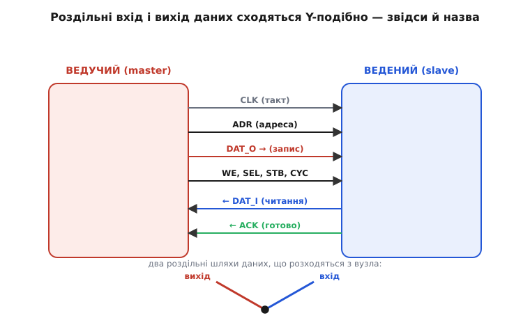
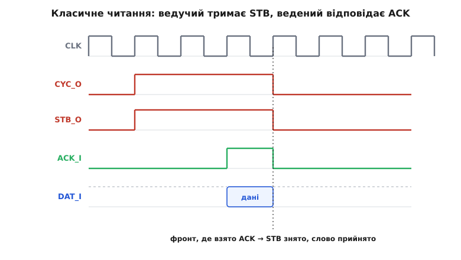
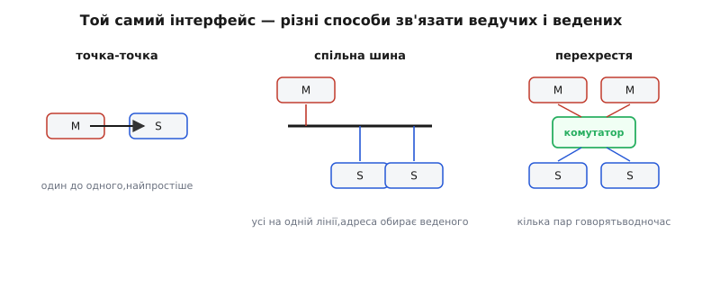

# Шина Wishbone

Уяви, що ти зібрав на одному кристалі FPGA цілу систему: процесорне ядро, контролер пам'яті, кілька таймерів, порт для давача, блок шифрування. Кожен із цих вузлів написав хтось інший — а часто й ти сам, але в різні місяці й у різному настрої. Тепер їх треба з'єднати так, щоб процесор міг записати число в регістр таймера, прочитати результат із блоку шифрування, звернутися до пам'яті — і все це надійно, передбачувано, без того, щоб для кожної пари вузлів вигадувати власний спосіб «поговорити».

Саме тут з'являється **Wishbone** — простий, відкритий і безкоштовний спосіб домовитися, як вузли всередині мікросхеми обмінюються даними. Це не провід і не мікросхема, яку можна купити. Це **угода про інтерфейс**: набір сигналів і чітких правил, коли який з них піднімати й що це означає. Домовилися всі вузли говорити за цими правилами — і будь-який з них стикується з будь-яким, ніби деталі одного конструктора.

## Навіщо взагалі спільна угода

Розберімо корінь проблеми, бо без нього Wishbone здаватиметься довільним набором сигналів. Два вузли на кристалі можна з'єднати абияк: автор процесора вирішує, що «запис» — це коли він виставить адресу, тоді дані, тоді смикне сигнал `go`, а результату чекатиме два такти. Автор таймера тим часом думає інакше: у нього запис підтверджується окремою лінією `done`, а адресу він хоче бачити одночасно з даними. З'єднати ці двоє напряму вже не вийде — доведеться писати між ними перекладач. Три вузли — три перекладачі. Десять вузлів, кожен зі своїм характером, — і ти тонеш у клею, який ніхто, крім тебе, не розуміє.

Причина болю проста: **немає спільної мови**. Кожен інтерфейс — окремий діалект, і вартість з'єднання росте не з числом вузлів, а майже з квадратом їхніх пар. Вихід один, і він завжди той самий: домовитися про **одну** мову наперед. Тоді автор кожного вузла реалізує рівно її, і стикування перестає бути роботою — воно стає просто з'єднанням однойменних дротів.

> 🔧 **Навіщо це.** Коли ти складаєш проєкт для FPGA з чужих готових блоків (англ. *IP core* — «блок інтелектуальної власності», тобто готовий вузол-цеглинка), спільний інтерфейс вирішує, чи склеїш ти їх за годину, чи за тиждень. Візьми процесорне ядро й контролер пам'яті, обидва з Wishbone-інтерфейсом, — і ти просто з'єднуєш їхні шини за іменами сигналів. Без спільної угоди кожне таке з'єднання перетворюється на окреме дослідження чужого коду.

Wishbone і є така мова — навмисне маленька. Її створили наприкінці 1990-х у компанії Silicore, а потім передали спільноті OpenCores, яка зробила специфікацію [суспільним надбанням](book:electronics/wishbone-bus/hist-wishbone-name.md): нею вільно користуються будь-хто й будь-де, без ліцензій і відрахувань. Саме тому Wishbone так поширений серед відкритих проєктів: він нічого не коштує й нікому не належить.

## Дві сторони розмови

У будь-якому обміні на шині є дві ролі, і їх варто назвати одразу, бо вся решта тримається на них. **Ведучий** (англ. *master*, у новіших стандартах *controller* — «керівник») — той, хто **починає** обмін: вирішує, куди й коли звернутися, виставляє адресу, каже «читай» або «пиши». **Ведений** (англ. *slave*, або *target* — «ціль») — той, до кого звертаються: він сам розмову не заводить, лише відповідає, коли вибрали саме його. Процесор — типовий ведучий; таймер, порт, комірка пам'яті — типові ведені.

Ролі закріплені за напрямком дії, а не за «важливістю». Один і той самий вузол буває ведучим в одному обміні й веденим в іншому — але в межах однієї конкретної транзакції хтось один командує, а другий відгукується. Тримай це розділення в голові: майже кожен сигнал Wishbone існує, щоб ведучий сказав веденому щось конкретне або щоб ведений відповів.

## Набір сигналів — рівно те, що потрібно для одного слова

Wishbone спроєктований так, щоб описати найпростішу можливу дію: **прочитати або записати одне слово за однією адресою**. Усе інше — надбудова над цим. Тому й сигналів небагато, і кожен має ясну роль. Імена в специфікації несуть суфікс напрямку: `_O` (*output*) — вихід цього боку, `_I` (*input*) — його вхід. Той самий провід у ведучого зветься `ADR_O`, а в веденого — `ADR_I`; це одна лінія, просто описана з двох кінців.

Ось усе, з чого складається базовий інтерфейс:

- **`CLK`** — спільний **такт**. Wishbone синхронний: усі сигнали читаються й міняються по фронту одного такту. Це різко спрощує міркування — не треба ловити асинхронні збіги, все діється на межах тактів.
- **`RST`** — скидання у відомий початковий стан.
- **`ADR`** — **адреса**: куди звертаємося. Ведучий каже, який саме регістр чи комірку він хоче.
- **`DAT_O` та `DAT_I`** — **дані**. Тут криється характерна риса Wishbone: шляхи даних **роздільні**. Один провідний джгут несе дані **від** ведучого (запис), інший — **до** ведучого (читання). Їх не змішують на спільній двонапрямній лінії; кожен напрямок має свій.
- **`WE`** (*write enable*) — «пишу» проти «читаю»: одна лінія розрізняє два напрямки обміну.
- **`SEL`** (*select*) — які **байти** слова беруть участь. На 32-бітній шині це чотири біти: можна записати лише молодший байт, не чіпаючи решту.
- **`STB`** (*strobe* — «строб, мітка дійсності») — «**оце зараз** дійсне звернення до тебе». Поки `STB` піднятий, виставлені адреса й дані стосуються цього циклу.
- **`CYC`** (*cycle*) — «**триває цикл** роботи з шиною». Ширший за `STB`: охоплює всю транзакцію, навіть якщо всередині неї кілька окремих звернень.
- **`ACK`** (*acknowledge* — «підтвердження»): ведений каже «**готово**, я зробив». Це відповідь, що завершує обмін.


*Ведучий ліворуч, ведений праворуч. Управління й адреса, а також дані на запис (`DAT_O`) течуть до веденого; дані на читання (`DAT_I`) і підтвердження (`ACK`) — назад до ведучого. Унизу — та сама ідея роздільних шляхів даних, що розходяться з одного вузла Y-подібно.*

Пара `CYC` і `STB` часто збиває з пантелику, бо в найпростішому обміні вони підняті й зняті разом. Різниця виходить наяв, коли ведучий робить **серію** звернень поспіль (скажімо, читає кілька слів підряд): `CYC` тримається піднятим на всю серію, показуючи «я досі тримаю шину, не віддавайте її іншому», а `STB` пульсує окремо на **кожне** слово. Тобто `CYC` — про володіння шиною, `STB` — про конкретне звернення в цю мить.

## Рукостискання: як ведучий і ведений домовляються про темп

Тепер — серце Wishbone, механізм, задля якого все й затівалося. Проблема, яку він розв'язує, звучить так: ведучий і ведений можуть працювати з **різною** швидкістю. Регістр таймера відповідає миттєво, того ж такту. А контролер зовнішньої пам'яті — повільний: поки він дістане слово, мине кілька тактів. Ведучий наперед не знає, з ким має справу і скільки чекати. Як зробити так, щоб швидкі не гальмували, а повільні встигали?

Відповідь — **рукостискання** (англ. *handshake*): пара сигналів, де один бік каже «я готовий», а другий — «я зробив», і обмін завершується лише тоді, коли обидва це підтвердили. У Wishbone цю пару утворюють `STB` (від ведучого) і `ACK` (від веденого). Логіка гранично проста, і саме в її простоті сила:

1. Ведучий виставляє адресу, напрямок (`WE`) і, якщо це запис, дані. Тоді піднімає `STB` та `CYC` — це сигнал «звертаюся до тебе **прямо зараз**, ось усе потрібне».
2. Ведучий **тримає** `STB` піднятим і на кожному фронті такту дивиться, чи ведений відповів.
3. Ведений, коли впорався (одразу чи за кілька тактів — байдуже), піднімає `ACK`. Якщо це було читання — він **того ж такту** виставляє дані на `DAT_I`.
4. На фронті, де ведучий побачив `ACK` піднятим, обмін **відбувся**: дані прийнято (чи записано). Ведучий знімає `STB`, і цикл завершено.

Уся краса в тому, що ведучому **не треба знати наперед**, скільки чекати. Він просто тримає `STB` і чекає на `ACK` — один такт чи десять. Швидкий ведений відповідає негайно, і обмін минає за один такт. Повільний тримає ведучого в очікуванні рівно стільки, скільки треба, і жодним таймером цей час задавати не потрібно: сам `ACK` і є сигналом «час настав». Це і зветься **обмін за рукостисканням** — темп задають обидва боки разом, а не годинник згори.


*Ведучий піднімає `CYC` і `STB`, просячи читання. Ведений цього разу неготовий одразу — тримає ведучого два такти. На третьому такті він піднімає `ACK` і виставляє дані на `DAT_I`. На фронті, де ведучий бачить `ACK`, він забирає слово й знімає `STB` — обмін завершено.*

Порівняй два випадки в коді, щоб побачити, як однакова логіка ведучого працює з різними веденими. Ось спрощена модель кроку ведучого — вона перевіряє `ACK` на кожному такті й нічого не припускає про швидкість:

**Один крок ведучого: почати читання й дочекатися підтвердження.**
:::tabs
```cpp
// Стан ліній Wishbone-ведучого. Кожне поле — окремий провід (чи джгут).
typedef struct {
    uint32_t adr;   // ADR_O — куди звертаємось
    uint32_t dat_i; // DAT_I — дані, що прийшли від веденого (читання)
    uint8_t  we;    // WE_O  — 1: запис, 0: читання
    uint8_t  stb;   // STB_O — «звертаюсь зараз»
    uint8_t  cyc;   // CYC_O — «тримаю шину»
    uint8_t  ack;   // ACK_I — «ведений готовий» (вхід)
} wb_master_t;

// Прочитати одне слово за адресою addr. Крутиться, доки ведений не підтвердить.
// Повертає лічильник тактів очікування — видно, чи ведений швидкий, чи ні.
uint32_t wb_read(wb_master_t *wb, uint32_t addr, uint32_t *out) {
    wb->adr = addr;
    wb->we  = 0;          // читаємо
    wb->stb = 1;          // звернення дійсне
    wb->cyc = 1;          // тримаємо шину
    tick();               // фронт такту: лінії зафіксовано

    uint32_t waited = 0;
    while (!wb->ack) {     // ще не готово — просто чекаємо наступного фронту
        waited++;
        tick();            // STB тримаємо піднятим — це і є суть рукостискання
    }
    *out = wb->dat_i;      // ACK піднятий → дані на DAT_I дійсні саме зараз
    wb->stb = 0;           // забрали слово — знімаємо звернення
    wb->cyc = 0;           // відпускаємо шину
    tick();
    return waited;
}
```
```python
from dataclasses import dataclass

# Стан ліній Wishbone-ведучого. Кожне поле — окремий провід (чи джгут).
@dataclass
class WbMaster:
    adr: int = 0    # ADR_O — куди звертаємось
    dat_i: int = 0  # DAT_I — дані, що прийшли від веденого (читання)
    we: int = 0     # WE_O  — 1: запис, 0: читання
    stb: int = 0    # STB_O — «звертаюсь зараз»
    cyc: int = 0    # CYC_O — «тримаю шину»
    ack: int = 0    # ACK_I — «ведений готовий» (вхід)

# Прочитати одне слово за адресою addr. Крутиться, доки ведений не підтвердить.
# Повертає (значення, лічильник тактів очікування) — видно, швидкий ведений чи ні.
def wb_read(wb: WbMaster, addr: int) -> tuple[int, int]:
    wb.adr = addr
    wb.we  = 0            # читаємо
    wb.stb = 1            # звернення дійсне
    wb.cyc = 1            # тримаємо шину
    tick()                # фронт такту: лінії зафіксовано

    waited = 0
    while not wb.ack:     # ще не готово — просто чекаємо наступного фронту
        waited += 1
        tick()            # STB тримаємо піднятим — це і є суть рукостискання

    value = wb.dat_i      # ACK піднятий → дані на DAT_I дійсні саме зараз
    wb.stb = 0            # забрали слово — знімаємо звернення
    wb.cyc = 0            # відпускаємо шину
    tick()
    return value, waited
```
```go
// Стан ліній Wishbone-ведучого. Кожне поле — окремий провід (чи джгут).
type WbMaster struct {
    Adr  uint32 // ADR_O — куди звертаємось
    DatI uint32 // DAT_I — дані, що прийшли від веденого (читання)
    We   uint8  // WE_O  — 1: запис, 0: читання
    Stb  uint8  // STB_O — «звертаюсь зараз»
    Cyc  uint8  // CYC_O — «тримаю шину»
    Ack  uint8  // ACK_I — «ведений готовий» (вхід)
}

// Прочитати одне слово за адресою addr. Крутиться, доки ведений не підтвердить.
// Повертає значення й лічильник тактів очікування — видно, швидкий ведений чи ні.
func wbRead(wb *WbMaster, addr uint32) (out uint32, waited uint32) {
    wb.Adr = addr
    wb.We = 0             // читаємо
    wb.Stb = 1            // звернення дійсне
    wb.Cyc = 1            // тримаємо шину
    tick()                // фронт такту: лінії зафіксовано

    for wb.Ack == 0 {     // ще не готово — просто чекаємо наступного фронту
        waited++
        tick()            // STB тримаємо піднятим — це і є суть рукостискання
    }
    out = wb.DatI         // ACK піднятий → дані на DAT_I дійсні саме зараз
    wb.Stb = 0            // забрали слово — знімаємо звернення
    wb.Cyc = 0            // відпускаємо шину
    tick()
    return out, waited
}
```
:::

Той самий `wb_read` без жодної зміни працює і з таймером (поверне `waited == 0`, бо `ACK` прийшов одразу), і з повільною пам'яттю (поверне `waited == 2` чи скільки там тактів вона думала). Ведучий не знає й не мусить знати заздалегідь — рукостискання саме підлаштувало темп.

А ось бік веденого — повільна пам'ять, що відповідає не одразу, а витримавши кілька тактів:

**Ведений, що затримує відповідь: реагує лише коли вибрали саме його.**
:::tabs
```cpp
typedef struct {
    uint32_t adr;   // ADR_I — адреса від ведучого
    uint32_t dat_o; // DAT_O — дані, які віддаємо на читання (вихід)
    uint8_t  stb;   // STB_I — «до мене звертаються зараз»
    uint8_t  we;    // WE_I  — напрямок
    uint8_t  ack;   // ACK_O — «готово» (вихід)
    uint32_t mem[256];
    uint8_t  latency; // скільки тактів ще «думати»
} wb_slave_t;

// Викликається щотакту. Модель повільної пам'яті з фіксованою затримкою.
void wb_slave_tick(wb_slave_t *s) {
    if (!s->stb) {          // до нас не звертаються — мовчимо, ACK знято
        s->ack = 0;
        s->latency = 3;     // готуємось до наступного звернення
        return;
    }
    if (s->latency > 0) {   // нас вибрали, але ми ще «думаємо»
        s->latency--;
        s->ack = 0;         // ведучий побачить 0 і почекає ще такт
        return;
    }
    // Час настав: віддаємо/приймаємо слово і піднімаємо ACK рівно на цей такт.
    if (s->we) s->mem[s->adr & 0xFF] = s->dat_o; // (спрощено; реально — окремий вхід)
    else       s->dat_o = s->mem[s->adr & 0xFF];
    s->ack = 1;
}
```
```python
class WbSlave:
    def __init__(self):
        self.adr = 0        # ADR_I — адреса від ведучого
        self.dat_o = 0      # DAT_O — дані, які віддаємо на читання (вихід)
        self.stb = 0        # STB_I — «до мене звертаються зараз»
        self.we = 0         # WE_I  — напрямок
        self.ack = 0        # ACK_O — «готово» (вихід)
        self.mem = [0] * 256
        self.latency = 3    # скільки тактів ще «думати»

    # Викликається щотакту. Модель повільної пам'яті з фіксованою затримкою.
    def tick(self):
        if not self.stb:            # до нас не звертаються — мовчимо, ACK знято
            self.ack = 0
            self.latency = 3        # готуємось до наступного звернення
            return
        if self.latency > 0:        # нас вибрали, але ми ще «думаємо»
            self.latency -= 1
            self.ack = 0            # ведучий побачить 0 і почекає ще такт
            return
        # Час настав: віддаємо/приймаємо слово і піднімаємо ACK рівно на цей такт.
        if self.we:
            self.mem[self.adr & 0xFF] = self.dat_o  # (спрощено; реально — окремий вхід)
        else:
            self.dat_o = self.mem[self.adr & 0xFF]
        self.ack = 1
```
```go
type WbSlave struct {
    Adr     uint32    // ADR_I — адреса від ведучого
    DatO    uint32    // DAT_O — дані, які віддаємо на читання (вихід)
    Stb     uint8     // STB_I — «до мене звертаються зараз»
    We      uint8     // WE_I  — напрямок
    Ack     uint8     // ACK_O — «готово» (вихід)
    Mem     [256]uint32
    Latency uint8     // скільки тактів ще «думати»
}

// Викликається щотакту. Модель повільної пам'яті з фіксованою затримкою.
func (s *WbSlave) Tick() {
    if s.Stb == 0 {         // до нас не звертаються — мовчимо, ACK знято
        s.Ack = 0
        s.Latency = 3       // готуємось до наступного звернення
        return
    }
    if s.Latency > 0 {      // нас вибрали, але ми ще «думаємо»
        s.Latency--
        s.Ack = 0           // ведучий побачить 0 і почекає ще такт
        return
    }
    // Час настав: віддаємо/приймаємо слово і піднімаємо ACK рівно на цей такт.
    if s.We != 0 {
        s.Mem[s.Adr&0xFF] = s.DatO // (спрощено; реально — окремий вхід)
    } else {
        s.DatO = s.Mem[s.Adr&0xFF]
    }
    s.Ack = 1
}
```
:::

Ведений реагує **тільки** коли піднято `STB` (тобто вибрали саме його) і піднімає `ACK` рівно на той такт, коли слово готове. Прибери затримку (`latency = 0`) — і він стане миттєвим, як таймер. Логіка ведучого при цьому не змінюється ні на рядок. Оце й означає «спільна мова»: обидва боки говорять однаково, а різницю в характері бере на себе рукостискання.

## Один інтерфейс — багато способів з'єднати

Домовившись про мову двох, лишається спитати: а як зв'язати **багатьох**? Wishbone тут не нав'язує єдиної топології — той самий інтерфейс лягає на кілька способів з'єднання, і ти обираєш під задачу.


*Точка-точка: один ведучий, один ведений, пряме з'єднання — найпростіше. Спільна шина: усі висять на одному наборі ліній, а адреса вибирає, кому призначено звернення. Перехрестя (crossbar): комутатор пускає кілька пар «ведучий-ведений» говорити водночас.*

**Точка-точка** — найпряміший випадок: один ведучий, один ведений, дроти з'єднані навпростець. Нічого зайвого.

**Спільна шина** — усі вузли висять на одному наборі ліній. Ведучий виставляє адресу; за нею невеликий блок-**дешифратор** розуміє, кого саме кличуть, і піднімає `STB` лише тому веденому, а `ACK` від нього повертає ведучому. Це те саме [розбирання адреси на «кому призначено»](book:electronics/address-decoding), що й у будь-якій адресованій пам'яті. Економно за дротами, але говорить у кожну мить лише одна пара.

**Перехрестя** (англ. *crossbar* — «поперечина, перехрестя») — розкішніший варіант: між ведучими й веденими стоїть комутатор, що вміє з'єднати кілька незалежних пар **одночасно**. Поки процесор працює з пам'яттю, контролер прямого доступу паралельно спілкується з портом. Дорожче за логікою, зате пропускна здатність вища.

Ключове тут — що **інтерфейс кожного вузла не змінюється** від вибору топології. Вузол завжди виставляє `ADR`, `STB`, чекає на `ACK` — а вже те, куди ці сигнали фізично приходять (прямо до сусіда, на спільну лінію чи в комутатор), вирішує обв'язка навколо. Це і є сенс маленької спільної угоди: одну й ту саму цеглинку можна вкласти в різні стіни.

## Де Wishbone доречний, а де ні

Wishbone свідомо простий, і в цьому одночасно його сила й межа. Він блищить там, де треба **швидко й безкоштовно** зв'язати вузли всередині кристала: аматорські та відкриті FPGA-проєкти, навчальні процесори, дрібні контролери периферії, де важить ясність, а не гонитва за кожним тактом. Реалізувати Wishbone-ведений — це буквально десяток рядків логіки навколо твого регістра; жодних ліцензій, жодних відрахувань.

Межа теж ясна. Класичне рукостискання «одне слово — одне очікування» лишає такти простоювати, поки повільний ведений думає. Для систем, де пропускна здатність критична — потоки з пам'яті, відео, високошвидкісні інтерфейси, — беруть важчі шини з конвеєром і пакетним передаванням, як-от [AXI](book:electronics/axi-bus): там ведучий шле нові адреси, не чекаючи відповіді на попередні, і такти не гуляють. Wishbone теж має конвеєрний режим, але його стеля нижча за спеціалізовані промислові шини.

Тому правило вибору просте й прагматичне. Треба **зрозуміло, відкрито й дешево** склеїти вузли на кристалі, а рекордна швидкість не потрібна — бери Wishbone: він зробить рівно це й не забере в тебе тижня на розбирання. Потрібна максимальна пропускна здатність із багатьма транзакціями в польоті — дивись у бік важчих шин. Але саме тому, що Wishbone маленький і безкоштовний, він лишається першим інструментом, коли складаєш систему з відкритих цеглинок і хочеш, щоб вони просто заговорили одна з одною.
