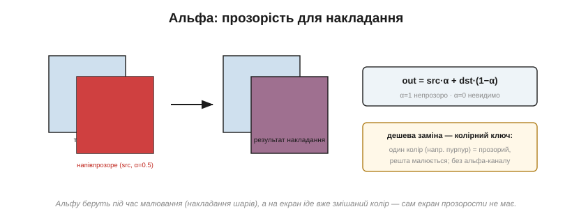

# Колір у пам'яті: RGB565/RGB888, палітри, альфа

[Кадровий буфер](book:electronics/framebuffer) — масив чисел, але що означає кожне **число**? Воно кодує **колір** свого пікселя. А ось як саме — на це є два різні підходи, плюс окремий вимір прозорості, і вибір між ними щоразу торгує кольорами проти пам'яті проти швидкости. Це не дрібниця: від формату залежить і розмір кадру (а отже й потрібний обсяг пам'яті), і вигляд картинки на екрані.

### Що означає число в комірці

Є два принципово різні способи прочитати значення пікселя. Перший — **прямий** (*direct color*): біти числа **самі є** інтенсивностями червоного, зеленого й синього. Другий — **індексований** (*indexed*, *palette*): число — це не колір, а **номер рядка** в окремій таблиці кольорів, де вже й лежить справжній RGB. Перший каже колір просто; другий — через довідник.


*Рис. Угорі — прямий колір: біти комірки безпосередньо розкладаються на R, G, B. Унизу — індексований: число (тут 5) — це індекс у палітру, і колір береться з її пʼятого рядка. Прямий простіший і швидший, зате по 2–3 байти на піксель; індекс заощаджує пам'ять ціною обмеженого числа кольорів.*

Який обрати — головне рішення цієї теми, і обидва підходи варті уваги. Найпоширеніший — прямий, тож із нього й почнімо.

Цей поділ — не випадковість реалізації, а вічний компроміс пам'яті проти гнучкости, що тягнеться з ранніх комп'ютерів. Коли пам'ять була дорога, панував індекс: ціла епоха ігор і графіки 1980-х жила на палітрах, бо інакше картинка просто не вмістилася б у пам'ять. Коли пам'ять подешевшала, прямий колір витіснив індекс майже звідусіль — простіше, та й кольорів без ліку. А у вбудованих системах, де пам'ять знову на вагу золота, обидва підходи живі й сьогодні, і вибір між ними — справжній, а не історичний.

### Прямий колір: біти — це R, G, B

У прямому форматі біти числа поділені на три поля — для червоного, зеленого й синього каналів; значення в кожному полі задає яскравість свого кольору, а око змішує їх у підсумковий відтінок ([підпікселі](book:electronics/display-classes) панелі). Що більше бітів на канал — то більше відтінків. Поширені три формати:

- **RGB888** (24 біти) — по 8 бітів на канал, 16.7 мільйона кольорів, 3 байти на піксель. Це «справжній колір», як на гарному моніторі.
- **RGB565** (16 бітів) — 5 бітів червоного, **6** зеленого, 5 синього, 65 536 кольорів, 2 байти на піксель. Це робоча конячка embedded.
- **RGB332** (8 бітів) — 3/3/2 біти, грубих 256 кольорів, 1 байт; згодиться, коли пам'яті геть обмаль.

Варто зрозуміти, чому такий поділ узагалі працює. Око не бачить «числа» — воно бачить суміш трьох світел, червоного, зеленого й синього (ті самі [підпікселі](book:electronics/display-classes) панелі), і будь-який відтінок — це їхня пропорція. Тому колір і кодують трьома числами-яскравостями. А нерівний поділ 5-6-5 у RGB565 — не лінощі дизайнерів: 16 біт не діляться на три порівну, тож зайвий біт треба комусь віддати, і його логічно дати **зеленому**, до якого око найприскіпливіше. Червоному й синьому по 5 бітів цілком досить, бо їхні градації око розрізняє гірше — отже, віддавши зелену чутливість, виграємо найбільше за той самий байт.


*Рис. RGB565 укладає колір рівно в 16 біт = 2 байти. Зеленому дістається зайвий, 6-й біт — бо око найчутливіше саме до зелених відтінків, тож на ньому помітніша кожна градація. Чому так і як перетворювати кольори — у математичній вставці до теми.*

**Приклад (упакувати колір у RGB565).** Маємо колір із 8-бітних каналів R=200, G=100, B=50. Утиснемо в RGB565, відкинувши зайві молодші біти:

```
R: 200 ÷ 8 = 25   (5 біт, діапазон 0…31)
G: 100 ÷ 4 = 25   (6 біт, діапазон 0…63)
B: 50  ÷ 8 = 6    (5 біт, діапазон 0…31)
RGB565 = (25 « 11) | (25 « 5) | 6 = 0xCB26
```

> 🧮 **Порахувати точніше.** Чому зеленому саме 6 біт, як рахувати зсуви й чисто перетворювати RGB888 ↔ RGB565 без зайвої втрати — у математичній вставці до цієї теми (`math-rgb565.md`).

### Скільки кольорів проти скільки пам'яті

Чому ж не завжди беруть найкращий RGB888? Бо глибина кольору — це прямо й **розмір [кадрового буфера](book:electronics/framebuffer)**: що більше бітів на піксель, то більше пам'яті з'їдає буфер. Вибір формату — це торг між багатством кольорів і ціною в байтах.


*Рис. Що глибший колір, то більше відтінків — і то більший кадр. RGB565 — золота середина embedded: 65 тисяч кольорів (для ока майже «справжній колір») за **половину** пам'яті RGB888. Тому 16 біт на піксель — фактичний стандарт кольорових екранів на мікроконтролерах.*

Видно, чому саме **RGB565** запанував у вбудованих системах: він дає вдосталь кольорів, щоб картинка виглядала повноцінною, але коштує лише два байти на піксель замість трьох — а на сотнях тисяч пікселів та третина економії вирішальна. RGB888 лишають для систем із зовнішньою пам'яттю, де можна не рахувати кожен байт, а монохром і RGB332 — для зовсім скромних.

Цікаво, що 16 і 24 біти колись мали навіть власні назви — «high color» і «true color». «True», тобто «справжній», 24-бітний колір названо так невипадково: 16.7 мільйона відтінків — це вже **більше**, ніж око здатне розрізнити, тож додавати бітів далі немає сенсу. А «high color» на 65 тисяч відтінків око сприймає майже як суцільний, спотикаючись хіба на дуже плавних градієнтах. Ось чому RGB565 — такий вдалий компроміс: він стоїть рівно на тій межі, де економія вже відчутна, а втрата кольорів — ще майже ні.

> 🔧 **Навіщо це.** Обираючи глибину кольору, ви водночас обираєте розмір кадру. Для більшости кольорових екранів на МК відповідь — RGB565: він майже не поступається оку RGB888, зате вдвічі ощадливіший. Бережіть 24-бітний колір на той випадок, коли є зовнішня RAM і потрібні плавні фотографічні градієнти; для інтерфейсу 16 бітів вистачає з головою.

### Палітра: число як індекс у таблицю кольорів

А якщо кольорів треба небагато, але хочеться платити лише **один** байт на піксель? Тоді беруть **індексований** колір. Кожна комірка кадру тримає не сам колір, а **індекс** у невелику **таблицю кольорів** (*CLUT*, *color look-up table*) — скажімо, на 256 рядків, де кожен рядок — повноцінний RGB888. Піксель займає 1 байт, а виглядати може будь-яким із 256 наперед обраних кольорів.


*Рис. Кадр зберігає лише **індекси**; справжні кольори лежать у крихітній палітрі. Так піксель коштує 1 байт замість 2–3, а палітра — лічені байти на всю картинку. Бонус: змінивши таблицю, ви вмить перефарбовуєте все зображення, не чіпаючи жодного пікселя кадру.*

Виграш подвійний: кадр стає в рази меншим (один байт на піксель проти двох-трьох), а сама палітра займає дрібницю. До того ж індексований колір дає гарний трюк: щоб **перефарбувати** всю картинку — зробити фейд, миготіння, зміну теми — досить підмінити таблицю, а величезний масив пікселів лишається недоторканим. Розплата одна: на екрані одночасно живе лише стільки кольорів, скільки рядків у палітрі. Для фотографій це замало, а для інтерфейсу з обмеженою гамою — саме те.

Старий цей прийом подарував графіці чимало хитрощів. Плавно зсуваючи кольори в палітрі, робили **анімацію без перемальовування** — мерехтіння води, біг вогників, поступове затемнення екрана; усе це коштувало лише підміни кількох рядків таблиці замість тисяч пікселів. Окремий випадок палітри — **відтінки сірого**: та сама індексація, де всі рядки таблиці сірі, дає економний градаційний монохром, корисний для e-ink чи простих графіків. Палітра — це, по суті, ще один рівень непрямости між пікселем і кольором, а непрямість, як відомо, у програмуванні розв'язує майже все.

> 🔧 **Навіщо це.** Палітра — ваш друг, коли пам'яті обмаль, а кольорів треба небагато: піктограми, схеми, інтерфейс у фірмовій гамі. Вона ділить розмір кадру навпіл проти RGB565 і дарує дешеві ефекти перефарбування. Але щойно знадобиться багата фотографічна картинка — палітра тісна, і доведеться вертатися до прямого кольору.

### Альфа: прозорість для накладання

Прямий та індексований колір кажуть, **який** піксель. Лишається ще один корисний вимір — наскільки він **прозорий**. Для цього додають **альфа-канал** (*alpha*): значення, що каже, яка частка пікселя видима, а яка пропускає те, що під ним. Формат ARGB8888 (32 біти) — це RGB888 плюс 8 бітів альфи.


*Рис. Альфа працює під час **накладання** шарів: піксель джерела з прозорістю α змішується з тим, що під ним, за простою формулою. На сам екран іде вже **готовий**, змішаний колір — адже скло прозорости не має. Дешевша заміна повної альфи — **колірний ключ**: один умовний колір оголошують прозорим, і він просто не малюється.*

Ключова тонкість: альфу використовують **під час малювання**, а не зберігають у фінальному кадрі — екран не вміє бути напівпрозорим, тож у буфер екрана лягає вже **змішаний** колір. Саме змішування (*alpha blending*) робить за формулою:

```
out = src·α + dst·(1 − α)
```

де src — колір того, що накладаємо, dst — того, що під ним, а α — від 0 (невидимо) до 1 (непрозоро).

**Приклад (накладання при α=0.5).** Накладемо червоний (255, 0, 0) з напівпрозорістю на синє тло (0, 0, 255):

```
R = 255·0.5 + 0·0.5   = 128
G = 0·0.5   + 0·0.5   = 0
B = 0·0.5   + 255·0.5 = 128
результат = (128, 0, 128) — фіолетовий
```

Для дрібних систем повна альфа дорога (зайвий байт на піксель і множення на кожен), тож часто беруть дешеву заміну — **колірний ключ** (*color key*): один умовний колір (скажімо, яскравий пурпур) оголошують «прозорим», і при малюванні спрайта пікселі цього кольору просто пропускають. Жодного зайвого каналу — а вирізаний по контуру значок виходить.

Варто розуміти й **коли** відбувається це змішування. Якщо елементи відомі наперед, їх часто змішують **заздалегідь** і зберігають уже готовими — тоді під час малювання альфа взагалі не потрібна. Якщо ж шари рухаються один щодо одного (вікно над тлом, спрайт над сценою), змішувати доводиться **на льоту**, на кожен кадр, — і тут кожне множення на рахунку, тож на дрібних МК часто й рятуються колірним ключем замість повної альфи. Є й технічна тонкість — «попередньо помножена альфа», коли колір уже зберігають домноженим на прозорість, щоб пришвидшити накладання; але в неї тут заглиблюватися не будемо.

### Дрібні пастки: порядок байтів і втрата відтінків

Наостанок — дві приземлені пастки, на яких легко обпектися. Перша — **порядок байтів** (*endianness*). Піксель RGB565 займає два байти, RGB888 — три, і питання, у якому порядку вони лежать у пам'яті й чекаються контролером, аж ніяк не пусте.


*Рис. Ліворуч: переплутав старший і молодший байти пікселя — і червоне стає синім (той самий клас збою, що RGB↔BGR з компонентної вставки про SPI-TFT). Праворуч: утискаючи 24-бітний градієнт у 16 біт, відкидаємо біти — і плавний перехід розпадається на видимі **смуги**.*

Якщо мікроконтролер кладе байти пікселя в одному порядку, а контролер дисплея чекає в іншому, кольори виходять перекручені — класичне «червоне стало синім», споріднене з плутаниною RGB/BGR на [інтерфейсі панелі](book:electronics/panel-interfaces). Друга пастка — **втрата відтінків** при утиску глибини: переходячи з 24 біт на 16, ми відкидаємо молодші біти каналів, і там, де був плавний градієнт, проступають **смуги** (*banding*). Лікують це **дизерингом** — підмішуванням дрібного шуму, що «розмазує» межі смуг і обманює око плавністю. Ще варто пам'ятати, що значення пікселя зазвичай **не лінійне** щодо яскравости світла (гама-крива), але в це заглиблюватися тут не будемо.

Через ці пастки конвертацію кольору варто робити з розумом. Утискаючи 8 біт каналу в 5, не досить просто відкинути молодші три біти: тоді найяскравіше значення вийде трохи тьмянішим за чистий максимум, бо верхній рівень не дотягнеться до краю. Правильніше — **продублювати старші біти вниз**, щоб діапазон лишився повним від нуля до максимуму. Дрібниця, та саме через неї «біле» інколи виходить ледь сіруватим, а градієнти — нерівними. Як зробити це чисто, з формулами, — у математичній вставці до теми.

### Підсумок: число стало кольором

Отже, число в комірці кадру — це **код кольору**, і прочитати його можна трьома укладами: прямо (біти — це R, G, B, як у RGB565 чи RGB888), через **палітру** (число — індекс у таблицю) або з **альфою**-супутником для накладання. Кожен вибір — це знайомий торг: більше кольорів проти меншого кадру проти простішого й швидшого коду. Тримаючи в голові цей торг, ви свідомо добиратимете формат під свій екран і свою пам'ять, а не братимете «який трапиться».

І ще одне на завершення: формат кольору — не лише ваш внутрішній вибір, а й те, що мусить **збігтися** з тим, чого чекає панель та її контролер. Намалювали кадр в RGB565, а контролер налаштований на іншу глибину чи інший порядок байтів — і картинка попливе барвами. Тож формат узгоджують уздовж усього ланцюга: від того, як ви пишете піксель у пам'ять, до того, як його зрештою читає скло.

Місце пікселя в пам'яті задає [кадровий буфер](book:electronics/framebuffer), а значення в комірці — його колір. Наступний крок — заповнювати багато пікселів **осмисленими візерунками**: не ставити їх по одному, а малювати лінії, прямокутники, текст. Як саме й наскільки швидко це робить [растеризація графічних примітивів](book:electronics/primitives-raster) — окрема велика розмова.

---
