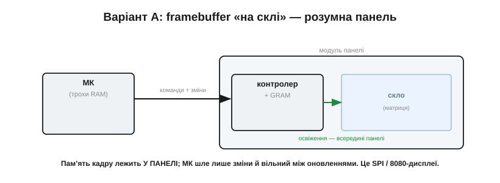
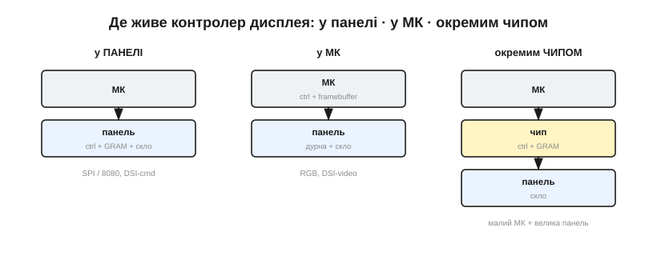
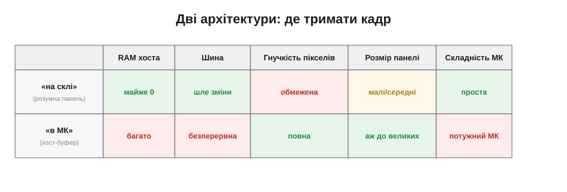

# Контролер дисплея: framebuffer «на склі» чи в МК

За кожним [під'єднанням панелі](book:electronics/panel-interfaces) раз у раз зринає одне слово — **памʼять кадру**. За ним ховається, мабуть, найважливіше архітектурне рішення всієї дисплейної підсистеми. Річ у тім, що будь-який живий екран потай робить **дві** окремі роботи. По-перше, він мусить десь **зберігати** поточне зображення — по одному значенню на кожен піксель; цю памʼять і звуть кадровим буфером (*framebuffer*). По-друге, він мусить **безперервно**, десятки разів на секунду, перечитувати цю памʼять і наново засвічувати нею скло — бо піксель сам собою картинку не тримає й швидко гасне. Питання теми — де живе той кадровий буфер і хто виконує освіження: усе це може взяти на себе **панель** («на склі») або **мікроконтролер**. І вибір розходиться відлунням по всьому виробу.

### Дві роботи, які хтось мусить робити

Почнімо з фізичної причини, чому освіження взагалі потрібне. Звичайний піксель — рідкокристалічна заслінка чи органічний світлодіод — утримує свій стан лише доти, доки на нього подано напругу; зніми її, і за частки секунди він повернеться у спокій. Тому матрицю доводиться **переписувати наново** рядок за рядком, знов і знов, зазвичай близько 60 разів на секунду. (Виняток — бістабільний [e-ink](book:electronics/display-classes), що тримає картинку без живлення; але він тут радше рідкісне щастя, ніж правило.) Ця невпинна робота й зветься **освіженням** (*refresh*).

Скільки разів на секунду? Та сама межа, що й для [мерехтіння панелі](book:electronics/panel-parameters): нижче ~50–60 разів око починає ловити блимання, тож типова частота освіження — 60 герц, інколи вище. І тут ховається тонка, але важлива різниця двох понять, які легко сплутати. **Освіження** (*refresh*) — це як часто двигун перечитує памʼять і перемальовує скло; воно йде безперервно, навіть якщо картинка завмерла намертво. А **оновлення** (*update*) — це коли ми, програма, **міняємо** щось у самій памʼяті кадру. Можна освіжати екран 60 разів на секунду, а оновлювати його раз на хвилину — або навпаки, ледь устигати з бурхливою анімацією. Розрізняти їх конче треба, бо за освіження відповідає двигун (панель чи периферія), а за оновлення — ваш код; і весь подальший поділ архітектур — це, по суті, про те, кому віддати перше, лишивши собі друге.


*Рис. Будь-який дисплей робить дві речі: тримає **памʼять кадру** («що має бути на екрані зараз») і має **двигун освіження**, що перечитує цю памʼять і ~60 разів на секунду засвічує нею скло, яке інакше все забуває. Питання архітектури — хто володіє цими роботами: панель чи мікроконтролер.*

Отже, маємо дві відмінні роботи: **зберігати** зображення (памʼять) і **гнати** його на скло без упину (двигун освіження). Хтось мусить узяти на себе обидві. І тут історія роздвоюється: або їх бере панель, перетворюючись на самодостатній «розумний» модуль, або їх бере мікроконтролер, а панель лишається пасивним склом. Розгляньмо обидва шляхи — вони визначають геть різні вироби.

### Варіант А: framebuffer «на склі» — розумна панель

Найпоширеніший у світі дрібних екранів шлях — перекласти **обидві** роботи на саму панель. Такий модуль несе на собі власну мікросхему-**контролер** із вбудованою памʼяттю кадру (*GRAM*, графічна RAM). Мікроконтролер лише надсилає контролерові команди й дані пікселів; той складає зображення у свою GRAM і далі **самотужки**, на власному такті, без жодної участі МК, безперервно освіжає скло.


*Рис. Framebuffer «на склі». Памʼять кадру і двигун освіження сховані в самому модулі панелі; мікроконтролер шле туди лише команди й зміни, а далі вільний. Так влаштовані типові SPI- та 8080-дисплеї (контролери класу ST7789/ILI9341) і DSI у командному режимі.*

Принада цього шляху — у тому, чого мікроконтролерові робити **не** треба. Йому майже не потрібна власна RAM під зображення: воно цілком лежить у панелі. Між оновленнями процесор геть вільний — надіслав зміну й може поринути в сон чи інші справи, бо освіження — не його клопіт. Для дрібного, ощадливого до памʼяті й енергії пристрою це ідеально. Платою є межі контролера: ви можете лише те, що дозволяє його набір команд; суцільний перемальунок обмежений (часто скромною) шиною; а розмір GRAM кладе стелю на роздільність панелі.

> 🔧 **Навіщо це.** Розумна панель — стандартний вибір, коли мікроконтролер дешевий і має кілька десятків кілобайтів RAM. Ви отримуєте робочий екран, не віддавши під нього ні памʼяті, ні безперервної роботи процесора. Для приладів на батареї це подвійно цінно: між рідкими оновленнями і МК, і шина просто сплять.

> 🔌 **Компонент.** Конкретику найпоширенішого класу таких панелей — контролери ST7789/ILI9341, їхнє підключення по SPI, швидкість і робота через DMA — винесено в компонентну вставку до цієї теми (`r01-s4-c-spi-tft.md`).

### Що дає контролер панелі: вікна, прокрутка, синхронізація

Контролер у панелі — не проста памʼять, а маленький помічник із корисними операціями, і головна з них — **вікно адрес** (*address window*). Замість лити пікселі підряд від кута екрана, МК спершу задає прямокутник (x0,y0)…(x1,y1), а тоді шле в нього пікселі — і оновлюється **лише цей прямокутник**. Це і є той трюк, що робить розумні панелі економними: перемальовуй не весь екран, а саму змінену ділянку.


*Рис. Часткове оновлення. МК задає контролерові прямокутне вікно в GRAM і ллє туди пікселі; решта кадру не чіпається. Замість гнати весь екран щоразу, по вузькій шині йде тільки те, що справді змінилося, — звідси й уся швидкодія дрібних дисплеїв.*

Як це виглядає в коді, варто побачити конкретно, бо воно на диво просте. Щоб оновити прямокутник, мікроконтролер шле панелі коротку послідовність команд: спершу «задати діапазон стовпців» (у контролерів цього класу це часто команда з кодом 0x2A) із межами x0…x1, потім «задати діапазон рядків» (0x2B) із y0…y1, а тоді команду «писати в памʼять» (0x2C) — і слідом ллє підряд кольори пікселів, які контролер сам розкладе по заданому вікні, рядок за рядком, аж доки воно не заповниться. Усього три команди й потік даних; жодної арифметики адрес на боці МК. Саме ця простота й зробила такі панелі улюбленцями навіть восьмибітних мікроконтролерів, де кожен зайвий такт на рахунку.

До вікна додаються й інші зручності. **Апаратна прокрутка** дає посунути показувану ділянку, не переписуючи пікселів, — задарма гортати списки чи текст. Сигнал **TE** (*tearing effect*) — окрема ніжка, якою контролер підказує мікроконтролерові: «зараз я між освіженнями, писати безпечно», щоб новий кадр не наклався на старий якраз посеред промальовування й картинка не «розірвалася». Сюди ж належить апаратний **поворот і дзеркалення**: одним регістром орієнтації панель можна змусити вважати «верхом» будь-який зі своїх боків і навіть поміняти порядок кольорових компонент (RGB ↔ BGR), тож той самий код малює однаково, хоч як фізично повернуто екран у корпусі. А режими зниженого споживання дають панелі дрімати, коли нічого не змінюється. Усі ці дрібні послуги й зробили контролери в панелі негласним стандартом світу невеликих екранів.

### Варіант Б: framebuffer у МК — дурна панель плюс периферія

Тепер переверньмо все навпаки. Памʼять кадру лежить у **власній RAM мікроконтролера**, а роль двигуна освіження бере на себе спеціальний апаратний блок усередині МК — **контролер дисплея** (*LTDC* та подібні). Він сам, [через DMA](book:programming/dma-controller), без упину вичитує кадровий буфер із памʼяті хоста й женеться ним у «дурну» RGB- чи DSI-панель, що пасивно засвічує те, що отримала.


*Рис. Framebuffer у МК. Кадр лежить у RAM хоста; вбудована периферія (LTDC) безперервно потоком віддає його дурній панелі без власної памʼяті. Натомість мікроконтролер дістає повний контроль над кожним пікселем — ціною великого шматка швидкої RAM і безупинної шини.*

Навіщо взагалі брати на себе цей клопіт? Заради **повного контролю**. Коли кадр — це твоя власна памʼять, ти малюєш у ній що завгодно й як завгодно швидко, накладаєш шари, змішуєш напівпрозорість (деякі периферії вміють це апаратно), тягнеш великі роздільності, яких розумна панель не подужала б. Ціна цьому пряма: треба віддати чималий кусень **швидкої** RAM під кадровий буфер — а для плавної мальовки бажано аж два кадри, — і часто це вже зовнішня мікросхема памʼяті; треба безперервна шина; і треба мікроконтролер, що взагалі **має** таку периферію. Це вже не «причепити екранчик», а спроєктувати дисплейну підсистему.

А чому бажано аж **два** кадрові буфери, а не один? Бо якщо малювати новий кадр прямо в ту саму памʼять, з якої периферія цієї ж миті годує панель, глядач побачить напівдомальоване — половина екрана нова, половина стара. Тому роблять [подвійну буферизацію](book:electronics/double-buffering): в один буфер периферія спокійно віддає готовий кадр на скло, а програма тим часом малює наступний у другий; коли той готовий — буфери міняють ролями. Звідси й та подвоєна вимога до памʼяті: гладка анімація на весь екран коштує не одного, а двох повних кадрів швидкої RAM — ось чому хост-буфер такий ненажерливий і так часто тягне за собою зовнішню [SDRAM](book:electronics/sdram-ddr).

> 🔧 **Навіщо це.** Хост-буфер бери, коли потрібні великий екран, плавна анімація на весь кадр чи складна графіка — і коли твій МК має і контролер дисплея, і досить RAM. Інакше задум розіб'ється об брак памʼяті або об нестачу [пропускної здатності шини](book:communications/bandwidth-capacity).

### Вбудований проти зовнішнього контролера

Тепер прямо про підзаголовок теми. **Вбудований контролер** (*embedded*) — це контролер усередині самого модуля панелі: рівно варіант А, де панель «розумна». **Зовнішній контролер** має два обличчя. Перше — це згадана периферія LTDC у самому мікроконтролері: вона зовнішня щодо панелі й гонить дурне скло (варіант Б). Друге, і найцікавіше, — **окрема мікросхема-контролер** на вашій платі (класу RA8875 чи SSD1963), що сидить між слабким МК і чималою панеллю.


*Рис. Той самий контролер можна поставити в трьох місцях. У ПАНЕЛІ (розумний модуль, SPI/8080) — МК майже не напружується. У МК (периферія LTDC) — повний контроль, та потужний хост. ОКРЕМИМ ЧИПОМ на вашій платі — золота середина: чип тримає GRAM і освіжає велику панель, а МК шле йому зміни простою шиною.*

Цей третій шлях — справжній порятунок у проміжних випадках. Окрема мікросхема несе власну GRAM і сама освіжає панель, тож навіть мікроконтролер **без** дисплейної периферії й із крихтою RAM може кермувати доволі великим екраном — він просто шле чипові зміни простою паралельною чи послідовною шиною, точно як розумній панелі. Фактично це пересаджує зручність варіанта А («памʼять — не моя турбота») на більший екран, поставивши контролер не в панель, а на власну плату.

> 🔧 **Навіщо це.** Якщо хочеться екран більший, ніж тягне розумна SPI-панель, але МК не має ні LTDC, ні мегабайтів RAM, — окремий контролер-чип часто дешевший і простіший за перехід на дорожчий мікроконтролер. Це проміжна сходинка, про яку варто памʼятати, перш ніж переписувати півпроєкту заради дисплея.

### Як рішення розходиться по всьому виробу

Найважливіше — усвідомити, що вибір місця для кадрового буфера **не локальний**: він тягне за собою сам мікроконтролер. Розумна панель — і вистачить дешевого МК на кілька десятків кілобайтів RAM із простою шиною. Хост-буфер — і потрібен МК із контролером дисплея та мегабайтами швидкої памʼяті, нерідко зовнішньої. Окремий чип — щось посередині. Те саме й із [пропускною здатністю](book:communications/bandwidth-capacity) шини: розумна панель просить лише **зміни**, а хост-буфер вимагає **безперервного** потоку повних кадрів.


*Рис. Кадр «на склі» проти кадру «в МК». Розумна панель майже не їсть RAM хоста й шле лише зміни, та обмежує гнучкість і розмір; хост-буфер дає повний контроль і великі екрани, але вимагає багато памʼяті, безперервної шини й потужного МК. Безкоштовного варіанта немає — є відповідний задачі.*

**Приклад (ціна кадру в RAM хоста).** Порахуймо, у що обходиться хост-буфер для панелі 480×272 при 16 бітах на піксель:

```
один кадр = 480 × 272 × 2 байти = 261 120 байт ≈ 255 КБ
подвійна буферизація (2 кадри)  ≈ 510 КБ
```

Для мікроконтролера з кількома десятками кілобайтів вбудованої RAM це неможливо — кадр просто нікуди покласти, потрібна зовнішня памʼять. А та сама панель із вбудованим контролером забрала б у хоста під зображення майже **нуль** байтів, бо кадр живе в її GRAM. Ось наочно, чому місце кадрового буфера визначає клас мікроконтролера, а не навпаки.

Проілюструймо це двома знайомими образами. Кишеньковий термометр із крихітним екранчиком, що показує число й оновлюється раз на секунду, візьме найдешевший мікроконтролер і розумну SPI-панель: кадр — у панелі, RAM хоста — лічені байти, споживання — мінімальне, плата — копійчана. А бортовий пульт із плавними стрілками приладів і анімованими переходами на семидюймовому екрані вимагатиме мікроконтролера з контролером дисплея й зовнішньою SDRAM під подвійний кадровий буфер, та ще й широкої RGB-шини на сорок ліній. Це той самий «дисплей» як поняття — і дві геть різні плати, два різні бюджети, дві різні складності монтажу, і вся ця прірва виростає з одного-єдиного рішення: де живе кадр.

Звідси й проста логіка вибору. Дрібний, дешевий, ощадливий до енергії прилад зі здебільшого статичною картинкою — кадр «на склі», розумна панель. Великий екран із плавною анімацією й рясною графікою на потужному МК — кадр «у МК», хост-буфер. Проміжний випадок або бажання повісити велику панель на слабкий МК — окремий контролер-чип. Памʼять кадру — це хребет усієї дисплейної архітектури: визначившись, де вона лежить, ви фактично окреслюєте і мікроконтролер, і шину, і половину собівартості.

Памʼять кадру визначає, *що* показує екран і хто за це платить памʼяттю та тактами. Але для пропускних панелей, як-от TFT-LCD, є ще одна фізична деталь, без якої жоден кадр не видно оком: **підсвітка**. Скло із заслінками саме світла не дає — його дає лампа позаду, і [керування нею](book:electronics/backlight-dimming) — окрема задача, де світлодіодом керують струмом, а не напругою.

---
