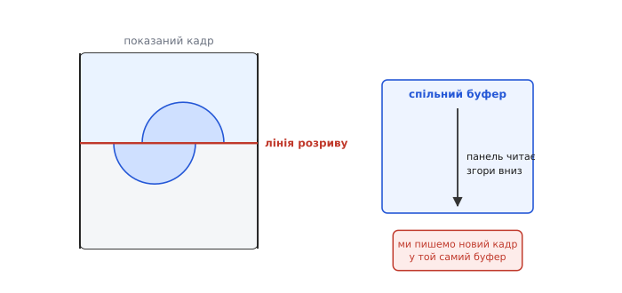
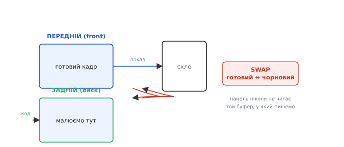
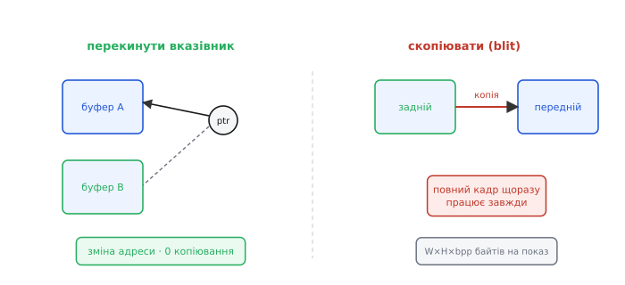
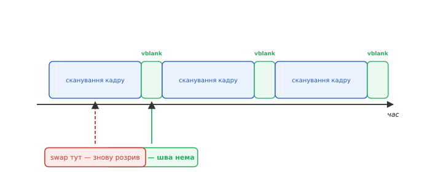
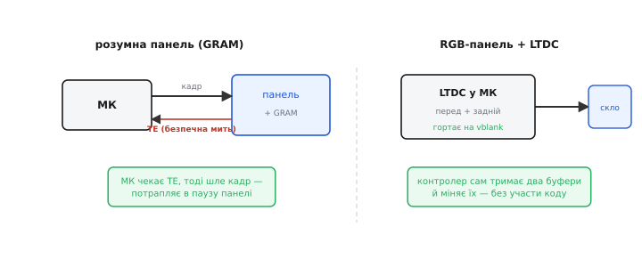
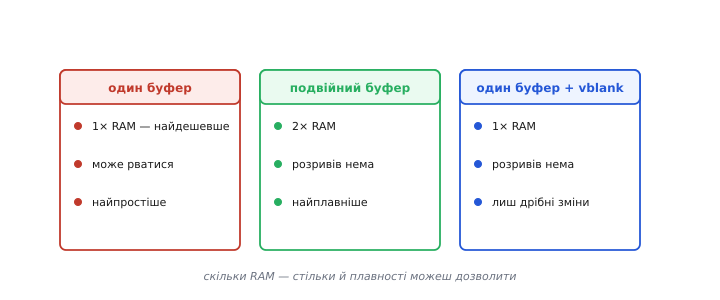

# Подвійна буферизація, tearing і vsync (чому картинка рветься)

Між «намалювати в пам'яті» й «показати глядачеві» ховається підступна пастка. [Панель безперервно читає](book:electronics/display-controller) кадровий буфер, щоб освіжати скло, — десятки разів на секунду. А ми в той самий час пишемо в нього новий кадр. Що, як наш запис застане читання на півдорозі? Глядач побачить **склеєний** кадр: верх новий, низ старий. Цей дефект зветься **розривом зображення** (*tearing*), і ця тема — про те, як його позбутися, показуючи кадри чисто. Від цього прямо залежить, чи буде анімація плавною, чи смикатиметься рваними клаптями.

### Чому картинка рветься: запис під час читання

Корінь біди — у тому, що малювання й показ ділять **одну** пам'ять. Ми пишемо кадровий буфер, панель його читає рядок за рядком згори вниз. Поки вона дочитала до середини екрана, ми встигли підмінити в буфері об'єкт — і нижня половина панелі візьме вже **новий** вміст, а верхня лишиться зі **старим**. На екрані з'являється горизонтальна **лінія розриву**, де об'єкт «розколовся» навпіл. Місце цієї лінії — там, де сканування панелі застало наш запис, тож вона «плаває» згори вниз від кадру до кадру, а на швидкому русі їх може бути й кілька водночас. Це й робить розрив таким помітним: не статичний дефект, а живе, мерехтливе тремтіння межі, що його око вловлює навіть краєм зору.


*Панель сканує буфер згори вниз. Якщо посеред цього сканування ми змінили вміст, показаний кадр виходить склеєним: над лінією розриву — новий стан, під нею — старий, і рухомий об'єкт ніби розривається. Один спільний буфер на малювання й показ робить такі розриви неминучими.*

Найпомітніший розрив на **русі**: коли об'єкт швидко їде екраном, його «зламана» навпіл копія кидається в очі щокадру. Статичні ж оновлення (змінилася цифра, блимнув значок) рвуться рідко — там просто нема чому розколюватися. Але для будь-якої плавної анімації розрив — справжня напасть, і її треба лікувати.

Варто зрозуміти, чому ця колізія взагалі виникає. Панель освіжається у своєму, **незалежному** ритмі — близько шістдесяти разів на секунду, не питаючи нашого коду. А ми малюємо, коли нам треба: у відповідь на дотик, на нові дані, на крок анімації. Два незалежні ритми рано чи пізно перетнуться — наш запис припаде на чиєсь читання. Якби малювання й освіження йшли в ногу, розриву б не було; але змусити їх іти в ногу — це і є та синхронізація, заради якої затіяна вся тема.

### Подвійна буферизація: малюй у тіньовий, показуй готовий

Класичні ліки — **подвійна буферизація** (*double buffering*). Замість одного буфера тримають **два**. В один, **передній** (*front*), панель дивиться — його показують. У другий, **задній** (*back*), малюють новий кадр, поки глядач його не бачить. Коли задній кадр готовий **повністю**, буфери **міняють місцями** (*swap*): тепер показується свіжонамальований, а малюють уже в той, що звільнився.

Цей обмін ще звуть **гортанням сторінок** (*page flipping*) — за аналогією з книжкою, де показують лише одну сторінку, перегортаючи на готову. Назва прижилася ще з часів ігрових приставок, де подвійна буферизація й стала стандартним прийомом плавної анімації. Принцип незмінний відтоді: дві «сторінки», одна на показ, одна на малювання, і миттєве перегортання між ними.


*Глядач завжди бачить лише **завершений** кадр із переднього буфера; усе чорнове малювання йде в заднім, схованому. Готовий — поміняли буфери ролями. Розриватися нема чому, бо панель ніколи не читає той буфер, у який ми пишемо.*

Розрив зникає в корені: панель **ніколи** не читає той буфер, у який ми зараз пишемо, тож не може спіймати півнамальований кадр. Платня очевидна — **вдвічі більше** пам'яті, два повні [кадрові буфери](book:electronics/framebuffer) замість одного. Саме ця ціна часто й вирішує, по кишені вам подвійна буферизація чи ні.

Прийом «малюй у тінь, показуй чисте» — наскрізний у графіці й поза нею. Той самий принцип ховається за подвійним буфером у будь-якій анімації, за [«пінг-понгом» двох буферів у потоковій передачі даних](book:programming/double-buffering) (де другий буфер наповнює [DMA](book:programming/dma-controller), поки код обробляє перший), за чернеткою, яку показують лише дописаною. Тут ми тримаємо кут екрана — як розрив народжується зі сканування панелі; загальний бік прийому (буфери в RAM, потоки, обмін під DMA) розібрано окремо. Скрізь ідея одна: **ніколи не показуй незавершене**. Глядачеві (чи споживачеві даних) віддають лише цілісний результат, а вся метушня правок ховається в тіньовій копії.

> 🔧 **Навіщо це.** Подвійна буферизація — стандарт плавної анімації, але закладайте її в бюджет пам'яті заздалегідь: вона **подвоює** найбільшу статтю — кадровий буфер. Для дрібного МК це нерідко неможливо, і тоді плавність бережуть інакше — записом у паузу одним буфером або оновленням лише змінених ділянок. Перш ніж обіцяти гладку анімацію, перевірте, чи влізуть два кадри в RAM.

### Обмін: перекинути вказівник чи скопіювати

Сам **обмін** буферів роблять двома способами, і вони різняться ціною. Перший — **перекинути вказівник**: якщо контролер дисплея вміє читати то з одного, то з іншого буфера, обмін — це лише зміна того, на яку адресу він дивиться. Миттєво, без жодного копіювання. Другий — **скопіювати**: блітнути весь задній буфер у передній. Працює завжди, навіть із панеллю, що має лише один буфер, але коштує повної копії кадру на кожен показ.


*Ліворуч — обмін вказівником: панель просто починає читати інший буфер, нуль копіювання (потрібна підтримка контролера). Праворуч — копія: задній буфер блітять у передній; просто й універсально, та витрачає копію щокадру.*

Перекидання вказівника — ідеал, але вимагає, щоб контролер умів гортати буфери; це вміють, скажімо, вбудовані дисплейні периферії. Копіювання — запасний шлях для «розумних» панелей із власною GRAM, куди новий кадр щоразу заливають заново. Який спосіб доступний — залежить від архітектури [контролера дисплея](book:electronics/display-controller).

Зверніть увагу, наскільки кращий перший спосіб. Перекидання вказівника — це **нуль** роботи: жодного байта не переписано, обмін стається за один такт. Копіювання ж щокадру переганяє весь кадр з місця на місце — на 750-кілобайтному екрані це сотні тисяч байтів шістдесят разів на секунду, відчутне навантаження на шину пам'яті. Тому архітектуру, де контролер уміє гортати буфери сам, цінують недарма: вона робить плавність майже безкоштовною за процесорним часом. Копіювання ж лишають на той випадок, коли іншого вибору немає, — і навіть тоді його перекладають на апаратний блок переносу пам'яті ([DMA](book:programming/dma-controller) чи 2D-блітер), щоб не вантажити процесор перегоном байтів.

### Vsync: міняти буфери в потрібну мить

Та й сам обмін не можна робити будь-коли. Якщо перемкнути буфери **посеред** того, як панель сканує кадр, розрив однаково вискочить — тільки тепер у місці перемикання. Обмін мусить статися у **щілині між кадрами** — короткій паузі, коли панель уже дочитала один кадр і ще не почала наступний. Цю паузу звуть **вертикальним гасінням** (*vertical blanking*), а синхронізацію обміну з нею — **вертикальною синхронізацією** (*vsync*).


*Освіження йде циклами: сканування кадру, коротка пауза (vblank), знову сканування. Перемкнути буфери саме в паузі — і шва не буде; зробити це посеред сканування — знову дістати розрив, лише в іншому місці.*

Звідки знати, коли настала пауза? Панель сама про це **сигналить**. У RGB-панелей є сигнал VSYNC; у «розумних» — ніжка **TE** (*tearing effect*) [контролера дисплея](book:electronics/display-controller), що каже «зараз я між освіженнями, писати безпечно». Прив'язавши обмін чи запис до цього сигналу, ви потрапляєте точно в щілину — і розрив зникає.

З vsync пов'язана й сама **частота кадрів**. Якщо ваша анімація встигає малювати рівно стільки кадрів, скільки панель освіжає (скажімо, 60 на секунду), усе гладко. Малюєте повільніше — панель просто кілька разів покаже той самий кадр (рух смикнеться, але без розриву). Малюєте швидше за освіження — зайві кадри марні, їх однаково ніхто не побачить, тож розумно й не малювати більше, ніж панель здатна показати. Прив'язка до vsync заразом і вирівнює темп анімації під реальний ритм екрана, аби код не молотив кадри даремно.

### Розумні панелі та LTDC: хто синхронізує

На практиці синхронізація лягає по-різному залежно від того, [де живе кадровий буфер](book:electronics/display-controller). Для **розумної** панелі з власною GRAM мікроконтролер **чекає сигналу TE** й лише тоді шле новий кадр — так запис потрапляє в безпечну паузу. Для **дурної** RGB-панелі справу бере на себе вбудований контролер дисплея (**LTDC**): він сам тримає передній і задній буфери й сам гортає їх на vsync, без участи коду — програма лише малює в задній і каже «готово».


*Зліва: розумна панель дає ніжку TE — момент, коли писати безпечно, і МК під неї підлаштовує відправлення кадру. Справа: вбудований LTDC сам тримає два буфери й міняє їх у vblank, тож подвійна буферизація з vsync дістається майже задарма.*

Звідси й практичний висновок: мати на борту контролер дисплея з апаратною подвійною буферизацією — велике полегшення, бо вся ця морока з vsync робиться сама. Без нього доводиться вручну ловити TE й самотужки слідкувати, щоб не написати в кадр, який зараз показують.

**Приклад (обмін у VBLANK на LTDC).** Тримаємо два кадрові буфери в RAM і міняємо їх перекиданням адреси. LTDC має тіньові регістри: запис нової адреси набирає чинності не миттєво, а коли контролер сам перезавантажить їх — і він робить це у вертикальному гасінні. Тож код лише вказує наступний буфер і просить перезавантаження «на vblank»; обмін стається без шва, без копіювання, без участи процесора:

```c
static uint16_t fb[2][480][800];   // два кадри, 16 біт/піксель — у SDRAM
static volatile int back = 1;      // у який зараз малюємо

void swap_buffers(void) {
    int front = back;              // готовий кадр стане переднім
    back ^= 1;                     // малюватимемо в інший

    // нова адреса показу — у тіньовий регістр шару 0
    LTDC_Layer1->CFBAR = (uint32_t)&fb[front][0][0];
    // перезавантажити тіньові регістри САМЕ у вертикальному гасінні
    LTDC->SRCR = LTDC_SRCR_VBR;    // vertical blanking reload
}
```

Жодного байта кадру не переписано — лише змінилася адреса, з якої LTDC читає скло. Біт `VBR` каже «застосуй це у vblank», тож новий буфер з'являється чисто, у щілині між кадрами. Прапорець `back` одразу віддає коду той буфер, що звільнився, — і наступний кадр уже малюється в тінь.

Є й тонкий проміжний прийом для розумних панелей з одним буфером — «гнатися за променем». Якщо писати в GRAM трохи **позаду** того місця, яке панель саме зчитує, оновлення завжди лишається в уже показаній частині кадру й розриву не дає. Це вимагає точно знати, де зараз «промінь» (та сама TE плюс відлік часу), і тому крихке; але там, де другого буфера нема, а оновити треба весь екран, цей трюк інколи єдиний вихід. Це наочний приклад того, що проти розривів воюють не лише пам'яттю, а й точним відчуттям часу.

### Коли подвійний буфер не по кишені

А якщо двох кадрів у пам'яті нема? Тоді бережуть картинку інакше. Можна лишитися з **одним** буфером, але писати в нього **лише в паузі** vblank — встиг намалювати зміни в щілину, поки панель не сканує, і розриву не буде. Біда в тому, що щілина коротка, і весь екран у неї перемалювати не встигнеш — цей шлях годиться лише для малих змін.


*Три стратегії поруч. Один буфер — найдешевший по пам'яті, та може рватися. Подвійний — без розривів і найплавніший, але коштує вдвічі більше RAM. Один буфер із записом у vblank — компроміс: пам'яті як за один, розриву нема, проте треба встигнути намалювати зміни в коротку паузу.*

Існує й проміжний варіант для тих, кому й подвійного буфера замало, — **потрійна** буферизація, що згладжує ще й нерівний темп малювання, але коштує вже трьох кадрів пам'яті й у дрібному embedded майже не трапляється. Здебільшого ж вибір зводиться до тих трьох рядків таблиці: скільки в тебе RAM — стільки й плавности можеш собі дозволити.

**Приклад (ціна подвійного буфера).** Порахуймо для панелі 800×480 при 16 бітах на піксель:

```
один кадр  = 800 × 480 × 2 байти ≈ 750 КБ
два кадри (подвійна буферизація)  ≈ 1.5 МБ
```

Півтора мегабайта швидкої RAM — це далеко за межами більшости мікроконтролерів; ось чому на великих екранах подвійну буферизацію тягне лише МК із зовнішньою SDRAM. Звідси й найпоширеніший вихід для скромного заліза: оновлювати не весь кадр, а **тільки те, що змінилося** — тоді й переписувати треба мало, і розрив виходить таким дрібним та коротким, що око його не ловить. Цей прийом «не чіпай незмінного» — окрема велика тема: як відстежити, що саме на екрані змінилося, і перемалювати лише ці клаптики.

> 🔧 **Навіщо це.** Подвійна буферизація — не єдиний шлях до плавности, а найдорожчий по пам'яті. Якщо двох кадрів не вмістити, питайте: чи можу я оновлювати лише змінені ділянки? чи встигаю записати їх у паузу vblank? Часто чистої картинки досягають не подвоєнням пам'яті, а тим, що чіпають екран **мало й вчасно**.

### Підсумок: показати кадр чисто

Звівши все докупи: розрив виникає, бо ми пишемо кадр, поки панель його читає; лікують це тим, що **малюють в окремий буфер** і міняють його на показуваний **у паузі між кадрами** (vsync), а сигналом про паузу служить VSYNC чи TE. Хто має апаратну подвійну буферизацію (LTDC) — дістає це майже задарма; хто ні — або платить пам'яттю за два буфери, або синхронізує дрібні оновлення вручну. І завжди в основі той самий ресурс, що визначає весь устрій графіки на МК, — [пам'ять](book:electronics/framebuffer): чистий показ коштує або зайвого буфера, або дисципліни оновлювати ощадливо.

Тому, проєктуючи плавний інтерфейс, рішення про буфери ухвалюйте **рано** — разом із вибором мікроконтролера й панелі. Апаратна подвійна буферизація на борту контролера змінює все: вона перетворює боротьбу з розривами з ручної мороки на дрібницю, що вирішується сама. А дізнатися про брак пам'яті під другий буфер, коли інтерфейс уже написаний, — болюче й до прикрости типове розчарування.
