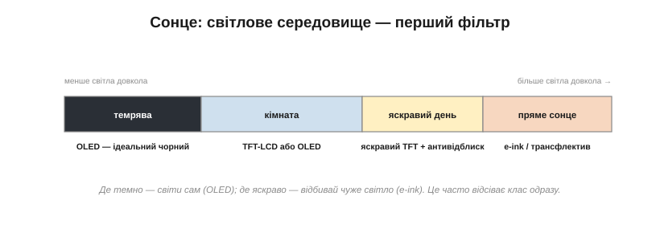

# Вибір дисплея під виріб: сонце, енергія, вартість, кабель

Класи екранів, їхня фізика, інтерфейси, контролери, підсвітка й дотик — усе це зрештою впирається в найпрактичніше питання: над конкретним виробом доведеться **вибрати один**. І тут немає «найкращого дисплея» — є лише дисплей, що пасує **цьому** виробу. Гірше того: критерії вибору **воюють** між собою. Екран, читабельний на сонці, жере енергію; дешева панель тягне за собою дорогий мікроконтролер; розкішний дисплей не лізе в розʼєм чи в корпус. А найпідступніше — дисплей часто **домінує** над усім проєктом: вибрав його погано — і він потягне за собою весь виріб. Тому вибрати правильно й **рано**, виходячи зі сценарію, — одне з найважливіших рішень у всій розробці.

### Почни з того, ЯК і ДЕ ним користуватимуться

Найпоширеніша помилка — починати з вітрини дисплеїв і захоплюватися гарними. Правильно — починати зі **сценарію**: хто й де дивитиметься на екран, що саме він показує, як часто це міняється, скільки виріб має жити від заряду, за яку ціну й у якому корпусі. Відповіді на ці питання — не побажання, а **тверді обмеження**, що викидають більшість варіантів ще до того, як ви почнете порівнювати тонкощі.

*Рис. Правильний напрям вибору — згори вниз. Сценарій породжує тверді обмеження (світло, енергія, вартість, кабель, розмір, дотик); обмеження відсівають більшість технологій; і лише серед того, що лишилось, порівнюють деталі. Хто йде знизу — від уподобаної панелі — раз у раз упирається в те, що вона не лізе в його ж обмеження.*

Зверніть увагу на одне питання зі сценарію, що криється за всіма іншими, — **що саме** екран показує. Кілька великих цифр, що зрідка міняються, — це геть інша задача, ніж жива анімація чи мапа, яку гортають пальцем. Перше прощає повільність і просить ощадливости; друге вимагає швидкости, плавности й мультитачу. Тип вмісту — прихована вісь, що тихо тягне за собою і клас екрана, і його роздільність, і дотик, і навіть мікроконтролер. Тому, відповідаючи на питання сценарію, найперше чесно опишіть, **яку картинку** виріб показуватиме насправді, а не яку хотілося б.

Ці обмеження зручно згрупувати в чотири, винесені в назву теми: **сонце** (світлове середовище), **енергія** (бюджет живлення), **вартість** і **кабель** (фізична та електрична інтеграція). Пройдімо їх по черзі — кожне саме по собі здатне вирішити вибір.

### Сонце: світлове середовище вирішує клас

Перший і найжорсткіший фільтр — **де** на екран дивитимуться, бо світло довкола одразу відсіває цілі класи. Логіка випливає прямо з [фізики пікселя різних класів](book:electronics/display-classes): там, де темно, виграє той, хто світить сам; там, де яскраво, — той, хто відбиває.

*Рис. Від темряви до прямого сонця. У темряві блищить OLED зі своїм ідеальним чорним; у кімнаті добрий і TFT-LCD, і OLED; на яскравому дні потрібен дуже яскравий TFT з антивідблиском; а під прямим сонцем по-справжньому читається лише відбивний e-ink (чи трансфлектив). Світло довкола нерідко вирішує клас одразу.*

Прилад, що працює надворі під сонцем, майже напевно тягне до e-ink або трансфлективної панелі: навіть тисяча нітів [підсвітки](book:electronics/backlight-dimming) тоне в полудневому світлі, та й батареї на таку яскравість не напасешся. Прилад для темної кімнати виграє від OLED. А універсальний кімнатний — від звичайного TFT-LCD. Часто вже на цьому кроці список кандидатів коротшає до одного-двох.

До яскравости тут додаються дві речі, про які забувають. Перша — **відблиск**: глянцева поверхня під сонцем перетворюється на дзеркало, тож для вулиці важить не лише кількість нітів, а й антивідблискове покриття. Друга — **хто й під яким кутом** дивиться: якщо на прилад зиркають кілька людей збоку чи зверху (приладова панель, термінал), важать [кути огляду](book:electronics/panel-parameters), і тут беруть IPS, а не дешевий TN. Світло довкола й геометрія погляду разом і складають реальну читаність, якої не видно з рядка «350 кд/м²» у даташиті.

> 🔧 **Навіщо це.** Перевіряйте дисплей **у тих умовах, де він житиме**, а не на столі в офісі. Гарна на демонстрації панель може бути сліпою плямою на сонці — і навпаки. Світлове середовище — не та річ, яку можна «доналаштувати потім»: воно диктує сам клас екрана.

### Енергія: бюджет живлення відсіває половину

Другий фільтр — **звідки живлення**. Тут вирішують дві осі: батарея чи мережа, і статичний вміст чи динамічний.

*Рис. Найжорсткіший кут — батарея плюс статичний вміст: тут e-ink поза конкуренцією, бо в спокої не їсть нічого. Батарея плюс динаміка тягне до OLED із темним інтерфейсом (світло лише там, де треба). А мережа знімає питання енергії взагалі — бери що зручно за іншими критеріями.*

Споживання [різних класів екранів](book:electronics/display-classes) розходиться кардинально: підсвітка TFT горить завжди, OLED світить пропорційно вмісту, а e-ink між оновленнями лежить на нулі — різниця в сотні разів. Тож для приладу на батареї, що показує рідко змінювану інформацію, e-ink дає тижні й місяці автономності, недосяжні для інших. Для батарейного приладу з анімацією розумний вибір — OLED і темний інтерфейс. А якщо виріб живиться від мережі, енергія перестає тиснути, і вибір повертається до інших критеріїв.

Тонкість, яку легко проґавити: важить не лише, **який** екран, а й як часто він активний. Прилад, що прокидається на секунду раз на хвилину, а решту часу спить, поводиться зовсім інакше за той, що світить безперервно, — і тут e-ink з його нульовим спокоєм або OLED, що гасне між показами, дають величезну перевагу над TFT, чия підсвітка не вміє по-справжньому замовкнути. Тому перш ніж рахувати яскравість, прикиньте **робочий цикл** дисплея — яку частку часу він реально світить: саме вона, а не пікова яскравість, визначить, скільки протягне батарея.

> 🔧 **Навіщо це.** Порахуйте енергетичний бюджет дисплея **до** того, як обрали панель: часто саме екран, а не процесор, зʼїдає більшість струму, і саме він визначає розмір батареї. Вибрати яскравий TFT у батарейний прилад — це непомітно вписати в специфікацію або товсту батарею, або короткий час роботи.

### Вартість: ціна не лише в самій панелі

Третій фільтр — **гроші**, і тут чигає найтонша пастка. Дивлячись на ціну панелі в каталозі, легко забути, що сама панель — лише вершина айсберга витрат.

*Рис. «Видима ціна» — це лише панель. «Справжня ціна» тягне за собою контролер, драйвер підсвітки, контролер дотику, розʼєм зі шлейфом — і, що найдорожче, часто диктує потужніший мікроконтролер (заради кадрового буфера) та більшу батарею. Рахувати треба весь стос.*

До панелі чіпляється цілий шлейф супутніх вузлів: великій RGB-панелі потрібен хост із [контролером дисплея](book:electronics/display-controller) й мегабайтами RAM; підсвітці — [boost-драйвер](book:electronics/backlight-dimming); [ємнісному дотику](book:electronics/touch-tech) — окремий контролер; усьому цьому — розʼєм і шлейф. **Справжня** вартість дисплея у виробі — це сума всього стосу, а не цифра з прайса. До того ж ціни різко падають з обсягом: панель, дешева на десяти тисячах, може бути золотою на десятьох. І не забувайте про захисне скло, склеювання, складання.

А якщо панель кастомна — під ваш розмір, форму чи логотип на склі, — додаються ще дві статті, що вбивають дрібні серії: **NRE** (одноразова плата за розробку й оснастку) і **MOQ** (мінімальна партія, яку фабрика взагалі візьметься робити). Для виробу тиражем у сотні штук власна панель часто просто недосяжна за грошима, і доводиться вписувати проєкт у те, що вже випускають серійно. Тому стандартну панель з каталогу беруть не від бідности, а від тверезости: вона дешевша, доступніша й перевірена тисячами інших виробів.

> 🔧 **Навіщо це.** Рахуючи собівартість, беріть дисплей **разом з усім, що він тягне**: контролером, драйверами, розʼємом, а головне — з тим МК і батареєю, які він змушує поставити. Дешева на вигляд панель, що вимагає вдвічі дорожчого мікроконтролера, — насправді найдорожча.

### Кабель: інтерфейс, розʼєм і механіка

Четвертий фільтр найприземленіший, і про нього забувають найчастіше — **як панель фізично під'єднати й закріпити**. Електрично це той самий [вибір інтерфейсу](book:electronics/panel-interfaces): число контактів прямо випливає з того, SPI це, паралель чи RGB. А механічно — це гнучкий шлейф (*FPC*), розʼєм на платі, кріплення, рамка й ущільнення.

*Рис. Дисплей під'єднується гнучким шлейфом (FPC) у розʼєм на платі; число контактів видає тип інтерфейсу. Слабкі місця інтеграції цілком приземлені: розʼєм FPC — часта точка відмови й морока на складанні; кріплення, рамка й ущільнення; товщина всього стосу зі склом і сенсором дотику.*

Дрібний з вигляду розʼєм FPC — насправді одна з найчастіших точок відмови й головний біль складання: його легко недотиснути, він ламається від вібрації, його контакти окислюються. А число контактів намертво звʼязане з інтерфейсом: вибрав RGB заради великого екрана — готуйся розводити сорок ліній і ставити відповідний розʼєм. Сюди ж — товщина стосу (панель + дотик + скло), що мусить улізти в корпус, і ущільнення, якщо виріб мокне.

І ще дві приземлені речі. По-перше, **склеювання**: сенсор дотику, скло й панель часто зʼєднують оптично прозорим клеєм (*OCA*), щоб між ними не лишалося повітряного прошарку з відблисками й конденсатом, — а це окрема технологія й окрема стаття вартости. По-друге, тип самого розʼєму: шлейфи бувають різні (скажімо, із защіпкою ZIF), і дешевий, невдало вибраний розʼєм підведе на складанні чи у вібрації не гірше за погану панель. Не кажучи вже про те, що довгий шлейф зі швидким паралельним інтерфейсом ще й випромінює завади, з якими доведеться рахуватися.

> 🔧 **Навіщо це.** Дивіться на даташит розʼєму й шлейфу так само уважно, як на саму панель. Скільки контактів, який крок, чи витримає розʼєм вібрацію й цикли складання — це впливає на надійність виробу не менше, ніж параметри екрана. Багато польових відмов дисплеїв — це не панель, а саме її розʼєм.

### Доступність і життєвий цикл — теж критерій

Є й пʼятий критерій, невидимий у лабораторії, та болючий у серії: **чи буде ця панель доступна тоді, коли вам треба, і весь час, поки живе виріб**. Дисплеї сумнозвісно швидко знімають з виробництва, у них довгі терміни постачання, а замінити панель іншою майже неможливо — кожна напівунікальна за розміром, інтерфейсом і розʼємом. Виріб нерідко переживає свій дисплей, і це треба передбачити заздалегідь. Практично це означає: при інших рівних обирайте панель, у якої є **друге джерело** або сумісні замінники з тим самим розміром і розпіновкою, — щоб зняття її з виробництва не зупинило весь ваш конвеєр. Унікальна панель без заміни — прихована міна під довговічністю продукту. Планування постачання й керування життєвим циклом — окрема велика тема, та для самого вибору дисплея досить запамʼятати головне: доступність — такий самий критерій, як яскравість чи ціна, тільки про нього згадують надто пізно.

### Як це зводять докупи: метод і приклад

Складімо все докупи. Вибір — це не пошук «найкращого», а зважування кандидатів за всіма критеріями під ваги **вашого** сценарію. Найкраще це показати на двох виробах, де той самий метод дає протилежні відповіді.

*Рис. Зліва — польовий лічильник: вулиця й сонце, роки від батареї, число раз на хвилину, кнопки, дешево — усе вказує на **e-ink**. Справа — кухонний прилад: кімната, мережа, анімація й жести, мультитач — це **TFT-LCD з ємнісним дотиком**. Жодна відповідь не «правильніша»; кожна випливає зі свого сценарію.*

**Приклад (два вироби — два рішення).** Пройдімо метод швидко. Польовий лічильник води: середовище — вулиця під сонцем (→ відбивний), живлення — батарея на роки (→ нульове споживання в спокої), вміст — число раз на хвилину (→ повільність не страшна), ввід — кнопки (дотик не потрібен), ціна — низька. Усі стрілки сходяться на **e-ink**, і це рішення майже безальтернативне. Кухонний таймер-комбайн: середовище — освітлена кухня, живлення — від мережі (енергія не тисне), вміст — плавні анімації й жести (→ швидкий екран і мультитач), ціна — середня. Тут природний вибір — **TFT-LCD з ємнісним дотиком**. Той самий перелік питань — протилежні висновки, бо різні сценарії.

Формалізувати це можна простою **матрицею рішень**: випишіть критерії, дайте кожному вагу за важливістю для вашого виробу, оцініть кандидатів — і зважена сума підкаже фаворита, а заразом убереже від спокуси вибрати «бо гарне». І стережіться трьох класичних пасток. Перша — обрати дисплей **останнім**, коли плата вже розведена, а корпус відлитий, і втиснути його силоміць. Друга — обрати за **демонстрацією** в офісі, а не за реальним середовищем, і дістати сліпий екран на сонці. Третя — забути про **розʼєм і кабель**, згадавши про них аж на складанні. Кожна з цих пасток коштує дорогих переробок, і кожної легко уникнути, якщо йти згори — від сценарію.

Наостанок — головна засторога цього розділу. Дисплей рідко буває «просто екраном»: він формує і мікроконтролер (через кадровий буфер та інтерфейс), і живлення (через підсвітку), і корпус (через розмір, шлейф і кріплення). Тому обирайте його **рано** й виходьте зі сценарію, а не з краси на вітрині. Помилитися тут — означає переробляти пів виробу, коли плата вже розведена, а корпус відлитий.

Варто памʼятати й те, що дисплей як **компонент** — фізична деталь, яку обирають і під'єднують, — це лише половина справи. Обрана й під'єднана панель — це ще порожнє скло; щоб на ньому зʼявилося зображення, його треба **намалювати**, а вся машинерія малювання пікселів — від [кадрового буфера](book:electronics/framebuffer) до примітивів і шрифтів — це вже окрема, програмна сторона роботи з екраном.
