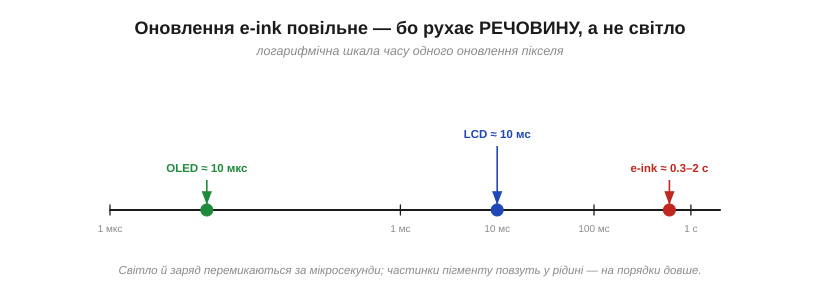
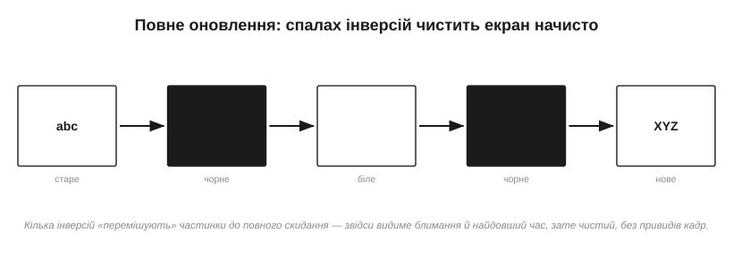
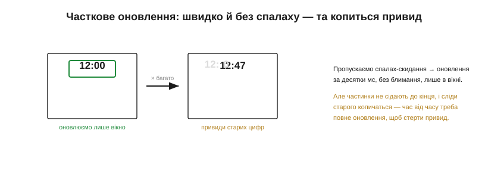
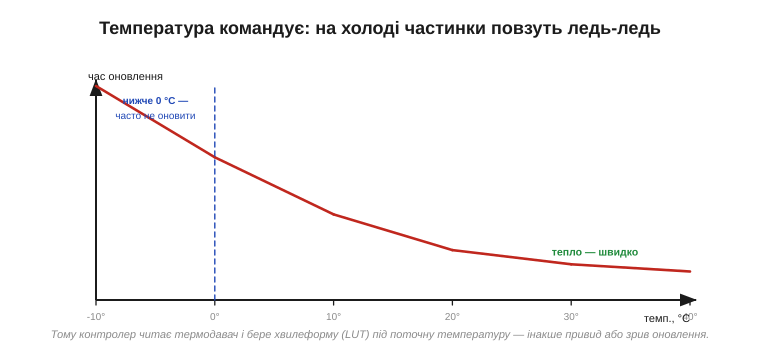

# E-ink особливо: часткове оновлення, ghosting, температура

E-ink стоїть серед [класів дисплеїв](book:electronics/display-classes) білою вороною: відбивний, бістабільний, паперовий на вигляд. Та бістабільність — головний його дар: картинка тримається роками без краплі енергії. Але цей дар має тіньовий бік, і не один. Усі особливості e-ink, через які з ним мороки більше, ніж із будь-яким іншим екраном, виростають з одного простого факту: він перемикає піксель, **фізично переганяючи крихітні частинки крізь грузлу рідину**. А рух речовини — повільний, і в нього є память. Звідси все: і черепашача швидкість оновлення, і видиме блимання, і примарні сліди старого зображення, і дивовижна залежність від температури. Розберімо ці клопоти по черзі — бо саме з ними доведеться мати справу, ставлячи e-ink у виріб.

### Чому e-ink не такий, як усі: рух частинок займає час

В основі e-ink — простий [електрофоретичний механізм](book:electronics/display-classes): у мікрокапсулах плавають заряджені білі й чорні частинки пігменту, а електричне поле жене їх до того чи іншого боку. Тепер порівняймо це з рештою екранів. У рідкому кристалі молекула повертається полем за мілісекунди; у світлодіоді електрон і дірка дають фотон за мікросекунди. А в e-ink **тверда частинка** мусить проплисти крізь вʼязку рідину з одного краю капсули на інший — і це на порядки повільніше.

І ось що тут глибоко: повільність e-ink — не вада, яку колись «виправлять», а зворотний бік самої бістабільности. Те, що тримає картинку без енергії, — це інертність частинок, їхнє небажання рухатися; а небажання рухатися — це і є повільність. Швидкий екран мусив би безперервно витрачати енергію на утримання стану (як LCD з його вічним освіженням), повільний — ні. Тому, обираючи e-ink, ви свідомо міняєте швидкість на ту феноменальну ощадливість, якою [славиться цей клас](book:electronics/display-classes): пристрій місяцями живе від батарейки саме тому, що екран **лінивий**. Одне нерозривно випливає з іншого.

*Рис. Час одного оновлення пікселя на логарифмічній шкалі. OLED перемикається за мікросекунди, LCD — за мілісекунди, а e-ink — за частки секунди й до кількох секунд. Різниця в тисячі разів, і причина проста: світло й заряд перемикаються миттєво, а частинки пігменту повзуть.*

Та повільність — не єдина дивина. Щоб перегнати частинки чисто й до кінця, мало просто «подати напругу» — потрібна ціла **послідовність** імпульсів, розкладена в часі. Саме ця послідовність і робить керування e-ink геть несхожим на решту.

### Хвилеформи: послідовність імпульсів, а не одне «увімкнути»

Щоб перевести піксель з одного стану в інший, e-ink-драйвер «програє» **хвилеформу** (*waveform*) — задану послідовність імпульсів напруги в часі. Чому не один імпульс? Бо частинки треба не лише зрушити, а й **дочиста** перегнати на місце, не лишивши на півдорозі, та ще й, якщо потрібні градації сірого, зупинити рівно там, де треба, — а це досягається точним дозуванням поштовхів туди-сюди.

*Рис. Хвилеформа одного переходу. Драйвер подає на піксель серію імпульсів то +15 В, то −15 В, переганяючи частинки в потрібний стан, і наприкінці повертає 0 В — далі піксель тримається сам. Саме така послідовність, а не одне ввімкнення, і коштує тих часток секунди.*

Ці хвилеформи не вигадуються на ходу — вони зберігаються в **таблицях пошуку** (*look-up tables*, LUT): для кожного переходу (зі старого відтінку в новий), а ще й для кожної температури — своя готова послідовність. Контролер бере з таблиці потрібну й відтворює її. Зверніть увагу й на напругу: щоб зрушити частинки, потрібні відносно високі **±15 В** — куди більше за логічні рівні, тож e-ink завжди тягне за собою високовольтну обвʼязку. А коли хвилеформа відіграла, напруга падає до нуля, і бістабільність робить свою справу — картинка застигає.

Дві тонкощі хвилеформ варто знати наперед. Перша: **градації сірого** коштують довших і складніших послідовностей — щоб зупинити частинки на півдорозі, у проміжному відтінку, треба тонше дозувати поштовхи, ніж для чистого чорного чи білого. Тому багатоградаційний e-ink оновлюється помітно довше за чорно-білий. Друга, прихована, але важлива: хвилеформи роблять **збалансованими за зарядом** (*DC-balanced*) — сумарний поштовх в один бік за повний цикл мусить дорівнювати поштовхові в інший. Інакше в рідині накопичується постійне зміщення, що з часом псує капсули. Ось чому в хвилеформі стільки симетричних коливань туди-сюди, а не один прямий поштовх: половина з них — не задля картинки, а задля довговічности.

### Повне оновлення: спалах, що чистить начисто

Найчистіший спосіб показати новий кадр — **повне оновлення** (*full refresh*). Контролер не просто малює нове поверх старого, а спершу проганяє весь екран через скидання: кілька разів інвертує його повністю — чорне, біле, чорне, біле, — «перемішуючи» частинки до повної однорідности, і лише тоді виставляє нове зображення.

*Рис. Повне оновлення. Кілька інверсій усього екрана скидають частинки в чистий стан — звідси те характерне блимання читалки при гортанні сторінки. Воно найдовше, зате лишає кадр без жодних слідів попереднього.*

Саме це блимання ви бачили в електронних читалках, коли вони гортають сторінку. Воно дратує й триває найдовше з усіх режимів — частки секунди, а на холоді й більше. Але натомість дає те, чого не дасть жоден інший спосіб: **бездоганно чистий**, без найменшого привиду кадр. Повне оновлення — це генеральне прибирання екрана.

Коли ж його робити? Очевидно — при першому показі (екран після ввімкнення в невідомому стані) і коли вміст міняється цілком, як-от нова сторінка. А ще — як планове прибирання після певної кількости часткових оновлень, щоб не дати привидам розростися. Багато готових бібліотек для e-ink так і чинять: лічать часткові оновлення й самі вставляють повне кожні, скажімо, десять-двадцять разів. Розробникові лишається підібрати цей поріг під свій вміст — рідше блимати, але терпіти блідіший привид, чи частіше, та чистіше.

### Часткове оновлення: швидко, без спалаху — та копиться привид

Блимати щоразу нестерпно, тож для дрібних змін є **часткове оновлення** (*partial update*): контролер чіпає лише потрібне вікно й **пропускає** спалах-скидання. Виходить швидко (десятки-сотні мс), без блимання й без чіпання решти екрана — оновилася тільки та ділянка, що змінилася.

*Рис. Часткове оновлення міняє лише вікно й без спалаху — ідеально для годинника чи лічильника. Платня: пропустивши скидання, частинки не сідають до кінця, і з кожним оновленням під новими цифрами проступають бліді сліди старих — привид накопичується, доки його не змиє повне оновлення.*

Платять за цю швидкість **привидом**. Пропустивши скидання, частинки не встають на місце ідеально, і слід попереднього стану лишається — спершу непомітний, та з кожним частковим оновленням він міцнішає, аж доки під свіжими цифрами не проступлять бліді тіні всіх попередніх. Лікування одне — час від часу таки робити **повне** оновлення, щоб змити накопичене. Звідси типова стратегія: багато швидких часткових оновлень, а кожне N-те — повне, для чистоти.

Варто згадати, що не всі e-ink однакові щодо часткових оновлень. Прості **сегментні** панелі (як цифри в електронному ціннику) міняють лише свої сегменти й майже не знають привида. А повноцінні графічні панелі часто мають кілька режимів: повільний і чистий — для гарного кадру, та «швидкий» — із помітно більшим привидом, але оновленням за десяток-другий мілісекунд, придатним навіть для грубої анімації чи рукописного вводу. Який режим доступний — питання до даташита конкретної панелі, і його варто зʼясувати ще до того, як ви пообіцяли замовникові «плавний» e-ink.

> 🔧 **Навіщо це.** Проєктуючи інтерфейс на e-ink, свідомо плануйте, що і **як** оновлюється. Те, що міняється часто (час, лічильник), — частковими оновленнями; а раз на скількись разів вганяйте повне, щоб прибрати привид. Спроба «просто перемальовувати весь екран щоразу» дасть нестерпне блимання, а «ніколи не робити повного» — болото з привидів. Тут темп оновлення — частина дизайну, а не дрібниця реалізації.

### Привиди (ghosting): чому старе зображення не зникає

Спинімося на привидах окремо, бо це найхарактерніша вада e-ink. **Привид** (*ghosting*) — це бліде залишкове зображення попереднього кадру, що проступає крізь новий. Корінь його — у тій самій фізиці: частинки мають своєрідну память, інерцію; неповна хвилеформа лишає їх трохи не там, де треба, а попередній стан зміщує те, де вони осядуть тепер. Накопичується це особливо охоче при часткових оновленнях, що навмисне економлять на скиданні.

Боротися з привидом можна трьома важелями: періодичним повним оновленням (найнадійніше), якіснішими хвилеформами, що повніше переганяють частинки (ціною часу), і правильним вибором хвилеформи під температуру. Повністю позбутися його неможливо, це плата за бістабільність; можна лише тримати в прийнятних межах. Тому добрий e-ink-інтерфейс — це завжди компроміс між швидкістю, чистотою й частотою набридливих спалахів.

Є й крайній прояв привида, про який варто знати: якщо лишити на e-ink **той самий** кадр надовго — на тижні й місяці, — він може «приклеїтися» так, що навіть повне оновлення зітре його не з першого разу. Це нагадує [вигоряння OLED](book:electronics/display-classes), хоч причина інша — застояні частинки. Тому навіть статичні e-ink-вивіски інколи навмисне «розминають» екран повним інверсним оновленням раз на якийсь час, щоб картинка не закарбувалася назавжди.

### Температура командує всім

І ось найдивовижніша особливість, про яку легко забути на теплому столі. Рухливість частинок у рідині сильно залежить від **температури**, бо з холодом рідина густішає. На морозі частинки повзуть ледь-ледь, і та сама хвилеформа, що чудово працює в кімнаті, їх просто не догодить; нижче нуля e-ink часто **взагалі не оновлюється** до ладу. У спеку — навпаки, усе швидше.

*Рис. Залежність від температури. У теплі оновлення коротке, на холоді — у рази довше, а нижче нуля часто не вдається зовсім. Тому хвилеформу беруть не одну на всі випадки, а під поточну температуру.*

Звідси й практичний наслідок, закладений у саму конструкцію: e-ink-модуль майже завжди має **термодавач**, а LUT-таблиці проіндексовані за температурою. Контролер перед оновленням зчитує температуру й бере **відповідну** хвилеформу. Застосувати «кімнатну» хвилеформу на морозі — означає дістати недооновлений кадр і густий привид. Це робить e-ink примхливим для приладів, що працюють надворі: розробник мусить рахуватися з тим, що екран на холоді оновлюється повільніше, гірше — а в лютий мороз може й зовсім завмерти.

Тут є й підступна асиметрія: **зберігати** e-ink можна в куди ширшому діапазоні, ніж **оновлювати**. Панель спокійно переживе мороз і спеку на складі чи у вимкненому приладі, а от спроба оновити її поза робочим вікном температур дасть зіпсований кадр. І не сподівайтеся, що екран сам себе підігріє: на відміну від ламп, e-ink майже не виділяє тепла, тож у холодному приладі він і буде холодним. Якщо оновлення на морозі критичне, доводиться або гріти панель, або змиритися з її повільністю — третього природа не дає.

> 🔧 **Навіщо це.** Якщо ваш e-ink-прилад житиме поза кімнатою, температура — перше, що варто перевірити в даташиті панелі: робочий діапазон оновлення зазвичай вужчий за діапазон зберігання. Закладайте, що на холоді оновлення буде довшим і рідшим, а нижче певної межі — недоступним, і не будуйте логіку, яка цього не переживе.

### Як цим керують: контролер, хвилеформи, високовольтні шини

Зберімо все докупи. Драйвити e-ink — означає мати чотири речі: контролер, що генерує хвилеформи для рядків і стовпців; **±15-вольтові** шини (їх дає зарядна помпа чи невеликий перетворювач); набір LUT, проіндексованих за температурою; і термодавач, що каже, яку LUT брати. Зазвичай усе це — крім хоста — живе в самому модулі: панель несе драйвери й контролер, з яким мікроконтролер спілкується по SPI.

*Рис. Поділ праці. Хост лише шле образ і команду «онови — повністю чи частково». Усю важку роботу — вибір хвилеформи за температурою, генерацію імпульсів, високу напругу — бере на себе контролер у модулі. Мікроконтролерові лишається проста роль.*

Для мікроконтролера це означає приємно мало клопоту: надіслати по SPI новий образ і скомандувати, як його показати — повним оновленням чи частковим. Решту — примхливу хвилеформну механіку й високу напругу — модуль робить сам.

Та один нюанс продуктивности лишається й на хості: образ цілого екрана — це чималий потік даних по SPI, а саме оновлення триває частки секунди, протягом яких панель краще не чіпати. Тому програму будують так, щоб довге оновлення не **блокувало** решту роботи: відправив образ, дав команду — і займайся своїм, поки модуль не смикне лінію «готово». Для приладу, де e-ink — лише один із багатьох обовʼязків, ця асинхронність не розкіш, а необхідність.

> 🔌 **Компонент.** Як саме виглядають послідовності оновлення e-ink-модуля по SPI, що таке LUT у конкретному чипі й як ним керувати — у компонентній вставці до цієї теми (`r01-s7-c-eink-modules.md`).

> 📜 **Історія.** Як електронне чорнило з мікрокапсул народилося в MIT Media Lab (і чим завдячує забутому попереднику з Xerox PARC) — в історичній вставці до цієї теми (`r01-s7-history-eink.md`).

Усі дивацтва e-ink зводяться до одного: він керує не світлом і не зарядом, а **речовиною**, а речовина повільна й має память. Прийнявши це, ви знаєте, чого від нього чекати: ощадливість і паперовий вигляд — в обмін на повільність, привиди й вереди на холоді. Саме з таким набором компромісів e-ink і лягає на одну шальку терезів, коли доходить до [вибору дисплея](book:electronics/display-selection) під конкретний виріб.

---
