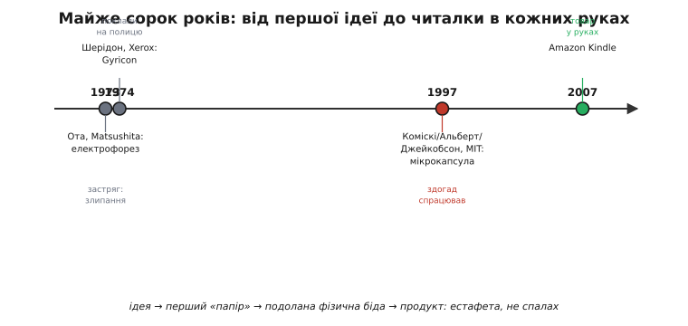
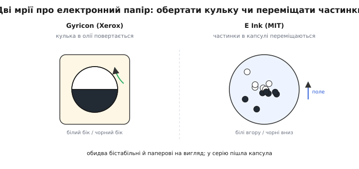

# 📜 Електронне чорнило: тридцять років від мрії до Kindle

Це історія про вперту мрію — папір, що сам міняє написане, — і про те, як вона тричі майже здійснилася й тричі застрягла, аж доки дев'ятнадцятирічний студент не здогадався посадити чорнило в мікроскопічні бульбашки. Тут — японський винахід, що потонув у злипанні частинок, дотепна двоколірна кулька з Xerox, яку поклали на полицю на десятиліття, і «остання книга», задумана в підвалах MIT. А ще — пояснення, **звідки** беруться всі ті вереди e-ink: повільність, привиди, хвилеформи.

Уявіть річ, до якої людство звикло за дві тисячі років і вважає буденною: аркуш паперу з чорнилом. Він не світиться, а лише **відбиває** світло, як усе довкола, — тому не втомлює очей і однаково читається й під лампою, і на сонці. Він тримає написане **вічно** й **без краплі енергії**. Він тонкий, гнучкий, дешевий. Єдина його вада — написане не змінити. І ось ціле століття електроніки людина намагалася зробити папір, у якого зникла б ця єдина вада: щоб відбивав, тримав без живлення й був тонкий — **і при цьому міг переписати себе** за командою. Дорога до цієї простої на словах мрії виявилася на диво довгою й повчальною.

*Майже сорок років від першої ідеї до приладу в кожних руках. Повтор мотиву помітний одразу: і японський електрофорез, і Gyricon застрягли — кожен зі своєї причини, — а зрушила все аж третя спроба. Кольором виділено здогад, що нарешті спрацював.*

---

## Японський первоцвіт: електрофорез, що потонув у злипанні

Перша серйозна спроба прийшла з Японії на початку 1970-х. Японський дослідник **Ісао Ота** (*Isao Ota*) з компанії **Matsushita** (нині Panasonic) запропонував робити відбивний дисплей на явищі, відомому фізикам із XIX століття, — **електрофорезі**: зануримо заряджені кольорові частинки в прозору рідину, і електричне поле гнатиме їх куди скажемо. Підняв білі частинки до поверхні — комірка біла; опустив — темна. Жодного власного світла, жодної потреби живити статичну картинку. На папері (даруйте за каламбур) ідея була чудова, і саме вона лежить в основі всього сьогоднішнього e-ink.

Та між красивою ідеєю й робочим приладом стала вперта фізична біда. Дрібні частинки в рідині не бажали поводитися чемно: вони **злипалися** в грудки, осідали на дно, збивалися докупи — і за кілька циклів дисплей перетворювався на брудну пляму. Ця нестабільність суспензії (злипання, седиментація, коротке життя) робила ранні електрофоретичні дисплеї непридатними для серії. Ідея була правильна, а матерія не слухалася. На два з гаком десятиліття електрофорез лишився цікавинкою з наукових журналів — рівно як рідкі кристали колись чекали свого часу.

Варто пояснити саме явище, бо воно живе у вашому e-ink і досі. **Електрофорез** (*electrophoresis*) — це рух заряджених частинок у рідині під дією електричного поля; помітили його ще на початку XIX століття, спостерігаючи, як глинисті часточки повзуть у воді між зануреними електродами. Matsushita запатентувала спосіб приготування електрофоретичного матеріалу ще близько 1970-го, а в наступні роки зʼявилися й перші патенти на самі дисплеї. Тобто все потрібне **знання** вже лежало на столі — бракувало не теорії, а способу **приборкати** частинки, щоб вони служили роками, а не тижнями. Це класична для техніки ситуація: явище відоме, мета зрозуміла, а вся справа застрягла на одній впертій інженерній перешкоді.

> 🔧 **Навіщо це.** Та сама фізика «гнати частинки полем» — це і є серце вашого e-ink сьогодні, і та сама давня біда зі злипанням пояснює, **чому** він вередливий: чому потрібні складні хвилеформи (щоб чисто розігнати частинки), звідки привиди (частинки не сідають ідеально) і чому все так залежить від температури (густа рідина — мляві частинки). Знаючи корінь, ви не дивуєтеся симптомам.

---

## Кулька, яку поклали на полицю: Gyricon Шерідона

Поки японці воювали з електрофорезом, в американській лабораторії народилася зовсім інша ідея того ж сну. **Нік Шерідон** (*Nick Sheridon*) у легендарному **Xerox PARC** — тому самому центрі, де придумали графічний інтерфейс, мишу й лазерний принтер, — близько **1974 року** створив **Gyricon**: перший у світі «електронний папір». Механізм був геть інакший і по-своєму геніальний.

Замість частинок, що плавають у рідині, Шерідон узяв мільйони крихітних **двоколірних кульок** (*bichromal beads*): кожна кулька — наполовину чорна, наполовину біла, і заряджена так, що має електричний диполь. Кульки сидять у заповнених олією кишеньках тонкого пластикового аркуша й можуть у них **обертатися**. Подаси поле одного знаку — кулька повертається білим боком до глядача; зміни знак — чорним. Цілий аркуш таких кульок показує текст і картинки, не світячись і не потребуючи живлення для утримання, — точнісінько папір.

*Два різні шляхи до того самого чорно-білого відбивного пікселя. Ліворуч — Gyricon: двоколірна кулька в олії **повертається** полем. Праворуч — E Ink: білі й чорні частинки в капсулі поле **переміщає** вгору-вниз. Обидва бістабільні й паперові на вигляд; у серію пішла капсула — і саме чому, розповідає ця історія.*

Здавалося б, ось воно. Та сталося те саме, що колись [з рідкими кристалами в RCA](book:electronics/eink-refresh/hist-lcd.md): **компанія поклала власний винахід на полицю**. Xerox, заклопотана своїм основним бізнесом — копіювальними машинами, — не побачила, куди прилаштувати «електронний папір», і ідея Шерідона пролежала без діла понад десятиліття. Лише в 1990-х, коли пласкі дисплеї пішли в наступ на громіздкі кінескопи, у PARC згадали про Gyricon і спробували його воскресити. Але час уже підпирав — на сцену виходив суперник із Бостона.

> 🔧 **Навіщо це.** Двічі поспіль та сама мораль: блискучий винахід (LCD у RCA, Gyricon у Xerox) в'яне, якщо компанії він не лягає в бізнес. Доля технології — це не лише її якість, а й те, кому й навіщо вона потрібна. Інженерові варто памʼятати: довести ідею до приладу — окрема, часто важча битва, ніж сама ідея.

---

## «Остання книга»: мрія Джейкобсона в MIT

1995 року до **Медіа-лабораторії MIT** (*MIT Media Lab*) прийшов молодий професор **Джозеф Джейкобсон** (*Joseph Jacobson*) — фізик із сміливою, майже фантастичною мрією. Він носився з ідеєю **«останньої книги»** (*the last book*): уявіть книжку, схожу на звичайну — з паперовими на вигляд сторінками, які гортаєш руками, — але єдину, бо її сторінки можуть **перемалюватися** на будь-який текст. Прочитав цю — струснув, і перед тобою вже інша. Для такої книги потрібен був матеріал, якого не існувало: чорнило, що тече по сторінці за командою.

Джейкобсон не був ні хіміком, ні майстром дисплеїв, зате вмів головне — поставити зухвалу мету й зібрати тих, хто її втілить. Він узяв до себе двох студентів-старшокурсників MIT: **Барретта Коміскі** (*Barrett Comiskey*), математика, якому щойно виповнилося дев'ятнадцять, і **Джей-Ді Альберта** (*J.D. Albert*), інженера-механіка. Завдання звучало просто й нахабно: зробіть мені чорнило, що поводиться як на папері, але слухається електрики. Хлопці взялися — і ночами та вихідними почали мучити те саме вперте електрофоретичне чорнило, об яке двадцять років тому розбилися японці.

У цьому був дух Медіа-лабораторії: ставити навмисне нахабні, «неможливі» цілі й кидати на них молодих, ще не привчених вважати щось неможливим. Те, що за чорнило взявся не сивий хімік, а дев'ятнадцятирічний математик, виявилося не дивацтвом, а перевагою — Коміскі підійшов до задачі без вантажу «всі ж знають, що електрофорез не працює». Іноді свіже око бачить просту відповідь там, де досвід уже давно махнув рукою й пішов займатися «серйознішими» речами.

---

## Здогад, що все змінив: чорнило в мікрокапсулах

Спершу виходило кепсько — рівно та сама стара біда: частинки злипалися, осідали, дисплей деградував. І тут Коміскі зробив крок, що й розплутав вузол, над яким б'юлися чверть століття. Якщо частинки злипаються одна з одною по всій рідині — **розгородьмо їх**. Помістімо чорнило не у відкриту калюжу, а в безліч крихітних **мікрокапсул** — мікроскопічних прозорих бульбашок, кожна зі своєю дрібкою частинок. Тепер частинкам нікуди розбігатися й нічого збиватися в грудки за межами своєї бульбашки; кожна капсула — свій маленький, ізольований світ.

Це й була **мікрокапсульна електрофоретична** технологія. Коміскі експериментував із білими частинками в темному барвнику, замкненими в капсули; згодом схема стала класичною — білі й чорні частинки, що розходяться по капсулі під полем. Капсулювання разом розв'язало всі давні болячки: злипання, осідання, коротке життя. А ще — і це виявилося безцінним для виробництва — таке «чорнило» з бульбашок можна було просто **наносити** на поверхню, мало не друкувати, як фарбу. 1997 року Коміскі й Альберт мали робочий прототип.

Ця можливість «друкувати дисплей» виявилася стратегічною, а не просто зручною. Капсули змішують у рідину-носій і наносять тонким шаром на гнучку основу з прозорим електродом — а отже, екран можна виготовляти рулонним способом, дешево й на велику площу, чого крихкі скляні панелі ніколи не дозволяли. Щоб незалежно адресувати кожен піксель, поверх кладуть ту саму активну матрицю з тонкоплівкових транзисторів, що й у рідкокристалічних екранах. Так лабораторне «чорнило» крок за кроком оберталося на технологію, придатну до серії, — не лише працювала фізика, а й складалося виробництво.

Того ж **1997 року**, 19 серпня, у Кембриджі під Бостоном засновники з Медіа-лабораторії — **Джейкобсон, Коміскі й Альберт** — заснували компанію **E Ink**, щоб перетворити лабораторне диво на товар. Через два десятиліття, 2016 року, усіх трьох уведуть до Національної зали слави винахідників США саме за винахід і комерціалізацію електронного чорнила. Зверніть увагу на чесний розподіл лаврів: тут не один геній, а **троє** — мрійник, що поставив мету, і двоє студентів, що знайшли розв'язок; і всі троє стоять поруч.

> 🔧 **Навіщо це.** Здогад Коміскі — взірець інженерного мислення: коли проблема в тому, що елементи **взаємодіють** там, де не треба (частинки злипаються), розв'язок часто не в боротьбі з кожним, а в **ізоляції** — розгородити, замкнути в комірки. Той самий хід ви ще не раз упізнаєте в техніці: від секціонування памʼяті до ізоляції відмов. Іноді прорив — це не нова сила, а правильна стінка.

---

## Від лабораторії до кишені: Kindle

Робочий прототип — ще не річ у руках мільйонів; попереду була довга дорога доведення до серії, яку E Ink здолала у партнерстві з виробниками дисплеїв. Технологію вдосконалювали, додавали активну матрицю (щоб адресувати кожен піксель), боролися з тими самими привидами й температурою, що й досі лишаються вередами e-ink. Перші вироби — електронні читалки **Sony** середини 2000-х — показали, що ідея жива.

За лаштунками цього успіху стояла велика виробнича робота. E Ink довго доводила технологію разом із промисловими партнерами — зокрема голландською **Philips**, що передала E Ink свій дисплейний напрям, — а згодом саму E Ink купила тайванська **PVI**, перенісши виробництво ближче до світової фабрики електроніки. Знайома картина: винахід народився в одному місці (підвал MIT), а в масовий продукт його перетворили інші руки на іншому континенті — точнісінько як рідкі кристали, що зійшли в RCA, а розквітли в Японії та Швейцарії.

А по-справжньому світ змінив **2007 рік**, коли **Amazon** випустила першу **Kindle** — читалку на екрані E Ink. Раптом виявилося, що мрія Джейкобсона збулася майже буквально: легкий прилад, чий екран читається на сонці, як папір, не втомлює очей і живе від одного заряду **тижнями**, бо екран не їсть енергії, поки картинка нерухома. Електронне чорнило з підвалу Медіа-лабораторії стало масовим товаром і дало людям те, чого не змогли дати ні японський електрофорез, ні Gyricon: не ідею, а **продукт**, що його тримаєш у руці.

---

## Що з цього інженерові

Історія електронного чорнила — рідкісно чиста ілюстрація того, що **винахід — це ланцюг, а не спалах**. Придивіться до трьох зупинок на цьому шляху, бо в них уся наука.

**Ідею** мали ще в Японії на початку 1970-х — електрофорез, рух частинок полем. Вона була правильна, але **сама собою не працювала**: частинки злипалися. **Перший «папір»** зробив Шерідон у Xerox — Gyricon, дотепну кульку, — але його **поклали на полицю**, бо компанії він був не на часі. І лише **третя** спроба — мікрокапсула Коміскі, Альберта й Джейкобсона в MIT — здолала фізичну біду й перетворила ідею на технологію, а Kindle перетворила технологію на товар. Чотири різні справи — *придумати ідею*, *зробити робочий прилад*, *розв'язати фізичну перешкоду серії* і *створити продукт* — і робили їх різні люди в різних країнах і десятиліттях. Жодного самотнього винахідника; натомість естафета, де кожен біг свій відрізок.

І остання, найпрактичніша думка. Тепер, знаючи цю історію, ви по-іншому дивитеся на вереди [e-ink](book:electronics/eink-refresh). Повільність, складні хвилеформи, привиди, залежність від температури — це не недоробки інженерів E Ink, а **прямі нащадки** тієї самої фізики, що мучила Ота півстоліття тому: тверді частинки в рідині рухаються неохоче, злипаються й застоюються. Мікрокапсула приборкала цю норовливу матерію рівно настільки, щоб зробити з неї дисплей, — але не скасувала її природи. Тому, ставлячи e-ink у виріб, ви, по суті, домовляєтеся з тим самим упертим чорнилом, що його японський дослідник уперше спробував зрушити полем у 1970-х. Знати, з чим маєш справу, — половина успіху.
