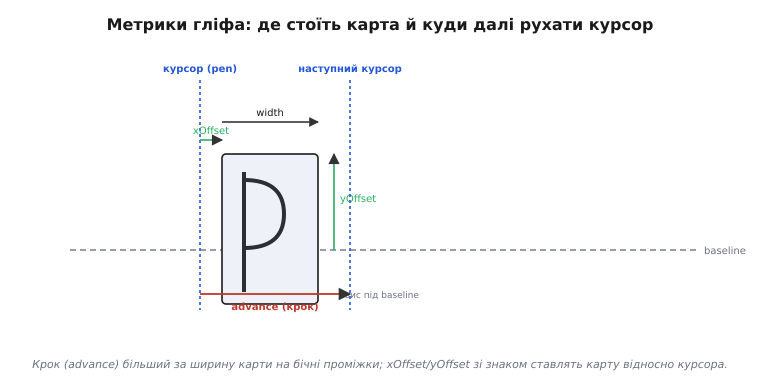

# Шрифти (детально)

<preknowlist>
- [Кадровий буфер](topic:electronics/framebuffer) — масив пікселів у пам'яті, куди малюють зображення перед виводом на екран.
- [Колір у пам'яті](topic:electronics/color-formats) — скільки бітів припадає на піксель і що таке проміжні рівні сірого та RGB565.
- [Растеризація](topic:electronics/primitives-raster) — перетворення форм на пікселі сітки й копіювання готового прямокутника пікселів (бліт).
</preknowlist>

Якщо дивитися згори, картина проста: бітмап зберігає готові пікселі, вектор — контур, який растеризують, а в embedded усе впирається в пам'ять. Та щойно доходить до власного коду — як упакувати гліф, як знайти його за кодом символу, як перетворити контур на пікселі, як згладити край, — за кожним із цих кроків стоїть свій формат даних і свій алгоритм. Розберемо їх по черзі, із реальним C, бо саме на цьому рівні шрифт перестає бути абстракцією й стає байтами у Flash і циклами процесора.

## Формат бітмапного гліфа: байти, метрики, упаковка

Бітмапний гліф у файлі шрифту — це не лише прямокутник пікселів. Це **запис із двох частин**: самі пікселі (бітова карта) і **метрики** — числа, що кажуть, де цей прямокутник стоїть відносно курсора й на скільки зсунути курсор далі. Без метрик пікселі — просто пляма; метрики роблять із плям рівний рядок.

### Бітова карта: як пакують пікселі

Для глибини 1 біт/піксель кожен рядок гліфа пакують у байти зліва направо: старший біт — лівий піксель. Гліф завширшки 8 пікселів — це рівно 1 байт на рядок; завширшки 12 — це 2 байти на рядок (4 біти останнього байта не використані, «добивка» до межі байта). Загальне правило: на рядок іде `ceil(width / 8)` байтів, і весь гліф — це `height × ceil(width / 8)` байтів.

```
width=8,  height=8:   8 × ceil(8/8)  = 8 × 1 = 8 байтів
width=12, height=16:  16 × ceil(12/8) = 16 × 2 = 32 байти   (по 4 біти/рядок — добивка)
width=5,  height=7:   7 × ceil(5/8)  = 7 × 1 = 7 байтів     (маленький шрифт 5×7)
```

Ця добивка до межі байта — компроміс простоти проти щільності. Можна було б пакувати біти суцільним потоком без вирівнювання рядків (щільніше), але тоді доступ до рядка вимагав би зсувів через межі байтів — повільніше й заплутаніше. Більшість бітмапних форматів обирають вирівнювання рядка по байту: трохи марнують Flash, зате читання рядка — це проста індексація.

Для згладженого гліфа замість 1 біта на піксель відводять 2, 4 або 8 бітів. Найпоширеніший в embedded — **4 біти/піксель** (16 рівнів): два пікселі в один байт, удвічі компактніше за повний байт на піксель і достатньо для гладкого краю. Тут на рядок іде `ceil(width / 2)` байтів, а розпаковка пікселя — це вибір потрібного півбайта (ніблу):

```c
// 4 біти/піксель: два пікселі в байті, старший нібл — лівий
uint8_t pixel4(const uint8_t *rowdata, int col) {
    uint8_t byte = rowdata[col >> 1];        // col/2 — який байт
    return (col & 1) ? (byte & 0x0F)         // непарний стовпець — молодший нібл
                     : (byte >> 4);          // парний — старший нібл
}                                            // повертає 0..15 — рівень покриття
```

### Метрики гліфа: де він стоїть і куди далі

Тепер числа довкола карти. Гліф малюють не «від лівого верхнього кута тексту», а **відносно курсора на базовій лінії**. Базова лінія (*baseline*) — це уявна горизонталь, на якій «стоять» літери; хвостики «р», «у», «ц» звисають **під** неї. Щоб розмістити гліф, потрібні чотири метрики:

- **`width`, `height`** — розміри бітової карти в пікселях;
- **`xOffset`** — на скільки зсунути карту праворуч від курсора (буває від'ємним: ліва частина «j» заходить лівіше точки курсора);
- **`yOffset`** — на скільки підняти верх карти над базовою лінією (визначає, наскільки гліф стоїть високо й чи звисає під лінію);
- **`advance`** — на скільки пересунути курсор праворуч **після** цього гліфа до наступного.

Ключове, що `advance` — це **не** те саме, що `width`. Ширина карти — це скільки пікселів займає сама фарба літери; крок — це скільки місця літера резервує в рядку, разом із бічними проміжками (*side bearings*). У літери «i» вузька карта, але крок більший за карту — інакше сусідні літери злипалися б. У моноширинному шрифті крок однаковий у всіх; у пропорційному в кожної свій.


*Карта пікселів стоїть не від кута тексту, а від курсора на базовій лінії; крок (advance) відрізняється від ширини карти на бічні проміжки. Хвостик літери звисає під базову лінію — це від'ємна частина yOffset.*

У структурі шрифту це виглядає як таблиця записів, по одному на гліф, плюс спільний масив бітів. Типове компактне представлення:

```c
typedef struct {
    uint16_t bitmapOffset;   // зсув карти цього гліфа у спільному масиві бітів
    uint8_t  width, height;  // розміри карти, пікселів
    uint8_t  advance;        // крок курсора після гліфа
    int8_t   xOffset, yOffset; // зсув карти відносно курсора (зі знаком!)
} GlyphInfo;

typedef struct {
    const uint8_t   *bitmap;   // спільний масив бітів усіх гліфів
    const GlyphInfo *glyphs;   // таблиця метрик, паралельна діапазону символів
    uint16_t first, last;      // діапазон кодів символів (напр. 0x20..0x7E)
    uint8_t  yAdvance;         // міжрядковий інтервал (висота рядка)
} Font;
```

Це фактично той самий формат, що генерують популярні конвертери бітмапних шрифтів для Adafruit GFX і подібних бібліотек: таблиця `GlyphInfo` плюс суцільний масив бітів. `xOffset`/`yOffset` обов'язково **зі знаком** (`int8_t`), бо частина гліфів заходить лівіше курсора й звисає під базову лінію.

### Малювання з повними метриками

Тепер блітинг враховує всі метрики. Курсор `(penX, penY)` стоїть на базовій лінії; гліф ставимо відносно нього:

```c
// Намалювати один гліф 1 біт/піксель з повними метриками.
// penX, penY — курсор на базовій лінії. Повертає новий penX.
int draw_glyph(uint16_t *fb, int penX, int penY,
               const Font *font, char ch, uint16_t color) {
    if ((uint8_t)ch < font->first || (uint8_t)ch > font->last)
        ch = '?';                                   // нема гліфа — підставити запасний
    const GlyphInfo *g = &font->glyphs[(uint8_t)ch - font->first];
    const uint8_t *bmp = &font->bitmap[g->bitmapOffset];

    int rowBytes = (g->width + 7) >> 3;             // ceil(width/8)
    int x0 = penX + g->xOffset;                     // лівий край карти
    int y0 = penY - g->yOffset;                     // верх карти (вгору від базової лінії)

    for (int row = 0; row < g->height; row++) {
        const uint8_t *rowData = &bmp[row * rowBytes];
        for (int col = 0; col < g->width; col++) {
            if (rowData[col >> 3] & (0x80 >> (col & 7)))   // біт виставлено?
                fb[(y0 + row) * FB_W + (x0 + col)] = color;
        }
    }
    return penX + g->advance;                        // курсор на наступну літеру
}
```

Зверніть увагу на `penY - g->yOffset`: координата екрана росте вниз, а `yOffset` міряємо вгору від базової лінії, тому віднімаємо. Це класичне місце помилок — переплутати знак, і текст «тоне» під рядок або висить над ним. (Тут опущено відсікання за межами буфера — у реальному коді кожен запис у `fb` ще треба перевірити на потрапляння в екран.)

## Кернінг-пари: таблиця поправок і її пошук

Крок дає прийнятні проміжки, але для деяких пар він завеликий: похила права грань «A» і похила ліва грань «V» лишають видиму дірку. Кернінг прибирає її **окремою поправкою для конкретної пари** — числом, яке додають до кроку, коли друга літера йде слідом за першою. Поправка майже завжди від'ємна (літери зближують), хоча буває й додатна.

### Як зберігають пари

Кернінг — це відображення `(лівий гліф, правий гліф) → поправка`. Пар небагато порівняно з усіма можливими сполученнями (кернять лише проблемні), тож зберігати квадратну матрицю `N×N` було б марнотратно — вона майже вся нульова. Натомість тримають **розріджений список** лише ненульових пар, відсортований за ключем, і шукають у ньому двійковим пошуком:

:::tabs
```c
typedef struct {
    uint16_t pair;   // (left << 8) | right — ключ пари, спакований у 16 біт
    int8_t   adjust; // поправка до кроку, пікселів (зазвичай від'ємна)
} KernPair;

// Знайти поправку для пари (left, right); 0 — пари нема. Список відсортовано за pair.
int8_t kern(const KernPair *table, int n, uint8_t left, uint8_t right) {
    uint16_t key = ((uint16_t)left << 8) | right;
    int lo = 0, hi = n - 1;
    while (lo <= hi) {                       // двійковий пошук O(log n)
        int mid = (lo + hi) >> 1;
        if (table[mid].pair == key) return table[mid].adjust;
        if (table[mid].pair < key)  lo = mid + 1;
        else                        hi = mid - 1;
    }
    return 0;                                // пари нема — кернінгу немає
}
```
```python
from bisect import bisect_left

# table — відсортований список пар (key, adjust), де key = (left << 8) | right.
# keys — паралельний список самих ключів для двійкового пошуку через bisect.
def kern(table, keys, left, right):
    key = (left << 8) | right
    i = bisect_left(keys, key)               # двійковий пошук O(log n)
    if i < len(keys) and keys[i] == key:
        return table[i][1]                   # знайшли пару — повертаємо поправку
    return 0                                 # пари нема — кернінгу немає
```
:::

У циклі рядка кернінг застосовують **між** літерами: намалювавши поточну, до кроку додають поправку для пари «поточна + наступна», перш ніж рушити курсор далі:

```c
int draw_text_kerned(uint16_t *fb, int penX, int penY,
                     const Font *font, const KernPair *kt, int kn,
                     const char *s, uint16_t color) {
    for (int i = 0; s[i]; i++) {
        penX = draw_glyph(fb, penX, penY, font, s[i], color);
        if (s[i + 1])                            // є наступна літера?
            penX += kern(kt, kn, s[i], s[i + 1]); // підсунути за таблицею пар
    }
    return penX;
}
```

Це і є вся механіка кернінгу: розріджена таблиця плюс додавання поправки в одному місці циклу. Коштує вона пам'яті під таблицю (кожна пара — 3 байти) і логарифмічного пошуку на стик літер. У дрібному embedded її зазвичай викидають геть: на короткому рядку дрібним шрифтом дірка «AV» непомітна, а сотні пар у Flash — відчутні. Кернінг повертається тоді, коли є великий текст гарним шрифтом і пам'ять, щоб за нього заплатити.

> 🔧 **Навіщо це.** Перш ніж тягнути кернінг у виріб, спитайте: його хтось побачить? На статусному рядку 8-піксельним шрифтом — ні, і таблиця пар буде мертвим вантажем у Flash. На великому заголовку фірмового інтерфейсу — так, і там кернінг відрізняє «зроблено абияк» від «зроблено охайно». Це не технічна потреба, а естетична, і платити за неї варто свідомо.

## Растеризація контуру: від кривих Безьє до пікселів

Векторний гліф — це набір **замкнених контурів**, заданих відрізками й кривими Безьє. Растеризувати його означає визначити, які пікселі лежать **усередині** контуру, і залити їх. Розберемо це по кроках: спершу які саме криві, потім як їх перетворити на ламану, тоді як визначити «всередині», і нарешті де тут згладжування.

### Які криві: квадратичні проти кубічних

Формати розходяться у виборі кривих. **TrueType** (файли `.ttf`) описує контури **квадратичними** кривими Безьє: кожна — це три точки, опорна на кривій, одна керувальна поза нею, і кінцева на кривій. **OpenType з контурами CFF** (часто файли `.otf`, успадковано від PostScript Type 1) використовує **кубічні** криві Безьє: чотири точки — дві на кривій і дві керувальні. Кубічна крива гнучкіша й передає складну форму меншим числом точок, тому дизайнери шрифтів зазвичай надають їй перевагу; квадратична простіша для растеризатора.

TrueType має ще одну характерну рису: дві керувальні точки поспіль означають **неявну** опорну точку посередині між ними. Растеризатор підставляє цю точку сам, що дозволяє низці квадратичних дуг текти одна за одною з меншим числом явно записаних точок. Через це той самий контур у TrueType може мати менше перелічених точок, ніж у CFF, хоча форма однакова.

### Крок 1: розбити криву на відрізки (флатенінг)

Растеризатор не працює з кривими напряму — він спершу **апроксимує** кожну криву ламаною з кількох прямих відрізків. Чим дрібніший кегль, тим менше відрізків треба (на 12 пікселях дугу не відрізнити від двох-трьох хорд); чим більший — тим більше, щоб око не побачило граней. Квадратичну криву рахують за параметром `t` від 0 до 1:

```c
// Точка на квадратичній кривій Безьє при параметрі t (0..1):
// P(t) = (1-t)^2·P0 + 2(1-t)t·P1 + t^2·P2,   P1 — керувальна
typedef struct { float x, y; } Pt;

Pt quad_bezier(Pt p0, Pt p1, Pt p2, float t) {
    float u = 1.0f - t;
    float a = u * u, b = 2.0f * u * t, c = t * t;
    Pt r = { a * p0.x + b * p1.x + c * p2.x,
             a * p0.y + b * p1.y + c * p2.y };
    return r;
}
// Криву обходять кроками t = 0, 1/n, 2/n, ... 1, з'єднуючи точки відрізками.
// n добирають за розміром: більший кегль → більше n.
```

Після флатенінгу весь гліф — це набір замкнених **багатокутників** (по одному на контур): зовнішній обрис літери й, можливо, внутрішні «дірки» (вічко «о», «а», «е»).

### Крок 2: що «всередині» — правило заповнення

Тепер головне питання заливки: який піксель усередині форми, а який ні, надто коли є дірки? Відповідь дає **правило заповнення**. Найпоширеніше для шрифтів — **non-zero winding** (правило ненульового числа обертів): для точки рахують, скільки разів контур її «обходить» проти годинникової стрілки мінус за годинниковою; не нуль — усередині. Саме тому в шрифтах зовнішній контур і контур-дірку малюють у **протилежних** напрямках обходу: їхні внески віднімаються, і дірка лишається порожньою.

На практиці заливку роблять **по рядках** (scanline). Для кожного горизонтального рядка пікселів знаходять усі точки, де його перетинають ребра багатокутників, сортують ці перетини за `x` і заливають проміжки між ними за правилом заповнення:

```c
// Спрощений кістяк scanline-заливки одного рядка y:
//  1. для кожного ребра контуру знайти x перетину з горизонталлю y;
//  2. зібрати всі такі x у масив, відсортувати;
//  3. при non-zero/even-odd залити пікселі в потрібних проміжках між перетинами.
// (Повна реалізація веде «таблицю активних ребер» і йде рядок за рядком згори вниз.)
```

Це і є серце будь-якого растеризатора контурів — від великого FreeType до крихітного власного. Уся складність — у точності перетинів і в обробці граничних випадків (горизонтальні ребра, вершини точно на рядку); ідея ж проста: перетни рядок ребрами, залий між ними.

### Крок 3: гінтинг — чому без нього дрібний текст пливе

На великому кеглі флатенінг і заливка дають гарну літеру. На дрібному з'являється біда: тонкий вертикальний штрих «і» завширшки в один піксель може потрапити **між** двома стовпцями сітки й розмазатися на півпікселя в кожен — замість чіткої лінії вийде бліда пляма. **Гінтинг** (англ. *hinting*) — це підказки в шрифті, що перед заливкою **зсувають** ключові точки контуру так, щоб важливі штрихи лягли точно на межі пікселів: вирівнюють стовбури, верх і низ літер, товщину штрихів до цілого числа пікселів. У TrueType це навіть маленька стекова мова інструкцій усередині гліфа. Гінтинг — причина, чому той самий шрифт на 11 пікселях у системі з гінтингом різкий, а в наївному растеризаторі без нього — каша.

## Згладжування глибше: покриття й субпіксель

Відвести пікселю кілька бітів і зробити краєві пікселі сірими — ось і весь рецепт згладжування у двох словах. Але звідки беруться самі рівні сірого й чим субпіксельний варіант відрізняється від звичайного — у цьому й розберемося.

### Сірий = покриття пікселя формою

Рівень сірого краєвого пікселя — це не довільне «трохи підсірити», а **частка площі** пікселя, накрита формою літери. Піксель цілком усередині контуру — повна заливка (рівень 15 із 16 для 4 біт); цілком зовні — 0; на краю — пропорційно покриттю, скажімо 6/15, якщо форма накриває близько 40% клітинки. Око, не розрізняючи окремих пікселів, інтегрує ці рівні в гладкий край.

Покриття рахують двома шляхами. Точний — аналітично, за площею перетину пікселя з контуром (так роблять якісні растеризатори). Простіший і дуже поширений — **суперсемплінг**: гліф растеризують у кілька разів більшим (наприклад, 4×4 = 16 підпікселів на піксель), рахують, скільки підпікселів залито, і це число й дає рівень сірого. Суперсемплінг 4×4 природно дає 17 градацій (0..16) — рівно під 4-бітне зберігання:

```c
// Покриття пікселя через суперсемплінг 4×4:
// inside(px,py) — чи лежить підпіксель усередині контуру (scanline-тест).
uint8_t coverage4x4(int cellX, int cellY) {
    int hits = 0;
    for (int sy = 0; sy < 4; sy++)
        for (int sx = 0; sx < 4; sx++)
            if (inside(cellX * 4 + sx, cellY * 4 + sy))
                hits++;                       // 0..16 залитих підпікселів
    return (uint8_t)hits;                     // рівень сірого, 0..16
}
```

### Накладання згладженого гліфа на фон

Згладжений гліф зберігає не колір, а **покриття** (альфу). Щоб показати його, кожен піксель **змішують** із фоном пропорційно покриттю: де покриття повне — колір тексту, де нульове — фон, на краю — суміш. Це звичайне альфа-змішування, по каналах:

```c
// Накласти піксель тексту з покриттям cov (0..15) на фон у кадровому буфері.
// RGB565: 5 біт R, 6 біт G, 5 біт B. fg — колір тексту, bg — поточний піксель.
uint16_t blend565(uint16_t fg, uint16_t bg, uint8_t cov /*0..15*/) {
    uint16_t a = cov;                         // альфа 0..15
    uint16_t ia = 15 - a;                     // обернена
    uint16_t fr = (fg >> 11) & 0x1F, fgc = (fg >> 5) & 0x3F, fb = fg & 0x1F;
    uint16_t br = (bg >> 11) & 0x1F, bgc = (bg >> 5) & 0x3F, bb = bg & 0x1F;
    uint16_t r = (fr * a + br * ia) / 15;
    uint16_t gg = (fgc * a + bgc * ia) / 15;
    uint16_t b = (fb * a + bb * ia) / 15;
    return (r << 11) | (gg << 5) | b;
}
```

Звідси видно, чому згладжений текст вимагає **читати** фон під кожним пікселем (а не просто писати колір): краєві пікселі залежать від того, на чому лежать. Це дорожче за 1-бітний бліт і ще одна причина, чому на найскромнішому залізі обирають різкий монохром.

### Субпіксельне згладжування: трюк із RGB-смугами

Субпіксельне згладжування (відоме як ClearType від Microsoft) робить крок далі. Кожен піксель РК-панелі фізично складається з трьох вертикальних смужок — **червоної, зеленої та синьої** ([підпікселів, з яких на панелі й народжується колір](root:embedded/display-classes)). Звичайне згладжування керує яскравістю пікселя цілком; субпіксельне керує **кожною смужкою окремо**, тобто по горизонталі впливає на потроєну кількість елементів. Теоретично це втричі підвищує горизонтальну роздільність тексту: ліву межу штриха можна посунути на третину пікселя, засвітивши лише червону смужку.

Платою є дві речі. По-перше, край літери може взятися кольоровою облямівкою (червоняста з одного боку, синювата з іншого) — її гасять фільтрацією, але повністю не прибирають. По-друге, трюк **прив'язаний до фізичної розкладки** підпікселів: він налаштований на горизонтальні панелі зі смугами в порядку RGB (або BGR) і зорієнтованими вертикально; поверни екран — і ефект ламається, бо смужки тепер ідуть не туди. Саме через цю прив'язку до конкретної панелі субпіксельне згладжування на embedded-екранах рідкісне: розкладка підпікселів у дрібних дисплеїв різна й не завжди відома, а виграш на коротких рядках не вартий мороки.

## Атлас і кеш гліфів: не платити двічі

Коли гліфів багато й малюють їх часто, два прийоми економлять і пам'ять, і час: **атлас** (компактне зберігання) і **кеш** (не растеризувати те саме двічі). Вони природно поєднуються.

### Атлас: усі гліфи на одному простирадлі

Замість окремого масиву на кожен гліф усі їх пакують в одну прямокутну текстуру-простирадло, а до неї тримають таблицю «де лежить який символ» — координати й розмір прямокутника кожного гліфа:

```c
typedef struct {
    uint16_t u, v;           // координати лівого-верхнього кута гліфа в атласі
    uint8_t  w, h;           // розміри прямокутника
    uint8_t  advance;        // крок (метрики живуть поряд із розташуванням)
    int8_t   xOffset, yOffset;
} AtlasGlyph;
// Малювання літери = копіювання прямокутника (u,v,w,h) з атласа в кадровий буфер.
```

Виграш атласа подвійний. По-перше, один тип операції на всі символи — копіювання прямокутника, що лягає на апаратний блітер, якщо він є. По-друге, упаковка щільніша: дрібні гліфи складають поряд без марнування на вирівнювання кожного окремо. Пакувати прямокутники в простирадло — це маленька задача розкрою (її розв'язують простими евристиками на кшталт «полицями» або деревом вільних прямокутників), і робиться вона раз при побудові атласа.

### Кеш: растеризувати раз, показувати багато

На потужнішому МК із векторним рушієм атлас стає **кешем**. Растеризувати контур — дорого (флатенінг, заливка, згладжування); показувати літеру треба часто (щокадру в анімованому інтерфейсі). Безглуздо растеризувати ту саму «а» 12-го кегля шістдесят разів на секунду. Тож гліф растеризують **один раз** на перший запит, кладуть в атлас-кеш і далі малюють швидким блітом; повторний запит того самого гліфа просто бере готовий прямокутник.

```c
// Знайти гліф у кеші; якщо нема — растеризувати, покласти в атлас, повернути.
const AtlasGlyph *get_glyph(GlyphCache *cache, uint32_t codepoint, int sizePx) {
    AtlasGlyph *g = cache_lookup(cache, codepoint, sizePx);   // вже в кеші?
    if (g) return g;                                          // так — даром
    g = rasterize_into_atlas(cache, codepoint, sizePx);       // ні — растеризувати раз
    return g;                                                 // далі — швидкий бліт
}
```

Коли атлас заповнюється, найрідше вживані гліфи витісняють (стратегія на кшталт «найдавніше використаний»), звільняючи місце під нові. Це класичний кеш: дорогу роботу робимо раз, амортизуючи її на безліч дешевих показів. На дрібному залізі з готовим бітмапним шрифтом кеш не потрібен — гліфи й так лежать растеризованими у Flash, — але щойно з'являється растеризатор, атлас-кеш стає тим, що робить векторний текст придатним для реального часу.

## Кирилиця й UTF-8: від байтів рядка до гліфа

Останній шар — як від тексту, що ви виводите, дістатися правильного гліфа. Для чистої латиниці (коди 0x20..0x7E) усе тривіально: байт = код символу = індекс у таблиці гліфів. Щойно з'являється кирилиця чи будь-що поза латиницею, додаються два кроки: **декодування UTF-8** і **пошук гліфа через cmap**.

### UTF-8: символ — це один або кілька байтів

UTF-8 кодує код символу змінним числом байтів. Латинські символи (до 0x7F) — один байт, як у старому ASCII. Кирилиця лежить у діапазоні приблизно 0x0400..0x04FF, і кожна літера кодується **двома** байтами; інші писемності — двома, трьома або чотирма. Схема самопозначна: за старшими бітами першого байта видно, скільки байтів у символі, а кожен продовжувальний байт починається з `10`:

```
0xxxxxxx                             — 1 байт,  код 0x00..0x7F   (латиниця)
110xxxxx 10xxxxxx                    — 2 байти, код 0x80..0x7FF  (кирилиця тут)
1110xxxx 10xxxxxx 10xxxxxx           — 3 байти, код 0x800..0xFFFF
11110xxx 10xxxxxx 10xxxxxx 10xxxxxx  — 4 байти, код понад 0xFFFF
```

Тому код малювання тексту **не може** йти байт за байтом як по символах: українське слово в UTF-8 удвічі довше в байтах, ніж у символах, і наївний цикл покаже замість кожної літери дві кракозябри. Спершу байти треба **зібрати** назад у код символу:

```c
// Прочитати один UTF-8 символ з рядка; *i просунути на спожиті байти.
// Повертає код символу (codepoint).
uint32_t utf8_next(const char *s, int *i) {
    uint8_t b0 = s[*i];
    if (b0 < 0x80) { (*i)++; return b0; }                    // 1 байт — латиниця
    if ((b0 & 0xE0) == 0xC0) {                               // 2 байти — кирилиця тощо
        uint32_t cp = ((b0 & 0x1F) << 6) | (s[*i + 1] & 0x3F);
        *i += 2; return cp;
    }
    if ((b0 & 0xF0) == 0xE0) {                               // 3 байти
        uint32_t cp = ((b0 & 0x0F) << 12) | ((s[*i + 1] & 0x3F) << 6)
                                          |  (s[*i + 2] & 0x3F);
        *i += 3; return cp;
    }
    uint32_t cp = ((b0 & 0x07) << 18) | ((s[*i + 1] & 0x3F) << 12)   // 4 байти
                | ((s[*i + 2] & 0x3F) << 6) | (s[*i + 3] & 0x3F);
    *i += 4; return cp;
}
```

### cmap: код символу → номер гліфа

Декодер дає **код символу** (наприклад, 0x0457 — українська «ї»). Але гліфи у шрифті пронумеровані **своїм** порядком, не за юнікодом. Перетворення «код символу → номер гліфа» робить таблиця всередині шрифту — **cmap** (від *character map*). У повному шрифті це хитра структура з діапазонами; у субсеті для embedded її зазвичай спрощують до кількох суцільних діапазонів («латиниця 0x20..0x7E» і «потрібна кирилиця 0x410..0x44F плюс окремі 0x404, 0x407, 0x456, 0x457 для українських літер») з лінійним чи бінарним пошуком:

```c
typedef struct { uint32_t first, last; uint16_t glyphBase; } CmapRange;
// Кожен діапазон: символи [first..last] → гліфи [glyphBase .. glyphBase+(last-first)]

int cmap_lookup(const CmapRange *ranges, int n, uint32_t cp) {
    for (int r = 0; r < n; r++)
        if (cp >= ranges[r].first && cp <= ranges[r].last)
            return ranges[r].glyphBase + (cp - ranges[r].first);
    return -1;                               // символу нема у шрифті → запасний гліф
}
```

Зібравши все докупи, малювання рядка українського тексту виглядає так: декодуємо UTF-8 у код символу, через cmap знаходимо номер гліфа, блітимо його з метриками, додаємо кернінг до наступного — і так до кінця рядка:

```c
int draw_utf8_line(uint16_t *fb, int penX, int penY,
                   const Font *font, const CmapRange *cmap, int cn,
                   const char *s, uint16_t color) {
    int i = 0;
    while (s[i]) {
        uint32_t cp = utf8_next(s, &i);            // байти → код символу
        int gi = cmap_lookup(cmap, cn, cp);        // код → номер гліфа
        if (gi < 0) gi = cmap_lookup(cmap, cn, '?'); // нема — запасний
        penX = draw_glyph_by_index(fb, penX, penY, font, gi, color);
        // (кернінг за бажанням: + kern(...) для пари номерів гліфів)
    }
    return penX;
}
```

Звідси видно повний шлях символу: **байти UTF-8 → код символу → номер гліфа через cmap → пікселі з метриками**. Пропустиш декодер — отримаєш кракозябри на кирилиці; пропустиш cmap — намалюєш не ту літеру. Для чистої латиниці обидва кроки вироджуються (байт = код = індекс), і саме тому навчальні приклади бітмапного тексту їх опускають; для української вони обов'язкові.

> 🔧 **Навіщо це.** Якщо ваш виріб показує українською, два місця визначають, чи буде текст читабельним. Перше — субсет шрифту мусить **містити** потрібні кириличні літери (зокрема окремі «ґ», «є», «і», «ї», що лежать поза суцільним кириличним блоком). Друге — рендер мусить **декодувати UTF-8**, а не йти по байтах. Забудьте перше — побачите порожні прямокутники замість літер; забудьте друге — побачите по дві кракозябри на літеру. Обидва баги виглядають як «шрифт зламаний», хоча зламаний насправді конвеєр.

## Скільки шарів вмикати

Кожен шар цього конвеєра коштує пам'яті, циклів або коду, і кожен можна **зняти**, коли він не потрібен. На найскромнішому МК лишається гола бітова карта 1 біт/піксель із латиницею, і весь рендер — це вкладений цикл по бітах. Чим більше зростають вимоги — кольори, мови, гладкість, великі кеглі, реальний час, — тим більше шарів доводиться повертати, аж до повноцінного векторного рушія з кешем гліфів. Інженерне рішення щоразу те саме: увімкни рівно стільки цього стека, скільки вимагає виріб, і ні шаром більше — бо кожен шар хтось оплачує з тих самих скупих кілобайтів і мегагерців.
