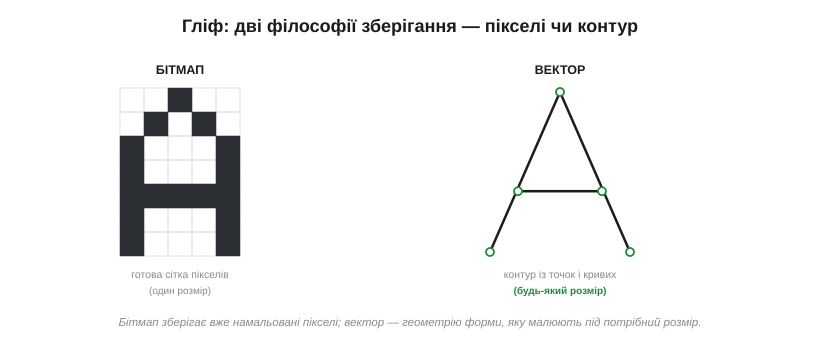
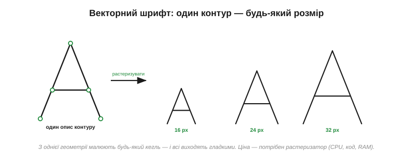
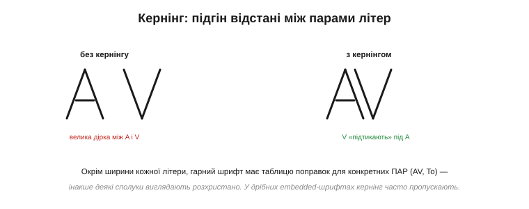
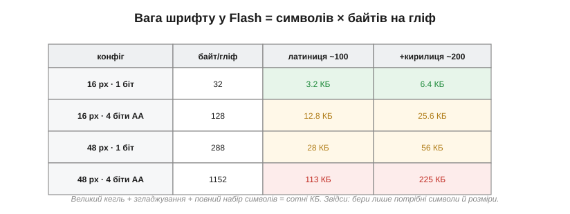

# Шрифти: бітмапні проти векторних (кернінг, юнікод, вага шрифтів у Flash)

Текст на екрані — це гліфи, які беруть зі шрифту й блітають у кадровий буфер. Але що таке цей гліф і як зберігається шрифт? Тут — два протилежні підходи з геть різною ціною: **бітмапний** (наперед намальовані пікселі) і **векторний** (контури, які растеризують). А поверх них — кернінг, охоплення символів і та сама турбота, що переслідує embedded скрізь: скільки **Flash** з'їдає гарний шрифт. Розберімо все по черзі, бо вибір шрифту на дрібному залізі — це майже завжди битва за пам'ять.

### Гліф: дві філософії зберігання

**Гліф** (*glyph*) — це накреслення одного символу, його форма. Зберегти цю форму можна двома принципово різними способами. Перший — **як пікселі**: просто намалювати літеру на маленькій сітці й запам'ятати, які клітинки чорні. Другий — **як контур**: описати геометрію форми лініями й кривими, не прив'язуючись до жодного розміру.


*Рис. Ліворуч — бітмап: готова сітка пікселів одного конкретного розміру. Праворуч — вектор: контур із точок і кривих, з якого літеру можна намалювати будь-якого кегля. Перший підхід зберігає **результат**, другий — **рецепт**.*

Ця відмінність — між збереженим результатом і збереженим рецептом — і визначає всі їхні переваги та вади. Розгляньмо кожен.

Ця пара «результат проти рецепта» — наскрізна в техніці, і варто впізнавати її скрізь. Зберегти готовий результат — швидко читати, та негнучко й об'ємно, коли результатів багато (тут — багато розмірів). Зберегти рецепт — компактно й гнучко, та треба щоразу «готувати» (растеризувати). Історично першими були **бітмапні** шрифти: на ранніх екранах інакше й не могло бути, бо обчислювати контури не було чим. Векторні прийшли, коли з'явилися процесори, здатні растеризувати на льоту; а в embedded, де процесор знову скромний, бітмап нерідко вертається — історія робить коло.

### Бітмапні шрифти: піксель готовий наперед

У бітмапному шрифті кожен гліф — це **фіксований візерунок пікселів** одного розміру, що лежить у Flash як масив бітів. Намалювати літеру — означає просто **блітнути** цей візерунок [готовою операцією копіювання прямокутника пікселів](book:electronics/primitives-raster); жодних обчислень, жодної математики.


*Рис. Бітмап тривіально малювати — але один збережений розмір не перетворити гладко на інший: спроба масштабувати дрібний гліф дає блочну, негарну літеру. Тому кожен потрібний кегль зберігають **окремим** набором, і Flash множиться на число розмірів.*

Звідси чіткий баланс. Плюси бітмапного шрифту — простота, швидкість і передбачуваність: блітнути готові пікселі вміє найскромніший мікроконтролер, без жодної RAM під обчислення. Мінуси прямо випливають із того, що збережено саме пікселі одного розміру: **масштабувати** їх гладко не вийде (збільшений гліф блочний, зменшений — каша), тож кожен потрібний кегль доводиться **зберігати окремо**, а великі розміри з'їдають багато Flash. Через це бітмапні шрифти панують на дрібних МК, і часто їх **наперед готують** із векторного шрифту під час збирання — рівно на ті розміри, що знадобляться.

Сам гліф у шрифті — це не лише прямокутник пікселів, а й кілька **мірок** довкола нього. Базова лінія (*baseline*), на якій «стоять» літери; виноси вгору й униз (для літер із хвостиком, як «р» чи «ц»); і **крок** (*advance*) — на скільки зсунути курсор після цієї літери. Саме ці мірки роблять рядок рівним, а не стрибучим, і відрізняють моноширинний шрифт (однаковий крок) від пропорційного (свій крок у кожної). Готуючи бітмапний шрифт із векторного на етапі збирання, інструмент розраховує всі ці мірки наперед і пакує їх поряд із пікселями, тож у рантаймі лишається тільки блітати й зсувати курсор.

> 🔧 **Навіщо це.** Для більшости екранів на мікроконтролері бітмапний шрифт — правильний вибір: він дешевий, миттєвий і не потребує ні растеризатора, ні RAM. Тільки пам'ятайте, що кожен **розмір** і кожне **накреслення** (звичайне, жирне) — це окремий набір гліфів у Flash, тож не плодьте їх без потреби: три кеглі замість одного — це втричі більше пам'яті під шрифт.

### Векторні шрифти: форма, яку растеризують

Векторний (контурний) шрифт зберігає не пікселі, а **контури** літери — її обриси, задані кривими (зазвичай Безьє), незалежно від розміру. Щоб намалювати гліф, його **растеризують** на льоту: беруть контур, масштабують під потрібний кегль і заливають — тим самим [перетворенням форми на пікселі сітки](book:electronics/primitives-raster).


*Рис. З одного опису контуру малюють літеру будь-якого розміру — і всі виходять гладкими. Ціна цієї гнучкости — потрібен растеризатор: код, процесорний час і трохи RAM на кожен гліф.*

Переваги дзеркальні до бітмапних: **будь-який** розмір з одного опису, завжди гладкий (зі згладжуванням), а один файл шрифту покриває всі кеглі й навіть дозволяє вивести жирне чи похиле накреслення з тієї ж геометрії. Розплата — складність: потрібен **растеризатор** (рушій на кшталт відомого FreeType), а це і код, і процесорний час, і RAM під проміжний гліф. Тому повноцінний векторний рендеринг тримають для потужніших мікроконтролерів; на скромних задовольняються бітмапом.

Варто згадати дві речі, без яких векторні шрифти не були б такими гарними. Перша — **гінтинг** (*hinting*): підказки в шрифті, що на дрібних розмірах «притягують» контур до сітки пікселів, аби тонкі штрихи не зникали й не двоїлися; без нього малий векторний текст виходить розмитим. Друга — самі формати: контурні шрифти, які ви бачите щодня, — це **TrueType** і **OpenType**, де гліф описано кривими плюс гінти й таблиці кернінгу. Саме такий файл і «переварює» растеризатор, видаючи пікселі під ваш конкретний екран і кегль.

> ⚙️ **Алгоритм.** Як саме з гліфа роблять пікселі — крок растеризації з контуру чи бітмапа й згладжування на 4 біти/піксель — в алгоритмічній вставці до цієї теми (`proj-font-render.md`).

### Гладкі літери: 1 біт проти згладжування

Окремий вимір — **наскільки гладкі** краї літер. Якщо піксель гліфа зберігати одним **бітом** (чорний або білий), малі літери виходять різкими й ступінчастими — ті самі сходинки, що псують будь-яку [намальовану похилу лінію чи криву](book:electronics/primitives-raster). Якщо ж відвести пікселю кілька **бітів** (скажімо, 4 біти = 16 рівнів сірого), краї можна **згладити**: проміжні пікселі роблять сірими пропорційно тому, як форма накриває клітинку, і око зливає їх у плавну лінію (для цього й потрібні [проміжні рівні сірого в форматі пікселя](book:electronics/color-formats)).


*Рис. Той самий косий штрих: ліворуч 1 біт — видно сходинки; праворуч 4 біти — сірі краєві пікселі обманюють око плавністю. Згладжування коштує більше байтів на гліф (кілька бітів замість одного), зате робить дрібний текст читабельним.*

Це прямий компроміс: згладжування коштує **в кілька разів** більше пам'яті на гліф (бо піксель тепер не біт, а 2–4 біти), зате дрібний текст із ним читається легко, а без нього розсипається. На кольорових екранах згладжування майже обов'язкове; на грубому монохромному від нього відмовляються, бо проміжного сірого там немає.

Цікаво, що згладжування буває й хитрішим за прості сірі краї. На кольорових екранах інколи грають окремими червоним, зеленим і синім [підпікселями, з яких складено колір на панелі](book:electronics/display-classes), додаючи ще більше уявної роздільности по горизонталі, — це **субпіксельне** згладжування. Але воно прив'язане до конкретної розкладки підпікселів і на embedded-екранах рідкісне. А там, де сірого справді немає — на чисто чорно-білому e-ink чи символьному дисплеї, — гладкого тексту не буде взагалі, хоч як старайся: фізика пікселя не дозволяє проміжних рівнів, тож лишається тільки добирати чіткий, спеціально мальований під цей розмір бітмапний шрифт.

### Кернінг: відстань між парами літер

Просте «зсунь курсор на ширину літери» після кожного [намальованого гліфа](book:electronics/primitives-raster) дає прийнятний, але не ідеальний текст. Деякі пари літер за рівних проміжків виглядають розхристано: класичний приклад — «AV» чи «To», де похилі форми лишають між собою завелику дірку. **Кернінг** (*kerning*) — це підгін відстані для конкретних **пар**: окрема таблиця поправок, що каже «після A перед V підсунь ближче».


*Рис. Без кернінгу між A і V зяє дірка; з кернінгом V «підтикають» під навислий край A, і пара виглядає рівно. Це окрема таблиця пар — додаткова пам'ять, тож у дрібних embedded-шрифтах кернінг часто пропускають.*

Кернінг робить текст професійним на вигляд, але коштує тієї самої валюти — пам'яті під таблицю пар і трохи коду. На великому гарному інтерфейсі він доречний; на крихітному екранчику з парою рядків ним зазвичай нехтують.

Не плутаймо кернінг із кількома сусідніми поняттями. **Крок** (advance) — це базова ширина-зсув кожної окремої літери; **кернінг** — поправка для конкретної пари поверх кроку; а **трекінг** (*tracking*) — рівномірне розрідження чи ущільнення всього рядка одразу. У бідному embedded-тексті живе зазвичай лише перше — простий крок; решта починається там, де за типографіку вже взялися серйозно, а на це є і пам'ять, і потреба.

### Юнікод: які символи взагалі є у шрифті

Дотепер ми мовчки припускали, що потрібна літера у шрифті є. Та шрифт містить рівно стільки гліфів, скільки в нього **поклали**, і кожен символ, що ви покажете, мусить мати свій гліф. Латиниця — це близько сотні знаків; додайте кирилицю — вже за дві сотні; а повний **юнікод** (*Unicode*) із усіма писемностями світу, включно з десятками тисяч ієрогліфів, — це гігантський набір, якому в дрібному МК просто немає місця.

Тому в embedded майже завжди роблять **підмножину** (*subset*): кладуть у шрифт лише ті символи, що реально знадобляться, — вашу мову, цифри, потрібні знаки, — і викидають решту. Перетворення «код символу → потрібний гліф» робить невелика таблиця відповідности всередині шрифту. Брати повний юнікодний шрифт у мікроконтролер — означало б віддати під нього всю Flash, тож субсетинг тут не примха, а необхідність.

Корисно знати й масштаб проблеми. Та внутрішня таблиця відповідности «код → гліф» зветься *cmap*, і саме вона перетворює, скажімо, юнікодний код української «ї» на номер потрібного гліфа в шрифті. А чому повний юнікод такий страшний для МК, видно на прикладі китайської, японської та корейської писемностей (CJK): лише вживаних ієрогліфів там десятки тисяч, і кожен — окремий складний гліф. Шрифт, що покриває CJK, важить мегабайти й у дрібний мікроконтролер не вміщається в принципі — для таких мов або беруть зовнішню пам'ять, або кладуть лише потрібну жменю символів.

### Вага у Flash: головна турбота embedded

Усі ці вибори — бітмап чи вектор, 1 біт чи згладжування, який кегль, чи з кернінгом, скільки символів — зрештою сходяться в одне число: **скільки Flash з'їсть шрифт**. І воно вражає.


*Рис. Дрібний 1-бітний латинський шрифт — лічені кілобайти; великий, згладжений, з повним кириличним набором — уже сотні кілобайтів. Кожен множник (більший кегль, згладжування, ширший набір, ще одне накреслення) накладається на інші.*

**Приклад (вага шрифту у Flash).** Порахуймо шрифт 16×16 пікселів для латиниці з кирилицею (~200 символів):

```
1 біт/піксель:       16 × 16 = 256 біт = 32 байти/гліф
                     200 × 32  = 6 400 байтів    ≈ 6.4 КБ

4 біти/піксель (АА): 16 × 16 × 4 = 1024 біти = 128 байтів/гліф
                     200 × 128 = 25 600 байтів  ≈ 25.6 КБ
```

Одне лише згладжування вчетверо роздуло шрифт; великий кегль роздув би його ще на порядок (48-піксельний — це вже ~9× площі), а окреме жирне накреслення — подвоїло б. Звідси наскрізне правило економії: бери **лише потрібні** символи (субсет), **лише потрібні** розміри й накреслення, а згладжування додавай там, де воно справді треба для читабельности, а не всюди.

> 🔧 **Навіщо це.** Шрифт у вбудованому виробі — часто один із найбільших споживачів Flash, і легко непомітно з'їсти ним сотні кілобайтів. Перш ніж додати ще один кегль, накреслення чи згладжування, прикиньте їхню ціну за формулою «символів × байтів на гліф». Найдешевший шрифт — субсет лише вашої мови, у потрібному розмірі, без зайвого; найдорожчий — повний юнікод великим згладженим кеглем «про всяк випадок».

Є й технічні способи приборкати цю вагу. Гліфи **стискають** (вони ж переважно порожні поля), тримають шрифт у зовнішній Flash чи на картці пам'яті, а в оперативну тягнуть лише потрібні зараз символи. Та найдієвіший важіль усе одно простий і нудний: **не клади того, що не покажеш**. Зайвий кегль «про всяк випадок», згладжування там, де його однаково не видно, повний набір символів заради десятка чужих знаків — ось звідки беруться ті несподівані сотні кілобайтів, що раптом не вміщаються в чип.

### Підсумок: шрифт — це теж компроміс пам'яті

Отже, шрифт — не «просто літери», а ще один знайомий торг. Бітмап дешевий, швидкий і фіксований; вектор гнучкий, гладкий і важкий обчислювально. Згладжування купує читабельність за байти; кернінг купує охайність за таблицю; охоплення юнікоду купує мови за Flash. На скромному залізі майже завжди перемагає бітмап-субсет — мінімум символів, мінімум розмірів, згладжування за потреби; на потужному можна дозволити векторний рушій із повним набором. Як і всюди в роботі з графікою на мікроконтролері, правильний вибір диктує не смак, а доступна пам'ять.

І ще одне, що варто винести: текст — це не «безкоштовний» елемент інтерфейсу, як його іноді сприймають. За кожним рядком на екрані стоїть і пам'ять під гліфи, і робота з їх малювання, і десятки дрібних рішень — розмір, накреслення, згладжування, охоплення мов. Підійшовши до шрифту як до повноцінного компонента з власним бюджетом, ви уникнете і роздутого Flash, і блідого нечитабельного тексту, який однаково псує навіть найкращий виріб.

Текст займає своє місце поряд із формами й кольорами серед усього, що малюють у кадровому буфері. А коли картинка з гліфами вже зібрана в пам'яті, лишається окреме питання — як **показати** її глядачеві так, щоб вона не рвалася й не мерехтіла під час оновлення; це розв'язує [подвійна буферизація з синхронізацією кадру](book:electronics/double-buffering).

---
