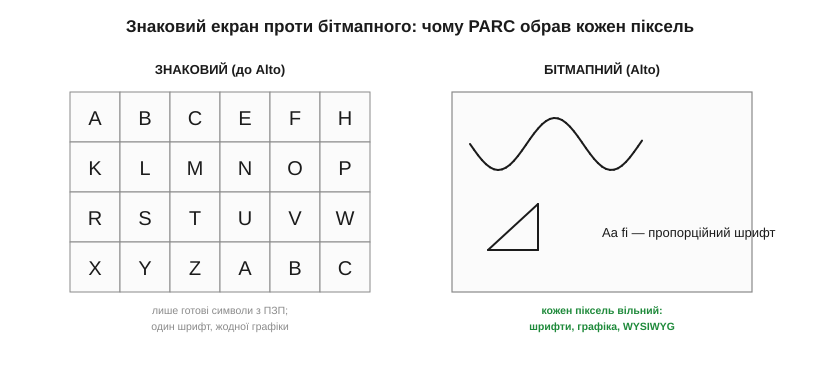
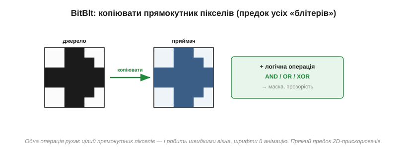

# 📜 Alto: як у PARC наважилися малювати кожен піксель

> Історична вставка про [кадровий буфер](book:electronics/framebuffer): екран як масив пам'яті, де кожен піксель окремо адресується. Здавалося б, очевидність. Та колись це було **зухвалою, дорогою єрессю**: віддати безцінну пам'ять на те, щоб керувати кожною цяткою екрана. Тут — історія про лабораторію, де наважилися на це першими, про комп'ютер на ім'я Alto, про операцію, що зробила бітмап швидким, і про фірму, яка винайшла майбутнє двічі — і двічі його впустила.

Сядьте перед сучасним екраном і спробуйте уявити, що на ньому можна показати лише **готові літери** з наперед заданого набору — і нічого більше. Ні кривої лінії, ні картинки, ні навіть іншого шрифту. Саме таким був екран комп'ютера до початку 1970-х, і причина була проста: пам'ять коштувала шалених грошей, а тримати в ній окреме значення для **кожного** пікселя здавалося неможливою розкішшю. Те, що сьогодні ми вважаємо самоочевидним — [кадровий буфер](book:electronics/framebuffer), — народилося як свідома, смілива ставка купки дослідників, що вирішили: воно того варте.

---

## Екран до Alto: в'язниця готових символів

Щоб оцінити стрибок, треба зрозуміти, як працював екран **до** нього. Ранні дисплеї були **знаковими** (*character displays*): екран ділився на сітку клітинок, і в кожну можна було поставити лише один із наперед заготовлених символів — літеру, цифру, знак — узятий з невеликого «шрифту» в постійній пам'яті (ПЗП). Електроніка зберігала не пікселі, а **коди символів**: «у клітинці 5 — літера A». А вже апаратура на льоту малювала відповідний візерунок із знакогенератора.


*Рис. Зліва — знаковий екран: сітка клітинок, у кожній лише готовий символ із ПЗП; один шрифт, жодної графіки. Справа — бітмапний: кожен піксель вільний, тож можна намалювати будь-що — криву, картинку, пропорційний шрифт. Уся різниця — у тому, що зберігати: коди символів чи самі пікселі.*

Це було **ощадливо**: екран на 80×25 символів вимагав лише дві тисячі байтів пам'яті — по байту на клітинку. Але та сама ощадливість була й в'язницею. Не можна намалювати графік чи схему. Не можна змінити шрифт — він зашитий у ПЗП. Не можна показати, як документ виглядатиме на папері. Курсив, жирність, пропорційні літери, ілюстрації — усе це лежало за ґратами «готових символів». Екран умів лише те, що заздалегідь поклали в знакогенератор.

> 🔧 **Навіщо це.** Цей компроміс не зник — він живий і досі. Згадайте монохромні символьні РК-дисплеї (ті, що «16×2 знаки») чи семисегментні індикатори: вони й сьогодні зберігають не пікселі, а коди, бо це копійчано дешево по пам'яті. Знаковий екран не «застарів» — він просто посів свою нішу, де графіка не потрібна, а кожен байт на рахунку. Вибір «коди символів проти вільних пікселів» — це той самий вибір «пам'ять проти гнучкості», що й у темі про кадровий буфер.

---

## PARC і мрія Алана Кея

На початку 1970-х Xerox відкрила в Каліфорнії дослідницький центр **PARC** (*Palo Alto Research Center*) і зібрала там, мабуть, найгеніальнішу команду в історії обчислювальної техніки. Серед них був молодий візіонер **Алан Кей** (*Alan Kay*) з ідеєю, що випереджала час на десятиліття. Він мріяв про **Dynabook** — персональний, динамічний комп'ютер для кожного, навіть для дитини, такий природний і виразний, як олівець і папір. А папір показує **будь-що**: малюнок, рукопис, будь-який шрифт. Отже, й екран Кеєвої машини мусив показувати будь-що — а значить, керувати **кожним пікселем** окремо.

Це й була точка розриву зі знаковим екраном. Мрія про комп'ютер, що вміє показати все, неминуче вела до бітмапного дисплея — хай яким дорогим він був. Кей зі своєю групою думав не про економію байтів, а про **виразність**: краще віддати пам'ять, ніж замкнути користувача в клітку готових символів. Лишалося знайти тих, хто збудує таку машину в залізі — і вони були поряд, у тому ж PARC.

Чому ж саме PARC міг наважитися на таку дорогу примху? Бо це була **дослідницька** лабораторія з щедрим фінансуванням і рідкісною свободою думати на роки вперед, а не на наступний квартал. Тут поряд винаходили локальну мережу Ethernet, лазерний принтер, об'єктне програмування — і дозволяли собі питати не «скільки це коштує сьогодні», а «яким буде комп'ютер, коли пам'ять подешевшає». Ставка на бітмап була ставкою на майбутнє: інженери знали, що ціна пам'яті невпинно падатиме, і будували машину під завтрашній день, а не під учорашні ціни. У цьому й секрет PARC — думати на крок далі, ніж дозволяє поточний прайс.

---

## Зухвале рішення: віддати пам'ять під кожен піксель

1973 року команда PARC побудувала **Alto** — комп'ютер, який заднім числом називають першим персональним у сучасному сенсі. Його залізо спроєктував блискучий інженер **Чак Текер** (*Charles «Chuck» Thacker*); програмну частину вів **Батлер Лемпсон** (*Butler Lampson*), що ще в грудні 1972-го написав знаменитий внутрішній меморандум **«Why Alto?»**, яким переконав Xerox побудувати кілька десятків цих машин. А над усім витала візія Кея, що благословив Alto як «проміжний Dynabook».

Серцем зухвалості був **екран**. Alto дістав бітмапний дисплей 606×808 пікселів — портретний, як аркуш паперу 8½×11 дюймів, бо машину задумали для **документів**. І ось ключове рішення, винесене в назву цієї історії: кожен із тих майже півмільйона пікселів зберігався **окремим бітом у звичайній оперативній пам'яті**. Жодної окремої відеопам'яті — кадровий буфер ділив ту саму RAM, що й програми; апаратура 30–60 разів на секунду вичитувала з неї пікселі й гнала на екран. Намалювати цятку означало просто **встановити біт** у потрібній комірці — рівно так, як працює [кадровий буфер](book:electronics/framebuffer) у будь-якій сучасній графіці.

Порахуймо ціну, бо вона вражає для свого часу:

```
606 × 808 пікселів × 1 біт = 489 648 біт ≈ 60 КБ
базова пам'ять Alto = 128 КБ
```

Майже **половину** всієї дорогоцінної пам'яті машини віддали на те, щоб «малювати кожен піксель». У 1973-му, коли пам'ять коштувала шалено, це здавалося марнотратством на межі божевілля. Але PARC свідомо пішов на це — бо взамін діставав свободу: будь-який шрифт, будь-яку графіку, документ на екрані точнісінько таким, яким він вийде з принтера. Та сама арифметика «розмір кадру = пікселі × біти», що тисне на [кадровий буфер](book:electronics/framebuffer) вашого мікроконтролера, уперше натисла саме тут — і інженери вирішили заплатити.

> 🔧 **Навіщо це.** Коли ви рахуєте, скільки RAM з'їдає [кадровий буфер](book:electronics/framebuffer), і скрушно дивитеся на скромну пам'ять свого МК — ви переживаєте **той самий** компроміс, що й команда Alto п'ятдесят років тому, тільки в мініатюрі. Кадровий буфер завжди був і лишається дорогою статтею пам'яті; різниця хіба в тому, що тоді це були кілобайти на цілий комп'ютер, а тепер — на крихітний чип. Сама ж дилема «віддати пам'ять заради вільного пікселя» незмінна.

---

## BitBlt: операція, що зробила бітмап швидким

Та вільний піксель приніс і нову біду. Якщо екран — це масив із сотень тисяч бітів, то посунути вікно, перемалювати рядок тексту чи зрушити картинку означає перекласти **тисячі** пікселів — а робити це по одному надто повільно навіть для документів. Бітмап міг задихнутися під власною гнучкістю.

Розв'язок народився там само, у роботі над мовою **Smalltalk** (нею в PARC творили графічний інтерфейс). 1975 року **Ден Інґаллс** (*Dan Ingalls*) разом із **Ларрі Теслером** (*Larry Tesler*), **Бобом Спруллом** (*Bob Sproull*) і **Дайаною Меррі** (*Diana Merry*) запрограмували операцію, яку назвали **BitBlt** (*bit block transfer* — «перенесення блоку бітів»); згодом Інґаллс переписав її в мікрокод, щоб летіла ще швидше.


*Рис. BitBlt бере прямокутний блок пікселів з одного місця й копіює в інше — за одну операцію, а не піксель за пікселем. Та ще й з логічною дією (AND, OR, XOR) над джерелом і приймачем — звідси маски й прозорість. Ось чому вікна, шрифти й анімація на Alto стали швидкими.*

Ідея проста й могутня: BitBlt **копіює прямокутний блок пікселів** з одного місця кадру в інше — одним махом, а не цяткою за цяткою. Ба більше, при копіюванні можна застосувати **логічну операцію** між джерелом і приймачем — І, АБО, виключне-АБО, — і саме це дало маски, прозорість, накладання. Раптом усе стало швидким: посунути вікно — це BitBlt; вивести літеру — скопіювати її образ BitBlt'ом; анімувати — BitBlt туди-сюди. Кажуть, що саме поява швидкого BitBlt і підштовхнула всі екрани світу перейти від знакової графіки до бітмапної «для всього».

> 🔧 **Навіщо це.** BitBlt — прямий предок усіх «блітерів» і апаратних 2D-прискорювачів, що й досі сидять у контролерах дисплеїв та мікроконтролерах і вміють заливати й копіювати прямокутники без участі процесора. Коли ваша графічна бібліотека «блітить» спрайт чи копіює буфер, вона повторює рух руки Інґаллса 1975 року. Тримайте в голові цю операцію: переносити пікселі **блоками**, а не поодинці, — найперший прийом швидкої графіки.

---

## Що відкрив вільний піксель

Варто на мить охопити оком, що ж розблокувало те зухвале рішення малювати кожен піксель. Коли екран перестав бути сіткою готових символів, відкрилося майже все, що ми сьогодні вважаємо «комп'ютером»: **пропорційні шрифти** різних накреслень і розмірів; **графіка** — лінії, фігури, картинки; **WYSIWYG** — документ на екрані точно такий, як на папері; **вікна**, що перекриваються; піктограми; курсор, яким керує **миша**. Усе це — не окремі винаходи, а наслідки однієї передумови: кожен піксель вільний, бо лежить власною коміркою в пам'яті.

Інакше кажучи, бітмапний екран Alto був не просто кращим дисплеєм — він був **полотном**, на якому вперше можна було намалювати графічний інтерфейс. Без вільного пікселя не було б ні Smalltalk із його віконним світом, ні наступних поколінь GUI. Сучасний інтерфейс народився тієї миті, коли пам'ять погодилися витратити на пікселі.

Є тут і красива логіка, чому саме **Xerox** — фірма копіювальних машин — породила бітмапний екран. Для компанії, що живе з друку на папері, головним був не абстрактний інтерфейс, а **WYSIWYG**: екран, на якому документ виглядає точнісінько так, як вийде з принтера. А показати на екрані будь-який шрифт і будь-яке розташування, як на аркуші, можна лише пікселями, а не готовими символами. Тож бітмап був для Xerox не забаганкою, а прямою потребою її ремесла — і портретний, «паперовий» екран Alto, формою точно як аркуш, це підкреслював.

---

## Xerox, що двічі впустила майбутнє

І ось найгіркіша, до болю знайома частина історії. Xerox **винайшла** майбутнє — і не змогла на ньому заробити. Alto лишився внутрішньою машиною PARC; спроба зробити комерційний продукт, робочу станцію **Star** (1981), вийшла пізно й надто дорого. А 1979 року лабораторію відвідала невелика делегація молодої компанії Apple на чолі зі Стівом Джобсом — побачила графічний інтерфейс Alto, була вражена до глибини душі, і за кілька років світ дістав Lisa й Macintosh. Ідею, народжену в Xerox, у товар перетворили інші.

Якщо вам це щось нагадує — то невипадково. Цей сюжет повторюється в історії дисплеїв. RCA винайшла рідкокристалічний дисплей — і поклала на полицю ([рідкі кристали, що RCA не схотіла](book:electronics/display-classes/hist-lcd.md)). А електронне чорнило-попередник, Gyricon, придумали — і де ж? — **у тому самому Xerox PARC**, і так само не довели до пуття ([електронне чорнило від мрії до Kindle](book:electronics/eink-refresh/hist-eink.md)). Виходить, Xerox випустила з рук **двічі**: і графічний інтерфейс, і електронний папір. Винайти — це одне; впізнати у винаході майбутнє й донести його до людей — зовсім інше, окреме вміння, якого великим фірмам так часто бракує.

Цей провал навіть дістав ім'я в окремій книжці — «Fumbling the Future» («Проґавити майбутнє»), — бо став хрестоматійним. Урок із нього не в тому, що Xerox була недолуга (там працювали генії), а в тому, що **організація**, заточена під один прибутковий продукт — копіри, — структурно не вміє побачити цінність у чомусь геть іншому. Винахід помирає не від браку таланту, а від браку місця для нього в наявному бізнесі. Це та сама дилема, що згубила LCD у RCA: новому, хай навіть геніальному, нема куди стати, коли вся компанія вибудувана навколо старого.

---

## Що з цього інженерові

Озирнімося на весь шлях — і витягнемо те, що стосується вас сьогодні.

**Перше й головне.** [Кадровий буфер](book:electronics/framebuffer) — це **буквально** ідея Alto: екран як масив бітів у звичайній пам'яті, де намалювати цятку означає встановити біт за адресою. Працюючи з framebuffer на своєму мікроконтролері, ви користуєтеся винаходом 1973 року — тим самим, лише змалілим із цілого комп'ютера до одного чипа.

**Друге.** Дилема, через яку PARC мучився, — ваша щоденна дилема. Кожен піксель коштує пам'яті; вільний бітмап завжди дорожчий за знаковий екран. Вибираючи між кольоровим кадром і скромною RAM, між бітмапом і простим символьним дисплеєм, ви зважуєте рівно те, що й Текер із Лемпсоном, — гнучкість проти ціни пам'яті.

**Третє.** BitBlt живий у кожному вашому «блітері», копіюванні буфера, апаратному 2D-прискорювачі. Найперший прийом швидкої графіки — рухати пікселі **блоками** — народжений у PARC і не застарів ні на йоту.

І останнє, не технічне. Історія дисплеїв не раз показала, як винахід і його втілення — різні справи (RCA з LCD, Xerox із GUI та e-папером). Для інженера тут наука без зловтіхи: довести ідею до людей не менш важливо й не менш важко, ніж її придумати. Alto це доводить від протилежного — блискучий винахід, що дістався світу лише чужими руками.

---

### Пов'язане
- [Framebuffer: екран як масив пам'яті](book:electronics/framebuffer) — те, що Alto зробив уперше: екран як масив пам'яті з довільним доступом до пікселя.
- [📜 Рідкі кристали: дисплей, який RCA зробила — і не схотіла](book:electronics/display-classes/hist-lcd.md) — той самий мотив «винайшли й не втілили».
- [📜 Електронне чорнило: тридцять років від мрії до Kindle](book:electronics/eink-refresh/hist-eink.md) — де Gyricon, попередник e-ink, теж народився в Xerox PARC і теж був покинутий.
