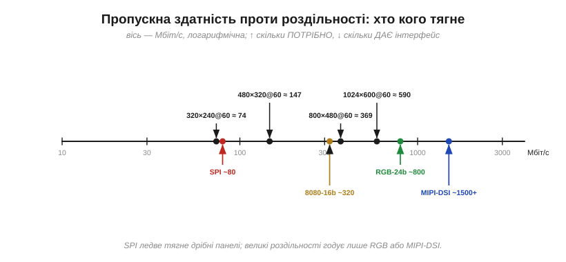
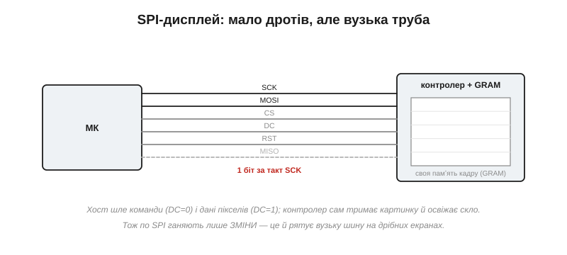
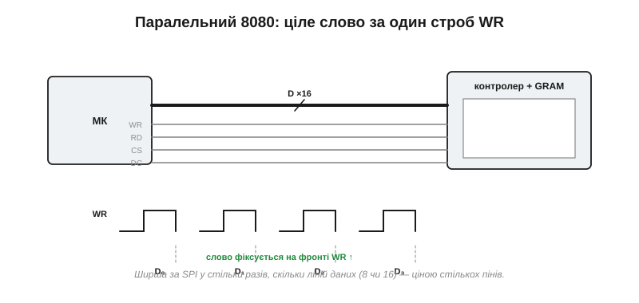
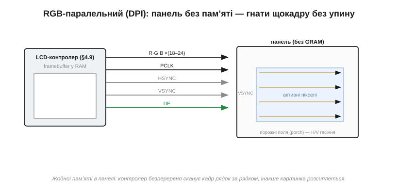
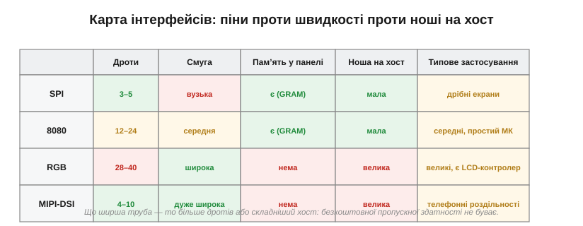

# Інтерфейси панелей: SPI, паралельний 8080, RGB, MIPI-DSI

Панель вибрано — тепер її треба фізично під'єднати до мікроконтролера й **погнати в неї пікселі**. І тут постає інженерна проблема, яку легко недооцінити: пікселів дуже багато, а оновлювати їх треба десятки разів на секунду, тож зображення — це **потужний потік даних**, а інтерфейс між МК і панеллю — труба скінченної ширини. Уся ця тема — про напругу між тим, скільки пікселів за скільки кадрів ви хочете показати, і тим, наскільки широку трубу можете собі дозволити: у **пінах** мікроконтролера, у **мегагерцах** шини, у складності схеми. Розгляньмо чотири поширені труби — від тонкої й простої до широкої й швидкої, — і побачимо, чому вибір щоразу впирається в роздільність.

### Скільки даних треба гнати: бюджет пікселів

Перш ніж порівнювати інтерфейси, порахуймо сам **попит** — скільки бітів за секунду треба пропхати, щоб картинка жила. Це добуток чотирьох чисел: скільки пікселів по ширині, скільки по висоті, скільки бітів на колір кожного пікселя й скільки разів на секунду все це оновлюється.


*Рис. Логарифмічна шкала Мбіт/с. Угорі — скільки **потрібно** для різних роздільностей при 60 кадрах/с; унизу — стеля кожного інтерфейсу. Видно одразу: SPI ледь дотягується до дрібних панелей, а великі роздільності годує лише RGB або MIPI-DSI. Це й є головна вісь усієї теми.*

**Приклад (бюджет пікселів).** Порахуймо потік для двох типових панелей при 16 бітах на піксель і 60 кадрах за секунду:

```
дані = ширина × висота × (біт/піксель) × (кадрів/с)

320×240:  320 × 240 × 16 × 60 = 73 728 000  ≈ 73.7 Мбіт/с
800×480:  800 × 480 × 16 × 60 = 368 640 000 ≈ 369 Мбіт/с
```

Запам'ятайте ці порядки: збільшення площі екрана вп'ятеро множить потік теж **уп'ятеро**. Дрібну панель нагодує навіть скромна послідовна шина, а більша вже вимагатиме широкої паралельної або диференційної. Важлива тонкість: ця цифра — попит на **безперервне** годування. Частина інтерфейсів справді мусить гнати весь кадр щоразу, а частина — лише зміни; та закладатися варто на гірший випадок.

У цій формулі ховається ще один важіль, яким часто крутять, — **глибина кольору** (біт на піксель). Перейти з 16 біт (звичні «65 тисяч кольорів») на 24 (повні «мільйони») — це півтора раза більше даних на той самий екран; піти навпаки, на 8 біт чи на палітру, — стільки ж разів менше. Тож коли труба не тягне, інженер торгується не лише роздільністю й частотою кадрів, а й кольором. І останнє застереження: реальна пропускна здатність завжди **нижча** за цей теоретичний добуток, бо частину тактів з'їдають службові витрати — паузи між байтами, перемикання «команда/дані», синхросигнали й порожні поля між рядками кадру. Закладати інтерфейс упритул до бюджету не можна — потрібен запас, інакше панель не встигатиме оновлюватися й картинка почне «гальмувати».

> 🧮 **Порахувати точно.** Як зважити цей бюджет під конкретну панель — роздільність × глибина × FPS проти реальної швидкості шини, із запасом на службові такти, — у математичній вставці до цієї теми (`r01-s3-m-bandwidth-budget.md`).

### SPI: два-три дроти, найпростіша труба

Найтонша й найпопулярніша в аматорстві труба — **SPI** (*serial peripheral interface*). Даних тут лише один провід (MOSI), плюс такт (SCK) і вибір кристала (CS); до них додають лінію DC (*data/command* — каже панелі, байт це команда чи піксель), скидання RST і зрідка зворотний MISO. Усього три-п'ять дротів — мрія для МК із дефіцитом пінів.


*Рис. Підключення SPI-дисплея. Хост шле біти по MOSI під такт SCK; лінія DC розрізняє команди й дані. Сама панель несе **контролер із власною памʼяттю кадру** (GRAM): вона тримає зображення й освіжає скло без участі МК. Тому по SPI можна слати лише ЗМІНИ — і це рятує вузьку шину.*

За простоту платять шириною: SPI **послідовний**, тобто жене по одному біту за такт. Навіть на щедрих 40–80 МГц це лише 40–80 Мбіт/с — якраз стеля для дрібних панелей, як показав наш бюджет. Рятує SPI-дисплеї одна архітектурна риса: майже завжди вони мають **власний контролер із памʼяттю кадру** (*GRAM*, графічна RAM). МК шле туди команди й дані пікселів, а контролер сам, без участі процесора, безперервно освіжає скло з тієї памʼяті. Отже, хосту не треба гнати кадр 60 разів на секунду — досить надіслати те, що **змінилося**. Перемалювати весь екран по SPI повільно, а от посунути стрілку годинника чи оновити рядок цифр — миттєво.

Щоб відчути межу на числах: один повний кадр 320×240 по 16 біт — це близько 1.2 Мбіт, і навіть на 40 МГц SPI віддасть його приблизно за **30 мс**. Отже, суцільний перемальунок усього екрана — це від сили 30 кадрів за секунду, та й то якщо процесор тим часом не робить більше нічого. Ось чому на SPI-дисплеях так бережуть кожен зайвий піксель і чіпають лише ту ділянку, що справді змінилася. Саму передачу майже завжди віддають на **DMA** (прямий доступ до памʼяті): процесор лише каже «вижени цей шматок у дисплей» і вертається рахувати наступний кадр, а біти йдуть самі, без його участі. Без цього прийому навіть скромний інтерфейс зʼїв би весь процесорний час на саме «штовхання байтів».

> 🔧 **Навіщо це.** SPI — стандартний вибір, коли пінів мало, а екран невеликий: давачі, кишенькові прилади, носимі пристрої. Але закладаючи SPI-панель, чесно прикиньте, чи витримає вона потрібну **частоту оновлення** того, що в вас рухається: для статичного інтерфейсу з рідкими змінами — ідеально, для плавної анімації на весь екран — задихнеться.

### Паралельний 8080: ціле слово за один строб

Хочеться більше швидкості, зберігши просту «командно-даних» логіку? Тоді беруть **паралельний інтерфейс 8080** (названий за стилем шини процесора Intel 8080). Замість одного дроту даних тут їх вісім або шістнадцять, а керують ними кількома лініями: WR (запис), RD (читання), CS (вибір), DC/RS (команда чи дані).


*Рис. Шина 8080. Хост виставляє ціле слово на лініях даних і смикає строб **WR**; на його фронті контролер «защіпає» це слово. За один строб проходить 8 чи 16 біт — у стільки ж разів швидше за SPI, що жене по біту.*

Виграш прямий: якщо SPI віддає біт за такт, то 8080 віддає **ціле слово за строб** — байт чи два байти за одне смикання лінії WR. При тих самих тактових частотах це у 8 чи 16 разів ширша труба. Платять, звісно, пінами: вісім-шістнадцять ліній даних плюс керування — це вже 12–24 проводи проти трьох у SPI. Архітектурно 8080-панель така сама «розумна», як SPI: усередині той самий контролер із GRAM, що сам освіжає скло, тож і тут хост шле лише зміни, тільки швидше. Багато контролерів дисплеїв розуміють **обидва** інтерфейси — SPI й 8080, — і вибір між ними стає простим компромісом «піни проти швидкості».

На залізі 8080 лягає напрочуд природно. Багато мікроконтролерів мають апаратний блок, що вміє виставляти такий паралельний інтерфейс сам — наче звичайний запис у зовнішню памʼять; і тоді надіслати слово в дисплей коштує процесору **однієї** інструкції запису за адресою, а решту — лінії даних, строб WR, утримання рівнів — залізо зробить без нього. Між 8- і 16-розрядним варіантом теж є торг: шістнадцять ліній удвічі швидші, але зʼїдають удвічі більше пінів, а на дрібному корпусі їх може просто не вистачити. Тому 8-бітний 8080 — частий компроміс там, де пінів обмаль, а SPI вже не встигає за тим, що рухається на екрані.

> 🔧 **Навіщо це.** 8080 — золота середина для панелей середнього розміру на звичайному МК: помітно швидше за SPI, та сама проста модель «команда/дані», і часто його можна повісити на апаратний паралельний порт мікроконтролера. Беріть його, коли SPI вже не встигає перемальовувати екран, а тягти повноцінний RGB-інтерфейс зарано.

### RGB-паралельний (DPI): гнати щокадру без упину

Коли панель велика, з'являється геть інша порода інтерфейсу — **паралельний RGB** (*DPI*, *display parallel interface*). Тут немає жодних «команд»: хост напряму, безперервно виставляє на шину **колір кожного пікселя** по черзі. Лінії — це власне дані кольору (зазвичай 16, 18 або 24 біти на R/G/B разом), піксельний такт **PCLK** (на кожен його фронт — новий піксель) і синхросигнали: HSYNC (кінець рядка), VSYNC (кінець кадру) і DE (*data enable* — позначка, що зараз ідуть справжні видимі пікселі, а не службове «гасіння»).


*Рис. RGB-інтерфейс. Панель **не має GRAM** — вона «дурна» й лише засвічує те, що зараз на лініях. Тому контролер мусить безперервно сканувати кадр рядок за рядком, видаючи пікселі під PCLK, а між видимими ділянками — порожні «поля» (porch) для гасіння. Зупиниш потік — картинка розсиплеться.*

Ключова відмінність — у тому, чого тут **немає**: памʼяті в панелі. RGB-панель «дурна», вона не запамʼятовує нічого, а лише в цю мить засвічує те, що бачить на лініях. Отже, хтось мусить **безперервно**, кадр за кадром, видавати їй увесь растр — рівно той потік у сотні Мбіт/с, що ми порахували в бюджеті. У мікроконтролері це робить спеціальний апаратний блок — [**контролер дисплея**](book:electronics/display-controller), який сам, через DMA, без упину вичитує кадровий буфер із памʼяті хоста й женеться ним у панель. Звідси й подвійна ціна RGB: широка й безперервна шина (28–40 пінів) **плюс** памʼять під кадровий буфер у самому хості. Зате й роздільності тут — ті, що SPI і не снилися.

Дві деталі роблять RGB особливо вимогливим. По-перше, контролер гонить не лише видимі пікселі, а й уже згадані **порожні поля** (porch) — службові паузи в кінці кожного рядка й кожного кадру, потрібні, щоб «перевести промінь» на початок наступного; через них реальна частота PCLK відчутно вища за голий добуток пікселів, а отже, і навантаження на шину більше, ніж здається з бюджету. По-друге, кадровий буфер у памʼяті хоста — це прямий наслідок [роздільності панелі](book:electronics/panel-parameters): 800×480 по 16 біт — це ~0.75 МБ лише на одну копію картинки, а для плавної мальовки хочеться дві. Стільки швидкої памʼяті є далеко не в кожному МК, тож RGB-панель часто диктує і вибір самого контролера — з достатньою вбудованою або зовнішньою RAM.

> 🔧 **Навіщо це.** RGB-інтерфейс бери лише тоді, коли твій МК має апаратний контролер дисплея й досить памʼяті під кадровий буфер; інакше процесор просто не встигне годувати панель і захлинеться. Це межа, за якою «причепити екран» перестає бути дрібницею і стає окремою підсистемою, що зважено впливає на вибір самого мікроконтролера.

### MIPI-DSI: швидкість по диференційних парах

На верхньому щаблі — **MIPI-DSI** (*display serial interface*), стандарт зі світу смартфонів. Він знову послідовний, як SPI, але влаштований зовсім інакше: дані біжать по [**диференційних парах**](book:communications/differential-pair) — пара проводів із протифазними сигналами, стійка до завад і здатна на шалені швидкості. Є одна тактова пара й від однієї до чотирьох смуг даних, і кожна смуга несе **гігабіти за секунду**.


*Рис. MIPI-DSI. Кілька тонких диференційних пар (тактова + смуги даних) переганяють більше, ніж десятки ліній паралельного RGB. Платня — потрібен хост із підтримкою DSI й помітно складніший, пакетний протокол.*

Парадокс DSI в тому, що, маючи **менше** дротів за паралельний RGB (кілька пар замість сорока ліній), він несе **набагато більше** даних — саме завдяки диференційній передачі на дуже високій частоті. Це робить його ідеальним для телефонних роздільностей. Ціна — складність: пакетний протокол, жорсткі вимоги до розведення пар, і головне — DSI вміють лише потужні мікроконтролери та системи-на-кристалі, а не звичайні МК. Для більшості embedded-проєктів на скромному контролері DSI лишається недосяжним верхом, про який корисно знати, але до якого рідко доходить.

Варто знати й те, що сам DSI буває двох норовів — і це повертає нас до знайомого поділу. У **відеорежимі** (*video mode*) панель, як RGB, власної памʼяті не має, тож хост мусить безперервно слати кадри. У **командному** (*command mode*) панель несе свою памʼять кадру, як SPI-дисплей, тож хост шле лише зміни, а між ними процесор і шина можуть спати. Тобто навіть на цьому найшвидшому інтерфейсі знову зринає те саме наскрізне питання — чи є в панелі власна памʼять кадру. Для приладів на батареї командний режим особливо цінний саме цією змогою «замовкнути», поки картинка нерухома.

### Чому вибір упирається в роздільність

Тепер видно наскрізну логіку всієї теми. Попит на пропускну здатність росте з добутком ширини, висоти й частоти кадрів — тобто **прямо з [роздільності панелі](book:electronics/panel-parameters)**. А кожен інтерфейс має свою стелю. Тож вибір труби — це не питання смаку, а просте узгодження: труба мусить пропустити той потік, що його вимагає ваша картинка.


*Рис. Чотири інтерфейси поруч. Видно закономірність: що ширша труба, то або більше дротів (RGB), або складніший хост (DSI). Дешеві SPI й 8080 перекладають клопіт на власний контролер панелі; широкі RGB і DSI — на хост, що мусить сам тримати кадр і безупинно його гнати.*

Звідси й практичне правило вибору, що майже однозначно випадає з розміру екрана. Дрібна панель — бери SPI, трьох дротів досить. Середня, де SPI вже не встигає, а МК простий — 8080, доплативши пінами за швидкість. Велика, з апаратним контролером дисплея на борту — паралельний RGB. А телефонна роздільність на потужній системі — MIPI-DSI. Безкоштовної пропускної здатності не буває: за кожен крок угору платять або пінами, або складністю хоста, або і тим, і тим.

Наскрізь усієї цієї логіки проходить одне слово — **памʼять кадру**: у SPI й 8080 вона живе в самій панелі, у RGB і DSI — у хості. Де саме тримати зображення і хто його освіжає — це окреме інженерне рішення з власними наслідками для памʼяті, швидкості й складності, і саме його розвʼязує [контролер дисплея](book:electronics/display-controller).

---
