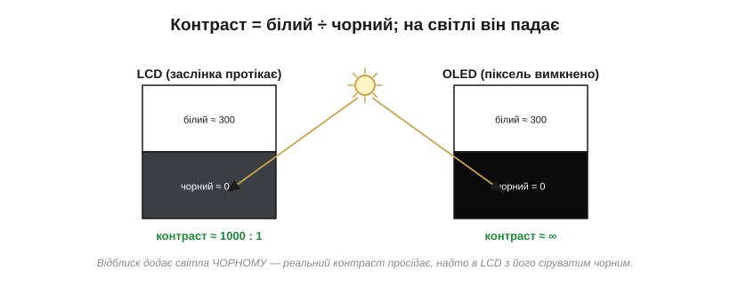
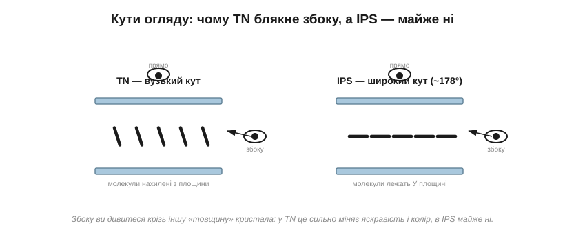
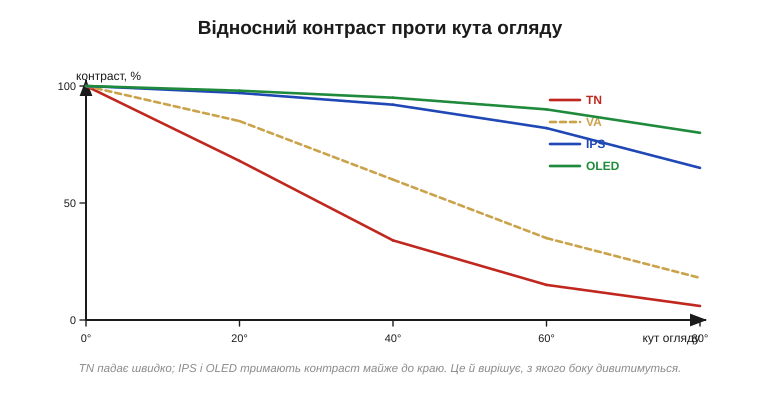
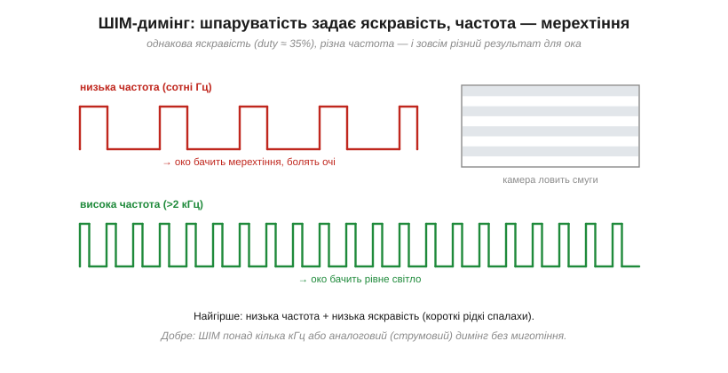

# Параметри панелі: роздільність, яскравість, кути, ШІМ-мерехтіння

Коли [клас дисплея](book:electronics/display-classes) вже обрано, лишається відкрити даташит — і там на вас чекає стовпчик цифр: «320×240», «350 cd/m²», «кут огляду 70/70/60/70», «частота ШІМ 240 Hz». Саме ці числа, а не гарне слово «TFT» чи «IPS» у назві, вирішують, чи буде ваш екран читабельним **у тих умовах, де працюватиме виріб**: під лампою в цеху, на вулиці під сонцем, під косим поглядом водія, від пригашеної заради економії підсвітки. Біда в тому, що даташити **лестять**: цифру міряють у найвигідніших умовах, а ви житимете в реальних. Тож навчімося читати ці параметри тверезо — по черзі, від найочевиднішого.

### Роздільність: не скільки пікселів, а які вони на оці

**Роздільність** (*resolution*) — це кількість пікселів по ширині й висоті, як-от 320×240. Здавалося б, що більше — то краще. Але сама по собі ця цифра неповна: 320×240 на годинниковому циферблаті й на двометровому щиті — геть різна чіткість. Важить не кількість пікселів, а їхня **щільність** — і, зрештою, **кутовий розмір** одного пікселя на оці глядача.

Щільність міряють у **PPI** (*pixels per inch*, пікселів на дюйм): скільки пікселів припадає на дюйм екрана. А чи побачить око окремий піксель — залежить ще й від відстані. Людське око розрізняє деталі приблизно до **однієї кутової мінути** (1′ = 1/60°): дрібніше зливається в суцільне. Тому той самий екран зблизька показує «драбинку» пікселів, а здалеку — гладку картинку.


*Рис. Один піксель видно під кутом α = (крок пікселя) ÷ (відстань d). Око розрізняє приблизно 1′; щойно α стає меншим за цю межу, окремі пікселі зливаються — це й називають «retina»-щільністю. Тож «достатня» роздільність залежить від того, з якої відстані дивитимуться.*

З цього випливає практичний висновок: **роздільність не безкоштовна**. Кожен зайвий піксель — це більше відеопам'яті на кадр, більше даних щокадру проганяти по шині й трохи дорожча панель. Гнатися за щільністю, якої око однаково не побачить із робочої відстані, — означає марно палити ці ресурси.

**Приклад (PPI і «retina»-відстань).** Невелика панель 2.4″ з роздільністю 320×240. Порахуймо її щільність і відстань, з якої пікселі зіллються:

```
пікселів по діагоналі = √(320² + 240²) = √160000   = 400 px
PPI = 400 ÷ 2.4″                                    ≈ 167 PPI
крок пікселя = 25.4 мм ÷ 167                        ≈ 0.152 мм

«retina»-відстань, де α = 1′ = 0.000291 рад:
d = крок ÷ α = 0.152 мм ÷ 0.000291                  ≈ 520 мм ≈ 52 см
```

Отже, з відстані понад ~півметра пікселі цієї панелі вже зливаються, і вищу роздільність око не оцінить; ближче — «драбинку» буде видно. Якщо ваш прилад дивляться з витягнутої руки, 167 PPI достатньо, і нарощувати їх немає сенсу.

Скільки коштує роздільність, найкраще видно з підрахунку пам'яті. Один кадр кольорового зображення — це приблизно два байти на піксель: 320×240 × 2 байти ≈ **150 КБ** лише на одну копію картинки. Для багатьох мікроконтролерів це більше за всю їхню вбудовану швидку пам'ять — тож саме роздільність, помножена на глибину кольору, диктує, чи вміститься кадр у чипі, чи доведеться брати зовнішню пам'ять або тримати зображення прямо в панелі. Подвойте лінійну роздільність — і площа, а з нею й розмір кадру, зросте **вчетверо**: перехід з 320×240 на 640×480 коштує не вдвічі, а вчетверо більше пам'яті й стільки ж разів більшого потоку даних щокадру. Через цю квадратичну ціну в embedded усталилися кілька зручних роздільностей — як-от 320×240 (її звуть QVGA) чи 480×320, — що дають пристойну чіткість на діагоналях у кілька дюймів, не роздуваючи ні пам'ять, ні шину.

Варто пам'ятати й про будову самого пікселя. Він не суцільна цятка, а трійця кольорових смужок-підпікселів поряд, і вони мають **скінченний розмір**: між сусідніми пікселями завжди є темний проміжок (його частку від площі звуть коефіцієнтом заповнення, *aperture ratio*). Тому, як не нарощуй роздільність, на близькій відстані можна вловити не лише «драбинку», а й саму сітку — ефект «москітної сітки» (*screen-door effect*), особливо помітний в окулярах віртуальної реальності, де екран майже впритул до ока. І навпаки: оскільки підпікселі рознесені по горизонталі, дрібних кольорових переходів по ширині можна показати трохи більше, ніж буквально каже число пікселів, — на цьому й ґрунтуються хитрощі згладжування тексту.

> 🔧 **Навіщо це.** Перш ніж брати панель «з запасом» по роздільності, прикиньте робочу відстань і потрібний PPI — і звіртеся, чи потягне її ваша система по пам'яті та швидкості шини. Часто розумніше взяти скромнішу роздільність і витратити зекономлені кілобайти й такти на плавність інтерфейсу, а не на пікселі, яких ніхто не побачить.

### Яскравість і контраст: нити проти сонця і відблиску

**Яскравість** (*luminance*, *brightness*) міряють у **нітах** (*nit* = кандела на квадратний метр, кд/м²). Сама цифра ні про що не каже, доки не назвати середовище: те, що сліпуче в темній кімнаті, зникає під сонцем.


*Рис. Скільки нітів треба. Для кімнати вистачає 200–300 кд/м², типовий TFT стільки й дає. На вулиці треба 400–700, а щоб читати під прямим сонцем — понад 1000. Шкала логарифмічна: «вуличний» екран яскравіший за кімнатний у рази, а не на відсотки.*

Поруч із яскравістю йде **контраст** (*contrast ratio*) — відношення яскравості білого до чорного. Це він робить картинку «соковитою» чи «вилинялою». І тут усе впирається у фізику пікселя: у [LCD](book:electronics/display-classes) заслінка протікає, тож чорний — насправді темно-сірий, і контраст конечний (типово близько 1000:1); в OLED вимкнений піксель не світить зовсім, тож чорний ідеальний, а контраст фактично нескінченний.


*Рис. Контраст — це білий, поділений на чорний. У LCD чорний сіруватий (≈0.3 кд/м²) → контраст близько 1000:1; в OLED чорний нульовий → контраст необмежений. Але є пастка: на світлі **відблиск** від поверхні додає яскравості й чорному, і реальний контраст просідає — найболючіше саме для LCD.*

Ось чому паспортний контраст «1000:1» чи «∞» — це лабораторна цифра в темряві. У реальному освітленні поверхня екрана відбиває частину навколишнього світла, додаючи його **і білому, і чорному**. Білому це майже не шкодить, а чорний з ідеального стає сіруватим — і весь контраст осідає. Тому для вуличного приладу важать не лише ніти, а й антивідблискове покриття та поведінка панелі на світлі.

Щоб ці цифри не лишалися абстракцією, варто прив'язати їх до знайомих величин. Один **ніт** — це яскравість приблизно однієї свічки, розмазаної по квадратному метру; аркуш білого паперу в добре освітленому офісі віддає в око близько сотні нітів, тож кімнатний екран на 200–300 кд/м² і робить картинку «яскравішою за папір». А тепер уявіть, скільки світла довкола надворі: у похмурий день — тисячі люксів, під прямим сонцем — десятки тисяч. Проти такого потоку навіть 500-нітовий екран здається сірою плямою, бо власне світло панелі тоне у відбитому. Звідси й вимога «понад 1000 кд/м²» для вуличних приладів — не примха, а боротьба з фоном, який у сотні разів яскравіший за кімнатний.

Є й третій, гібридний шлях, про який часто забувають: **трансфлективні** (*transflective*) панелі, що поєднують підсвітку з частковим відбиттям. У приміщенні вони світять, як звичайний TFT, а на сонці підмішують відбите світло, як e-ink, — тож що яскравіше довкола, то краще їх видно. Платять за це приглушенішими барвами й нижчим контрастом у тіні, але для приладу, який мусить читатися й у цеху, і надворі, це нерідко найрозумніший компроміс. Ця ідея «використати вороже світло собі на користь» лежить і в основі автояскравості, де яскравість підсвітки підлаштовують під довкілля за допомогою [датчиків освітленості](book:electronics/photo-sensors).

> 🔧 **Навіщо це.** Задавайте яскравість і контраст **під середовище експлуатації**, а не «щоб гарно на столі». Для приладу, який працюватиме надворі, 300 кд/м² без антивідблиску — це нечитабельний екран опівдні, хай навіть у кімнаті він сяє. І навпаки: ставити 1000-нітову панель у затемнений корпус — марно палити енергію й гроші.

### Кути огляду: TN, IPS, VA

**Кут огляду** (*viewing angle*) каже, наскільки можна відхилитися від перпендикуляра до екрана, доки картинка не зблякне, не зінвертується чи не змінить колір. Для OLED проблеми майже немає: піксель випромінює сам, тож із будь-якого боку видно те саме (хіба легкий зсув кольору). А от у LCD кут — болюче місце, і залежить він від **типу панелі**, тобто від того, як саме в ній рухаються молекули рідкого кристала.


*Рис. У TN-панелі молекули перемикаються, нахиляючись **з площини** скла; дивлячись збоку, ви бачите крізь них зовсім іншу ефективну «товщину» — звідси різка зміна яскравості й кольору. В IPS молекули обертаються **в площині** скла, тож вид збоку майже симетричний — і кут широкий.*

Звідси три поширені родини LCD-панелей, які варто впізнавати в даташитах:

- **TN** (*twisted nematic*, «закручений нематик» — за способом, яким у ньому скручено рідкий кристал): найдешевший і найшвидший, але **вузький** кут, із помітним зсувом кольору й навіть інверсією збоку.
- **IPS** (*in-plane switching*): молекули обертаються в площині, кут **широкий** (часто ~178°), кольори стабільні — ціною трохи дорожчого виробництва й вищого споживання.
- **VA** (*vertical alignment*): проміжний варіант із глибоким чорним і середніми кутами.


*Рис. Відносний контраст проти кута огляду. TN валиться вже після 30–40°, VA тримається середньо, а IPS і OLED зберігають контраст майже до краю. Саме ця крива, а не маркетингове слово в назві, каже, чи годиться панель для перегляду збоку.*

> 🔧 **Навіщо це.** Питайте себе, **з якого боку** дивитимуться на екран. На прилад, який бачить кілька людей одразу або який вмонтований під кутом (панель на стіні, приладова дошка), беріть IPS — інакше половина глядачів побачить вилинялу або перекручену картинку. Для ручного пристрою, що його тримають перед собою прямо, заощадливий TN часто цілком прийнятний.

У TN-панелі деградація з кутом має ще одну підступну рису, варту окремого слова, — **інверсію градацій сірого** (*gray-scale inversion*). Якщо дивитися на дешевий TN-екран знизу, з-під «невдалого» краю, темне й світле можуть **помінятися місцями**: картинка перетворюється на негатив. Це не уявний дефект, а пряма фізика — нахилені молекули дають таку залежність повороту світла від кута, що за певного нахилу яскравість іде в зворотний бік. Саме тому в дешевих приладах виробник зазвичай орієнтує панель так, щоб «гарний» бік дивився туди, звідки на неї найчастіше дивляться, а «поганий» ховався. Кольоровий зсув має ту саму причину: різні довжини хвиль зміщуються з кутом неоднаково, тож збоку білий може відливати то жовтим, то синім.

Корисно знати й типові «домівки» кожного типу, бо вони не випадкові. TN живе там, де головне — ціна і швидкість: прості індикатори, бюджетні прилади, ігрові монітори, де цінують малу затримку. IPS став стандартом для всього, на що дивляться зблизька й під різними кутами, — смартфонів, планшетів, якісних приладових екранів. VA облюбував телевізори й монітори, де цінують глибокий чорний, а збоку на них дивляться рідко. Тримаючи в голові цю карту, ви з самої абревіатури в даташиті вже наполовину вгадаєте, на що панель здатна.

### ШІМ-мерехтіння: як дешевий димінг псує очі

Останній параметр непомітний у статичних характеристиках, зате відчутний очима. Щоб **притишити** підсвітку (зробити екран темнішим), найдешевший спосіб — **ШІМ** (*PWM*, широтно-імпульсна модуляція): світлодіоди підсвітки швидко вмикають і вимикають, а яскравість задають **шпаруватістю** (*duty cycle*) — часткою часу, коли вони ввімкнені. Хочеш 30% яскравості — світи 30% часу. Око усереднює миготіння й бачить пригашене світло.

Проблема — у **частоті** цього миготіння. Якщо вона низька (сотні герців), мозок і око починають його **відчувати**: втома, різь, головний біль за тривалого дивлення, а на відео й фото — рухомі смуги (камера з її построковим затвором ловить світлі й темні фази). Найгірше поєднання — **низька частота плюс низька яскравість**: тоді спалахи стають рідкими й короткими, і мерехтіння найпомітніше.


*Рис. Угорі — низькочастотний ШІМ: рідкі широкі імпульси, око бачить мерехтіння, а камера — смуги. Унизу — той самий duty (та сама яскравість), але висока частота: спалахи зливаються в рівне світло. Лікування — ШІМ понад кілька кілогерців або аналоговий (струмовий) димінг зовсім без миготіння.*

Зауважте: яскравість в обох випадках **однакова** — її задає шпаруватість, а не частота. Частота вирішує лише, чи помітне миготіння. Тому, обираючи панель чи модуль підсвітки, варто глянути на частоту ШІМ у даташиті, а як її там немає — перевірити просто: помахати перед екраном олівцем (на низькій частоті він «розсиплеться» на окремі образи) або навести камеру телефона й пошукати смуги. Сама схемотехніка [драйвера підсвітки й керування струмом](book:electronics/backlight-dimming) — це інша розмова; тут нам важить лише сам параметр.

> 🔧 **Навіщо це.** Мерехтіння — не косметика, а питання здоров'я й комфорту, надто для приладу, на який дивляться годинами. Якщо виріб даватиме змогу пригашувати екран, переконайтеся, що димінг іде на високій частоті або аналогово; інакше на низькій яскравості користувач отримає непомітне свідомо, але втомливе миготіння — і не зрозуміє, чому від вашого пристрою болить голова.

Чому ж 240 Гц — це мало, адже око начебто не бачить мерехтіння вже з 50–60 Гц? Бо «зливання в рівне світло» (поріг злиття мерехтінь, *flicker fusion*) — це лише про **нерухомий** погляд у центр. Периферійний зір чутливіший, а головне — варто оку **ковзнути** по екрану чи об'єкту перед ним рушити, як мозок розкладає спалахи в часі назад: швидкий рух ока «розмазує» окремі імпульси по сітківці в пунктир. Звідси два неприємні ефекти. Перший — **стробоскопічний**: рука, що махнула перед екраном, чи курсор, що швидко їде, двоїться на низці примарних копій (*phantom array*). Другий — та сама втома й біль голови, бо зорова система раз у раз ловить переривчастість, хай свідомість її й не помічає. Саме тому за комфортний поріг беруть не 60, а кілька тисяч герців — із добрячим запасом над усіма цими тонкими механізмами.

Альтернатива ШІМу — **аналоговий**, або **струмовий**, димінг: яскравість міняють не часткою часу, а самою величиною струму крізь світлодіоди, які тоді світять рівно й безперервно. Мерехтіння зникає в корені. Платою буває легкий зсув кольору підсвітки на малих струмах і складніша схема керування, тож на практиці часто йдуть на **гібрид**: аналогово тримають струм у комфортному діапазоні, а далі, для зовсім глибокого пригашення, додають ШІМ — але вже на високій частоті. Як саме збудувати [такий драйвер](book:electronics/backlight-dimming) і чому світлодіодом керують струмом, а не напругою, — це вже суто схемотехнічна річ; тут нам досить розуміти сам параметр і його ціну для очей.

Роздільність, яскравість із контрастом, кути й мерехтіння — це чотири лінійки, якими панель міряють **поверх** її класу. Дві «IPS 320×240» можуть відрізнятися як небо і земля, щойно зазирнути в ці цифри й чесно прикласти їх до умов виробу. А коли панель оцінено й обрано, постає вже суто інженерне питання: як її **під'єднати** до мікроконтролера й погнати в неї пікселі — і тут вибір [інтерфейсу](book:electronics/panel-interfaces) впирається саме в роздільність, бо що більше пікселів, то ширший потік даних треба прокачати щокадру.

---
