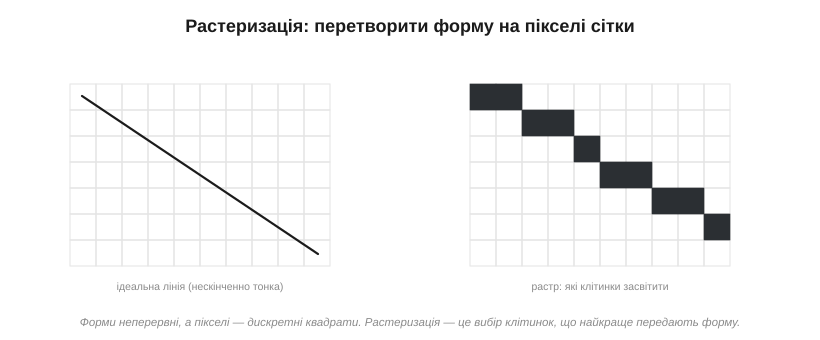
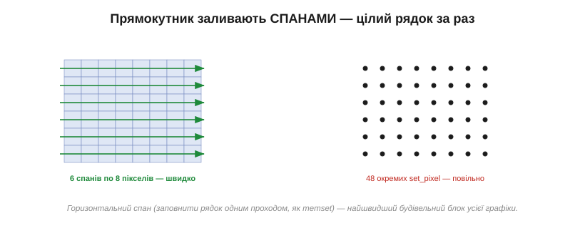
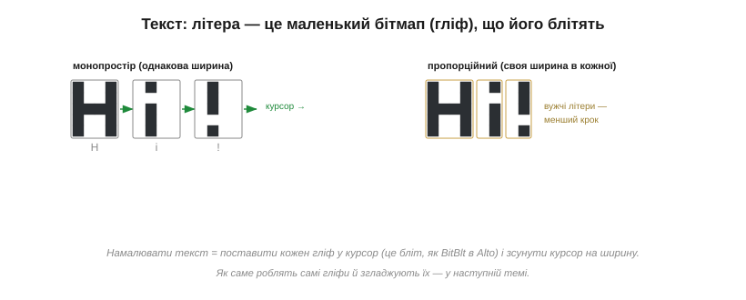
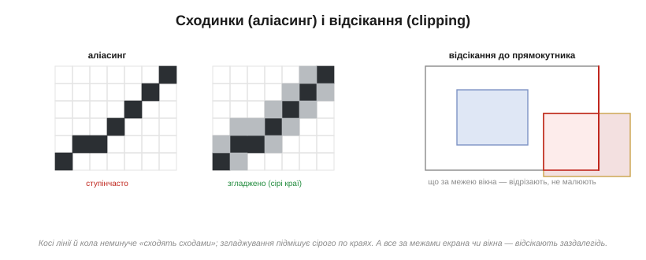

# Малювання примітивів: лінії, прямокутники, текст (растеризація)

Поставити один піксель у [кадровий буфер](book:electronics/framebuffer) і задати [його колір](book:electronics/color-formats) — справа нехитра. Та ніхто не малює інтерфейс цяткою за цяткою — ми мислимо **формами**: лінія, прямокутник, коло, рядок тексту. Завдання перетворити абстрактну форму (дві кінцеві точки, чотири кути, літеру) на той **набір пікселів**, що передає її на сітці екрана, зветься **растеризацією** (*rasterization*). Ця тема — про мистецтво робити це правильно й швидко, бо саме растеризація стоїть між «я хочу лінію» і реальними записами в кадровий буфер.

Саме слово «растр» (*raster*) походить від латинського «граблі» — і влучно: растеризація наче «прочісує» форму граблями сітки, лишаючи від неї рядок засвічених клітинок. Цей перехід від гладкої геометрії до зернистої сітки й робить екранну графіку одночасно простою в основі та сповненою дрібних хитрощів, які ми зараз і розберемо.

### Від пікселя до примітива: що таке растеризація

Корінь усієї задачі — у зіткненні двох світів. Форми, якими ми мислимо, **неперервні**: ідеальна лінія нескінченно тонка, коло гладке. А пікселі — **дискретні** квадратики жорсткої сітки. Растеризувати — означає чесно вибрати, які саме клітинки засвітити, щоб вони якнайкраще передали неперервну форму.


*Рис. Зліва — ідеальна лінія, нескінченно тонка. Справа — її растр: набір клітинок, що складаються в «сходинки», бо інакше передати косу лінію на квадратній сітці неможливо. Уся растеризація — це пошук найкращого такого наближення.*

Через цю дискретність растеризація завжди **наближення**, і в нього є ціна — ті самі «сходинки» на косих лініях. Розгортати тему зручно від простого до складного: прямокутники, потім лінії, кола й текст.

Варто відразу зрозуміти, що ця задача не зникає з ростом потужности — вона лише ховається глибше. І на крихітному монохромному екранчику, і на величезному щільному моніторі дилема та сама: неперервну форму треба вкласти в дискретну сітку, обравши клітинки. Різниця тільки в тому, що на густішій сітці сходинки дрібніші й менш помітні. Тож прийоми, які ми зараз розберемо, — не «милиці для бідного заліза», а сама основа комп'ютерної графіки; просто на мікроконтролері вони оголені до кістки, без апаратних помічників, що ховають їх у дорогих системах.

### Прямокутники й заливки: найлегше

Найпростіший примітив — **заповнений прямокутник**. Здавалося б, нічого думати: пройди подвійним циклом по всіх (x, y) у межах прямокутника й постав кожен піксель. Це працює, та коли так заливати весь екран, мільйони окремих викликів «постав піксель» гальмують. Хитрість — заливати **спанами**: оскільки рядок прямокутника — це суцільна горизонтальна смуга однакового кольору, її заповнюють **одним проходом**, як заповнюють ділянку пам'яті (memset), а не піксель за пікселем.


*Рис. Той самий прямокутник: ліворуч — шість спанів по вісім пікселів, тобто шість швидких операцій; праворуч — сорок вісім окремих set_pixel. Горизонтальний спан — заповнити цілий рядок одним махом — найшвидший будівельний блок графіки, на якому стоїть і заливка, і очищення екрана.*

Контур прямокутника — це просто його чотири сторони, тобто чотири лінії (дві горизонтальні — ті ж спани, дві вертикальні). Тож варто навчитися малювати **лінію** — і прямокутники з заливками виходять майже задарма. А от сама лінія — це вже цікаво.

Заливка, до речі, не конче суцільна. Тим самим спаном можна класти не один колір, а **візерунок** чи **градієнт** — просто значення в рядку рахують на льоту замість копіювати одне. А контур буває не в один піксель завтовшки: товсту рамку малюють або кількома вкладеними прямокутниками, або заливкою смуги по периметру. Та хоч як ускладнюй, прямокутник лишається найдешевшим примітивом — рівні, осьові межі дозволяють працювати цілими рядками, без жодної косої арифметики.

**Приклад (спан проти пікселя).** Залиймо прямокутник 100×60 пікселів:

```
по пікселю:  100 × 60 = 6 000 викликів «постав піксель»
спанами:     60 рядків     = 60 операцій заповнення
виграш:      у ~100 разів менше окремих дій
```

На цьому й видно, чому «думати спанами» — не дрібна оптимізація, а зміна **порядку величини** роботи.

### Лінії: непроста простота

Як вирішити, які пікселі складають лінію від (x0, y0) до (x1, y1)? Шкільна відповідь — рівняння y = k·x + b: крокуй по x, рахуй y, округлюй до клітинки. Воно й працює, але має дві біди. Перша — **дробові числа**: множення й округлення з плаваючою комою на дрібному мікроконтролері повільні, а то й геть недоступні. Друга, підступніша: якщо лінія крута (йде більше вгору, ніж убік), крок по x лишає в ній **діри** — на один x припадає кілька y, і пікселі не змикаються.


*Рис. Секрет рівної лінії — крокувати по **довшій** осі (тут X), даючи на кожен її крок рівно один піксель. А коли зсувати другу координату, вирішує **ціле** число-похибка: «наскільки лінія вже відійшла від поточного рядка». Переросла половину клітинки — зсунули Y, відняли назад. Жодного float.*

Розв'язок, що став класикою, оминає обидві біди. По-перше, крокують завжди по **довшій** осі — так на кожен крок припадає рівно один піксель, і дір не буває. По-друге, замість дробового y ведуть **цілу похибку** — накопичену відстань лінії від поточного рядка; коли вона переростає півклітинки, координату зсувають на піксель і похибку коригують. Усе на цілих числах, самими додаваннями й порівняннями. Це й є знаменитий алгоритм Брезенхема — настільки ощадливий, що ліг в основу графіки на найскромнішому залізі.

Реальні лінії бувають товсті й пунктирні, та обидва ускладнення лягають на той самий кістяк. Товсту лінію малюють або кількома паралельними тонкими, або як видовжений прямокутник під кутом; пунктир — просто пропускаючи частину пікселів за лічильником. Головне ж, заради чого вся ця хитрість, — швидкість: наївний спосіб на кожен піксель робить множення й округлення з комою, а Брезенхем — лише пару цілих додавань. На лінії в кількасот пікселів, ще й тисячі ліній на кадр, ця різниця й відділяє «плавно» від «гальмує».

> ⚙️ **Алгоритм.** Повний алгоритм Брезенхема для лінії й кола — з покроковою похибкою, цілими числами й псевдокодом — в алгоритмічній вставці до цієї теми (`proj-bresenham.md`).

### Кола й дуги: симетрія на поміч

Коло растеризують спорідненою ідеєю — теж цілою похибкою, що веде криву по клітинках без тригонометрії на льоту. Та коло дарує ще й чудовий подарунок — **симетрію**. Воно однакове в усіх восьми октантах, тож порахувати треба лише **одну восьму** дуги, а решту сім дістати простим **відображенням** координат по осях і діагоналі.


*Рис. Кожна обчислена точка одного октанта дає одразу вісім точок кола — дзеркальним відображенням по горизонталі, вертикалі й діагоналі. Так симетрія економить сім восьмих роботи, а самі точки знаходять цілими числами.*

Цей прийом — рахувати малий шматок і **тиражувати симетрією** — наскрізний у графіці: він економить і час, і код, і його варто впізнавати скрізь, де форма має осі симетрії.

Із цього октанта легко дістати й більше, ніж контур. **Залитий** круг виходить, якщо між симетричними точками протягти горизонтальні спани — знову той самий спан, наш найшвидший інструмент. **Дугу** малюють, обчислюючи не весь октант, а лише потрібний діапазон кутів. А **еліпс** — це те саме коло, тільки з різними кроками по двох осях. Усе сімейство круглих форм виростає з однієї цілочислової ідеї плюс симетрія — і жодної тригонометрії в гарячому циклі.

### Текст: літера — це маленький бітмап

Найуживаніший примітив інтерфейсу — **текст**, і влаштований він простіше, ніж здається. Кожна літера зберігається як крихітний **бітмап** — **гліф** (*glyph*) у складі шрифту: маленький візерунок пікселів, що зображає саме цей символ. Намалювати рядок означає поставити гліф кожної літери в поточну позицію **курсора** — а це не що інше, як [**бліт**](book:electronics/framebuffer), той самий BitBlt, що його винайшли для Alto, — і зсунути курсор на ширину літери.


*Рис. Кожна літера — маленький бітмап-гліф; малювання тексту блітить їх один за одним і щоразу посуває курсор. У **моноширинному** шрифті крок однаковий для всіх літер; у **пропорційному** — свій для кожної (вузьке «i» зсуває курсор менше за широке «H»), і текст виглядає природніше.*

Тут і ховається різниця між **моноширинним** шрифтом, де кожна літера займає однакову ширину (зручно, та «i» висить у завеликій порожнечі), і **пропорційним**, де ширина своя в кожної літери, і рядок виглядає як друкований. А **як саме** влаштований гліф усередині, як його роблять гладким і звідки беруть форми, — це окрема велика тема [про шрифти](book:electronics/fonts); тут досить бачити, що текст зводиться до тих самих блітів пікселів.

Сам шрифт при цьому — це просто **таблиця** гліфів, проіндексована кодом символу: щоб намалювати літеру, беруть її код (скажімо, ASCII), знаходять у таблиці потрібний бітмап і блітять його. Звідси й практичні турботи [роботи зі шрифтами](book:electronics/fonts): скільки символів покласти в таблицю (сама латиниця — це близько сотні гліфів, а кирилиця чи юнікод — куди більше, і всі вони їдять Flash), якої висоти їх тримати й чи рівняти проміжки між парами літер. Текст здається дрібницею — аж доки не порахуєш, скільки пам'яті з'їдає гарний великий шрифт.

Через цю вагу текст часто й стає найгарячішим місцем графіки — адже на екрані інтерфейсу літер зазвичай більше, ніж будь-чого іншого. Тому гліфи тримають у швидкій пам'яті наперед готовими, а не рахують щоразу; а незмінний текст (підписи, шкали) розумно не перемальовувати взагалі, доки він не змінився. Тут знову зринає те саме правило, що й зі спанами: найдешевша літера — та, яку не довелося малювати наново.

### Сходинки й межі: аліасинг і відсікання

Повернімося до ціни дискретности. Косі лінії й кола на квадратній сітці неминуче виходять **ступінчастими** — це **аліасинг** (*aliasing*), ті самі «драбинки» (*jaggies*). Око їх помічає, надто на плавних кривих. Лікують їх **згладжуванням** (*anti-aliasing*): крайові пікселі роблять не суто чорними чи білими, а **сірими** — пропорційно тому, яку частку клітинки накриває форма. Око зливає ці півтони в гладку межу. Найбільше згладжування важить [для шрифтів](book:electronics/fonts), де від нього прямо залежить читабельність.

Чому згладжування найважливіше саме для тексту? Бо літери — це маса дрібних косих і круглих штрихів, і на малому розмірі без згладжування вони розсипаються на нечитабельні сходинки. Великій діагональній лінії аліасинг лише псує вигляд, а дрібному шрифту відбирає **читабельність**, заради якої екран і існує. Тому в дисплеях, де багато тексту, згладжування гліфів — не косметика, а необхідність; на грубому ж монохромному екранчику від нього відмовляються, бо проміжного сірого там просто немає.


*Рис. Ліворуч: та сама коса лінія — ступінчаста й згладжена сірими крайовими пікселями. Праворуч: **відсікання** — усе, що виходить за межу екрана чи вікна, відрізають заздалегідь і не малюють.*

Друга турбота меж — **відсікання** (*clipping*). Малюючи примітив, треба не вийти за край екрана чи поточного вікна — інакше запис за межі [кадрового буфера](book:electronics/framebuffer) псує чужу пам'ять. Тому примітив **відсікають** до прямокутника видимої ділянки: або обрізають його геометрично ще до растеризації (швидко), або перевіряють кожен піксель на належність межам (просто, але повільніше). Відсікання — не дрібниця, а обов'язкова страховка кожної операції малювання.

### Швидкість: думати спанами, а не пікселями

Зведімо докупи наскрізну думку. Будь-який примітив зрештою розпадається на записи в кадровий буфер — але **як** ці записи робити, вирішує швидкість. Три правила, що проходять через усю тему: заповнюй **спанами** (цілий рядок за раз), а не пікселями; рахуй **цілими** числами (Брезенхем), а не дробовими; рухай готові шматки **блоками** (бліт), а не цяткою. Саме на цих трьох прийомах і стоїть швидка графіка на скромному залізі — а в потужніших системах ті самі спани, бліти й цілочислові лінії виконує вже апаратний 2D-прискорювач.

Є й четвертий, стратегічний прийом, що стоїть над усіма трьома: не перемальовувати того, що **не змінилося**. Найшвидший піксель — той, якого ти не торкнувся. Замість гнати весь кадр щоразу, відстежують, які ділянки справді оновилися, і чіпають лише їх. Цю «економію бездіяльністю» варто закласти в голову одразу: часто найбільший виграш дає не швидше малювання, а **відмова малювати** зайве.

> 🔧 **Навіщо це.** Коли картинка «гальмує», винні майже завжди не самі пікселі, а **спосіб** їх ставити. Перш ніж оптимізувати алгоритм, спитайте: чи заливаю я спанами, а не подвійним циклом? чи цілі в мене обчислення, без float? чи блічу готові спрайти замість малювати їх щоразу? Найбільший виграш дає не хитрий код, а перехід від «по пікселю» до «гуртом».

Підсумок простий: усе розмаїття форм — пряма, прямокутник, коло, літера — звелося до жменьки прийомів над одним масивом пам'яті. Лінію й коло веде ціла похибка, прямокутник заливають спанами, текст і спрайти переносять блоками, а зайвого не малюють зовсім. Засвоївши ці чотири рухи, ви вмієте намалювати на екрані будь-що — бо складніша графіка є лише їхньою комбінацією.

Текст тут зведено до головного — низки блітів гліфів, — але саме він найважливіший і найхитріший примітив інтерфейсу: від нього залежить, чи буде екран читабельним. Як влаштовані [шрифти](book:electronics/fonts), чим бітмапні відрізняються від векторних і як зробити літери гладкими — це окрема глибша розмова.

---
