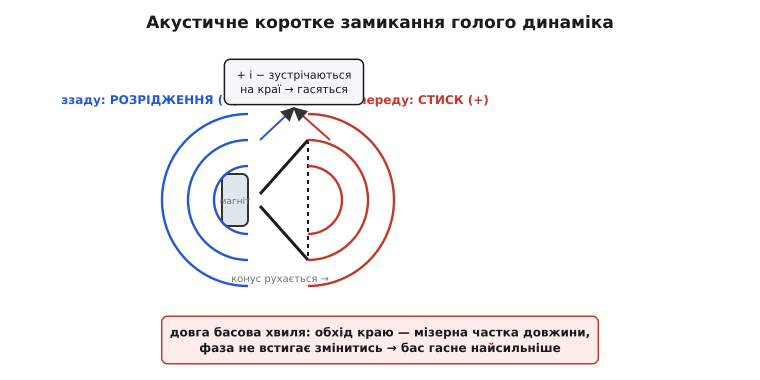
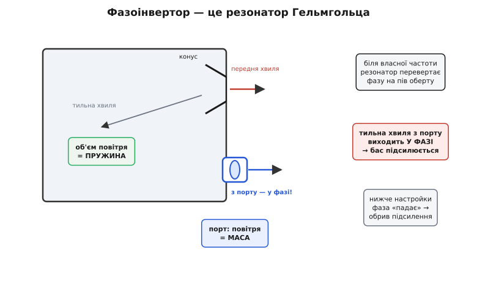
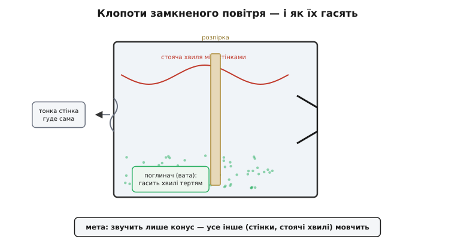

# Акустичне оформлення динаміка

<preknowlist>
- [Мікрофон і динамік](topic:electronics/microphone-speaker) — котушка на мембрані в полі магніту штовхає повітря; струм задає рух конуса.
- [Гармонічний осцилятор](topic:physics/harmonic-oscillator) — маса на пружині коливається; частота залежить від жорсткості пружини й маси.
- [Резонанс](topic:physics/resonance) — система найлегше розгойдується на своїй власній частоті.
- [Інтерференція хвиль](topic:physics/wave-interference) — дві хвилі в протифазі гасять одна одну, у фазі — складаються.
- [Акустичний імпеданс](topic:physics/acoustic-impedance) — наскільки повітря «опирається» тому, що його штовхають; малий конус на низьких частотах узгоджений з ним погано.
</preknowlist>

Візьміть гарний динамік — котушку, магніт, конус — і ввімкніть його просто так, тримаючи в руці. Він буде звучати тонко й порожньо, без жодного басу. Той самий динамік, вставлений у звичайну коробку, раптом заграє повно й глибоко. Нічого в самому перетворювачі не змінилося: та сама котушка штовхає той самий конус із тим самим струмом. Змінилося лише те, **що робиться зі звуком, який конус випромінює назад**. Уся тема акустичного оформлення (англ. *enclosure* — те, що огороджує; також **корпус**, **ящик**) — про це: як повестися з тильною хвилею динаміка, щоб вона не псувала передню.

Тобто корпус — не просто підставка й не захист від пилу. Це **акустичний елемент**, такий самий важливий для звуку, як сам динамік. І щоб зрозуміти чому, треба спершу побачити біду, яку він лікує.

## Біда голого динаміка: короткий шлях спереду назад

Конус динаміка рухається туди-сюди. Коли він іде вперед, він **стискає** повітря перед собою — і рівно тієї ж миті **розріджує** повітря позаду себе. Спереду народжується гребінь тиску, ззаду — западина. Це дві звукові хвилі, породжені одним рухом, і вони завжди **в протифазі**: де одна тисне, там друга тягне.

Поки вони летять кожна у свій бік, усе гаразд. Проблема в тому, що біля країв конуса передня й тильна хвилі зустрічаються. Повітря — не стінка; воно легко обтікає корпус динаміка з краю. Гребінь спереду й западина ззаду сходяться на обідку й **гасять одне одного** — це та сама інтерференція хвиль у протифазі, тільки тут вона працює проти нас.

> Дві хвилі однакової форми, зсунуті на пів періоду (у протифазі), у сумі дають нуль: гребінь однієї падає на западину іншої. Дві у фазі — навпаки, складаються в удвічі більшу. Тому доля тильної хвилі динаміка вирішує все: змішається з передньою в протифазі — заглушить її; повернеться у фазі — підсилить. Деталі — [інтерференція хвиль](topic:physics/wave-interference).

Ключове — що це гасіння б'є **саме по басах**, а високі майже не чіпає. Причина в довжині хвилі. Низька нота на 50 герц має хвилю близько 7 метрів; шлях, який тильна хвиля оббігає з-за краю конуса, — сантиметри, тобто мізерна частка цих 7 метрів. За такий короткий гак хвиля майже не встигає «постаріти» за фазою, тож приходить спереду досі в протифазі — і чисто гасить бас. А висока нота на 5 кілогерц має хвилю сім сантиметрів; той самий обхід краю вже дорівнює половині-цілій хвилі, фаза встигає перевернутися кілька разів, і замість чистого гасіння виходить каша, яка в середньому нічого не з'їдає. Тому голий динамік втрачає низи й лишає верхи — звідси тонкий, «телефонний» звук.

Це явище зветься **акустичне коротке замикання** (*acoustic short circuit*): тильна хвиля знаходить «коротку доріжку» до передньої, як струм знаходить коротку доріжку в замкненому колі, і зливає всю басову енергію в нікуди. Завдання корпусу — **розірвати це коротке замикання**: не дати тильній хвилі дотягтися до передньої в протифазі.


*Один рух конуса народжує дві хвилі в протифазі: стиск спереду, розрідження ззаду. Біля обідка вони зустрічаються й гасяться. Для довгих басових хвиль обхід краю — мізерна частка довжини, фаза не встигає змінитися, тож бас гине найсильніше. Корпус існує, щоб перекрити цей шлях.*

> 🔧 **Навіщо це.** Коли крихітний динамік у пластиковому гаджеті звучить бляшано й безбасово, річ рідко в самому динаміку — частіше корпус не тримає тильну хвилю (щілини, відкрита кишеня за динаміком). Розуміючи, що б'є саме по низах через коротке замикання, ви знаєте, куди дивитися: ущільнити посадку динаміка, розділити передній і тильний об'єми. Це дешевше й дієвіше, ніж міняти динамік на «кращий».

## Найпростіший розрив: перегородка й закритий ящик

Найгрубіший спосіб прибрати коротке замикання — **безмежна перегородка** (*infinite baffle*): уявіть, що динамік вмонтовано в стіну нескінченного розміру. Тоді тильна хвиля йде в інше приміщення й ніколи не зустрічається з передньою. Бас урятовано. У житті стіни скінченні, але сама ідея важлива: чим ширша дошка навколо динаміка, тим довший шлях в обхід, тим нижча нота, яку ще не встигає з'їсти коротке замикання.

Загортати динамік у стіну незручно, тож перегородку замикають самі на себе — виходить **закритий ящик** (*sealed box*, closed box): герметична коробка, до якої динамік прикручено спереду. Тепер тильна хвиля замкнена всередині й до передньої не потрапляє **взагалі**. Коротке замикання розірвано начисто.

Але замкнувши повітря в коробці, ми отримали дещо несподіване й корисне — **повітряну пружину**.

### Повітря в коробці працює як пружина

Штовхніть конус усередину закритого ящика. Він стисне повітря всередині, і стиснене повітря відштовхне його назад. Відпустіть — розрідження підтягне конус усередину. Замкнене повітря чинить опір і туди, і сюди, повертаючи конус до рівноваги, — рівно так, як поводиться **пружина**. Динамік уже мав свою механічну пружину (гнучкий підвіс, що тримає конус на місці). Тепер до неї додалася друга, повітряна, і сумарна жорсткість зросла.

> Тіло на пружині коливається на власній частоті f = (1/2π)·√(k/m): що жорсткіша пружина k і легша маса m, то частота вища. Конус із котушкою — це маса; підвіс і повітря в ящику — пружина. Додавши повітряну пружину, ми підняли k, отже підняли власну частоту всієї системи. Деталі — [гармонічний осцилятор](topic:physics/harmonic-oscillator).

Наскільки жорстка ця повітряна пружина — залежить від **об'єму коробки**. Мало повітря (маленький ящик) стиснути важко: пружина туга, жорсткість велика. Багато повітря (великий ящик) піддається легко: пружина м'яка. Ось перший практичний важіль конструктора: **розмір коробки задає жорсткість повітряної пружини, а разом із нею — власну частоту динаміка в цьому ящику й те, як низько він гратиме**.

І тут криється тонкість, яка перевертає всю інженерну інтуїцію. Зазвичай кажуть «менша коробка — гірший бас». Але в закритому ящику мала коробка означає **тугу** пружину, високу жорсткість — а висока жорсткість дає **чистіший, лінійніший** хід конуса, бо тепер рухом керує не примхливий гумовий підвіс (у якого опір нелінійно росте на краях ходу), а рівномірне, майже ідеальне повітря. Ось чому цей підхід називають **акустичним підвісом** (*acoustic suspension*): головну пружину відбирають у гуми й віддають повітрю.

Саме на цьому стоїть класична ідея [акустичного підвісу](topic:electronics/acoustic-enclosure/hist-acoustic-suspension.md): у 1954 році Едґар Вілчур показав, що маленька закрита коробка з навмисно «розхлябаним» м'яким підвісом динаміка дає більше чистого басу, ніж великі ящики до неї — бо жорсткість і лінійність задає повітря, а не гума. Так народилися перші компактні «поличкові» колонки з глибоким басом.

Ціна цього — чутливість. Туга повітряна пружина сильно опирається, тож щоб розгойдати конус на потрібну амплітуду, потрібно більше струму — акустичний підвіс «їсть» більше потужності підсилювача за той самий бас. Закритий ящик міняє **ефективність на компактність і чистоту**. За це його й люблять там, де важить точність і скромний розмір.

## Хитріший розрив: змусити тильну хвилю працювати

Закритий ящик просто **викидає** тильну хвилю — замикає її й глушить усередині. Але це половина енергії динаміка, викинута в нікуди. Виникає зухвала думка: а що, як не глушити тильну хвилю, а **розвернути її на пів оберту за фазою** й випустити назовні так, щоб вона додалася до передньої **у фазі** й підсилила бас? Тоді з тієї самої котушки й того самого струму ми дістанемо гучніший низ.

Це не фантазія — саме так працює **фазоінвертор** (*bass reflex*, ported box): закрита коробка, у стінці якої прорізано **отвір з трубкою** — **порт** (*port*). І весь фокус у тому, що коробка з портом — це **резонатор Гельмгольца**.

### Резонатор Гельмгольца: пляшка, яка гуде

Дуньте над шийкою порожньої пляшки — вона озветься глибоким гулом однієї певної висоти. Це і є резонатор Гельмгольца (за іменем Германа фон Гельмгольца, який описав його в 1860-х), і працює він так само, як маса на пружині, тільки маса й пружина тут — це саме повітря.

**Повітря в шийці пляшки** (чи в порту коробки) — це компактна пробка, яка має **масу** й може рухатися туди-сюди як єдине ціле. **Повітря в тілі пляшки** (в об'ємі коробки) — це **пружина**: коли пробка в шийці вдавлюється всередину, вона стискає його, і воно відштовхує пробку назад. Маса пробки на пружині об'єму — готовий осцилятор зі своєю власною частотою. Штовхнеш його — він задзвенить саме на цій ноті.

> Резонатор Гельмгольца — акустичний аналог маси на пружині: повітря в горлі порту грає роль маси m, повітря в об'ємі коробки — роль пружини. Власна частота падає, коли об'єм більший (м'якша пружина) або порт довший і вужчий (важча пробка). Це той самий [резонанс](topic:physics/resonance), лише зібраний із повітря.

Тепер зберемо картину. Тильна хвиля динаміка не глушиться в коробці — вона **розгойдує цей повітряний резонатор**. А в резонатора є магічна властивість: **біля своєї власної частоти він віддає рух із зсувом фази приблизно на пів оберту**. Інженери підбирають об'єм коробки й розміри порту так, щоб ця власна частота лягла якраз туди, де голий динамік починав втрачати бас. І там стається диво: тильна хвиля, перевернута резонатором на пів оберту, виходить із порту **у фазі** з передньою — і **додається** до неї. У вузькій смузі навколо настройки колонка грає помітно нижче й гучніше, ніж той самий динамік у закритому ящику.


*Тильна хвиля конуса розгойдує повітряний резонатор: пробка повітря в порту (маса) гойдається на пружині об'єму коробки. Біля власної частоти резонатор перевертає фазу на пів оберту, тож порт випромінює у фазі з передньою хвилею й підсилює бас саме там, де закритий ящик уже здавав. Нижче настройки фаза «падає» й підсилення зникає різко.*

За це підсилення теж треба платити, і плата специфічна. **Нижче** частоти настройки резонатор перестає допомагати й починає шкодити: фаза «провалюється», порт випускає тильну хвилю вже в протифазі, і конус лишається майже без опору повітряної пружини — на дуже низьких нотах він «висить у порожнечі» й може небезпечно розгойдатися на великій амплітуді (тому фазоінвертори чутливіші до перевантаження глибоким басом, ніж закриті ящики). І сама віддача басу нижче настройки падає **різко, обривом**, а не плавним схилом, як у закритого ящика. Тож фазоінвертор дає **більше басу до певної межі, але за нею — стрімкий обрив**; закритий ящик дає менше, зате плавно й далеко вниз. Це фундаментальний обмін, і вибір між ними — вибір характеру басу.

Практичне правило настройки виходить прямо з фізики резонатора Гельмгольца. Хочете настроїти порт нижче — або **збільшуйте об'єм** коробки (м'якша пружина), або **робіть порт довшим/вужчим** (важча повітряна пробка). Тому в реальних колонках порт часто буває довгою трубою, згорнутою всередині ящика: щоб дати повітряній пробці достатню масу для низької настройки, не роздуваючи корпус.

## Скільки повітря треба: параметри Тіле–Смолла

Досі ми говорили «підібрати об'єм під динамік» на пальцях. Насправді за цим стоїть точна інженерія, і вона тримається на невеликому наборі чисел, що описують саме цей динамік, — **параметрах Тіле–Смолла** (*Thiele–Small parameters*, за іменами Ніва Тіле та Річарда Смолла, які в 1961–1972 роках звели поведінку динаміка в коробці до кількох вимірюваних величин).

Три з них — головні для вибору корпусу:

- **f_s** — власна частота динаміка на вільному повітрі (free-air resonance): наскільки низько гойдається його маса на його підвісі **без** коробки.
- **V_as** — «еквівалентний об'єм»: об'єм повітря, чия пружність дорівнює пружності підвісу цього динаміка. Це і є мірило, скільки повітря динамік «хоче»: м'який податливий підвіс дає велике V_as (динамік проситься у велику коробку), туга — мале.
- **Q_ts** — добротність: наскільки динамік схильний до різкого резонансного піку. Мала Q_ts — динамік добре демпфований, проситься у фазоінвертор; велика — краще сяде в закритий ящик.

Уся [математика підбору об'єму](topic:electronics/acoustic-enclosure/math-box-tuning.md) зводить ці числа до розміру коробки й настройки порту. Але навіть без формул видно логіку: об'єм коробки треба міряти **проти V_as** конкретного динаміка, а не «щоб гарно виглядало». Тому лобовий перерахунок такий:

**Умова: закритий ящик, у скільки разів підскочить частота динаміка.**
Власна частота динаміка в закритому ящику росте від додаткової повітряної пружини. Простий вираз для резонансу в закритому ящику:

```
f_c = f_s · √(1 + V_as / V_box)

Візьмемо динамік:  f_s = 40 Гц,  V_as = 20 літрів.
Коробка V_box = 20 л (дорівнює V_as):
    f_c = 40 · √(1 + 20/20) = 40 · √2 ≈ 56.6 Гц
Коробка V_box = 5 л (учетверо менша):
    f_c = 40 · √(1 + 20/5)  = 40 · √5 ≈ 89.4 Гц
```

Висновок читається одразу: **менша коробка задирає нижню частоту динаміка вгору** — з 40 герц він у 20-літровому ящику опускається лише до ~57 Гц, а в 5-літровому — уже до ~89 Гц, тобто половину басу втрачено. Ось чому маленькі колонки фізично не можуть грати глибокий бас: замало повітря, туга пружина, висока f_c. І ось чому сабвуфер — це велика коробка з великим динаміком: щоб опустити f_c до по-справжньому низьких нот, потрібен великий об'єм повітря як м'яка пружина.

> 🔧 **Навіщо це.** Коли ви ставите готовий динамік у свій прилад, не вгадуйте об'єм. Візьміть його f_s і V_as з даташита, прикиньте f_c за формулою вище — і одразу побачите, чи взагалі досягнете потрібного низу в тому корпусі, що влазить у виріб. Часто відповідь «ні, у цей об'єм бас не влізе» приходить за хвилину рахунку й рятує від марного макета. А якщо об'єму замало — це сигнал брати фазоінвертор або менші вимоги до басу, а не «сильніший» динамік.

## Що всередині коробки має значення

Розірвати коротке замикання — головне, але не єдине завдання корпусу. Замкнувши повітря, ми створили **порожнину**, а порожнини мають свої неприємні звички.

**Стоячі хвилі всередині.** Звук усередині ящика б'ється між паралельними стінками туди-сюди. На частотах, де між стінками вкладається ціла кількість пів-хвиль, коливання складаються самі з собою в **стоячу хвилю** — гучний внутрішній резонанс, який продавлюється крізь конус назад у кімнату брудним призвуком. Лікують це двома шляхами: не роблять стінки строго паралельними (щоб хвилі не било чітко назад) і **набивають ящик поглиначем** — ватою, синтепоном, мінеральною ватою. Пухкий матеріал перетворює метушню повітря в тепло через тертя й гасить внутрішні резонанси.

Цікаво, що поглинач робить і другу, тоншу послугу: він **сповільнює** стиск-розширення повітря в ящику, роблячи їх майже ізотермічними (повітря встигає віддати тепло волокнам), а не адіабатичними. Через це напхана коробка «здається» динаміку трохи більшою, ніж вона є, — інколи на 15–20% за об'ємом. Даровий бонус для тісного корпусу.

**Стінки, що гудуть.** Тиск усередині хитає не лише повітря, а й самі стінки коробки. Тонка стінка вигинається в такт музиці й **сама стає динаміком** — випромінює власний паразитний звук, розмиваючи чистоту. Тому добрі корпуси роблять із товстого, глухого матеріалу (щільна деревна плита), а великі стінки скріплюють зсередини **розпірками** (*bracing*), щоб вони не «дихали». Правило просте: **корпус має мовчати, звучати повинен лише конус**. Усе, що гуде крім конуса, — це спотворення.

**Герметичність.** У закритому ящику будь-яка щілина — крихітне «коротке замикання»: тильна хвиля цідиться назовні й псує бас, а на низах ще й свистить крізь нещільність. Тому посадку динаміка ущільнюють, а всі шви проклеюють. У фазоінверторі навпаки — єдиний контрольований отвір (порт) має бути точно розрахованим, а решта коробки — так само глухою.


*Замкнене повітря породжує внутрішні клопоти: між паралельними стінками стоять резонанси, тонкі стінки вигинаються й самі випромінюють призвук. Поглинач (вата) гасить стоячі хвилі тертям і трохи «збільшує» об'єм; розпірки роблять стінки жорсткими, щоб мовчали. Мета — щоб звучав лише конус.*

## Як це впізнати навколо

Тепер оформлення видно всюди, і за одним поглядом можна вгадати компроміс, на який пішов виробник. **Закритий ящик без отворів** — точний, чистий, плавно спадний бас: студійні монітори, багато поличкових колонок, автомобільні сабвуфери, де важлива керованість. **Отвір-порт на передній чи задній стінці** (кругла дірка або щілина) — фазоінвертор: більше басу з тієї ж коробки, гучніше й нижче до межі настройки, ціною різкого обриву під нею й чутливості до перевантаження; це більшість підлогових колонок і портативних «бумбоксів». **Крихітна пластикова кишенька за динаміком телефона чи ноутбука** — теж мікроскопічний закритий об'єм: інженери відвойовують кожен кубічний міліметр, бо навіть така коробочка рятує рештки басу від короткого замикання.

І скрізь працює той самий ланцюг думки, з якого ми почали. Динамік випромінює дві хвилі в протифазі; гола — вони гасять бас коротким замиканням; корпус розриває це замикання — грубо (закритий ящик, повітря-пружина) або хитро (фазоінвертор, резонатор Гельмгольца перевертає тильну хвилю й додає її назад). А розмір коробки, порт, поглинач і жорсткість стінок — це важелі, якими інженер вибирає, наскільки низько, наскільки гучно й наскільки чисто заграє той самий динамік. Корпус не менш важливий за перетворювач: він вирішує долю половини всього звуку — тієї, що йде назад.
