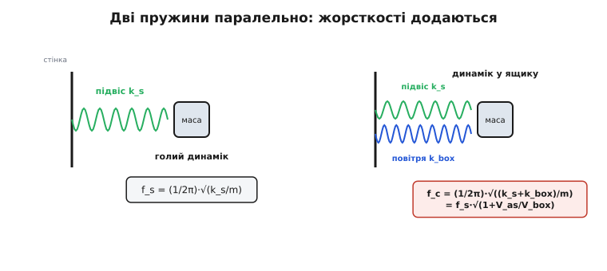
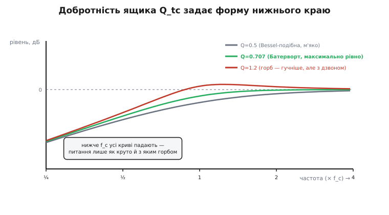

# 🧮 Математика підбору об'єму й настройки: від параметрів Тіле–Смолла до розміру коробки й довжини порту

> Це математична вставка про підбір акустичного оформлення динаміка. «Взяти об'єм під динамік» звучить як мистецтво на око, але насправді це арифметика на кількох числах із даташита. Тут — що означає кожне з цих чисел фізично, звідки береться формула резонансу закритого ящика f_c = f_s·√(1+V_as/V_box) (з першопринципу — жорсткості додаються), звідки формула настройки порту через резонатор Гельмгольца, як цільова добротність Q_tc вирішує форму басу, і чому одне число — Q_ts — уже підказує, закритий ящик чи фазоінвертор. Наприкінці — реальний код прошивки, який рахує об'єм і довжину порту.

Динамік у коробці — це маса на пружині, і вся математика оформлення тримається на цьому одному факті. Конус із котушкою — маса. Підвіс — пружина. Повітря в закритій коробці — **друга** пружина, підключена паралельно першій. Порт у фазоінверторі — **ще одна** маса, що гойдається на пружині коробки. Щойно ми вкладемо ці ролі в числа, розмір ящика перестане бути здогадом і стане розрахунком.

### Означення: шість чисел, що описують динамік

Невіл Тіле та Річард Смолл показали, що низькочастотну поведінку динаміка в коробці задає жменя вимірюваних величин — **параметри Тіле–Смолла** (*Thiele–Small parameters*). Це не абстракції: кожне число — коефіцієнт у рівнянні маси на пружині, тільки записаний мовою, яку легко зняти приладом. Ось ті, що вирішують долю оформлення.

**f_s — власна частота на вільному повітрі** (*free-air resonance*; індекс *s* — від *suspension*, підвіс). Це частота, на якій гойдається маса рухомої системи M_ms на пружині підвісу C_ms, коли динамік висить у повітрі без жодної коробки:

```
f_s = 1 / (2π·√(M_ms · C_ms))
```

Тут C_ms — **піддатливість** (*compliance*) підвісу: наскільки легко він прогинається під силою, метрів на ньютон. Піддатливість — величина, обернена до жорсткості: C = 1/k. М'який підвіс — велика C_ms, низька f_s. Це та сама формула [гармонічного осцилятора](book:physics/harmonic-oscillator) f = (1/2π)·√(k/m), лише жорсткість k записана як 1/C_ms.

**V_as — еквівалентний об'єм піддатливості** (*equivalent compliance volume*). Ось найтонше з понять і водночас найважливіше для вибору коробки. Пружність підвісу можна виразити не в ньютонах на метр, а в **літрах повітря**: V_as — це об'єм замкненого повітря, чия пружність (як пружини) точно дорівнює пружності підвісу цього динаміка, коли на нього тиснуть площею конуса S_d. Формально:

```
V_as = ρ · c² · S_d² · C_ms
```

де ρ — густина повітря (≈ 1.2 кг/м³), c — швидкість звуку (≈ 343 м/с при 20 °C), S_d — ефективна площа конуса. Читається так: **V_as — це «скільки повітря коштує підвіс»**. М'який податливий підвіс (велика C_ms) дорівнює великому об'єму повітря — динамік «проситься» у велику коробку. Тугий підвіс — мале V_as, динамік задовольниться малим ящиком. Ми ще побачимо, що весь розрахунок об'єму — це порівняння коробки з V_as, а не з абсолютними літрами.

> 🔧 **Навіщо це.** V_as — єдиний місток між механікою підвісу й геометрією ящика. Без нього ви не знаєте, чи ваша коробка «велика» чи «мала» для цього динаміка: 5 літрів — це багато для пищавки з V_as = 2 л і мізер для баса з V_as = 80 л. Тому перший погляд у даташит — саме на V_as: він одразу задає масштаб, у якому взагалі має сенс говорити про об'єм.

**Q_ts, Q_es, Q_ms — добротності.** [Добротність](book:electronics/quality-factor) Q міряє, наскільки гостро резонує система: висока Q — вузький різкий пік і довгий дзвін, низька Q — широкий пологий горб, що швидко згасає. У динаміка втрати двоякі, тож і добротностей три.

- **Q_ms — механічна добротність**: втрати самої механіки (тертя в підвісі, в'язкість повітря навколо конуса). Зазвичай висока (кілька одиниць) — механіка втрачає мало.
- **Q_es — електрична добротність**: втрати через електричну частину. Коли конус рухається, котушка в полі магніту генерує зустрічну напругу (протиЕРС), яка через опір котушки R_e й вихідний опір підсилювача розсіює енергію — це **електричне демпфування**. Сильний магніт і товстий провід дають малу Q_es: рух конуса гальмується електрично, різкість резонансу згладжується.
- **Q_ts — повна добротність**: обидва канали втрат разом. Оскільки це дві паралельні «стежки», якими втікає енергія, добротності складаються як паралельні опори:

```
Q_ts = (Q_ms · Q_es) / (Q_ms + Q_es)
```

Q_ts завжди менша за кожну зі складових (паралель завжди менша за найменший доданок). У більшості динаміків Q_es набагато менша за Q_ms, тож Q_ts ≈ Q_es — тобто повну добротність фактично диктує сила магніту. Саме Q_ts — те одне число, що підкаже тип оформлення.

**V_box (V_b) — об'єм коробки.** Наша шукана величина: скільки літрів повітря замкнути за динаміком. Усе, що далі, — це як від f_s, V_as, Q_ts дійти до V_box і до розмірів порту.

### Інтуїція: пружини складаються, тому частота росте

Перш ніж виводити формулу закритого ящика, треба відчути, **чому** замкнене повітря піднімає частоту — і саме на корінь.

Дві пружини, що тягнуть ту саму масу в одному напрямку, — це **паралельне** з'єднання, і в паралелі **жорсткості додаються**. Це не аналогія, а пряма механіка: якщо перша пружина відповідає на зсув x силою k₁·x, а друга — k₂·x, то разом вони штовхають масу силою (k₁+k₂)·x. Сумарна пружина жорсткіша за кожну поодинці.


*Голий динамік — маса M_ms на пружині підвісу k_s, частота f_s. У закритому ящику паралельно вмикається повітряна пружина k_box: жорсткості додаються (k_s+k_box), а що жорсткіша пружина, то вища частота — звідси f_c = f_s·√(1+V_as/V_box). Об'єм коробки задає k_box: мала коробка — туга пружина — сильний підскок частоти.*

Тепер згадаймо, що піддатливість — обернена жорсткість (C = 1/k), а V_as — це просто пружність підвісу, виражена в об'ємі повітря. Повітряна пружина коробки має свою піддатливість C_box, і в тих самих одиницях об'єму вона дорівнює просто V_box (з точністю до того самого множника ρc²S_d²). Тобто:

- пружність підвісу ↔ об'єм V_as,
- пружність повітря в коробці ↔ об'єм V_box.

Оскільки в паралелі складаються **жорсткості** (обернені піддатливості), а піддатливості пропорційні об'ємам, то сумарна жорсткість відносно початкової більша в

```
k_total / k_s = 1 + k_box/k_s = 1 + V_as/V_box
```

разів. Ось звідки береться множник (1 + V_as/V_box): це просто «у скільки разів жорсткіша об'єднана пружина». Дільники V_as/V_box, а не навпаки, бо жорсткість **обернено** пропорційна об'єму — мала коробка (малий V_box у знаменнику) дає велике відношення, тобто сильний приріст жорсткості.

### Формальний апарат: резонанс закритого ящика

Частота маси на пружині — корінь із жорсткості (при незмінній масі):

```
f ∝ √k        →        f_c / f_s = √(k_total / k_s) = √(1 + V_as/V_box)
```

Маса рухомої системи від коробки не змінюється (той самий конус, та сама котушка), тож у відношенні частот лишається тільки корінь із відношення жорсткостей. Звідси — робоча формула закритого ящика:

```
f_c = f_s · √(1 + V_as / V_box)
```

Це центральне рівняння всього закритого оформлення. Прочитаймо його три способи:

1. **V_box = V_as** (коробка дорівнює еквівалентному об'єму): f_c = f_s·√2 ≈ 1.41·f_s. Повітря додало рівно стільки ж жорсткості, скільки давав підвіс, — сумарна вдвічі більша, частота вгору в √2.
2. **V_box → ∞** (нескінченна коробка, тобто безмежна перегородка): V_as/V_box → 0, f_c → f_s. Повітря так багато, що його пружність нікчемна поруч із підвісом; динамік поводиться як голий.
3. **V_box → 0** (крихітна коробка): відношення злітає, f_c → ∞. Замало повітря — туга пружина задирає частоту, глибокий бас недосяжний фізично.

Але f_c — не єдине, що змінює коробка. Та сама повітряна пружина, що підняла частоту, піднімає й **добротність**. Логіка та сама: Q системи росте з жорсткістю при незмінних втратах (гостріший резонанс), і виявляється — рівно в тому самому корені. Так з'являється **Q_tc** — повна добротність динаміка **в коробці** (*total-closed*):

```
Q_tc = Q_ts · √(1 + V_as / V_box)     =     Q_ts · (f_c / f_s)
```

Це елегантно: **відношення f_c/f_s і відношення Q_tc/Q_ts — те саме число**. Тому не можна окремо вибрати частоту й окремо добротність: обравши об'єм, ви задаєте обидва разом. Оце й перетворює вибір коробки на компроміс, а не на вільний вибір двох ручок.

### Інтуїція: яку добротність ми взагалі хочемо

Q_tc — це форма нижнього краю АЧХ. Різні цільові Q_tc дають різні характери басу, і в конструктора є класичний набір «настройок» (*alignments*), кожна з яких — це просто певне значення Q_tc.


*Нижче f_c усі закриті ящики спадають на 12 дБ/октаву — питання лише в тому, як підійти до зламу. Q=0.5 (критично-подібне демпфування) спадає плавно, але рано, жертвуючи віддачею заради ідеального перехідного процесу. Q=0.707 (Батерворт) — максимально рівна крива без горба, найнижчий −3 дБ при рівному ході: класичний компроміс. Q≈1.2 дає горб перед спадом — суб'єктивно «гучніший» бас, але з призвуком і гіршим ударом.*

Три орієнтири, що варто знати напам'ять:

- **Q_tc = 0.707 = 1/√2 — Батерворт** (*maximally flat*, за іменем британця Стівена Батерворта, який 1930 року описав максимально рівний фільтр). Крива не має горба й тягнеться найрівніше, а точка −3 дБ збігається саме з f_c. Це «золотий стандарт» для точного звуку: жодного забарвлення, чистий перехідний процес.
- **Q_tc = 0.577 = 1/√3 — Бессель-подібна**: максимально рівна групова затримка, найкращий перехідний процес (найточніший удар), але бас спадає ще раніше. Беруть, коли важить чіткість атаки понад глибину.
- **Q_tc ≈ 1.0–1.2 — Чебишов-подібна** (з горбом): вужча смуга рівності, зате перед спадом крива підскакує над нуль — суб'єктивно більше басу й вища віддача, ціною дзвону й розмитого удару. Так часто налаштовують «гучні» побутові колонки.

Формула max-flat Батерворта — не випадкове число. Для передавальної функції другого порядку горб зникає рівно тоді, коли Q = 1/√2: при більшій Q знаменник |H| має мінімум усередині смуги (звідси пік), при Q = 0.707 цей мінімум виходить точно на край і крива стає монотонною. Тому 0.707 — межа, за якою починається горб, і природний вибір «якнайрівніше, але вже без утрат смуги».

### Формальний апарат: від бажаної Q_tc — назад до об'єму

Досі ми йшли «дано об'єм → яка частота». На практиці інженер іде **навпаки**: «хочу таку-то Q_tc → який об'єм?». Обертаємо формулу Q_tc відносно V_box.

Позначмо ціль α = Q_tc/Q_ts (у скільки разів піднімаємо добротність). Тоді α = √(1 + V_as/V_box), звідки:

```
α² = 1 + V_as/V_box
V_box = V_as / (α² − 1)     де  α = Q_tc / Q_ts
```

І тут відкривається головний зв'язок між **Q_ts динаміка** й **типом оформлення**. Дивимось на знаменник (α²−1):

- Якщо **Q_ts вже близька до 0.7** (наприклад 0.6), то α = 0.707/0.6 ≈ 1.18, α²−1 ≈ 0.39, і V_box = V_as/0.39 ≈ 2.6·V_as — потрібна помірна коробка. Динамік із «високою» Q_ts **сам майже готовий** до Батерворта, лишається трохи підняти добротність малою коробкою. Такий динамік — **природний кандидат у закритий ящик**.
- Якщо **Q_ts мала** (наприклад 0.3), то α = 0.707/0.3 ≈ 2.36, α²−1 ≈ 4.55, V_box = V_as/4.55 ≈ 0.22·V_as — потрібна крихітна коробка, щоб догнати добротність до 0.7. А головне — сильно демпфований динамік (мала Q_ts) у закритому ящику дає **надто пологий, «сухий» бас із заниженою віддачею**. Зате така мала Q_ts — ідеал для **фазоінвертора**: там порт додає власне демпфування й резонанс, а низька Q_ts динаміка якраз під це й розрахована.

Ось те практичне правило, заради якого існують ці параметри: **Q_ts ≳ 0.5 штовхає до закритого ящика, Q_ts ≲ 0.4 — до фазоінвертора**, а проміжок 0.4–0.5 годиться і туди, і туди. Грубий орієнтир, який часто цитують: показник **EBP = f_s / Q_es** (*efficiency bandwidth product*) — нижче ~50 радить закритий ящик, вище ~100 — фазоінвертор. Це та сама думка з іншого боку: мала Q_es (сильний магніт) підіймає EBP і веде до порту.

> 🔧 **Навіщо це.** Перш ніж креслити коробку, подивіться на Q_ts у даташиті — і тип оформлення обереться майже сам. Витратити тиждень на закритий ящик під динамік із Q_ts = 0.25 — це заздалегідь програти: бас вийде млявий, хоч який об'єм. Q_ts — компас; f_s і V_as — уже масштаб карти.

### Формальний апарат: настройка порту як резонатор Гельмгольца

У фазоінверторі об'єм коробки — тільки половина розрахунку; друга половина — **порт**. Порт із коробкою утворюють [резонатор](book:physics/resonance) Гельмгольца: пробка повітря в трубці — маса, повітря в коробці — пружина. Виведемо його частоту з тих самих першопринципів.

**Маса повітряної пробки** в порту площею A і довжиною L:

```
m_port = ρ · A · L        (густина × об'єм пробки)
```

**Жорсткість повітряної пружини** коробки. Стисніть пробку на малий зсув x усередину — вона зменшить об'єм коробки на ΔV = A·x. Повітря стискається адіабатично, тож приріст тиску Δp = γ·p₀·ΔV/V, а через означення швидкості звуку c² = γ·p₀/ρ це зручно переписати як Δp = ρc²·(A·x)/V. Ця надлишкова напруга штовхає пробку назад силою F = Δp·A = ρc²·A²·x/V. Жорсткість — сила на зсув:

```
k_air = ρ · c² · A² / V
```

Тепер частота маси m_port на пружині k_air — знову формула гармонічного осцилятора:

```
f_b = (1/2π)·√(k_air / m_port) = (1/2π)·√( ρc²A²/V  ·  1/(ρAL) )
```

Густина ρ скорочується (пружність і маса обидві від повітря — ознака, що це чисто геометричний резонанс), і лишається чиста формула Гельмгольца:

```
f_b = (c / 2π) · √( A / (V · L_eff) )
```

де A — площа перерізу порту, V — об'єм коробки, L_eff — **ефективна** довжина порту. Читається одразу: настройка падає, коли коробка більша (м'якша пружина), порт вужчий (легша… ні — важча пробка при тій самій довжині? обережно: A стоїть і в чисельнику) — тому корисніше думати так: **ширший порт піднімає f_b, довший порт і більший об'єм — знижують**.

**Кінцева поправка.** Тут криється підступ, на якому спотикаються новачки. Повітря не зупиняється рівно на зрізі трубки: пробка «звисає» назовні на обох кінцях, тож ефективна маса більша, ніж дає гола фізична довжина. Це **кінцева поправка** (*end correction*):

```
L_eff = L_phys + 0.85·(2r)·(кількість відкритих кінців з урахуванням фланця)
```

Практичні варіанти: для порту, що обома кінцями виходить у вільний простір (обидва фланцевані), додають ≈ 0.85·d з кожного боку, разом **≈ 1.7·r** до фізичної довжини; для типового порту-трубки в стінці часто беруть коефіцієнт ≈ 1.463·r. Ця добавка мала для короткого широкого порту, але для довгої вузької трубки може становити помітну частку — і якщо її знехтувати, реальна настройка виявиться нижчою за розрахункову. Тому в проєкті **завжди рахують L_eff, а ріжуть трубку на L_phys = L_eff − поправка**.

**Куди ставити f_b.** У класичному Батервортовому фазоінверторі четвертого порядку (B4) є єдина точка, де все сходиться ідеально: об'єм і настройку добирають так, щоб f_b ≈ f_s, а сам динамік мусить мати **Q_ts ≈ 0.383**. Це і є та «магічна» настройка, коли порт продовжує бас рівно вниз без горба. Динаміки з Q_ts помітно більшою за 0.4 у точний B4 не лягають — звідси й правило «мала Q_ts → фазоінвертор».

### Числовий приклад: рахуємо об'єм закритого ящика в прошивці

Зберемо все у код. Уявімо мікроконтролер, що допомагає підібрати корпус: у нього забиті параметри динаміка, він рахує потрібний об'єм під бажану Q_tc і одразу каже, яка вийде частота −3 дБ. Це реальна арифметика C, не псевдокод.

**Умова: динамік f_s = 40 Гц, V_as = 20 л, Q_ts = 0.35; ціль Q_tc = 0.707 (Батерворт).**

:::tabs
```c
#include <stdio.h>
#include <math.h>

/* Параметри Тіле–Смолла — просто з даташита */
typedef struct {
    float fs;      /* власна частота, Гц           */
    float vas;     /* еквівалентний об'єм, літри   */
    float qts;     /* повна добротність            */
} Driver;

/* Об'єм закритого ящика під бажану Q_tc.
   Виводиться з V_box = V_as / (α² − 1), де α = Q_tc/Q_ts. */
float sealed_volume_litres(const Driver *d, float qtc_target)
{
    float alpha = qtc_target / d->qts;      /* у скільки разів піднімаємо Q */
    float denom = alpha * alpha - 1.0f;     /* α² − 1                       */
    if (denom <= 0.0f) return -1.0f;        /* Q_tc ≤ Q_ts недосяжна в ЗАКРИТОМУ ящику */
    return d->vas / denom;
}

/* Частота −3 дБ (для Батерворта Q_tc=0.707 вона дорівнює f_c). */
float closed_box_fc(const Driver *d, float vbox_litres)
{
    return d->fs * sqrtf(1.0f + d->vas / vbox_litres);
}

int main(void)
{
    Driver woofer = { .fs = 40.0f, .vas = 20.0f, .qts = 0.35f };

    float qtc = 0.707f;
    float vbox = sealed_volume_litres(&woofer, qtc);
    float fc   = closed_box_fc(&woofer, vbox);

    printf("Ціль Q_tc = %.3f\n", qtc);
    printf("Об'єм коробки V_box = %.1f л\n", vbox);
    printf("Частота в ящику f_c = %.1f Гц\n", fc);
    return 0;
}
```
```cpp
#include <cmath>
#include <print>

// Параметри Тіле–Смолла — просто з даташита
struct Driver {
    float fs;      // власна частота, Гц
    float vas;     // еквівалентний об'єм, літри
    float qts;     // повна добротність
};

// Об'єм закритого ящика під бажану Q_tc.
// Виводиться з V_box = V_as / (α² − 1), де α = Q_tc/Q_ts.
float sealed_volume_litres(const Driver& d, float qtc_target)
{
    float alpha = qtc_target / d.qts;       // у скільки разів піднімаємо Q
    float denom = alpha * alpha - 1.0f;     // α² − 1
    if (denom <= 0.0f) return -1.0f;        // Q_tc ≤ Q_ts недосяжна в ЗАКРИТОМУ ящику
    return d.vas / denom;
}

// Частота −3 дБ (для Батерворта Q_tc=0.707 вона дорівнює f_c).
float closed_box_fc(const Driver& d, float vbox_litres)
{
    return d.fs * std::sqrt(1.0f + d.vas / vbox_litres);
}

int main()
{
    Driver woofer{ .fs = 40.0f, .vas = 20.0f, .qts = 0.35f };

    float qtc  = 0.707f;
    float vbox = sealed_volume_litres(woofer, qtc);
    float fc   = closed_box_fc(woofer, vbox);

    std::println("Ціль Q_tc = {:.3f}", qtc);
    std::println("Об'єм коробки V_box = {:.1f} л", vbox);
    std::println("Частота в ящику f_c = {:.1f} Гц", fc);
}
```
```python
import math
from dataclasses import dataclass


@dataclass
class Driver:
    fs: float   # власна частота, Гц
    vas: float  # еквівалентний об'єм, літри
    qts: float  # повна добротність


def sealed_volume_litres(d: Driver, qtc_target: float) -> float:
    """Об'єм закритого ящика під бажану Q_tc.

    Виводиться з V_box = V_as / (α² − 1), де α = Q_tc/Q_ts.
    """
    alpha = qtc_target / d.qts       # у скільки разів піднімаємо Q
    denom = alpha * alpha - 1.0      # α² − 1
    if denom <= 0.0:
        return -1.0                  # Q_tc ≤ Q_ts недосяжна в ЗАКРИТОМУ ящику
    return d.vas / denom


def closed_box_fc(d: Driver, vbox_litres: float) -> float:
    """Частота −3 дБ (для Батерворта Q_tc=0.707 вона дорівнює f_c)."""
    return d.fs * math.sqrt(1.0 + d.vas / vbox_litres)


woofer = Driver(fs=40.0, vas=20.0, qts=0.35)

qtc = 0.707
vbox = sealed_volume_litres(woofer, qtc)
fc = closed_box_fc(woofer, vbox)

print(f"Ціль Q_tc = {qtc:.3f}")
print(f"Об'єм коробки V_box = {vbox:.1f} л")
print(f"Частота в ящику f_c = {fc:.1f} Гц")
```
```js
// Параметри Тіле–Смолла — просто з даташита: { fs, vas, qts }

// Об'єм закритого ящика під бажану Q_tc.
// Виводиться з V_box = V_as / (α² − 1), де α = Q_tc/Q_ts.
function sealedVolumeLitres(d, qtcTarget) {
  const alpha = qtcTarget / d.qts;   // у скільки разів піднімаємо Q
  const denom = alpha * alpha - 1.0; // α² − 1
  if (denom <= 0.0) return -1.0;     // Q_tc ≤ Q_ts недосяжна в ЗАКРИТОМУ ящику
  return d.vas / denom;
}

// Частота −3 дБ (для Батерворта Q_tc=0.707 вона дорівнює f_c).
function closedBoxFc(d, vboxLitres) {
  return d.fs * Math.sqrt(1.0 + d.vas / vboxLitres);
}

const woofer = { fs: 40.0, vas: 20.0, qts: 0.35 };

const qtc = 0.707;
const vbox = sealedVolumeLitres(woofer, qtc);
const fc = closedBoxFc(woofer, vbox);

console.log(`Ціль Q_tc = ${qtc.toFixed(3)}`);
console.log(`Об'єм коробки V_box = ${vbox.toFixed(1)} л`);
console.log(`Частота в ящику f_c = ${fc.toFixed(1)} Гц`);
```
```go
package main

import (
	"fmt"
	"math"
)

// Driver — параметри Тіле–Смолла, просто з даташита.
type Driver struct {
	fs  float64 // власна частота, Гц
	vas float64 // еквівалентний об'єм, літри
	qts float64 // повна добротність
}

// sealedVolumeLitres — об'єм закритого ящика під бажану Q_tc.
// Виводиться з V_box = V_as / (α² − 1), де α = Q_tc/Q_ts.
func sealedVolumeLitres(d Driver, qtcTarget float64) float64 {
	alpha := qtcTarget / d.qts // у скільки разів піднімаємо Q
	denom := alpha*alpha - 1.0 // α² − 1
	if denom <= 0.0 {
		return -1.0 // Q_tc ≤ Q_ts недосяжна в ЗАКРИТОМУ ящику
	}
	return d.vas / denom
}

// closedBoxFc — частота −3 дБ (для Батерворта Q_tc=0.707 вона дорівнює f_c).
func closedBoxFc(d Driver, vboxLitres float64) float64 {
	return d.fs * math.Sqrt(1.0+d.vas/vboxLitres)
}

func main() {
	woofer := Driver{fs: 40.0, vas: 20.0, qts: 0.35}

	qtc := 0.707
	vbox := sealedVolumeLitres(woofer, qtc)
	fc := closedBoxFc(woofer, vbox)

	fmt.Printf("Ціль Q_tc = %.3f\n", qtc)
	fmt.Printf("Об'єм коробки V_box = %.1f л\n", vbox)
	fmt.Printf("Частота в ящику f_c = %.1f Гц\n", fc)
}
```
:::

Проженемо числа руками, щоб побачити фізику за кодом:

```
α  = Q_tc / Q_ts = 0.707 / 0.35 = 2.02
α² = 4.08
V_box = V_as/(α²−1) = 20/(4.08−1) = 20/3.08 ≈ 6.5 л
f_c = 40·√(1 + 20/6.5) = 40·√(4.08) = 40·2.02 ≈ 80.8 Гц
```

Висновок читається одразу: щоб догнати сильно демпфований (Q_ts = 0.35) динамік до Батерворта в закритому ящику, треба стиснути його в **6.5 л** — і платою є висока f_c ≈ 81 Гц: глибокого басу не буде. Це число — попередження. Воно каже: цей динамік у закритий ящик сідає погано, його мала Q_ts кричить «фазоінвертор». Якби Q_ts була 0.6, α вийшла б лише 1.18, коробка — аж 26 л, а f_c опустилась би до ~47 Гц. Той самий код, інший динамік — і відповідь протилежна.

### Числовий приклад: довжина порту фазоінвертора

Тепер друга типова задача — динамік вибрано під фазоінвертор, об'єм заданий, треба знайти **довжину порту** під бажану настройку f_b. Обертаємо формулу Гельмгольца відносно L.

**Умова: коробка V = 30 л, кругла труба-порт діаметром d = 5 см, бажана настройка f_b = 35 Гц.**

Спершу виражаємо ефективну довжину з f_b = (c/2π)·√(A/(V·L_eff)):

```
L_eff = c² · A / ( (2π·f_b)² · V )
```

а фізичну ріжемо коротшою на кінцеву поправку. Код:

:::tabs
```c
#include <stdio.h>
#include <math.h>

#define C_SOUND  343.0f    /* швидкість звуку при 20 °C, м/с */
#define PI       3.14159265f

/* Довжина круглого порту (метри) під настройку fb.
   V_litres — об'єм коробки; d_m — діаметр порту в метрах. */
float port_length_m(float fb, float V_litres, float d_m)
{
    float V   = V_litres * 1e-3f;             /* літри → м³              */
    float r   = d_m * 0.5f;
    float A   = PI * r * r;                    /* площа перерізу, м²      */
    float w   = 2.0f * PI * fb;                /* кутова частота          */

    float L_eff = C_SOUND * C_SOUND * A / (w * w * V);   /* ефективна довжина */
    float L_end = 2.0f * 0.85f * r;            /* поправка: ~0.85·d, обидва кінці */
    float L_phys = L_eff - L_end;              /* стільки різати трубу    */
    return L_phys;
}

int main(void)
{
    float fb = 35.0f, V = 30.0f, d = 0.05f;
    float L = port_length_m(fb, V, d);
    printf("Фізична довжина порту = %.1f см\n", L * 100.0f);
    return 0;
}
```
```cpp
#include <cmath>
#include <numbers>
#include <print>

constexpr float C_SOUND = 343.0f;    // швидкість звуку при 20 °C, м/с
constexpr float PI = std::numbers::pi_v<float>;

// Довжина круглого порту (метри) під настройку fb.
// V_litres — об'єм коробки; d_m — діаметр порту в метрах.
float port_length_m(float fb, float V_litres, float d_m)
{
    float V = V_litres * 1e-3f;              // літри → м³
    float r = d_m * 0.5f;
    float A = PI * r * r;                    // площа перерізу, м²
    float w = 2.0f * PI * fb;                // кутова частота

    float L_eff  = C_SOUND * C_SOUND * A / (w * w * V);  // ефективна довжина
    float L_end  = 2.0f * 0.85f * r;         // поправка: ~0.85·d, обидва кінці
    float L_phys = L_eff - L_end;            // стільки різати трубу
    return L_phys;
}

int main()
{
    float fb = 35.0f, V = 30.0f, d = 0.05f;
    float L = port_length_m(fb, V, d);
    std::println("Фізична довжина порту = {:.1f} см", L * 100.0f);
}
```
```python
import math

C_SOUND = 343.0    # швидкість звуку при 20 °C, м/с


def port_length_m(fb: float, v_litres: float, d_m: float) -> float:
    """Довжина круглого порту (метри) під настройку fb.

    v_litres — об'єм коробки; d_m — діаметр порту в метрах.
    """
    V = v_litres * 1e-3          # літри → м³
    r = d_m * 0.5
    A = math.pi * r * r          # площа перерізу, м²
    w = 2.0 * math.pi * fb       # кутова частота

    l_eff = C_SOUND * C_SOUND * A / (w * w * V)  # ефективна довжина
    l_end = 2.0 * 0.85 * r       # поправка: ~0.85·d, обидва кінці
    l_phys = l_eff - l_end       # стільки різати трубу
    return l_phys


fb, V, d = 35.0, 30.0, 0.05
L = port_length_m(fb, V, d)
print(f"Фізична довжина порту = {L * 100.0:.1f} см")
```
```js
const C_SOUND = 343.0; // швидкість звуку при 20 °C, м/с

// Довжина круглого порту (метри) під настройку fb.
// vLitres — об'єм коробки; dM — діаметр порту в метрах.
function portLengthM(fb, vLitres, dM) {
  const V = vLitres * 1e-3;        // літри → м³
  const r = dM * 0.5;
  const A = Math.PI * r * r;       // площа перерізу, м²
  const w = 2.0 * Math.PI * fb;    // кутова частота

  const lEff = (C_SOUND * C_SOUND * A) / (w * w * V); // ефективна довжина
  const lEnd = 2.0 * 0.85 * r;     // поправка: ~0.85·d, обидва кінці
  const lPhys = lEff - lEnd;       // стільки різати трубу
  return lPhys;
}

const fb = 35.0, V = 30.0, d = 0.05;
const L = portLengthM(fb, V, d);
console.log(`Фізична довжина порту = ${(L * 100.0).toFixed(1)} см`);
```
```go
package main

import (
	"fmt"
	"math"
)

const cSound = 343.0 // швидкість звуку при 20 °C, м/с

// portLengthM — довжина круглого порту (метри) під настройку fb.
// vLitres — об'єм коробки; dM — діаметр порту в метрах.
func portLengthM(fb, vLitres, dM float64) float64 {
	V := vLitres * 1e-3   // літри → м³
	r := dM * 0.5
	A := math.Pi * r * r  // площа перерізу, м²
	w := 2.0 * math.Pi * fb // кутова частота

	lEff := cSound * cSound * A / (w * w * V) // ефективна довжина
	lEnd := 2.0 * 0.85 * r                    // поправка: ~0.85·d, обидва кінці
	lPhys := lEff - lEnd                      // стільки різати трубу
	return lPhys
}

func main() {
	fb, V, d := 35.0, 30.0, 0.05
	L := portLengthM(fb, V, d)
	fmt.Printf("Фізична довжина порту = %.1f см\n", L*100.0)
}
```
:::

Арифметика вручну:

```
r = 0.025 м,  A = π·0.025² ≈ 1.963·10⁻³ м²
V = 30 л = 0.030 м³
ω = 2π·35 ≈ 219.9 рад/с,  ω² ≈ 48 356
L_eff = 343²·1.963·10⁻³ / (48 356·0.030)
      = 117 649·1.963·10⁻³ / 1 450.7
      = 231.0 / 1 450.7 ≈ 0.159 м  (15.9 см)
L_end = 2·0.85·0.025 = 0.0425 м  (4.25 см)
L_phys = 15.9 − 4.25 ≈ 11.7 см
```

Отже труба завдовжки ≈ **11.7 см** усередині коробки настроїть її на 35 герц. І тут видно, чому кінцева поправка не дрібниця: вона з'їла понад 4 см із 16 — понад чверть. Хто наївно наріже трубу на «повні» 15.9 см, отримає **важчу** пробку, ніж треба, а отже настройку **нижчу** за 35 Гц. І ще один урок ховається в числах: спробуйте у формулі взяти вужчий порт (менше A) — L_eff зменшиться, труба стане короткою й зручною, але вузький порт на гучному басі починає **свистіти** (турбулентність повітря на високій швидкості в горлі). Тому реально діаметр беруть якнайбільшим, який дозволяє довжина, — а це знову компроміс, зашитий у ту саму формулу.

### Де цей апарат працює

Уся ця математика — не академічна вправа, а щоденний інструмент того, хто ставить динамік у виріб. Чотири формули покривають майже все:

- **f_c = f_s·√(1+V_as/V_box)** — за хвилину каже, чи взагалі досяжний потрібний бас у тому об'ємі, що влазить у корпус. Часто відповідь «ні» приходить до першого макета й рятує тиждень.
- **Q_tc = Q_ts·(f_c/f_s)** — нагадує, що частоту й добротність не можна крутити окремо: один об'єм задає обидві, і треба вибирати компроміс свідомо.
- **V_box = V_as/(α²−1)** — прямий шлях від бажаного характеру звуку (Q_tc) до літрів.
- **f_b = (c/2π)·√(A/(V·L_eff))** з кінцевою поправкою — ріже порт під точну настройку й попереджає про свист вузьких труб.

А над усіма ними стоїть одне число — **Q_ts**, — що ще до розрахунків підказує саму стратегію: висока веде в закритий ящик, низька — у фазоінвертор. Параметри Тіле–Смолла тим і цінні, що зводять неозоре питання «як цей динамік заграє в коробці» до арифметики, яку робить навіть мікроконтролер за мілісекунди. Той самий маятник — маса на пружині — лише міняє костюми: то підвіс і повітря, то пробка порту й об'єм коробки.
