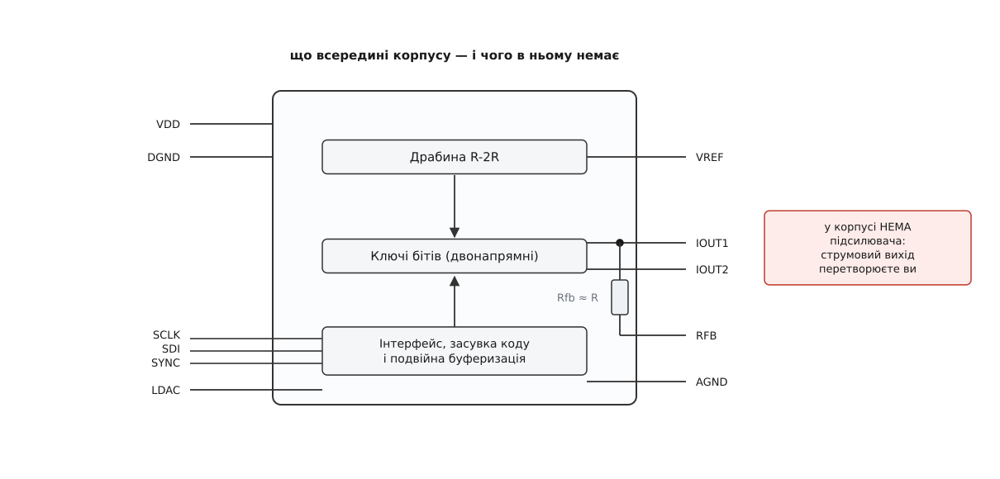
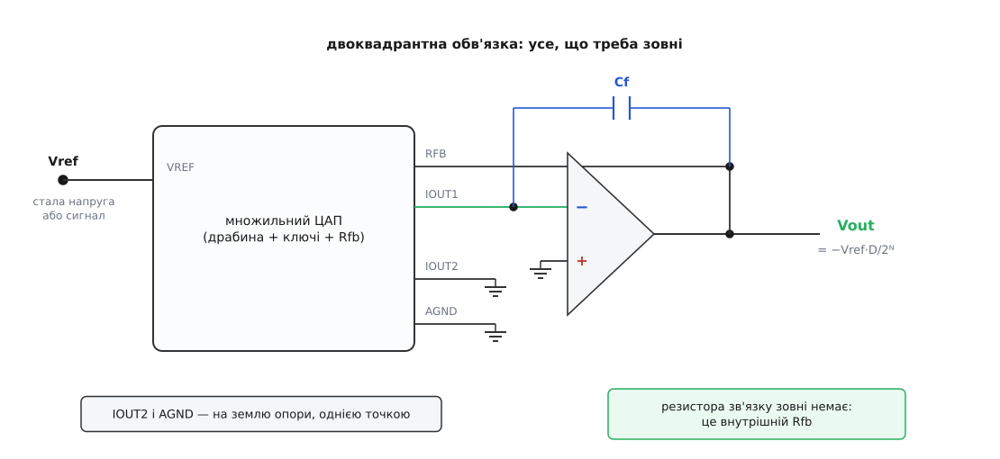
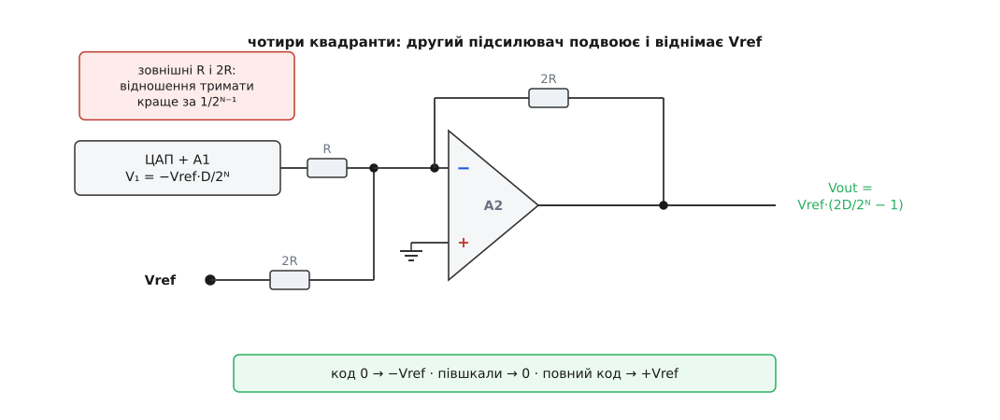

# 🔌 Множильний ЦАП: мікросхема, у якої опорний вивід — це вхід сигналу

Множильний ЦАП (англ. *multiplying DAC*, MDAC) — клас мікросхем, у яких опорний вивід призначений не для нерухомої напруги, а для сигналу: вихідний струм пропорційний **добуткові** того, що подано на опору, на записаний код. Купуючи таку мікросхему, ви купуєте не готовий перетворювач, а резисторну драбину з ключами й цифровим інтерфейсом; підсилювач, який зробить зі струму напругу, лишається за вами. Тому й набір виводів у неї незвичний: два струмові виходи, окремий резистор зворотного зв'язку — і жодного виводу аналогової напруги.

## Що дозволяє опорі бути сигналом

Ключі такої мікросхеми не перемикають напруги — вони перекидають струм щабля між двома точками, які обидві сидять на нулі: одна на справжній землі, друга на віртуальній землі зовнішнього підсилювача. Потенціали всередині драбини від коду не рухаються взагалі. З цієї єдиної обставини випливають три властивості, які й роблять клас можливим.

**Опора може виходити за межі живлення.** Ключ, обидва кінці якого коло тримає біля нуля, ніколи не бачить на собі великої напруги — тож його пробивна напруга не обмежує опору. У типових мікросхем цього класу логіка живиться від 2.5–5.5 В, а на виводах опори гранично допустимі ±10…12 В. Це не хитрий трюк виробника, а прямий наслідок струмового ввімкнення драбини.

**Опора може мати будь-який знак і бути змінною.** Щоб струм щабля тік у будь-який бік, ключ мусить проводити в обидва боки — тому його роблять [CMOS-прохідним ключем](topic:electronics/cmos-transmission-gate): парою n- і p-канальних транзисторів, увімкнених паралельно, яка проводить незалежно від напрямку струму й від полярності. Саме звідси береться слово «множильний»: на опору можна подати синус, і на виході буде той самий синус, помножений на код.

**Ключ мусить спершу замкнути нове коло й лише потім відпустити старе** (англ. *make-before-break*). Якби на мить розімкнулися обидва контакти, щабель повис би в повітрі, вузол драбини стрибнув би до Vref — і на виході з'явився б викид, більший за будь-який корисний крок. Ця вимога до ключів — частина архітектури, а не тонке налаштування.

Є й наслідок, важливий уже для того, хто ставить мікросхему в схему: **вхідний опір з боку опори не залежить від коду** й дорівнює R драбини (одиниці — десятки кілоом). Джерело сигналу бачить чисто резистивне, незмінне навантаження — без цього множення просто не працювало б, бо код модулював би струм, який відбирається у джерела. Зворотний бік: вихідний опір джерела додається до R послідовно, тож джерело з опором Rs дає похибку підсилення Rs/R. Для R = 10 кОм і Rs = 10 Ом це вже 0.1 % — більше за LSB десятибітної шкали, тому опору тут беруть буферовану ([джерело опорної напруги](topic:electronics/voltage-reference-sources) з підсилювачем на виході), а не «просто стабілітрон через резистор».

## Що всередині корпусу і що на виводах


*Начинка типової мікросхеми. Драбина, ключі, засувка з інтерфейсом і один-єдиний додатковий резистор Rfb, приєднаний зсередини до IOUT1. Підсилювач у корпус не кладуть навмисно: він мусив би витримувати опору, ширшу за живлення, і був би гіршим за той, що ви оберете самі під свою задачу.*

Цоколівка аналогової частини в різних виробників однакова: ті самі п'ять виводів під тими самими іменами, тож схему можна малювати, ще не обравши конкретну мікросхему.

- **VREF** — вхід опори чи сигналу. Резистивне навантаження R, від коду не залежить.
- **IOUT1** — струмовий вихід, куди ключі зливають струм увімкнених бітів. Його напругу мусить тримати рівно на нулі зовнішній підсилювач; будь-яке відхилення цього вузла від нуля зсуває потенціали в драбині й ламає лінійність. Тому вішати на IOUT1 що-небудь, крім [віртуальної землі](topic:electronics/virtual-ground), не можна — ні вольтметр, ні резистор на землю.
- **IOUT2** — доповнювальний вихід: туди йде струм вимкнених бітів. Його **приєднують до AGND**. Якщо лишити його в повітрі, низи вимкнених щаблів опиняться не на нулі, потенціали в драбині попливуть за кодом — і перетворювач перестане бути лінійним. Другий сценарій — завести IOUT2 на другий підсилювач і дістати диференціальний вихід.
- **RFB** — вільний кінець вбудованого резистора зворотного зв'язку; другим кінцем він приєднаний до IOUT1 усередині кристала. Це не «резистор, яким можна скористатися», а резистор, яким **треба** скористатися: він зроблений тим самим шаром, тими самими розмірами й поруч із драбиною, тож його відношення до R тримається одиницями ppm/°C, тоді як абсолютне значення R гуляє від партії на десятки відсотків. Зовнішній резистор віддає вам цей абсолютний розкид разом із власним температурним коефіцієнтом.
- **AGND** — зворотна земля драбини: сюди повертається струм кінцевого щабля й струм із IOUT2. Струм цей **залежить від коду** й сягає повного струму шкали. Якщо AGND повертається у землю через спільну ділянку з чимось іншим, код малюватиме на цій ділянці свою напругу — і вона додасться до сигналу. Тому AGND ведуть окремо до тієї самої точки, де сидить земля опори й «плюс» підсилювача ([спільна земля](topic:electronics/common-ground) тут не абстракція, а прямий внесок у нелінійність).
- **Цифрова частина** — живлення VDD/DGND та інтерфейс: або паралельна шина з сигналом запису, або послідовна ([SPI](topic:communications/spi-bus) чи її близький родич). Окремий вивід **LDAC** переносить прийнятий код із вхідного регістра в засувку ключів: доки він не смикнутий, ключі не рухаються. Це дає дві речі — оновити кілька каналів чи кілька мікросхем одночасно й не пускати проміжні комбінації бітів на вихід. Вивід **CLR** (де є) скидає код у стан вмикання; для однополярних мікросхем це нуль, для біполярних — часто півшкали, бо саме вона відповідає нулю на виході.

## Обв'язка: підсилювач, якого немає в корпусі


*Мінімальна робоча схема. Зовні додається рівно три речі: операційний підсилювач, конденсатор Cf і акуратна земля. Резистора зворотного зв'язку зовні немає — петля замикається через вивід RFB, тобто через внутрішній резистор мікросхеми.*

Підсилювач вмикають [трансімпедансним](topic:electronics/transimpedance-amplifier): інвертувальний вхід на IOUT1, вихід на RFB, неінвертувальний вхід на землю. Виходить

```
Vout = −Vref · D / 2ᴺ        D — код, N — розрядність
Vout(повний код) = −Vref · (2ᴺ − 1) / 2ᴺ
```

Два наслідки, на яких спотикаються при першому ввімкненні. По-перше, **знак завжди інвертований**: додатна опора дає від'ємний вихід. По-друге, **повна шкала на один LSB не дотягує до Vref** — коду `2ᴺ` не існує, найбільший код на одиницю менший. Обидві речі — не помилка схеми, а її арифметика.

Конденсатор Cf паралельно внутрішньому Rfb — не забаганка. Вихід драбини має власну ємність (десятки — понад сотню пікофарад, до того ж **різну для різних кодів**: що більше ключів дивиться в IOUT1, то більша ємність). Разом із Rfb вона утворює полюс усередині петлі зворотного зв'язку:

```
f_полюса = 1 / (2π · Rfb · Cout) = 1 / (2π · 10 кОм · 100 пФ) ≈ 159 кГц
```

Полюс усередині петлі з'їдає [запас по фазі](topic:electronics/opamp-stability): вихід починає дзвеніти на кожній зміні коду, а при невдалому підсилювачі — збуджуватися. Лікує його нуль, який дає Cf; для максимально пласкої характеристики його беруть

```
Cf = √( Cout / (2π · Rfb · fᴛ) ) = √( 100 пФ / (2π · 10 кОм · 10 МГц) ) ≈ 13 пФ
```

де fᴛ — частота одиничного підсилення операційного підсилювача. Це та сама задача, що й у будь-якому перетворювачі струм-напруга, з повним виведенням у [розрахунку стійкості I/V-перетворювача](topic:electronics/transimpedance-amplifier/math-tia-stability.md). Особливість саме множильного ЦАП у тому, що Cout **змінюється з кодом**, тож ідеальної компенсації не буває: замалий Cf лишає дзвін і викривлення форми на швидких змінах коду, завеликий — з'їдає смугу й затягує установлення. Тому в даташитах дають вилку (від одиниць до двох десятків пікофарад) і радять добирати на макеті, дивлячись на найгірший код — повну шкалу.

> 🔧 **Навіщо це.** За зайвий операційний підсилювач ви дістаєте помножувач, точність якого задають **відношення резисторів на одному кристалі**, а не аналогове перемноження. Аналоговий помножувач має дрейф, температурну залежність і власну нелінійність; тут же коефіцієнт множення — двійковий код, він не пливе, не старіє і повторюється від приладу до приладу. Саме тому цифрово керовані атенюатори точних вимірювальних трактів, регулювання рівня опори в драйверах і встановлення амплітуди генераторів роблять на множильному ЦАП, а не на керованому напругою підсилювачі.

## Перший байт

Порядок ввімкнення, за якого відразу видно, чи все зібрано правильно.

1. Зберіть землю: IOUT2 і AGND — короткими провідниками в одну точку разом із землею опори та «плюсом» підсилювача.
2. Подайте на VREF **сталу** напругу — на першому кроці не сигнал: множення перевіряють після того, як працює звичайне перетворення. Візьміть щось зручне для рахунку, наприклад +2.500 В.
3. Запишіть нульовий код. На виході має бути нуль із точністю до зсуву підсилювача — одиниці мілівольтів щонайбільше. Якщо там сотні мілівольтів або напруга на межі живлення — підсилювач збуджується (мало Cf) або IOUT2 висить у повітрі.
4. Запишіть півшкали (`0x800` для дванадцяти бітів). Має бути −1.250 В. Знак від'ємний — це нормально.
5. Запишіть повний код `0xFFF`. Має бути −2.4994 В, тобто на один LSB (0.61 мВ) менше за −2.5 В. Якщо вийшло рівно −2.5 В із похибкою в кілька мілівольтів, ви, найпевніше, дивитеся на насичення підсилювача, а не на шкалу.
6. Тільки тепер замініть сталу опору на синус 10 кГц амплітудою ±2 В і пройдіться кодами. Амплітуда на виході має мінятися пропорційно коду, а на нульовому коді впасти майже до нуля — «майже» тут суттєве, про нього нижче.

Кадр запису в послідовних мікросхем цього класу влаштований однаково: N біт даних у 16-бітному слові, старшим бітом уперед, засувка по завершенню кадру.

```c
/* Запис коду в множильний ЦАП: 12 біт даних, 16-бітний кадр, SPI MSB-first.
   Дані фіксуються по фронту SYNC, ключі рухаються по спаду LDAC. */
static void mdac_write(uint16_t code12)
{
    uint16_t frame = code12 & 0x0FFF;   /* старші 4 біти кадру — нулі */

    gpio_clear(PIN_SYNC);               /* кадр почався */
    spi_transfer16(frame);              /* код лягає у вхідний зсувний регістр */
    gpio_set(PIN_SYNC);                 /* кадр завершено, код у вхідному регістрі */

    gpio_clear(PIN_LDAC);               /* і лише тепер він доходить до ключів */
    delay_ns(50);                       /* тривалість імпульсу за даташитом */
    gpio_set(PIN_LDAC);
}
```

Якщо LDAC постійно притиснутий до землі, код піде до ключів одразу після кадру — так роблять, коли канал один і одночасність нікого не турбує.

## Пастки, на які натикаються всі

**Зсув підсилювача перетворюється на нелінійність, а не на зсув.** Це головна пастка класу, і вона неочевидна. Опір, яким драбина дивиться в IOUT1, **залежить від коду**: коли всі ключі повернуті до IOUT1, це приблизно ¾R, коли жодного — розрив. А коефіцієнт, з яким схема підсилює власну похибку підсилювача (у довідниках його звуть **шумовим підсиленням**, англ. *noise gain*), дорівнює `1 + Rfb/Rвих`. Отже, він теж гуляє з кодом:

```
код (12 біт)      Rвих драбини      шумове підсилення 1 + Rfb/Rвих   (Rfb = R)
0x000             розрив                 1.00
0x001             3.000·R                1.33
0x800             2.000·R                1.50
0xFFF             0.750·R                2.33
найгірший код     0.477·R                3.10
```

Стала частина цього внеску — звичайний зсув, його знімає калібрування. А от **розмах** — ні: він міняється від коду до коду, тобто вигинає передавальну характеристику. Ось скільки він коштує.

**Умова.** Дванадцятибітна мікросхема, R = Rfb = 10 кОм, Vref = 10 В. Яку [напругу зсуву](topic:electronics/offset-voltage) можна дозволити підсилювачеві, щоб її внесок у нелінійність не перевищив ¼ LSB?

```
LSB                = Vref / 2¹² = 10 / 4096          = 2.44 мВ
розмах шумового підсилення по кодах = 3.10 − 1.00    = 2.10
внесок зсуву у вихід: ΔVout = Vos · 2.10
умова ΔVout ≤ ¼ LSB:
Vos ≤ 0.25 · 2.44 мВ / 2.10                          = 0.29 мВ
```

**Висновок.** Триста мікровольтів — не героїчна вимога, але звичайний дешевий підсилювач зі зсувом 3 мВ дасть 6.3 мВ розмаху, тобто 2.6 LSB викривлення, якого не прибрати жодним калібруванням шкали. Для шістнадцяти бітів при тій самій опорі LSB = 0.153 мВ, і вимога стискається до 18 мкВ — це вже територія [підсилювачів, які раз за разом самі обнуляють власний зсув](topic:electronics/auto-zero-opamp). Ось чому в даташиті множильного ЦАП завжди є розділ «вибір підсилювача», і чому мікросхема на 16 біт із поганим підсилювачем працює гірше за мікросхему на 12 біт із хорошим.

**Вхідний струм підсилювача тече крізь Rfb.** [Вхідний струм зсуву](topic:electronics/input-bias-current) не має куди подітися з підсумовувального вузла й повертається через резистор зворотного зв'язку, додаючи на виході Ib·Rfb. Для 10 кОм і струму 1 нА це 10 мкВ — дрібниця; для біполярного підсилювача зі струмом 100 нА це вже мілівольт. Через це в такі схеми ставлять підсилювачі з польовим входом.

**Смуга й швидкість наростання належать підсилювачеві, а не ЦАП.** Мікросхема віддає новий струм за наносекунди; далі все вирішує зовнішній каскад. Причому запас петлі в нього менший, ніж здається: шумове підсилення до трьох лишає від петльового підсилення тільки третину, а Cf разом із Cout зрізають смугу. Множильна смуга в десять мегагерц, обіцяна на першій сторінці даташита, — це смуга самої драбини; ваш тракт матиме ту, яку дозволить підсилювач.

**На нульовому коді вихід не мовчить.** Ключі мають паразитну ємність, і змінна опора проходить крізь неї просто на IOUT1 в обхід резисторів. Це **просочування опори** (англ. *reference feedthrough*): ослаблена копія сигналу, яка з частотою росте на 6 дБ на октаву, бо опір ємності падає. Побороти її до нуля не можна, зменшити — можна: коротка доріжка IOUT1, розведення її подалі від доріжки VREF, екран навколо.

**Цифра пролазить в аналог.** Фронти інтерфейсу ємнісно наводяться на ті самі вузли. Тому шину тримають тихою в момент, коли з виходу знімають точне значення, а нові коди заводять через LDAC — щоб перемикання ключів сталося один раз, у відомий момент, а не розтягнулося на весь кадр.

**Живлення підсилювача рахують за опорою, а не за ЦАП.** Мікросхема живиться від 3.3 В, а опора −10…+10 В — і виходить, що підсилювач мусить мати двополярне живлення й розмах виходу на всі двадцять вольтів. Це найчастіша помилка «за звичкою»: ЦАП низьковольтний, підсилювач до нього — ні.

**Підстроювання підсилення вбиває головну чесноту.** Спокуса поставити послідовно з RFB підстроювальний резистор велика, а ціна висока: підсилення відразу переймає температурний коефіцієнт доданої деталі, і збіг із драбиною, заради якого Rfb клали на кристал, зникає. Краще підправляти опору або множити код у прошивці.

**ЦАП у петлі зворотного зв'язку — окрема історія.** Множильний ЦАП часто ставлять не на вході підсилювача, а в його зворотний зв'язок: тоді підсилення виходить обернене до коду, `1/D`, і схема стає цифрово керованим підсилювачем. Дві пастки: на нульовому коді петля просто розривається, і вихід упирається в живлення; а на малих кодах шумове підсилення злітає в десятки й сотні, тягнучи за собою зсув, шум і дрейф. Тому такі схеми страхують резистором паралельно ЦАП і забороняють малі коди програмно.

## Чотири квадранти

Одноквадрантне ввімкнення — стала однополярна опора, однополярний код — дає лише один знак виходу. Двоквадрантне — це та сама схема, у яку подано змінну або біполярну опору: вихід міняє знак разом з опорою, але код лишається беззнаковим. Щоб вихід міняв знак ще й від **коду**, потрібна арифметика, якої в мікросхемі немає: від добутку треба відняти половину шкали. Її роблять другим підсилювачем.


*Чотири квадранти коштують одного підсилювача й трьох резисторів. A2 працює інвертувальним суматором: вхід від A1 через R, вхід від опори через 2R, зворотний зв'язок 2R. Нульовий код дає −Vref, півшкали — нуль, повний код — майже +Vref; такий спосіб подавати знак усередині беззнакового коду звуть зміщеним двійковим.*

```
V₁   = −Vref · D / 2ᴺ                       (перший підсилювач)
Vout = −2·V₁ − Vref = Vref · (2D/2ᴺ − 1)    (другий)
```

Уся точність тут тримається на тому, наскільки чесна двійка в `−2·V₁`, тобто на відношенні зовнішніх резисторів. Порахуймо, який допуск вона витримує. Нехай коефіцієнт дорівнює 2(1+δ). На півшкалі, де V₁ = −Vref/2, вихід має бути точно нулем, а буде:

```
Vout = Vref·(1+δ) − Vref = δ · Vref
крок біполярної шкали:  LSB = 2·Vref / 2ᴺ
похибка в кроках:       δ · Vref / (2·Vref/2ᴺ) = δ · 2ᴺ⁻¹
для 12 біт і допуску ½ LSB:  δ ≤ 0.5 / 2¹¹ = 0.024 %
```

Двісті сорок мільйонних — це вже не звичайні резистори з крамниці, а узгоджена збірка на одній підкладці: важливий не номінал, а незмінність відношення при нагріванні. Саме тому частина мікросхем цього класу несе «чотириквадрантні резистори» просто на кристалі — тоді зовнішнім лишається тільки другий підсилювач.

## Різновиди класу

**Струмовий вихід проти напругового.** Описаний тут струмовий варіант — базовий: найширший діапазон опори, найбільша смуга, але зовнішній підсилювач обов'язковий. Є й мікросхеми із вбудованим буфером і виводом напруги; вони простіші в застосуванні, але буфер живиться від тієї самої низьковольтної шини, тож опора мусить уміститися між рейками живлення, а смуга й точність тепер задані внутрішнім підсилювачем, якого ви не вибирали.

**Кількість квадрантів.** Один (стала однополярна опора), два (біполярна чи змінна опора, беззнаковий код), чотири (біполярна опора і знаковий код — коштують другого підсилювача або вбудованих резисторів на кристалі).

**Однорідна драбина проти сегментованої.** У точних мікросхемах старші розряди роблять не щаблями драбини, а набором однакових струмових джерел, які вмикаються по одному: тоді на найнебезпечнішому переході — середині шкали — не перемикається половина драбини разом, і диференціальна нелінійність поводиться значно спокійніше. Молодші розряди при цьому лишаються звичайною драбиною.

**Інтерфейс і кількість каналів.** Паралельна шина дає найшвидше оновлення й потрібна там, де код міняють на кожному такті; послідовна економить ніжки. У двох- і чотириканальних мікросхем опора буває спільною або окремою на канал: спільна опора дає жорстко узгоджені між собою канали, окрема — незалежні множення.

**Сусідні класи, які плутають із цим.** [Цифровий потенціометр](topic:electronics/digipot) теж «керує рівнем кодом», але це просто ланцюжок резисторів із перемикачем відводу: три виводи, підсилювач не потрібен — і водночас гірша лінійність, помітний опір ключа в сигнальному шляху й куди грубіший крок. Множильний ЦАП точніший, але вимагає обв'язки.

**Термінологічна пастка.** У літературі про [конвеєрні АЦП](topic:electronics/pipeline-adc) абревіатура MDAC означає геть інше: там це внутрішній вузол ступеня, зібраний на конденсаторах і ключах, який одночасно перетворює цифру в аналог, віднімає її від входу й підсилює залишок. Спільне слово, різні речі: тут — мікросхема з виводами, там — блок усередині кристала.
