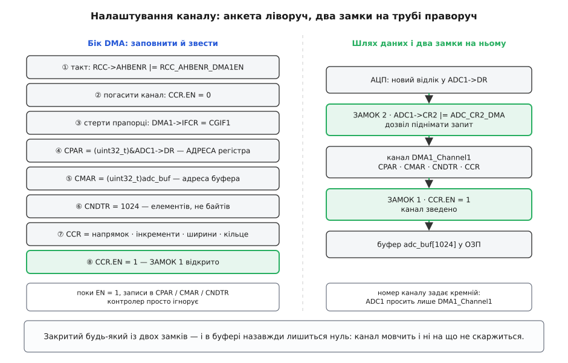
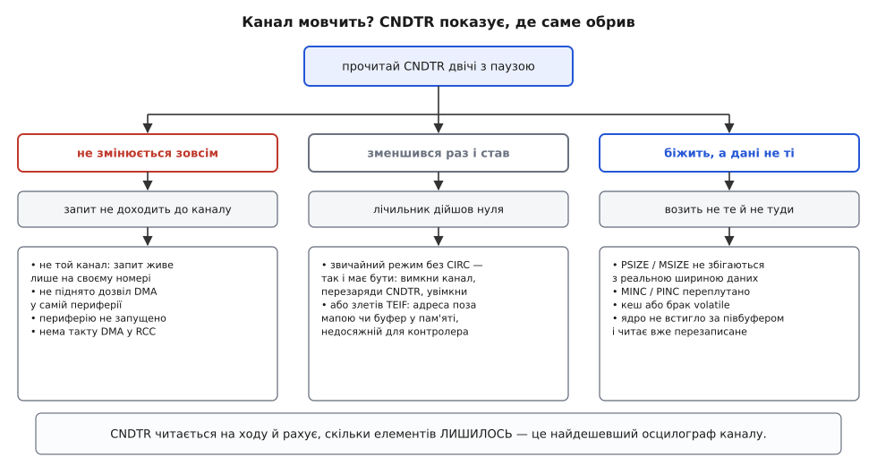

# ⚙️ Налаштування каналу DMA: десять записів у регістри й два замки

Щоб пустити пересилку на живому мікроконтролері, треба заповнити жменю регістрів каналу — але порядок цих записів не довільний, а найважливіший біт лежить узагалі не в контролері DMA, а в самій периферії. Нижче — точна послідовність на живому чипі, робочий код разом із обробником переривання й та діагностика, що за пів хвилини розводить геть різні причини, які всі виглядають однаково: «DMA не працює».

Візьмімо конкретний чип, щоб не махати руками: STM32F103 — Cortex-M3 на 72 МГц, контролер DMA1 із семи каналів, 12-бітний [АЦП](topic:electronics/adc). Імена регістрів — рівно ті, що лежать у [CMSIS-заголовку](topic:programming/cmsis) чипа: це не псевдокод, це те, що піде в компілятор.

### Задача: безперервний потік у буфер, якого ядро не торкається

Треба оцифровувати напругу на виводі PA0 без пауз і віддавати її програмі шматками, зручними для обробки, — так, щоб ядро не торкалося жодного окремого відліку й щоб жоден відлік не пропав. Спершу порахуймо темп, бо з нього випливе і розмір буфера, і все дальше.

```
такт АЦП:        72 МГц ÷ 6 = 12 МГц      (на F1 АЦП не можна швидше за 14 МГц)
один вимір:      41.5 + 12.5 = 54 такти   (вибірка + саме перетворення)
темп:            12 000 000 ÷ 54 ≈ 222 000 відліків/с
період відліку:  1 ÷ 222 000 ≈ 4.5 мкс
```

**Дано:** джерело, що само собою видає нове 16-бітне число кожні 4.5 мкс, і буфер `adc_buf[1024]`. **Знайти:** таке налаштування каналу, щоб відліки лягали в буфер по колу без участі ядра, а ядро діставало сигнал рівно двічі за оберт — коли готова перша половина буфера й коли готова друга.

Половини потрібні не для краси: ядро обробляє ту половину, яку контролер щойно лишив і ще довго не зачепить, — це [подвійна буферизація](topic:electronics/display-double-buffering). І звідси одразу випливає число, яке варто записати ще до першого рядка коду:

```
пів-буфера:  512 відліків × 4.5 мкс ≈ 2.3 мс
```

2.3 мс — увесь час, який ядро має на обробку половини. Не встигло — і контролер, обійшовши коло, почне писати поверх тих даних, які ядро саме читає. Розмір буфера тут не «щоб було», а прямий важіль: подвоїш буфер — подвоїш і дедлайн, ціною тієї ж кількості байтів ОЗП і вдвічі більшої затримки від відліку до його обробки.

### Ідея: анкету замикають, а кран відкривають окремо

Усе налаштування тримається на чотирьох властивостях заліза, і з них випливає жорсткий порядок дій.

**Перше: регістри каналу — інертна анкета.** Записати адресу джерела чи лічильник — це не команда, це відповідь на питання «а що робити, коли попросять». Поки канал не зведено, ці записи нічого не запускають; можна заповнювати їх у будь-якому порядку між собою.

**Друге: заповнену анкету замикають.** Щойно піднято біт `EN`, канал живий — і всі його інші регістри стають фактично тільки для читання: запис у них або ігнорується, або дає невизначений результат. Тому послідовність не обговорюється: **спершу погасити канал, потім описати, і лише в самому кінці звести**. Спроба «на ходу» підмінити адресу буфера тихо не спрацює — і код виглядатиме правильним.

**Третє, і саме на ньому спотикаються: генератор запитів сидить не в контролері DMA.** Контролер уміє лише чекати на дріт запиту й реагувати. А чи піднімати той дріт — вирішує сама периферія, і в неї для цього є свій окремий біт дозволу (в АЦП це `ADC_CR2_DMA`, у SPI — `TXDMAEN`/`RXDMAEN`, в UART — `DMAT`/`DMAR`). Виходить, що на трубі **два незалежні крани**: один — біт `EN` каналу, другий — біт дозволу в периферії. Обидва належать різним блокам, налаштовуються в різних місцях коду, і закритий будь-який із них дає той самий симптом — тишу.

І четверте, дрібне, але вбивче: **номер каналу не вільний**. На STM32F1 лінії запиту розведені кремнієм намертво: АЦП1 смикає лише `DMA1_Channel1`, приймач SPI1 — лише канал 2, передавач USART1 — лише канал 4. Взяв «вільніший» канал — і він до кінця днів чекатиме на запит, якого до нього фізично не підведено.


*Дві половини одного налаштування. Ліворуч — анкета каналу: кроки ②–⑦ мають сенс лише між ② (погасити) і ⑧ (звести), бо на ввімкненому каналі записи в CPAR/CMAR/CNDTR не приймаються. Праворуч — той самий шлях даних збоку: між джерелом і буфером стоять два незалежні крани, і потік тече, лише коли відкриті обидва.*

> 🔧 **Навіщо це.** Два замки — головна причина, чому «правильний з вигляду» код мовчить. Канал заряджено, адреси вірні, лічильник на місці — а буфер повний нулів, бо забуто один рядок у налаштуванні **периферії**. Симптом при цьому нульовий: контролер не вважає це помилкою (він і не мусить возити, поки не просять), периферія теж не скаржиться. Тому корисно тримати в голові поділ «хто описує пересилку» (регістри каналу) і «хто дає команду возити» (біт дозволу в периферії) — і перевіряти обидва боки, а не тільки той, що зветься словом DMA.

### Що саме кладуть у кожен регістр

Чотири головні поля відповідають на чотири питання, і кожне має свій характерний спосіб зіпсуватися.

**`CPAR` — адреса регістра периферії.** Саме **адреса**, а не значення: `(uint32_t)&ADC1->DR`, зі знаком `&`. Забутий амперсанд компілюється без жодного попередження — у канал піде **вміст** регістра даних, тобто щойно виміряне число з діапазону 0…4095: скажімо, 2876, і контролер сумлінно піде возити з адреси `0x00000B3C`. Наслідок — прапорець помилки передачі й миттєво мертвий канал.

**`CMAR` — адреса буфера.** Буфер має бути **статичним** (масив на стеку зникне разом із функцією, а контролер писатиме за старою адресою далі), **вирівняним** під ширину елемента (масив `uint16_t` компілятор вирівнює сам, а от `uint8_t buf[]`, приведений до `uint16_t*`, — уже ні; про ціну неспівпадіння — у темі [вирівнювання пам'яті](topic:programming/memory-alignment)) і **досяжним для контролера**. Останнє не жарт: на STM32F4 пам'ять CCM за адресою `0x10000000` підключена просто до ядра й до матриці шин не виходить узагалі, тож DMA туди не дістане; на STM32H7 та сама історія з DTCM. Куди саме лягає масив — вирішує [скрипт компонувальника](topic:programming/linker-script), і на таких чипах це стає частиною налаштування каналу, а не окремою дрібницею.

**`CNDTR` — лічильник в елементах, не в байтах.** Тисяча двадцять чотири півслова — це `1024`, а не `2048`. Одиницею береться ширина з боку джерела. Помилився вдвічі — і контролер або спиниться на середині буфера, або поїде за його межу й тихо потовче сусідні змінні.

**`CCR` — усі «як саме».** Тут напрямок (`DIR`), нарощування адрес окремо для периферії й для пам'яті (`PINC`, `MINC`), ширини з обох боків (`PSIZE`, `MSIZE`), кільцевий режим (`CIRC`), пріоритет каналу серед інших (`PL` — його правила описано в темі [арбітраж каналів DMA](topic:programming/dma-arbitration)) і дозволи на переривання (`HTIE`, `TCIE`, `TEIE`). Цей регістр варто писати **присвоєнням**, а не через `|=`: інакше від попереднього налаштування лишиться хвіст, який потім шукатимеш годину. Виняток один — фінальне `|= DMA_CCR_EN`.

Пари `PSIZE`/`MSIZE` й `PINC`/`MINC` — те місце, де плутанина дає найтихішу біду. Джерело тут — регістр за незмінною адресою, тож `PINC` лишається нулем; приймач — послідовні комірки, тож `MINC` треба підняти. Переплутав місцями — і всі 1024 відліки ляжуть в одну-єдину комірку буфера, а контролер тим часом читатиме регістри АЦП, яких не існує.

### Робочий код

```c
#include "stm32f1xx.h"          /* CMSIS-заголовок конкретного чипа */

#define ADC_BUF_LEN  1024u

/* Статичний (не на стеку), 16-бітний (сам вирівняний), volatile — бо цю пам'ять
   змінює не ядро, і компілятор про це не здогадається. */
static volatile uint16_t adc_buf[ADC_BUF_LEN];

static volatile int8_t   ready_half = -1;   /* 0 — готова перша половина, 1 — друга */
static volatile uint32_t missed, errors;

void process(const volatile uint16_t *p, unsigned n);   /* корисна робота ядра */

/* ── Периферія: підняти АЦП і відкалібрувати (ще без жодного слова про DMA) ── */
static void adc1_bringup(void)
{
    RCC->APB2ENR |= RCC_APB2ENR_ADC1EN | RCC_APB2ENR_IOPAEN;
    RCC->CFGR    &= ~RCC_CFGR_ADCPRE;
    RCC->CFGR    |= RCC_CFGR_ADCPRE_DIV6;        /* 72/6 = 12 МГц */

    GPIOA->CRL &= ~(GPIO_CRL_MODE0 | GPIO_CRL_CNF0);   /* PA0 — аналоговий вхід */

    ADC1->SMPR2 = ADC_SMPR2_SMP0_2;   /* 41.5 такту вибірки на каналі 0 */
    ADC1->SQR1  = 0;                  /* L = 0 → у послідовності один вимір */
    ADC1->SQR3  = 0;                  /* і це канал 0 */

    ADC1->CR2 |= ADC_CR2_ADON;                    /* вивести з режиму спокою */
    for (volatile int i = 0; i < 1000; i++) { }   /* дати стабілізуватися */
    ADC1->CR2 |= ADC_CR2_RSTCAL; while (ADC1->CR2 & ADC_CR2_RSTCAL) { }
    ADC1->CR2 |= ADC_CR2_CAL;    while (ADC1->CR2 & ADC_CR2_CAL)    { }
}

/* ── Канал DMA: анкета й ЗАМОК 1 ── */
static void dma1_ch1_setup(void)
{
    RCC->AHBENR |= RCC_AHBENR_DMA1EN;            /* ① без такту блок не відповідає */

    DMA_Channel_TypeDef *ch = DMA1_Channel1;     /* ② АЦП1 просить лише сюди */

    ch->CCR &= ~DMA_CCR_EN;                      /* ③ відімкнути перед описом */
    while (ch->CCR & DMA_CCR_EN) { }             /*    дочекатися, поки справді ляже */
    DMA1->IFCR = DMA_IFCR_CGIF1;                 /* ④ стерти прапорці минулого прогону */

    ch->CPAR  = (uint32_t)&ADC1->DR;             /* ⑤ АДРЕСА регістра, не його вміст */
    ch->CMAR  = (uint32_t)adc_buf;               /* ⑥ адреса буфера */
    ch->CNDTR = ADC_BUF_LEN;                     /* ⑦ ЕЛЕМЕНТІВ, не байтів */

    ch->CCR = DMA_CCR_MINC                       /* ⑧ адреса в ОЗП росте (PINC = 0 → регістр стоїть) */
            | DMA_CCR_PSIZE_0                    /*    ширина з боку периферії — 16 біт */
            | DMA_CCR_MSIZE_0                    /*    ширина з боку пам'яті — теж 16 біт */
            | DMA_CCR_CIRC                       /*    кільце: з кінця — на початок */
            | DMA_CCR_PL_1                       /*    високий пріоритет каналу */
            | DMA_CCR_HTIE                       /*    IRQ на половині буфера */
            | DMA_CCR_TCIE                       /*    IRQ у кінці буфера */
            | DMA_CCR_TEIE;                      /*    IRQ на помилці доступу */
    /* DIR = 0 → джерело периферія; писати CCR присвоєнням, щоб не лишити хвостів */

    NVIC_SetPriority(DMA1_Channel1_IRQn, 5);     /* ⑨ дозвіл у контролері переривань */
    NVIC_EnableIRQ(DMA1_Channel1_IRQn);

    ch->CCR |= DMA_CCR_EN;                       /* ⑩ ЗАМОК 1: канал зведено */
}

/* ── Периферія: ЗАМОК 2 і пуск ── */
static void adc1_start_stream(void)
{
    ADC1->CR2 |= ADC_CR2_CONT       /* міряти безперервно, а не по одному разу */
              |  ADC_CR2_DMA;       /* ЗАМОК 2: дозвіл піднімати запит до DMA */
    ADC1->CR2 |= ADC_CR2_EXTSEL;    /* EXTSEL = 111 → джерело пуску «SWSTART» */
    ADC1->CR2 |= ADC_CR2_EXTTRIG;   /* без цього біта тригер просто не слухають */
    ADC1->CR2 |= ADC_CR2_SWSTART;   /* пуск */
}

void DMA1_Channel1_IRQHandler(void)
{
    uint32_t isr = DMA1->ISR;

    if (isr & DMA_ISR_HTIF1) {              /* заповнена перша половина */
        DMA1->IFCR = DMA_IFCR_CHTIF1;       /* гасити прапорець ПЕРШИМ ДІЛОМ */
        if (ready_half >= 0) missed++;      /* ядро не забрало попередню — дедлайн зірвано */
        ready_half = 0;
    }
    if (isr & DMA_ISR_TCIF1) {              /* заповнена друга, кільце пішло на новий оберт */
        DMA1->IFCR = DMA_IFCR_CTCIF1;
        if (ready_half >= 0) missed++;
        ready_half = 1;
    }
    if (isr & DMA_ISR_TEIF1) {              /* помилка доступу: адреса нікуди не веде */
        DMA1->IFCR = DMA_IFCR_CTEIF1;
        errors++;                           /* канал при цьому вимкнувся сам */
    }
    __DSB();     /* запис гасіння мусить дійти до периферії ДО виходу з обробника */
}

int main(void)
{
    adc1_bringup();
    dma1_ch1_setup();       /* спершу канал… */
    adc1_start_stream();    /* …і лише потім дозвіл просити */

    for (;;) {
        int8_t h = ready_half;
        if (h >= 0) {
            ready_half = -1;                  /* заявку взято */
            __DMB();                          /* спершу прапорець, потім дані */
            process(&adc_buf[h * (ADC_BUF_LEN / 2)], ADC_BUF_LEN / 2);
        }
    }
}
```

Кілька місць у цьому коді неочевидні, і всі вони — не про DMA, а про те, як ядро й компілятор бачать пам'ять. `__DSB()` наприкінці обробника змушує запис гасіння прапорця дійти до периферії, перш ніж процесор вийде з переривання: запис у буфері запису може затриматися, а виставлений прапорець тим часом знову покличе обробник — і той увійде вдруге на порожньому місці. `__DMB()` у циклі не дає переставити місцями «побачив прапорець» і «читаю буфер»; чому такі перестановки взагалі законні — у темі [бар'єри пам'яті](topic:programming/memory-barrier-instructions). Слово `volatile` на буфері й прапорці — з тієї ж сім'ї причин, і про його точний зміст ідеться в темі [ключове слово volatile](topic:programming/volatile-keyword).

### Пульс каналу: як за пів хвилини знайти обрив

Є один регістр, який відповідає на всі ці питання швидше за будь-який осцилограф. Лічильник `CNDTR` доступний на читання **на ходу**, поки канал працює, і показує, скільки елементів ще лишилося. Спини програму в налагоджувачі двічі з паузою й порівняй два значення — цього досить, щоб відсікти більшість причин мовчання.

```c
uint32_t a = DMA1_Channel1->CNDTR;
/* пауза кілька мілісекунд */
uint32_t b = DMA1_Channel1->CNDTR;
/* a != b → запити приходять, канал возить */
```


*Різні поломки виглядають однаково — «не працює», — але лічильник розводить їх по трьох гілках. Стоїть намертво: запит фізично не доходить до каналу. Зменшився раз і завмер: пересилка вже закінчилася або канал ліг на помилці. Біжить, а дані сміттєві: возить не те, не туди або не тієї ширини.*

Друга за корисністю річ — прапорець помилки передачі `TEIF`. Він означає рівно одне: контролер спробував доступ за адресою, з якої матриця шин відповіла відмовою. На практиці це або переплутаний `&`, або буфер у пам'яті, куди DMA не дістає, або взагалі неініціалізований покажчик. Тому обробник помилки варто заводити з першого дня, а не «потім»: без нього канал просто вимикається мовчки, і симптом знову зводиться до «стоїть».

### Пастки

**Забутий другий замок.** Найчастіша з усіх: канал зведено, а біт дозволу в периферії — ні. Симптом: `CNDTR` не змінюється зовсім, буфер у нулях. Ліки: перевір біт DMA саме в периферії, а не тільки в контролері.

**Не той канал або потік.** Симптом такий самий — глухе мовчання. На старих сімействах відповідність жорстка й дивитися її треба в таблиці запитів довідника; на нових (STM32G0/G4/L4+/H7 і далі) з'явився мультиплексор DMAMUX, який будь-який запит підключає до будь-якого каналу — але тоді номер запиту треба **записати** в його регістр, і забутий запис дає ту саму тишу.

**Запис у ввімкнений канал.** Спроба підмінити `CMAR` чи `CNDTR`, не гасячи `EN`, минає безслідно: канал возить за старою анкетою. На потокових контролерах (STM32F4/F7) додається ще й те, що біт `EN` після скидання лягає **не миттєво** — залізо дочищає поточний доступ, тож цикл очікування `while (…->CR & DMA_SxCR_EN) { }` там обов'язковий, а не для краси.

**Незагашений прапорець в обробнику.** Переривання рівневе: доки прапорець стоїть, обробник викликається знову й знову, і програма застрягає в нескінченному штормі переривань, зовні схожому на зависання. Гасити прапорець треба на початку обробника, а не наприкінці, — і на всяк випадок ставити бар'єр перед виходом.

**Половини й дедлайн.** Обробка половини мусить укластися в час її наповнення (у нашому випадку 2.3 мс). Не вклалася — і ядро читатиме комірки, які контролер уже перезаписав: у сигналі з'явиться стик зі старих і нових відліків, схожий на клац. Лічильник `missed` у коді вище саме для цього й стоїть — це найдешевший спосіб побачити, що обробка не встигає, замість гадати над дивними артефактами в даних.

**Переповнення з боку периферії.** Якщо DMA не встиг забрати число до появи наступного (наприклад, канал надовго відтіснив інший, з вищим пріоритетом), периферія піднімає власний прапорець переповнення — `OVR` в АЦП STM32F4, `ORE` в UART, `OVR` у SPI. Найгірше тут те, що в АЦП STM32F4 переповнення ще й **глушить дальші запити DMA**: потік не просто губить один відлік, а зупиняється назавжди, доки програма не скине прапорець і не перезапустить обидва боки.

**Звичайний режим не перезаряджається сам.** Без `CIRC` після досягнення нуля канал вимикається. Щоб пустити наступний блок, треба знову пройти шлях «погасити → стерти прапорці → записати `CNDTR` (а часто й `CMAR`) → увімкнути»; у деяких периферій додатково доводиться зняти й повернути їхній біт дозволу DMA.

**Кеш.** На ядрах із кешем даних (Cortex-M7 і старші) до всього переліченого додається окремий обов'язковий крок обслуговування кешу навколо кожної пересилки; сам механізм і порядок дій зібрано в темі [пастки DMA й кеш](topic:programming/dma-cache-races). Важливо не сплутати: `volatile` рятує від оптимізацій компілятора, але з кешем не робить нічого — це різні поверхи однієї біди.

### Скільки це коштує

Ціна самого налаштування смішна: десяток записів у регістри, тобто десятки тактів **один раз** за весь час роботи. Далі на кожен відлік ядро витрачає нуль тактів, а на цілий буфер — один вхід у переривання. Тобто вся вартість DMA переїхала з часу виконання в **уважність під час налаштування** — і це неприємний обмін: помилку тут не видно ні в профілювальнику, ні в швидкодії, вона проявляється тишею або сміттям у буфері, тобто найгіршим із діагностичних сигналів.

І майже вся ця уважність зводиться до трьох питань, які варто ставити собі, коли канал мовчить: чи відкриті **обидва** замки, чи той це канал, і що каже `CNDTR`. Дев'ять із десяти випадків «DMA не працює» закінчуються на першому ж із них.
