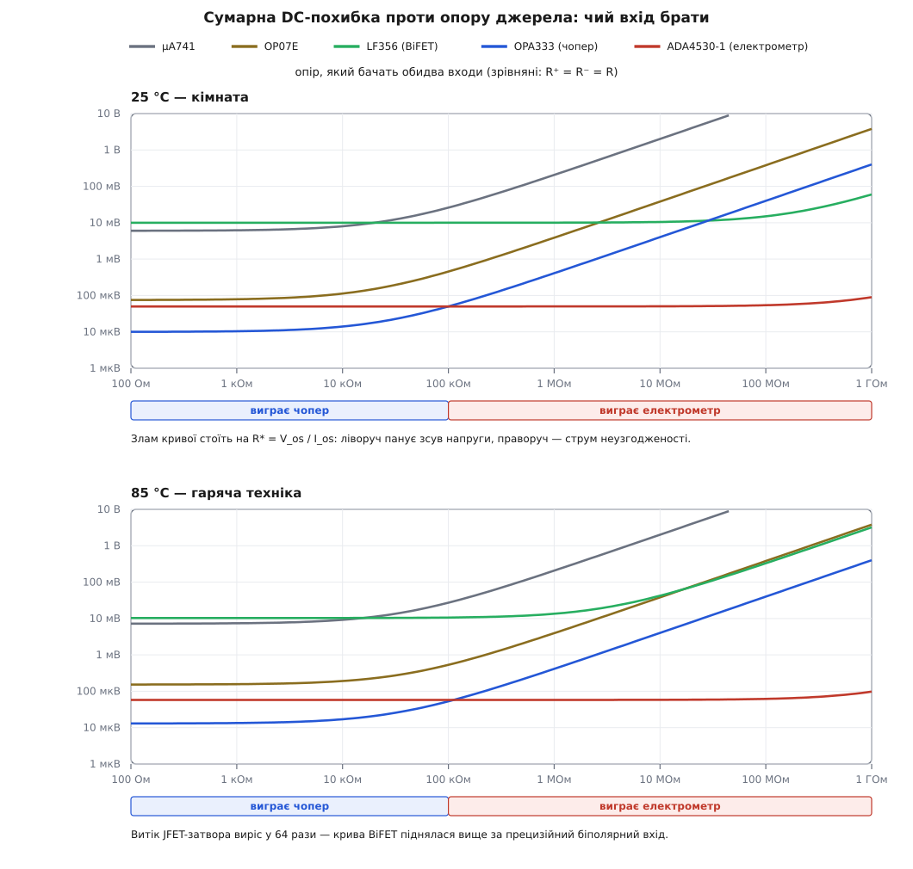

# ⚙️ Калькулятор бюджету похибки: який вхід витримає ваше джерело

Ця програма бере три числа — опір, який бачать входи підсилювача, робочий діапазон температур і дозволену похибку — і каже, який клас вхідного каскаду проходить, а який ні, ще до того, як ви відкриєте прайс. Потрібна вона тому, що окремі правила («високий опір — бери польовий вхід», «треба точності — бери прецизійний») суперечать одне одному рівно там, де ціна помилки найбільша: сучасний чоперний підсилювач зі зсувом напруги в десять мікровольтів на скляному електроді програє «гіршому» за паспортом електрометру в тисячу разів, а на термопарі виграє в нього ж уп'ятеро. Одна арифметика розсуджує обидва випадки — її й запрограмуємо.

## Задача: що дано і на що відповідаємо

Задача починається не з підсилювача, а з двох речей, які нам не належать: **джерела** й **вимоги до точності**. Джерело дає опір, крізь який потече вхідний струм. Вимога до точності дає стелю, вище якої похибка вже не похибка, а брак.

Формалізуймо вхід калькулятора.

- **Опори на входах** — не один опір, а два: `R⁺` і `R⁻`. Кожен вхід бачить свій шлях постійному струмові до низькоомного вузла: «плюс» — крізь [внутрішній опір джерела](book:electronics/internal-resistance) й послідовні резистори, «мінус» — крізь паралельне з'єднання резисторів зворотного зв'язку. Саме **різниця** цих двох опорів і їхня **сума** входять у похибку по-різному, тож звести їх до одного числа не можна.
- **Діапазон температур** — `T_min…T_max` кристала, не повітря. Струм витоку польового входу подвоюється кожні 10 °C, тож 25 °C і 85 °C — це різні прилади в одному корпусі.
- **Бюджет** — скільки мікровольтів на вході дозволено з'їсти. Береться з фізики вимірюваного: 0.01 pH — це 0.59 мВ за [нернстівською крутизною скляного електрода](root:basic-chemistry/ph-indicators) 59.16 мВ/pH; 0.5 °C на термопарі K — це близько 20 мкВ за її крутизною ≈41 мкВ/°C. Або з розрядності: чверть [молодшого розряду АЦП](book:electronics/adc-resolution).
- **Підсилення** — у скільки разів похибка входу виходить назовні збільшеною. Для похибки працює не підсилення сигналу, а [шумове підсилення](book:electronics/noise-gain) `1 + Rf/R1`: в [інвертувальному ввімкненні](book:electronics/inverting-noninverting) сигнал іде з коефіцієнтом `Rf/R1`, а зсув і струмова похибка — з `1 + Rf/R1`, тобто на одиницю більшим.

На виході калькулятор має дати не число, а **вирок** для кожного кандидата: проходить як є; проходить лише після калібрування нуля; не проходить узагалі; або гірше — стала похибка така, що вихід просто впирається в шину живлення й схема не працює. Останній випадок трапляється частіше, ніж здається, і його неможливо побачити, дивлячись на один рядок паспорта.

## З чого складається бюджет: чотири доданки

Похибку зручно зводити **до входу** — у мікровольти, які ніби додано до сигналу. Тоді її можна прямо порівнювати з корисним сигналом і не плутатися в підсиленнях.

Почнімо з того, що справді тече. У «плюс»-вхід іде струм `I_B⁺`, у «мінус» — `I_B⁻`. Паспорт дає не їх, а середнє `I_B` і різницю `I_os`, тож розпишімо їх назад:

```
I_B⁺ = I_B + I_os/2
I_B⁻ = I_B − I_os/2
```

Кожен струм падає на своєму опорі й створює свою напругу на своєму вході. Підсилювач бачить **різницю** цих двох напруг:

```
ε_струм = I_B⁺·R⁺ − I_B⁻·R⁻
        = I_B·(R⁺ − R⁻) + (I_os/2)·(R⁺ + R⁻)
```

Ось звідки береться вся практика. Перший доданок множиться на **різницю** опорів — його прибирає вирівнювання (зробили `R⁺ = R⁻` — доданок зник). Другий множиться на **суму** опорів — його не прибрати ніяк, бо він живиться самою несхожістю входів. До них додається [вхідний зсув напруги](book:electronics/offset-voltage) `V_os`, який не залежить від опорів зовсім, і його температурний дрейф. Разом чотири доданки:

```
ε = V_os  +  TC_Vos·|T − 25|  +  I_B(T)·|R⁺ − R⁻|  +  ½·I_os(T)·(R⁺ + R⁻)
```

Модулі тут не випадкові. Знак `I_os` наперед невідомий — це різниця двох майже однакових величин, вона гуляє від примірника до примірника й може бути будь-якого знака. Тому для бюджету беруть **найгірший випадок: суму модулів**. Складати можна й інакше — коренем із суми квадратів (RSS): для партії приладів це дає реалістичніше число, але спосіб чинний лише для незалежних **випадкових** величин, а не для систематичного зсуву; докладно про різницю двох підходів — у [бюджеті похибок](book:math/error-budget). Для однієї плати, яку треба здати замовнику, чесніша сума модулів: вона гарантує, що гірше не буде.

Тепер температура. Два вхідні каскади поводяться протилежно, і це саме те, що робить вибір нетривіальним:

```
біполярний вхід:   I_B(T) ≈ I_B(25)            (струм бази з температурою майже не росте)
витік затвора:     I_B(T) = I_B(25) · 2^((T − T_flat)/10)
```

Параметр `T_flat` — це температура, до якої струм можна вважати сталим, і він у кожного приладу свій та береться **з паспорта, а не з голови**. У JFET-входу витік росте одразу від кімнатної, тож `T_flat = 25 °C`. У чоперного входу струм береться не з витоку переходу, а з перекачування заряду ключами: він заданий тактовою частотою й ємністю ключа, а тому від температури майже не залежить, доки витік ESD-структур його не переросте. У приладів, де виробник нормує струм **на весь діапазон** (як ADA4530-1: не більше ±20 фА від −40 до +85 °C), гарантія паспорта й задає `T_flat` — там подвоєння вмикається тільки вище нормованої межі.

**pH-метр на скляному електроді.** Порахуймо руками той випадок, з якого почали: повторювач, електрод 200 МОм на «плюсі», «мінус» замкнено на вихід (`R⁻ ≈ 0`), бюджет 0.01 pH.

```
бюджет = 0.01 pH · 59.16 мВ/pH = 591.6 мкВ

OPA333 — чопер, V_os ≤ 10 мкВ, I_B ≤ 200 пА, I_os ≤ 400 пА:
  V_os                              = 10 мкВ
  I_B·|R⁺−R⁻|  = 200·10⁻¹² · 200·10⁶ = 40 мВ
  ½·I_os·(R⁺+R⁻) = 0.5 · 400·10⁻¹² · 200·10⁶ = 40 мВ
  разом ≈ 80 мВ = 1.35 pH

ADA4530-1 — електрометр, V_os ≤ 50 мкВ, I_B ≤ 20 фА, I_os ≤ 40 фА:
  V_os                              = 50 мкВ
  I_B·|R⁺−R⁻|  = 20·10⁻¹⁵ · 200·10⁶  = 4 мкВ
  ½·I_os·(R⁺+R⁻) = 0.5 · 40·10⁻¹⁵ · 200·10⁶ = 4 мкВ
  разом ≈ 58 мкВ = 0.001 pH
```

Підсилювач із **уп'ятеро кращим** зсувом напруги програв тут у тисячу з гаком разів. Жоден рядок паспорта поодинці цього не показує — показує тільки добуток струму на опір, який стоїть зовні мікросхеми.

## Стала частина й дрейф: що можна скалібрувати, а що ні

Просто скласти чотири доданки замало, бо на виробництві їх лікують по-різному. Розділімо суму на три кошики за тим, **хто і коли може її прибрати**.

- `V_os` — власність самого підсилювача. Її знімають одноразовим калібруванням нуля на складанні приладу: заміряли, записали в пам'ять, відняли. Прилад калібрують раз — доданок зникає назавжди.
- `I_B·ΔR` і `½·I_os·ΣR` — теж сталі, але живуть на **опорах джерела**. Відняти їх можна лише разом із конкретним датчиком і за конкретної температури: опір скляного електрода лежить десь між 50 і 500 МОм залежно від форми колби, товщини скла та його старіння. Замінили електрод — поправка стала брехнею.
- Усе, що змінюється в діапазоні температур, — дрейф зсуву й приріст струмів — не знімається взагалі. Це і є **справжня межа точності приладу**.

> 🔧 **Навіщо це.** Цей поділ вирішує не схемотехніку, а вартість виробництва. Якщо в бюджет укладається `дрейф` — приладу потрібна калібрувальна станція. Якщо укладається `дрейф + струм·R` — калібрувати доведеться **кожен виріб разом із його датчиком**, а це вже інша операція й інша ціна. Якщо не вкладається навіть сам `дрейф` — жодне калібрування не врятує, треба міняти підсилювач. Одна й та сама сума мікровольтів, розкладена на три кошики, дає три різні технологічні маршрути — тому калькулятор рахує не «разом», а окремо по кошиках.

## Паспортні числа п'яти кандидатів

Беремо п'ять приладів, що покривають усю драбину вхідних каскадів, і виписуємо з паспортів **максимуми**, а не типові значення: типове — це середина партії, а зобов'язання виробника — це максимум (звідки в паспорті беруться обидва числа й чому вони так різняться, розписано в [DC Characteristics](book:electronics/datasheet-dc-characteristics)).

| прилад | вхід | `V_os` макс | `TC_Vos` макс | `I_B` макс (25 °C) | `I_os` макс (25 °C) |
|---|---|---|---|---|---|
| µA741 | звичайний біполярний | 6 мВ | не нормовано | 500 нА | 200 нА |
| OP07E | біполярний зі скасуванням струму | 75 мкВ | 1.3 мкВ/°C | ±4 нА | 3.8 нА |
| LF356 | JFET (BiFET) | 10 мВ | 5 мкВ/°C (типове) | 200 пА | 50 пА |
| OPA333 | чоперний CMOS | 10 мкВ | 0.05 мкВ/°C | ±200 пА | ±400 пА |
| ADA4530-1 | електрометричний | 50 мкВ | 0.13 мкВ/°C (типове) | ±20 фА | ±40 фА (оцінка) |

Кілька чисел у цій таблиці не є прямою цитатою з паспорта, і про це чесніше сказати вголос, ніж мовчки підставити.

У µA741 дрейф зсуву **не нормовано зовсім**. Для біполярної пари його оцінюють правилом, що випливає з фізики: зсув задає розбіжність напруг база-емітер, а вона масштабується з абсолютною температурою, тож `dV_os/dT ≈ V_os/T` — близько 3.3 мкВ/°C на кожен мілівольт зсуву. Для 6 мВ максимуму це ≈20 мкВ/°C; саме це число й ставимо, позначивши як оцінку.

У LF356 і ADA4530-1 дрейф нормовано лише типовим значенням — беремо його, розуміючи, що це не зобов'язання.

`I_os` електрометра паспорт окремо не подає; беремо консервативну оцінку `I_os ≤ 2·I_B`. Вона не з повітря: у входів, де струм створює не спільний механізм, а незалежні витоки, різниця двох струмів того ж порядку, що й самі струми.

А от у OPA333 співвідношення `I_os > I_B` — не оцінка, а **паспорт**: 400 пА проти 200 пА. Причина в тому, як влаштований [чоперний вхід](book:electronics/auto-zero-opamp): струм створюють ключі, що перекидають заряд, і на двох входах цей заряд впорскується в **протилежних** напрямках. Тому струми входів мають різні знаки, їхнє середнє мале, а різниця — велика. Наслідок для схемотехніки прямий і жорсткий: вирівнювати опори на входах чоперного підсилювача не просто марно, а **шкідливо** — рівні опори гасять `I_B`, якого й так майже нема, і залишають подвоєний `I_os`.

## Код: модель похибки

Перекладімо чотири доданки в програму. Структура `Amp` — це рядок таблиці вище; `Circuit` — те, що навколо мікросхеми; `Error` — розклад похибки на три кошики.

:::tabs
```cpp
#include <algorithm>
#include <cmath>
#include <cstdio>
#include <limits>
#include <string>
#include <utility>
#include <vector>

struct Amp {
    const char *name;
    double vos25;    // В: зсув напруги, паспортний МАКСИМУМ за 25 °C
    double tcvos;    // В/°C: максимальний дрейф зсуву напруги
    double ib25;     // А: середній вхідний струм, максимум за 25 °C
    double ios25;    // А: струм неузгодженості, максимум за 25 °C
    double t_flat;   // °C: доки струм сталий; вище — подвоєння на кожні 10 °C
};

struct Circuit {
    double r_plus;      // Ом: опір постійному струмові з «плюс»-входу
    double r_minus;     // Ом: те саме з «мінус»-входу
    double noise_gain;  // у стільки разів похибка входу росте на виході
    double swing;       // В: скільки вихід може відійти від робочої точки
};

struct Error {
    double vos;    // знімається калібруванням самого приладу
    double cur;    // знімається лише разом із датчиком
    double drift;  // не знімається нічим — межа точності
    double total() const { return vos + cur + drift; }
};

// Струми входу за температури t: витік подвоюється кожні 10 °C вище t_flat.
static void bias_at(const Amp &a, double t, double *ib, double *ios) {
    double over = t - a.t_flat;
    double k = (over <= 0.0) ? 1.0 : std::pow(2.0, over / 10.0);
    *ib  = a.ib25  * k;
    *ios = a.ios25 * k;
}

// Похибка, зведена до входу. Знаки доданків наперед невідомі,
// тож найгірший випадок — сума модулів.
static Error dc_error(const Amp &a, const Circuit &c, double t) {
    double ib, ios;
    bias_at(a, t, &ib, &ios);
    double dr = std::fabs(c.r_plus - c.r_minus);  // різниця опорів — на неї діє I_B
    double sr = c.r_plus + c.r_minus;             // сума опорів    — на неї діє I_os

    Error e;
    e.vos   = a.vos25;
    e.cur   = a.ib25 * dr + 0.5 * a.ios25 * sr;
    e.drift = a.tcvos * std::fabs(t - 25.0)
            + (ib - a.ib25) * dr
            + 0.5 * (ios - a.ios25) * sr;
    return e;
}

// Найгірше по діапазону. Кожен доданок опуклий за t (модуль і показникова),
// а максимум опуклої функції на відрізку — на його кінці. Тож двох точок досить.
static Error worst_case(const Amp &a, const Circuit &c, double tmin, double tmax) {
    Error lo = dc_error(a, c, tmin), hi = dc_error(a, c, tmax);
    return (hi.total() > lo.total()) ? hi : lo;
}
```
```python
import math
from dataclasses import dataclass

@dataclass
class Amp:
    name:   str
    vos25:  float   # В: зсув напруги, паспортний МАКСИМУМ за 25 °C
    tcvos:  float   # В/°C: максимальний дрейф зсуву напруги
    ib25:   float   # А: середній вхідний струм, максимум за 25 °C
    ios25:  float   # А: струм неузгодженості, максимум за 25 °C
    t_flat: float   # °C: доки струм сталий; вище — подвоєння на кожні 10 °C

@dataclass
class Circuit:
    r_plus:     float          # Ом: опір постійному струмові з «плюс»-входу
    r_minus:    float          # Ом: те саме з «мінус»-входу
    noise_gain: float = 1.0    # у стільки разів похибка входу росте на виході
    swing:      float = 10.0   # В: скільки вихід може відійти від робочої точки

@dataclass
class Error:
    vos:   float    # знімається калібруванням самого приладу
    cur:   float    # знімається лише разом із датчиком
    drift: float    # не знімається нічим — межа точності

    def total(self):
        return self.vos + self.cur + self.drift


def bias_at(a: Amp, t: float):
    """Струми входу за температури t: витік подвоюється кожні 10 °C вище t_flat."""
    over = t - a.t_flat
    k = 1.0 if over <= 0.0 else 2.0 ** (over / 10.0)
    return a.ib25 * k, a.ios25 * k


def dc_error(a: Amp, c: Circuit, t: float) -> Error:
    """Похибка, зведена до входу. Знаки доданків наперед невідомі,
    тож найгірший випадок — сума модулів."""
    ib, ios = bias_at(a, t)
    dr = abs(c.r_plus - c.r_minus)   # різниця опорів — на неї діє I_B
    sr = c.r_plus + c.r_minus        # сума опорів    — на неї діє I_os
    return Error(vos=a.vos25,
                 cur=a.ib25 * dr + 0.5 * a.ios25 * sr,
                 drift=(a.tcvos * abs(t - 25.0)
                        + (ib - a.ib25) * dr
                        + 0.5 * (ios - a.ios25) * sr))


def worst_case(a: Amp, c: Circuit, tmin: float, tmax: float) -> Error:
    """Найгірше по діапазону. Кожен доданок опуклий за t (модуль і показникова),
    а максимум опуклої функції на відрізку — на його кінці. Тож двох точок досить."""
    return max((dc_error(a, c, t) for t in (tmin, tmax)), key=Error.total)
```
:::

Два місця тут варті окремої уваги.

`worst_case` перебирає лише **два** значення температури, а не сітку з кроком у градус. Це не економія й не наближення: доданок `TC_Vos·|T − 25|` — це модуль, він опуклий; доданок із подвоєнням — стала, що переходить у показникову, теж опуклий; сума опуклих опукла, а максимум опуклої функції на відрізку завжди сидить на його кінці. Тобто дві точки дають **точну** відповідь, а не оцінку.

У `dc_error` статичні доданки рахуються по `a.ib25`, а не по `ib(T)` — у кошик `cur` іде тільки те, що є вже за 25 °C, а весь приріст струму з нагріванням падає в `drift`. Саме це й потрібно: калібрування на складанні відніме те, що було на столі, а не те, що з'явиться в гарячому корпусі.

## Код: три рішення, які ухвалює калькулятор

Модель рахує похибку. Далі — три відповіді, заради яких усе й починалося.

:::tabs
```cpp
// Чи ставити компенсаційний резистор і якого номіналу (0 — не ставити).
// Вирівнювання гасить лише доданок з I_B; якщо I_os того ж порядку,
// гасити нема чого — а зайвий резистор додасть теплового шуму.
static double comp_resistor(const Amp &a, const Circuit &c) {
    if (2.0 * a.ios25 >= a.ib25) return 0.0;
    return std::fabs(c.r_plus - c.r_minus);   // дотягнути «легший» вхід до важчого
}

// Той самий тракт із компенсаційним резистором: обидва входи бачать однаково.
static Circuit balanced(const Circuit &c) {
    double r = std::max(c.r_plus, c.r_minus);
    Circuit b = { r, r, c.noise_gain, c.swing };
    return b;
}

// Скільки дозволено похибки НА ВХОДІ, щоб на виході з'їсти не більше частки LSB.
static double budget_from_adc(double fsr, int bits, double lsb_fraction, double noise_gain) {
    return fsr / std::pow(2.0, bits) * lsb_fraction / noise_gain;
}
```
```python
def comp_resistor(a: Amp, c: Circuit) -> float:
    """Чи ставити компенсаційний резистор і якого номіналу (0 — не ставити).
    Вирівнювання гасить лише доданок з I_B; якщо I_os того ж порядку,
    гасити нема чого — а зайвий резистор додасть теплового шуму."""
    if 2.0 * a.ios25 >= a.ib25:
        return 0.0
    return abs(c.r_plus - c.r_minus)      # дотягнути «легший» вхід до важчого


def balanced(c: Circuit) -> Circuit:
    """Той самий тракт із компенсаційним резистором: обидва входи бачать однаково."""
    r = max(c.r_plus, c.r_minus)
    return Circuit(r, r, c.noise_gain, c.swing)


def budget_from_adc(fsr: float, bits: int, lsb_fraction: float, noise_gain: float) -> float:
    """Скільки дозволено похибки НА ВХОДІ, щоб на виході з'їсти не більше частки LSB."""
    return fsr / 2 ** bits * lsb_fraction / noise_gain
```
:::

Поріг у `comp_resistor` — `2·I_os ≥ I_B` — це відповідь на питання «чи буде виграш хоча б удвічі». Вирівнювання опорів міняє похибку з `I_B·ΔR` на `½·I_os·ΣR`, тож користь дає лише те, наскільки `I_os` менший за `I_B`. У звичайного біполярного входу це п'ять-десять разів — резистор виправданий; у входу з внутрішнім скасуванням струму та в чопера `I_os` того ж порядку або й більший — резистор лише додасть [теплового шуму](book:electronics/resistor-noise) й ще одну деталь до переліку.

Функція `budget_from_adc` ділить дозволене на **шумове підсилення**, і в цьому діленні ховається неприємна правда: що більше підсилення, то менше мікровольтів лишається підсилювачеві на вході. Тракт із підсиленням 100 перед 16-бітним АЦП дозволяє йому лише 156 нВ на чверть молодшого розряду — стільки не дає жоден прилад. Це не привід шукати кращий підсилювач: це знак, що критерій узято не той. Коли підсилення велике, зерно АЦП давно дрібніше за фізику вимірюваного, і бюджет треба брати від датчика (0.5 °C), а не від розрядності.

## Код: звіт

Лишилося зібрати вирок і надрукувати таблицю.

:::tabs
```cpp
struct Unit { double scale; const char *name; };
static const Unit VOLT[] = {{1.0,"В"},{1e-3,"мВ"},{1e-6,"мкВ"},{1e-9,"нВ"},{1e-12,"пВ"}};
static const Unit OHM[]  = {{1e9,"ГОм"},{1e6,"МОм"},{1e3,"кОм"},{1.0,"Ом"}};

static std::string eng(double v, const Unit *u, size_t n) {
    char buf[32];
    double a = std::fabs(v);
    for (size_t i = 0; i < n; ++i)
        if (a >= u[i].scale) {
            std::snprintf(buf, sizeof buf, "%.1f %s", v / u[i].scale, u[i].name);
            return buf;
        }
    std::snprintf(buf, sizeof buf, "0 %s", u[n - 1].name);
    return buf;
}
static std::string volts(double v) { return eng(v, VOLT, sizeof VOLT / sizeof *VOLT); }
static std::string ohms(double v)  { return eng(v, OHM,  sizeof OHM  / sizeof *OHM);  }

// printf вирівнює по БАЙТАХ, а кирилиця в UTF-8 займає по два байти на літеру —
// без цього стовпці таблиці розповзуться. Рахуємо ширину в символах.
static std::string pad(const std::string &s, size_t w, bool left = false) {
    size_t n = 0;
    for (unsigned char ch : s)
        if ((ch & 0xC0) != 0x80) ++n;      // рахуємо лише перші байти символів
    if (n >= w) return s;
    std::string sp(w - n, ' ');
    return left ? s + sp : sp + s;
}

typedef std::pair<Error, const Amp *> Row;

static void report(const std::vector<Amp> &amps, const Circuit &c,
                   double tmin, double tmax, double budget, const char *title) {
    std::printf("%s: R⁺ = %s, R⁻ = %s, %g…%g °C, бюджет на вході %s\n",
                title, ohms(c.r_plus).c_str(), ohms(c.r_minus).c_str(),
                tmin, tmax, volts(budget).c_str());
    std::printf("    %s %s %s %s %s   вирок\n",
                pad("прилад", 11, true).c_str(), pad("V_os", 9).c_str(),
                pad("струм·R", 9).c_str(), pad("дрейф", 9).c_str(), pad("разом", 9).c_str());

    std::vector<Row> rows;
    for (size_t i = 0; i < amps.size(); ++i)
        rows.push_back(Row(worst_case(amps[i], c, tmin, tmax), &amps[i]));
    std::sort(rows.begin(), rows.end(),
              [](const Row &x, const Row &y) { return x.first.total() < y.first.total(); });

    for (size_t i = 0; i < rows.size(); ++i) {
        const Error &e = rows[i].first;
        const Amp &a = *rows[i].second;
        std::string verdict;
        if ((e.vos + e.cur) * c.noise_gain > c.swing)
            verdict = "вихід у насиченні — схема не працює";
        else if (e.total() <= budget)
            verdict = "проходить як є";
        else if (e.cur + e.drift <= budget)
            verdict = "треба калібрувати нуль приладу";
        else if (e.drift <= budget)
            verdict = "треба калібрувати в зборі з датчиком";
        else {
            char b[96];   // байтів, а не літер: кирилиця в UTF-8 займає по два
            std::snprintf(b, sizeof b, "не проходить: ×%.0f над бюджетом", e.total() / budget);
            verdict = b;
        }
        double rc = comp_resistor(a, c);
        if (rc > 0.0) verdict += "; спробуй Rc = " + ohms(rc);

        std::printf("    %s %s %s %s %s   %s\n",
                    pad(a.name, 11, true).c_str(), pad(volts(e.vos), 9).c_str(),
                    pad(volts(e.cur), 9).c_str(), pad(volts(e.drift), 9).c_str(),
                    pad(volts(e.total()), 9).c_str(), verdict.c_str());
    }
    std::putchar('\n');
}

int main() {
    const double INF = std::numeric_limits<double>::infinity();
    const std::vector<Amp> amps = {
        //  назва          V_os     TC V_os    I_B       I_os     T_flat
        { "µA741",         6e-3,    20e-6,    500e-9,   200e-9,   INF  },
        { "OP07E",        75e-6,     1.3e-6,    4e-9,     3.8e-9, INF  },
        { "LF356",        10e-3,     5e-6,    200e-12,   50e-12,  25.0 },
        { "OPA333",       10e-6,     0.05e-6, 200e-12,  400e-12,  85.0 },
        { "ADA4530-1",    50e-6,     0.13e-6,  20e-15,   40e-15,  85.0 },
    };

    // 1. pH-метр: скляний електрод 200 МОм на повторювачі, 0…50 °C,
    //    бюджет 0.01 pH = 0.01 · 59.16 мВ/pH.
    Circuit ph = { 200e6, 0.0, 1.0, 10.0 };
    report(amps, ph, 0.0, 50.0, 0.01 * 59.16e-3, "pH-метр");

    // 2. Термопара K: 50 Ом з обох боків, підсилення 100, 0…60 °C,
    //    бюджет 0.5 °C = 0.5 · 41 мкВ/°C.
    Circuit tc = { 50.0, 50.0, 100.0, 4.0 };
    report(amps, tc, 0.0, 60.0, 0.5 * 41e-6, "Термопара K");

    // 3. Буфер ×1 перед 16-бітним АЦП, джерело 10 кОм: бюджет задає чверть LSB.
    Circuit buf = { 10e3, 10e3, 1.0, 4.0 };
    report(amps, buf, 0.0, 60.0,
           budget_from_adc(4.096, 16, 0.25, buf.noise_gain), "Буфер 10 кОм перед 16-бітним АЦП");

    // 4. Датчик 1 МОм на неінвертувальному ×10 (R⁻ = 10к ‖ 90к = 9 кОм), 25…85 °C.
    Circuit raw = { 1e6, 9e3, 10.0, 10.0 };
    report(amps, raw, 25.0, 85.0, 1e-3, "Датчик 1 МОм, опори НЕ зрівняні");
    report(amps, balanced(raw), 25.0, 85.0, 1e-3, "Датчик 1 МОм, опори зрівняні");
    return 0;
}
```
```python
def eng(v: float, units) -> str:
    a = abs(v)
    for scale, unit in units:
        if a >= scale:
            return "%.1f %s" % (v / scale, unit)
    return "0 " + units[-1][1]

VOLT = ((1.0, "В"), (1e-3, "мВ"), (1e-6, "мкВ"), (1e-9, "нВ"), (1e-12, "пВ"))
OHM  = ((1e9, "ГОм"), (1e6, "МОм"), (1e3, "кОм"), (1.0, "Ом"))


def report(amps, c: Circuit, tmin: float, tmax: float, budget: float, title: str):
    print("%s: R⁺ = %s, R⁻ = %s, %g…%g °C, бюджет на вході %s"
          % (title, eng(c.r_plus, OHM), eng(c.r_minus, OHM), tmin, tmax, eng(budget, VOLT)))
    print("    %-11s %9s %9s %9s %9s   вирок"
          % ("прилад", "V_os", "струм·R", "дрейф", "разом"))

    for e, a in sorted(((worst_case(a, c, tmin, tmax), a) for a in amps),
                       key=lambda p: p[0].total()):
        if (e.vos + e.cur) * c.noise_gain > c.swing:
            verdict = "вихід у насиченні — схема не працює"
        elif e.total() <= budget:
            verdict = "проходить як є"
        elif e.cur + e.drift <= budget:
            verdict = "треба калібрувати нуль приладу"
        elif e.drift <= budget:
            verdict = "треба калібрувати в зборі з датчиком"
        else:
            verdict = "не проходить: ×%.0f над бюджетом" % (e.total() / budget)
        rc = comp_resistor(a, c)
        print("    %-11s %9s %9s %9s %9s   %s%s"
              % (a.name, eng(e.vos, VOLT), eng(e.cur, VOLT), eng(e.drift, VOLT),
                 eng(e.total(), VOLT), verdict,
                 "; спробуй Rc = %s" % eng(rc, OHM) if rc > 0.0 else ""))
    print()


AMPS = [
    #        назва      V_os     TC V_os    I_B       I_os     T_flat
    Amp("µA741",        6e-3,    20e-6,    500e-9,   200e-9,   math.inf),
    Amp("OP07E",       75e-6,     1.3e-6,    4e-9,     3.8e-9, math.inf),
    Amp("LF356",       10e-3,     5e-6,    200e-12,   50e-12,  25.0),
    Amp("OPA333",      10e-6,     0.05e-6, 200e-12,  400e-12,  85.0),
    Amp("ADA4530-1",   50e-6,     0.13e-6,  20e-15,   40e-15,  85.0),
]

if __name__ == "__main__":
    # 1. pH-метр: скляний електрод 200 МОм на повторювачі, 0…50 °C,
    #    бюджет 0.01 pH = 0.01 · 59.16 мВ/pH.
    ph = Circuit(r_plus=200e6, r_minus=0.0)
    report(AMPS, ph, 0.0, 50.0, 0.01 * 59.16e-3, "pH-метр")

    # 2. Термопара K: 50 Ом з обох боків, підсилення 100, 0…60 °C,
    #    бюджет 0.5 °C = 0.5 · 41 мкВ/°C.
    tc = Circuit(r_plus=50.0, r_minus=50.0, noise_gain=100.0, swing=4.0)
    report(AMPS, tc, 0.0, 60.0, 0.5 * 41e-6, "Термопара K")

    # 3. Буфер ×1 перед 16-бітним АЦП, джерело 10 кОм: бюджет задає чверть LSB.
    buf = Circuit(r_plus=10e3, r_minus=10e3, noise_gain=1.0, swing=4.0)
    report(AMPS, buf, 0.0, 60.0,
           budget_from_adc(4.096, 16, 0.25, buf.noise_gain), "Буфер 10 кОм перед 16-бітним АЦП")

    # 4. Датчик 1 МОм на неінвертувальному ×10 (R⁻ = 10к ‖ 90к = 9 кОм), 25…85 °C.
    raw = Circuit(r_plus=1e6, r_minus=9e3, noise_gain=10.0)
    report(AMPS, raw, 25.0, 85.0, 1e-3, "Датчик 1 МОм, опори НЕ зрівняні")
    report(AMPS, balanced(raw), 25.0, 85.0, 1e-3, "Датчик 1 МОм, опори зрівняні")
```
:::

## Прогін: два полюси й один сюрприз

```text
pH-метр: R⁺ = 200.0 МОм, R⁻ = 0 Ом, 0…50 °C, бюджет на вході 591.6 мкВ
    прилад           V_os   струм·R     дрейф     разом   вирок
    ADA4530-1    50.0 мкВ   8.0 мкВ   3.2 мкВ  61.2 мкВ   проходить як є
    OPA333       10.0 мкВ   80.0 мВ   1.2 мкВ   80.0 мВ   треба калібрувати в зборі з датчиком
    LF356         10.0 мВ   45.0 мВ  209.7 мВ  264.7 мВ   не проходить: ×447 над бюджетом; спробуй Rc = 200.0 МОм
    OP07E        75.0 мкВ     1.2 В  32.5 мкВ     1.2 В   треба калібрувати в зборі з датчиком
    µA741          6.0 мВ   120.0 В 500.0 мкВ   120.0 В   вихід у насиченні — схема не працює; спробуй Rc = 200.0 МОм

Термопара K: R⁺ = 50.0 Ом, R⁻ = 50.0 Ом, 0…60 °C, бюджет на вході 20.5 мкВ
    прилад           V_os   струм·R     дрейф     разом   вирок
    OPA333       10.0 мкВ   20.0 нВ   1.8 мкВ  11.8 мкВ   проходить як є
    ADA4530-1    50.0 мкВ    2.0 пВ   4.5 мкВ  54.6 мкВ   треба калібрувати нуль приладу
    OP07E        75.0 мкВ  190.0 нВ  45.5 мкВ 120.7 мкВ   не проходить: ×6 над бюджетом
    µA741          6.0 мВ  10.0 мкВ 700.0 мкВ    6.7 мВ   не проходить: ×327 над бюджетом
    LF356         10.0 мВ    2.5 нВ 175.0 мкВ   10.2 мВ   не проходить: ×496 над бюджетом

Буфер 10 кОм перед 16-бітним АЦП: R⁺ = 10.0 кОм, R⁻ = 10.0 кОм, 0…60 °C, бюджет на вході 15.6 мкВ
    прилад           V_os   струм·R     дрейф     разом   вирок
    OPA333       10.0 мкВ   4.0 мкВ   1.8 мкВ  15.8 мкВ   треба калібрувати нуль приладу
    ADA4530-1    50.0 мкВ  400.0 пВ   4.5 мкВ  54.6 мкВ   треба калібрувати нуль приладу
    OP07E        75.0 мкВ  38.0 мкВ  45.5 мкВ 158.5 мкВ   не проходить: ×10 над бюджетом
    µA741          6.0 мВ    2.0 мВ 700.0 мкВ    8.7 мВ   не проходить: ×557 над бюджетом
    LF356         10.0 мВ  500.0 нВ 180.2 мкВ   10.2 мВ   не проходить: ×652 над бюджетом

Датчик 1 МОм, опори НЕ зрівняні: R⁺ = 1.0 МОм, R⁻ = 9.0 кОм, 25…85 °C, бюджет на вході 1.0 мВ
    прилад           V_os   струм·R     дрейф     разом   вирок
    ADA4530-1    50.0 мкВ   40.0 нВ   7.8 мкВ  57.8 мкВ   проходить як є
    OPA333       10.0 мкВ 400.0 мкВ   3.0 мкВ 413.0 мкВ   проходить як є
    OP07E        75.0 мкВ    5.9 мВ  78.0 мкВ    6.0 мВ   треба калібрувати в зборі з датчиком
    LF356         10.0 мВ 223.4 мкВ   14.4 мВ   24.6 мВ   не проходить: ×25 над бюджетом; спробуй Rc = 991.0 кОм
    µA741          6.0 мВ  596.4 мВ    1.2 мВ  603.6 мВ   не проходить: ×604 над бюджетом; спробуй Rc = 991.0 кОм

Датчик 1 МОм, опори зрівняні: R⁺ = 1.0 МОм, R⁻ = 1.0 МОм, 25…85 °C, бюджет на вході 1.0 мВ
    прилад           V_os   струм·R     дрейф     разом   вирок
    ADA4530-1    50.0 мкВ   40.0 нВ   7.8 мкВ  57.8 мкВ   проходить як є
    OPA333       10.0 мкВ 400.0 мкВ   3.0 мкВ 413.0 мкВ   проходить як є
    OP07E        75.0 мкВ    3.8 мВ  78.0 мкВ    4.0 мВ   треба калібрувати в зборі з датчиком
    LF356         10.0 мВ  50.0 мкВ    3.4 мВ   13.5 мВ   не проходить: ×14 над бюджетом
    µA741          6.0 мВ  200.0 мВ    1.2 мВ  207.2 мВ   не проходить: ×207 над бюджетом
```

Перші дві таблиці — це два полюси, і вони дзеркальні. На електроді 200 МОм єдиний придатний прилад — електрометр, а чопер із найкращим у списку зсувом напруги перевищує бюджет у сто тридцять разів. На термопарі 50 Ом усе навпаки: виграє чопер, а електрометр програє йому вп'ятеро — і програє **тільки** зсувом напруги, бо його струмовий доданок там становить два піковольти. Один і той самий прилад — то єдиний рятівник, то аутсайдер, і вирішує це не він, а опір джерела.

Третій прогін показує, як виглядає **межа**: чопер дає 15.8 мкВ проти дозволених 15.6 — програш на два відсотки. Це не «майже проходить», це чіткий вирок «треба калібрувати нуль приладу»: після одноразового віднімання `V_os` лишається 5.8 мкВ, і запас стає триразовим. Такі випадки й є найціннішим, що дає калькулятор: рішення тут не «взяти інший підсилювач», а «додати одну операцію на складанні», і воно коштує на два порядки дешевше.

Останні дві таблиці — та сама схема без вирівнювання опорів і з ним. Дивіться, кому воно допомогло: у LF356 струмовий кошик упав із 223 до 50 мкВ, а дрейф — із 14.4 до 3.4 мВ (приріст витоку теж множився на різницю опорів!), у µA741 — із 596 до 200 мВ. А в OPA333 і ADA4530-1 обидві таблиці однакові до останньої цифри: у них `2·I_os ≥ I_B`, тож калькулятор навіть не пропонує резистора. Той самий прийом, який рятує старий біполярний вхід, для чопера — порожня деталь на платі.

## Карта: де проходить межа між класами входів

Прогін дає точку. Щоб побачити всю картину, проженімо ту саму формулу по всьому діапазону опорів — від сотень ом до гігаома — для зрівняних опорів, коли лишається тільки `V_os + I_os·R`.



*Кожна крива має пласку ділянку (панує зсув напруги) і похилу (панує струм неузгодженості), а злам між ними сидить на власному опорі рівноваги приладу. За 85 °C пласкі криві біполярних входів майже не зрушили, а крива BiFET піднялася в 64 рази — саме стільки дає подвоєння витоку кожні 10 °C на шістдесяти градусах нагріву.*

Злам кожної кривої стоїть у своїй точці, і ця точка — головне число для вибору:

```
R* = V_os / I_os          (опір, за якого обидва внески зрівнюються)

µA741:       6 мВ / 200 нА  = 30 кОм
OP07E:      75 мкВ / 3.8 нА = 19.7 кОм
OPA333:     10 мкВ / 400 пА = 25 кОм
LF356:      10 мВ / 50 пА   = 200 МОм
ADA4530-1:  50 мкВ / 40 фА  = 1.25 ГОм
```

Порядок у цьому списку несподіваний: у сучасного чопера точка зламу — 25 кОм, тобто **така сама, як у µA741 п'ятдесятирічної давності**. Прецизійність, за яку його беруть, живе лише ліворуч від цієї межі; праворуч він поводиться як звичайний підсилювач із чималим струмом. І навпаки, у LF356 з його жахливими десятьма мілівольтами зсуву злам аж на двохстах мегаомах.

Перетин кривих чопера й електрометра — там, де їхні сумарні похибки рівні, — дає межу застосування, яку легко тримати в голові:

```
10 мкВ + 400·10⁻¹²·R = 50 мкВ + 40·10⁻¹⁵·R
R ≈ 40 мкВ / 400 пА ≈ 100 кОм
```

Нижче ста кілоомів джерела бери чоперний вхід, вище — електрометричний. Це, звісно, межа **за постійною похибкою**, і саме її наведено на карті смугою під віссю.

## Пастки

**Типове замість максимального.** Найдорожча помилка в цій арифметиці робиться до першого множення. У µA741 типовий струм зсуву 80 нА, а максимальний — 500 нА: беручи типове, ви прорахувалися вшестеро й дізнаєтеся про це на партії, а не на прототипі. Типові числа годяться, щоб зрозуміти прилад; бюджет складають на максимумах.

**Стала похибка більша за живлення.** Формула лінійна й не знає слова «насичення»: для µA741 на електроді 200 МОм вона чесно рахує 120 В. Схема з таким числом не «має похибку 120 В» — вона просто **не працює**, вихід стоїть у шині. Тому перевірка `(V_os + струм·R) · шумове підсилення < розмах виходу` стоїть у звіті першою: без неї калькулятор радив би калібрувати те, чого нема.

**Порада вирівняти опори, яку не можна виконати.** Калькулятор чесно пропонує `Rc = 200 МОм` для повторювача з електродом — і це формально правильно, а практично безглуздо: двохсотмегаомний резистор у зворотному зв'язку дає 1.8 мкВ/√Гц теплового шуму, а разом із п'ятьма пікофарадами монтажу — полюс на 160 Гц, тобто з'їдає й шум, і смугу. Порада калькулятора — це підказка перевірити другий прогін, а не команда паяти. На високоомних джерелах опори не вирівнюють: там міняють вхідний каскад.

**Похибка, помножена на шумове підсилення.** В інвертувальному ввімкненні з `Rf/R1 = 9` сигнал іде з коефіцієнтом 9, а зсув і струмова похибка — з 10. Різниця невелика, доки підсилення мале, і зростає в разах на великих: узяти для похибки коефіцієнт сигналу — типовий спосіб недорахувати десять відсотків там, де боролися за один.

**Джерело, опір якого ви не задали.** Найпідступніший випадок — ємнісне джерело: п'єзодавач, електретний мікрофон, іонізаційна камера. Постійного опору вони не мають зовсім, тож опір їм задає резистор, який ви поставили, щоб дати струмові зсуву шлях на землю. Поставили 10 ГОм — і в графу `R⁺` треба писати 10 ГОм: чоперні 200 пА дадуть на ньому 2 В, а електрометричні 20 фА — 200 мкВ. Число, якого нема в схемі явно, вирішує все.

**Витік плати замість витоку входу.** Коли розрахунок дає одиниці мікровольтів на гігаомах, головним джерелом струму стає вже не мікросхема, а плата: брудний флюс у зазорі дає між сусідніми доріжками опір у гігаоми, і від п'ятнадцятивольтової шини це десятки наноампер — на шість порядків більше за струм електрометра. Бюджет, порахований до фемтоампера, лишається папірцем, доки вузол не оточено [охоронним кільцем](book:electronics/guard-ring) і плату не відмито.

**Постійний струм — лише одна вісь вибору.** Ця програма рахує тільки постійні похибки, а підсилювач вибирають щонайменше за чотирма осями. OPA333, який очолив дві таблиці з п'яти, має смугу 350 кГц — на швидкому сигналі він не конкурент. ADA4530-1 живиться найбільше від 16 В і має свою ціну за штуку. А в LF356, безнадійного за постійною похибкою, — 5 МГц смуги, разів у чотирнадцять більше за чоперні 350 кГц, і саме заради швидкості його й досі ставлять. Бюджет постійних похибок відсіює тих, хто **не може** дати потрібної точності; серед тих, хто лишився, вибирають уже за швидкістю, шумом, живленням і ціною.
