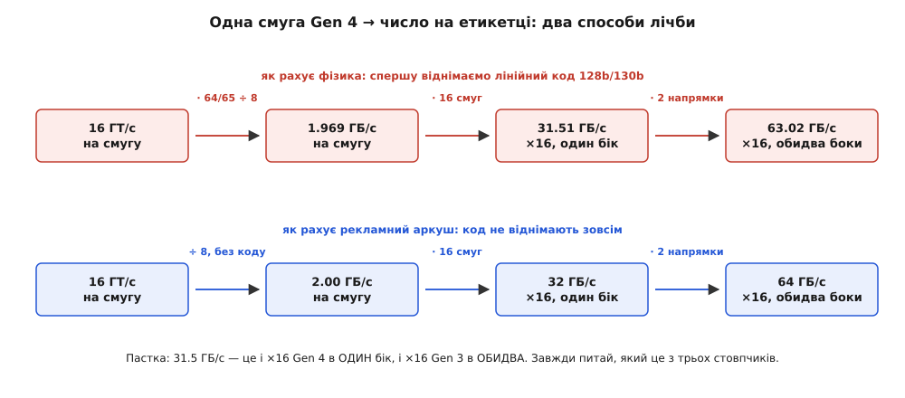
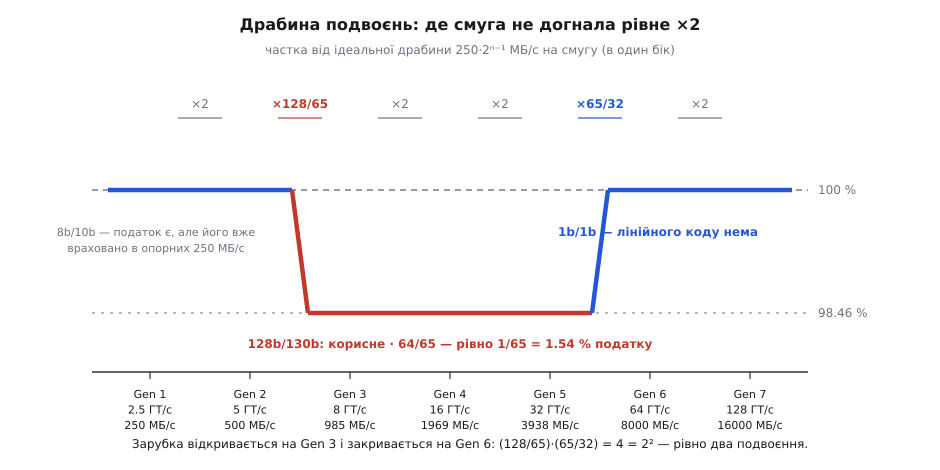

# 🧮 Скільки насправді дає смуга й з'єднання PCIe

Одне й те саме з'єднання PCIe законно описують трьома різними числами — і саме тому в документації чипсета, на етикетці диска й у вікні бенчмарка стоять цифри, які не сходяться між собою. Тут виведено кожне з них з однієї формули: звідки береться 985 МБ/с на смугу, чому ×16 четвертого покоління — це 31.5 ГБ/с, а на коробці пише 64, і як подвоєння накопичується з покоління в покоління, двічі збиваючись, але в сумі лишаючись точним.

## Формула й три домовленості

Усе рахування вміщається в один рядок. Швидкість лінії задана в гігатрансферах за секунду — це кількість елементарних передач за секунду, тобто скільки бітових позицій пробігає дротом. Частину цих позицій забирає лінійний код, тож корисних бітів менше. Далі — вісім бітів на байт і стільки смуг, скільки їх у з'єднанні:

```
B₁ = f · c / 8            ГБ/с на одну смугу в один бік
B  = B₁ · N               ГБ/с на з'єднання в один бік

f — швидкість лінії, ГТ/с
c — коефіцієнт лінійного коду (корисні біти ÷ біти в лінії)
N — кількість смуг (1, 2, 4, 8, 16)
```

Коефіцієнти беруться з трьох кодів, що їх PCIe вживав за свою історію ([SerDes](topic:electronics/serdes) — про те, як ці коди влаштовані й навіщо):

```
8b/10b      c = 8/10   = 4/5      покоління 1 і 2
128b/130b   c = 128/130 = 64/65   покоління 3, 4, 5
1b/1b       c = 1                 покоління 6 і 7
```

Скорочений дріб 64/65 варто запам'ятати: податок другого коду — це рівно одна частина з шістдесяти п'яти, тобто 1.538 %. Не «приблизно півтора відсотка», а точна раціональна величина, і далі вона проступить у кожному числі.

Тепер три домовленості, у яких і ховається розбіжність цифр.

**Гігабайт тут десятковий.** ГБ = 10⁹ байтів, МБ = 10⁶ байтів — так рахує і специфікація, і виробник диска. Операційні системи й частина бенчмарків показують гібібайти, ГіБ = 2³⁰ байтів, а це на 7.37 % більша одиниця. Одне й те саме значення в двох одиницях:

```
1.969 ГБ/с · 10⁹ / 2³⁰ = 1.834 ГіБ/с
7.000 ГБ/с · 10⁹ / 2³⁰ = 6.519 ГіБ/с
```

Диск, що чесно віддає свої «7 ГБ/с», у вікні з гібібайтами покаже 6.5 — і жодного обману тут нема, просто дві різні одиниці.

**Число — на один бік.** Смуга двобічна: пара «туди» й пара «назад» працюють одночасно й незалежно, кожна на повну швидкість. Тому будь-яку цифру можна подати вдвічі більшою, назвавши її сумарною. PCI-SIG у своїх таблицях так і робить, а більшість інженерних розрахунків — ні.

**Лінійний код або віднімають, або ні.** Найбільша пастка. Рекламні таблиці часто рахують просто `f · N · 2 / 8` — беруть гігатрансфери за гігабіти, ніби коду не існує. Звідси й круглі 32, 64, 128 ГБ/с там, де фізика дає 31.5, 63.0, 126.0.

## Звідки 985 МБ/с

Пройдімо покоління від найпершого. Перші два під кодом 8b/10b:

```
Gen 1:  2.5 · 4/5 / 8 = 2.0 / 8 = 0.250 ГБ/с =  250 МБ/с
Gen 2:  5.0 · 4/5 / 8 = 4.0 / 8 = 0.500 ГБ/с =  500 МБ/с
```

Третє покоління цікаве арифметичним збігом: його швидкість — рівно 8 ГТ/с, а ділити треба теж на вісім. Частота скорочується начисто, і на смузі лишається сам коефіцієнт коду, тільки вже в гігабайтах за секунду:

**Пропускна здатність однієї смуги PCIe Gen 3**
```
B₁ = f · c / 8
   = 8 ГТ/с · (128/130) / 8
   = (8/8) · 64/65
   = 64/65 ГБ/с
   = 0.9846153… ГБ/с
   = 984.6 МБ/с   →   у таблицях округлюють до 985
```

Ось і все походження знаменитих 985: це округлення дробу 64/65, записаного в мегабайтах за секунду. Число некругле саме на ту одну шістдесят п'яту, що йде на синхромітку кожного блоку.

Природно спитати, чому ж не зробили круглу тисячу. Порахуймо, яка частота дала б рівно 1000 МБ/с на смугу, тобто рівно вдвічі більше за друге покоління:

```
f · (128/130) / 8 = 1.0 ГБ/с
f = 8 · 130/128 = 8 · 65/64 = 8.125 ГТ/с

перевірка:  8.125 · 128/130 = 8.000 Гбіт/с рівно
```

Тобто точне подвоєння коштувало б 8.125 ГТ/с. А під старим кодом 8b/10b те саме подвоєння вимагало б аж 10 ГТ/с (10 · 0.8 = 8 Гбіт/с) — і саме десять гігатрансферів виявилися неприйнятними: на такій частоті потрібен був би дорожчий діелектрик плати, складніша й ненажерливіша еквалізація, а весь наявний парк роз'ємів і плат, розрахований на 5 ГТ/с, довелося б переробляти. Тому взяли круглі 8 ГТ/с — на 20 % нижче за те, чого просив старий код, і на 1.5 % нижче за точне подвоєння. Півтора відсотка віддали за круглу, електрично посильну частоту.

Четверте й п'яте покоління просто подвоюють частоту при тому самому коді, тож дроби ті самі, лише вдвічі й учетверо більші:

```
Gen 4:  16 · 64/65 / 8 = 2 · 64/65 = 128/65 = 1.9692 ГБ/с = 1969 МБ/с
Gen 5:  32 · 64/65 / 8 = 4 · 64/65 = 256/65 = 3.9385 ГБ/с = 3938 МБ/с
```

## Ширина: чому ×16 у четвертому — це 31.5 ГБ/с

Смуги в з'єднанні незалежні, тож пропускна здатність множиться на їхню кількість без жодних поправок — розкидання байтів по смугах нічого не з'їдає. Для шістнадцяти смуг четвертого покоління:

**Пропускна здатність з'єднання ×16 PCIe Gen 4**
```
B = B₁ · N
  = (128/65) ГБ/с · 16
  = 2048/65 ГБ/с
  = 31.5077 ГБ/с   в один бік
```

А тепер ті самі шістнадцять смуг, порахованих двома іншими способами:

```
в один бік, з відніманням коду   = 31.51 ГБ/с
обидва боки, з відніманням коду  = 63.02 ГБ/с
обидва боки, без віднімання коду = 16 · 16 · 2 / 8 = 64 ГБ/с   ← число з реклами
```

Усі три правильні; питання лише в тому, що саме лічать. «64 ГБ/с» на коробці материнської плати — це сума обох напрямків за гігатрансферами, ніби кожен трансфер несе повний біт даних. Реальний потік корисних байтів в один бік удвічі й ще на 1/65 менший.


*Різниця між «31.5» і «64» — не в дроті, а в тому, які два множники дорогою застосували: коефіцієнт коду й подвоєння за напрямками.*

Тут же чигає окрема пастка: **число 31.5 ГБ/с трапляється двічі й означає різне**. Це і ×16 четвертого покоління в один бік, і ×16 третього покоління в обидва боки:

```
Gen 4 ×16, один бік    = 16 · 1.9692 = 31.51 ГБ/с
Gen 3 ×16, обидва боки = 16 · 0.9846 · 2 = 31.51 ГБ/с
```

Збіг не випадковий: перехід від третього до четвертого покоління подвоїв смугу, а перехід від одного напрямку до двох теж подвоює — одне й те саме подвоєння, прикладене з різних боків. Побачивши «31.5», перше питайте, за яким із трьох способів лічби це число здобуто.

> 🔧 **Навіщо це.** Переплутати домовленість — це помилитися рівно вдвічі, і саме так народжуються розрахунки, у яких «запасу вдосталь», а плата захлинається. Правило одне: і потребу пристрою, і стелю слота лічіть в однакових одиницях — корисні байти, в один бік, з відніманим кодом. Тоді диск на 7 ГБ/с чесно лягає проти 7.88 ГБ/с чотирьох смуг четвертого покоління, і одразу видно, що запасу там десята частина — а не вдвічі з гаком, як здалося б за рекламними 16 ГБ/с того самого слота.

Повна таблиця (усі числа — корисні байти в **один** бік, десяткові ГБ/с):

| Покоління | f, ГТ/с | Код | ×1 | ×4 | ×8 | ×16 |
|---|---|---|---|---|---|---|
| 1 (2003) | 2.5 | 8b/10b | 0.250 | 1.00 | 2.00 | 4.00 |
| 2 (2007) | 5 | 8b/10b | 0.500 | 2.00 | 4.00 | 8.00 |
| 3 (2010) | 8 | 128b/130b | 0.985 | 3.94 | 7.88 | 15.75 |
| 4 (2017) | 16 | 128b/130b | 1.969 | 7.88 | 15.75 | 31.51 |
| 5 (2019) | 32 | 128b/130b | 3.938 | 15.75 | 31.51 | 63.02 |
| 6 (2022) | 64 | 1b/1b + FEC | 8.000 | 32.00 | 64.00 | 128.0 |
| 7 (2025) | 128 | 1b/1b + FEC | 16.00 | 64.00 | 128.0 | 256.0 |

У таблиці впадає в око діагональ: подвоєна ширина дає те саме, що й наступне покоління на початковій. Gen 3 ×8 і Gen 4 ×4 — обидва 7.88 ГБ/с; Gen 4 ×8 і Gen 5 ×4 — обидва 15.75. Збіг точний скрізь, де код не мінявся; на межі зміни коду діагональ розходиться рівно на ту саму 1/65 (Gen 2 ×8 дає 4.00, а Gen 3 ×4 — 3.94). Практичне правило звідси просте: коли смуг бракує, покоління вище рятує майже так само, як удвічі ширший слот.

## Драбина подвоєнь: де вона провисає й де вирівнюється

Перевірмо тепер, чи кожне покоління справді подвоює попереднє. Відношення сусідніх поколінь розкладається на два множники — приріст частоти й приріст коду:

```
B(n+1) / B(n) = ( f(n+1)/f(n) ) · ( c(n+1)/c(n) )
```

Найцікавіший — перехід від другого до третього, де змінилося і те, і те. Приріст коду рахується точно:

```
c₃/c₂ = (128/130) ÷ (8/10) = (128/130) · (10/8) = 1280/1040 = 16/13 ≈ 1.2308
```

Тобто перехід з 8b/10b на 128b/130b дав рівно 16/13 — плюс 23.08 % корисних бітів із тієї самої лінії. Разом із приростом частоти 8/5:

```
B₃/B₂ = (8/5) · (16/13) = 128/65 = 1.9692
```

Подвоєння не дотягнуло рівно на ту саму одну шістдесят п'яту. Уся драбина відношень виглядає так:

```
Gen 1 → 2:   5/2.5 · 1        = 2
Gen 2 → 3:   8/5   · 16/13    = 128/65 = 1.9692    ← недобір 1/65
Gen 3 → 4:   16/8  · 1        = 2
Gen 4 → 5:   32/16 · 1        = 2
Gen 5 → 6:   64/32 · 65/64    = 65/32  = 2.0313    ← надбір 1/64
Gen 6 → 7:   128/64 · 1       = 2
```

Тепер найкрасивіше. Перемножмо всі шість відношень — це загальний приріст від першого покоління до сьомого:

```
2 · (128/65) · 2 · 2 · (65/32) · 2 = 2⁴ · (128/65)·(65/32)
                                    = 16 · (128/32)
                                    = 16 · 4 = 64 = 2⁶
```

Шістдесят п'ятірки скоротилися начисто. Недобір, який PCIe узяв у борг на третьому поколінні, віддано рівно й до копійки на шостому: там код помножив корисне на 64/65, тут його зняття помножило на 65/64 — той самий дріб, спершу перевернутий, потім прямий. Тому шість кроків дали рівно шістдесят чотири рази, без залишку: 250 МБ/с · 64 = 16 000 МБ/с на смугу в сьомому поколінні.

Звідси й закритий вигляд усієї драбини:

```
B₁(n) = 250 МБ/с · 2ⁿ⁻¹ · d(n),   де   d = 64/65 для n = 3, 4, 5
                                        d = 1     для n = 1, 2, 6, 7
```

Тобто це ідеальна геометрична драбина з кроком два, у якій вирізано одну зарубку глибиною 1/65 — і зарубка триває рівно ті три покоління, що несуть код 128b/130b.


*Зарубка відкривається там, де вмикається код 128b/130b, і закривається там, де лінійного коду не стає зовсім; проміжні покоління просто подвоюють частоту й тримають глибину незмінною.*

## Шосте покоління: трансфер більше не дорівнює символу

Починаючи з шостого покоління у формулі ламається одне мовчазне припущення. Досі гігатрансфер був і бітом у лінії, і символом на дроті — одне й те саме. Із чотирирівневою модуляцією [PAM4](topic:electronics/pam4) один символ несе два біти, тож ці величини розходяться:

```
швидкість передачі  = 64 ГТ/с      (бітових позицій за секунду)
символьна швидкість = 32 ГБод      (символів за секунду)
частота Найквіста   = 16 ГГц       (та сама, що й у п'ятому поколінні)
```

Саме заради останнього рядка все й затіяно: дріт бачить рівно ту саму найвищу частоту, що й на 32 ГТ/с, а даних крізь нього проходить удвічі більше. У формулі `B₁ = f · c / 8` нічого міняти не треба — `f` і далі рахує бітові позиції, — але пам'ятати про розрив варто: осцилограф на такій лінії покаже 32 мільярди символів за секунду, а не 64.

Другий злам — лінійного коду не стало взагалі. Кодування 1b/1b означає, що жодного зайвого біта на синхромітки не витрачається, `c = 1`, і смуга дає рівно 8 ГБ/с. Натомість дані пакують у кадри сталого розміру — FLIT'и по 256 байтів, — і всередині такого кадру частина місця зайнята перевіркою:

```
FLIT = 256 байтів
  236 — TLP (корисні пакети)
    6 — DLP (службові пакети рівня з'єднання)
    8 — CRC (контрольна сума кадру)
    6 — FEC (завадостійкий код, три групи по 2 байти)
```

Завадостійке кодування тут не розкіш: чотири рівні PAM4 утричі тісніші за два, помилки трапляються часто, і [FEC](topic:communications/fec-codes) виправляє їх на льоту, замість переграти весь пакет. Але 14 байтів із 256 — це 5.5 %, і виникає питання лічби: чи вважати їх продовженням лінійного коду?

```
якщо CRC і FEC — «код лінії»:  8 · 242/256 = 7.5625 ГБ/с на смугу  (×16 → 121.0 ГБ/с)
якщо CRC і FEC — «протокол»:   8 · 1       = 8.0000 ГБ/с на смугу  (×16 → 128.0 ГБ/с)
```

Обидва числа трапляються в довідниках, і обидва не помилкові. Для порівняння з рядками 985 і 1969 правильний другий: у поколіннях 1–5 контрольна сума й кадрування теж існували, але їх завжди відносили до накладних витрат пакета, а не до лінійного коду. Тримайте межу в тому самому місці — і драбина лишається рівною.

## Від смуги до файлу: податок пакета

Усе пораховане дотепер — стеля лінії. Реальні дані їдуть у пакетах, а кожен пакет несе обгортку. Порахуймо її точно.

У поколіннях 1 і 2 обгортка складалася з мітки початку (1 байт), порядкового номера (2 байти), контрольної суми LCRC (4 байти) і мітки кінця (1 байт) — вісім байтів. У третьому поколінні кадрування переробили: стартова мітка STP розрослася до чотирьох байтів і вбирає в себе довжину пакета, її парність, кадрову контрольну суму й той самий порядковий номер, а мітка кінця зникла зовсім — кінець пакета приймач вираховує з довжини. Разом із LCRC знову виходить вісім байтів. Плюс заголовок самого пакета:

```
обгортка = 8 байтів (кадр + номер + LCRC)
заголовок = 12 байтів (32-розрядна адреса) або 16 (64-розрядна)

накладні на пакет = 20 або 24 байти
корисна частка = MPS / (MPS + накладні)
```

`MPS` тут — максимальний розмір навантаження, узгоджений між кінцями при переліку пристроїв; на практиці 128, 256 або 512 байтів:

| MPS, байтів | 32-розрядна адреса | 64-розрядна адреса |
|---|---|---|
| 128 | 86.5 % | 84.2 % |
| 256 | 92.7 % | 91.4 % |
| 512 | 96.2 % | 95.5 % |

Видно, чому за MPS воюють: перехід зі 128 на 256 байтів додає близько семи відсотків пропускної здатності задарма, самою лише домовленістю.

Лишаються дві дрібніші статті. Раз на 370–375 блоків у потік вставляють SKP-набір для компенсації розбіжності опорних тактів — це один блок із трьохсот сімдесяти, близько 0.27 %. І службові пакетики рівня з'єднання (квитанції ACK, поповнення кредитів) з'їдають ще частку відсотка на однобічному потоці й помітно більше, коли дані густо йдуть в обидва боки.

Складімо все для найпоширенішого випадку — твердотілого диска на чотирьох смугах четвертого покоління:

**Реальна стеля NVMe-диска, Gen 4 ×4, MPS 256 байтів, 64-розрядні адреси**
```
стеля лінії      = 4 · 1.9692                  = 7.877 ГБ/с
корисна частка   · 256/280 = 0.9143            = 7.202 ГБ/с
SKP-набори       · (1 − 0.0027)                = 7.182 ГБ/с
службові пакети  · 0.99                        = 7.11  ГБ/с
```

Ось звідки «до 7 ГБ/с» на етикетці — і воно чесне: виміряні швидкості читання таких дисків лягають у 6.6–7.0 ГБ/с, тобто впритул під розраховану стелю. Різниця між 7.9 і 7.1 — це не втрати десь у дроті: майже вся вона припадає на двадцять чотири байти обгортки при кожних двохстах п'ятдесяти шести байтах даних, і лише останні відсоткові крихти — на службові вставки в потоці.

У шостому поколінні цей податок міняє форму. Кадрування, номер і контрольна сума переїхали з кожного пакета в кадр FLIT, тож пакет платить лише заголовком, зате кадр платить своїми 236 байтами TLP-місця з 256:

```
Gen 5:  256/(256+24)                = 91.4 %
Gen 6:  (256/272) · (236/256) = 236/272 = 86.8 %
```

Байт у байт шосте покоління трохи марнотратніше — завадостійкий код не буває безплатним. Але лінія подвоїлася, тож у корисних гігабайтах смуга все одно йде вгору: 3.60 → 6.94 ГБ/с, тобто в 1.93 раза.

## Зворотна задача: скільки смуг замовляти

Ту саму формулу зручно розвертати. Якщо пристрій має віддавати `B` гігабайтів за секунду, потрібна ширина:

```
N ≥ B / B₁,  округлити вгору до 1, 2, 4, 8, 16
```

Мережева карта на 25 Гбіт/с потребує 25/8 = 3.125 ГБ/с у кожен бік:

```
Gen 3:  3.125 / 0.985 = 3.17  →  ×4
Gen 4:  3.125 / 1.969 = 1.59  →  ×2
```

Карта на 100 Гбіт/с (12.5 ГБ/с) вимагає 12.70 смуг третього покоління — тобто ×16 — або 6.35 смуг четвертого, тобто ×8. Саме тому такі карти трапляються і в ×16 під третє покоління, і в ×8 під четверте: та сама швидкість дротом, різна ширина крайового роз'єму.

Одне застереження: `B₁` у цій формулі — стеля лінії, а не корисний потік. Для чесного запасу ділити треба не на саму стелю, а на стелю, помножену на корисну частку пакета, — і тоді 100-гігабітна карта на четвертому поколінні просить 12.5 / (1.969 · 0.914) = 6.94 смуги, усе ще ×8, але вже без жодного запасу. Округлення вгору до наступного степеня двійки тут не бюрократія, а той самий резерв, який з'їдають обгортки пакетів.
