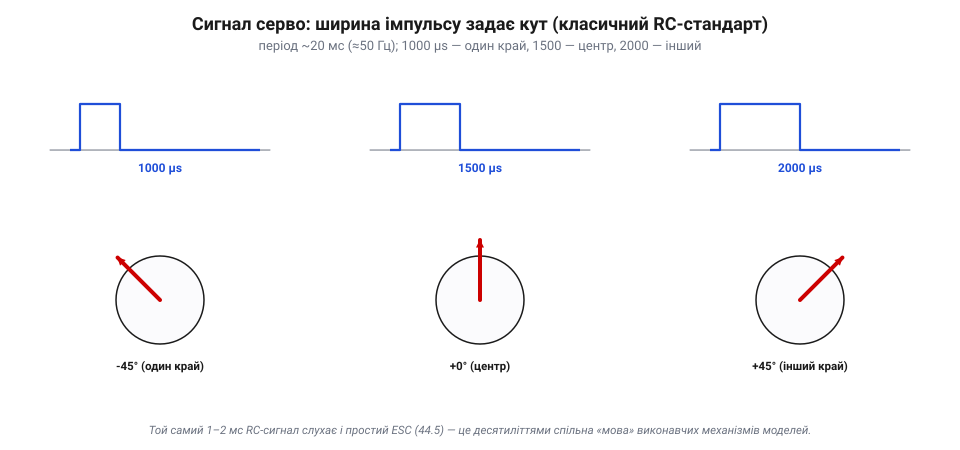
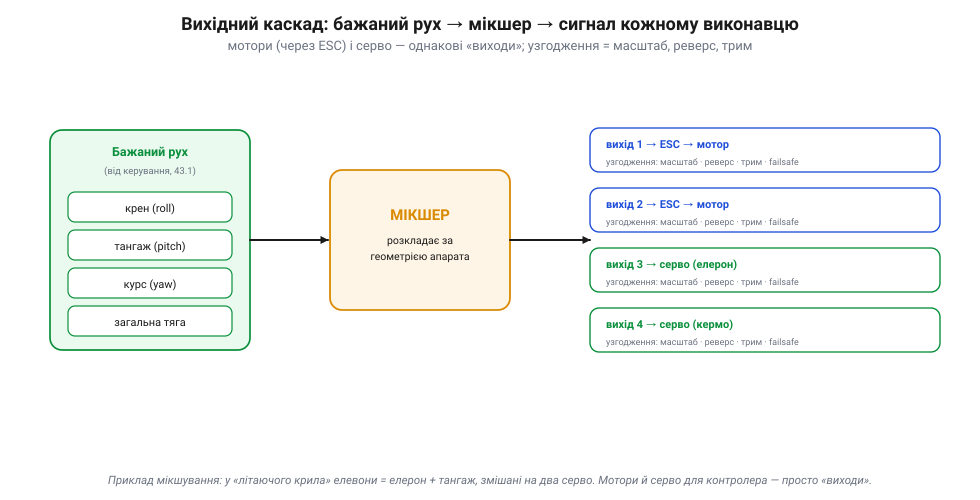

# Серво й керма; узгодження сигналів керування

Мультикоптер керує собою самою лише **тягою** — змінюючи оберти моторів. Але літак нахиляє елерони, руль висоти й напряму; гелікоптер змінює крок лопатей; ровер повертає колеса; камера висить на стабілізованому підвісі. Усе це — рух **механічних поверхонь**, і робить його інший виконавчий механізм — **серворушій** (*servo*). А ще лишається питання, спільне для всіх виходів: як зробити, щоб сигнал контролера **підійшов** саме цьому виконавцю. Про серво й це узгодження сигналів — нижче.

### Серво: маленький контур, що тримає кут

Найважливіше зрозуміти одразу: серво й мотор — принципово різні. Моторові ти командуєш **швидкість**, і він крутиться безперервно. Серво ти командуєш **кут**, і воно повертає вал у цю позицію й **тримає** її. Як воно це робить? Усередині — крихітний замкнений контур:


*Рис. Серво — це міні-автопілот для одного вала. Усередині: маленький мотор через редуктор крутить вихідний вал (качалку), а **потенціометр** на валу міряє його **справжній** кут. Схема щомиті порівнює заданий кут (із ширини імпульсу) з виміряним і підкручує мотор, поки різниця не зникне. Це той самий зворотний зв'язок, що й у [пропорційному регуляторі](book:math/proportional-control), тільки відлитий у залізо й присвячений одному валу.*

Тобто всередині серво ховається вся логіка [замкненого регулятора](book:math/proportional-control) у мініатюрі: **помилка → корекція → вимір → знову помилка**. Подаси команду «30°» — серво активно тримає 30°, опираючись зовнішнім силам (вітру на кермі, навантаженню на колесі); штовхнеш вал — воно поверне його назад. Саме тому серво ставлять там, де треба **утримувати позицію** проти зусиль, а не просто крутити.

Кілька рис цього внутрішнього контуру варто знати. У серво є **мертва зона** (deadband) — крихітний діапазон навколо цілі, де воно вже «не смикається», щоб не дрижати без потреби; звідси й невелика неточність утримання. На краях ходу серво впирається в механічний обмежувач — туди не варто «тиснути» командою надовго, бо мотор гудітиме під струмом намарно. А **момент утримання** — це сила, з якою серво опирається спробі зрушити вал: що вона більша, то твердіше кермо стоїть проти потоку, але то більший струм серво тягне під навантаженням.

І не лише керма. Серво рухають усе, що має ставати в позицію: підвіси камер (тримати горизонт чи вести ціль), забірне шасі, скиди вантажу, заслінки, навіть випуск парашута. Скрізь та сама ідея — «стань у заданий кут і тримай», — тож, упізнавши серво, питай не «що це», а «яку поверхню чи механізм воно позиціює».

> 📜 Слово «серво» — від **серворушія** (*servomechanism*): систем, що за зворотним зв'язком тримають механізм у заданому положенні. Їх відточили у XX столітті для серйозних задач — стернування кораблів, наведення гармат і антен (особливо у Другу світову, де точність наведення вирішувала все). Хобі-серво з радіокерованих моделей — прямий мініатюрний нащадок тих важких систем; та сама ідея зворотного зв'язку, лише завбільшки із сірникову коробку.

> 🔧 **Навіщо це.** Тримай розрізнення «мотор ↔ серво» завжди: мотор крутить (швидкість/тяга), серво позиціює (кут і утримання). На чужому апараті це одразу каже, що чим керується: бачиш серво на кермі — ним правлять **кутом** через окрему петлю; бачиш мотор на гвинті — ним правлять **обертами** через ESC.

### Сигнал серво: ширина імпульсу = кут

Як контролер каже серво потрібний кут? Тим самим **класичним RC-сигналом**, яким керують і простим [регулятором обертів](book:electronics/esc):


*Рис. Мова серво — ширина імпульсу. Імпульс ~1000 мкс ставить качалку в один край, ~1500 мкс — у центр (нейтраль), ~2000 мкс — в інший край; повторюється кожні ~20 мс (≈50 Гц). Це десятиліттями спільний «RC-стандарт» виконавчих механізмів моделей — тому той самий сигнал розуміє і простий регулятор обертів.*

Серво бувають **аналогові** й **цифрові**. Аналогове підкручує мотор приблизно з тим самим темпом ~50 Гц, що й вхідний сигнал; цифрове має всередині швидший внутрішній цикл (сотні герц), тож реагує жвавіше, міцніше тримає позицію й дає більший момент — але споживає більше струму. Решта характеристик серво — **момент** (скільки кг·см утримає на качалці), **швидкість** (секунд на 60° повороту), напруга й матеріал шестерень (пластик чи метал).

Розміри теж різні — від «стандартних» (класична коробочка ~40 г) до мікро- й субмікро-серво для маленьких апаратів. Окрім розміру, серво різняться шестернями (пластик — легше й дешевше; метал — міцніше під ударним навантаженням), наявністю підшипника на валу та робочою напругою (часто 5 чи ~7.4 В — вища дає більший момент і швидкість). Підбираючи серво, дивляться на трійцю «момент — швидкість — вага» під конкретну поверхню: важке кермо швидкого літака потребує сильного й прудкого серво, легкий елерон малятка — крихітного.

Варто знати й межі класичного RC-сигналу. Ширину імпульсу 1000–2000 мкс контролер і приймач розрізняють приблизно з кроком у мікросекунду — звідси близько тисячі градацій кута: зазвичай досить, але не більше. До того ж аналоговий імпульс трохи **дрижить** від шуму, а оновлюється лише ~50 разів на секунду. Для цифрових серво контролер може гнати сигнал частіше (сотні герц), а сучасні цифрові протоколи виходу (рідня тих, що в [регуляторах обертів](book:electronics/esc)) поступово приходять і сюди — але добрий старий «півтори мілісекунди» досі лишається спільною мовою виконавчих механізмів.

Останнє про сам сигнал: серво (як і [регулятор обертів](book:electronics/esc)) має три проводи — живлення, землю й сигнал. Сигнальний несе ті самі 1–2 мс імпульси, а от **спільна земля** з контролером обов'язкова: без неї імпульс «нема відносно чого» міряти, і серво поводиться хаотично. Тому за роздільного живлення серво й логіки їхні землі однаково **з'єднують**. Дрібниця, але забути її — класична причина, чому «все підключив, а серво смикається».

> 🔧 **Навіщо це.** «1–2 мс, 50 Гц» — спільна мова контролера, приймача й серво: 1.5 мс — це нейтраль. А вибираючи серво, дивись на **момент** і **швидкість**: замалий момент — і кермо «віддуватиме» назад потоком повітря; замала швидкість — і апарат реагуватиме на команди із запізненням. Цифрове тримає краще, але дужче гріється й тягне струм.

### Від серво до поверхні: качалка й тяга

Оберт серво ще треба **передати** на кермо. Робить це проста механіка:


*Рис. Від оберту до відхилення. Серво повертає свій важіль (качалку), жорстка **тяга** (пушрод) передає рух на качалку керма, і поверхня відхиляється на шарнірі. Довжини качалок задають «передачу»: довша качалка серво або коротша качалка керма — більший хід поверхні. Налаштування ходу й нейтралі (трим) — частина узгодження сигналу з конкретною механікою.*

Тут і ховається перший рівень **узгодження** — механічний. Хід поверхні (throw) має бути таким, як треба апарату: замалий — мляве керування, завеликий — апарат смикається й може зірватися в потік. Нейтраль качалок виставляють так, щоб за сигналу 1500 мкс поверхня стояла рівно. Це роблять і механічно (довжина тяг, отвори в качалках), і програмно (трим, межі ходу в налаштуваннях виходу).

Налаштовуючи механіку, дбають про дві речі. По-перше, **нейтраль**: серво ставлять у центр (1500 мкс) і вже тоді кріплять качалку та тягу так, щоб поверхня стояла рівно, — а дрібний залишок прибирають тримом. По-друге, **люфт** (backlash): будь-яка слабина в качалках, тягах і кріпленнях означає, що поверхня трохи «гуляє» незалежно від серво, — а це шум і неточність у самому кінці контуру керування. Тому тяги роблять жорсткими, а з'єднання — щільними: млява механіка зведе нанівець найточніше серво.

> 🔧 **Навіщо це.** Якщо в чужого апарата кермо стоїть не по центру в нейтралі або ходить замало/забагато — дивись на механіку тяг і на налаштування ходу/триму виходу, а не на «зламане серво». І пам'ятай про **навантаження**: серво на великому кермі швидкого літака відчуває потужний потік — момент серво має його перебороти, інакше керма «віддме».

### Узгодження сигналів: вихідний каскад

Тепер — головне узагальнення теми, заради якого вона й існує. Для контролера **мотори й серво — це однакові «виходи»**. Він не мислить «ШІМ на пін 3»; він мислить бажаним рухом апарата — і спеціальний каскад розкладає це бажання по фізичних виходах:


*Рис. Як бажаний рух стає сигналами виконавцям. Контролер видає бажані крен, тангаж, курс і тягу; [мікшер](book:algorithms/motor-mixer) розкладає їх по фізичних виходах за геометрією апарата; а кожен вихід проходить **узгодження** — масштаб, реверс, трим, положення failsafe — і йде до свого виконавця: мотора через ESC або серво. Для контролера обидва типи — просто пронумеровані «виходи».*

«Узгодження сигналів керування» — це і є цей останній крок: зробити так, щоб абстрактна команда контролера правильно лягла на **конкретний** виконавець. Воно охоплює:

- **мікшування** за схемою апарата (літак, крило, V-подібний хвіст, мультиротор);
- **масштаб і межі** (endpoints) — щоб повний хід команди дав потрібний, але не надмірний хід поверхні;
- **реверс** — якщо серво стоїть «дзеркально», напрям перевертають програмно;
- **трим** — зсув нейтралі;
- **положення failsafe** — куди стати виходу, якщо зв'язок чи система відмовлять.

Найвиразніший приклад мікшування — **елевони** «літаючого крила», де немає окремих елеронів і руля висоти: дві поверхні роблять і те, й те разом:

```
літаюче крило (елевони):
  лівий елевон  = тангаж + крен
  правий елевон = тангаж − крен
   → обидва вгору  = підняти ніс (тангаж)
   → різнойменно   = накренити (крен)
```

Той самий принцип — V-подібний хвіст (руль напряму + висоти на двох поверхнях), диференціал коліс ровера тощо. Мікшер ховає цю геометрію, тож решта стека лишається однаковою для будь-якого апарата — у [шарах ArduPilot](book:programming/ardupilot-layers) `SRV_Channels` — це саме цей вихідний каскад.

Ще складніший приклад — **автомат перекосу** (swashplate) гелікоптера: три (а то й більше) серво разом нахиляють тарілку, що змінює крок лопатей. Щоб підняти ніс — серво рухаються в одній комбінації, щоб дати загальний крок угору — синхронно, щоб накренити — в іншій. Жодне серво тут не відповідає за «один» канал — кожне є **сумою** кількох команд за геометрією тарілки. Це той самий мікшер, доведений до краю: кілька входів керування розкладаються на кілька серво за тригонометрією механізму.

Варто оцінити силу цієї абстракції «виходів». У зрілій прошивці кожному фізичному виходу **призначають функцію** (цей пін — елерон, той — руль висоти, той — мотор 1), і логіка апарата оперує функціями, а не пінами. Завдяки цьому **та сама прошивка** літає геть різними апаратами: щоб зробити з мультикоптера літак, не переписують код — лише перепризначають виходи й вибирають інший мікшер. Залізо інше, стек той самий — рівно та переносність, яку дає [шарувата архітектура](book:programming/ardupilot-layers).

Окремо про **failsafe-положення** виходів. На відміну від мультикоптера, який при втраті зв'язку виконує наперед задану дію (залежно від налаштувань — RTL, SmartRTL, посадку чи навіть «нічого не робити»; а як GPS непридатний, RTL зазвичай переходить у посадку), апарат із кермами мусить знати, **куди поставити кожну поверхню**, якщо все піде не так: газ — на нуль (чи в режим планування), керма — у безпечне положення (часто легкий крен і набір висоти по колу, поки зв'язок не відновиться). Ці положення задають наперед — як і всюди в [політному контролері](book:programming/flight-controller), реакція на відмову має бути зашита заздалегідь, а не вигадуватися в аварії.

> 🔧 **Навіщо це.** Це найпрактичніша річ розділу. Перше, що перевіряють на новому апараті, — **узгодження виходів**: чи туди їде кожна поверхня (реверс), чи правильний хід (межі), чи стоїть нейтраль (трим), чи коректне мікшування для цього типу. Переплутаний реверс однієї поверхні — і апарат розіб'ється на першій секунді, керуючи «навпаки». Тому перед першим польотом завжди роблять перевірку: ворухнув апарат — подивився, чи поверхні реагують у правильний бік.

Останнє, суто практичне: серво (а надто кілька) можуть тягти чималий струм, особливо під навантаженням. Тому їх живлять від окремої шини (BEC чи стабілізатора, як у [регуляторі обертів](book:electronics/esc)), **не** від тонкого логічного живлення контролера, — інакше різкий ривок серво «просадить» напругу й перезавантажить усю електроніку в найгірший момент. Це впирається в загальну тему [живлення складних систем](book:electronics/power-rails) та надійності.

### Підсумок теми

Серво — це виконавець **кута**, а не швидкості: усередині крихітний замкнений контур (мотор + редуктор + давач + схема), що тримає задану позицію проти зовнішніх сил, — мініатюрний нащадок серйозних серворушіїв. Командують ним класичним RC-сигналом (1–2 мс, ~50 Гц), а оберт передають на кермо качалками й тягами. Але головне — **вихідний каскад**: для контролера мотори (через ESC) і серво — однакові «виходи», а мікшер і узгодження (масштаб, реверс, трим, failsafe) роблять так, щоб абстрактний «бажаний рух» правильно ліг на конкретне залізо будь-якого апарата. А над усіма цими виконавцями стоїть окреме питання — що буде, коли якийсь із них **відмовить**: на нього відповідає [надлишковість](book:programming/redundancy) і поведінка системи за відмови.

---
