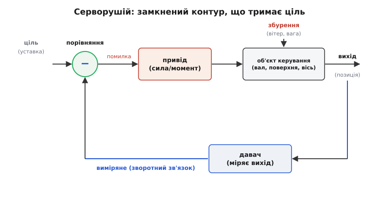
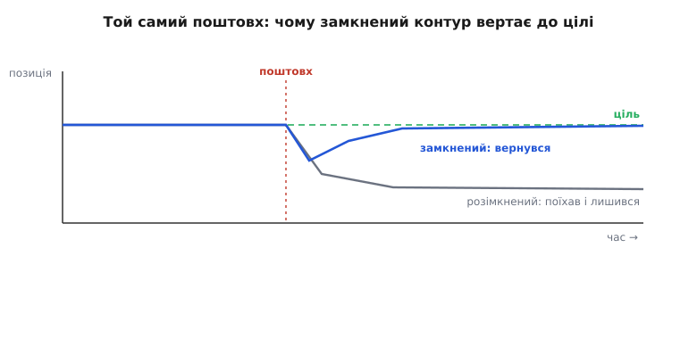
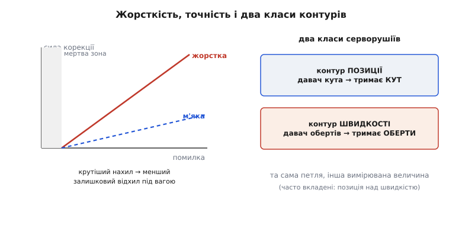

# Сервомеханізм

Поставити вал точно під заданий кут і втримати його, хоч би що тягло вал убік, — задача, з якою звичайний мотор не впорається. Дай моторові напругу — він закрутиться; знімеш — він безвольно піддасться першому ж поштовху. А життя весь час штовхає: на кермо літака тисне зустрічний потік, на плече роборуки — вага деталі, на вісь антени — вітер і тертя в підшипниках. Щоб механізм тримав ціль попри ці збурення, потрібна не більша сила сама собою, а інший спосіб керування — той, що **сам помічає відхил і сам його виправляє**. Цей спосіб і втілює **сервомеханізм** (від лат. *servus* — «слуга»: механізм-слуга, що слухняно відпрацьовує задану команду).

Сервомеханізм — це не якийсь конкретний пристрій, а **принцип побудови**: керована величина (кут, положення, швидкість) весь час вимірюється, порівнюється з бажаною, і різниця гонить привід так, щоб ця різниця зникла. Той самий принцип однаково лежить і в копійчаному моделістському серво завбільшки із сірникову коробку, і в багатотонній установці, що наводить радіотелескоп. Розберімо його від першопричини: чому без вимірювання нічого не виходить, як замкнене кільце тримає ціль проти збурень, з чого воно складається, чим визначається його точність і твердість, і які два головні класи таких механізмів бувають.

## Чому керування наосліп безсиле

Спробуймо найпростіше, що спадає на думку: щоб поставити вал під потрібний кут, подамо на мотор напругу рівно на стільки часу, скільки треба йому, щоб «докрутити». Прикинули — провернеться на 30°, відлічили час, зняли напругу. Ця ідея розсипається миттєво, і варто побачити **чому саме**, бо в цьому «чому» — увесь сенс серворушія.

Біда в тому, що зв'язок між нашою командою (напруга × час) і результатом (кут) **не сталий**. Навантаження на валу щоразу інше — і за ту саму мілісекунду напруги мотор провернеться то далі, то ближче. Просів заряд батареї — обертів менше. Похолодало, загусло мастило в підшипнику — вал ледь зрушив. А найгірше — щойно ми зняли напругу, **ніщо не тримає кут**: поштовх, потік повітря, вага плеча — і вал поїхав із заданої позиції, а ми про це навіть не знаємо.

Корінь усіх цих бід один: ми керуємо **наосліп**. Задаємо вхід і сподіваємося на вихід, ніколи не перевіряючи, що насправді сталося на валу. Таке керування без перевірки результату називають [розімкненим контуром](root:embedded/open-vs-closed-loop): команда йде «вперед», від команди до виконавця, і ніщо не вертається назад. Воно безсиле там, де результат залежить від непередбачуваних збурень, бо не має жодного способу про ці збурення дізнатися.

Вихід напрошується сам: треба **виміряти справжній стан вала** й весь час порівнювати його з бажаним. Не дійшов до цілі — піджени привід уперед; перейшов — поверни назад; став точно — спинися й тримай, а щойно хтось зіб'є вал убік, ту різницю буде видно знову, і привід знову її виправить. Це і є [замкнений контур зі зворотним зв'язком](root:embedded/open-vs-closed-loop): вихід вимірюється й вертається на вхід, тож система сама виправляє власну похибку. Сервомеханізм — його втілення в залізі, присвячене одній керованій величині.

## Кільце, що тримає ціль

Розкладімо серворушій на складові й простежмо, як вони замикаються в кільце. Складових по суті чотири, і кожна потрібна.


*Каркас будь-якого серворушія. Уставка (ціль) і виміряний вихід сходяться у вузлі порівняння; їхня різниця — помилка — гонить привід, привід рухає об'єкт, давач міряє справжній вихід і повертає його назад. Збурення б'є просто в об'єкт — і саме давач робить його видимим для контуру.*

**Об'єкт керування** — те, чим, власне, керуємо: вал із качалкою, поверхня керма, вісь камери, вантаж на плечі. Має масу, інерцію, тертя; на нього діють зовнішні сили. Сам собою він пасивний — стоятиме там, куди його поставили й де його лишили сили.

**Привід** — те, що рухає об'єкт: дає силу або момент у потрібний бік. Усередині це майже завжди мотор із підсилювачем потужності, бо слабка керівна логіка не годна сама живити двигун. Важлива риса: привід має вміти штовхати об'єкт у **обидва** боки — і доганяти ціль, і відкручуватися назад, коли проскочив.

**Давач** (англ. *sensor*, від лат. *sentire* — «відчувати») — орган чуття контуру. Він міряє **справжній** стан об'єкта й перетворює його на сигнал, який можна порівняти із заданим. Для кута це може бути [потенціометр](book:electronics/potentiometer) — подільник напруги, де вал крутить повзунок і знята напруга стає пропорційною до кута, — чи обертовий кодувач; для швидкості — тахометр чи лічба імпульсів за час. Без давача контур сліпий і нічим не кращий за керування наосліп — уся сила серворушія тримається саме на тому, що він **бачить власний результат**.

**Вузол порівняння** — серце контуру. Він бере дві величини, задану (уставку) і виміряну (з давача), і знаходить їхню **різницю — помилку** (англ. *error*, від лат. *errare* — блукати, відхилятися). Сам знак помилки каже, куди гнати привід; величина — наскільки сильно. Велика помилка — жени привід жваво; мала — підкручуй обережно; нульова — стій.

Тепер кільце замкнулося, і варто пройти його колом:

```
уставка − виміряне = помилка → привід рухає об'єкт →
давач міряє новий стан → знову порівняння → ...
```

Кільце крутиться знов і знов — у залізному серво сотні разів на секунду, у важкій установці повільніше, — аж поки помилка не впаде майже до нуля. Тоді привід завмирає, а механізм **активно тримає** ціль. І найважливіше: штовхни об'єкт — давач одразу засіче появу помилки, вузол порівняння її побачить, і привід поверне об'єкт на місце. Саме тому серворушій **опирається** силам, а не піддається їм; саме це відрізняє його від голого мотора, який про відхил нічого не знає.

> 🔧 **Навіщо це.** Тримай у голові головну межу: мотор крутить (керуєш швидкістю обертання), серворушій позиціює (керуєш величиною й утриманням). На чужому пристрої це одразу підказує, що чим керується: бачиш привід із давачем на валу й вузлом порівняння — це сервоконтур, ним правлять **значенням**; бачиш мотор просто на гвинті без вимірювання — ним правлять обертами наосліп. А коли серворушій «не тримає» — підозрюй ланку контуру: найчастіше винні давач (бреше про стан) або привід (недодає сили).

## Чому зворотний зв'язок тримає ціль попри збурення

Чому це кільце справді утримує позицію, а не просто доводить до неї один раз? Корінь — у тому, що контур реагує **не на причину збурення, а на його наслідок**. Йому байдуже, чому вал зійшов із цілі — вітер це, вага чи тертя; він бачить лише, що з'явилася помилка, і працює, поки вона не зникне. Через це одна-єдина петля гасить будь-яке збурення, навіть таке, про яке проєктувальник і не думав.


*Той самий поштовх-збурення, дві поведінки. Без зворотного зв'язку вихід просто з'їжджає й лишається збитим — система не знає, що відхилилася. Замкнений контур бачить помилку й гонить привід назад, аж поки вихід не вернеться до цілі.*

Простежмо обидві лінії. Розімкнена система стояла на цілі, бо так їй один раз задали; поштовх збив вихід — і він лишився збитим назавжди, бо нема чим помітити відхил. Замкнена система після того самого поштовху просіла — але давач негайно засік відхил, помилка зросла, привід штовхнув об'єкт назустріч, і вихід повернувся до цілі. Збурення нікуди не зникло, воно тисне далі; просто контур весь час дотискає проти нього рівно стільки, скільки треба, щоб тримати помилку біля нуля.

Звідси випливає й те, як контур тримає **рухому** ціль, а не лише стоячу. Якщо уставка повзе (скажімо, антена має плавно вести супутник по небу), вихід відстає — і це відставання саме й є помилкою, яку контур весь час підбирає. Доти, доки петля встигає за змінами цілі, вихід іде слід у слід; а наскільки точно й наскільки жваво — це вже питання про твердість контуру й про те, як його налаштувати.

## Помилка, жорсткість і точність

Уся поведінка серворушія тримається на одному числі — помилці; лишилося зрозуміти, як із неї народжуються **твердість** (опір збуренням) і **точність** (наскільки близько до цілі він зрештою стає). Найпростіший спосіб перетворити помилку на дію — дати силу **пропорційно** до неї: що далі вал від цілі, то сильніше його тягнемо назад.

```
сила корекції = K · помилка
```

Тут K — коефіцієнт підсилення (англ. *gain*): число, яке каже, наскільки рішуче контур реагує на той самий відхил. І саме воно задає **жорсткість**. Уявімо, що на об'єкт постійно тисне зовнішня сила F (вага плеча, потік на кермі). Контур стане там, де його власна сила корекції зрівноважить це F:

```
K · помилка = F   →   помилка = F / K
```

Видно одразу: під тим самим навантаженням F більший K дає **меншу** залишкову помилку. Тобто жорсткість — це і є нахил залежності «сила від помилки»: крутий нахил означає, що навіть крихітний відхил породжує велику відсіч, тож вал майже не зрушити; пологий — що об'єкт «віддувається» під вагою помітно далі, перш ніж контур набере силу йому опертися.


*Зліва — звідки береться жорсткість: що крутіший нахил «сила від помилки», то менший залишковий відхил вал дає під тим самим навантаженням, бо контур швидше набирає відсіч. Біля цілі — мертва зона, де контур навмисне не реагує. Справа — два класи серворушіїв за тим, що саме міряє давач.*

Здавалося б, підіймай K — і матимеш ідеально твердий, точний механізм. Та тут чигає межа, і вона принципова. Привід і об'єкт мають **інерцію та затримку**: команда долітає до вала не миттєво, вал не зупиняється вмить. Якщо реагувати надто рішуче, контур щоразу **проскакує** ціль, тоді кидається назад, знову проскакує — і вал розгойдується дедалі дужче замість стати. Тому K не можна нарощувати без кінця: є межа, за якою тверда система перетворюється на трясучу.

Сама лише пропорційна відсіч ще й лишає невеликий сталий недохід до цілі. Лік — дивитися на помилку не як на одне число «зараз», а як на криву в часі й додати до неї ще два погляди: скільки помилки **накопичилося** (це прибирає сталий залишок) і як швидко вона **міняється** (це гасить розгойдування). Так із пропорційної складової виростає регулятор PID, а пошук золотої середини між в'ялістю й трясінням — підбір його трьох коефіцієнтів — і є те, що звуть [налаштуванням контуру](root:embedded/calculus-for-pid).

Окрім підсилення, на точність впливають ще дві дрібниці, без яких картина неповна. Перша — **мертва зона**: вузька смужка навколо цілі, де контур навмисне не реагує. Без неї механізм без упину сіпався б навколо позиції, бо давач завжди трохи шумить і нульової помилки не буває ніколи; платою за спокій є те, що вал стоїть «приблизно там», у межах цієї смужки. Друга — **люфт** і слабина в самій механіці (зазори в передачах, пружність тяг): будь-яка слабина між давачем і об'єктом означає, що об'єкт трохи «гуляє» незалежно від контуру, додаючи неточності вже за спиною давача, там, де контур її не бачить.

> 🔧 **Навіщо це.** Жорсткість і точність — не те саме, і плутати їх дорого. Жорсткий контур міцно тримає проти збурень, але надмірне підсилення вводить його в розгойдування — тоді вал дрижить чи «співає». Точність же впирається ще й у мертву зону, шум давача й люфт механіки. Тому, коли серворушій тримає слабко, спершу думай про підсилення; коли дрижить — про завелике підсилення; а коли стоїть стабільно, але «не там» — про мертву зону та зазори в передачах, а не про сам контур.

## Сила з повільної передачі

Окремо варто спинитися на тому, звідки в серворушія береться сила тримати важкий об'єкт, бо тут ховається елегантний обмін. Мотор усередині майже завжди швидкий і слабкий — сам по собі він не вдержить ні керма проти потоку, ні плеча з вагою. Силу йому додає **редуктор**: набір передач, що міняє швидке слабке обертання на повільне, але сильне, у тій самій пропорції.

```
виграш моменту = передавальне число
момент на валу ≈ момент мотора × передавальне число
(швидкість вала менша в стільки ж разів)
```

Зменшив швидкість у 200 разів — у стільки ж разів виріс момент на вихідному валу. Це звичайна робота [зубчастої передачі](book:electronics/gears-transmission), яка міняє швидкість на момент у пропорції передавального числа: саме редуктор робить кволий моторчик здатним утримувати навантаження, і ту саму заміну сили на відстань видно скрізь у механіці контуру.

Той самий обмін діє й на виході, у важелях, якими оберт вала донось до самого об'єкта. На вал садять качалку, від неї жорстка тяга йде до керованої поверхні. Подовжив качалку — поверхня ходить далі, але сила на ній **падає** в тій самій пропорції:

```
момент на качалці = сила на кінці × довжину качалки
        2 кг·см    =   1 кг        ×    2 см
```

Тобто механізм «2 кг·см» утримає 1 кг на плечі 2 см — або 2 кг на плечі 1 см. Виграв хід — програв силу; цю рівновагу й підбирають, аби об'єкт ходив рівно скільки треба, а контур не лишився без моменту під навантаженням.

## Два класи: контур позиції й контур швидкості

Дотепер ми мовчки говорили про утримання **положення** — кута чи координати. Але та сама петля «вимір → порівняння → корекція» однаково тримає й **швидкість**; різниця лише в тому, **що саме міряє давач і що стоїть в уставці**. Звідси два головні класи серворушіїв.

**Контур позиції** тримає координату: давач міряє кут (чи лінійне положення), уставка — бажана координата, і привід жене об'єкт, поки виміряне положення не зійдеться із заданим. Це класичний випадок «стань під цей кут і тримай»: рулі, підвіси камер, суглоби роборук, столи верстатів. Збурення тут — усе, що зміщує об'єкт із місця: вітер, вага, удар.

**Контур швидкості** тримає темп руху: давач міряє оберти за час, уставка — бажана швидкість, і привід додає чи зменшує силу, поки виміряна швидкість не зрівняється із заданою. Це випадок «крутися рівно з цими обертами, хоч би як мінялося навантаження»: привід стрічки, шпиндель, колесо під змінним опором. Збурення тут — усе, що сповільнює чи розганяє вал: наскочив важчий матеріал, змінився ухил.

Сильна сторона цього погляду в тому, що **петля однакова**, міняється лише вимірювана величина. І тому два контури природно **вкладають** один в одного: зовнішня петля позиції каже, **куди** треба, і видає на виході бажану швидкість; внутрішня петля швидкості цю швидкість відпрацьовує. Так роблять там, де треба і влучно ставати в точку, і гладко рухатися між точками, — у точних приводах верстатів і роботів. Зовнішній контур мислить «де ми», внутрішній — «як швидко йдемо», і разом вони дають і точність позиції, і керований, без ривків, рух до неї.

> 🔧 **Навіщо це.** Перше питання про будь-який серворушій — **що тримає давач**: кут чи швидкість. Це одразу каже, як ним командувати й чого від нього чекати. Контур позиції відповість на «стань тут», контур швидкості — на «йди з таким темпом»; а вкладена пара дає і те, й те. Не сплутавши клас, не шукатимеш від приводу того, на що він не налаштований.

## Де це працює і звідки взялося

Упізнати серворушій легко за самою його суттю — «виміряй ціль і тримай її проти збурень». У цьому ключі він усюди, де щось мусить **точно ставати в позицію або тримати темп**, не зважаючи на зовнішні сили: керовані поверхні літаків і стабілізовані підвіси камер, осі наведення антен і телескопів, столи й шпинделі верстатів, суглоби промислових роботів, точні приводи стрічок і клапанів. Масштаб різний — від грамової коробочки до багатотонної установки, — а ідея одна.

Найдешевший і найпоширеніший представник цього сімейства — моделістське [хобі-серво](book:electronics/hobby-servo) з радіокерування: той самий замкнений контур кута, втиснутий у пластикову коробочку завбільшки із сірникову, де кут задають тривалістю короткого імпульсу. Воно — прямий мініатюрний нащадок важких серворушіїв і добрий приклад принципу в найменшому розмірі, але **окремий**: його конкретику (сигнал, типові межі ходу й моменту, як вибирати) винесено в свою тему, щоб тут лишилася сама ідея.

Народився принцип не в моделях, а в серйозній техніці. Замкнене керування за зворотним зв'язком відточували впродовж XX століття для задач, де помилка коштувала дорого: стернування великих кораблів, наведення корабельних і зенітних гармат, ведення антен — особливо в роки Другої світової війни, коли точність наведення вирішувала результат бою. Сам термін *servomechanism* усталився в інженерній мові тих десятиліть. Варто чесно сказати про статус цієї історії: ідея зворотного зв'язку **колективна й давня** — її коріння тягнеться щонайменше до відцентрового регулятора парових машин XVIII століття, а математичну теорію керування будувало багато інженерів і математиків різних країн. Тож серворушій — не чийсь одноосібний винахід, а зріле втілення давньої ідеї «вимірюй результат і виправляй себе» в точній техніці.

> 📜 Відцентровий регулятор (англ. *governor*) парової машини — ранній зворотний зв'язок у залізі: вантажі на осі розходяться від обертів і самі прикривають подачу пари, тримаючи швидкість сталою. Жодного давача-електроніки — сама механіка міряє свій результат і виправляє його. Це той самий принцип серворушія за два століття до слова «серво».
