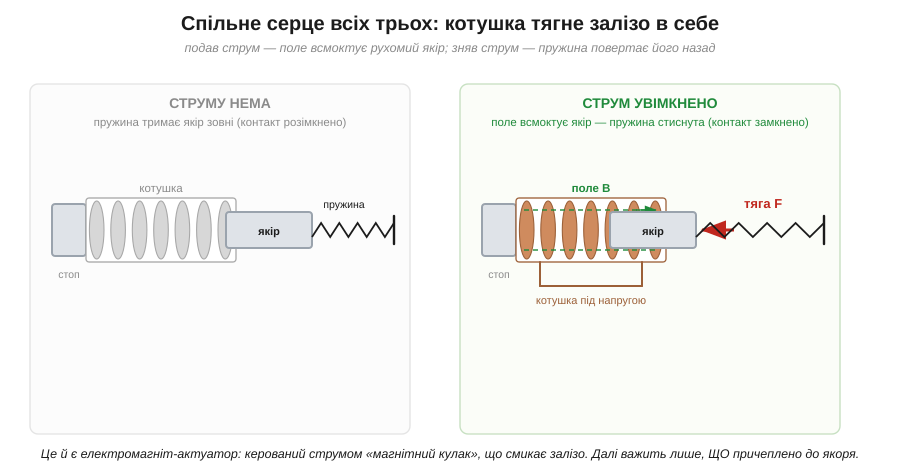
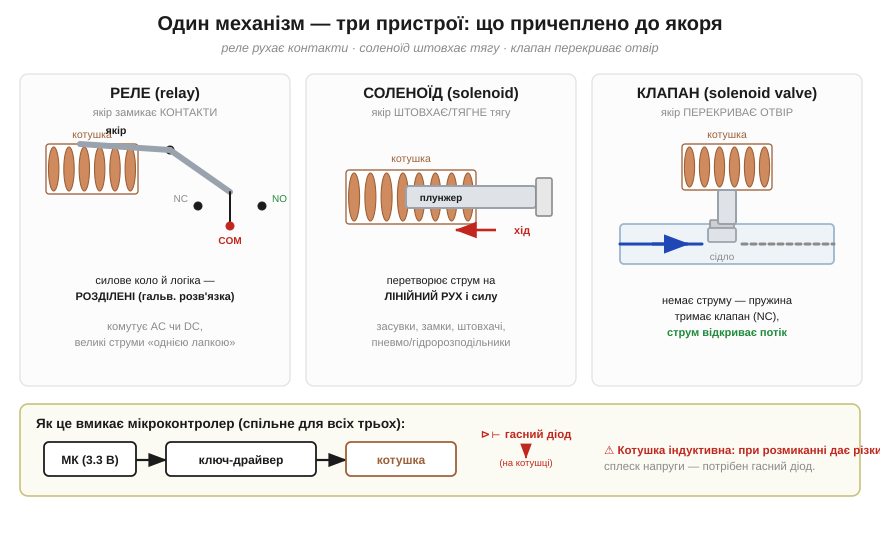

# Соленоїд і реле

Пропусти струм крізь [котушку з осердям](topic:physics/electromagnet) — і вона стягне до себе шматок заліза з відчутною силою; зніми струм — тяга зникне. Це **актуатор** (від латин. *actuare* — «приводити в дію») — перетворювач «струм → рух». Звідси виростає цілий клас деталей, якими мікроконтролер ворушить фізичний світ: **реле** (від франц. *relais* — свіжі коні на поштовій станції, що переймають роботу від утомлених), **соленоїд** (термін увів Ампер 1823 року від грец. *sōlēn* — «трубка, канал», бо котушка має форму трубки) і **електромагнітний клапан**. Серце в усіх трьох одне — той самий [електромагніт](topic:physics/electromagnet); різниться лише те, що причеплено до якоря.

## Що це за клас

Усі три — електромеханічні актуатори з керованою котушкою. У кожному є нерухома котушка на осерді й рухомий феромагнітний **якір** (від латин. *armatura* — «спорядження, обладунок») чи **плунжер** (від англ. *plunger* — «занурювач»), який поле всмоктує всередину. Повертає його назад **пружина**: без струму вона тримає механізм у вихідному стані, а коли з'являється струм — поле перемагає пружину й тягне якір до осердя. Сила тяги росте з кількістю ампер-витків (струм × число витків), тож конструктор задає її намоткою котушки, а не лише напругою.


*Спільне серце всіх трьох пристроїв. Без струму пружина тримає якір зовні; подали струм — магнітне поле B всмоктує якір до осердя проти пружини. Це і є керований струмом «магнітний кулак»: що більше ампер-витків, то сильніша тяга.*

Розрізняє пристрої те, що навантажене на якір. У **реле** якір замикає й розмикає електричні **контакти**: слабкий керувальний сигнал керує сильним колом, до того ж гальванічно відокремленим від нього. У **соленоїді** якір — це штовхач: він дає короткий лінійний хід і силу (засувки, замки, важелі). У **клапані** той самий плунжер сідає на отвір (**сідло**) і перекриває чи пропускає рідину або газ.


*Один механізм — три застосунки: реле рухає контакти (COM/NO/NC), соленоїд штовхає тягу, клапан перекриває отвір. Унизу — спільне коло керування: вивід мікроконтролера керує котушкою не напряму, а через ключ-драйвер; на котушці обов'язковий гасний діод.*

## Чому не напряму від виводу

Котушці актуатора потрібні десятки-сотні міліампер, а часто й окреме вище живлення (5, 12, 24 В) — вивід мікроконтролера на 3.3 В стільки не дає й вигорить. Тому коло завжди триланкове: **вивід МК → ключ-драйвер → котушка**. Драйвер — це [транзисторний ключ](topic:electronics/relay-driver); вивід лише вмикає та вимикає його, а сам струм котушки тече від силового живлення крізь ключ.

Друга обов'язкова деталь — **гасний діод** (англ. *flyback diode*) паралельно котушці. Котушка індуктивна: у мить, коли ключ її розмикає, її власна самоіндукція кидає різкий [сплеск напруги](topic:electronics/inductor-kickback), здатний пробити транзистор. Діод дає цьому струмові безпечний шлях замкнутися сам на себе й гасить викид. Звідси правило без винятків: **без цього діода котушку не комутують**.

> 🔧 **Навіщо це.** Щойно треба фізично щось увімкнути, штовхнути чи перекрити з-під мікроконтролера — [електромагніт](topic:physics/electromagnet) входить у нову роль: котушка + ключ-драйвер + гасний діод, а на якорі — контакти (реле), шток (соленоїд) чи затвор (клапан). Сам вивід нічого не тягне: він лише відкриває ключ, що пускає струм у котушку. Це той самий триланковий каркас для будь-якого індуктивного навантаження — мотора, нагрівача, котушки.

## Розпіновка й підключення

З погляду виводів усе просто. У котушки — **два контакти** (для постійного струму полярність інколи важить, тоді її підписують + / −). У реле додаються три силові: **COM** (спільний), **NO** (англ. *normally open* — розімкнений без струму) і **NC** (англ. *normally closed* — замкнений без струму). У клапана й соленоїда силового боку немає — лише два дроти котушки та механічний вихід (різьба під трубу, шток).

Підключають так: котушку — крізь ключ-драйвер до **окремого** живлення під її напругу, з гасним діодом на ній; вивід МК — на вхід драйвера. Силові COM/NO/NC реле заводять у комутоване коло; патрубки клапана — у магістраль рідини чи газу.

## Перший байт

Керувати таким актуатором напрочуд просто. Звернення до нього — це не команда по шині, а **один рівень на виводі**, що вмикає ключ:

:::tabs
```cpp
pinMode(PIN, OUTPUT);
digitalWrite(PIN, HIGH);   // ключ відкрито → котушка під струмом → якір втягнуто
// реле клацнуло / соленоїд штовхнув / клапан відкрився
digitalWrite(PIN, LOW);    // котушка знеструмлена → пружина повернула якір
```
```python
from gpiozero import OutputDevice

coil = OutputDevice(PIN)    # вивід у режимі виходу
coil.on()                   # ключ відкрито → котушка під струмом → якір втягнуто
# реле клацнуло / соленоїд штовхнув / клапан відкрився
coil.off()                  # котушка знеструмлена → пружина повернула якір
```
:::

Чути клацання (реле) чи глухий удар (клапан) — актуатор спрацював. Жодного складнішого «рукостискання» тут немає: уся хитрість винесена в апаратну частину — ключ і діод, — а програмі лишається тримати вивід у потрібному рівні рівно стільки, скільки актуатор має бути активним.

## Скільки гріє котушка

Рівень на виводі — справді весь «протокол», але за струмом котушки треба стежити: поки якір втягнуто, котушка постійно перетворює електричну енергію на [джоулеве тепло](topic:physics/joule-heating). Порахуймо це для типового реле, перш ніж ставити його в коло.

**Умова: реле з котушкою 12 В і опором 360 Ом, утримується ввімкненим. Який струм і яка потужність гріють котушку?**

:::tabs
```cpp
// дано
float Vcoil = 12.0;   // В, напруга котушки
float Rcoil = 360.0;  // Ом, опір обмотки

// струм утримання (закон Ома)
float I = Vcoil / Rcoil;        // = 12 / 360 = 0.0333 А ≈ 33 мА

// потужність, що гріє котушку (джоулеве тепло)
float P = Vcoil * I;            // = 12 × 0.0333 = 0.40 Вт
// або еквівалентно P = I·I·R = 0.0333² × 360 = 0.40 Вт
```
```python
# дано
Vcoil = 12.0   # В, напруга котушки
Rcoil = 360.0  # Ом, опір обмотки

# струм утримання (закон Ома)
I = Vcoil / Rcoil        # = 12 / 360 = 0.0333 А ≈ 33 мА

# потужність, що гріє котушку (джоулеве тепло)
P = Vcoil * I            # = 12 × 0.0333 = 0.40 Вт
# або еквівалентно P = I*I*R = 0.0333² × 360 = 0.40 Вт
```
:::

Висновок подвійний. По-перше, 33 мА — це **в десятки разів більше**, ніж дає вивід МК (одиниці міліампер), тож ключ-драйвер тут не примха, а необхідність. По-друге, ці 0.40 Вт виділяються весь час, поки реле ввімкнене, — котушка відчутно тепла на дотик. Тримати її під струмом годинами заради контакту, який і так замкнений, марнотратно, а в щільному корпусі це тепло ще й підігріває сусідні деталі й псує покази термодавачів поруч. Для потужніших клапанів і соленоїдів струм у рази більший, і питання тепловідводу постає на повний зріст.

Тонкість, яку варто знати: у момент вмикання, поки повітряний проміжок між якорем і осердям ще широкий, індуктивність котушки мала, і струм короткочасно вищий за струм утримання (у реле — у кілька разів). Щойно якір притягнувся й проміжок закрився, індуктивність зростає, а сталий струм спадає до порахованих 33 мА. Тому **струм притягання більший за струм утримання** — і саме він задає мінімум, який мусить пропустити ключ.

## Типові граблі

Навколо цієї простоти й збираються типові помилки.

- **Котушка без гасного діода.** Найчастіша й найдорожча: при вимиканні [сплеск напруги](topic:electronics/inductor-kickback) пробиває ключ. Діод — не опція.
- **Живлення котушки з виводу МК.** Десятки міліампер вивід не витягне (щойно порахували 33 мА для скромного реле). Котушку живлять окремо, крізь ключ; вивід лише керує.
- **Сплутати NO і NC** у реле або «нормальний» стан клапана. Без струму NO-контакт розімкнений, а нормально-закритий клапан перекритий; логіку звіряють до монтажу, а не після.
- **Тримати під струмом без потреби.** Котушка весь цей час гріється — для тривалого утримання беруть актуатори з нижчим струмом утримання, засувне реле або ШІМ-економію після притягання.
- **Полярність DC-котушки.** Деякі котушки (і гасний діод біля них) чутливі до полярності: переплутаєш — діод закоротить живлення.

## Різновиди класу

Кожен із трьох пристроїв має власні варіанти, які корисно впізнавати в каталозі. Реле буває **звичайне** (механічні контакти) і **твердотільне** (без рухомих частин); окремо стоїть **засувне** реле (англ. *latching*) — бістабільне, із двома котушками (одна імпульсом «ставить», друга «скидає»), що тримає стан **узагалі без струму** й споживає енергію лише в мить перемикання. Соленоїди розрізняють на тягові й штовхальні, з коротким чи довгим ходом. Клапани класифікують за нормальним станом (NC/NO) і числом отворів та положень: запис **2/2** означає два отвори й два положення (простий «відкрито/закрито»), **3/2** — три отвори (вхід, вихід, випуск) і два положення. Спільне в усіх — той самий принцип [електромагніту](topic:physics/electromagnet): струм у котушці робить керовану магнітну силу, а конструкція лише вирішує, куди цю силу прикласти.
