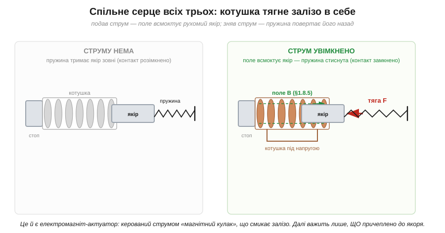
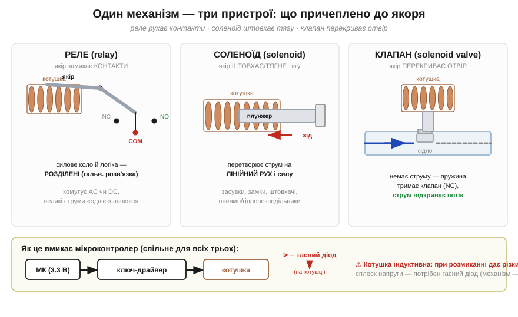

# 🔌 Реле, соленоїд, електромагнітний клапан: електромагніт як актуатор

Пропусти струм крізь [котушку з осердям](book:physics/electromagnet) — і вона стягне до себе шматок заліза з відчутною силою, а зніми струм — тяга зникне. Це **актуатор** (*actuator*) — перетворювач «струм → рух». Звідси виростає цілий клас деталей, якими мікроконтролер ворушить фізичний світ: **реле** (*relay*), **соленоїд** (*solenoid*) і **електромагнітний клапан** (*solenoid valve*). Усередині в них б'ється одне серце — той самий [електромагніт](book:physics/electromagnet); різниться лише те, що причеплено до якоря.

### Що це за клас

Усі три — **електромеханічні актуатори з керованою котушкою**. У кожному є нерухома котушка на осерді й рухомий феромагнітний **якір** (*armature*) чи **плунжер** (*plunger*), який поле всмоктує всередину. Повертає якір назад **пружина**: без струму вона тримає механізм у вихідному стані, з'явився струм — поле перемагає пружину й тягне якір до осердя.


*Рис. Спільне серце всіх трьох пристроїв. Без струму пружина тримає якір зовні. Подали струм — магнітне поле B всмоктує якір до осердя проти пружини. Це і є «магнітний кулак», керований струмом; чим більше ампер-витків, тим сильніша тяга.*

Різниця — у навантаженні на якорі. У **реле** якір замикає й розмикає електричні **контакти**: слабкий сигнал керує сильним колом, до того ж гальванічно відокремленим від нього. У **соленоїді** якір — це **штовхач**: він дає короткий лінійний хід і силу (засувки, замки, штовхачі, важелі). У **клапані** той самий плунжер сідає на **отвір** (сідло) і перекриває чи пропускає рідину або газ.


*Рис. Один механізм — три застосунки: реле рухає контакти (COM/NO/NC), соленоїд штовхає тягу, клапан перекриває отвір. Унизу — спільний ланцюг керування: вивід мікроконтролера керує котушкою не напряму, а через ключ-драйвер; на котушці обов'язковий гасний діод.*

### Блок-схема: чому не напряму від виводу

Котушці актуатора потрібні **десятки—сотні міліампер**, а часто й окреме вище живлення (5, 12, 24 В) — вивід мікроконтролера на 3.3 В стільки не дає й вигорить. Тому ланцюг завжди триланковий: **вивід МК → ключ-драйвер → котушка**. Драйвер — це [транзисторний ключ](book:electronics/relay-driver); вивід лише вмикає/вимикає його, а сам струм котушки тече від силового живлення через ключ.

Друга обов'язкова деталь — **гасний (зворотний) діод** (*flyback diode*) паралельно котушці. Котушка індуктивна, і в мить, коли ключ її **розмикає**, вона віддає різкий [сплеск напруги](book:electronics/inductor-kickback), здатний пробити транзистор. Цей сплеск породжує самоіндукція котушки, а діод дає струму безпечний шлях замкнутися й гасить викид. Висновок простий: **без цього діода котушку не комутують**.

### Розпіновка й підключення

Коли зрозуміло, чому між виводом і котушкою стоять ключ та діод, лишається розібрати самі контакти. З погляду виводів усе просто. У котушки — **два контакти** (полярність для постійного струму інколи важить, тоді її підписують + / −). У реле додаються три силові: **COM** (спільний), **NO** (*normally open* — розімкнений без струму) і **NC** (*normally closed* — замкнений без струму). У клапана й соленоїда силового боку нема — лише два дроти котушки й механічний вихід (різьба під трубу, шток).

Підключення: котушку — через ключ-драйвер до **окремого** живлення під її напругу, з гасним діодом на ній; вивід МК — на вхід драйвера. Силові COM/NO/NC реле заводять у комутоване коло; патрубки клапана — у магістраль рідини чи газу.

### «Перший байт»

Коли все з'єднано, керувати таким актуатором виявляється напрочуд просто. Заговорити до нього — це не команда по шині, а **один рівень на виводі**, що вмикає ключ:

```
pinMode(PIN, OUTPUT);
digitalWrite(PIN, HIGH);   // ключ відкрито → котушка під струмом → якір втягнуто
// реле клацнуло / соленоїд штовхнув / клапан відкрився
digitalWrite(PIN, LOW);    // котушка знеструмлена → пружина повернула якір
```

Якщо чути клацання (реле) або глухий удар (клапан) — актуатор спрацював.

### Типові граблі

Рівень на виводі — справді весь «протокол», але саме навколо цієї простоти й збираються типові помилки.

- **Котушка без гасного діода.** Найчастіша й найдорожча помилка: при вимиканні [сплеск напруги](book:electronics/inductor-kickback) пробиває ключ. Діод — не опція.
- **Живлення котушки з виводу МК.** Десятки міліампер вивід не витягне. Котушку живлять **окремо**, через ключ; вивід лише керує.
- **Сплутати NO і NC** (для реле) або «нормальний» стан клапана: без струму NO-контакт **розімкнений**, а нормально-закритий клапан **перекритий**. Логіку звіряють до монтажу.
- **Утримувати без потреби.** Поки якір втягнуто, котушка постійно гріється струмом — це [джоулеве тепло](book:physics/joule-heating) I²R. Для тривалого утримання беруть актуатори з нижчим струмом утримання або ШІМ-економію.
- **Полярність DC-котушки.** Деякі котушки (й гасний діод біля них) чутливі до полярності — переплутаєш, діод закоротить живлення.

### Варіації класу

Окрім цих спільних пасток, кожен із трьох пристроїв має власні різновиди — їх корисно впізнавати в каталозі. Реле буває **звичайне** (механічні контакти) і **твердотільне** (без рухомих частин); є **засувні** (*latching*) реле з двома котушками, що тримають стан без струму. Соленоїди бувають **тягові** й **штовхальні**, з коротким чи довгим ходом. Клапани розрізняють за нормальним станом (**NC**/NO) і числом ходів (2/2, 3/2). Спільне в усіх — той самий принцип [електромагніту](book:physics/electromagnet): струм у котушці робить керовану магнітну силу, а конструкція лише вирішує, куди цю силу прикласти.

> 🔧 **Навіщо це.** Щойно треба фізично щось увімкнути, штовхнути чи перекрити з-під мікроконтролера — у гру входить [електромагніт](book:physics/electromagnet) у новій ролі: котушка + ключ-драйвер + гасний діод, а на якорі — контакти (реле), шток (соленоїд) чи затвор (клапан). Сам вивід нічого не тягне: він лише відкриває ключ, що пускає струм у котушку.
