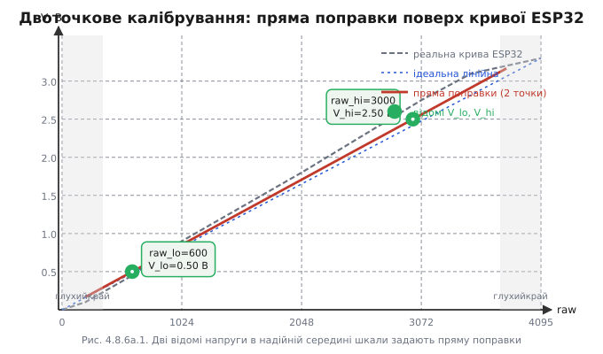
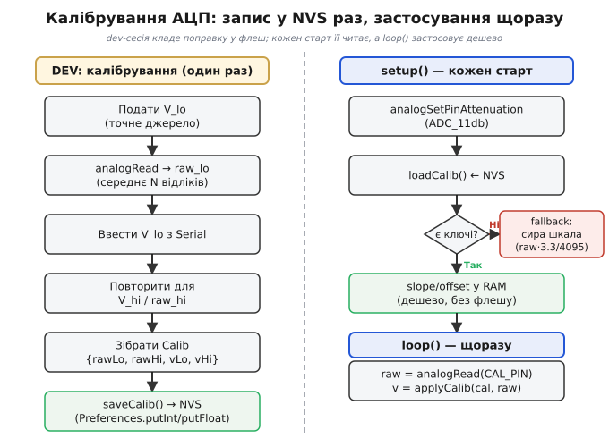

# ⚙️ Практика: Двоточкове калібрування АЦП — зсув і нахил, збереження в NVS

## Задача

Двох відомих напруг досить, щоб усунути зсув і масштабну похибку в характеристиці АЦП: вони задають дві точки, через які проходить єдина пряма. Але така формула сама собою живе лише на папері й зникає з вимкненням живлення. Тут перенесемо її в реальний C/C++ і навчимо пристрій зберігати поправку між увімкненнями.

Інженерна задача конкретна: пристрій на ESP32 повинен один раз, під час налаштування, відкалібруватися під свій чип (внутрішня [опорна напруга](topic:electronics/voltage-reference) 1.0–1.2 В різна від екземпляра до екземпляра), зберегти поправку в енергонезалежній пам'яті й при кожному наступному старті одразу читати правильні вольти без жодного перекалібрування. Схема проста: прошили прошивку, підключили точне джерело, натиснули кнопку — і більше не повертаємося до цього.

Що залишається поза обсягом цієї вставки: нелінійність INL — для неї потрібно більше двох точок; шум — його давить [усереднення відліків](root:embedded/signal-acquisition). Тут — лише лінійна пряма «зсув + нахил».

---

## Ідея

В основі — лінійна модель «реальні вольти як пряма функція сирого коду». Робоча форма:

```
V = V_lo + (V_hi − V_lo) · (raw − raw_lo) / (raw_hi − raw_lo)
```

Еквівалентно через нахил і зсув:

```
slope     = (V_hi − V_lo) / (raw_hi − raw_lo)
offset_V  = V_lo − slope · raw_lo
V         = slope · raw + offset_V
```

Що саме зберігати в NVS? Є два підходи: зберігати похідні `slope`/`offset_V` або вихідні пари `(raw_lo, raw_hi, V_lo, V_hi)`. Рекомендовано зберігати **вихідні пари** — їх можна переглянути безпосередньо, перевірити на здоровий глузд і перерахувати в оперативній пам'яті при старті. Нахил обчислюється одноразово в `setup()` і далі живе у звичайній змінній float.

Звідки беруться відомі напруги? Потрібне точне опорне джерело: калібрований LDO, лабораторний блок живлення або дільник від прецизійної опори. Напруги вимірюють якісним вольтметром. Дві точки беруть **не на краях шкали** — там «глухі» зони з підвищеною нелінійністю — а в надійній середині: наприклад, ~0.5 В і ~2.5 В при ослабленні 11 dB.

Чому саме дві, не одна й не три? Одна точка ловить лише зсув: знаючи реакцію на 0 В, ми посунемо всю криву, та нахил лишиться сирим, заводським. Дві точки задають **пряму повністю** — і нахил, і зсув, — а більшого від лінійної моделі взяти нема звідки: третя точка вже не уточнює пряму, а ловить **вигин** (INL), для якого потрібна не пряма, а крива. Тож для лінійної поправки дві точки — це рівно стільки, скільки треба: не менше (інакше нахил незнайдений) і не більше (інакше це вже інша, нелінійна задача).

**Приклад (підставляємо реальні числа).** Подали 0.500 В — чип усереднив `raw_lo = 590`; подали 2.500 В — дістали `raw_hi = 2980`. Перевіримо поправку контрольною точкою рівно посередині (1.500 В):

```cpp
// зняті дві точки калібрування
int   raw_lo = 590,    raw_hi = 2980;
float v_lo   = 0.500f, v_hi   = 2.500f;

// нахил і зсув один раз у setup()
float slope    = (v_hi - v_lo) / (raw_hi - raw_lo);   // = 2.000 / 2390 = 0.000837 В/код
float offset_V = v_lo - slope * raw_lo;               // = 0.500 − 0.000837·590 = 0.0061 В

// застосування до контрольного відліку (очікуємо 1.500 В)
int   raw = 1785;                                     // АЦП на рівно 1.500 В
float v   = slope * raw + offset_V;                   // = 0.000837·1785 + 0.0061 = 1.500 В
```

Числа збіглися: контрольна точка дала 1.500 В, хоч її в калібруванні не було. Це і є сенс поправки — дві відомі точки задали пряму, і будь-який код між ними тепер читається в правильних вольтах. Якби ми довірилися сирій заводській шкалі `raw · 3.3/4095`, той самий код 1785 дав би 1.439 В — помилка ≈ 60 мВ, тобто ті самі кілька відсотків, які прибирає калібрування.



*Дві відомі напруги в надійній середині шкали задають пряму поправки (нахил і зсув); реальну криву ESP32 вона випрямляє саме там, де працює сигнал, а глухі краї лишаються поза увагою.*

> 🔧 **Навіщо це.** Завод робить eFuse-поправку, і `analogReadMilliVolts` вже дещо виправляє форму кривої. Двоточкова поправка уточнює решту — зсув і залишковий масштабний дрейф саме вашого чипа, а не середнього по партії. В результаті замість ±5–10% маємо ±1–2% без жодного зовнішнього обладнання після калібрування.

Важливе застереження: ослаблення (atten), при якому виконували калібрування, **мусить збігатися** з ослабленням у робочому режимі. Зміниш `analogSetPinAttenuation` — шкала raw зміниться разом із [опорною напругою](topic:electronics/voltage-reference) на вході АЦП, і поправка видаватиме хибні вольти. Це типова пастка, про яку докладніше — нижче.

---

## Робочий код C/C++

### Структура поправки та застосування

Зберігаємо чотири числа в маленькій структурі й рахуємо вольти чистою функцією без жодного глобального стану:

```cpp
#include <Preferences.h>

struct Calib {
    int   rawLo, rawHi;   // сирі коди (12-бітних, 0–4095)
    float vLo,   vHi;     // відповідні напруги у вольтах
};

// Застосувати поправку: raw → вольти
float applyCalib(const Calib& c, int raw) {
    if (c.rawHi == c.rawLo)              // захист від ділення на нуль
        return raw * (3.3f / 4095.0f);  // fallback: сира заводська шкала
    float slope = (c.vHi - c.vLo) / float(c.rawHi - c.rawLo);
    return c.vLo + slope * float(raw - c.rawLo);
}
```

Чому окрема чиста функція? Її легко тестувати: передаєш `Calib` з відомими значеннями й перевіряєш результат без жодного звернення до флешу чи Serial. Функція не знає, звідки взялися коефіцієнти — з NVS, з жорсткого коду чи з заводського тесту.

---

### Збереження та читання NVS через Preferences

```cpp
Preferences prefs;

void saveCalib(const Calib& c) {
    prefs.begin("adccal", false);   // false = читання-запис
    prefs.putInt  ("rawLo", c.rawLo);
    prefs.putInt  ("rawHi", c.rawHi);
    prefs.putFloat("vLo",   c.vLo);
    prefs.putFloat("vHi",   c.vHi);
    prefs.end();
}

bool loadCalib(Calib& c) {
    prefs.begin("adccal", true);    // true = тільки читання
    if (!prefs.isKey("rawLo")) {    // ще жодного разу не калібрували
        prefs.end();
        return false;
    }
    c.rawLo = prefs.getInt  ("rawLo");
    c.rawHi = prefs.getInt  ("rawHi");
    c.vLo   = prefs.getFloat("vLo");
    c.vHi   = prefs.getFloat("vHi");
    prefs.end();
    return true;
}
```

Кілька деталей. Простір імен `"adccal"` ізолює ключі від решти налаштувань прошивки — конфлікти імен виключені. `putFloat` зберігає 4 байти IEEE 754 безпосередньо — не потрібно серіалізувати у рядок і знову розбирати, це і швидше, і точніше. Ключі мусять бути не довшими за 15 символів (обмеження бібліотеки NVS); `"rawLo"`, `"rawHi"`, `"vLo"`, `"vHi"` — у межах норми. Режим `true` при читанні (`loadCalib`) захищає простір імен від випадкового запису всередині функції.

---

### Процедура калібрування (dev-режим) та збирання в `setup()`

:::tabs
```cpp
#define CAL_PIN 34

Calib cal;

// Зняти N відліків і повернути середнє
int readAvg(int pin, int n = 64) {
    long s = 0;
    for (int i = 0; i < n; i++) s += analogRead(pin);
    return int(s / n);
}

// Інтерактивна сесія калібрування через UART
void runCalibration() {
    Serial.println("=== Калібрування АЦП ===");
    Serial.println("Подайте V_lo (точне джерело, наприклад 0.50 В).");
    Serial.println("Натисніть Enter, коли напруга стабільна:");

    while (!Serial.available()) delay(10);
    Serial.readStringUntil('\n');  // очікуємо Enter
    cal.rawLo = readAvg(CAL_PIN);  // середнє гасить шум
    Serial.printf("raw_lo = %d. Введіть точне значення V_lo (В): ", cal.rawLo);
    cal.vLo = Serial.parseFloat();

    Serial.println("\nПодайте V_hi (наприклад 2.50 В), натисніть Enter:");
    while (!Serial.available()) delay(10);
    Serial.readStringUntil('\n');
    cal.rawHi = readAvg(CAL_PIN);
    Serial.printf("raw_hi = %d. Введіть точне значення V_hi (В): ", cal.rawHi);
    cal.vHi = Serial.parseFloat();

    saveCalib(cal);
    Serial.println("\nКалібрування збережено в NVS.");
}

void setup() {
    Serial.begin(115200);
    analogSetPinAttenuation(CAL_PIN, ADC_11db);  // фіксуємо atten ДО читання

    if (!loadCalib(cal)) {
        Serial.println("[WARN] Калібрування відсутнє. Запустіть runCalibration().");
        // cal лишається {0,0,0,0} — applyCalib поверне fallback
    } else {
        float slope = (cal.vHi - cal.vLo) / float(cal.rawHi - cal.rawLo);
        Serial.printf("[CAL] slope=%.6f V/код, offset_V=%.4f В\n",
                      slope, cal.vLo - slope * cal.rawLo);
    }
}

void loop() {
    int   raw = analogRead(CAL_PIN);
    float v   = applyCalib(cal, raw);
    Serial.println(v, 4);
    delay(200);
}
```
```python
# MicroPython на ESP32: той самий метод двох точок.
# ADC.read() дає 12-бітний код 0..4095; поправку тримаємо в esp32.NVS.
import sys, time
from machine import ADC, Pin
from esp32 import NVS

CAL_PIN = 34
adc = ADC(Pin(CAL_PIN))
adc.atten(ADC.ATTN_11DB)      # фіксуємо atten ДО читання (як analogSetPinAttenuation)
adc.width(ADC.WIDTH_12BIT)

cal = {"raw_lo": 0, "raw_hi": 0, "v_lo": 0.0, "v_hi": 0.0}

# Зняти n відліків і повернути середнє (середнє гасить шум)
def read_avg(n=64):
    return sum(adc.read() for _ in range(n)) // n

# Інтерактивна сесія калібрування через REPL/UART
def run_calibration():
    print("=== Калібрування АЦП ===")
    input("Подайте V_lo (напр. 0.50 В), натисніть Enter: ")
    cal["raw_lo"] = read_avg()
    cal["v_lo"] = float(input("raw_lo = %d. Введіть точне V_lo (В): " % cal["raw_lo"]))

    input("\nПодайте V_hi (напр. 2.50 В), натисніть Enter: ")
    cal["raw_hi"] = read_avg()
    cal["v_hi"] = float(input("raw_hi = %d. Введіть точне V_hi (В): " % cal["raw_hi"]))

    save_calib(cal)
    print("\nКалібрування збережено в NVS.")

# Ініціалізація замість setup(): читаємо поправку, рахуємо slope один раз
if not load_calib(cal):
    print("[WARN] Калібрування відсутнє. Запустіть run_calibration().")
    # cal лишається нулями — apply_calib поверне fallback
else:
    slope = (cal["v_hi"] - cal["v_lo"]) / (cal["raw_hi"] - cal["raw_lo"])
    print("[CAL] slope=%.6f V/код, offset_V=%.4f В"
          % (slope, cal["v_lo"] - slope * cal["raw_lo"]))

# Головний цикл замість loop(): застосування поправки — один рядок
while True:
    raw = adc.read()
    print("%.4f" % apply_calib(cal, raw))
    time.sleep_ms(200)
```
:::

Зверніть увагу на порядок у `setup()`: спочатку `analogSetPinAttenuation`, потім `loadCalib`. Це важливо — ослаблення треба встановити до будь-яких вимірювань і переконатися, що воно збігається з тим, при якому виконували калібрування. У `loop()` застосування поправки — один рядок; обчислення slope/offset вже відбулося в `setup()` один раз.



*Два контури: рідкісне калібрування із записом у NVS (ліворуч) і дешеве застосування поправки при кожному читанні (праворуч); між вмиканнями пристрій пам'ятає свою поправку.*

---

## Складність і пастки на МК

**Float у NVS.** `putFloat`/`getFloat` зберігають чотири байти IEEE 754 безпосередньо — не зберігайте float як рядок (`putString("vLo", String(cal.vLo))`): це вносить похибку округлення й збільшує обсяг. Назви ключів — не довші за 15 символів; тут усі в нормі.

**Ділення на нуль і пошкоджена пара.** Якщо `rawHi == rawLo` (наприклад, оператор двічі натиснув Enter на тій самій напрузі або дані в NVS пошкоджені), формула спричинить ділення на нуль. Запобіжник у `applyCalib` вирішує це — він повертає сиру заводську шкалу. Додаткова перевірка: у `loadCalib` можна перевіряти умову `rawHi > rawLo` і повертати `false` при підозрілих даних.

**Ослаблення мусить збігатися.** Калібрували при `ADC_11db` — працюйте при `ADC_11db`. Зміниш ослаблення — зміниться [опорна напруга](topic:electronics/voltage-reference) на вході АЦП, а з нею шкала raw, і поправка видасть хибні вольти. Якщо прошивка може перемикати ослаблення динамічно, зберігайте поточний atten у NVS (`prefs.putInt("atten", ADC_11db)`) і звіряйте його при кожному старті.

**Сирий код проти мВ.** Тут ми калібруємо `raw → V` безпосередньо. Альтернатива: подавати на вхід `analogReadMilliVolts(pin)` і калібрувати вже мілівольтні значення. Другий шлях трохи точніший, бо завод уже виправив форму кривої через eFuse, і залишається майже лінійне відхилення. Перший підхід простіший для демонстрації; на практиці рекомендовано другий.

**Знос флешу.** NVS пише у флеш — записи не безкоштовні (ресурс ~100 000 циклів на сектор). Калібрування зберігайте **один раз** під час налаштування, а не в `loop()`. Чому записи зношують комірки й як драйвер розмазує їх по секторах — [вирівнювання зносу](topic:programming/wear-leveling).

**Температура й старіння.** Поправка фіксується в конкретний момент і за конкретної температури. Для побутової автоматики одноразового калібрування цілком досить; для прецизійних вимірювань у широкому температурному діапазоні — перекалібровувати або додавати температурну компенсацію.

---

Дві точки і Preferences — і пристрій сам себе калібрує, записує поправку в енергонезалежну пам'ять і при кожному старті одразу видає правильні вольти. З лінійним дрейфом покінчено. Залишається шум — але з ним бореться [усереднення відліків](root:embedded/signal-acquisition).
