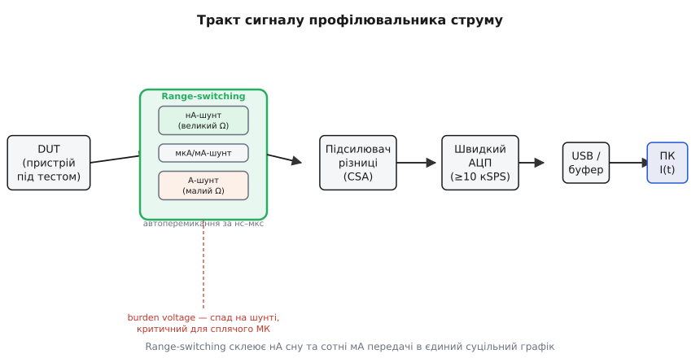
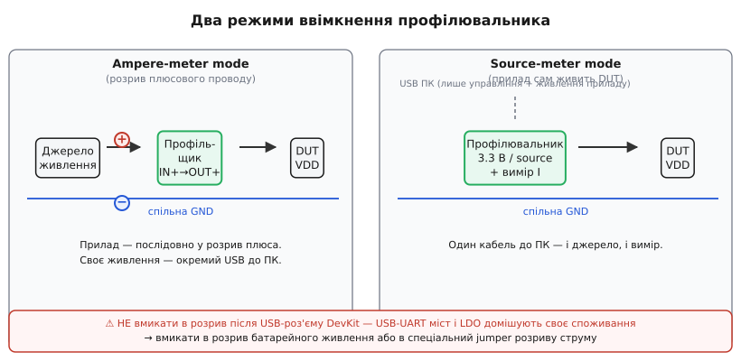

# 🔌 Профілювальники струму (клас Power Profiler): від нА сну до сотень мА передачі

> Компонентна вставка до теми [«Виміряти споживання чесно»](book:electronics/measure-consumption).
> Звичайний мультиметр бачить лише усереднене число й **бреше на коротких імпульсах** — сон у мікроамперах і сплеск Wi-Fi у сотні мА тривають мілісекунди, але мультиметр розмазує їх в одне «середнє». Тут — окремий **клас приладів**, які фіксують увесь профіль струму в часі. Динамічний діапазон (п'ять порядків одним шунтом) розраховуємо в [🧮 сусідній математичній вставці](math-dynamic-range.md) — тут лише про те, як прилад його охоплює; звідки беруться самі мкА-сплески — у [режимах сну](book:programming/sleep-modes) та [розрахунку струму від duty cycle](book:programming/duty-cycle-current).

---

## Що це за клас

**Профілювальник струму** (*current profiler*, або *power profiler*) — прилад, що вимірює споживання DUT (*device under test*, пристрій під випробуванням) не одним числом, а як **сигнал струму в часі** I(t), із частотою вибірки в десятки–сотні тисяч вимірів за секунду (*samples per second*, SPS). Мультиметр дає **середнє за вікно інтегрування** — короткий сплеск розмазується й зникає; профілювальник зберігає форму імпульсу: видно базову лінію сну (одиниці–десятки мкА), піки передачі (сотні мА) і площу під кривою (заряд у мА·год) за будь-який виділений інтервал.

Клас поділяється на два різновиди: **готові профілювальники** (Nordic PPK2-клас, Joulescope, лабораторні SMU) і **саморобний** «шунт + підсилювач + АЦП». Більшість готових одночасно є **джерелом живлення** (*source meter*, джерело-вимірювач) для DUT — один прилад і виставляє напругу, і фіксує струм.

> 🔧 **Навіщо це**
> Без профілю неможливо чесно розрахувати [бюджет батареї](book:programming/battery-budget) з урахуванням [duty cycle](book:programming/duty-cycle-current). Середній струм здебільшого складається з **рідкісних, але потужних піків**: Wi-Fi або BLE-передача займає десятки мілісекунд, але споживає 200–300 мА, і навіть за рідкісних пробуджень ці піки домінують у загальному заряді. Мультиметр губить їх у власному вікні інтегрування — інженер оптимізує код, не бачачи головного. Профілювальник показує реальну картину: стільки-то мкА у deep-sleep, такий-то пік радіо, стільки мілісекунд активного вікна. Оптимізуєте те, що бачите.

---

## Як це влаштовано: блок-схема

Усередині профілювальника — послідовний тракт: **DUT → вимірювальний [шунт → диференційний підсилювач струму (CSA)](book:sensor-board/shunt-current-monitor) → швидкий АЦП → USB-буфер → програма на ПК, що будує I(t)** у реальному часі.



*Рис. Тракт сигналу всередині профілювальника та блок автоматичного перемикання діапазонів як його серце.*

Серцем приладу є вузол **автоматичного перемикання діапазонів** (*range switching*). Причина проста: один шунт не здатний охопити п'ять порядків струму. Мегаомний шунт дасть 1 мВ від 1 нА, але 200 кВ від 200 мА — абсурд. Міліомний — навпаки: зручні 2 мВ на 200 мА, а на нА — сигнал нижче будь-якого шуму. Вихід — **набір шунтів** і мікросхема, що перемикається між ними за наносекунди, склеюючи криву від нА до А. Детальний розрахунок — у [🧮 сусідній математичній вставці](math-dynamic-range.md).

Важлива супутня проблема — **спад напруги на шунті** (*burden voltage*): навіть малий шунт «краде» частину живлення DUT. За сплеску у сотні мА це може штовхнути МК у [brownout](book:programming/reset-causes) (просідання нижче порогу стабільної роботи). Готові профілювальники тримають burden у мілівольтах або мають компенсацію вихідної напруги.

---

## Розпіновка й підключення

Принципова розвилка — режим ввімкнення приладу в коло. Є два варіанти:

**Ampere-meter mode** (розрив плюсового дроту). Профілювальник вмикають **послідовно** в розрив між джерелом живлення і DUT:

```
Джерело + ──► IN+  (profiler) ──► OUT+ ──► DUT VDD
Джерело − ─────────────────── спільна GND ─────────── DUT GND
```

Прилад лише вимірює, не замінює джерело. Живлення самого профілювальника і з'єднання з ПК — окремий USB-кабель, гальванічно незалежний від кола DUT.

**Source-meter mode**. Прилад **сам живить DUT** заданою напругою (зазвичай 1.8–3.6 В) і одночасно вимірює струм — зручно: один USB-кабель до ПК, і живлення, і захоплення профілю.



*Рис. Два режими ввімкнення: ampere-meter (розрив плюсового дроту) і source-meter (прилад сам живить DUT), зі спільною землею та правильною точкою врізання повз LDO/USB-міст DevKit.*

Де фізично врізатися — принципово, і це окрема тема про [споживання всієї плати](book:electronics/board-consumption). **Не** після USB-роз'єму DevKit: тоді до виміру домішується USB-UART міст і LDO, і ви бачите весь DevKit, а не лише ESP32. Правильні точки — у розрив батарейного живлення, у jumper розриву струму або на вивід 3V3/VDD після LDO. Живлення самого профілювальника і USB-зв'язок із ПК — окремий кабель, гальванічно не пов'язаний із DUT.

---

## «Перший вимір»

Покрокова послідовність, щоб побачити перший профіль:

1. Під'єднати профілювальник у розрив живлення DUT (ampere-mode) або перейти в source-mode і виставити потрібну напругу.
2. У програмі на ПК обрати режим і частоту вибірки (SPS) — чим вища, тим детальніші піки.
3. Запустити захоплення. На екрані з'являється крива I(t): базова лінія — deep-sleep (поодинокі мкА), і на її тлі — прямокутні піки радіопередачі (десятки–сотні мА).
4. Курсорами виділити **один цикл** (від пробудження до наступного): програма підрахує **середній струм за цикл** і **заряд у мА·с**. Це і є вхідні дані для формули [бюджету батареї](book:programming/battery-budget) з урахуванням [duty cycle](book:programming/duty-cycle-current).

«Ага-момент» настає одразу: цифри, що раніше були здогадом, набувають форми. Видно тривалість активного вікна, висоту піку радіо і — часто несподівано — реальне споживання deep-sleep з усіма [витоками плати](book:programming/current-paths). Оптимізуєте те, що бачите.

---

## Типові граблі

- **Burden voltage просаджує живлення DUT.** Завеликий спад на шунті → просідання живлення при сплеску → штучний brownout або занижений пік. Саме тому обирають прилад із range-switching: burden тримається в мілівольтах навіть на А-діапазоні.
- **Вимірюєш не те, що думаєш.** Точка врізання після USB-UART моста або LDO DevKit домішує їхнє споживання (десятки мА при роботі). Звідси класичне «чому сплячий ESP32 споживає міліампери» — насправді ESP32 споживає одиниці, решта — периферія плати. Як це виправити — у темі про [споживання всієї плати](book:electronics/board-consumption).
- **Замало смуги / SPS.** Повільний прилад зі 100 SPS згладжує гострий пік радіо так само, як мультиметр, — і знову бачиш «середнє». Фронти BLE- або Wi-Fi-пакета — мікросекунди, тому потрібна вибірка на порядки швидша за фронт сплеску.
- **Земляні петлі та довгі дроти** на нА-рівні. Зайвий сантиметр дроту вносить наводки, що топлять нА-сигнал у шумі. Короткі з'єднання, земля в одній точці.
- **Паразитна ємність кабелю** між профілювальником і DUT згладжує фронти піків — і знову «середнє» замість реального імпульсу.

---

## Варіації класу

Серед готових рішень і саморобок — широкий спектр компромісів:

**Power Profiler Kit-клас (Nordic PPK2)** — найпоширеніший вибір для розробника IoT: недорогий (~50–80 USD), підтримує source- і ampere-mode, динамічний діапазон близько 100 нА…1 А, частота вибірки 100 кSPS, керування з ПК. Масовий інструмент аматора і стартапу для низькоспоживних пристроїв.

**Joulescope-клас** — ширший діапазон і швидше перемикання, точніше інтегрування заряду й енергії; дорожчий за PPK2, але дає метрологічно підтверджені результати.

**Лабораторний SMU (source-measure unit)** — найточніший варіант, ціна від тисяч USD; застосовується при сертифікації та наукових дослідженнях.

**Саморобний «шунт + диференційний підсилювач + осцилограф/АЦП»** — найдешевший шлях. Один шунт охоплює один-два порядки діапазону; підходить, коли заздалегідь відомо, де перебуває DUT. Саме тут і впирається математика [динамічного діапазону](math-dynamic-range.md).

**Вибір одним реченням:** один порядок струмів і мінімальний бюджет — шунт + осцилограф; повний профіль від нА до ампера «з коробки» — PPK2-клас; метрологія і сертифікація — Joulescope або SMU.

