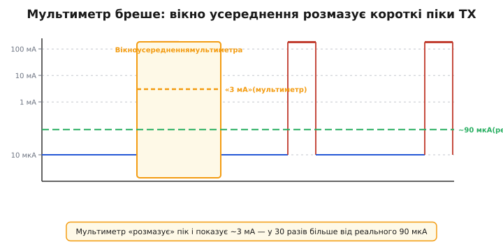
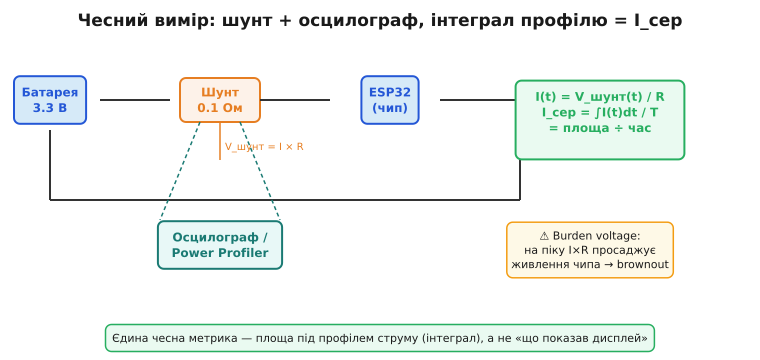

# Виміряти споживання чесно: мультиметр бреше на імпульсах

Розрахунок [середнього струму за робочим циклом](book:programming/duty-cycle-current) дає теоретичне число. А ось перевірка реальністю — і тут новачка чекає пастка, через яку проходить більшість. Розробник чіпляє звичайний мультиметр у розрив живлення, бачить на дисплеї «3 мА» і вірить. Реальне середнє — 90 мкА. Батарейка сідає за тиждень замість року. Де помилка?

Помилка в тому, що мультиметр **брехливо показує середнє** для імпульсного профілю. У типового пристрою з [рідкісними сплесками радіопередачі](book:programming/duty-cycle-current) профіль струму — різкі поодинокі піки від 10 мкА до 180 мА. Три причини, чому мультиметр цьому не вірить.

**Перша: усереднення і повільність.** Звичайний цифровий мультиметр оновлює показання 2–5 разів на секунду і показує якесь усереднення за своє вікно вимірювання. Пік Wi-Fi передачі тривалістю 300 мс він або «розмазує» по великому вікну (і показує щось посередині між сном і піком), або взагалі пропускає між оновленнями. Показане число не є ні піком, ні чесним середнім — воно просто неточне.



*Рис. Реальний профіль (синій і червоний) проти того, що «бачить» мультиметр (жовте вікно). Результат: ~3 мА замість реальних ~90 мкА середнього. Мультиметр вловлює хвіст піку TX, ігноруючи довгий сон.*

**Друга: динамічний діапазон.** Між сном (~10 мкА) і передачею (~180 мА) — чотири порядки. На діапазоні «мА» струм сну тоне в шумі приладу і власному Iq шунта, а результат завищений. На діапазоні «мкА» або «нА» — пік передачі вирве прилад за межі, або захист спрацює. Жоден один діапазон мультиметра не покриває чесно весь профіль: 10⁵ динамічного діапазону між сном і піком одним приладом просто не взяти.

**Третя: burden voltage (падіння на шунті).** Мультиметр вимірює струм як спад напруги на своєму внутрішньому шунті (зазвичай 0.1–10 Ом). На піку 180 мА спад може становити 0.5–1.8 В — і це з'їдає з напруги живлення чипа. При живленні 3.3 В просадка на 0.5 В означає, що чип отримує 2.8 В замість 3.3 В. Якщо ввімкнено [детектор просадки живлення (brownout)](book:programming/brownout), він скине чип, спотворивши сам експеримент. Прилад змінює те, що вимірює.

**Як вимірювати правильно.** Перший і найнадійніший метод — **малий шунт + осцилограф або логер**. Малий шунт (0.1–1 Ом) у розрив живлення дає напругу V_шунт = I × R, яка пропорційна струму. Осцилограф із достатньою пам'яттю показує профіль I(t) у часі — видно кожну фазу, її висоту і тривалість. Далі лишається проінтегрувати: I_сер = площа під кривою / час. Малий шунт тримає burden voltage в допустимих межах (0.1 Ом × 180 мА = 18 мВ — прийнятно).



*Рис. Схема правильного вимірювання: малий шунт у розрив живлення, осцилограф зчитує V_шунт(t), перетворює в I(t). Площа під профілем — це заряд, поділений на час = I_сер. Праворуч — попередження про burden voltage при великому шунті.*

Другий метод — **спеціалізований профілювальник струму** класу Nordic PPK2, Otii Arc, Joulescope. Ці прилади перемикають вимірювальний діапазон автоматично: нА сну і сотні мА передачі в одному часовому вікні, з підрахунком заряду і відображенням профілю. Саме такий інструмент дає те число, що збігається з [розрахунком за робочим циклом](book:programming/duty-cycle-current). Детально — у вставці [🔌 r13-s7-c-current-profiler.md](comp-current-profiler.md).

Третій метод — **метод великого конденсатора**: зарядити відому ємність C до напруги V₀, живити від неї пристрій N секунд, виміряти нову напругу V₁. Тоді I_сер ≈ C × (V₀ - V₁) / N. Грубо — точність залежить від того, наскільки стабільна напруга за час вимірювання, — але не вимагає нічого, крім конденсатора і мультиметра. Корисно як «перша оцінка» без спецобладнання.

> 🔧 **Навіщо це.** «Виміряв мультиметром — здається норм» — найдорожча ілюзія в розробці на батареї, бо помилка вилазить лише в полі через тижні після відправлення. Єдина чесна метрика — площа під профілем струму. Хочеш гарантії часу життя — дивись профіль у часі, не середнє на дисплеї.

**Worked-приклад. Чому мультиметр показав 3 мА, а батарейка сіла за тиждень.**

```
Спостереження: мультиметр на діапазоні 20 мА показує 3 мА «середнього».
Розрахунок за робочим циклом давав 90 мкА.
Розбіжність: у 33 рази.

Аналіз:
  — Мультиметр на діапазоні 20 мА має шум/Iq ~100 мкА, тому струм сну
    10 мкА тоне в шумі — фаза сну не видна взагалі.
  — Хвіст піку TX (180 мА, 300 мс) потрапляє у вікно вимірювання
    приладу і «заважує» середнє вгору.
  — Осцилограф через шунт 1 Ом показує реальний профіль:
      boot 120 мА × 100 мс = 12 мА·с
      TX   180 мА × 300 мс = 54 мА·с
      сон  0.010 мА × 599.6 с = 6 мА·с
      Q = 72 мА·с, T = 600 с → I_сер = 120 мкА

  — Але: на платі виявився LDO зі струмом спокою 1.5 мА — він тече
    весь час, навіть поки чип у deep-sleep. Додаємо:
      1.5 мА × 600 с = 900 мА·с
      Новий I_сер = (72 + 900) / 600 = 1.62 мА

  → Батарея АА 2000 мА·год: 2000 / 1.62 ≈ 1235 год ≈ 51 доба
    (мультиметр і «паразитний» LDO разом дали хибну картину)

Висновок: вір профілю й інтегралу. І шукай паразитні струми самої плати —
саме вони, а не мультиметр, найчастіше з'їдають батарею.
```

---
