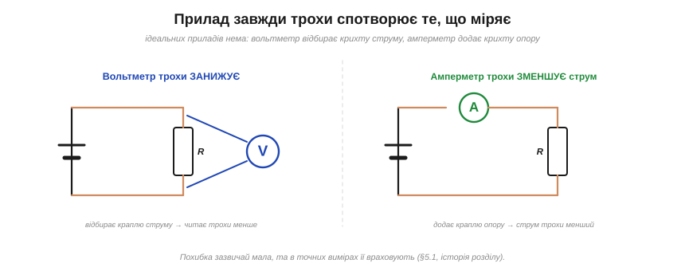
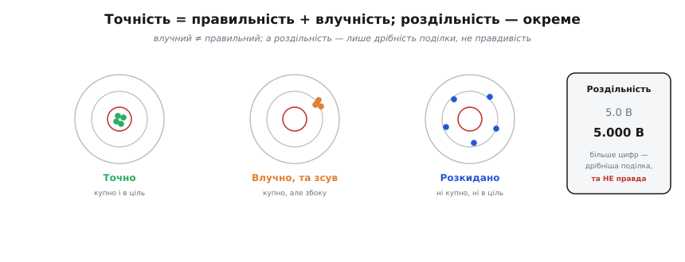
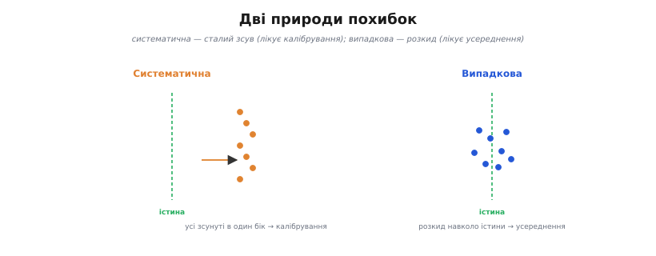

# Похибки вимірювань

Найдорожча звичка інженера-початківця — вірити цифрі на табло, як святому письму. А зрілий вимірювач знає протилежне: **жоден вимір не дорівнює істині**. Між справжньою величиною й числом, яке ви записали, завжди стоїть ціла низка спотворень — від самого приладу, від способу під'єднання, від шуму, від округлення. Похибка (від «хибити», промахуватися повз ціль) — не ознака поганого приладу чи кривих рук, а **неминуча властивість будь-якого виміру**. Питання не в тому, чи є похибка, а в тому, **наскільки вона велика й звідки взялася** — бо саме це вирішує, скільки цифр у вашому результаті справжні.

### Прилад завжди трохи спотворює коло


*Ідеальних приладів немає: вольтметр відбирає крихту струму (тож читає трохи менше), амперметр додає крихту опору (тож струм трохи зменшується). Похибка зазвичай мала, та в точних вимірах її враховують.*

Почнімо з найглибшої причини: **сам факт під'єднання приладу змінює те, що ви міряєте**. Вольтметр має не нескінченний, а просто **великий** [вхідний опір](book:electronics/internal-resistance) — тож, ставши паралельно ділянці кола, він відбирає крихту струму й трохи **навантажує** її. У типовому випадку (вимір на дільнику) він через це показує **трохи менше** за справжнє; у складнішій мережі напрямок відхилення залежить від схеми, але **сам факт** втручання лишається. Амперметр діє дзеркально: щоб виміряти струм, його вмикають **у розрив** кола, а він має не нульовий, а **малий** опір — тож додає краплю опору й трохи **зменшує** той самий струм, який міряє. Висновок жорсткий: вимірюючи коло, ви міряєте коло, **уже змінене** фактом вимірювання.

Покажемо на числах, наскільки «крихта струму» псує показ. Візьмемо [дільник напруги](book:electronics/voltage-divider) із двох однакових 10 кОм від 10 В і поміряймо напругу на середній точці вольтметром із входом 1 МОм:

```
Дільник 10 кОм + 10 кОм від 10 В; міряємо середню точку:
  істинна напруга    U₀ = 10 · 10/(10+10)        = 5.000 В
  вольтметр 1 МОм паралельно нижньому плечу 10 кОм:
  10 кОм ∥ 1 МОм                                  ≈ 9.901 кОм
  показ              U  = 10 · 9.901/(10+9.901)   ≈ 4.975 В
  відносна похибка      (5.000 − 4.975)/5.000     ≈ 0.5 %
```

Бачите механізм: вольтметр (1 МОм) став **паралельно** нижньому плечу (10 кОм) і трохи його «просадив» — з 10 до 9.9 кОм, тож показ упав на пів відсотка. Якби джерело було «жорсткіше» (плечі по 1 кОм), похибка вийшла б у десять разів менша; а на високоомному колі — навпаки, помітнішою. Звідси практичне правило: **що більший опір кола проти вхідного опору приладу, то дужче прилад це коло спотворює**.

> 🔧 **Навіщо це.** Перш ніж довіряти показу, питайте: «чи не я його зіпсував самим виміром?» Міряючи напругу на високоомному вузлі (вихід давача, дільник зі стократними мегаомами, затвор польового транзистора), звичайний мультиметр із входом 1–10 МОм бреше відчутно — там беруть вольтметр із входом 1 ГОм або буферний підсилювач. А струм у живій схемі краще не рвати амперметром, а порахувати з падіння напруги на відомому резисторі — менше втручання.

### Точність, правильність, влучність, роздільність


*Влучність (precision) — купність повторних вимірів. Правильність (trueness) — близькість їхнього центра до істини. Точність (accuracy) — і те, і те разом: купно й у ціль. Роздільність — лише дрібність поділки на табло, до правди стосунку не має.*

Чотири слова, які раз у раз плутають, а вони про **різні речі**. Розкладімо їх так, як це робить міжнародний стандарт вимірювань (ISO 5725).

**Влучність**, або повторюваність (англ. *precision*, від лат. *praecidere* — «відсікати зайве») — наскільки **купно** лягають повторні виміри один біля одного. Це про **розкид**, і байдуже, де той розкид сидить: можна влучно й купно мазати **повз** ціль.

**Правильність** (англ. *trueness*) — наскільки **центр** цієї купи близький до **істини**. Це про **зсув** усієї групи від справжнього значення.

**Точність** (англ. *accuracy*, від лат. *accuratus* — «зроблене дбайливо», від *cura* — «турбота») — це **обидві якості разом**: і купно, і в ціль. Стандарт уживає «точність» як **парасольку** над правильністю та влучністю; у побуті ж її часто звужують до самої лише правильності. Аналогія зі стрільбою точна, тож і скористаймося нею: влучність — це **щільність** дірок у мішені, правильність — наскільки їхній **центр** збігся з яблучком, а точність — коли збіглося **і одне, і друге**.

Саму влучність варто ще роздвоїти, бо «повторити вимір» можна по-різному. Якщо ви робите серію **тим самим приладом, тією самою рукою, за тих самих умов**, поспіль — це **повторюваність** (англ. *repeatability*): найтісніший можливий розкид, бо ніщо не змінюється. А якщо той самий вимір повторюють **іншим приладом, інший день, інша людина чи інша лабораторія** — це **відтворюваність** (англ. *reproducibility*), і розкид тут завжди ширший, бо до випадкового шуму додаються дрібні відмінності умов. Різниця практична: давач, що дає чудову повторюваність на вашому столі, цілком може «поплисти» в полі чи на іншій платі — і це не поломка, а саме межа відтворюваності.

І окремо, поза цією трійцею, стоїть **роздільність** (англ. *resolution*, від лат. *resolvere* — «розділяти на частини») — наскільки **дрібна поділка** на табло, скільки цифр воно взагалі здатне показати. Ось де ховається головний підступ: прилад може виводити «5.000 В» (чудова роздільність), а насправді брехати на пів вольта (кепська правильність). **Більше цифр на табло — не гарантія правди.** Тому в паспорті шукають не кількість розрядів, а **клас точності** — наприклад, запис на кшталт ±0.5 % показу ± 2 одиниці.

Розшифруймо цей загадковий запис на числі — і побачимо, скільки цифр на табло варті довіри:

```
Показ 5.000 В; паспорт «±0.5 % показу ± 2 одиниці»; молодша цифра 0.001 В:
  частка від показу   0.5 % · 5.000     = 0.025 В
  «± 2 одиниці»       2 · 0.001          = 0.002 В
  повна похибка       0.025 + 0.002      = 0.027 В
  результат           5.000 ± 0.027 В   → істина десь у 4.97 … 5.03 В
```

Висновок витвережує: попри гарні «5.000», правда лежить десь між 4.97 і 5.03 В — тобто останні **дві** цифри показу майже нічого не важать. Ось чому грамотний інженер записує результат **із похибкою** (5.00 ± 0.03 В), а не сліпо переписує всі цифри з табло: зайві знаки створюють **оману точності**, якої насправді немає.

> 🧮 **Звідки взялася формула «±(% + одиниці)».** Чому паспорт цифрового мультиметра завжди має дві частини — пропорційну й сталу «підлогу», як із них дістати справжню межу похибки, чому на малому показі прилад бреше **дужче** й чому похибку доводиться **переносити** через R = V/I. Уся арифметика — у вставці [±(% + одиниці молодшого розряду): арифметика похибок мультиметра](book:electronics/measurement-errors/math-accuracy.md).

### Систематичні й випадкові похибки


*Дві природи похибок: **систематична** — сталий зсув в один бік (виправляється калібруванням); **випадкова** — розкид навколо істини (зменшується усередненням багатьох вимірів). У реальному вимірі присутні обидві.*

Усі похибки, хоч би звідки бралися, поділяються на **дві природи** — і боротися з ними треба **протилежними способами**. Це той самий поділ, що ховається за «правильністю» і «влучністю»: систематична похибка псує правильність, випадкова — влучність.

**Систематична** похибка — це сталий **зсув в один бік**, однаковий від виміру до виміру. Прилад завжди завищує на 0.1 В; лінійка стерта з краю на пів міліметра; термопару не докалібрували, і вона стабільно бреше на два градуси. Усереднення тут **безсиле**: скільки разів не повторюй, усі покази зсунуті однаково, і середнє лишається зсунутим. Лікує її лише **[калібрування](book:electronics/calibration)** (звірка з еталоном і поправка) — або усунення самої причини зсуву.

Систематичні похибки, своєю чергою, мають кілька типових облич, які варто впізнавати:

- **Зсув нуля** (*offset*) — прилад показує не нуль на нульовому вході; уся шкала зсунута на сталу величину.
- **Похибка підсилення** (*gain*) — шкала «розтягнута» чи «стиснута»: відхилення росте пропорційно до показу (та сама пропорційна частина «% показу» в паспорті).
- **Нелінійність** — поправка не стала й не пропорційна, а гуляє по шкалі; найпідступніша, бо її не прибрати одним числом.
- **Дрейф** (*drift*) — повільне «спливання» нуля чи підсилення з часом і температурою; через нього прилад калібрують **періодично**, а не раз назавжди.

**Випадкова** похибка — це **розкид туди-сюди** навколо істини, щоразу інший і непередбачуваний: тепловий шум резисторів, наводки, дрижання останньої цифри, тремтіння руки на щупі. Її центр **на місці** (правильність ціла), а от окремий вимір щоразу трохи відскакує. І ось тут усереднення — **головна зброя**: випадкові відхилення однаково ймовірні в обидва боки, тож у [**середньому**](book:math/averaging-gain) вони взаємно гасяться.

Наскільки гасяться — каже точне правило. Розкид характеризують **стандартним відхиленням** σ (грецька «сигма» — звичне позначення розсіювання): це типова відстань окремого виміру від центра. А розкид **середнього** з n вимірів менший — він спадає як **σ/√n**:

```
Усереднення n незалежних вимірів зменшує випадковий розкид:
  розкид одного виміру          σ
  розкид середнього з n         σ / √n
  4 виміри    → √4  = 2×  тісніше
  100 вимірів → √100 = 10× тісніше
  щоб удесятеро точніше — треба у СТО разів більше вимірів
```

Підставмо живі числа. Хай окремий показ АЦП гуляє зі стандартним відхиленням σ = 4 мВ — для одиничного виміру забагато. Беремо середнє:

```
σ окремого виміру          = 4.0 мВ
середнє з 16  вимірів  σ/√16  = 4.0/4  = 1.0 мВ
середнє з 64  вимірів  σ/√64  = 4.0/8  = 0.5 мВ
середнє з 256 вимірів  σ/√256 = 4.0/16 = 0.25 мВ
```

Шістнадцять вибірок збили розкид із 4 до 1 мВ — дешева й відчутна перемога. А далі видно стелю: щоб дійти з 1 до 0.5 мВ, треба **вчетверо** більше вибірок (16 → 64), а до 0.25 мВ — ще вчетверо. Час росте квадратично, виграш — лінійно; з якогось моменту мікроконтролер просто гаятиме мілісекунди задарма.

Звідси два тверезі наслідки. Перший: усереднення **працює** — навіть чотири виміри вдвічі стискають випадковий розкид. Другий, холодніший: воно працює **дедалі неохочіше**. Щоб поліпшити результат удесятеро, треба не вдесятеро, а **в сто разів** більше вимірів — закон √n карає за жадібність. І найважливіше: усереднення тисне **лише випадкову** частину; систематичний зсув воно не зрушить ані на йоту. Тому грамотний вимірювач спершу питає, **якої природи** його похибка, і аж тоді обирає зброю.

> 🔧 **Навіщо це.** Цей поділ — щоденний інструмент у прошивці. Бачите дрижання останньої цифри АЦП? Це випадкове — усередніть кілька вибірок поспіль, і число заспокоїться (саме так роблять «м'яке» згладжування показів давача). А ось сталий зсув офсету ви усередненням не приберете — його віднімають **калібрувальною поправкою**, виміряною на відомому еталоні. Сплутаєте природу — і або даремно усереднюватимете незмінний зсув, або марно шукатимете калібрування там, де треба просто більше вибірок.

Покажемо обидва прийоми разом — на типовій прошивці, що читає АЦП мікроконтролера: спершу віднімаємо **систематичний** офсет, далі усередненням гасимо **випадковий** шум.

**Умова.** АЦП на 12 біт (0…4095) має виміряний на калібруванні зсув нуля +8 одиниць, а його молодший розряд дрижить на ±3 одиниці. Знімаємо чистіший результат:

:::tabs
```c
// Калібрувальна поправка офсету (виміряна на нульовому вході — еталоні).
#define ADC_OFFSET   8        // систематичний зсув, віднімаємо ОДИН раз
#define ADC_SAMPLES  16       // усереднення: гасить випадковий шум у √16 = 4 рази

uint16_t read_adc_corrected(void) {
    uint32_t acc = 0;
    for (int i = 0; i < ADC_SAMPLES; i++)
        acc += adc_read_raw();         // 16 сирих вибірок поспіль
    uint16_t avg = acc / ADC_SAMPLES;  // середнє → розкид ±3 стиснувся до ≈ ±0.75

    // систематичний зсув НЕ гаситься усередненням — віднімаємо окремо:
    return (avg > ADC_OFFSET) ? (avg - ADC_OFFSET) : 0;
}
```
```cpp
// Калібрувальна поправка офсету (виміряна на нульовому вході — еталоні).
constexpr uint16_t kAdcOffset  = 8;   // систематичний зсув, віднімаємо ОДИН раз
constexpr int      kAdcSamples = 16;  // усереднення: гасить випадковий шум у √16 = 4 рази

uint16_t read_adc_corrected() {
    uint32_t acc = 0;
    for (int i = 0; i < kAdcSamples; ++i)
        acc += adc_read_raw();                  // 16 сирих вибірок поспіль
    uint16_t avg = acc / kAdcSamples;           // середнє → розкид ±3 стиснувся до ≈ ±0.75

    // систематичний зсув НЕ гаситься усередненням — віднімаємо окремо:
    return (avg > kAdcOffset) ? (avg - kAdcOffset) : 0;
}
```
```python
# Калібрувальна поправка офсету (виміряна на нульовому вході — еталоні).
ADC_OFFSET  = 8    # систематичний зсув, віднімаємо ОДИН раз
ADC_SAMPLES = 16   # усереднення: гасить випадковий шум у √16 = 4 рази

def read_adc_corrected():
    acc = sum(adc_read_raw() for _ in range(ADC_SAMPLES))  # 16 сирих вибірок поспіль
    avg = acc // ADC_SAMPLES          # середнє → розкид ±3 стиснувся до ≈ ±0.75

    # систематичний зсув НЕ гаситься усередненням — віднімаємо окремо:
    return max(avg - ADC_OFFSET, 0)
```
```micropython
# Калібрувальна поправка офсету (виміряна на нульовому вході — еталоні).
ADC_OFFSET  = const(8)    # систематичний зсув, віднімаємо ОДИН раз
ADC_SAMPLES = const(16)   # усереднення: гасить випадковий шум у √16 = 4 рази

def read_adc_corrected():
    acc = 0
    for _ in range(ADC_SAMPLES):
        acc += adc.read_u16()         # 16 сирих вибірок поспіль
    avg = acc // ADC_SAMPLES          # середнє → розкид ±3 стиснувся до ≈ ±0.75

    # систематичний зсув НЕ гаситься усередненням — віднімаємо окремо:
    return avg - ADC_OFFSET if avg > ADC_OFFSET else 0
```
```go
// Калібрувальна поправка офсету (виміряна на нульовому вході — еталоні).
const (
    adcOffset  = 8  // систематичний зсув, віднімаємо ОДИН раз
    adcSamples = 16 // усереднення: гасить випадковий шум у √16 = 4 рази
)

func readADCCorrected() uint16 {
    var acc uint32
    for i := 0; i < adcSamples; i++ {
        acc += uint32(adcReadRaw()) // 16 сирих вибірок поспіль
    }
    avg := uint16(acc / adcSamples) // середнє → розкид ±3 стиснувся до ≈ ±0.75

    // систематичний зсув НЕ гаситься усередненням — віднімаємо окремо:
    if avg > adcOffset {
        return avg - adcOffset
    }
    return 0
}
```
:::

Два рядки роблять дві геть різні роботи: цикл усереднення стискає **випадкове** дрижання вчетверо (√16), а віднімання `ADC_OFFSET` прибирає **систематичний** зсув, до якого усереднення байдуже. Сплутати їх — типова помилка новачка: усереднити можна хоч тисячу разів, а вісім «зайвих» одиниць офсету так і сидітимуть у кожному показі.

### Як на практиці відрізнити одну природу від іншої

Поділ на систематичне й випадкове був би теоретичною забавкою, якби його не можна було **перевірити на столі**. А можна — і прийом простий: **повторюйте вимір і дивіться, як саме «дихає» число**.

Якщо ви знімаєте той самий показ багато разів і він **дрижить навколо якогось середнього** — це випадкова частина, і її величину ви бачите просто оком як ширину дрижання (а строго — як σ). Якщо ж число стоїть **підозріло стабільно**, але ви здогадуєтеся, що воно бреше, — шукайте систематичний зсув: його дрижанням не зловити, бо він не дрижить, він просто зміщений.

Далі — **варіюйте по одній умові** й дивіться, що зрушиться. Погрійте прилад феном чи рукою: якщо показ повільно поповз в один бік — це температурний **дрейф** (систематичне). Поміняйте діапазон, щуп чи сам прилад на інший: якщо результат стрибнув сходинкою — це інструментальний зсув цього конкретного приладу (систематичне, що видно лише як **відтворюваність**). А якщо хоч що ви робите, число просто тремтить тією самою хмаркою — перед вами чистий шум, і єдині ліки тут усереднення, а не калібрування.

> 🔧 **Навіщо це.** Цей експеримент рятує години марної боротьби. Перш ніж писати складний фільтр чи замовляти калібрування, **зробіть серію вимірів і подивіться на розкид**: широке дрижання навколо правильного центра кричить «усереднюй», а тиха, але зміщена цифра — «калібруй». Найгірша ж пара — коли є **і зсув, і шум** одночасно; тоді й усереднюють (проти шуму), і віднімають поправку (проти зсуву), і саме це робить наведений вище код для АЦП.

### Скільки цифр у відповіді справжні

Останнє, що відрізняє свідомий вимір від переписування табло, — **чесний запис результату**. Якщо повна похибка виміру ≈ 0.03 В, то писати «5.000 В» — самообман: третя й четверта цифри після коми лежать усередині хмари невизначеності, тож вони **шум, а не інформація**. Правда коротша: **5.00 ± 0.03 В**. Значущими лишають рівно стільки цифр, скільки «накриває» похибка, а саму похибку округлюють до однієї-двох значущих цифр і вирівнюють під неї результат.

Це не педантизм, а захист від оману. Зайві знаки створюють **ілюзію точності**, якої прилад не давав, і ця ілюзія потім тягнеться в розрахунки: помножили «надточне» число на інше — і отримали відповідь, що виглядає переконливо, а насправді гнила в половині розрядів. Тому правило просте: **кількість цифр у відповіді диктує похибка, а не ширина табло**. Знати, де у вашому числі кінчається правда й починається шум, — окреме й коштовне вміння вимірювача.

> 🔧 **Навіщо це.** Коли результат рахують **із кількох** вимірів (опір як R = U/I, потужність як P = U·I), похибки кожного складаються, і відповідь виходить **менш точна** за будь-який окремий вимір. Записавши проміжні числа з фальшивою точністю, ви сховаєте від себе справжню межу результату. Тримайте похибку поруч із числом на кожному кроці — і ви завжди знатимете, скільком цифрам кінцевої відповіді можна вірити.

### Безпека самого вимірювання

Похибка псує число, а необережний вимір псує прилад — а часом і вимірювача. Два підступи варто знати **до** того, як тицьнути щуп у щось серйозніше за батарейку, бо обидва карають не зіпсованим показом, а згорілим входом чи дугою в руці.

Перший ховається в паспорті приладу як категорія вимірювань — **CAT** (від англ. *category*). Це **не** про напругу, яку прилад міряє, а про його здатність витримати **транзієнт** (від лат. *transiens* — «той, що проминає») — короткий потужний імпульс перенапруги, що стрибає в мережі. Підступ контрінтуїтивний: CAT III-600 В безпечніший за CAT II-1000 В, хоч вольтів у нього менше, бо ближче до вводу мережі опір джерела менший, а удар — енергійніший.

> 🔌 **Що означає «CAT II/III/IV» у паспорті.** Чому категорія — це про транзієнти, а не про робочі вольти, чому опір джерела робить вищу категорію жорсткішою (той самий 6 кВ-імпульс дає ушестеро більший струм у щитку, ніж у розетці) і чому дешевим приладом небезпечно лізти в щиток навіть на «безпечних» вольтах — у вставці [Категорії CAT I–IV](book:electronics/measurement-errors/comp-cat-ratings.md).

Другий підступ — про **спільну землю**. Чорний «крокодил» осцилографа це не безневинний нуль вашого кола, а фізичне продовження захисної землі розетки. Причепити його до точки, що сама «висить» на потенціалі мережі (верхнє плече напівмоста, коло на випрямленій мережі), означає замкнути цю точку на землю **крізь корпус приладу** — контур майже без опору, струм у сотні ампер, згорілий вхід.

> 🔌 **Чому земля щупа — це земля розетки.** Що саме горить, коли чорний «крокодил» осцилографа торкається «гарячої» точки кола без гальванічної розв'язки, і три безпечні шляхи поміряти таку точку (диференційний щуп, розв'язувальний трансформатор, осцилограф на акумуляторі) — у вставці [Земля щупа — це земля розетки](book:electronics/measurement-errors/comp-probe-ground.md).

І золоте правило, що рятує і прилад, і пальці: **маєте сумнів — вимкніть живлення.** Решта тонкощів роботи з небезпечними напругами — у темі [безпека робіт із мережею](book:electronics/mains-safety) і про те, чому небезпечний саме [струм крізь тіло](book:physics/current-safety), а не «вольти» самі по собі.

---
