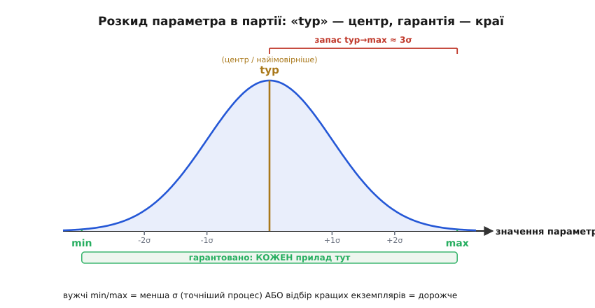
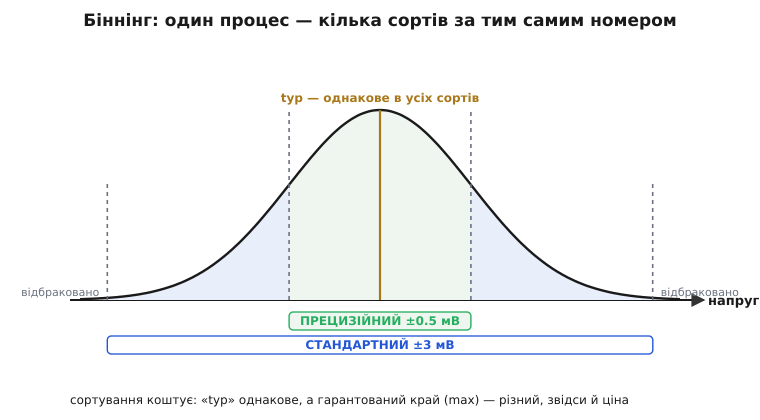

# 🧮 Min/typ/max як статистика: розкид партії і чому «typ» ніхто не гарантує

Даташит дає на параметр три числа — **min**, **typ**, **max**, — і практичне правило звучить просто: рахуй на гарантований край, а «typ» лиши для прикидки. Але за цими трьома числами стоїть одна-єдина крива — розподіл значень у партії, — і щойно її побачиш, усе правило перестає бути «бо так заведено» й робиться очевидним. Звідки беруться три числа, що насправді означає «typ», як ширина min…max пов'язана з якістю процесу і чому за вужчі межі доводиться доплачувати — усе це читається з форми тієї кривої.

### Партія — це розподіл, а не одне число

Виробник випускає не один прилад, а **партію** (*production lot*) — мільйони екземплярів того самого номера. Виміряймо в кожному якийсь параметр (скажімо, напругу зсуву *Vos* операційного підсилювача) і побудуймо гістограму: скільки приладів потрапило в кожен вузький інтервал значень. Майже завжди вийде **дзвоноподібна крива** — нормальний розподіл (*normal / Gaussian distribution*). Його задають два числа:

```
μ (мю)    — середнє: де центр дзвона
σ (сигма) — стандартне відхилення: наскільки широкий дзвін
```

σ — це [міра розкиду](topic:math/mean-variance) (*spread*): мала σ — вузький гострий пік (екземпляри схожі), велика σ — розпливчастий горб (екземпляри різні). Розкид не випадковість і не недбалість, а фізика: кожен чип — це мільйони мікроструктур на кремнії, і найдрібніші коливання процесу (товщини шарів, концентрації домішок) роблять кожен екземпляр трохи інакшим.


*Параметри партії розкидані дзвоном довкола середнього μ. «typ» — це і є μ, вершина дзвона (найімовірніше значення). Гарантовані min/max виробник ставить на хвостах — звичайно десь за ±3σ від центру, — щоб під межами опинився кожен випущений прилад. Запас від «typ» до краю — це і є ті кілька сигм.*

### Що таке «typ», min і max мовою статистики

Тепер три колонки даташита читаються однозначно:

```
typ  = μ            центр розподілу (найімовірніше значення)
min  ≈ μ − k·σ      нижній гарантований край
max  ≈ μ + k·σ      верхній гарантований край
```

Множник **k** — це «скільки сигм» відкладено від центру до межі. Чому «typ» нічого не гарантує, видно одразу: μ — це лише вершина дзвона, **половина** приладів лежить вище за неї, половина нижче. Закластися на «typ» означає спроектувати схему, що працює рівно на тих, кому пощастило опинитися з потрібного боку, — приблизно на 50 %. Натомість краї виробник ставить так далеко (велике k), щоб «погані» хвости відсікалися майже повністю.

Скільки саме «майже»? Для нормального розподілу частка приладів, що випадають за край, різко падає з ростом k:

```
за межею ±1σ   лишається ~32%   (геть ненадійно)
за межею ±2σ   лишається ~4.6%
за межею ±3σ   лишається ~0.27%  (≈ 2700 на мільйон)
за межею ±4σ   лишається ~0.006% (≈ 63 на мільйон)
```

Тому типовий гарантований край — десь біля 3σ і далі: за ним лежать одиниці чи тисячні частки відсотка партії, та й тих відсіює заводський тест. Це і є кількісна відповідь на питання теми «чому край, а не центр»: під центром — половина браку для вашої схеми, під краєм у 3σ — майже нічого. Дефекти, що лишилися, часто рахують у **ppm** (*parts per million*, частин на мільйон): 2700 ppm для 3σ, 63 ppm для 4σ.

### Прочитати σ просто з даташита

Найкорисніше те, що ці дві колонки дають змогу прикинути саму σ — навіть якщо виробник її ніде не друкує. Візьмімо реальний рядок зсуву: typ = 0.5 мВ, max = 3 мВ. Якщо max відкладено за звичні 3σ від центру, то запас typ→max — це і є 3σ:

```
запас = max − typ = 3.0 − 0.5 = 2.5 мВ
3σ ≈ 2.5 мВ   →   σ ≈ 0.83 мВ
```

Тепер видно, наскільки «typ» оманливе як проектне число. Закластися на 0.5 мВ — означає взяти центр, тобто прийняти, що **половина** партії має зсув гірший за ваш розрахунок. Узяти 1σ (≈1.3 мВ) — і за межею все ще близько 16 % приладів з одного боку. І лише гарантовані 3 мВ лишають за бортом тисячні частки відсотка, та й тих відсіяв тест. Та сама арифметика працює в інший бік: якщо для прецизійного сорту того самого чипа max = 1 мВ, то його запас typ→max — лише 0.5 мВ, тобто або σ удвічі менша (кращий процес), або край відкладено не на 3σ, а ближче (жорсткіший відбір). Один погляд на ширину min…max — і ви вже знаєте, наскільки тугий розкид за числами стоїть.

> 🔧 **Навіщо це.** Уміння перевести три колонки в μ і σ дає інженерові дві речі. Перша — швидко оцінити запас: відстань від «typ» до краю в сигмах підказує, наскільки ризиковано закластися на проміжне число, якщо край вашого бюджету не тримає. Друга — порівнювати прилади чесно: вужчий max при тому самому typ означає або точніший процес, або жорсткіший відбір, і саме за це ви доплачуєте. Без цієї моделі «typ» виглядає як безкоштовний кращий варіант — а він просто центр кривої, під яким ховається половина партії.

### Звідки беруться «сорти» і чому вони коштують різного

Звідси ж видно, як народжуються «прецизійні» версії того самого чипа. Процес дає одну криву з певними μ і σ. А далі прилади **сортують** (*binning*) — міряють на тесті й розкладають за «кошиками» якості.


*Той самий процес, той самий μ. Екземпляри з центру (малий зсув) ідуть у дорогий прецизійний сорт із вузькими min/max; ширший шмат довкола — у дешевший стандартний; далекі хвости бракуються. «typ» в усіх сортів однакове — різний лише гарантований край.*

Звузити min…max можна двома способами — і обидва коштують грошей. **Перший** — поліпшити процес, зменшити саму σ (тонший контроль на фабриці): дзвін стає гострішим, краї сходяться. **Другий** — лишити σ як є, але відібрати в окремий сорт лише центральні екземпляри (малий k навколо μ): решта йде в дешевший сорт або в брак. У підсумку вужча гарантія — завжди дорожча: ви платите або за досконаліший процес, або за те, що частину партії відбракували заради вас. Ось чому «той самий» підсилювач із зсувом 0.5 мВ коштує помітно більше за версію з 3 мВ: фізично це можуть бути сусіди з однієї пластини, розкладені тестом по різних цінниках.

### Де ця статистика працює

Ця статистика стоїть за всіма «трьома колонками» даташита. Правило «рахуй на гарантований край» — це просто вимога покрити **весь** дзвін, а не його половину. Звідси ж випливає, чому найгірший бік варто брати лише для **критичних** параметрів: подія, коли *всі* параметри водночас опиняться на своїх 3σ-хвостах, неймовірно рідкісна (хвости незалежні, а ймовірності перемножуються), тож закладати кожен параметр на край — це проектувати під неіснуючий прилад.

Сама позначка «3σ» — не закон, а зручна угода: де ціна відмови висока (автомобільні, медичні, космічні чипи), край відсувають далі — на 4σ, 6σ і більше, і тоді за межею лишаються вже одиниці на мільйон чи мільярд. Де відмова дешева — обмежуються вужчим запасом. Тому однакове на вигляд «max» у двох даташитах може ховати різну кількість сигм; коли це справді важить, шукають у документі, на скільки σ або за яким правилом узято край. А поділ на «100 % tested» і «guaranteed by design» — це різниця між «зміряли в кожного» і «ручаємося з моделі розподілу»: перше тримається на прямому вимірі, друге — на тій самій кривій плюс вибіркова перевірка. Той самий дзвін розкиду живе скрізь, де є масове виробництво: від номіналів [резисторів](topic:electronics/resistor) (5 % проти 1 %) до розкиду порогів і струмів у будь-якому даташиті.
