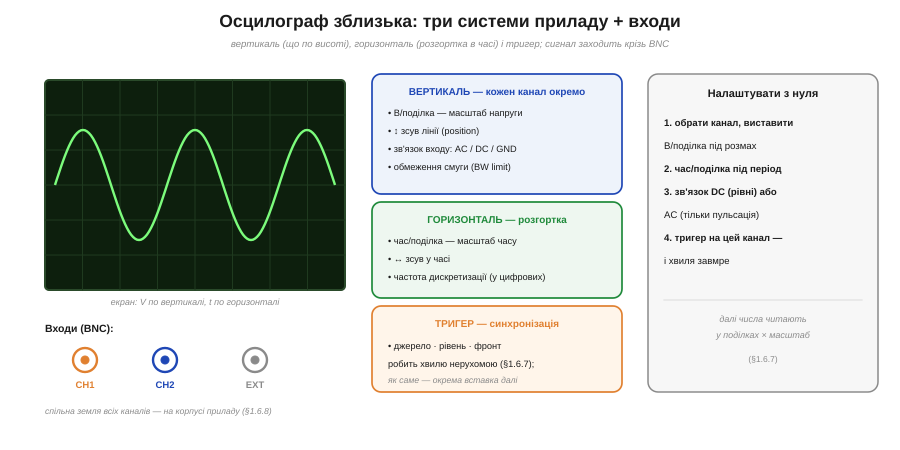
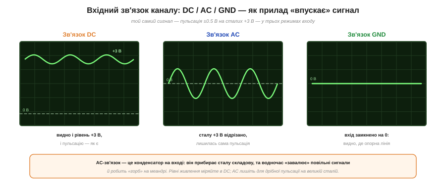
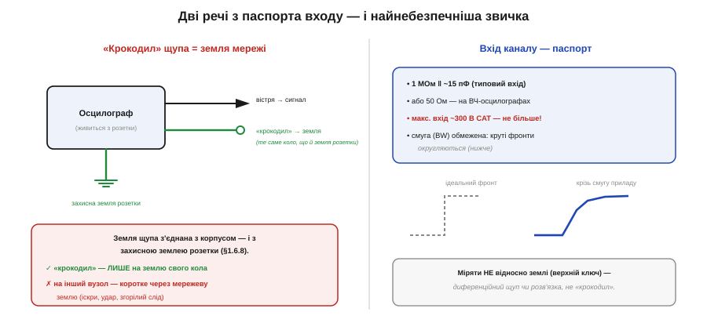

# 🔌 Осцилограф зблизька: канали, розгортка, вхідні режими AC/DC

Осцилограф зблизька — це прилад із кількох систем: розберімо, з чого він складається, що означають ручки на панелі, які числа стоять у його паспорті й чому одна звичка з «крокодилом» здатна спалити і прилад, і коло.

## Три системи + входи

У будь-якого осцилографа — три системи керування, і щойно ви бачите їх окремо, панель перестає лякати.

*Три системи осцилографа. **Вертикаль** (на кожен канал — В/поділка, зсув, зв'язок AC/DC/GND, обмеження смуги); **горизонталь** — розгортка (час/поділка, частота дискретизації); **тригер** (джерело, рівень, фронт). Сигнал заходить крізь BNC-входи; земля каналів спільна.*

- **Вертикаль** (по одній на кожен канал): «В/поділка» (масштаб напруги), зсув лінії, **зв'язок входу** (AC/DC/GND) і обмеження смуги.
- **Горизонталь** (спільна — це **розгортка**): «час/поділка» (масштаб часу), зсув і, у цифрових, **частота дискретизації**.
- **Тригер**: джерело, рівень і фронт, що ловлять хвилю та утримують її нерухомою на екрані.

## Канали й входи (BNC)

Сигнал заходить крізь **BNC**-рознім — окремий на кожен канал (CH1, CH2, інколи EXT для зовнішнього тригера). Двоканальний осцилограф показує дві хвилі водночас — вхід і вихід підсилювача, дві лінії шини. І одне треба засвоїти одразу: **земля всіх каналів спільна**, вона сидить на корпусі приладу — а корпус, своєю чергою, з'єднаний із захисною землею розетки.

## Вхідний зв'язок: DC, AC чи GND

Найхарактерніша ручка каналу — **зв'язок входу** (*coupling*): три способи «впустити» сигнал.

*Той самий сигнал (пульсація на сталих +3 В) у трьох режимах входу. **DC** — як є (видно й рівень, і пульсацію); **AC** — конденсатор відрізав сталу, лишилась сама пульсація; **GND** — вхід замкнено на 0, видно опорну лінію.*

- **DC** — сигнал заходить **як є**: видно і сталий рівень, і змінну частину. Це режим за замовчуванням для напруг живлення, логіки, ШІМ.
- **AC** — на вході стає конденсатор, що **відрізає сталу складову**: лишається сама змінна частина. Так зручно роздивитися дрібну **пульсацію** на великій сталій напрузі (скажімо, 50 мВ брижів на 12 В) — але AC «завалює» повільні сигнали й спотворює меандр, тож рівні ним не міряють.
- **GND** — вхід відмикають від сигналу й замикають на 0: на екрані рівна лінія, що показує, **де нуль**. Корисно виставити цю опорну лінію перед виміром.

## Паспорт входу: опір, смуга, межа

*Ліворуч — головна засторога: «крокодил» щупа з'єднаний із корпусом і захисною землею розетки, тож чіпляти його можна лише на землю кола. Праворуч — паспорт входу: 1 МОм ‖ ~15 пФ, обмежена смуга (округлює круті фронти), гранична вхідна напруга.*

Три числа, на які варто глянути в паспорті:

- **Вхідний опір ~1 МОм ‖ ~15 пФ.** Один мегаом — щоб [менше навантажувати коло](topic:electronics/measurement-errors), а паралельна **ємність** ~15 пФ на високих частотах уже відчутна (саме через неї й існує щуп ×10). На ВЧ-осцилографах вхід натомість **50 Ом**.
- **Смуга пропускання (bandwidth).** Прилад зі смугою, скажімо, 20 МГц **округлить** круті фронти швидших сигналів — фронт «завалиться». Груба підказка: смуга має бути в кілька разів більша за найвищу важливу гармоніку сигналу.
- **Максимальна вхідна напруга** (часто ~300 В CAT). Перевищите — пробʼєте вхід; для мережі й вище потрібні щупи та прилади відповідної категорії безпеки (CAT II/III/IV).

## Найнебезпечніша звичка

Ось граблі, на які наступають навіть досвідчені. Чорний **«крокодил»** щупа — це **земля мережі**: він з'єднаний із корпусом приладу, а той — із захисним заземленням розетки. Тому чіпляти «крокодил» можна **лише на землю свого кола**. Причепите його на будь-який інший вузол (скажімо, на «гарячу» точку мережевого блока) — і ви через прилад **закоротите** цей вузол на земляну шину розетки: іскри, згорілий слід, у гіршому разі удар струмом. А щоб коректно поміряти **не відносно землі** (різницю між двома точками, верхній ключ напівмоста) — потрібен **диференційний** щуп або гальванічна розв'язка, а не звичайний «крокодил».

## Варіації класу

Старі **аналогові** осцилографи малюють промінь на електронно-променевій трубці; нинішні — **цифрові** (DSO): оцифровують вхід і малюють на екрані, уміють зупиняти, зберігати й міряти автоматично. За форматом — настільні, портативні й дешеві **USB-приставки** до комп'ютера. Окремий рід — **змішані** (MSO): крім аналогових каналів, мають цифрові входи, як у [логічного аналізатора](topic:electronics/logic-analyzer), — щоб бачити аналог і логіку на одному екрані.
