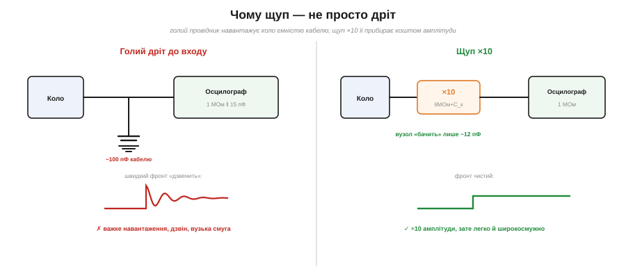
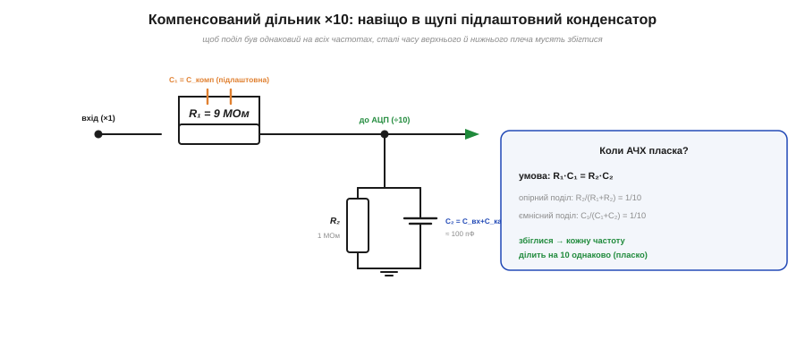
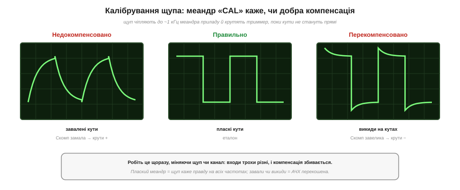

# 🔌 Щуп 1×/10×: дільник, ємність кабелю й компенсація

> 🔌 Компонентна вставка про річ, яку новачки часто недооцінюють у [роботі з осцилографом](book:electronics/oscilloscope): **щуп**. Він не просто дріт: усередині живе хитрий дільник, без якого осцилограф або спотворював би сигнал, або заважав би колу. Розберімо, чому щупи бувають ×1 і ×10, до чого тут ємність кабелю й що то за маленький гвинтик, який радять «підкрутити».

## Чому щуп — не просто дріт

Здавалося б: причепи дріт від кола до входу — і дивись. Та вхід осцилографа має ~**15 пФ** власної ємності, а коаксіальний кабель щупа додає ще близько **100 пФ**. Усе це — ємність, яку голий дріт навісив би **просто на ваш вузол**.


*Рис. Голий дріт навісив би на вузол усю ємність кабелю (~100 пФ): фронт «дзвенить», навантаження важке. Щуп ×10 ставить попереду резистор 9 МОм — коло «бачить» лише ~12 пФ, фронт чистий; платня — амплітуда ділиться на 10.*

Для повільного сигналу в низькоомному колі це дрібниця; але для **швидких фронтів** чи **високоомного** вузла ці сто пікофарад — справжня біда: вони сповільнюють фронти, «садять» сигнал і змушують його **дзвеніти**. Тобто голий дріт спотворює саме те, що ви прийшли поміряти. Розв'язок — не зменшити ємність кабелю (нікуди вона не дінеться), а **поставити перед нею дільник**.

## ×1 проти ×10

Звідси й два режими щупа:

- **×1** — пряме з'єднання, без поділу. Повна амплітуда (добре для дрібних сигналів), але коло «бачить» усю ємність кабелю (~100 пФ), навантаження важке, а смуга вузька (одиниці МГц). Годиться лише для повільних слабких сигналів.
- **×10** — у вістрі щупа стоїть резистор **9 МОм**. Разом зі входом приладу (1 МОм) виходить дільник **10 МОм, сигнал ÷10**. Натомість коло «бачить» уже не 100, а лише ~**10–15 пФ**: навантаження вдесятеро легше, смуга повна (десятки-сотні МГц). Платня — амплітуда падає в 10 разів (прилад має **знати**, що щуп ×10), і зовсім дрібних сигналів уже не роздивитися.

На щодень працюють саме **×10**: легке навантаження й широка смуга важать більше, ніж утрата амплітуди, яку прилад однаково надолужує множенням показу на 10.

## Дільник, що мусить бути «пласким»

Та просто 9 МОм + 1 МОм — мало. Резистивний дільник дає ÷10 лише **на постійному струмі**; на високих частотах верх беруть уже **ємності** (15 пФ входу, 100 пФ кабелю), і поділ «попливе» — різні частоти поділяться по-різному, а сигнал спотвориться.


*Рис. Щуп ×10 — це дільник 9 МОм : 1 МОм (÷10). Аби поділ був однаковий на всіх частотах, паралельно 9 МОм ставлять підлаштовну C_комп; АЧХ пласка, коли R₁·C₁ = R₂·C₂, тобто C_комп ≈ C₂/9 ≈ 11 пФ.*

Рятунок — **компенсувальний конденсатор** C_комп, увімкнений паралельно 9-мегаомному резистору. Тепер маємо дільник із двох RC-плеч, і він поділяє однаково на всіх частотах рівно тоді, коли сталі часу плеч **збігаються**:

```
Компенсований дільник ×10 — пласка АЧХ, коли збігаються сталі часу:
  верхнє плече:  R₁ = 9 МОм,  C₁ = C_комп (підлаштовна)
  нижнє плече:   R₂ = 1 МОм,  C₂ = C_вх + C_кабель ≈ 100 пФ
  умова:         R₁·C₁ = R₂·C₂
  →              C_комп = R₂·C₂ / R₁ = C₂ / 9  ≈ 100/9 ≈ 11 пФ
```

Коли умова виконана, **ємнісний** поділ C₁/(C₁+C₂) теж дає 1/10 — точно як **опірний** R₂/(R₁+R₂). Обидва однакові, і кожна частота ділиться на 10 **рівно**. Саме тому C_комп роблять підлаштовною: ємність вашого конкретного входу й кабелю наперед невідома, тож її доводять на місці.

## Як компенсують: меандр і гвинтик


*Рис. Компенсацію перевіряють меандром «CAL» (~1 кГц). Завалені кути — C_комп замала (недокомпенсовано); викиди — завелика (перекомпенсовано); пласкі кути — правильно.*

Підлаштовують C_комп просто. На осцилографі є вихід **«CAL»** — еталонний меандр (зазвичай ~1 кГц). Чіпляють до нього щуп і дивляться на кути:

- **пласкі кути** — компенсація правильна, щуп каже правду;
- **завалені** (заокруглені) кути — C_комп замала (недокомпенсовано), крутити в плюс;
- **викиди** на кутах — C_комп завелика (перекомпенсовано), крутити в мінус.

Кілька рухів маленької викрутки — і меандр випрямляється. Робити це варто **щоразу**, як перечепили щуп на інший канал чи прилад: входи трохи різні.

## Граблі й варіації

Найчастіша помилка — **прилад не знає, що щуп ×10**: тоді всі покази в 10 разів неправильні (сучасні осцилографи розпізнають це самі через сенсорне кільце на BNC, або множник ставлять руками). Друга — **довгий «крокодил» землі**: його індуктивність разом із ємністю щупа дає контур, що дзвенить на швидких фронтах; для швидких сигналів землю беруть **короткою** (пружинкою біля вістря). Третя — **перевищити напругу** щупа (звичайні ×10 тримають кількасот вольтів, не більше).

А родина щупів широка: перемикні **×1/×10**, **×100**, високовольтні; **активні** (на польовому транзисторі — ємність ~1 пФ, для найшвидших сигналів); **диференційні** (виміряти напругу між двома точками, жодна з яких не заземлена); **струмові** кліщі (струм без розриву кола).
