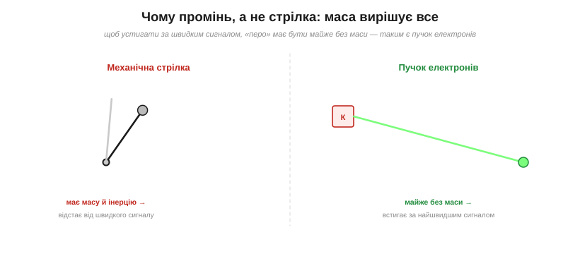
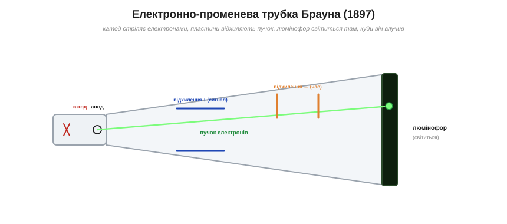
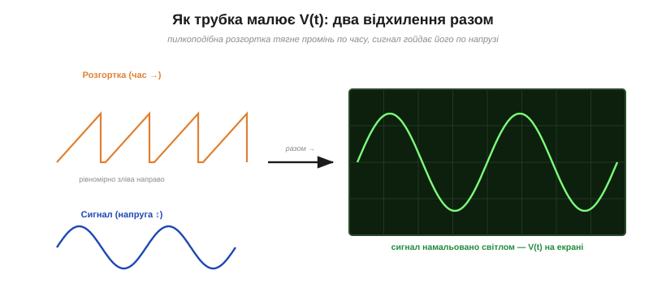
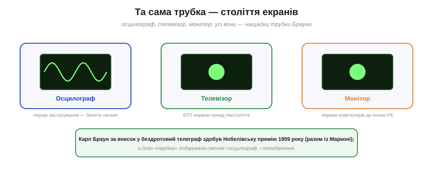

# 📜 Браун і електронно-променева трубка: перо зі світла

> Історична вставка до теми [«Осцилограф»](book:electronics/oscilloscope). Осцилограф малює сигнал на екрані. Та задумаймося: як узагалі **намалювати** невидимий сигнал, що міняється тисячі й мільйони разів на секунду, — швидше, ніж устигне ворухнутися будь-яка стрілка? Відповідь, знайдена 1897 року німцем **Карлом Брауном**, була зухвала: викинути механічне перо й писати **пучком електронів** — майже невагомим, миттєвим «пером зі світла». Та сама трубка згодом подарувала світові не лише осцилограф, а й телевізор та монітор на ціле століття.

---

## Чому стрілка не встигає за швидким сигналом

Класичні [стрілкові прилади](book:electronics/schematic-purpose/hist-instruments.md) працюють так: струм повертає рамку, стрілка відхиляється. Це чудово для **повільних** вимірів. Але сигнал, що коливається тисячі разів на секунду? Стрілка просто **не встигне** — поки вона хитнеться в один бік, сигнал уже десять разів змінився. Потрібне «перо», здатне рухатися **неймовірно швидко** й малювати форму вмить. Жоден механічний важіль на це не здатний.

---

## Біда стрілки: маса й інерція

Корінь проблеми — **маса**. Будь-яка стрілка, рамка, важіль мають вагу, а отже, **інерцію**: щоб зрушити їх, потрібен час, і зупинити теж. Що швидший сигнал, то безнадійніше «важке» перо за ним відстає — і замість форми виходить розмита пляма.

*Рис. Механічна стрілка має масу й інерцію, тож за швидким сигналом вона безнадійно **відстає**. А пучок електронів майже **без маси** — він кориться полю миттєво й устигає накреслити навіть найшвидший сигнал.*

Розв'язок мав бути радикальним: перо має бути **майже без маси**. І така «безмасова» річ існує — **електрон**. Він у тисячі разів легший за атом, практично невагомий, і миттєво відхиляється електричним полем. Якщо змусити **пучок** електронів писати по екрану, він устигне за будь-яким сигналом. Лишалося втілити цю ідею в залізі — точніше, у склі.

---

## Браун (1897): перо зі світла

Це й зробив 1897 року **Карл Фердинанд Браун** (*Karl Ferdinand Braun*, 1850–1918), німецький фізик. Він збудував першу **електронно-променеву трубку** (*cathode-ray tube*, ЕПТ) — скляну вакуумну колбу, у якій пучок електронів малює світний слід на екрані. Її так і називають — **трубка Брауна**.

*Рис. Трубка Брауна (у розвиненому вигляді): розжарений **катод** вистрілює електрони, **анод** розганяє їх у вузький пучок, дві пари **відхильних пластин** згинають його (вгору-вниз — за сигналом, ліворуч-праворуч — за часом), а **люмінофор** на екрані спалахує там, куди влучив пучок.*

Влаштована вона геніально просто. На вузькому кінці — **катод**, що його розжарюють, і він «випаровує» електрони. **Анод** розганяє їх у тонкий **пучок**. Далі пучок пролітає між двома парами **відхильних пластин**: подаси на них напругу — і поле згине пучок убік, тим сильніше, чим більша напруга. А на широкому кінці — екран, укритий **люмінофором**: там, куди влучає пучок, спалахує яскрава **світна точка**. Ось воно, перо зі світла: невагомий пучок, що його напруга вмить кидає куди завгодно, лишаючи світний слід.

Треба, одначе, чесно сказати: це трубка в її **розвиненому** вигляді. Перша ж Браунова трубка 1897 року була значно грубішою — з **холодним** катодом (тож вимагала ~100 000 В) і лише **одним** напрямком відхилення; другу вісь, час, давало **обертове дзеркало** перед екраном. Розжарений катод, друга пара пластин і високий вакуум прийшли вже з пізнішими вдосконаленнями (зокрема його помічника **Йонатана Ценнека**, 1899).

Цікавий збіг: рівно того ж 1897 року англієць **Дж. Дж. Томсон** довів, що катодні промені — це потік окремих частинок, **електронів**. Тобто Браун будував свою трубку майже одночасно з відкриттям самої частинки, якою вона писала: електрон щойно «знайшли» — а він уже малював на екрані.

---

## Як трубка малює V(t)

Лишалося змусити цю точку малювати **графік** — напругу від часу. Для цього потрібні **два** відхилення водночас.

*Рис. Дві дії разом: горизонтальні пластини отримують пилкоподібну **розгортку**, що рівномірно тягне точку зліва направо (це **вісь часу**); вертикальні — сам **сигнал**, що гойдає точку вгору-вниз (вісь напруги). Слід точки і є V(t), накреслений світлом.*

На **горизонтальні** пластини подають особливу **пилкоподібну** напругу — **розгортку**: вона рівномірно наростає, тягнучи точку зліва направо зі сталою швидкістю, тоді миттю кидає назад — і знову. Це й є **вісь часу**: рівний хід точки по горизонталі. А на **вертикальні** пластини подають **сам сигнал** — і він гойдає точку вгору-вниз пропорційно напрузі. Дві дії складаються: точка біжить по часу й водночас стрибає по напрузі, лишаючи світний слід — **точну форму сигналу V(t)**. Те, що мультиметр стискав до одного числа, трубка Брауна розгорнула в **живу картинку** зі світла.

> 🔧 **Навіщо це.** Тут — глибока, наскрізна для всієї електроніки ідея: **керувати майже невагомим пучком електронів напругою**. Та сама ідея живила й перші **електронні лампи** (тріоди), на яких трималася вся електроніка до транзистора, — там напруга на сітці керує потоком електронів. Замінити інерційну механіку на безінерційний потік зарядів — ось що зробило можливими і швидкі вимірювання, і радіо, і телебачення, і перші комп'ютери. Сучасний осцилограф уже цифровий (пучок замінили АЦП та РК-екран), але сама думка — «показати невидиму швидку величину, відхиляючи потік електронів» — народилася саме тут.

---

## Спадщина: від осцилографа до телевізора

Браун будував трубку, щоб **бачити сигнали**, — і дав світові осцилограф. Та виявилося, що його «перо зі світла» здатне намалювати не лише хвильку, а **будь-яку картинку**.

*Рис. Та сама трубка Брауна стала серцем не лише осцилографа, а й **телевізора** та комп'ютерного **монітора** — і панувала на екранах понад півстоліття, аж доки її не заступили рідкокристалічні дисплеї.*

Якщо пучок змусити пробігати екран **рядок за рядком** і дорогою міняти яскравість, він намалює не графік, а **зображення**. Саме так працювали **телевізори** й комп'ютерні **монітори** майже все XX століття — це були ті самі трубки Брауна, тільки великі. Мільярди екранів у мільярдах домівок — усі нащадки колби 1897 року. Аж у 2000-х їх нарешті заступили пласкі рідкокристалічні панелі; та в деяких мовах телеекран і досі звуть «трубкою Брауна». Рідко буває, щоб один винахід так довго й так широко служив людству.

---

## Хто був Браун

Браун був не лише «батьком екрана». Ще 1874 року, замолоду, він відкрив, що контакт металу з певним кристалом **пропускає струм лише в один бік** — себто **випрямляє**. На цьому ефекті вже на початку 1900-х збудують **кристалічний детектор** (*cat's-whisker*) — серце перших радіоприймачів і, по суті, **предок** [напівпровідникового діода](book:electronics/diode-iv-curve). Це варто оцінити: за десятиліття до транзистора Браун навпомацки натрапив на **напівпровідникову** провідність в один бік — те саме явище, на якому згодом зведуть усю сучасну електроніку. Кристалічний детектор у саморобних приймачах «ловив» радіохвилі саме завдяки цьому однобічному пропусканню. А ще Браун зробив величезний внесок у **бездротовий телеграф**: його схеми зв'язаних контурів і налаштованих антен різко збільшили дальність радіо. За це 1909 року він розділив **Нобелівську премію з фізики** з Ґульєльмо **Марконі** — «за внесок у розвиток бездротової телеграфії». Доля його склалася сумно: 1914 року Браун поїхав до США свідком у патентній справі (Marconi проти Telefunken). Коли 1917-го США вступили у війну, його як громадянина ворожої держави **затримали** (дозволивши лише пересуватися в межах Брукліна) — повернутися додому він уже не зміг і помер у Нью-Йорку 1918 року.

---

## Чим це відгукнулося

Зведімо. Щоб **побачити** невидимий швидкий сигнал, Браун зробив радикальний крок — замінив інерційну стрілку на безмасовий **пучок електронів**:

- **Електронно-променева трубка** (1897) — катод, пучок, відхильні пластини, люмінофор; «перо зі світла».
- Розгортка (час) + сигнал (напруга) → **V(t), намальоване світлом** — це і є осцилограф.
- Та сама трубка стала **телевізором і монітором** на ціле століття.
- А сам Браун дав ще й **кристалічний детектор** (предок діода) і доклався до **радіо** (Нобель 1909).

Головна думка, що пронизує цю історію: **керований потік електронів** перемагає там, де механіка безсила. Інерційна стрілка не встигає за швидким — невагомий пучок устигає; і та сама ідея «керувати електронами напругою» дала світові не лише екран, а й електронні лампи, радіо й увесь шлях до сучасної електроніки. Тримаючи в руках навіть цифровий осцилограф, ви користуєтесь думкою, що спалахнула у скляній колбі 1897 року.
