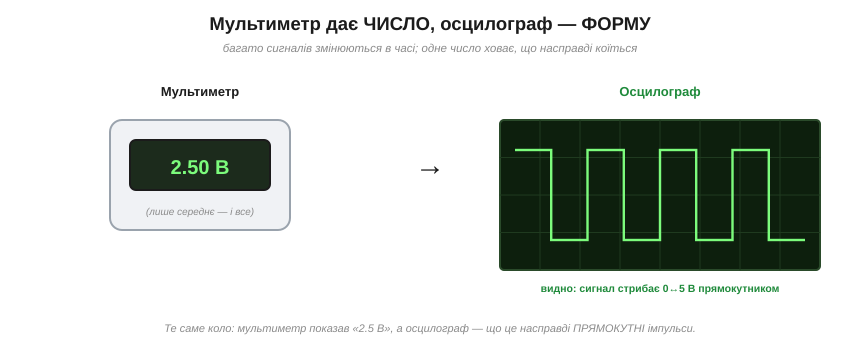
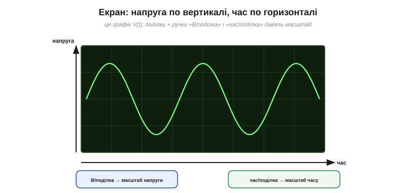
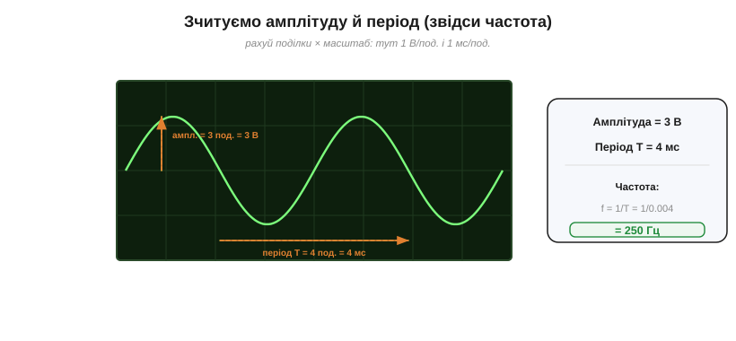
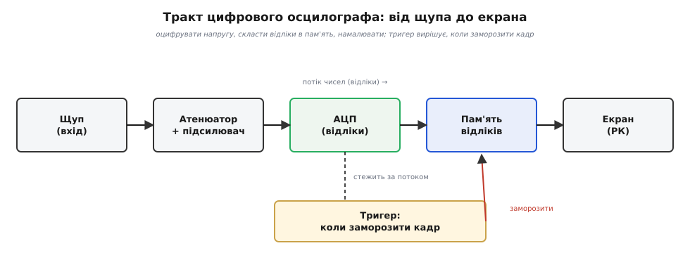
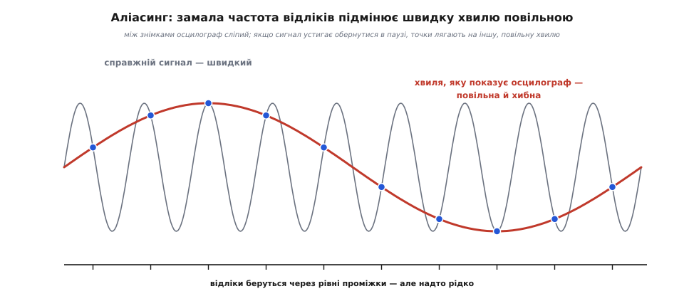
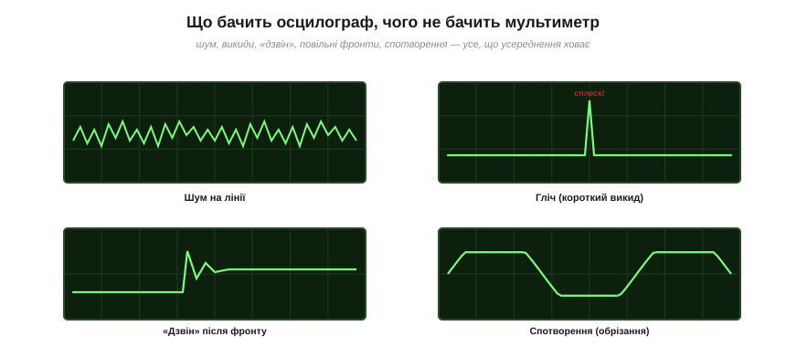

# Осцилограф: побачити сигнал у часі

<preknowlist>
- [Мультиметр](topic:electronics/multimeter) — прилад, що на кожен вимір дає одне число (значення напруги чи струму).
- [АЦП](topic:electronics/adc) — перетворювач, що заміряє напругу й видає її як ціле число (відлік).
</preknowlist>

Причепіть [мультиметр](topic:electronics/multimeter) до дроту — і дістанете одне число: «2.5 В». Число відповідає на питання «**скільки**?». Та величезна частина того, що біжить дротами, — не спокійна стала напруга, а величина, що **міняється в часі**: змінний струм, цифрові рівні, що клацають нулем і одиницею, імпульси керування, звук. Тут одне число не просто мало каже — воно **бреше через недомовку**.

Візьмімо напругу, що стрибає прямокутником між 0 і 5 В. Мультиметр у режимі постійної напруги усереднить її й покаже «2.5 В» — так, ніби на дроті тихо стоїть половина живлення. Формально це правда. А насправді жодних 2.5 В там нема ні на мить: напруга весь час або внизу на нулі, або вгорі на п'яти вольтах, і саме це швидке клацання — суть сигналу. Усереднення стерло її начисто.


*Мультиметр дає одне **число** (часто лише середнє), а осцилограф — **форму** сигналу в часі. Тут мультиметр показав «2.5 В», а осцилограф розкрив, що це насправді прямокутні імпульси 0↔5 В.*

Ось приклад, де ця різниця вирішує все. Яскравість світлодіода часто регулюють [широтно-імпульсною модуляцією](root:embedded/pwm-power-control) — швидко вмикають і вимикають його, а око бачить середнє. Мультиметр покаже якусь усереднену напругу, ніби LED світить рівно й притьмарено. Осцилограф же покаже правду: діод **миготить** на повну яскравість тисячі разів на секунду, а «притьмареність» — витвір нашого повільного зору. Щоб бачити не «скільки в середньому», а «**яка форма й коли**», потрібен прилад, що малює напругу як графік у часі. Це й є **осцилограф** (від лат. *oscillare* — «гойдатися, коливатися», і грец. *graphō* — «пишу»): прилад, що пише коливання.

### Що він малює: графік V(t)

Екран осцилографа — це графік. По **вертикалі** відкладено напругу, по **горизонталі** — час, а поле розкреслено сіткою квадратних **поділок** (*divisions*). Дві головні ручки задають масштаб обох осей. «**Вольт на поділку**» (V/div) каже, скільки вольтів припадає на одну клітинку по висоті; «**час на поділку**» (time/div) — скільки часу вміщує клітинка по ширині. Крутячи їх, сигнал «наближають» чи «віддаляють», доки він зручно не ляже на екран.


*Екран осцилографа — це графік напруги (вертикаль) від часу (горизонталь), розкреслений на поділки. Ручки «В/поділка» і «час/поділка» задають масштаб обох осей.*

Числа з такої картинки читають прямо — рахуючи поділки. **Амплітуду** беруть від середньої лінії до піка й множать на V/div; повний **розмах** від піка до піка (V_pp) удвічі більший. **Період** T — час одного повного циклу — рахують по горизонталі: скільки поділок укладається в цикл, помножити на time/div. А з періоду одразу маємо **частоту** за формулою f = 1/T.

**Приклад. Синусоїда на екрані: 3 поділки заввишки від осі до піка при 1 В на поділку, і 4 поділки на період при 1 мс на поділку.**

```
амплітуда = 3 поділки · 1 В/под.   = 3 В
розмах    = 2 · 3 В                 = 6 В    (V_pp)
період    = 4 поділки · 1 мс/под.   = 4 мс   = 0.004 с
частота   = 1 / T = 1 / 0.004 с     = 250 Гц
```


*Зчитування: амплітуду й період рахують у поділках і множать на масштаб. Тут амплітуда 3 поділки × 1 В = 3 В (розмах V_pp = 6 В); період 4 поділки × 1 мс = 4 мс; звідси f = 1/T = 250 Гц.*

Так із живої картинки дістають усі числа сигналу — і ті, яких мультиметр не дав би взагалі: тривалість фронту, симетрію, форму верхівки.

### Як намалювати те, що міняється мільйони разів на секунду

Ось головна трудність. Стрілка приладу має масу, а отже, інерцію: за сигналом, що коливається тисячі й мільйони разів на секунду, жоден механічний важіль не встигне — поки він хитнеться в один бік, сигнал уже десять разів змінився. Потрібне «перо» майже без інерції. Історично цю задачу розв'язали двічі, і два способи задають два покоління осцилографів.

**Аналоговий шлях — промінь зі світла.** Перше «безмасове перо» знайшли ще 1897 року: пучок електронів в [електронно-променевій трубці](topic:electronics/oscilloscope/hist-crt.md). Електрон майже невагомий, тож напруга миттєво кидає пучок куди завгодно, а люмінофор на екрані спалахує там, куди він влучив. Одну пару відхильних пластин гойдає сам сигнал (це вісь напруги), другій дають рівномірно наростальну «пилкоподібну» напругу — **розгортку**, що тягне пучок зліва направо (це вісь часу). Слід світної точки і є V(t), накреслене світлом.

> 📜 Як пучок електронів став «пером зі світла» — історія трубки німецького фізика Карла Фердинанда Брауна (1897), а з нею й телевізора та монітора на ціле століття — у вставці [Браун і електронно-променева трубка](topic:electronics/oscilloscope/hist-crt.md).

**Цифровий шлях — не малювати, а рахувати.** Сучасний осцилограф (DSO, *digital storage oscilloscope* — «цифровий запам'ятовувальний осцилограф») не має ні променя, ні пластин. Він робить інше: дуже часто **заміряє** напругу, кожен замір [АЦП](topic:electronics/adc) перетворює на число, числа складають у пам'ять — а тоді малюють як низку точок на звичайному РК-екрані. Промінь зник; лишилася **послідовність відліків**.


*Тракт DSO: щуп → атенюатор і підсилювач (підганяють сигнал у діапазон АЦП) → АЦП (обертає напругу на потік чисел) → пам'ять відліків → екран. Тригер стежить за тим самим потоком і вирішує, коли заморозити кадр.*

Цей тракт варто тримати в голові — з нього ростуть усі можливості й усі обмеження приладу. Сигнал заходить крізь щуп, далі **атенюатор** (дільник) послаблює завеликі напруги, а підсилювач, навпаки, підтягує дрібні — так, щоб сигнал ліг точно в діапазон АЦП. **АЦП** заміряє його багато мільйонів разів на секунду, обертаючи на потік цілих чисел. Числа течуть у **пам'ять відліків**; звідти їх бере екран. Тепер зрозуміло, що насправді роблять ручки: V/div керує підсиленням тракту, а time/div — тим, який шмат записаної пам'яті розтягти на всю ширину екрана.

Ось чому цифровий прилад уміє те, чого аналоговий не міг. Раз сигнал уже лежить у пам'яті числами, його можна **зупинити**, зберегти, поміряти автоматично й навіть показати те, що діялося **перед** моментом запуску.

### Тригер: як спинити хвилю на екрані

Є тонкість, без якої екран — суцільна каша. Осцилограф малює сигнал не раз, а **знову й знову**: аналоговий щоразу проганяє промінь зліва направо, цифровий — захоплює кадр за кадром. Якщо кожен прохід починати з випадкової точки сигналу, періодична хвиля щоразу трохи зсунеться по фазі — і проходи, лягаючи один на одного, дадуть **розмиту пляму**.

Рятує **тригер** (від англ. *trigger* — «спусковий гачок»): він велить приладу починати кожен прохід **з тієї самої точки** сигналу. Найпоширеніша умова — **по фронту**: момент, коли напруга перетинає обраний **рівень** у обраний **бік** — висхідний фронт (↑) чи нисхідний (↓). Тоді кожен прохід стартує однаково, проходи точно накладаються — і хвиля **завмирає**, її стає видно. Налаштувати тригер — перше, що роблять, отримавши «біжучу» картинку.


*Тригер (синхронізація) «ловить» сигнал у тій самій точці щороз — і періодична хвиля завмирає нерухомо. Без нього вона «біжить» і розмивається.*

Проста умова «перетнув рівень» має дві відомі вади, і обидві лікують класично. Якщо сигнал брудний, біля рівня він **дрижить** і перетинає його багато разів поспіль — купа хибних запусків, і картинка знову «біжить». Лікує **гістерезис**: замість одного рівня беруть смугу L ± h і не дозволяють новий запуск, поки сигнал не вийде за протилежний край смуги (той самий принцип, що в [тригера Шмітта](topic:electronics/schmitt-trigger)). А в складного, багатогорбого сигналу за період є **кілька** придатних фронтів, і тригер стрибає між ними — тут допомагає **голдофф** (*holdoff*): по спрацюванні прилад певний час не тригерить зовсім, пропускаючи зайві фронти аж до початку нового періоду. Плюс три режими на всі випадки: **Auto** (нема тригера — розгортка йде сама, бачиш бодай щось), **Normal** (малюємо лише на тригер) і **Single** (зловити один кадр і спинитись — для рідкісних подій).

> ⚙️ Сам алгоритм — умова фронту, гістерезис, голдофф і кільцевий буфер для показу того, що було перед подією — навдивовижу дешевий; його розібрано з робочим кодом на мікроконтролері у вставці [Тригер: алгоритм, що зупиняє хвилю](topic:electronics/oscilloscope/proj-trigger.md).

Крім фронтового, є й **спеціальні** тригери: за тривалістю імпульсу (спіймати надто вузький чи надто широкий), за «рунтом» (недорослим імпульсом), за умовою протоколу зв'язку — усі вони кажуть те саме «з якої точки почати», лише хитріше описуючи цю точку.

А те, що саме тригерна розгортка перетворила осцилограф із «глядача хвиль» на вимірювальний прилад, — окрема історія, і повчальна тим, що «перший тригерний осцилограф» насправді має багатьох батьків.

> 📜 Чому тригер зробив осцилограф інструментом на кожен інженерний стіл — і чому першість тут колективна (воєнні радари, фірма DuMont, Tektronix) — у вставці [Tektronix і тригерна розгортка](topic:electronics/oscilloscope/hist-tektronix.md).

### Дві межі кожного цифрового осцилографа

У паспорті DSO стоять два головні числа — **смуга пропускання** й **частота дискретизації**. Вони відповідають на різні питання, і плутати їх — класична помилка. Розберімо, звідки береться кожне.

**Частота дискретизації й аліасинг.** АЦП заміряє напругу не безперервно, а **знімками** через рівні проміжки — f_s замірів на секунду. Між знімками прилад **сліпий**: що діялося в паузі, він не знає. Якщо сигнал устигає зробити повний оберт (і більше) між сусідніми знімками, точки з'єднаються у **брехливу, повільнішу** хвилю, якої в сигналі нема. Це — **аліасинг** (від англ. *alias* — «інше ім'я»): швидка хвиля прикидається чужою, повільною.


*Справжній сигнал швидкий (світла хвиля), але відліки беруться надто рідко. Точки лягають так, що крізь них проходить зовсім інша, повільна хвиля (червона) — саме її й покаже осцилограф. Це аліасинг: частоту «вкрали».*

Скільки ж замірів треба? Щоб бодай **виявити** частоту, дискретизація має бути **швидша за подвоєну** частоту сигналу — це межа [Найквіста](topic:communications/nyquist-aliasing): f_s > 2·f. Та «виявити» — ще не «побачити форму»: щоб синусоїда на екрані була схожа на синусоїду, а не на ламану, беруть **із запасом**, разів у п'ять-десять.

**Приклад. Дивимось сигнал 20 МГц.**

```
межа Найквіста:   f_s > 2 · 20 МГц    = 40 МГц       (щоб узагалі не збрехати)
щоб бачити форму: f_s ≈ 5…10 · 20 МГц = 100…200 МГц   (щоб хвиля була хвилею)
```

Тому в справжніх осцилографів дискретизація величезна — гіга-відліки на секунду, — саме щоб аліасинг не кусав на щодень. А от у саморобному «осцилографі» на дешевому АЦП він вилазить одразу: замала частота вибірки — і на екрані впевнено стоїть хвиля, якої нема. Докладніше про сам механізм — у [дискретизації й квантуванні](topic:electronics/sampling-quantization).

**Глибина пам'яті (довжина запису).** Відліки лягають у пам'ять на N точок — і не більше. Звідси проста тотожність:

```
вікно часу = N відліків / f_s
```

При повній частоті дискретизації саме глибина пам'яті задає, який **завдовжки** шмат часу влізе в один кадр.

**Приклад. Пам'ять 1 мільйон точок, дискретизація 1 гіга-відлік на секунду.**

```
вікно = N / f_s = 1 000 000 / 1 000 000 000 с = 0.001 с = 1 мс
```

Один мілісекундний кадр — на повній швидкості. Хочете вікно на цілу секунду — або опустіть частоту дискретизації (і втратите дрібні деталі всередині), або майте пам'ять на гіга-точки. Це вічний компроміс: **широке вікно** й **дрібна роздільність у часі** одночасно коштують **глибокої пам'яті**.

**Смуга пропускання.** Третє обмеження живе **перед** АЦП, в аналоговому тракті (щуп, атенюатор, підсилювач), і від дискретизації не залежить зовсім. Будь-який підсилювач пропускає низькі частоти добре, а від певної межі починає **гасити** високі. Ця межа — **смуга пропускання** (*bandwidth*), точка спаду підсилення на −3 дБ ([смуга −3 дБ](topic:electronics/bandwidth-3db)). Вище неї швидкі складові сигналу слабшають — круті фронти **округлюються**, а амплітуда швидкого сигналу читається заниженою.

Тут криється пастка: **меандр — не одна частота**. Прямокутник складається з основної гармоніки й довгого хвоста непарних гармонік, і саме високі гармоніки роблять кут гострим. Тому смугу беруть **у кілька разів більшу** за основну частоту сигналу — груба підказка: разів у п'ять. Зручно оцінити межу приладу через його власний **час наростання**:

```
t_наростання ≈ 0.35 / смуга
```

**Приклад. Осцилограф зі смугою 100 МГц.**

```
t_наростання ≈ 0.35 / 100 МГц = 0.35 / 1e8 с = 3.5 нс
```

Такий прилад сам по собі «розмаже» будь-який фронт, коротший за ~3.5 нс: швидший перепад він фізично не покаже гострим. Ось чому смуга приладу мусить із запасом перекривати найвищу важливу гармоніку вашого сигналу — і чому для швидких сигналів беруть [щуп ×10](topic:electronics/oscilloscope/comp-probe.md), що не «садить» смугу власною ємністю кабелю.

Отже, два паспортні числа — про різне. **Смуга** каже, які частоти аналоговий тракт узагалі пропустить (це стеля «заліза»); **дискретизація** — як часто прилад знімає відліки (щоб не було аліасингу). Обидві мусять з запасом перекривати ваш сигнал: замало однієї — і картинка збреше по-своєму.

### Читати, не рахуючи поділок

Раз сигнал лежить у пам'яті числами, прилад міряє його **сам**. Кнопка автоматичних вимірів видає розмах, середнє, середньоквадратичне, частоту, період, час наростання, шпаруватість — усе пораховане з відліків, без ручного рахування клітинок. А **автомасштаб** (autoset) — рятівна перша кнопка: прилад сам угадує V/div, time/div і рівень тригера так, щоб на екрані з'явилась бодай якась стабільна картинка, від якої вже крутять ручки далі.

### Що осцилограф показує, а мультиметр ховає

Найцінніше в осцилографі — він показує саме те, що усереднення стерло б.


*Осцилограф показує те, що усереднення мультиметра ховає: шум на лінії, короткі викиди (глічі), «дзвін» після фронту, спотворення (обрізання) сигналу.*

**Шум** на лінії живлення; короткі **викиди** (глічі), що збивають логіку; **«дзвін»** — загасальні коливання після різкого фронту; повільні **фронти**; **обрізання** верхівок у перевантаженому підсилювачі. Усе це — динамічні, часові явища, невидимі для приладу, що дає одне число. Тому в налагодженні швидкої чи аналогової електроніки осцилограф незамінний: він буквально дає **очі**, щоб побачити, що насправді робить сигнал.

Майже всі осцилографи мають **два й більше канали** — можна показати дві хвилі водночас і зіставити їх: вхід і вихід підсилювача, дві лінії шини зв'язку, сигнал та його відгук. Часто важить не один сигнал, а **зв'язок** між ними. Окремий рід — [осцилографи змішаного сигналу](topic:electronics/mixed-signal-oscilloscope) (MSO): крім аналогових каналів, вони мають цифрові входи, як у [логічного аналізатора](topic:electronics/logic-analyzer), — щоб бачити аналог і логіку на одному екрані.

> 🔧 **Навіщо це.** Тримайте в голові розподіл ролей: [мультиметр](topic:electronics/multimeter) відповідає «скільки» (значення), осцилограф — «яка форма й коли» (поведінка в часі); вони не конкурують, а доповнюють одне одного. Осцилограф потрібен щоразу, коли сигнал **міняється**: цифрові рівні, ШІМ (керування яскравістю чи швидкістю), зв'язок між мікросхемами, звук, пульсації живлення. Обираючи прилад, дивіться на **обидва** головні числа: смуга — у кілька разів (≈×5) більша за найвищу важливу гармоніку сигналу, а дискретизація — ще в кілька разів більша за смугу; для довгих записів важить і глибина пам'яті. У роботі: спершу тисніть autoset, тоді ловіть картинку **тригером**, беріть на щодень [щуп ×10](topic:electronics/oscilloscope/comp-probe.md) і не забувайте, що його «крокодил» — це земля мережі, тож чіпляти його можна **лише на землю свого кола**. Панель приладу, входи AC/DC/GND і техніку безпеки розібрано зблизька у вставці [Осцилограф зблизька](topic:electronics/oscilloscope/comp-oscilloscope.md).

Спільна думка обох поколінь приладу одна, і вона глибша за будь-яку ручку на панелі. Невидиму величину, надто швидку для ока, роблять **видимою**, перетворивши час на простір: колись — слідом майже невагомого променя на люмінофорі, тепер — низкою чисел у пам'яті, яку тригер уміє спинити. Щойно швидке явище **завмирає** перед очима, воно перестає бути здогадом — і починається справжнє налагодження.
